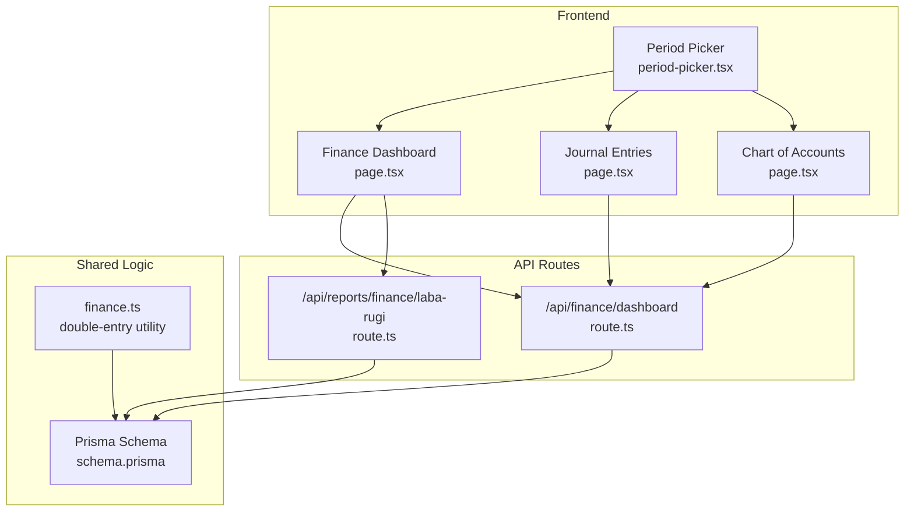
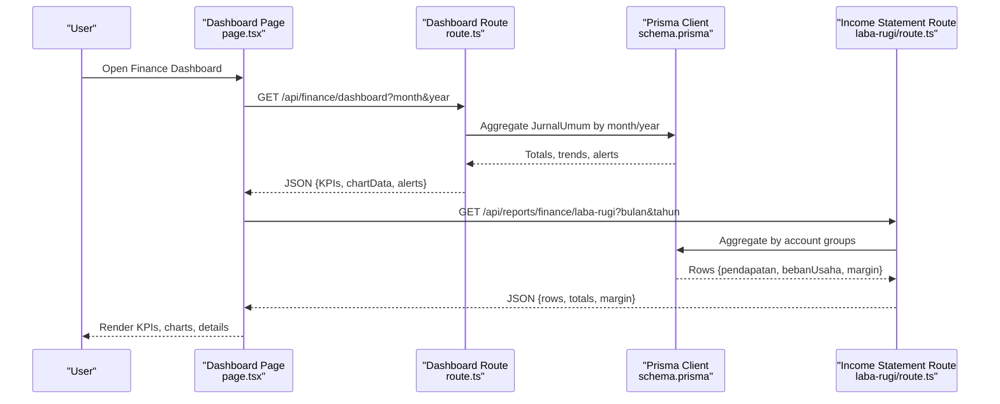
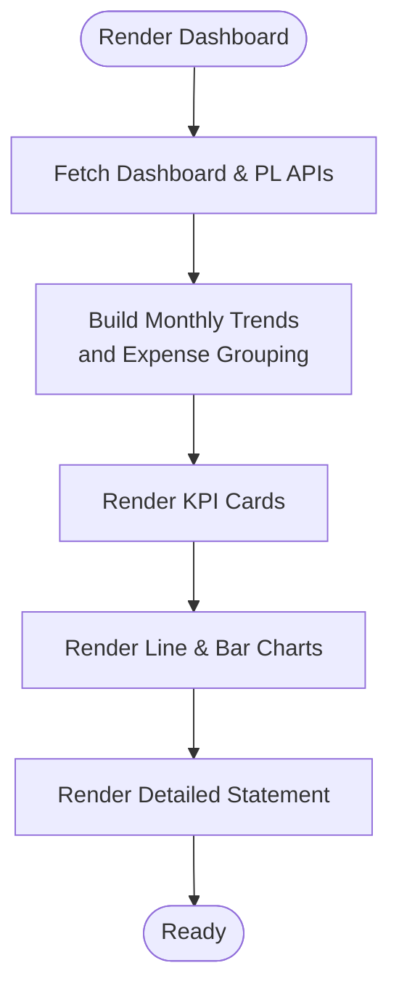
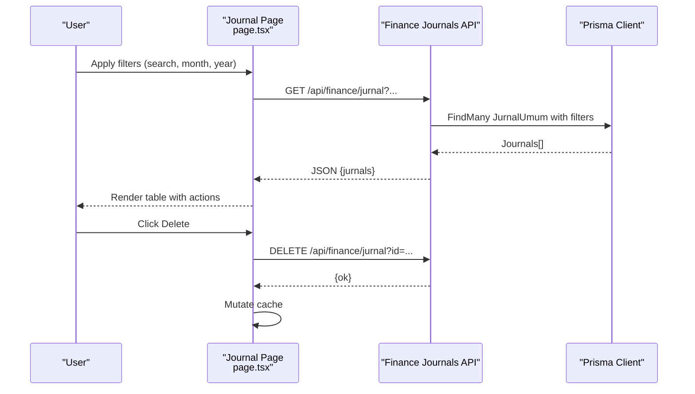
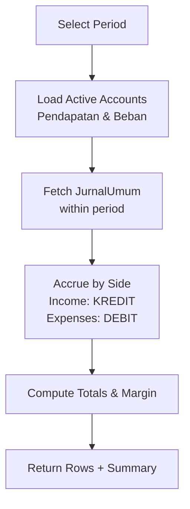
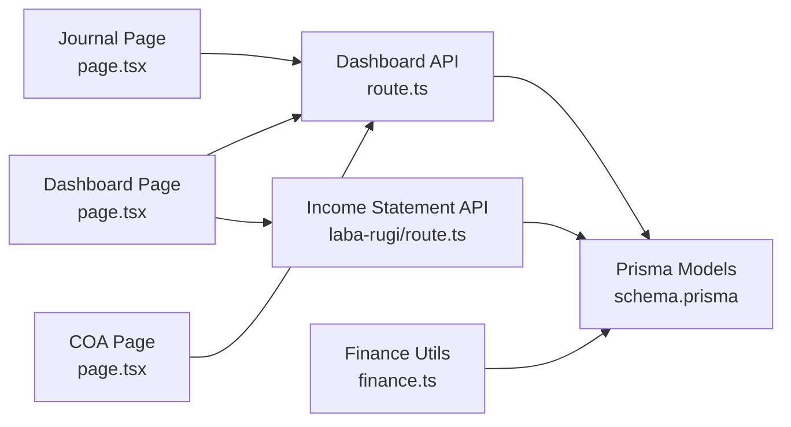

# Financial Dashboard & Analytics

<cite>
**Referenced Files in This Document**
- [finance.ts](file://src/lib/finance.ts)
- [schema.prisma](file://prisma/schema.prisma)
- [page.tsx](file://src/app/(LoggedIn)/finance/dashboard/page.tsx)
- [route.ts](file://src/app/api/finance/dashboard/route.ts)
- [page.tsx](file://src/app/(LoggedIn)/finance/jurnal/page.tsx)
- [page.tsx](file://src/app/(LoggedIn)/finance/akun/page.tsx)
- [route.ts](file://src/app/api/reports/finance/laba-rugi/route.ts)
- [period-picker.tsx](file://src/components/finance/period-picker.tsx)
</cite>

## Table of Contents
1. [Introduction](#introduction)
2. [Project Structure](#project-structure)
3. [Core Components](#core-components)
4. [Architecture Overview](#architecture-overview)
5. [Detailed Component Analysis](#detailed-component-analysis)
6. [Dependency Analysis](#dependency-analysis)
7. [Performance Considerations](#performance-considerations)
8. [Troubleshooting Guide](#troubleshooting-guide)
9. [Conclusion](#conclusion)
10. [Appendices](#appendices)

## Introduction
This document describes the financial dashboard and analytics system, focusing on the dashboard layout, KPIs, financial metrics display, real-time data aggregation, trend analysis, comparative reporting, and financial statements. It also covers profit and loss reporting, charting, period selection, and administrative controls for chart of accounts and journals. Guidance is included for customization, metric configuration, filtering, integration with external systems, data refresh mechanisms, performance optimization, export/scheduling/reporting, and executive reporting.

## Project Structure
The financial domain is organized around:
- Frontend pages under the finance section for dashboard, journal entries, and chart of accounts
- API routes for dashboard summaries and profit/loss reports
- Shared financial utilities and Prisma schema modeling for accounting entities



**Diagram sources**
- [page.tsx](file://src/app/(LoggedIn)/finance/dashboard/page.tsx#L1-L916)
- [page.tsx](file://src/app/(LoggedIn)/finance/jurnal/page.tsx#L1-L155)
- [page.tsx](file://src/app/(LoggedIn)/finance/akun/page.tsx#L1-L248)
- [route.ts:1-259](file://src/app/api/finance/dashboard/route.ts#L1-L259)
- [route.ts:1-122](file://src/app/api/reports/finance/laba-rugi/route.ts#L1-L122)
- [finance.ts:1-55](file://src/lib/finance.ts#L1-L55)
- [schema.prisma:1-675](file://prisma/schema.prisma#L1-L675)
- [period-picker.tsx:1-53](file://src/components/finance/period-picker.tsx#L1-L53)

**Section sources**
- [page.tsx](file://src/app/(LoggedIn)/finance/dashboard/page.tsx#L1-L916)
- [page.tsx](file://src/app/(LoggedIn)/finance/jurnal/page.tsx#L1-L155)
- [page.tsx](file://src/app/(LoggedIn)/finance/akun/page.tsx#L1-L248)
- [route.ts:1-259](file://src/app/api/finance/dashboard/route.ts#L1-L259)
- [route.ts:1-122](file://src/app/api/reports/finance/laba-rugi/route.ts#L1-L122)
- [finance.ts:1-55](file://src/lib/finance.ts#L1-L55)
- [schema.prisma:1-675](file://prisma/schema.prisma#L1-L675)
- [period-picker.tsx:1-53](file://src/components/finance/period-picker.tsx#L1-L53)

## Core Components
- Finance dashboard page renders KPI cards, monthly trend charts, operational expense breakdown, income composition, and detailed financial statement summary.
- Journal page lists general ledger entries with search and filters, supports creation and deletion via modals.
- Chart of accounts page manages COA and cash/bank accounts with tabs and filters.
- API routes compute dashboard KPIs and profit/loss aggregates from journal entries.
- Shared utilities encapsulate double-entry creation for financial events.
- Prisma schema defines financial entities: Payment, JurnalUmum, Akun, KasBank, and supporting enums.

Key responsibilities:
- Real-time aggregation: Dashboard route computes monthly totals and trends from JurnalUmum filtered by date range.
- Comparative reporting: Percentage change vs previous month for revenue, expenses, and net income.
- Profit and loss: Aggregation by account groups (Pendapatan/Beban) to produce income statement rows.
- Balance sheet visualization: Available via chart of accounts and cash/bank listings; detailed balance sheet would require asset/liability aggregations built on top of existing schema.
- Cash flow analysis: Not implemented in the reviewed code; could be derived from JurnalUmum movements to cash accounts.
- Financial ratios: Net profit margin computed from aggregated income statement.

**Section sources**
- [page.tsx](file://src/app/(LoggedIn)/finance/dashboard/page.tsx#L57-L76)
- [route.ts:12-250](file://src/app/api/finance/dashboard/route.ts#L12-L250)
- [route.ts:13-101](file://src/app/api/reports/finance/laba-rugi/route.ts#L13-L101)
- [finance.ts:26-54](file://src/lib/finance.ts#L26-L54)
- [schema.prisma:425-503](file://prisma/schema.prisma#L425-L503)

## Architecture Overview
The system follows a client-server pattern:
- Client-side pages use SWR for data fetching and rendering.
- API routes validate sessions, enforce roles, and query Prisma for financial aggregates.
- Double-entry utilities centralize posting logic for financial events.



**Diagram sources**
- [page.tsx](file://src/app/(LoggedIn)/finance/dashboard/page.tsx#L248-L255)
- [route.ts:12-250](file://src/app/api/finance/dashboard/route.ts#L12-L250)
- [route.ts:104-116](file://src/app/api/reports/finance/laba-rugi/route.ts#L104-L116)
- [schema.prisma:452-480](file://prisma/schema.prisma#L452-L480)

## Detailed Component Analysis

### Finance Dashboard Page
Responsibilities:
- Renders KPI cards for total revenue, total expenses, net income, profit margin, and receivables.
- Displays monthly trend line chart of income vs expenses.
- Shows operational expense breakdown by categories and income composition by segments.
- Provides period navigation (previous/next month) and loading skeletons.

Customization and configuration:
- KPI card appearance and accent colors are configurable via props.
- Income segment list and expense grouping keywords are defined in-page and can be adjusted for different business lines or cost centers.
- Tooltip and axis formatters for currency and compact units.

Filtering:
- Month/year selection via local state and URL query parameters.
- Combined with income/expense grouping and chart rendering.

Real-time aggregation:
- Dashboard route computes yearly chart data and previous-month comparisons for percentage changes.



**Diagram sources**
- [page.tsx](file://src/app/(LoggedIn)/finance/dashboard/page.tsx#L215-L566)
- [route.ts:140-203](file://src/app/api/finance/dashboard/route.ts#L140-L203)
- [route.ts:15-101](file://src/app/api/reports/finance/laba-rugi/route.ts#L15-L101)

**Section sources**
- [page.tsx](file://src/app/(LoggedIn)/finance/dashboard/page.tsx#L1-L916)
- [route.ts:1-259](file://src/app/api/finance/dashboard/route.ts#L1-L259)
- [route.ts:1-122](file://src/app/api/reports/finance/laba-rugi/route.ts#L1-L122)

### Journal Entries Page
Responsibilities:
- Lists general ledger entries with search and advanced filters (month, year).
- Supports adding and deleting manual journal entries via modals.
- Uses SWR for data fetching and mutation after edits.

Filtering and search:
- Debounced search across reference, description, and account names.
- Advanced filters for month and year with reset capability.



**Diagram sources**
- [page.tsx](file://src/app/(LoggedIn)/finance/jurnal/page.tsx#L40-L154)
- [schema.prisma:452-480](file://prisma/schema.prisma#L452-L480)

**Section sources**
- [page.tsx](file://src/app/(LoggedIn)/finance/jurnal/page.tsx#L1-L155)

### Chart of Accounts Page
Responsibilities:
- Manages chart of accounts and cash/bank accounts.
- Tabs separate COA and cash/bank listings.
- Filters by group and status; supports editing for admins.

Administrative controls:
- Editable fields for account metadata and cash/bank records.
- Admin-only actions enforced in frontend.

**Section sources**
- [page.tsx](file://src/app/(LoggedIn)/finance/akun/page.tsx#L1-L248)

### Profit and Loss Reporting
Aggregation logic:
- Filters accounts by groups “PENDAPATAN” and “BEBAN_USAHA”.
- Sums debits and credits per account within the selected period.
- Computes total income, total expenses, net income, and profit margin.



**Diagram sources**
- [route.ts:15-101](file://src/app/api/reports/finance/laba-rugi/route.ts#L15-L101)
- [schema.prisma:425-480](file://prisma/schema.prisma#L425-L480)

**Section sources**
- [route.ts:1-122](file://src/app/api/reports/finance/laba-rugi/route.ts#L1-L122)

### Balance Sheet Visualization
Current state:
- Cash/bank accounts are modeled and exposed via the chart of accounts page.
- Detailed balance sheet computation is not present in the reviewed code; it would require aggregating asset and liability accounts similarly to the income statement.

Recommendation:
- Extend the reporting layer to compute asset/liability totals by account group and render a summarized balance sheet view.

**Section sources**
- [schema.prisma:425-503](file://prisma/schema.prisma#L425-L503)
- [page.tsx](file://src/app/(LoggedIn)/finance/akun/page.tsx#L1-L248)

### Cash Flow Analysis
Current state:
- No dedicated cash flow report exists in the reviewed code.
- Could be implemented by tracking movements to/from cash/bank accounts (KasBank) over time.

Recommendation:
- Add a route that aggregates JurnalUmum movements to/from cash accounts and presents operating/investing/c financing activities.

**Section sources**
- [schema.prisma:488-503](file://prisma/schema.prisma#L488-L503)

### Financial Ratio Calculations
Computed:
- Net profit margin: net income divided by total income, expressed as a percentage.

Extensible:
- Additional ratios (e.g., receivables turnover, inventory turnover) can be derived from the same underlying aggregates.

**Section sources**
- [route.ts:91-100](file://src/app/api/reports/finance/laba-rugi/route.ts#L91-L100)

### Real-Time Data Aggregation and Refresh
Mechanism:
- Client-side SWR hooks fetch data from backend routes.
- Period navigation updates query parameters; data reloads automatically.
- Manual refresh via page reload or action triggers (e.g., after journal edits).

Optimization opportunities:
- Use SWR cache keys aligned with period parameters to avoid redundant requests.
- Debounce search inputs to reduce API calls.

**Section sources**
- [page.tsx](file://src/app/(LoggedIn)/finance/dashboard/page.tsx#L248-L255)
- [page.tsx](file://src/app/(LoggedIn)/finance/jurnal/page.tsx#L54-L58)

### Export Capabilities, Scheduled Reporting, and Executive Reporting
Current state:
- No explicit export or scheduling features are present in the reviewed code.
- Executive reporting dashboards can be built by composing the existing KPIs and charts into custom layouts.

Recommendations:
- Add export endpoints for reports (PDF/Excel) and integrate with a scheduler to generate and email periodic reports.
- Provide role-based views for executive dashboards with preconfigured periods and filters.

[No sources needed since this section provides general guidance]

## Dependency Analysis
The financial dashboard depends on:
- Prisma models for Payments, JurnalUmum, Akun, and KasBank
- Utility functions for double-entry creation
- API routes for dashboard and income statement data
- UI components for charts and tables



**Diagram sources**
- [page.tsx](file://src/app/(LoggedIn)/finance/dashboard/page.tsx#L1-L916)
- [page.tsx](file://src/app/(LoggedIn)/finance/jurnal/page.tsx#L1-L155)
- [page.tsx](file://src/app/(LoggedIn)/finance/akun/page.tsx#L1-L248)
- [route.ts:1-259](file://src/app/api/finance/dashboard/route.ts#L1-L259)
- [route.ts:1-122](file://src/app/api/reports/finance/laba-rugi/route.ts#L1-L122)
- [finance.ts:1-55](file://src/lib/finance.ts#L1-L55)
- [schema.prisma:425-503](file://prisma/schema.prisma#L425-L503)

**Section sources**
- [schema.prisma:425-503](file://prisma/schema.prisma#L425-L503)
- [finance.ts:1-55](file://src/lib/finance.ts#L1-L55)

## Performance Considerations
- Use database indexes on frequently queried fields (dates, foreign keys).
- Limit chart data to relevant periods to reduce payload sizes.
- Cache API responses with SWR and invalidate selectively after edits.
- Batch queries where possible (e.g., dashboard route already uses Promise.all for multiple aggregates).
- Avoid excessive client-side filtering for large datasets; prefer server-side pagination or limits.

[No sources needed since this section provides general guidance]

## Troubleshooting Guide
Common issues and remedies:
- Unauthorized or forbidden access: Ensure proper authentication and admin role checks in API routes.
- Empty or stale data: Verify period parameters and SWR cache keys; trigger manual refresh.
- Incorrect totals: Confirm account groupings and double-entry postings align with business logic.

**Section sources**
- [route.ts:6-10](file://src/app/api/finance/dashboard/route.ts#L6-L10)
- [route.ts:6-11](file://src/app/api/reports/finance/laba-rugi/route.ts#L6-L11)

## Conclusion
The financial dashboard integrates real-time KPIs, trend analysis, and profit/loss reporting through a clean separation of concerns: client pages, API routes, and shared Prisma models. While balance sheet and cash flow views are not yet implemented, the schema and aggregation patterns provide a strong foundation to extend coverage. Administrators can manage chart of accounts and journals, while executives can consume curated dashboards and future exports/scheduled reports.

[No sources needed since this section summarizes without analyzing specific files]

## Appendices

### Data Model Overview (Selected Entities)
```mermaid
erDiagram
AKUN {
string id PK
string kodeAkun UK
string namaAkun
string kelompok
enum posisiNormal
boolean isActive
}
KAS_BANK {
string id PK
string namaRekening
string jenisRekening
string nomorRekening
string akunId FK
boolean isActive
}
JURNAL_UMUM {
string id PK
string ref
datetime tanggal
string keterangan
string namaBiaya
string buktiNota
string akunDebetId FK
string akunKreditId FK
decimal nominal
string paymentId FK?
string penerimaanId FK?
string createdById FK?
}
AKUN ||--o{ JURNAL_UMUM : "debet"
AKUN ||--o{ JURNAL_UMUM : "kredit"
AKUN ||--o{ KAS_BANK : "cash/bank mapping"
```

**Diagram sources**
- [schema.prisma:425-503](file://prisma/schema.prisma#L425-L503)
- [schema.prisma:452-480](file://prisma/schema.prisma#L452-L480)

### Example Customizations and Configurations
- Dashboard period picker: adjust month/year options and visibility.
- Income segments: modify the hardcoded list of income categories to match business units.
- Expense grouping: refine keyword lists to reflect cost centers or departments.
- Filters: extend journal and COA pages with additional filters (e.g., account type, branch).

**Section sources**
- [period-picker.tsx:1-53](file://src/components/finance/period-picker.tsx#L1-L53)
- [page.tsx](file://src/app/(LoggedIn)/finance/dashboard/page.tsx#L283-L298)
- [page.tsx](file://src/app/(LoggedIn)/finance/dashboard/page.tsx#L260-L278)