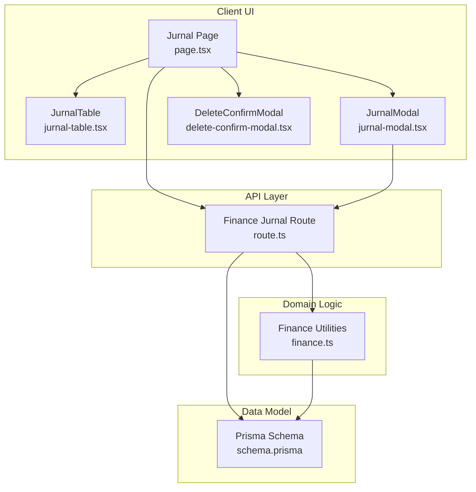
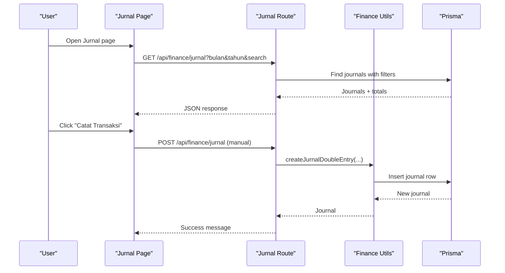
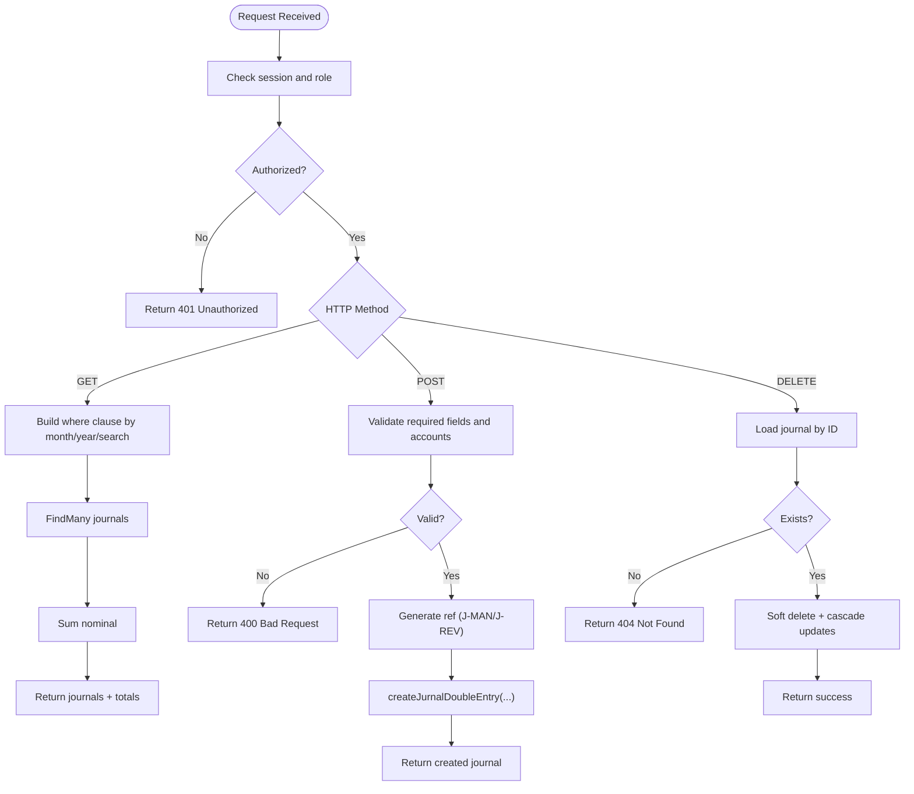
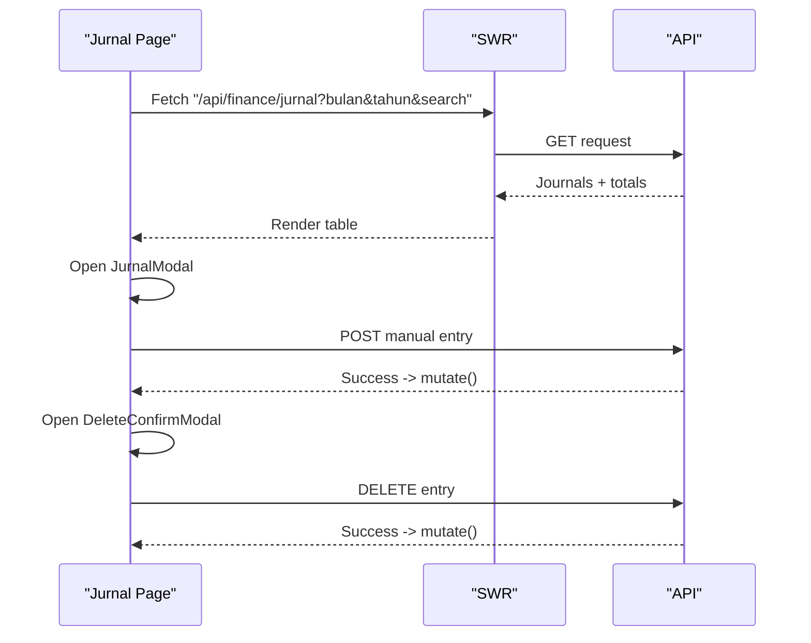
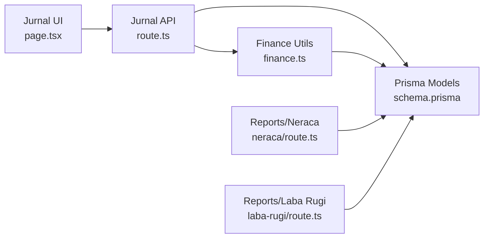

# Journal Entry Processing

<cite>
**Referenced Files in This Document**
- [route.ts](file://src/app/api/finance/jurnal/route.ts)
- [page.tsx](file://src/app/(LoggedIn)/finance/jurnal/page.tsx)
- [layout.tsx](file://src/app/(LoggedIn)/finance/jurnal/layout.tsx)
- [jurnal-table.tsx](file://src/app/(LoggedIn)/finance/jurnal/components/jurnal-table.tsx)
- [jurnal-modal.tsx](file://src/app/(LoggedIn)/finance/jurnal/components/jurnal-modal.tsx)
- [delete-confirm-modal.tsx](file://src/app/(LoggedIn)/finance/jurnal/components/delete-confirm-modal.tsx)
- [finance.ts](file://src/lib/finance.ts)
- [schema.prisma](file://prisma/schema.prisma)
- [09-jurnal-keuangan.mmd](file://diagram/sequence/09-jurnal-keuangan.mmd)
- [neraca/route.ts](file://src/app/api/reports/finance/neraca/route.ts)
- [laba-rugi/route.ts](file://src/app/api/reports/finance/laba-rugi/route.ts)
- [seed-transactions.ts](file://prisma/seed-transactions.ts)
</cite>

## Table of Contents
1. [Introduction](#introduction)
2. [Project Structure](#project-structure)
3. [Core Components](#core-components)
4. [Architecture Overview](#architecture-overview)
5. [Detailed Component Analysis](#detailed-component-analysis)
6. [Dependency Analysis](#dependency-analysis)
7. [Performance Considerations](#performance-considerations)
8. [Troubleshooting Guide](#troubleshooting-guide)
9. [Conclusion](#conclusion)
10. [Appendices](#appendices)

## Introduction
This document explains the journal entry processing system in the POS application. It covers:
- Automated journal entry generation from business transactions
- Manual journal entry creation
- Journal entry approval workflows
- Double-entry accounting principles, debit and credit posting rules, and validation
- Search, filtering, and batch operations (including soft deletion)
- Examples of common journal entries (sales, purchases, payments, receipts, adjustments)
- Journal entry reversal procedures, status tracking, and integration with financial reporting
- Dashboard, analytics, and compliance reporting features

## Project Structure
The journal module is organized around a Next.js app router handler, a client-side page, and reusable UI components. Data modeling is defined via Prisma with strong relations to chart of accounts and related business entities.



**Diagram sources**
- [page.tsx:1-155](file://src/app/(LoggedIn)/finance/jurnal/page.tsx#L1-L155)
- [jurnal-table.tsx:1-225](file://src/app/(LoggedIn)/finance/jurnal/components/jurnal-table.tsx#L1-L225)
- [jurnal-modal.tsx:1-503](file://src/app/(LoggedIn)/finance/jurnal/components/jurnal-modal.tsx#L1-L503)
- [delete-confirm-modal.tsx:1-108](file://src/app/(LoggedIn)/finance/jurnal/components/delete-confirm-modal.tsx#L1-L108)
- [route.ts:1-169](file://src/app/api/finance/jurnal/route.ts#L1-L169)
- [finance.ts:1-55](file://src/lib/finance.ts#L1-L55)
- [schema.prisma:452-480](file://prisma/schema.prisma#L452-L480)

**Section sources**
- [page.tsx:1-155](file://src/app/(LoggedIn)/finance/jurnal/page.tsx#L1-L155)
- [route.ts:1-169](file://src/app/api/finance/jurnal/route.ts#L1-L169)
- [finance.ts:1-55](file://src/lib/finance.ts#L1-L55)
- [schema.prisma:452-480](file://prisma/schema.prisma#L452-L480)

## Core Components
- API endpoint for journal entries: retrieval, creation (manual and reversal), and soft deletion.
- Client page with filters, search, and action controls.
- UI components for viewing, creating, and deleting journal entries.
- Finance utilities implementing double-entry creation.
- Prisma models for journals, accounts, payments, and inventory-related entries.

Key capabilities:
- Retrieve filtered journals by date range and free-text search.
- Create manual journal entries with validated debits/credits and nominal amount.
- Create reversal entries with a dedicated reference scheme.
- Soft delete manual entries and cascade related records.
- Display linked references to payments and inventory receipts.

**Section sources**
- [route.ts:16-82](file://src/app/api/finance/jurnal/route.ts#L16-L82)
- [route.ts:84-125](file://src/app/api/finance/jurnal/route.ts#L84-L125)
- [route.ts:127-168](file://src/app/api/finance/jurnal/route.ts#L127-L168)
- [page.tsx:40-155](file://src/app/(LoggedIn)/finance/jurnal/page.tsx#L40-L155)
- [jurnal-table.tsx:19-35](file://src/app/(LoggedIn)/finance/jurnal/components/jurnal-table.tsx#L19-L35)
- [jurnal-modal.tsx:25-83](file://src/app/(LoggedIn)/finance/jurnal/components/jurnal-modal.tsx#L25-L83)
- [finance.ts:26-54](file://src/lib/finance.ts#L26-L54)
- [schema.prisma:452-480](file://prisma/schema.prisma#L452-L480)

## Architecture Overview
The system follows a layered architecture:
- Presentation: Next.js app router pages and components
- Application: API handlers for CRUD operations on journals
- Domain: Finance utilities encapsulating double-entry logic
- Persistence: Prisma ORM with MySQL



**Diagram sources**
- [page.tsx:54-57](file://src/app/(LoggedIn)/finance/jurnal/page.tsx#L54-L57)
- [route.ts:16-82](file://src/app/api/finance/jurnal/route.ts#L16-L82)
- [route.ts:84-125](file://src/app/api/finance/jurnal/route.ts#L84-L125)
- [finance.ts:26-54](file://src/lib/finance.ts#L26-L54)

## Detailed Component Analysis

### API: Finance Jurnal Endpoint
Responsibilities:
- Authentication and role checks (admin, kasir)
- GET: filter journals by month/year and free-text search; compute total nominal
- POST: create manual or reversal entries with validation and reference generation
- DELETE: soft delete manual entries and cascade related records

Validation and rules:
- Required fields: date, name of expense/receipt, debet/credit account IDs, nominal > 0
- Debet and credit accounts must differ
- Reference prefixes: J-MAN for manual, J-REV for reversals
- Cascading soft delete updates related payment and inventory receipt records



**Diagram sources**
- [route.ts:8-14](file://src/app/api/finance/jurnal/route.ts#L8-L14)
- [route.ts:16-82](file://src/app/api/finance/jurnal/route.ts#L16-L82)
- [route.ts:84-125](file://src/app/api/finance/jurnal/route.ts#L84-L125)
- [route.ts:127-168](file://src/app/api/finance/jurnal/route.ts#L127-L168)
- [finance.ts:26-54](file://src/lib/finance.ts#L26-L54)

**Section sources**
- [route.ts:8-14](file://src/app/api/finance/jurnal/route.ts#L8-L14)
- [route.ts:16-82](file://src/app/api/finance/jurnal/route.ts#L16-L82)
- [route.ts:84-125](file://src/app/api/finance/jurnal/route.ts#L84-L125)
- [route.ts:127-168](file://src/app/api/finance/jurnal/route.ts#L127-L168)
- [finance.ts:26-54](file://src/lib/finance.ts#L26-L54)

### Client Page: Jurnal Page
Features:
- Filters: month, year, and free-text search
- Data fetching via SWR
- Action bar with modal for manual entries and delete confirmation
- Table displaying journals with links to related records



**Diagram sources**
- [page.tsx:54-57](file://src/app/(LoggedIn)/finance/jurnal/page.tsx#L54-L57)
- [page.tsx:60-90](file://src/app/(LoggedIn)/finance/jurnal/page.tsx#L60-L90)
- [page.tsx:139-151](file://src/app/(LoggedIn)/finance/jurnal/page.tsx#L139-L151)
- [route.ts:84-125](file://src/app/api/finance/jurnal/route.ts#L84-L125)
- [route.ts:127-168](file://src/app/api/finance/jurnal/route.ts#L127-L168)

**Section sources**
- [page.tsx:40-155](file://src/app/(LoggedIn)/finance/jurnal/page.tsx#L40-L155)

### UI Components

#### JurnalTable
- Displays journal rows with debet and credit account details
- Shows optional attachments and links to related records (payment/order, inventory receipt)
- Provides delete action for manual entries

**Section sources**
- [jurnal-table.tsx:19-35](file://src/app/(LoggedIn)/finance/jurnal/components/jurnal-table.tsx#L19-L35)
- [jurnal-table.tsx:53-224](file://src/app/(LoggedIn)/finance/jurnal/components/jurnal-table.tsx#L53-L224)

#### JurnalModal
- Supports two modes: expense (outflow) and income (inflow)
- Dynamically assigns debet/credit accounts based on mode and selected accounts
- Uploads supporting documents for expenses
- Validates inputs and submits to the API

**Section sources**
- [jurnal-modal.tsx:25-83](file://src/app/(LoggedIn)/finance/jurnal/components/jurnal-modal.tsx#L25-L83)
- [jurnal-modal.tsx:145-202](file://src/app/(LoggedIn)/finance/jurnal/components/jurnal-modal.tsx#L145-L202)
- [jurnal-modal.tsx:322-378](file://src/app/(LoggedIn)/finance/jurnal/components/jurnal-modal.tsx#L322-L378)
- [jurnal-modal.tsx:432-465](file://src/app/(LoggedIn)/finance/jurnal/components/jurnal-modal.tsx#L432-L465)

#### DeleteConfirmModal
- Confirms deletion of manual entries
- Shows summary details and cascading effects

**Section sources**
- [delete-confirm-modal.tsx:15-107](file://src/app/(LoggedIn)/finance/jurnal/components/delete-confirm-modal.tsx#L15-L107)

### Finance Utilities: Double-Entry Creation
- Encapsulates creation of a single journal row with debet/credit accounts and nominal
- Handles decimal precision and optional fields
- Supports transactional insertion when called within a Prisma transaction

**Section sources**
- [finance.ts:26-54](file://src/lib/finance.ts#L26-L54)

### Data Model: Journals and Accounts
- JurnalUmum model stores ref, date, description, linked accounts, nominal, and optional associations to payments and inventory receipts
- Akun model defines chart of accounts with grouping and normal position (debit/credit)
- Relations enforce referential integrity and enable joins for reporting

```mermaid
erDiagram
AKUN {
string id PK
string kodeAkun
string namaAkun
string kelompok
enum posisiNormal
}
JURNAL_UMUM {
string id PK
string ref
datetime tanggal
string namaBiaya
string buktiNota
string akunDebetId FK
string akunKreditId FK
decimal nominal
string paymentId FK?
string penerimaanId FK?
string createdById FK?
}
AKUN ||--o{ JURNAL_UMUM : "debet"
AKUN ||--o{ JURNAL_UMUM : "kredit"
JURNAL_UMUM }o--|| PAYMENT : "paymentId"
JURNAL_UMUM }o--|| PENERIMAAN_BARANG : "penerimaanId"
```

**Diagram sources**
- [schema.prisma:425-446](file://prisma/schema.prisma#L425-L446)
- [schema.prisma:452-480](file://prisma/schema.prisma#L452-L480)

**Section sources**
- [schema.prisma:425-446](file://prisma/schema.prisma#L425-L446)
- [schema.prisma:452-480](file://prisma/schema.prisma#L452-L480)

## Dependency Analysis
- UI depends on API routes for data and mutations
- API routes depend on finance utilities for double-entry creation
- Finance utilities and API routes depend on Prisma models for persistence
- Reports depend on journals to compute balances and income statement items



**Diagram sources**
- [page.tsx:1-155](file://src/app/(LoggedIn)/finance/jurnal/page.tsx#L1-L155)
- [route.ts:1-169](file://src/app/api/finance/jurnal/route.ts#L1-L169)
- [finance.ts:1-55](file://src/lib/finance.ts#L1-L55)
- [schema.prisma:452-480](file://prisma/schema.prisma#L452-L480)
- [neraca/route.ts:29-66](file://src/app/api/reports/finance/neraca/route.ts#L29-L66)
- [laba-rugi/route.ts:31-72](file://src/app/api/reports/finance/laba-rugi/route.ts#L31-L72)

**Section sources**
- [route.ts:1-169](file://src/app/api/finance/jurnal/route.ts#L1-L169)
- [finance.ts:1-55](file://src/lib/finance.ts#L1-L55)
- [schema.prisma:452-480](file://prisma/schema.prisma#L452-L480)
- [neraca/route.ts:29-66](file://src/app/api/reports/finance/neraca/route.ts#L29-L66)
- [laba-rugi/route.ts:31-72](file://src/app/api/reports/finance/laba-rugi/route.ts#L31-L72)

## Performance Considerations
- Pagination and limits: GET endpoint applies a default limit and supports explicit limit queries to avoid large payloads.
- Index usage: Prisma models define indexes on date, debet and credit account IDs, and payment IDs to optimize filtering and joins.
- Efficient aggregation: Total nominal is computed client-side from fetched rows to minimize database load.
- Transactional writes: Double-entry creation uses a single insert operation; reversal entries reuse the same path.

Recommendations:
- Add server-side pagination parameters for large datasets.
- Consider adding composite indexes for frequent filter combinations (date + account).
- Cache frequently accessed report slices if needed.

**Section sources**
- [route.ts:27-77](file://src/app/api/finance/jurnal/route.ts#L27-L77)
- [schema.prisma:475-479](file://prisma/schema.prisma#L475-L479)

## Troubleshooting Guide
Common issues and resolutions:
- Unauthorized or forbidden access: Ensure the user has admin or kasir role; API enforces role checks.
- Validation errors on creation:
  - Missing required fields or invalid nominal
  - Debet and credit accounts are identical
- Deletion failures:
  - Entry not found by ID
  - Only manual entries can be deleted; automatic entries are not deletable via this endpoint
- Cascading behavior:
  - Deleting a manual journal also soft-deletes related payment and inventory receipt records

Operational tips:
- Use the search box to locate entries quickly by reference, description, or account names.
- Confirm deletion in the delete modal; the action is irreversible.
- Verify account groups and normal positions when building reports to ensure correct balances.

**Section sources**
- [route.ts:8-14](file://src/app/api/finance/jurnal/route.ts#L8-L14)
- [route.ts:93-98](file://src/app/api/finance/jurnal/route.ts#L93-L98)
- [route.ts:133-137](file://src/app/api/finance/jurnal/route.ts#L133-L137)
- [route.ts:141-161](file://src/app/api/finance/jurnal/route.ts#L141-L161)
- [delete-confirm-modal.tsx:42-53](file://src/app/(LoggedIn)/finance/jurnal/components/delete-confirm-modal.tsx#L42-L53)

## Conclusion
The journal entry processing system integrates manual and automated entries with robust validation, double-entry accounting, and lifecycle management. It provides flexible filtering, reporting-ready data, and safe deletion with cascades. The modular design enables future enhancements such as approvals, batch operations, and expanded reporting.

## Appendices

### Double-Entry Accounting Principles and Posting Rules
- Every journal entry must have equal debet and credit amounts.
- Debets increase asset and expense accounts; credits increase liability, equity, and revenue accounts.
- The system enforces that debet and credit accounts differ and that nominal is positive.

**Section sources**
- [finance.ts:26-54](file://src/lib/finance.ts#L26-L54)
- [schema.prisma:425-446](file://prisma/schema.prisma#L425-L446)

### Approval Workflows
- Current implementation allows admin and kasir to create and delete manual entries.
- No explicit approval step exists in the reviewed code; approvals would require extending the model and API to support status transitions.

**Section sources**
- [route.ts:8-14](file://src/app/api/finance/jurnal/route.ts#L8-L14)

### Journal Entry Examples
- Sales (cash/transfer): Debit cash account, Credit sales/revenue account
- Purchase (expense): Debit expense account, Credit cash/bank account
- Payment to supplier: Debit expense or asset account, Credit bank/cash account
- Receipt (income): Debit cash account, Credit income account
- Adjustments: Use reversal entries (J-REV) to correct prior periods

Note: Example references are illustrative; actual postings depend on configured accounts and normal positions.

**Section sources**
- [schema.prisma:425-446](file://prisma/schema.prisma#L425-L446)
- [seed-transactions.ts:335-362](file://prisma/seed-transactions.ts#L335-L362)

### Reversal Procedures
- Create a reversal entry with isReversal flag and reference to the original entry
- Reference prefix J-REV indicates correction entries
- Use the same debet/credit accounts as the original to reverse the effect

**Section sources**
- [route.ts:90-103](file://src/app/api/finance/jurnal/route.ts#L90-L103)
- [route.ts:105-120](file://src/app/api/finance/jurnal/route.ts#L105-L120)

### Search, Filtering, and Batch Operations
- Search: Free-text search across description, expense name, reference, and account names
- Filters: Month/year selection; defaults to current month/year if not specified
- Batch operations: Soft delete per entry; no multi-select delete in the reviewed UI
- Pagination: Limit parameter supported; default applied if omitted

**Section sources**
- [route.ts:22-50](file://src/app/api/finance/jurnal/route.ts#L22-L50)
- [page.tsx:50-57](file://src/app/(LoggedIn)/finance/jurnal/page.tsx#L50-L57)

### Integration with Financial Reporting
- Balance Sheet (Neraca): Computes balances by account and normal position up to a date
- Income Statement (Laba Rugi): Aggregates revenues and expenses by account group

**Section sources**
- [neraca/route.ts:29-66](file://src/app/api/reports/finance/neraca/route.ts#L29-L66)
- [laba-rugi/route.ts:31-72](file://src/app/api/reports/finance/laba-rugi/route.ts#L31-L72)

### Dashboard, Analytics, and Compliance Reporting
- The finance dashboard page exists and can surface journal metrics and summaries.
- Compliance: Soft deletes preserve audit trails; reversal entries mark corrections.

**Section sources**
- [layout.tsx:1-11](file://src/app/(LoggedIn)/finance/dashboard/layout.tsx#L1-L11)
- [page.tsx:92-97](file://src/app/(LoggedIn)/finance/jurnal/page.tsx#L92-L97)
- [route.ts:139-161](file://src/app/api/finance/jurnal/route.ts#L139-L161)