# Multi-Rekening (Multiple Account) Support

<cite>
**Referenced Files in This Document**
- [schema.prisma](file://prisma/schema.prisma)
- [seed-transactions.ts](file://prisma/seed-transactions.ts)
- [route.ts](file://src/app/api/finance/akun/route.ts)
- [route.ts](file://src/app/api/finance/kas-bank/route.ts)
- [finance.ts](file://src/lib/finance.ts)
- [route.ts](file://src/app/api/order/[id]/payment/route.ts)
- [route.ts](file://src/app/api/finance/piutang/route.ts)
- [page.tsx](file://src/app/(LoggedIn)/reports/piutang/page.tsx)
- [route.ts](file://src/app/api/reports/finance/neraca/route.ts)
- [page.tsx](file://src/app/(LoggedIn)/reports/neraca/page.tsx)
- [route.ts](file://src/app/api/reports/finance/tabungan/route.ts)
- [akun-modal.tsx](file://src/app/(LoggedIn)/finance/akun/components/akun-modal.tsx)
- [akun-table.tsx](file://src/app/(LoggedIn)/finance/akun/components/akun-table.tsx)
- [part4-keuangan.plantuml](file://diagram/class/part4-keuangan.plantuml)
</cite>

## Table of Contents
1. [Introduction](#introduction)
2. [Project Structure](#project-structure)
3. [Core Components](#core-components)
4. [Architecture Overview](#architecture-overview)
5. [Detailed Component Analysis](#detailed-component-analysis)
6. [Dependency Analysis](#dependency-analysis)
7. [Performance Considerations](#performance-considerations)
8. [Troubleshooting Guide](#troubleshooting-guide)
9. [Conclusion](#conclusion)
10. [Appendices](#appendices)

## Introduction
This document explains the multi-rekening (multiple account) support system implemented in the application. It covers how customer and supplier accounts are managed, how receivables and payables are tracked across multiple accounts, and how journal entries are recorded against chart of accounts and bank/cash accounts. It also documents account allocation mechanisms, payment distribution algorithms, reconciliation processes, aging analysis, credit limits, inter-company transactions, consolidated reporting, and integrations with order processing and payment collection.

## Project Structure
The multi-account system spans several layers:
- Data model layer (Prisma schema) defines accounts, journals, cash/bank accounts, orders, payments, and suppliers/customers.
- API routes implement CRUD and transactional operations for chart of accounts, cash/bank accounts, payments, receivables, and reports.
- Frontend components manage account creation/editing and display receivable reports.
- Finance utilities encapsulate double-entry journal creation.
- Seed scripts demonstrate typical allocations to savings accounts and supplier payment flows.

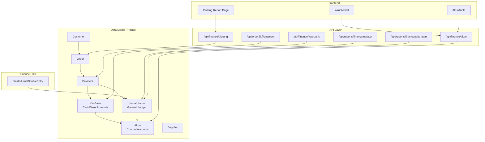

**Diagram sources**
- [schema.prisma](file://prisma/schema.prisma)
- [route.ts](file://src/app/api/finance/akun/route.ts)
- [route.ts](file://src/app/api/finance/kas-bank/route.ts)
- [finance.ts](file://src/lib/finance.ts)
- [route.ts](file://src/app/api/order/[id]/payment/route.ts)
- [route.ts](file://src/app/api/finance/piutang/route.ts)
- [route.ts](file://src/app/api/reports/finance/neraca/route.ts)
- [route.ts](file://src/app/api/reports/finance/tabungan/route.ts)
- [akun-modal.tsx](file://src/app/(LoggedIn)/finance/akun/components/akun-modal.tsx)
- [akun-table.tsx](file://src/app/(LoggedIn)/finance/akun/components/akun-table.tsx)

**Section sources**
- [schema.prisma](file://prisma/schema.prisma)
- [route.ts](file://src/app/api/finance/akun/route.ts)
- [route.ts](file://src/app/api/finance/kas-bank/route.ts)
- [finance.ts](file://src/lib/finance.ts)
- [route.ts](file://src/app/api/order/[id]/payment/route.ts)
- [route.ts](file://src/app/api/finance/piutang/route.ts)
- [route.ts](file://src/app/api/reports/finance/neraca/route.ts)
- [route.ts](file://src/app/api/reports/finance/tabungan/route.ts)
- [akun-modal.tsx](file://src/app/(LoggedIn)/finance/akun/components/akun-modal.tsx)
- [akun-table.tsx](file://src/app/(LoggedIn)/finance/akun/components/akun-table.tsx)

## Core Components
- Chart of Accounts (Akun): Defines account codes, groups, and normal positions for balance calculations.
- Cash/Bank Accounts (KasBank): Links to a chart of accounts and aggregates balances via journal entries.
- General Journal (JurnalUmum): Double-entry records linking debits/credits to accounts.
- Payments (Payment): Records cash/bank inflows/outflows against orders and links to journals.
- Receivables (Piutang): Tracks unpaid and partial payments per order/customer.
- Reports: Balance sheet, receivable summary, and savings aggregation.

Key implementation references:
- Account CRUD and auto-code generation: [route.ts](file://src/app/api/finance/akun/route.ts)
- Cash/bank listing with computed balances: [route.ts](file://src/app/api/finance/kas-bank/route.ts)
- Payment recording and journal creation: [route.ts](file://src/app/api/order/[id]/payment/route.ts)
- Receivable listing and aging: [route.ts](file://src/app/api/finance/piutang/route.ts), [page.tsx](file://src/app/(LoggedIn)/reports/piutang/page.tsx)
- Balance sheet and normal position handling: [route.ts](file://src/app/api/reports/finance/neraca/route.ts), [page.tsx](file://src/app/(LoggedIn)/reports/neraca/page.tsx)
- Savings aggregation: [route.ts](file://src/app/api/reports/finance/tabungan/route.ts)
- Journal utility: [finance.ts](file://src/lib/finance.ts)

**Section sources**
- [route.ts](file://src/app/api/finance/akun/route.ts)
- [route.ts](file://src/app/api/finance/kas-bank/route.ts)
- [finance.ts](file://src/lib/finance.ts)
- [route.ts](file://src/app/api/order/[id]/payment/route.ts)
- [route.ts](file://src/app/api/finance/piutang/route.ts)
- [page.tsx](file://src/app/(LoggedIn)/reports/piutang/page.tsx)
- [route.ts](file://src/app/api/reports/finance/neraca/route.ts)
- [page.tsx](file://src/app/(LoggedIn)/reports/neraca/page.tsx)
- [route.ts](file://src/app/api/reports/finance/tabungan/route.ts)

## Architecture Overview
The system follows a double-entry bookkeeping architecture:
- Orders generate Receivables (debit accounts like “Accounts Receivable”).
- Payments allocate to Cash/Bank (credit accounts like “Accounts Receivable”) and update order status.
- Journal entries are created automatically for each payment.
- Cash/Bank balances are derived from journal totals per account.
- Reports compute totals by normal positions and groupings.

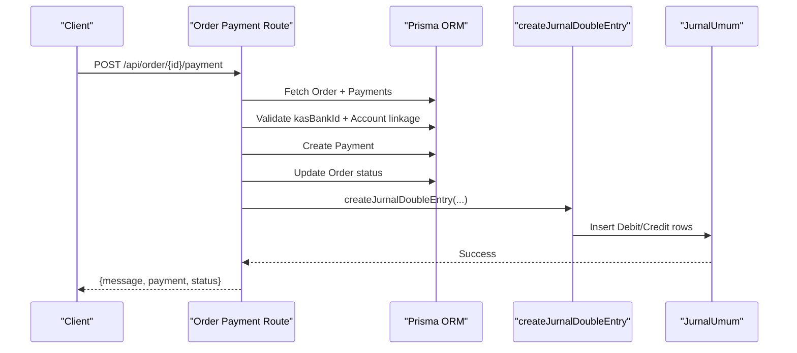

**Diagram sources**
- [route.ts](file://src/app/api/order/[id]/payment/route.ts)
- [finance.ts](file://src/lib/finance.ts)

**Section sources**
- [route.ts](file://src/app/api/order/[id]/payment/route.ts)
- [finance.ts](file://src/lib/finance.ts)

## Detailed Component Analysis

### Chart of Accounts Management
- Auto-generates account codes by group prefix.
- Creates linked Cash/Bank records optionally during account creation.
- Updates Cash/Bank names when account names change.

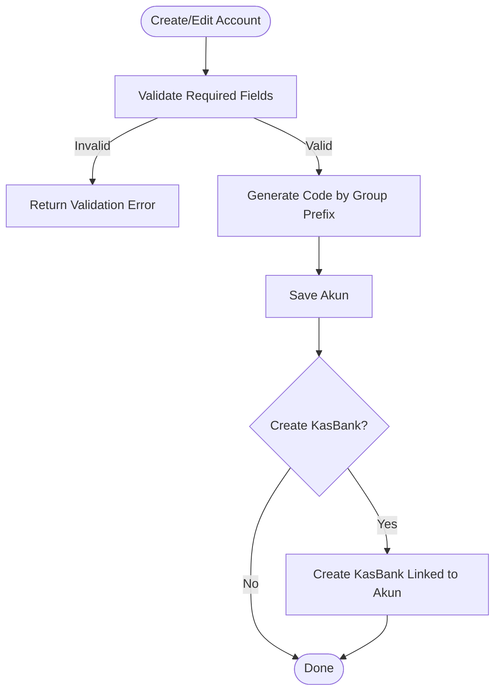

**Diagram sources**
- [route.ts](file://src/app/api/finance/akun/route.ts)

**Section sources**
- [route.ts](file://src/app/api/finance/akun/route.ts)
- [akun-modal.tsx](file://src/app/(LoggedIn)/finance/akun/components/akun-modal.tsx)
- [akun-table.tsx](file://src/app/(LoggedIn)/finance/akun/components/akun-table.tsx)

### Cash/Bank Account Balancing
- Lists all cash/bank accounts with computed balances by summing debits and credits from journals.
- Assumes asset accounts are normally debited; balance = total debet − total kredit.

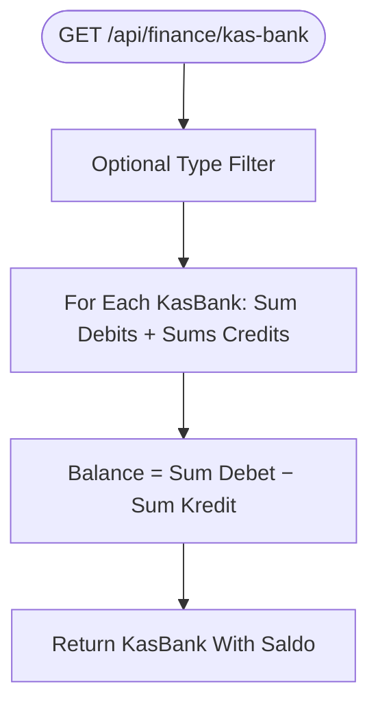

**Diagram sources**
- [route.ts](file://src/app/api/finance/kas-bank/route.ts)

**Section sources**
- [route.ts](file://src/app/api/finance/kas-bank/route.ts)

### Payment Distribution and Journal Creation
- Validates payment amount vs. outstanding invoice.
- Allocates to the selected Cash/Bank account’s linked Chart of Accounts.
- Generates double-entry journal: Debit Cash/Bank, Credit Receivable.
- Updates order payment status (Unpaid, Down Payment, Paid).

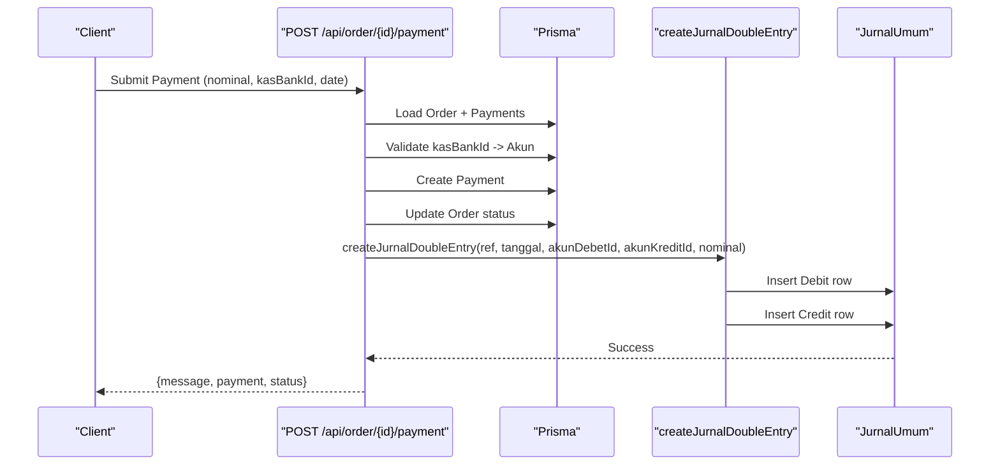

**Diagram sources**
- [route.ts](file://src/app/api/order/[id]/payment/route.ts)
- [finance.ts](file://src/lib/finance.ts)

**Section sources**
- [route.ts](file://src/app/api/order/[id]/payment/route.ts)
- [finance.ts](file://src/lib/finance.ts)

### Receivable Tracking and Aging
- Receivable list filters by unpaid and down-payment statuses.
- Computes paid and remaining amounts per order.
- Frontend report displays aging buckets (e.g., current, overdue).

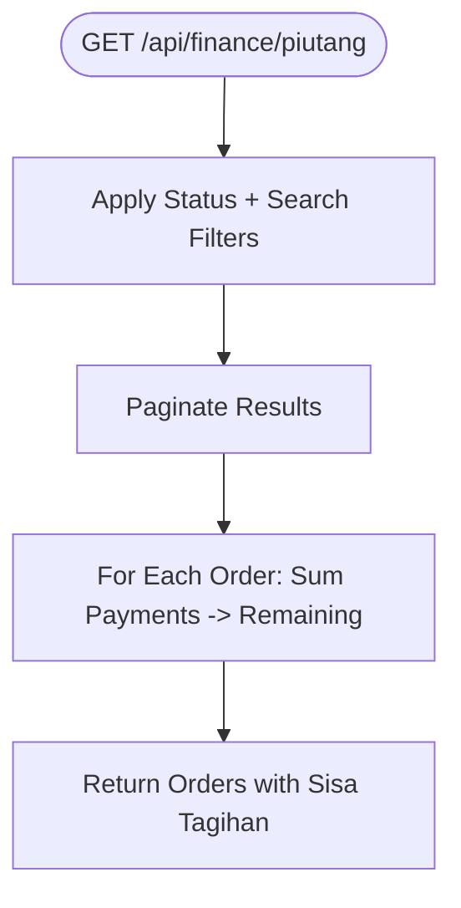

**Diagram sources**
- [route.ts](file://src/app/api/finance/piutang/route.ts)
- [page.tsx](file://src/app/(LoggedIn)/reports/piutang/page.tsx)

**Section sources**
- [route.ts](file://src/app/api/finance/piutang/route.ts)
- [page.tsx](file://src/app/(LoggedIn)/reports/piutang/page.tsx)

### Balance Sheet and Normal Position Handling
- Aggregates journal totals by account and applies normal position rules to compute group balances.
- Groups accounts by classification (e.g., Current Assets, Liabilities, Equity, Income, Expenses).
- Ensures balance sheet equality (Assets = Liabilities + Equity).

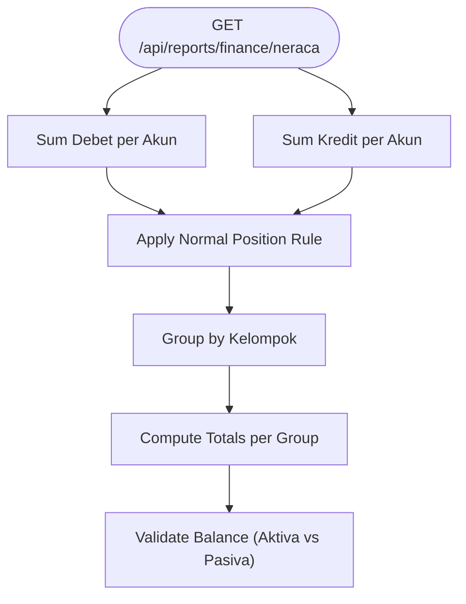

**Diagram sources**
- [route.ts](file://src/app/api/reports/finance/neraca/route.ts)
- [page.tsx](file://src/app/(LoggedIn)/reports/neraca/page.tsx)

**Section sources**
- [route.ts](file://src/app/api/reports/finance/neraca/route.ts)
- [page.tsx](file://src/app/(LoggedIn)/reports/neraca/page.tsx)

### Savings (Tabungan) Allocation Reporting
- Aggregates journal entries for accounts whose names contain “Tabungan”.
- Sums by month for trend analysis.

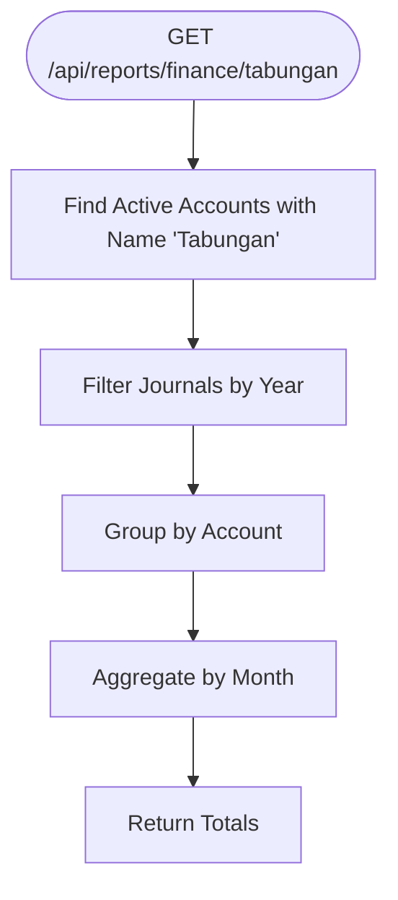

**Diagram sources**
- [route.ts](file://src/app/api/reports/finance/tabungan/route.ts)

**Section sources**
- [route.ts](file://src/app/api/reports/finance/tabungan/route.ts)

### Supplier Payment and Inter-Company Transactions
- Supplier purchases create journal entries: Debit expense (e.g., Cost of Goods Sold), Credit Accounts Payable.
- Periodic supplier payments reverse Accounts Payable (Debit) and Cash/Bank (Credit).
- Savings allocations demonstrate multi-account transfers from Cash/Bank to multiple “Tabungan” accounts.

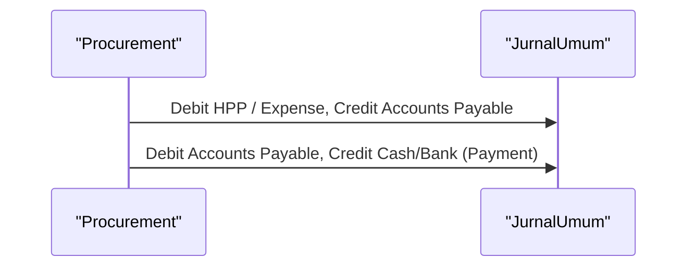

**Diagram sources**
- [seed-transactions.ts](file://prisma/seed-transactions.ts)

**Section sources**
- [seed-transactions.ts](file://prisma/seed-transactions.ts)

### Credit Limit Management
- Credit limits are not modeled in the current schema. Receivable aging and outstanding balances can be used to assess risk and inform credit decisions externally to the system.

[No sources needed since this section provides general guidance]

### Consolidation and Transfer Capabilities
- Consolidation: Use report endpoints to aggregate by account grouping and normal positions for consolidated views.
- Transfers: Multi-account transfers can be modeled as journal entries moving funds between Cash/Bank accounts while maintaining double-entry integrity.

[No sources needed since this section provides general guidance]

### Practical Examples
- Large customer multi-account setup: Create separate Cash/Bank accounts per customer segment and allocate revenue to a receivable account per segment. Track receivables per segment via the receivable report.
- Inter-company transactions: Use expense and payable accounts to record transfers between legal entities; reconcile via journal entries and reports.
- Consolidated reporting: Use the balance sheet endpoint to produce consolidated statements by normal positions and account groups.

[No sources needed since this section provides general guidance]

## Dependency Analysis
The following diagram maps core dependencies among modules:

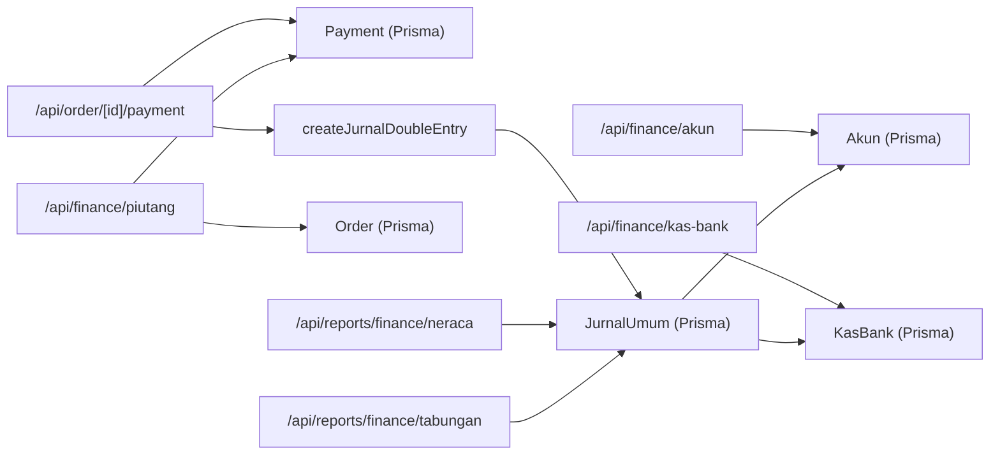

**Diagram sources**
- [route.ts](file://src/app/api/finance/akun/route.ts)
- [route.ts](file://src/app/api/finance/kas-bank/route.ts)
- [finance.ts](file://src/lib/finance.ts)
- [route.ts](file://src/app/api/order/[id]/payment/route.ts)
- [route.ts](file://src/app/api/finance/piutang/route.ts)
- [route.ts](file://src/app/api/reports/finance/neraca/route.ts)
- [route.ts](file://src/app/api/reports/finance/tabungan/route.ts)
- [schema.prisma](file://prisma/schema.prisma)

**Section sources**
- [schema.prisma](file://prisma/schema.prisma)
- [route.ts](file://src/app/api/finance/akun/route.ts)
- [route.ts](file://src/app/api/finance/kas-bank/route.ts)
- [finance.ts](file://src/lib/finance.ts)
- [route.ts](file://src/app/api/order/[id]/payment/route.ts)
- [route.ts](file://src/app/api/finance/piutang/route.ts)
- [route.ts](file://src/app/api/reports/finance/neraca/route.ts)
- [route.ts](file://src/app/api/reports/finance/tabungan/route.ts)

## Performance Considerations
- Prefer indexed fields (e.g., account codes, journal dates) for fast filtering and aggregation.
- Batch report queries using pagination and selective field selection.
- Use aggregated queries (sums) instead of scanning entire journal tables when computing balances.
- Cache frequently accessed account lists and cash/bank balances.

[No sources needed since this section provides general guidance]

## Troubleshooting Guide
Common issues and resolutions:
- Unauthorized or forbidden access to endpoints: Verify user roles and session checks in API routes.
- Payment exceeds outstanding amount: The payment route validates remaining balance and rejects overpayments.
- Missing linked account on Cash/Bank: Ensure the Cash/Bank record has a valid account linkage before posting payments.
- Reconciling balances: Use the Cash/Bank endpoint to compute balances from journals; verify normal position rules in reports.

**Section sources**
- [route.ts](file://src/app/api/order/[id]/payment/route.ts)
- [route.ts](file://src/app/api/finance/kas-bank/route.ts)
- [route.ts](file://src/app/api/finance/akun/route.ts)

## Conclusion
The multi-rekening system leverages a robust chart of accounts, cash/bank linkage, and automatic double-entry journaling to support multi-account receivable/payable tracking, aging analysis, and consolidated reporting. While credit limits are not currently modeled, the system provides strong primitives for modeling inter-company transfers, savings allocations, and reconciliations.

## Appendices
- Class relationships for financial entities:

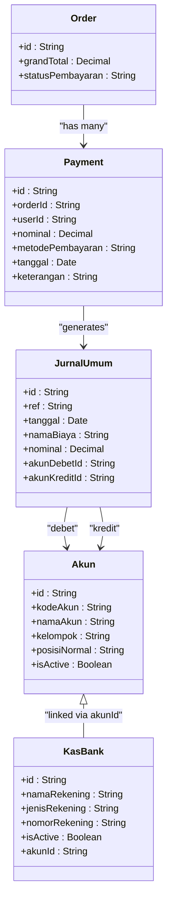

**Diagram sources**
- [schema.prisma](file://prisma/schema.prisma)
- [part4-keuangan.plantuml](file://diagram/class/part4-keuangan.plantuml)