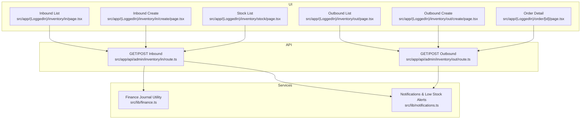
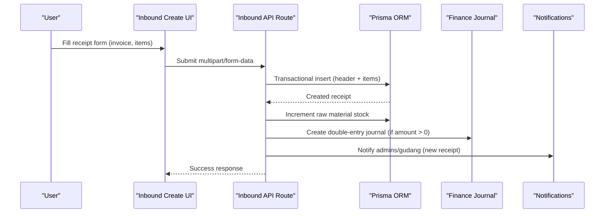
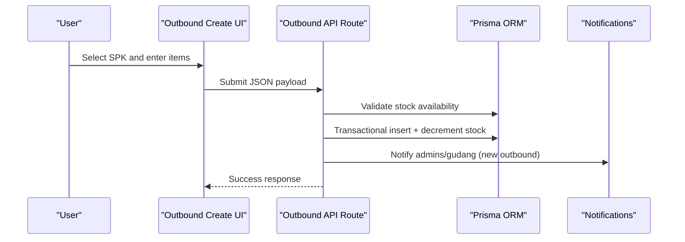
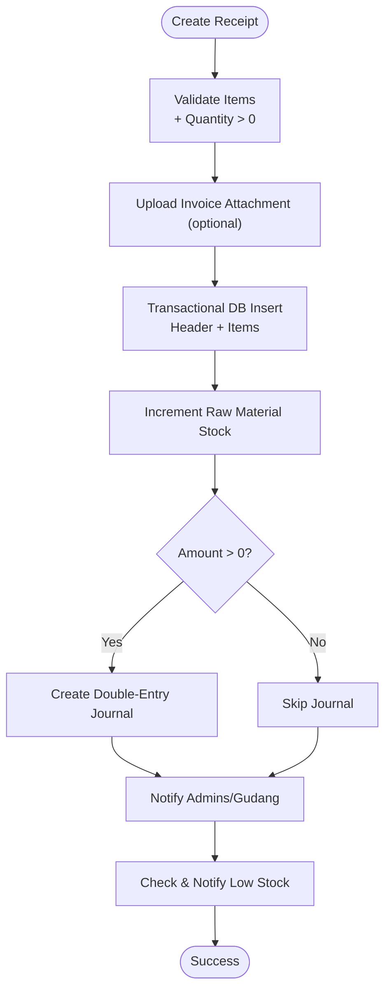
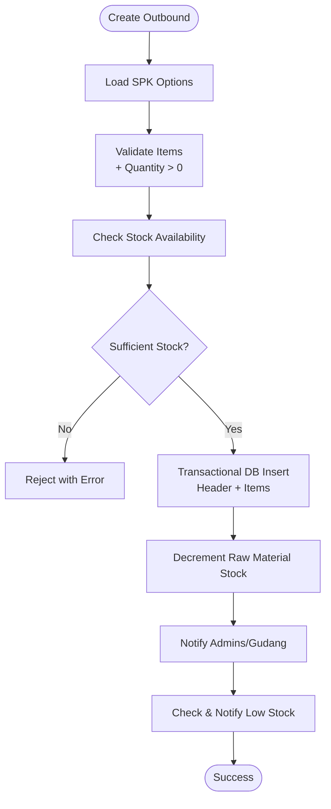
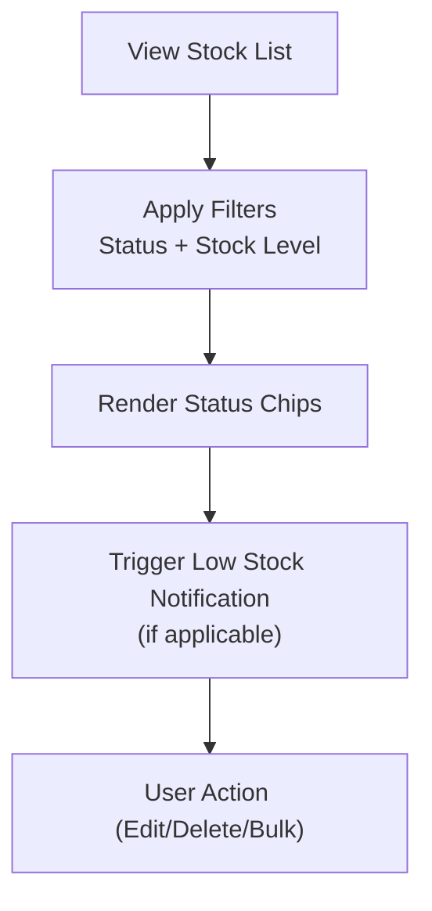
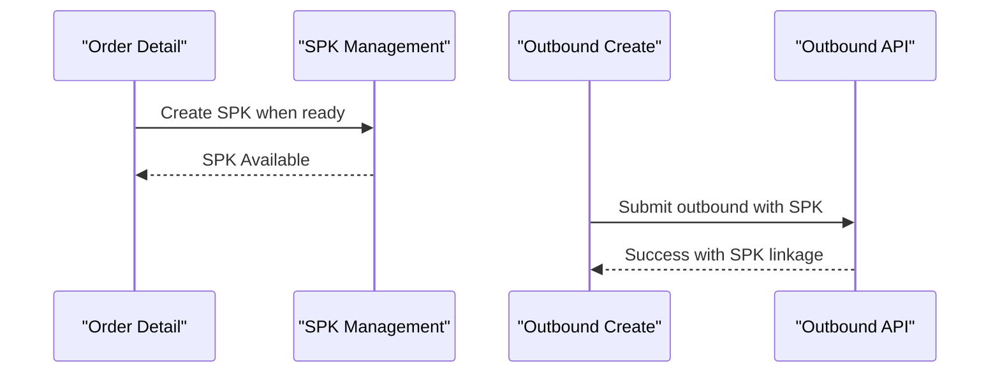
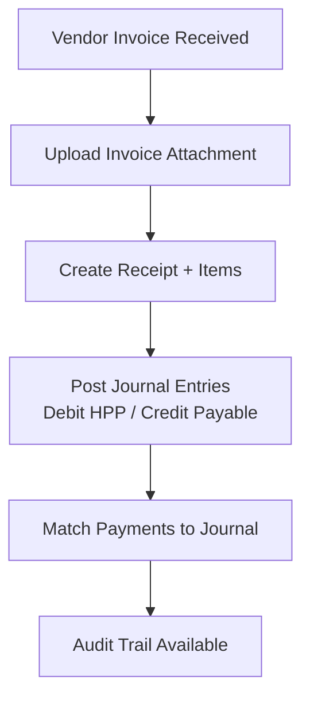
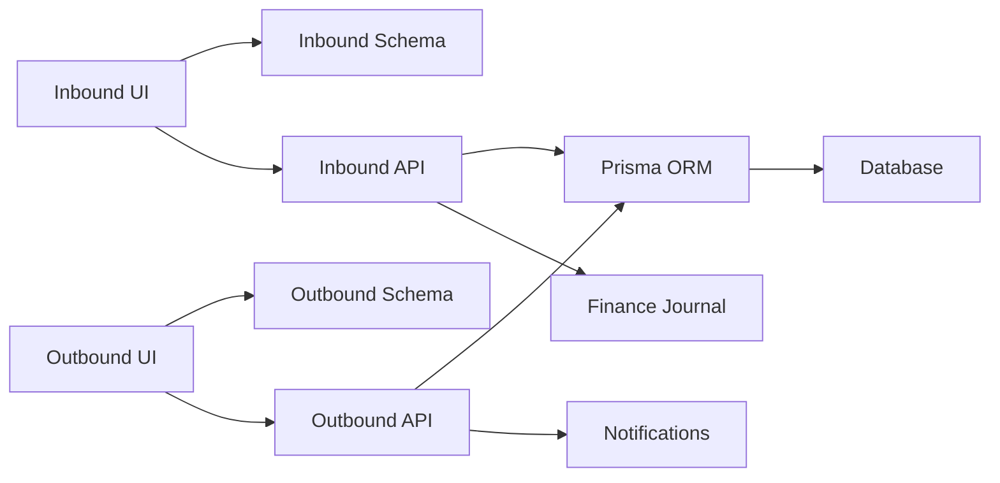
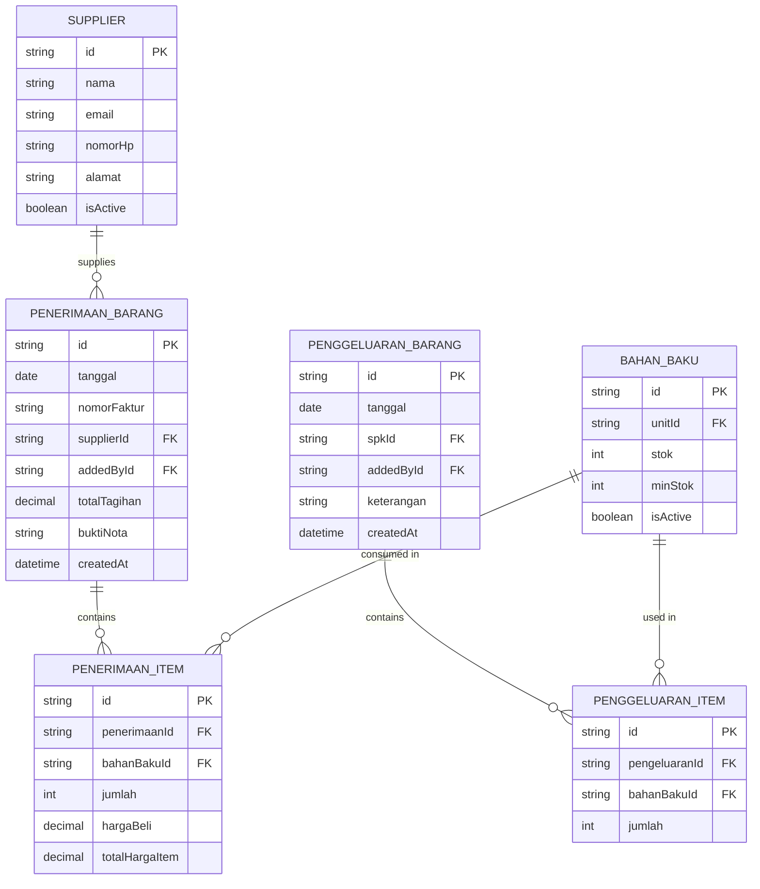

# Inbound & Outbound Processes

<cite>
**Referenced Files in This Document**
- [src/app/(LoggedIn)/inventory/in/page.tsx](file://src/app/(LoggedIn)/inventory/in/page.tsx)
- [src/app/(LoggedIn)/inventory/out/page.tsx](file://src/app/(LoggedIn)/inventory/out/page.tsx)
- [src/app/(LoggedIn)/inventory/stock/page.tsx](file://src/app/(LoggedIn)/inventory/stock/page.tsx)
- [src/app/(LoggedIn)/inventory/in/create/page.tsx](file://src/app/(LoggedIn)/inventory/in/create/page.tsx)
- [src/app/(LoggedIn)/inventory/out/create/page.tsx](file://src/app/(LoggedIn)/inventory/out/create/page.tsx)
- [src/app/api/admin/inventory/in/route.ts](file://src/app/api/admin/inventory/in/route.ts)
- [src/app/api/admin/inventory/out/route.ts](file://src/app/api/admin/inventory/out/route.ts)
- [src/app/(LoggedIn)/order/[id]/page.tsx](file://src/app/(LoggedIn)/order/[id]/page.tsx)
- [src/app/(LoggedIn)/dashboard/page.tsx](file://src/app/(LoggedIn)/dashboard/page.tsx)
- [src/app/(LoggedIn)/inventory/in/create/schema.ts](file://src/app/(LoggedIn)/inventory/in/create/schema.ts)
- [src/app/(LoggedIn)/inventory/out/create/schema.ts](file://src/app/(LoggedIn)/inventory/out/create/schema.ts)
- [src/lib/notifications.ts](file://src/lib/notifications.ts)
- [src/lib/finance.ts](file://src/lib/finance.ts)
- [src/types/types.ts](file://src/types/types.ts)
</cite>

## Table of Contents
1. [Introduction](#introduction)
2. [Project Structure](#project-structure)
3. [Core Components](#core-components)
4. [Architecture Overview](#architecture-overview)
5. [Detailed Component Analysis](#detailed-component-analysis)
6. [Dependency Analysis](#dependency-analysis)
7. [Performance Considerations](#performance-considerations)
8. [Troubleshooting Guide](#troubleshooting-guide)
9. [Conclusion](#conclusion)
10. [Appendices](#appendices)

## Introduction
This document explains inbound and outbound inventory processes in the system, covering stock entry for purchases, returns, transfers, and adjustments; stock exit for production consumption, sales dispatch, internal transfers, and waste; purchase order integration and vendor invoice processing; payment reconciliation; stock movement tracking; batch and serial number management; expiry date monitoring; and quality control procedures. It also documents practical examples, approval workflows, real-time stock updates, and inventory audit trails, along with integrations to procurement, supplier portals, and warehouse management processes.

## Project Structure
The inventory module is organized under the “Inventory” section of the logged-in dashboard. It includes:
- Inbound: Receipt listing, creation, and detail modal
- Outbound: Production consumption listing, creation, and detail modal
- Stock: Real-time stock view with filters and alerts
- Supporting APIs: Transactional endpoints for receipts and exits with journaling and notifications
- Order integration: SPK-driven outbound entries linked to orders

**Diagram sources**
- [src/app/(LoggedIn)/inventory/in/page.tsx](file://src/app/(LoggedIn)/inventory/in/page.tsx#L1-L403)
- [src/app/(LoggedIn)/inventory/in/create/page.tsx](file://src/app/(LoggedIn)/inventory/in/create/page.tsx#L1-L216)
- [src/app/(LoggedIn)/inventory/out/page.tsx](file://src/app/(LoggedIn)/inventory/out/page.tsx#L1-L350)
- [src/app/(LoggedIn)/inventory/out/create/page.tsx](file://src/app/(LoggedIn)/inventory/out/create/page.tsx#L1-L156)
- [src/app/(LoggedIn)/inventory/stock/page.tsx](file://src/app/(LoggedIn)/inventory/stock/page.tsx#L1-L351)
- [src/app/(LoggedIn)/order/[id]/page.tsx](file://src/app/(LoggedIn)/order/[id]/page.tsx#L1-L276)
- [src/app/api/admin/inventory/in/route.ts:1-279](file://src/app/api/admin/inventory/in/route.ts#L1-L279)
- [src/app/api/admin/inventory/out/route.ts:1-215](file://src/app/api/admin/inventory/out/route.ts#L1-L215)
- [src/lib/finance.ts:1-55](file://src/lib/finance.ts#L1-L55)
- [src/lib/notifications.ts:1-122](file://src/lib/notifications.ts#L1-L122)

**Section sources**
- [src/app/(LoggedIn)/inventory/in/page.tsx:1-403](file://src/app/(LoggedIn)/inventory/in/page.tsx#L1-L403)
- [src/app/(LoggedIn)/inventory/out/page.tsx:1-350](file://src/app/(LoggedIn)/inventory/out/page.tsx#L1-L350)
- [src/app/(LoggedIn)/inventory/stock/page.tsx:1-351](file://src/app/(LoggedIn)/inventory/stock/page.tsx#L1-L351)
- [src/app/(LoggedIn)/inventory/in/create/page.tsx:1-216](file://src/app/(LoggedIn)/inventory/in/create/page.tsx#L1-L216)
- [src/app/(LoggedIn)/inventory/out/create/page.tsx:1-156](file://src/app/(LoggedIn)/inventory/out/create/page.tsx#L1-L156)
- [src/app/api/admin/inventory/in/route.ts:1-279](file://src/app/api/admin/inventory/in/route.ts#L1-L279)
- [src/app/api/admin/inventory/out/route.ts:1-215](file://src/app/api/admin/inventory/out/route.ts#L1-L215)
- [src/lib/finance.ts:1-55](file://src/lib/finance.ts#L1-L55)
- [src/lib/notifications.ts:1-122](file://src/lib/notifications.ts#L1-L122)
- [src/app/(LoggedIn)/order/[id]/page.tsx:1-L276](file://src/app/(LoggedIn)/order/[id]/page.tsx#L1-L276)

## Core Components
- Inbound receipt capture:
  - UI: list, create, and detail modal
  - API: transactional creation, stock increments, optional invoice upload, automatic journal entries, and low-stock notifications
- Outbound production consumption:
  - UI: list, create, and detail modal
  - API: transactional validation and stock decrements, SPK linkage, and low-stock notifications
- Stock visibility:
  - Live stock list with filters, status chips, and bulk actions
- Order integration:
  - SPK-linked outbound entries; order detail page supports SPK creation and progress tracking
- Finance integration:
  - Double-entry journal creation for inbound invoices
- Notifications:
  - Role-based alerts for new receipts, outgoing movements, and low stock thresholds

**Section sources**
- [src/app/(LoggedIn)/inventory/in/page.tsx:1-403](file://src/app/(LoggedIn)/inventory/in/page.tsx#L1-L403)
- [src/app/(LoggedIn)/inventory/in/create/page.tsx:1-216](file://src/app/(LoggedIn)/inventory/in/create/page.tsx#L1-L216)
- [src/app/api/admin/inventory/in/route.ts:100-279](file://src/app/api/admin/inventory/in/route.ts#L100-L279)
- [src/app/(LoggedIn)/inventory/out/page.tsx:1-350](file://src/app/(LoggedIn)/inventory/out/page.tsx#L1-L350)
- [src/app/(LoggedIn)/inventory/out/create/page.tsx:1-156](file://src/app/(LoggedIn)/inventory/out/create/page.tsx#L1-L156)
- [src/app/api/admin/inventory/out/route.ts:101-215](file://src/app/api/admin/inventory/out/route.ts#L101-L215)
- [src/app/(LoggedIn)/inventory/stock/page.tsx:1-351](file://src/app/(LoggedIn)/inventory/stock/page.tsx#L1-L351)
- [src/app/(LoggedIn)/order/[id]/page.tsx:1-L276](file://src/app/(LoggedIn)/order/[id]/page.tsx#L1-L276)
- [src/lib/finance.ts:21-55](file://src/lib/finance.ts#L21-L55)
- [src/lib/notifications.ts:67-98](file://src/lib/notifications.ts#L67-L98)

## Architecture Overview
End-to-end inbound and outbound flows integrate UI, API routes, database transactions, financial journaling, and real-time notifications.

**Diagram sources**
- [src/app/(LoggedIn)/inventory/in/create/page.tsx:109-150](file://src/app/(LoggedIn)/inventory/in/create/page.tsx#L109-L150)
- [src/app/api/admin/inventory/in/route.ts:100-279](file://src/app/api/admin/inventory/in/route.ts#L100-L279)
- [src/lib/finance.ts:26-54](file://src/lib/finance.ts#L26-L54)
- [src/lib/notifications.ts:47-61](file://src/lib/notifications.ts#L47-L61)

**Diagram sources**
- [src/app/(LoggedIn)/inventory/out/create/page.tsx:58-93](file://src/app/(LoggedIn)/inventory/out/create/page.tsx#L58-L93)
- [src/app/api/admin/inventory/out/route.ts:101-215](file://src/app/api/admin/inventory/out/route.ts#L101-L215)
- [src/lib/notifications.ts:47-61](file://src/lib/notifications.ts#L47-L61)

## Detailed Component Analysis

### Inbound Inventory: Receipt Capture and Journaling
- Purpose: Record purchases with invoice metadata, supplier info, and itemized quantities and costs; update stock and post journals.
- Key validations:
  - Items array required and non-empty
  - Quantity > 0 per item
  - Optional invoice file upload stored via cloud storage
- Business logic:
  - Transactional creation of receipt header and items
  - Aggregate total invoice amount and increment raw material stock
  - Create double-entry journal: Debit HPP (5-001), Credit Accounts Payable (2-001) when amount > 0
  - Notify admins and warehouse staff of new receipt
  - Check and notify low stock threshold per item after update
- UI integration:
  - Create page with dynamic item rows, currency formatting, and invoice attachment
  - List page with filters (date range, supplier, raw material), pagination, and context menu actions (view, edit, duplicate, delete)
  - Detail modal displays items, totals, supplier, and uploader

**Diagram sources**
- [src/app/api/admin/inventory/in/route.ts:100-279](file://src/app/api/admin/inventory/in/route.ts#L100-L279)
- [src/lib/finance.ts:26-54](file://src/lib/finance.ts#L26-L54)
- [src/lib/notifications.ts:67-98](file://src/lib/notifications.ts#L67-L98)

**Section sources**
- [src/app/(LoggedIn)/inventory/in/create/page.tsx:1-216](file://src/app/(LoggedIn)/inventory/in/create/page.tsx#L1-L216)
- [src/app/(LoggedIn)/inventory/in/create/schema.ts:1-23](file://src/app/(LoggedIn)/inventory/in/create/schema.ts#L1-L23)
- [src/app/(LoggedIn)/inventory/in/page.tsx:1-403](file://src/app/(LoggedIn)/inventory/in/page.tsx#L1-L403)
- [src/app/api/admin/inventory/in/route.ts:100-279](file://src/app/api/admin/inventory/in/route.ts#L100-L279)
- [src/lib/finance.ts:26-54](file://src/lib/finance.ts#L26-L54)
- [src/lib/notifications.ts:67-98](file://src/lib/notifications.ts#L67-L98)

### Outbound Inventory: Production Consumption
- Purpose: Record raw materials consumed during SPK production; validate stock availability and decrement inventory.
- Key validations:
  - Items array required and non-empty
  - Quantity > 0 per item
  - Each raw material exists and has sufficient stock
- Business logic:
  - Transactional creation of outbound header and items
  - Decrement stock for each item
  - Notify admins and warehouse staff of new outbound
  - Check and notify low stock threshold per item after update
- UI integration:
  - Create page with SPK selection and dynamic item rows
  - List page with filters (date range, raw material), pagination, and context menu actions (view, delete)
  - Detail modal shows SPK linkage, items, and uploader

**Diagram sources**
- [src/app/(LoggedIn)/inventory/out/create/page.tsx:1-156](file://src/app/(LoggedIn)/inventory/out/create/page.tsx#L1-L156)
- [src/app/api/admin/inventory/out/route.ts:101-215](file://src/app/api/admin/inventory/out/route.ts#L101-L215)
- [src/lib/notifications.ts:67-98](file://src/lib/notifications.ts#L67-L98)

**Section sources**
- [src/app/(LoggedIn)/inventory/out/create/page.tsx:1-156](file://src/app/(LoggedIn)/inventory/out/create/page.tsx#L1-L156)
- [src/app/(LoggedIn)/inventory/out/create/schema.ts:1-21](file://src/app/(LoggedIn)/inventory/out/create/schema.ts#L1-L21)
- [src/app/(LoggedIn)/inventory/out/page.tsx:1-350](file://src/app/(LoggedIn)/inventory/out/page.tsx#L1-L350)
- [src/app/api/admin/inventory/out/route.ts:101-215](file://src/app/api/admin/inventory/out/route.ts#L101-L215)

### Stock Visibility and Alerts
- Purpose: Provide real-time visibility of raw material stock levels, status indicators, and low-stock alerts.
- Features:
  - Filters: active/inactive status and stock status (normal, low, out-of-stock)
  - Status chips: normal/warning/danger with labels
  - Pagination and bulk selection
  - Context menu actions (edit, delete)
- Integration:
  - Low stock threshold checks trigger role-based notifications

**Diagram sources**
- [src/app/(LoggedIn)/inventory/stock/page.tsx:44-52](file://src/app/(LoggedIn)/inventory/stock/page.tsx#L44-L52)
- [src/lib/notifications.ts:67-98](file://src/lib/notifications.ts#L67-L98)

**Section sources**
- [src/app/(LoggedIn)/inventory/stock/page.tsx:1-351](file://src/app/(LoggedIn)/inventory/stock/page.tsx#L1-L351)
- [src/lib/notifications.ts:67-98](file://src/lib/notifications.ts#L67-L98)

### Purchase Order Integration and SPK-Linked Outbound
- Purpose: Connect inventory movements to order fulfillment via SPK.
- Behavior:
  - Outbound creation requires SPK selection (when applicable)
  - Order detail page enables SPK creation upon entering production stage
  - Outbound records link to SPK and order/customer for traceability
- Benefits:
  - Ensures production consumption is tracked against confirmed orders
  - Supports audit trail linking receipts and exits to order lifecycle

**Diagram sources**
- [src/app/(LoggedIn)/order/[id]/page.tsx:208-L239](file://src/app/(LoggedIn)/order/[id]/page.tsx#L208-L239)
- [src/app/(LoggedIn)/inventory/out/create/page.tsx:32-37](file://src/app/(LoggedIn)/inventory/out/create/page.tsx#L32-L37)
- [src/app/api/admin/inventory/out/route.ts:101-215](file://src/app/api/admin/inventory/out/route.ts#L101-L215)

**Section sources**
- [src/app/(LoggedIn)/order/[id]/page.tsx:1-L276](file://src/app/(LoggedIn)/order/[id]/page.tsx#L1-L276)
- [src/app/(LoggedIn)/inventory/out/create/page.tsx:1-156](file://src/app/(LoggedIn)/inventory/out/create/page.tsx#L1-L156)
- [src/app/api/admin/inventory/out/route.ts:101-215](file://src/app/api/admin/inventory/out/route.ts#L101-L215)

### Vendor Invoice Processing and Payment Reconciliation
- Inbound invoice processing:
  - Optional invoice file upload stored externally
  - Automatic journal entries posted for payable amounts
- Payment reconciliation:
  - Journal entries support payment tracking via shared identifiers
  - UI supports invoice printing and order payment summary
- Practical example:
  - After successful receipt submission, the system posts debits to HPP and credits to accounts payable, enabling downstream payment matching

**Diagram sources**
- [src/app/api/admin/inventory/in/route.ts:161-237](file://src/app/api/admin/inventory/in/route.ts#L161-L237)
- [src/lib/finance.ts:26-54](file://src/lib/finance.ts#L26-L54)
- [src/app/(LoggedIn)/order/[id]/page.tsx:258-L262](file://src/app/(LoggedIn)/order/[id]/page.tsx#L258-L262)

**Section sources**
- [src/app/api/admin/inventory/in/route.ts:161-237](file://src/app/api/admin/inventory/in/route.ts#L161-L237)
- [src/lib/finance.ts:26-54](file://src/lib/finance.ts#L26-L54)
- [src/app/(LoggedIn)/order/[id]/page.tsx:258-L262](file://src/app/(LoggedIn)/order/[id]/page.tsx#L258-L262)

### Batch and Serial Number Management, Expiry Monitoring, Quality Control
- Current capability:
  - Stock increments/decrements are tracked per raw material item
  - No explicit batch/serial fields or expiry date fields are present in the inbound/outbound schemas
- Recommended extensions:
  - Add batch/serial fields and expiry dates to raw material items
  - Enforce expiry-based restrictions in outbound validation
  - Track batch/serial-specific movements and aging in audit trails
- Impact:
  - Enhances traceability and compliance for consumables with shelf life

[No sources needed since this section proposes future enhancements without analyzing specific files]

### Practical Examples and Workflows
- Inbound stock entry example:
  - Create receipt: select supplier, enter invoice number and date, add items with quantity and price, optionally attach invoice, submit
  - On submit: stock increases, journal posted, notifications sent, low-stock alerts triggered if thresholds met
- Outbound stock exit example:
  - Create outbound: select SPK, add items with quantities, submit
  - On submit: stock decreases, notifications sent, low-stock alerts triggered if thresholds met
- Approval workflow:
  - Roles: admin and gudang can approve/reject inbound/outbound entries
  - Notifications alert stakeholders on new entries
- Real-time stock updates:
  - Stock list reflects live counts with status chips
  - Low stock alerts appear in dashboard and notifications
- Inventory audit trail:
  - Receipt/outbound lists include timestamps, suppliers/customers, items, and uploader info
  - Order detail links SPK to outbound entries

**Section sources**
- [src/app/(LoggedIn)/inventory/in/create/page.tsx:1-216](file://src/app/(LoggedIn)/inventory/in/create/page.tsx#L1-L216)
- [src/app/(LoggedIn)/inventory/out/create/page.tsx:1-156](file://src/app/(LoggedIn)/inventory/out/create/page.tsx#L1-L156)
- [src/app/(LoggedIn)/inventory/in/page.tsx:1-403](file://src/app/(LoggedIn)/inventory/in/page.tsx#L1-L403)
- [src/app/(LoggedIn)/inventory/out/page.tsx:1-350](file://src/app/(LoggedIn)/inventory/out/page.tsx#L1-L350)
- [src/app/(LoggedIn)/inventory/stock/page.tsx:1-351](file://src/app/(LoggedIn)/inventory/stock/page.tsx#L1-L351)
- [src/lib/notifications.ts:47-61](file://src/lib/notifications.ts#L47-L61)

## Dependency Analysis
- UI depends on:
  - SWR for data fetching and caching
  - Zod schemas for form validation
  - Shared components for modals, tables, filters, and pagination
- API routes depend on:
  - Prisma for transactional writes and reads
  - Finance utility for double-entry journal creation
  - Notification utility for role-based alerts and low-stock checks
- Data types:
  - Strongly typed interfaces define inbound/outbound item structures and previews

**Diagram sources**
- [src/app/(LoggedIn)/inventory/in/create/schema.ts](file://src/app/(LoggedIn)/inventory/in/create/schema.ts#L1-L23)
- [src/app/(LoggedIn)/inventory/out/create/schema.ts](file://src/app/(LoggedIn)/inventory/out/create/schema.ts#L1-L21)
- [src/app/api/admin/inventory/in/route.ts:1-279](file://src/app/api/admin/inventory/in/route.ts#L1-L279)
- [src/app/api/admin/inventory/out/route.ts:1-215](file://src/app/api/admin/inventory/out/route.ts#L1-L215)
- [src/lib/finance.ts:1-55](file://src/lib/finance.ts#L1-L55)
- [src/lib/notifications.ts:1-122](file://src/lib/notifications.ts#L1-L122)
- [src/types/types.ts:114-176](file://src/types/types.ts#L114-L176)

**Section sources**
- [src/app/(LoggedIn)/inventory/in/create/schema.ts:1-23](file://src/app/(LoggedIn)/inventory/in/create/schema.ts#L1-L23)
- [src/app/(LoggedIn)/inventory/out/create/schema.ts:1-21](file://src/app/(LoggedIn)/inventory/out/create/schema.ts#L1-L21)
- [src/app/api/admin/inventory/in/route.ts:1-279](file://src/app/api/admin/inventory/in/route.ts#L1-L279)
- [src/app/api/admin/inventory/out/route.ts:1-215](file://src/app/api/admin/inventory/out/route.ts#L1-L215)
- [src/lib/finance.ts:1-55](file://src/lib/finance.ts#L1-L55)
- [src/lib/notifications.ts:1-122](file://src/lib/notifications.ts#L1-L122)
- [src/types/types.ts:114-176](file://src/types/types.ts#L114-L176)

## Performance Considerations
- Use pagination and filtering to reduce payload sizes for inbound/outbound lists.
- Batch low-stock checks occur asynchronously after transactions to avoid blocking submissions.
- Journal creation is conditional (only when invoice amount > 0) to minimize unnecessary ledger writes.
- Real-time notifications leverage server-side triggers to avoid redundant polling.

[No sources needed since this section provides general guidance]

## Troubleshooting Guide
Common issues and resolutions:
- Validation errors on form submission:
  - Ensure items array is not empty and quantities are positive
  - Verify required fields like date and raw material selection
- Insufficient stock during outbound:
  - Confirm available stock for each item before submitting
  - Adjust quantities or delay submission until replenished
- Unauthorized or forbidden responses:
  - Only admin and gudang roles can create inbound/outbound entries
- Journal posting failures:
  - Confirm chart of accounts exist for HPP and payable accounts
- Notification delivery failures:
  - Review Pusher/Soketi configuration and retry logic

**Section sources**
- [src/app/(LoggedIn)/inventory/in/create/schema.ts:1-23](file://src/app/(LoggedIn)/inventory/in/create/schema.ts#L1-L23)
- [src/app/(LoggedIn)/inventory/out/create/schema.ts:1-21](file://src/app/(LoggedIn)/inventory/out/create/schema.ts#L1-L21)
- [src/app/api/admin/inventory/in/route.ts:104-107](file://src/app/api/admin/inventory/in/route.ts#L104-L107)
- [src/app/api/admin/inventory/out/route.ts:104-108](file://src/app/api/admin/inventory/out/route.ts#L104-L108)
- [src/lib/finance.ts:26-54](file://src/lib/finance.ts#L26-L54)
- [src/lib/notifications.ts:30-41](file://src/lib/notifications.ts#L30-L41)

## Conclusion
The system provides robust inbound and outbound inventory workflows with transactional integrity, real-time stock updates, automated financial journaling, and role-based notifications. Integrations with order and SPK systems ensure traceability from purchase to production consumption. Extending the model to include batch/serial tracking and expiry monitoring would further strengthen compliance and quality control.

[No sources needed since this section summarizes without analyzing specific files]

## Appendices
- Data models overview:
  - Inbound receipt and items
  - Outbound receipt and items
  - Raw material stock and minimum stock thresholds
  - Supplier and unit metadata

**Diagram sources**
- [src/types/types.ts:114-176](file://src/types/types.ts#L114-L176)