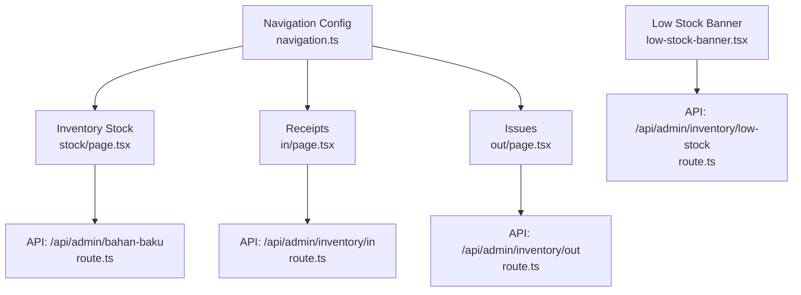
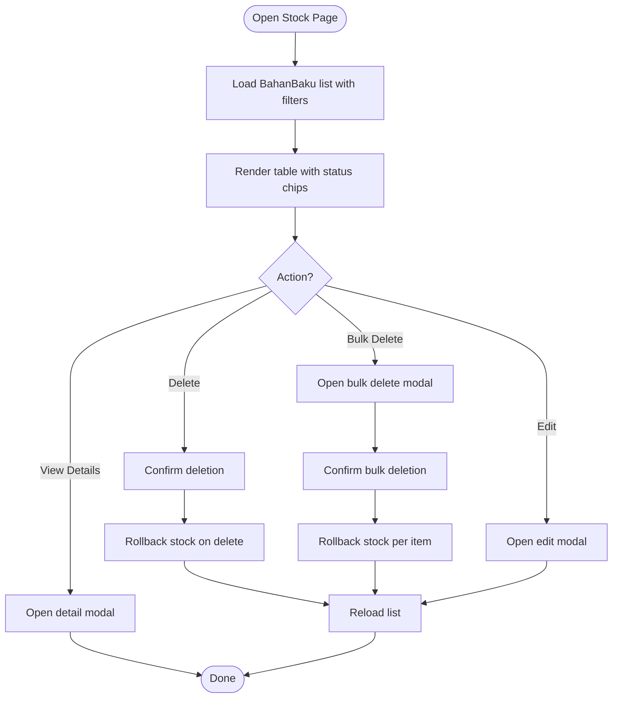
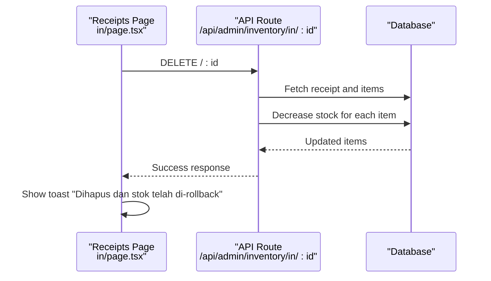
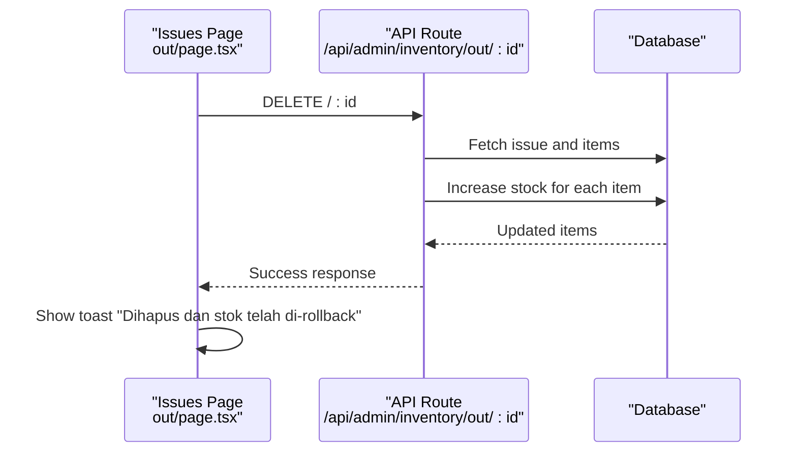
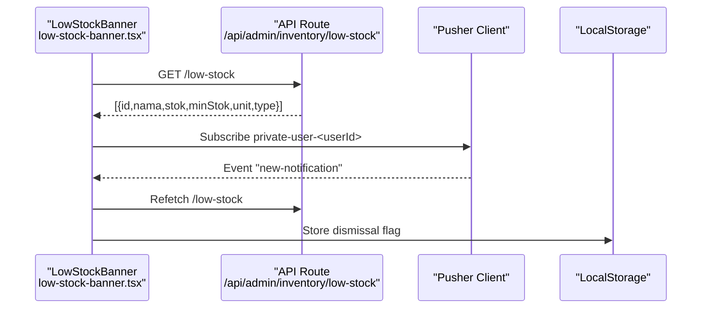
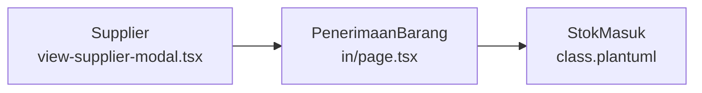
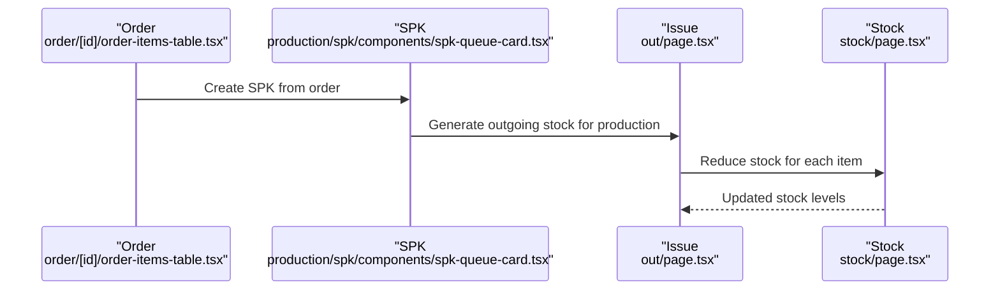
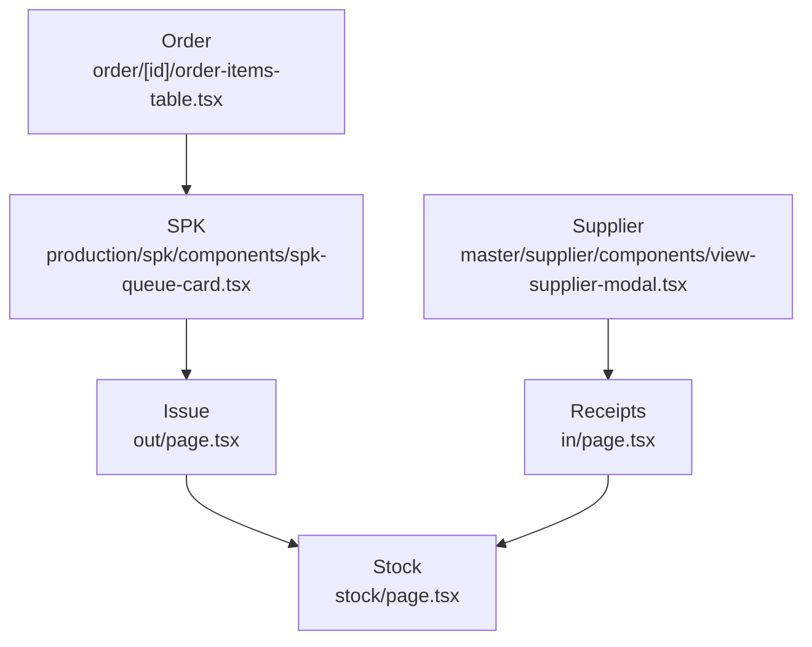
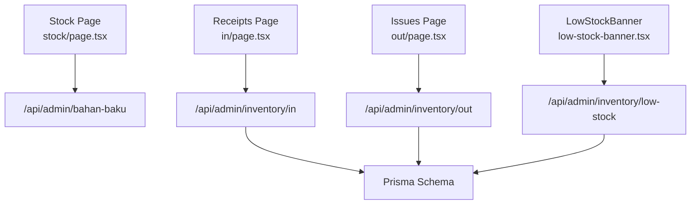
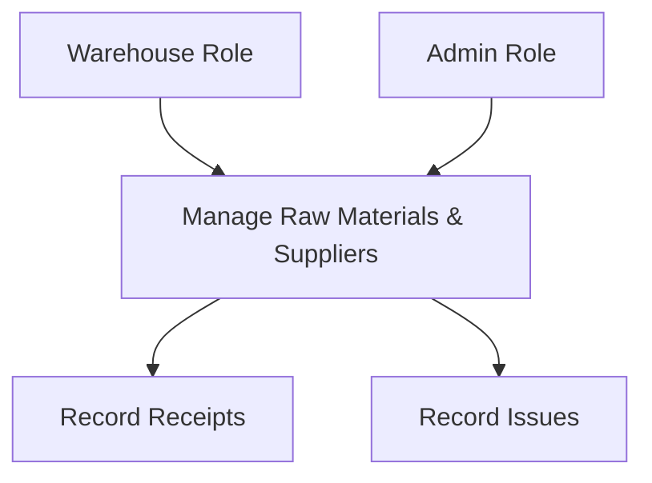

# Inventory Management

<cite>
**Referenced Files in This Document**
- [README.md](file://README.md)
- [navigation.ts](file://src/config/navigation.ts)
- [low-stock-banner.tsx](file://src/components/low-stock-banner.tsx)
- [stock/page.tsx](file://src/app/(LoggedIn)/inventory/stock/page.tsx)
- [in/page.tsx](file://src/app/(LoggedIn)/inventory/in/page.tsx)
- [out/page.tsx](file://src/app/(LoggedIn)/inventory/out/page.tsx)
- [class.plantuml](file://diagram/class.plantuml)
- [part3-produksi-inventori.plantuml](file://diagram/class/part3-produksi-inventori.plantuml)
- [inventori_gudang.puml](file://diagram/usecase/inventori_gudang.puml)
- [gudang.puml](file://diagram/activity/gudang.puml)
- [order/[id]/components/spk-card.tsx](file://src/app/(LoggedIn)/order/[id]/components/spk-card.tsx)
- [order/[id]/components/order-items-table.tsx](file://src/app/(LoggedIn)/order/[id]/components/order-items-table.tsx)
- [order/list/components/order-card.tsx](file://src/app/(LoggedIn)/order/list/components/order-card.tsx)
- [production/design-queue/components/design-order-card.tsx](file://src/app/(LoggedIn)/production/design-queue/components/design-order-card.tsx)
- [production/spk/components/spk-queue-card.tsx](file://src/app/(LoggedIn)/production/spk/components/spk-queue-card.tsx)
- [master/product/components/view-product-modal.tsx](file://src/app/(LoggedIn)/master/product/components/view-product-modal.tsx)
- [master/supplier/components/view-supplier-modal.tsx](file://src/app/(LoggedIn)/master/supplier/components/view-supplier-modal.tsx)
- [master/customer/components/view-customer-modal.tsx](file://src/app/(LoggedIn)/master/customer/components/view-customer-modal.tsx)
- [api/inventory/in/[id]/route.ts](file://src/app/api/admin/inventory/in/[id]/route.ts)
- [api/inventory/out/[id]/route.ts](file://src/app/api/admin/inventory/out/[id]/route.ts)
- [api/inventory/low-stock/route.ts](file://src/app/api/admin/inventory/low-stock/route.ts)
- [schema.prisma](file://prisma/schema.prisma)
</cite>

## Table of Contents
1. [Introduction](#introduction)
2. [Project Structure](#project-structure)
3. [Core Components](#core-components)
4. [Architecture Overview](#architecture-overview)
5. [Detailed Component Analysis](#detailed-component-analysis)
6. [Dependency Analysis](#dependency-analysis)
7. [Performance Considerations](#performance-considerations)
8. [Troubleshooting Guide](#troubleshooting-guide)
9. [Conclusion](#conclusion)
10. [Appendices](#appendices)

## Introduction
This document describes the inventory management system within the integrated POS and finance platform. It focuses on raw material tracking, finished goods inventory, and stock movement management. It explains workflows for stock entry and exit, supplier management, vendor integration, low stock alerts, inventory valuation, reconciliation, reporting, movement history, optimization strategies, cycle counting, adjustments, integration with purchase orders, sales orders, and production workflows, barcode scanning, batch tracking, expiry date management, and forecasting capabilities.

The system supports five roles with granular access: Admin, Kasir, Designer, Produksi, and Gudang. The Gudang role primarily manages raw materials inventory (stock, receipts, and issues).

**Section sources**
- [README.md:63-71](file://README.md#L63-L71)

## Project Structure
The inventory module resides under the “Inventory” section in the navigation and is accessible to Admin and Gudang. It includes:
- Stock (raw materials)
- Receipts (incoming stock)
- Issues (outgoing stock for production)



**Diagram sources**
- [navigation.ts:85-104](file://src/config/navigation.ts#L85-L104)
- [stock/page.tsx:80-84](file://src/app/(LoggedIn)/inventory/stock/page.tsx#L80-L84)
- [in/page.tsx:112-115](file://src/app/(LoggedIn)/inventory/in/page.tsx#L112-L115)
- [out/page.tsx:87-90](file://src/app/(LoggedIn)/inventory/out/page.tsx#L87-L90)
- [low-stock-banner.tsx:26-29](file://src/components/low-stock-banner.tsx#L26-L29)

**Section sources**
- [navigation.ts:85-104](file://src/config/navigation.ts#L85-L104)
- [stock/page.tsx:100-103](file://src/app/(LoggedIn)/inventory/stock/page.tsx#L100-L103)
- [in/page.tsx:163-166](file://src/app/(LoggedIn)/inventory/in/page.tsx#L163-L166)
- [out/page.tsx:135-139](file://src/app/(LoggedIn)/inventory/out/page.tsx#L135-L139)

## Core Components
- Raw Material Stock (Bahan Baku)
  - View and manage raw materials, filters for status and stock level, edit/delete actions, pagination, and bulk operations.
  - Stock status indicators: normal, low, out-of-stock.
- Receipts (PenerimaanBarang)
  - List receipt records, filter by date range, supplier, and raw material, view details, edit, duplicate, and delete with rollback.
- Issues (PengeluaranBarang)
  - List outgoing movements for production, filter by date and raw material, view details, and delete with rollback.
- Low Stock Alerts
  - Persistent banner showing low stock items with dismiss option and real-time updates via Pusher.

**Section sources**
- [stock/page.tsx:45-52](file://src/app/(LoggedIn)/inventory/stock/page.tsx#L45-L52)
- [stock/page.tsx:175-285](file://src/app/(LoggedIn)/inventory/stock/page.tsx#L175-L285)
- [in/page.tsx:225-315](file://src/app/(LoggedIn)/inventory/in/page.tsx#L225-L315)
- [out/page.tsx:191-278](file://src/app/(LoggedIn)/inventory/out/page.tsx#L191-L278)
- [low-stock-banner.tsx:19-60](file://src/components/low-stock-banner.tsx#L19-L60)

## Architecture Overview
The inventory subsystem integrates frontend pages with backend API routes and database models. The UML class diagram outlines core entities and relationships relevant to inventory and production.

```mermaid
classDiagram
class BahanBaku {
+id : String
+nama : String
+stok : Decimal
+minStok : Decimal
+unitId : String
+isActive : Boolean
}
class PenerimaanBarang {
+id : String
+nomorFaktur : String
+tanggal : DateTime
+totalTagihan : Decimal
}
class StokMasuk {
+id : String
+penerimaanBarangId : String
+bahanBakuId : String
+jumlah : Decimal
+hargaBeli : Decimal
+totalHargaItem : Decimal
}
class PengeluaranBarang {
+id : String
+tanggal : DateTime
+keterangan : String
}
class StokKeluar {
+id : String
+pengeluaranBarangId : String
+bahanBakuId : String
+jumlah : Decimal
}
class Supplier {
+id : String
+nama : String
}
class SPK {
+id : String
+orderId : String
}
class Order {
+id : String
+nomorOrder : String
}
BahanBaku ||--o{ StokMasuk : "has many"
BahanBaku ||--o{ StokKeluar : "has many"
PenerimaanBarang ||--o{ StokMasuk : "contains"
PengeluaranBarang ||--o{ StokKeluar : "contains"
Supplier ||--o{ PenerimaanBarang : "supplies"
SPK ||--o{ PengeluaranBarang : "generates"
Order ||--o{ SPK : "creates"
```

**Diagram sources**
- [class.plantuml:111-149](file://diagram/class.plantuml#L111-L149)
- [class.plantuml:217-221](file://diagram/class.plantuml#L217-L221)
- [part3-produksi-inventori.plantuml:90-114](file://diagram/class/part3-produksi-inventori.plantuml#L90-L114)

## Detailed Component Analysis

### Raw Material Stock (Bahan Baku)
- Purpose: Track raw materials, minimum stock thresholds, units, and status.
- Features:
  - Filters: Active/Inactive, Low/Empty/All stock status.
  - Actions: Edit, Delete, Bulk Delete.
  - Real-time stock status chips (normal/warning/danger).
  - Pagination and search.
- Stock status logic:
  - Zero stock → Out of stock.
  - Stock ≤ minimum stock → Low stock.
  - Otherwise → Normal.



**Diagram sources**
- [stock/page.tsx:175-285](file://src/app/(LoggedIn)/inventory/stock/page.tsx#L175-L285)

**Section sources**
- [stock/page.tsx:45-52](file://src/app/(LoggedIn)/inventory/stock/page.tsx#L45-L52)
- [stock/page.tsx:175-285](file://src/app/(LoggedIn)/inventory/stock/page.tsx#L175-L285)

### Receipts (PenerimaanBarang)
- Purpose: Record incoming stock from suppliers with invoices.
- Features:
  - Filters: Date range, supplier, raw material.
  - Actions: View, Edit, Duplicate, Delete with automatic stock increase rollback.
  - Pagination and search.
- Deletion behavior:
  - Deleting a receipt reduces stock for all contained items and cannot be undone.



**Diagram sources**
- [in/page.tsx:134-159](file://src/app/(LoggedIn)/inventory/in/page.tsx#L134-L159)
- [api/inventory/in/[id]/route.ts](file://src/app/api/admin/inventory/in/[id]/route.ts)

**Section sources**
- [in/page.tsx:112-115](file://src/app/(LoggedIn)/inventory/in/page.tsx#L112-L115)
- [in/page.tsx:225-315](file://src/app/(LoggedIn)/inventory/in/page.tsx#L225-L315)
- [in/page.tsx:134-159](file://src/app/(LoggedIn)/inventory/in/page.tsx#L134-L159)

### Issues (PengeluaranBarang)
- Purpose: Record outgoing stock for production (linked to SPK).
- Features:
  - Filters: Date range, raw material.
  - Actions: View, Delete with automatic stock restoration.
  - Pagination and search.
- Deletion behavior:
  - Deleting an issue restores stock for all contained items.



**Diagram sources**
- [out/page.tsx:107-132](file://src/app/(LoggedIn)/inventory/out/page.tsx#L107-L132)
- [api/inventory/out/[id]/route.ts](file://src/app/api/admin/inventory/out/[id]/route.ts)

**Section sources**
- [out/page.tsx:87-90](file://src/app/(LoggedIn)/inventory/out/page.tsx#L87-L90)
- [out/page.tsx:191-278](file://src/app/(LoggedIn)/inventory/out/page.tsx#L191-L278)
- [out/page.tsx:107-132](file://src/app/(LoggedIn)/inventory/out/page.tsx#L107-L132)

### Low Stock Alert System
- Banner displays current low stock items and allows dismissal for the day.
- Real-time updates via Pusher events (STOK_MENIPIS, ORDER_BARU, PENERIMAAN_BARU).
- Items include both raw materials and finished products.



**Diagram sources**
- [low-stock-banner.tsx:26-50](file://src/components/low-stock-banner.tsx#L26-L50)
- [low-stock-banner.tsx:54-58](file://src/components/low-stock-banner.tsx#L54-L58)
- [api/inventory/low-stock/route.ts](file://src/app/api/admin/inventory/low-stock/route.ts)

**Section sources**
- [low-stock-banner.tsx:19-60](file://src/components/low-stock-banner.tsx#L19-L60)
- [low-stock-banner.tsx:31-50](file://src/components/low-stock-banner.tsx#L31-L50)

### Supplier Management and Vendor Integration
- Suppliers are managed under Master Data and are linked to receipts.
- Receipts list shows supplier information and total invoice amount.
- Supplier view modal is available for details.



**Diagram sources**
- [in/page.tsx:247-258](file://src/app/(LoggedIn)/inventory/in/page.tsx#L247-L258)
- [class.plantuml:217-221](file://diagram/class.plantuml#L217-L221)
- [master/supplier/components/view-supplier-modal.tsx](file://src/app/(LoggedIn)/master/supplier/components/view-supplier-modal.tsx)

**Section sources**
- [in/page.tsx:80-87](file://src/app/(LoggedIn)/inventory/in/page.tsx#L80-L87)
- [in/page.tsx:247-258](file://src/app/(LoggedIn)/inventory/in/page.tsx#L247-L258)

### Finished Goods Inventory and Production Workflows
- Finished goods are represented as Products and tracked via Orders and SPKs.
- SPKs generate outgoing stock (issues) for production consumption.
- Design queue and SPK queue support production planning.



**Diagram sources**
- [order/[id]/components/order-items-table.tsx](file://src/app/(LoggedIn)/order/[id]/components/order-items-table.tsx)
- [production/spk/components/spk-queue-card.tsx](file://src/app/(LoggedIn)/production/spk/components/spk-queue-card.tsx)
- [out/page.tsx:191-278](file://src/app/(LoggedIn)/inventory/out/page.tsx#L191-L278)
- [stock/page.tsx:175-285](file://src/app/(LoggedIn)/inventory/stock/page.tsx#L175-L285)

**Section sources**
- [order/[id]/components/spk-card.tsx](file://src/app/(LoggedIn)/order/[id]/components/spk-card.tsx)
- [production/design-queue/components/design-order-card.tsx](file://src/app/(LoggedIn)/production/design-queue/components/design-order-card.tsx)
- [production/spk/components/spk-queue-card.tsx](file://src/app/(LoggedIn)/production/spk/components/spk-queue-card.tsx)

### Barcode Scanning, Batch Tracking, Expiry Date Management, and Forecasting
- Current implementation does not expose dedicated barcode scanning, batch tracking, or expiry date management screens in the inventory module.
- These capabilities are not present in the referenced inventory pages and related components.

**Section sources**
- [stock/page.tsx:100-103](file://src/app/(LoggedIn)/inventory/stock/page.tsx#L100-L103)
- [in/page.tsx:163-166](file://src/app/(LoggedIn)/inventory/in/page.tsx#L163-L166)
- [out/page.tsx:135-139](file://src/app/(LoggedIn)/inventory/out/page.tsx#L135-L139)

### Inventory Valuation Methods
- Receipts store purchase price per item (hargaBeli) and total item cost (totalHargaItem).
- These fields enable FIFO/LIFO valuation depending on policy and are suitable for cost accounting.

**Section sources**
- [class.plantuml:132-137](file://diagram/class.plantuml#L132-L137)
- [part3-produksi-inventori.plantuml:90-95](file://diagram/class/part3-produksi-inventori.plantuml#L90-L95)

### Stock Movement History and Reporting
- Receipts and Issues pages provide historical movement records with filtering and pagination.
- Reports modules exist for financial reporting; inventory-specific reports are not exposed in the inventory module.

**Section sources**
- [in/page.tsx:225-315](file://src/app/(LoggedIn)/inventory/in/page.tsx#L225-L315)
- [out/page.tsx:191-278](file://src/app/(LoggedIn)/inventory/out/page.tsx#L191-L278)
- [README.md:5-14](file://README.md#L5-L14)

### Cycle Counting and Inventory Adjustment Workflows
- Cycle counting is not explicitly implemented in the inventory module.
- Manual stock adjustments are not exposed; however, the system supports deleting receipts/issues to roll back stock, which can be used cautiously for corrections.

**Section sources**
- [in/page.tsx:134-159](file://src/app/(LoggedIn)/inventory/in/page.tsx#L134-L159)
- [out/page.tsx:107-132](file://src/app/(LoggedIn)/inventory/out/page.tsx#L107-L132)

### Integration with Purchase Orders, Sales Orders, and Production
- Purchase Orders (via receipts) integrate with supplier data and raw material stock.
- Sales Orders integrate with Products and SPKs; SPKs drive raw material issues.
- The system’s UML class diagram shows these relationships.



**Diagram sources**
- [order/[id]/components/order-items-table.tsx](file://src/app/(LoggedIn)/order/[id]/components/order-items-table.tsx)
- [production/spk/components/spk-queue-card.tsx](file://src/app/(LoggedIn)/production/spk/components/spk-queue-card.tsx)
- [out/page.tsx:191-278](file://src/app/(LoggedIn)/inventory/out/page.tsx#L191-L278)
- [stock/page.tsx:175-285](file://src/app/(LoggedIn)/inventory/stock/page.tsx#L175-L285)
- [in/page.tsx:247-258](file://src/app/(LoggedIn)/inventory/in/page.tsx#L247-L258)

## Dependency Analysis
- Frontend pages depend on SWR for data fetching and local state management.
- Backend API routes handle CRUD operations for receipts, issues, and low stock queries.
- Database schema defines entities and relationships for inventory and production.



**Diagram sources**
- [stock/page.tsx:80-84](file://src/app/(LoggedIn)/inventory/stock/page.tsx#L80-L84)
- [in/page.tsx:112-115](file://src/app/(LoggedIn)/inventory/in/page.tsx#L112-L115)
- [out/page.tsx:87-90](file://src/app/(LoggedIn)/inventory/out/page.tsx#L87-L90)
- [low-stock-banner.tsx:26-29](file://src/components/low-stock-banner.tsx#L26-L29)
- [schema.prisma](file://prisma/schema.prisma)

**Section sources**
- [stock/page.tsx:80-84](file://src/app/(LoggedIn)/inventory/stock/page.tsx#L80-L84)
- [in/page.tsx:112-115](file://src/app/(LoggedIn)/inventory/in/page.tsx#L112-L115)
- [out/page.tsx:87-90](file://src/app/(LoggedIn)/inventory/out/page.tsx#L87-L90)
- [low-stock-banner.tsx:26-29](file://src/components/low-stock-banner.tsx#L26-L29)

## Performance Considerations
- Use debounced search and efficient pagination to minimize API load.
- Apply server-side filtering (date range, supplier, raw material) to reduce payload sizes.
- Prefer batch operations for bulk deletions to avoid repeated network calls.
- Leverage SWR caching and selective revalidation to optimize UI responsiveness.

[No sources needed since this section provides general guidance]

## Troubleshooting Guide
- Deleting a receipt or issue triggers a rollback; confirm the action as irreversible.
- Low stock banner appears until dismissed; if not updating, refresh or check Pusher connectivity.
- If filters yield unexpected results, clear filters and re-apply incrementally.

**Section sources**
- [in/page.tsx:370-400](file://src/app/(LoggedIn)/inventory/in/page.tsx#L370-L400)
- [out/page.tsx:315-347](file://src/app/(LoggedIn)/inventory/out/page.tsx#L315-L347)
- [low-stock-banner.tsx:31-50](file://src/components/low-stock-banner.tsx#L31-L50)

## Conclusion
The inventory module provides robust capabilities for managing raw materials, recording stock receipts and issues, and monitoring low stock conditions. It integrates with suppliers, production workflows (SPKs), and sales orders. While advanced features like barcode scanning, batch/expiry tracking, and forecasting are not currently implemented, the existing foundation supports valuation, reconciliation, and reporting. Extending the system with batch/expiry tracking and forecasting would further strengthen inventory control.

[No sources needed since this section summarizes without analyzing specific files]

## Appendices

### Practical Examples of Inventory Operations
- Recording a receipt:
  - Navigate to “Barang Masuk,” fill invoice details, select supplier and raw materials, save. Stock increases accordingly.
- Recording an issue:
  - Navigate to “Barang Keluar,” select SPK/order, choose raw materials and quantities, save. Stock decreases accordingly.
- Viewing movement history:
  - Use filters on “Barang Masuk” and “Barang Keluar” to review past transactions.
- Managing low stock:
  - Review the banner at the top of the page; dismiss daily or address immediately.

**Section sources**
- [in/page.tsx:204-213](file://src/app/(LoggedIn)/inventory/in/page.tsx#L204-L213)
- [out/page.tsx:170-178](file://src/app/(LoggedIn)/inventory/out/page.tsx#L170-L178)
- [low-stock-banner.tsx:67-95](file://src/components/low-stock-banner.tsx#L67-L95)

### Use Case Overview


**Diagram sources**
- [inventori_gudang.puml:9-24](file://diagram/usecase/inventori_gudang.puml#L9-L24)