# Inventory Reporting & Analytics

<cite>
**Referenced Files in This Document**
- [schema.prisma](file://prisma/schema.prisma)
- [part3-produksi-inventori.plantuml](file://diagram/class/part3-produksi-inventori.plantuml)
- [gudang.puml](file://diagram/activity/gudang.puml)
- [low-stock-banner.tsx](file://src/components/low-stock-banner.tsx)
- [notifications.ts](file://src/lib/notifications.ts)
- [page.tsx (Penerimaan Barang)](file://src/app/(LoggedIn)/inventory/in/page.tsx)
- [page.tsx (Barang Keluar)](file://src/app/(LoggedIn)/inventory/out/page.tsx)
- [page.tsx (Stok Bahan Baku)](file://src/app/(LoggedIn)/inventory/stock/page.tsx)
- [route.ts (Penerimaan API)](file://src/app/api/admin/inventory/in/route.ts)
- [seed-transactions.ts](file://prisma/seed-transactions.ts)
</cite>

## Table of Contents
1. [Introduction](#introduction)
2. [Project Structure](#project-structure)
3. [Core Components](#core-components)
4. [Architecture Overview](#architecture-overview)
5. [Detailed Component Analysis](#detailed-component-analysis)
6. [Dependency Analysis](#dependency-analysis)
7. [Performance Considerations](#performance-considerations)
8. [Troubleshooting Guide](#troubleshooting-guide)
9. [Conclusion](#conclusion)
10. [Appendices](#appendices)

## Introduction
This document explains the inventory reporting and analytics capabilities implemented in the system. It focuses on how inventory movements are recorded, reported, and surfaced for decision-making. It also outlines how valuation methods (FIFO, LIFO, weighted average, specific identification) could be integrated, how aging and turnover analytics can be derived, and how variance, shrinkage, and cycle counting can be supported. Practical examples demonstrate generating inventory statements, reconciliations, and management dashboards, along with integration points for financial reporting and notifications.

## Project Structure
The inventory domain spans database modeling, UI pages, API routes, and diagrams that illustrate flows and relationships. The Prisma schema defines the core entities and their relations. UI pages provide filtering, pagination, and detail views for receipts, issues, and stock positions. Notifications and banners surface low-stock alerts. Diagrams visualize actor interactions and class relationships.

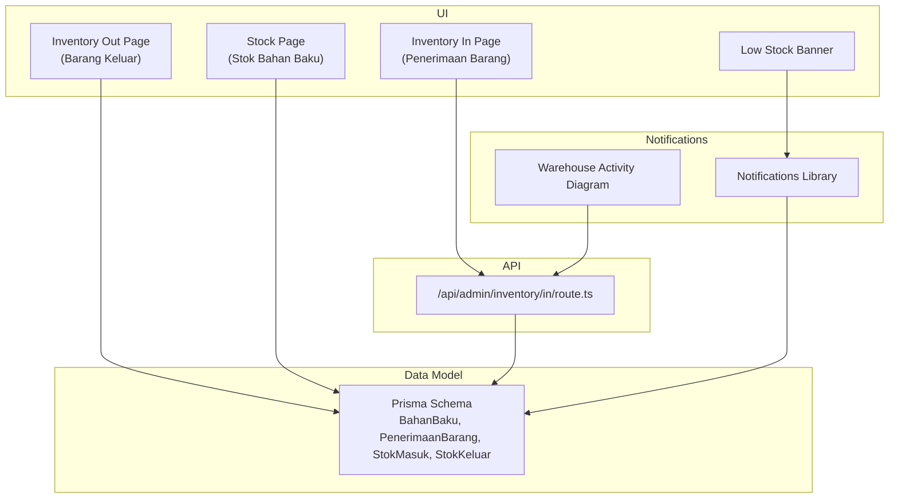

**Diagram sources**
- [page.tsx (Penerimaan Barang)](file://src/app/(LoggedIn)/inventory/in/page.tsx#L112-L115)
- [page.tsx (Barang Keluar)](file://src/app/(LoggedIn)/inventory/out/page.tsx#L87-L90)
- [page.tsx (Stok Bahan Baku)](file://src/app/(LoggedIn)/inventory/stock/page.tsx#L80-L84)
- [route.ts (Penerimaan API):223-257](file://src/app/api/admin/inventory/in/route.ts#L223-L257)
- [schema.prisma:182-254](file://prisma/schema.prisma#L182-L254)
- [low-stock-banner.tsx:26-29](file://src/components/low-stock-banner.tsx#L26-L29)
- [notifications.ts:67-95](file://src/lib/notifications.ts#L67-L95)
- [gudang.puml:1-55](file://diagram/activity/gudang.puml#L1-L55)

**Section sources**
- [schema.prisma:182-254](file://prisma/schema.prisma#L182-L254)
- [page.tsx (Penerimaan Barang)](file://src/app/(LoggedIn)/inventory/in/page.tsx#L112-L115)
- [page.tsx (Barang Keluar)](file://src/app/(LoggedIn)/inventory/out/page.tsx#L87-L90)
- [page.tsx (Stok Bahan Baku)](file://src/app/(LoggedIn)/inventory/stock/page.tsx#L80-L84)
- [route.ts (Penerimaan API):223-257](file://src/app/api/admin/inventory/in/route.ts#L223-L257)
- [low-stock-banner.tsx:26-29](file://src/components/low-stock-banner.tsx#L26-L29)
- [notifications.ts:67-95](file://src/lib/notifications.ts#L67-L95)
- [gudang.puml:1-55](file://diagram/activity/gudang.puml#L1-L55)

## Core Components
- Inventory entities and relations:
  - BahanBaku: raw material with stock and reorder threshold.
  - PenerimaanBarang: receipt header with items (StokMasuk).
  - StokMasuk: receipt line items with quantity and cost.
  - StokKeluar: issue line items with quantity.
  - PengeluaranBarang: issue header linked to SPK.
- UI surfaces:
  - Receipt listing with filters and pagination.
  - Issue listing with filters and pagination.
  - Stock position listing with status chips and filters.
- Notifications:
  - Low stock alerts and real-time updates via Pusher.
  - New receipt notifications to warehouse and admins.

**Section sources**
- [schema.prisma:182-254](file://prisma/schema.prisma#L182-L254)
- [page.tsx (Penerimaan Barang)](file://src/app/(LoggedIn)/inventory/in/page.tsx#L112-L115)
- [page.tsx (Barang Keluar)](file://src/app/(LoggedIn)/inventory/out/page.tsx#L87-L90)
- [page.tsx (Stok Bahan Baku)](file://src/app/(LoggedIn)/inventory/stock/page.tsx#L80-L84)
- [low-stock-banner.tsx:26-29](file://src/components/low-stock-banner.tsx#L26-L29)
- [notifications.ts:67-95](file://src/lib/notifications.ts#L67-L95)

## Architecture Overview
The inventory workflow connects UI pages to API handlers and database models. Receipts trigger journal entries and notifications. Issues link to SPKs and reduce stock. Stock status is computed client-side and surfaced via banners and pages.

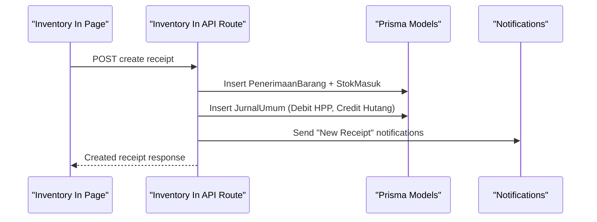

**Diagram sources**
- [page.tsx (Penerimaan Barang)](file://src/app/(LoggedIn)/inventory/in/page.tsx#L112-L115)
- [route.ts (Penerimaan API):223-257](file://src/app/api/admin/inventory/in/route.ts#L223-L257)
- [schema.prisma:201-239](file://prisma/schema.prisma#L201-L239)
- [notifications.ts:67-95](file://src/lib/notifications.ts#L67-L95)

## Detailed Component Analysis

### Inventory Valuation Methods
Valuation methods are not currently implemented in the codebase. The system records purchase costs per receipt line but does not compute moving averages, FIFO/LIFO layers, or specific identification. To support valuation:
- Extend StokMasuk to track unit costs and timestamps.
- Implement valuation policies at the product/raw-material level.
- Compute cost of goods sold and closing inventory periodically.

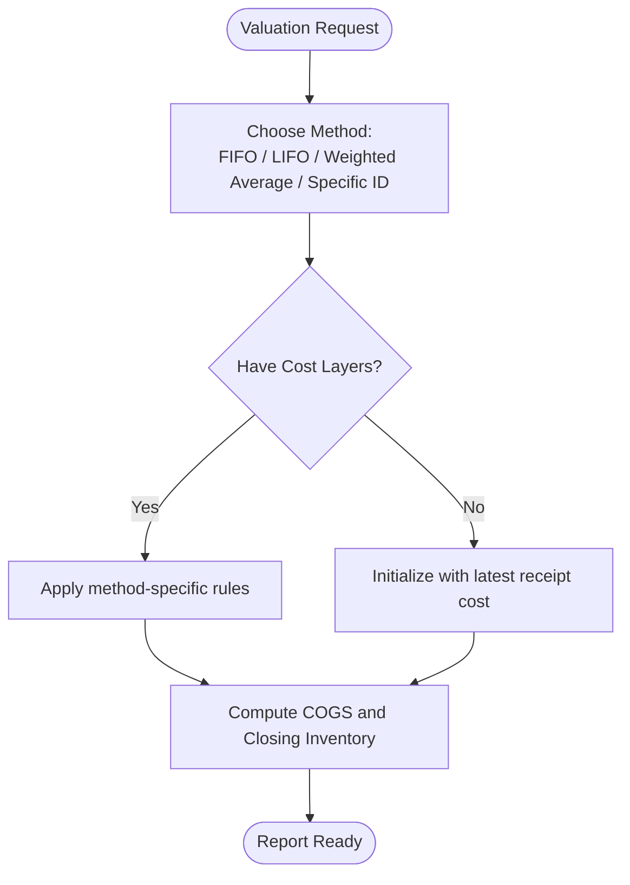

[No sources needed since this diagram shows conceptual workflow, not actual code structure]

### Inventory Aging Analysis
Aging analysis requires per-item receipt timestamps. Current models lack per-unit receipt dates. To enable aging:
- Store receipt timestamps on StokMasuk.
- Group stock by receipt batches.
- Calculate age buckets (e.g., 0–30 days, 31–60 days, etc.).

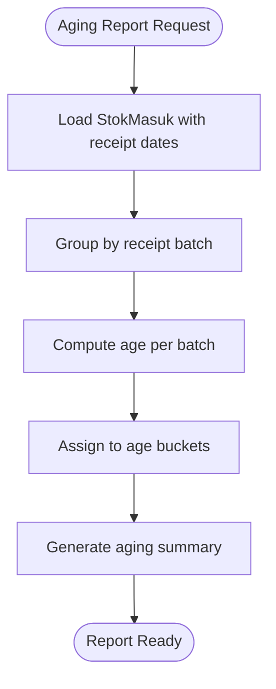

[No sources needed since this diagram shows conceptual workflow, not actual code structure]

### Stock Turnover Calculations
Turnover requires COGS and average inventory. Since valuation is not implemented:
- Track COGS via sales-to-cost mapping (requires sales and cost linkage).
- Compute average inventory from historical stock snapshots.
- Turnover = COGS / Average Inventory.

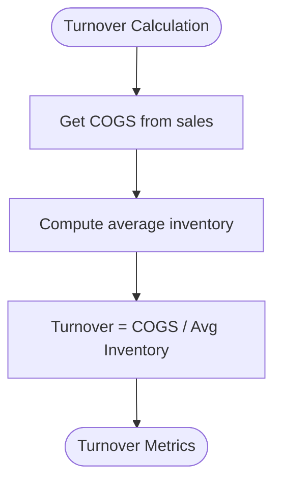

[No sources needed since this diagram shows conceptual workflow, not actual code structure]

### Carrying Cost Analysis
Carrying cost depends on inventory valuation and cost components (capital, storage, insurance, obsolescence). To support carrying cost:
- Maintain valuation layers.
- Define cost components per item.
- Compute carrying cost percentage and totals.

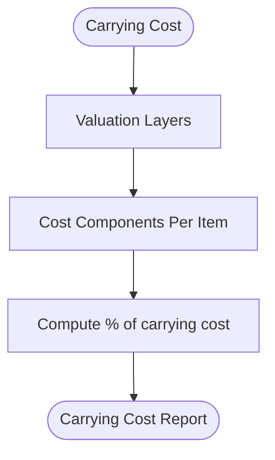

[No sources needed since this diagram shows conceptual workflow, not actual code structure]

### Inventory Movement Reports
The UI pages expose filtered lists of receipts and issues. Pagination and search are supported. To enhance reporting:
- Add export buttons (CSV/PDF) to pages.
- Provide drill-down detail modals.
- Aggregate totals per supplier/product.

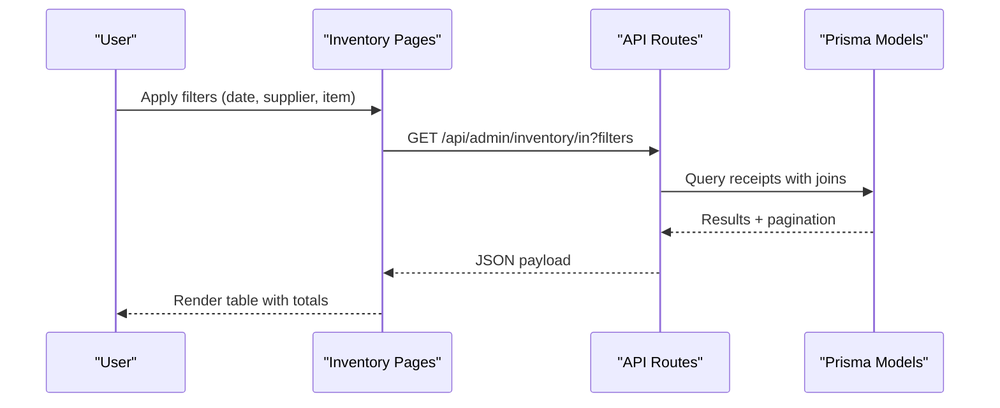

**Diagram sources**
- [page.tsx (Penerimaan Barang)](file://src/app/(LoggedIn)/inventory/in/page.tsx#L103-L115)
- [page.tsx (Barang Keluar)](file://src/app/(LoggedIn)/inventory/out/page.tsx#L79-L89)
- [schema.prisma:201-254](file://prisma/schema.prisma#L201-L254)

### Stock Status Summaries
Stock status is computed client-side and shown with color-coded chips. Filters include “Active”, “Inactive”, and “Stock Status” (normal/menipis/habis). This supports quick visibility of low stock and out-of-stock items.

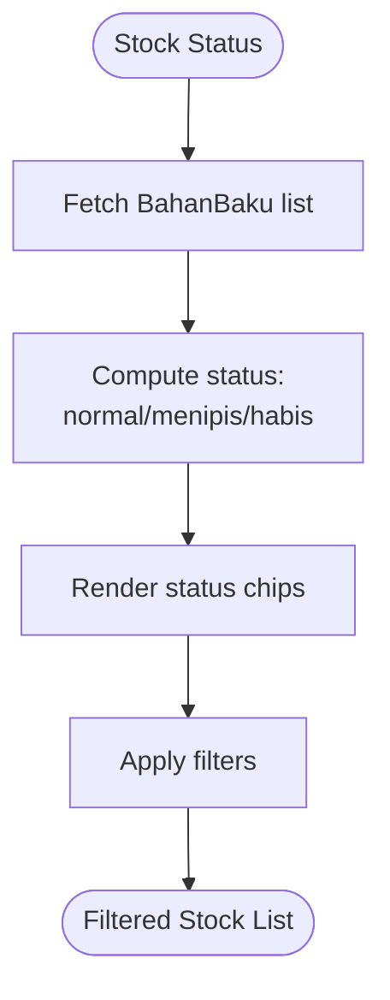

**Diagram sources**
- [page.tsx (Stok Bahan Baku)](file://src/app/(LoggedIn)/inventory/stock/page.tsx#L45-L52)
- [page.tsx (Stok Bahan Baku)](file://src/app/(LoggedIn)/inventory/stock/page.tsx#L175-L284)

### Supplier Performance Metrics
Supplier performance can be derived from receipt data:
- Count of receipts per supplier.
- Average lead time (receipt date vs expected delivery).
- Invoice accuracy and discrepancies.

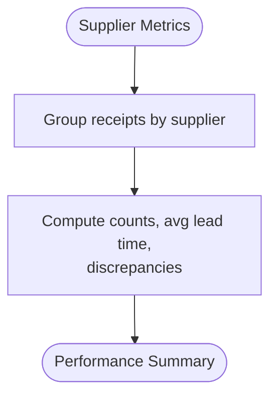

[No sources needed since this diagram shows conceptual workflow, not actual code structure]

### Inventory Variance Analysis
Variance compares recorded stock with physical counts:
- Periodic cycle counts against system stock.
- Flag discrepancies and root causes.
- Integrate with inventory adjustments.

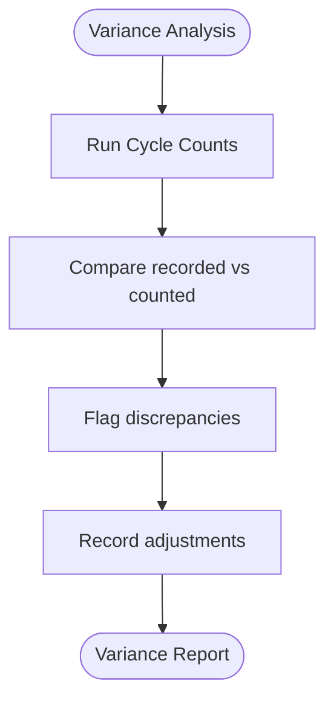

[No sources needed since this diagram shows conceptual workflow, not actual code structure]

### Shrinkage Reporting
Shrinkage is the difference between expected and actual stock:
- Use variance results to quantify shrinkage.
- Categorize by item, location, or time period.
- Investigate and reconcile losses.

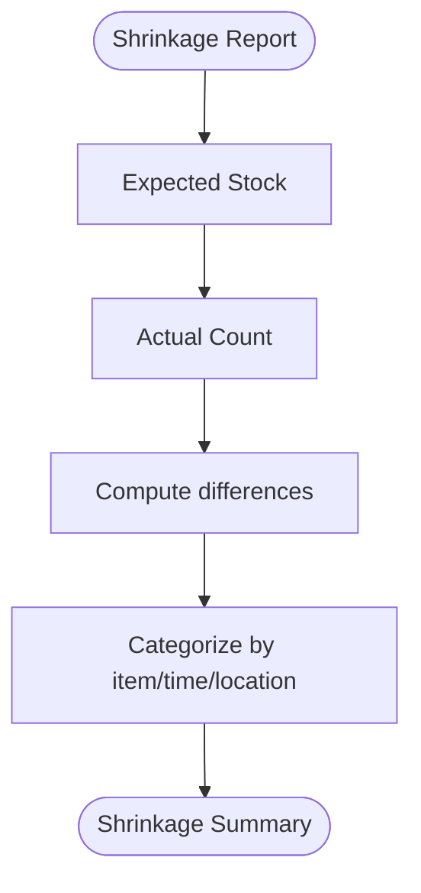

[No sources needed since this diagram shows conceptual workflow, not actual code structure]

### Cycle Counting Procedures
Cycle counting involves regular partial inventory counts:
- Define counting frequency and coverage.
- Compare counts to system records.
- Record adjustments and investigate variances.

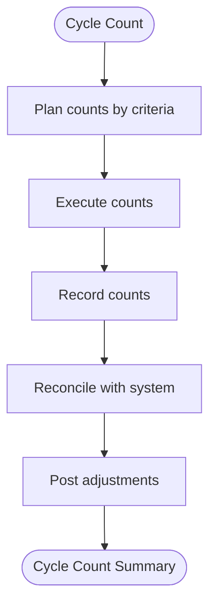

[No sources needed since this diagram shows conceptual workflow, not actual code structure]

### Practical Examples

- Generating Inventory Statements
  - Use the receipt listing page to filter by date range and supplier, then export results.
  - Reference: [page.tsx (Penerimaan Barang)](file://src/app/(LoggedIn)/inventory/in/page.tsx#L103-L115)

- Creating Stock Reconciliation Reports
  - Use the stock page to filter by status and export results.
  - Reference: [page.tsx (Stok Bahan Baku)](file://src/app/(LoggedIn)/inventory/stock/page.tsx#L80-L84)

- Producing Management Dashboards
  - Combine low stock alerts, recent receipts/issues, and stock status to build a dashboard.
  - References:
    - [low-stock-banner.tsx:26-29](file://src/components/low-stock-banner.tsx#L26-L29)
    - [gudang.puml:1-55](file://diagram/activity/gudang.puml#L1-L55)

### Integration with Financial Reporting
- Receipts create journal entries debiting cost of goods and crediting accounts payable.
- This links inventory changes to financial statements.
- References:
  - [route.ts (Penerimaan API):223-257](file://src/app/api/admin/inventory/in/route.ts#L223-L257)
  - [schema.prisma:201-239](file://prisma/schema.prisma#L201-L239)
  - [seed-transactions.ts:246-270](file://prisma/seed-transactions.ts#L246-L270)

### Tax Compliance and Regulatory Reporting
- Maintain audit trails via journals and receipts.
- Support periodic inventory counts and variance documentation.
- Ensure supplier invoices and receipts are retained.

[No sources needed since this section provides general guidance]

### Export Capabilities, Report Scheduling, and Automated Workflows
- Export capability: Add export buttons to inventory pages to produce CSV/PDF.
- Report scheduling: Implement server-side jobs to generate weekly/monthly reports.
- Automated workflows: Notifications for low stock and new receipts.

[No sources needed since this section provides general guidance]

## Dependency Analysis
The inventory domain relies on Prisma models and UI/API layers. The warehouse activity diagram illustrates typical user flows.

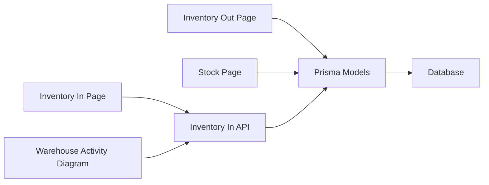

**Diagram sources**
- [page.tsx (Penerimaan Barang)](file://src/app/(LoggedIn)/inventory/in/page.tsx#L112-L115)
- [page.tsx (Barang Keluar)](file://src/app/(LoggedIn)/inventory/out/page.tsx#L87-L90)
- [page.tsx (Stok Bahan Baku)](file://src/app/(LoggedIn)/inventory/stock/page.tsx#L80-L84)
- [route.ts (Penerimaan API):223-257](file://src/app/api/admin/inventory/in/route.ts#L223-L257)
- [schema.prisma:182-254](file://prisma/schema.prisma#L182-L254)
- [gudang.puml:1-55](file://diagram/activity/gudang.puml#L1-L55)

**Section sources**
- [schema.prisma:182-254](file://prisma/schema.prisma#L182-L254)
- [gudang.puml:1-55](file://diagram/activity/gudang.puml#L1-L55)

## Performance Considerations
- Use indexed fields for frequent filters (supplier, date, item).
- Paginate large datasets and debounce search inputs.
- Precompute stock status on the client to avoid repeated computations.
- Batch notifications and limit redundant queries.

[No sources needed since this section provides general guidance]

## Troubleshooting Guide
- Low stock alerts not appearing:
  - Verify notification creation and Pusher subscriptions.
  - Check local storage dismissal flag for the banner.
  - References:
    - [low-stock-banner.tsx:26-29](file://src/components/low-stock-banner.tsx#L26-L29)
    - [notifications.ts:67-95](file://src/lib/notifications.ts#L67-L95)

- Receipt deletion affects stock unexpectedly:
  - Confirm rollback logic exists for deleting receipts.
  - References:
    - [page.tsx (Penerimaan Barang)](file://src/app/(LoggedIn)/inventory/in/page.tsx#L134-L159)

- Issue deletion does not restore stock:
  - Confirm rollback logic for deleting issues.
  - References:
    - [page.tsx (Barang Keluar)](file://src/app/(LoggedIn)/inventory/out/page.tsx#L107-L132)

**Section sources**
- [low-stock-banner.tsx:26-29](file://src/components/low-stock-banner.tsx#L26-L29)
- [notifications.ts:67-95](file://src/lib/notifications.ts#L67-L95)
- [page.tsx (Penerimaan Barang)](file://src/app/(LoggedIn)/inventory/in/page.tsx#L134-L159)
- [page.tsx (Barang Keluar)](file://src/app/(LoggedIn)/inventory/out/page.tsx#L107-L132)

## Conclusion
The system provides robust inventory movement tracking with receipts, issues, and stock status. Notifications and dashboards improve visibility. To achieve comprehensive reporting and analytics, integrate valuation methods, aging, turnover, carrying costs, variance, and cycle counting. Align inventory data with financial journals for seamless reporting and compliance.

[No sources needed since this section summarizes without analyzing specific files]

## Appendices

### Entity Relationship Overview
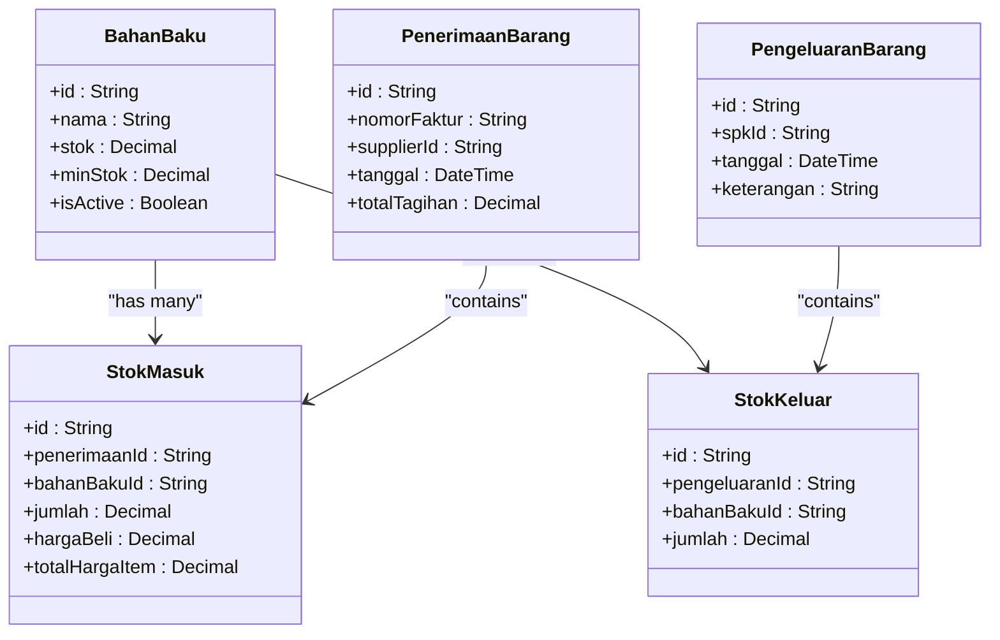

**Diagram sources**
- [schema.prisma:182-254](file://prisma/schema.prisma#L182-L254)