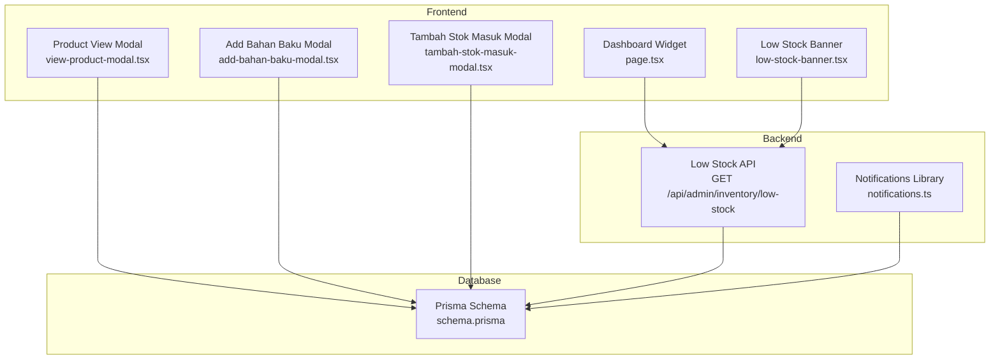
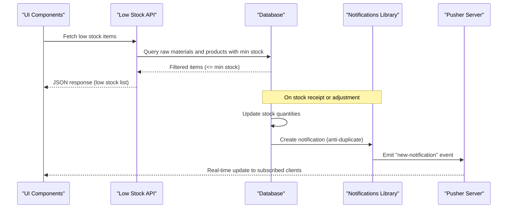
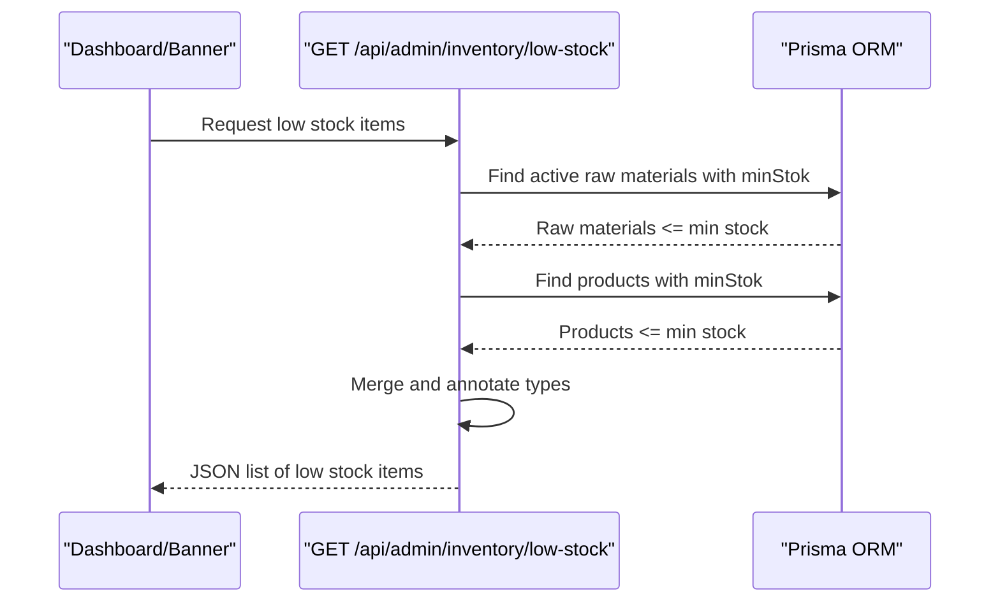
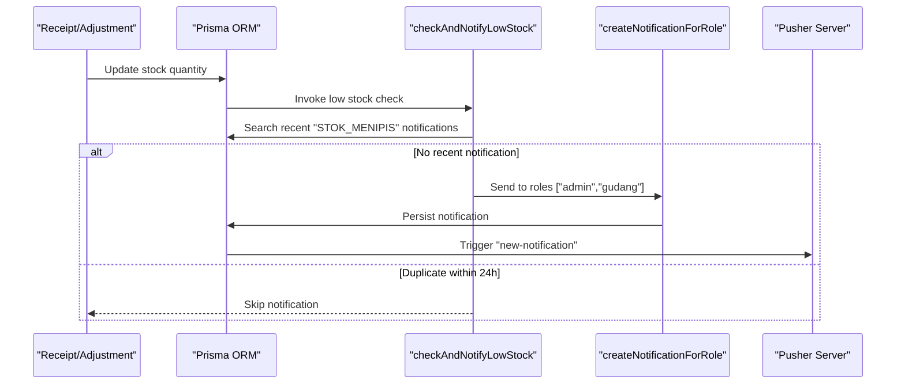
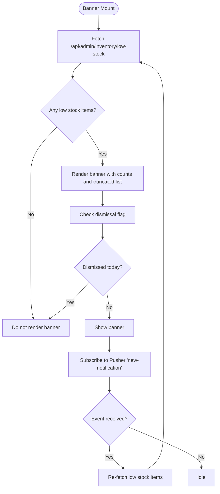
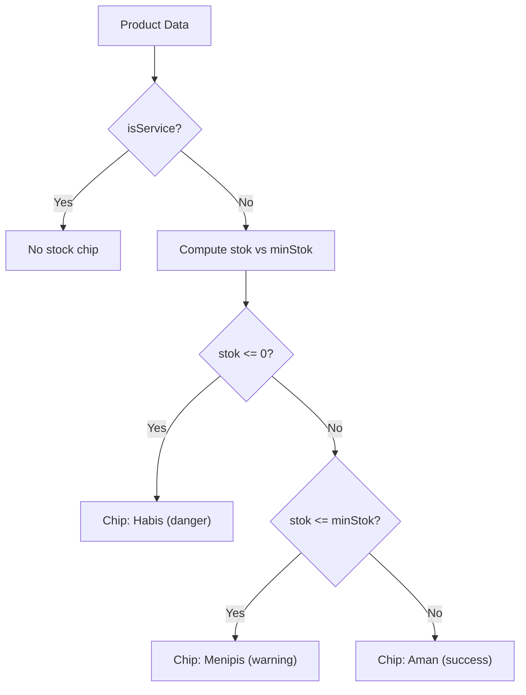
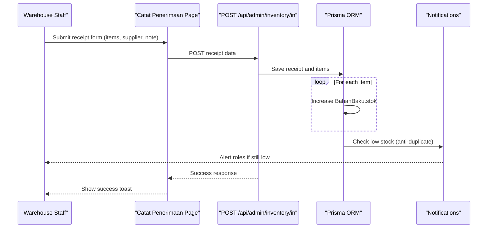
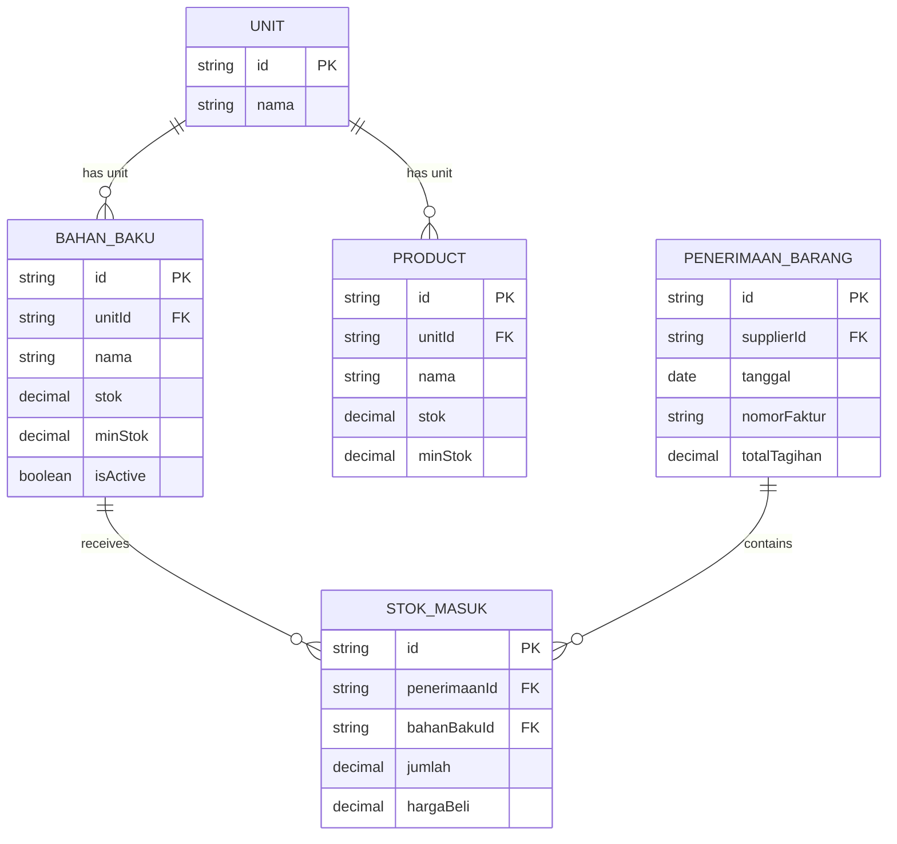
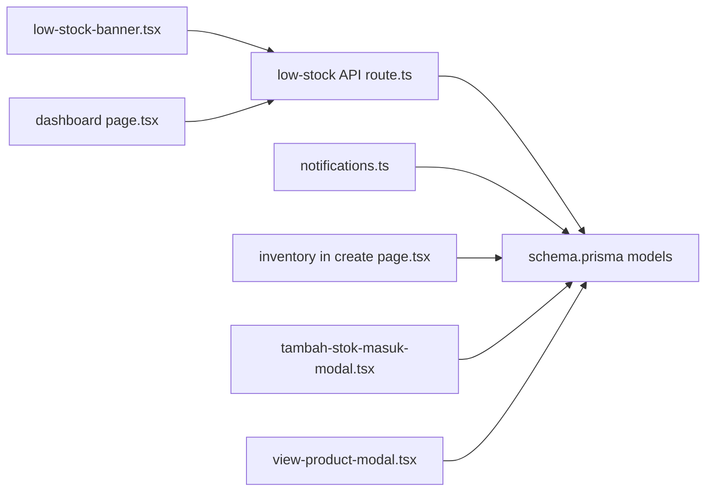

# Low Stock Alerts & Management

<cite>
**Referenced Files in This Document**
- [low-stock-banner.tsx](file://src/components/low-stock-banner.tsx)
- [notifications.ts](file://src/lib/notifications.ts)
- [route.ts](file://src/app/api/admin/inventory/low-stock/route.ts)
- [schema.prisma](file://prisma/schema.prisma)
- [page.tsx](file://src/app/(LoggedIn)/dashboard/page.tsx)
- [page.tsx](file://src/app/(LoggedIn)/inventory/in/create/page.tsx)
- [view-product-modal.tsx](file://src/app/(LoggedIn)/master/product/components/view-product-modal.tsx)
- [add-bahan-baku-modal.tsx](file://src/app/(LoggedIn)/inventory/stock/components/add-bahan-baku-modal.tsx)
- [tambah-stok-masuk-modal.tsx](file://src/app/(LoggedIn)/inventory/stock/components/tambah-stok-masuk-modal.tsx)
- [08-penerimaan-barang.mmd](file://diagram/sequence/08-penerimaan-barang.mmd)
- [part3-produksi-inventori.plantuml](file://diagram/class/part3-produksi-inventori.plantuml)
</cite>

## Table of Contents
1. [Introduction](#introduction)
2. [Project Structure](#project-structure)
3. [Core Components](#core-components)
4. [Architecture Overview](#architecture-overview)
5. [Detailed Component Analysis](#detailed-component-analysis)
6. [Dependency Analysis](#dependency-analysis)
7. [Performance Considerations](#performance-considerations)
8. [Troubleshooting Guide](#troubleshooting-guide)
9. [Conclusion](#conclusion)
10. [Appendices](#appendices)

## Introduction
This document explains the low stock alert system and inventory management capabilities implemented in the application. It covers automatic stock monitoring, minimum stock threshold configuration, alert triggering logic, notification systems, and escalation procedures. It also documents stock status indicators, visual alerts, and mobile notifications. Practical examples demonstrate setting up stock alerts, configuring notification preferences, managing supplier contacts, and creating purchase recommendations. Finally, it outlines integration with the procurement system, automated purchase order generation, and supplier communication workflows, along with stock optimization strategies, inventory turnover analysis, and carrying cost calculations.

## Project Structure
The low stock alert system spans frontend UI components, backend APIs, database models, and real-time notifications:
- Frontend banner and dashboard widgets show low stock alerts and status chips.
- Backend API aggregates low stock items across raw materials and finished products.
- Notification library handles real-time events and database persistence.
- Prisma schema defines models for inventory, transactions, and notifications.
- Procurement and production sequences integrate stock updates and alerts.

**Diagram sources**
- [page.tsx](file://src/app/(LoggedIn)/dashboard/page.tsx#L350-L416)
- [low-stock-banner.tsx:19-60](file://src/components/low-stock-banner.tsx#L19-L60)
- [view-product-modal.tsx](file://src/app/(LoggedIn)/master/product/components/view-product-modal.tsx#L50-L69)
- [add-bahan-baku-modal.tsx](file://src/app/(LoggedIn)/inventory/stock/components/add-bahan-baku-modal.tsx#L156-L183)
- [tambah-stok-masuk-modal.tsx](file://src/app/(LoggedIn)/inventory/stock/components/tambah-stok-masuk-modal.tsx#L124-L144)
- [route.ts:6-56](file://src/app/api/admin/inventory/low-stock/route.ts#L6-L56)
- [notifications.ts:18-42](file://src/lib/notifications.ts#L18-L42)
- [schema.prisma:119-199](file://prisma/schema.prisma#L119-L199)

**Section sources**
- [page.tsx](file://src/app/(LoggedIn)/dashboard/page.tsx#L350-L416)
- [low-stock-banner.tsx:19-60](file://src/components/low-stock-banner.tsx#L19-L60)
- [route.ts:6-56](file://src/app/api/admin/inventory/low-stock/route.ts#L6-L56)
- [notifications.ts:18-42](file://src/lib/notifications.ts#L18-L42)
- [schema.prisma:119-199](file://prisma/schema.prisma#L119-L199)

## Core Components
- Low stock detection and alert API: Aggregates items below minimum stock thresholds for both raw materials and finished products.
- Real-time notifications: Database-backed notifications with Pusher-based real-time delivery and anti-duplication logic.
- Frontend banner and dashboard widget: Displays current low stock items, status chips, and dismiss controls.
- Inventory forms: Capture stock adjustments and supplier receipts, which trigger low stock checks.

Key implementation references:
- Low stock API endpoint and filtering logic.
- Notification creation and role-based distribution.
- Banner component with SWR-driven polling and Pusher subscriptions.
- Product modal status chip rendering.
- Supplier receipt form and stock adjustment modals.

**Section sources**
- [route.ts:6-56](file://src/app/api/admin/inventory/low-stock/route.ts#L6-L56)
- [notifications.ts:18-42](file://src/lib/notifications.ts#L18-L42)
- [notifications.ts:67-98](file://src/lib/notifications.ts#L67-L98)
- [low-stock-banner.tsx:19-60](file://src/components/low-stock-banner.tsx#L19-L60)
- [view-product-modal.tsx](file://src/app/(LoggedIn)/master/product/components/view-product-modal.tsx#L50-L69)
- [page.tsx](file://src/app/(LoggedIn)/inventory/in/create/page.tsx#L109-L150)
- [tambah-stok-masuk-modal.tsx](file://src/app/(LoggedIn)/inventory/stock/components/tambah-stok-masuk-modal.tsx#L124-L144)

## Architecture Overview
The system integrates inventory data, real-time notifications, and user interfaces to deliver timely low stock alerts.

**Diagram sources**
- [route.ts:6-56](file://src/app/api/admin/inventory/low-stock/route.ts#L6-L56)
- [notifications.ts:18-42](file://src/lib/notifications.ts#L18-L42)
- [notifications.ts:67-98](file://src/lib/notifications.ts#L67-L98)
- [low-stock-banner.tsx:31-50](file://src/components/low-stock-banner.tsx#L31-L50)

## Detailed Component Analysis

### Low Stock Detection and Alert API
The API endpoint retrieves active raw materials and products with configured minimum stock thresholds, filters those whose current stock is less than or equal to the minimum, and returns a unified list indicating item type (raw material or product).

**Diagram sources**
- [route.ts:11-51](file://src/app/api/admin/inventory/low-stock/route.ts#L11-L51)

**Section sources**
- [route.ts:6-56](file://src/app/api/admin/inventory/low-stock/route.ts#L6-L56)

### Real-Time Notifications and Escalation
Notifications are persisted to the database and emitted via Pusher to subscribed clients. A helper enforces anti-duplication by checking recent notifications within a 24-hour window before sending a new alert.

**Diagram sources**
- [notifications.ts:67-98](file://src/lib/notifications.ts#L67-L98)
- [notifications.ts:47-61](file://src/lib/notifications.ts#L47-L61)
- [notifications.ts:18-42](file://src/lib/notifications.ts#L18-L42)

**Section sources**
- [notifications.ts:67-98](file://src/lib/notifications.ts#L67-L98)
- [notifications.ts:47-61](file://src/lib/notifications.ts#L47-L61)
- [notifications.ts:18-42](file://src/lib/notifications.ts#L18-L42)

### Frontend Banner and Dashboard Widgets
The banner component fetches low stock items, subscribes to real-time events, and allows users to dismiss the banner for the day. The dashboard widget displays a compact list with status chips and links to relevant master pages.

**Diagram sources**
- [low-stock-banner.tsx:19-60](file://src/components/low-stock-banner.tsx#L19-L60)
- [page.tsx](file://src/app/(LoggedIn)/dashboard/page.tsx#L350-L416)

**Section sources**
- [low-stock-banner.tsx:19-60](file://src/components/low-stock-banner.tsx#L19-L60)
- [page.tsx](file://src/app/(LoggedIn)/dashboard/page.tsx#L350-L416)

### Stock Status Indicators and Visual Alerts
- Product view modal renders stock status chips: “Habis” (out of stock), “Menipis” (below minimum), or “Aman” (safe).
- Dashboard widget shows stock values with color-coded chips based on percentage relative to minimum stock.

**Diagram sources**
- [view-product-modal.tsx](file://src/app/(LoggedIn)/master/product/components/view-product-modal.tsx#L50-L69)
- [page.tsx](file://src/app/(LoggedIn)/dashboard/page.tsx#L373-L416)

**Section sources**
- [view-product-modal.tsx](file://src/app/(LoggedIn)/master/product/components/view-product-modal.tsx#L50-L69)
- [page.tsx](file://src/app/(LoggedIn)/dashboard/page.tsx#L373-L416)

### Minimum Stock Threshold Configuration
Minimum stock thresholds are stored per item:
- Raw materials: BahanBaku.minStok
- Finished products: Product.minStok
- Units: BahanBaku.unitId and Product.unitId

Configuration UI:
- Add Bahan Baku modal includes optional “Minimum Stok” field to set the threshold.
- Product view modal displays current stock and minimum stock values.

**Section sources**
- [schema.prisma:182-199](file://prisma/schema.prisma#L182-L199)
- [schema.prisma:119-141](file://prisma/schema.prisma#L119-L141)
- [add-bahan-baku-modal.tsx](file://src/app/(LoggedIn)/inventory/stock/components/add-bahan-baku-modal.tsx#L172-L182)
- [view-product-modal.tsx](file://src/app/(LoggedIn)/master/product/components/view-product-modal.tsx#L170-L181)

### Supplier Receipts and Stock Updates
Supplier receipts increase stock quantities and may trigger low stock alerts if thresholds are restored. The receipt form posts items with quantities and prices, and the backend adjusts stock accordingly.

**Diagram sources**
- [page.tsx](file://src/app/(LoggedIn)/inventory/in/create/page.tsx#L109-L150)
- [08-penerimaan-barang.mmd:34-39](file://diagram/sequence/08-penerimaan-barang.mmd#L34-L39)

**Section sources**
- [page.tsx](file://src/app/(LoggedIn)/inventory/in/create/page.tsx#L109-L150)
- [08-penerimaan-barang.mmd:34-39](file://diagram/sequence/08-penerimaan-barang.mmd#L34-L39)

### Stock Adjustment Modals
The “Tambah Stok Masuk” modal records additional stock quantities for a selected raw material, updating balances and enabling low stock checks.

**Section sources**
- [tambah-stok-masuk-modal.tsx](file://src/app/(LoggedIn)/inventory/stock/components/tambah-stok-masuk-modal.tsx#L124-L144)

### Data Model Overview
The inventory domain centers around raw materials, finished products, units, receipts, and stock movements.

**Diagram sources**
- [schema.prisma:107-117](file://prisma/schema.prisma#L107-L117)
- [schema.prisma:182-199](file://prisma/schema.prisma#L182-L199)
- [schema.prisma:119-141](file://prisma/schema.prisma#L119-L141)
- [schema.prisma:201-239](file://prisma/schema.prisma#L201-L239)

**Section sources**
- [schema.prisma:107-117](file://prisma/schema.prisma#L107-L117)
- [schema.prisma:182-199](file://prisma/schema.prisma#L182-L199)
- [schema.prisma:119-141](file://prisma/schema.prisma#L119-L141)
- [schema.prisma:201-239](file://prisma/schema.prisma#L201-L239)

## Dependency Analysis
- The banner and dashboard depend on the low stock API for real-time visibility.
- The notification library depends on Prisma for persistence and Pusher for real-time delivery.
- Receipt and adjustment flows depend on Prisma models for inventory updates.
- The product view modal depends on Prisma models for stock and minimum stock values.

**Diagram sources**
- [low-stock-banner.tsx:26-29](file://src/components/low-stock-banner.tsx#L26-L29)
- [page.tsx](file://src/app/(LoggedIn)/dashboard/page.tsx#L350-L416)
- [route.ts:6-56](file://src/app/api/admin/inventory/low-stock/route.ts#L6-L56)
- [notifications.ts:18-42](file://src/lib/notifications.ts#L18-L42)
- [page.tsx](file://src/app/(LoggedIn)/inventory/in/create/page.tsx#L109-L150)
- [tambah-stok-masuk-modal.tsx](file://src/app/(LoggedIn)/inventory/stock/components/tambah-stok-masuk-modal.tsx#L124-L144)
- [view-product-modal.tsx](file://src/app/(LoggedIn)/master/product/components/view-product-modal.tsx#L47-L69)
- [schema.prisma:119-199](file://prisma/schema.prisma#L119-L199)

**Section sources**
- [low-stock-banner.tsx:26-29](file://src/components/low-stock-banner.tsx#L26-L29)
- [page.tsx](file://src/app/(LoggedIn)/dashboard/page.tsx#L350-L416)
- [route.ts:6-56](file://src/app/api/admin/inventory/low-stock/route.ts#L6-L56)
- [notifications.ts:18-42](file://src/lib/notifications.ts#L18-L42)
- [page.tsx](file://src/app/(LoggedIn)/inventory/in/create/page.tsx#L109-L150)
- [tambah-stok-masuk-modal.tsx](file://src/app/(LoggedIn)/inventory/stock/components/tambah-stok-masuk-modal.tsx#L124-L144)
- [view-product-modal.tsx](file://src/app/(LoggedIn)/master/product/components/view-product-modal.tsx#L47-L69)
- [schema.prisma:119-199](file://prisma/schema.prisma#L119-L199)

## Performance Considerations
- API filtering: The low stock API filters items server-side using numeric comparisons on Decimal fields, minimizing payload size.
- Anti-duplication: The notification helper queries recent notifications within a 24-hour window to avoid redundant alerts.
- Real-time updates: Pusher subscriptions reduce polling overhead and provide instant UI updates when stock thresholds change.
- UI caching: The banner uses local storage to persist daily dismissal, preventing repeated banner rendering.

[No sources needed since this section provides general guidance]

## Troubleshooting Guide
Common issues and resolutions:
- No low stock alerts despite low quantities:
  - Verify minStok is set for the item.
  - Confirm the API returns items with current stock ≤ minimum stock.
- Duplicate low stock notifications:
  - Ensure the 24-hour anti-duplication logic is functioning.
  - Check recent notifications for the same item name.
- Banner not updating after receipt:
  - Confirm Pusher subscription is active and receiving “new-notification” events.
  - Force refresh or wait for SWR revalidation.
- Stock not increasing after receipt:
  - Validate receipt submission and backend success response.
  - Check Prisma logs for stock update operations.

**Section sources**
- [route.ts:39-51](file://src/app/api/admin/inventory/low-stock/route.ts#L39-L51)
- [notifications.ts:78-97](file://src/lib/notifications.ts#L78-L97)
- [low-stock-banner.tsx:38-50](file://src/components/low-stock-banner.tsx#L38-L50)
- [page.tsx](file://src/app/(LoggedIn)/inventory/in/create/page.tsx#L127-L150)

## Conclusion
The low stock alert system combines configurable thresholds, robust notification delivery, and real-time UI updates to keep inventory levels visible and actionable. By integrating receipt workflows and stock adjustments, the system ensures timely replenishment and supports informed procurement decisions. Extending the system with reorder point calculations, safety stock, and demand forecasting would further enhance automation and optimization.

[No sources needed since this section summarizes without analyzing specific files]

## Appendices

### Practical Examples

- Setting up stock alerts
  - Configure minimum stock thresholds for raw materials and products via their respective modals.
  - After adjusting stock or recording receipts, verify the low stock list updates automatically.

- Configuring notification preferences
  - Roles receive low stock alerts when thresholds are breached.
  - The banner can be dismissed daily using local storage; it reappears the next day if items remain low.

- Managing supplier contacts
  - Use the supplier master list to maintain contact information and availability.
  - During receipts, select suppliers to associate purchases with vendors.

- Creating purchase recommendations
  - Use the receipt form to record incoming stock and trigger low stock checks.
  - Review the low stock list to prioritize reorder actions.

- Integration with procurement and supplier communication
  - Receipts update stock and may trigger low stock notifications to warehouse and admin roles.
  - The system’s sequence diagrams illustrate end-to-end flows from receipt to financial journal entries and notifications.

**Section sources**
- [add-bahan-baku-modal.tsx](file://src/app/(LoggedIn)/inventory/stock/components/add-bahan-baku-modal.tsx#L172-L182)
- [low-stock-banner.tsx:54-58](file://src/components/low-stock-banner.tsx#L54-L58)
- [page.tsx](file://src/app/(LoggedIn)/inventory/in/create/page.tsx#L109-L150)
- [08-penerimaan-barang.mmd:34-39](file://diagram/sequence/08-penerimaan-barang.mmd#L34-L39)

### Reorder Point, Safety Stock, and Forecasting
Current implementation focuses on static minimum stock thresholds. To advance to dynamic reorder planning:
- Reorder Point (ROP) = Lead Time Demand + Safety Stock – Inventory on Hand
- Safety Stock = Z × Standard Deviation of Demand × Square Root of Lead Time
- Demand Forecasting: Use historical sales to estimate future demand trends.

These concepts can be integrated by extending item models with lead time, demand variability, and forecast fields, then computing ROP dynamically in the backend and exposing recommendations to the UI.

[No sources needed since this section provides general guidance]

### Inventory Turnover and Carrying Cost
- Inventory Turnover = Cost of Goods Sold / Average Inventory
- Carrying Cost = Average Inventory × Holding Cost Rate
- Optimize by aligning reorder quantities with demand forecasts and reducing holding costs through efficient storage and reduced obsolescence.

[No sources needed since this section provides general guidance]