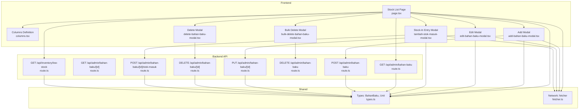
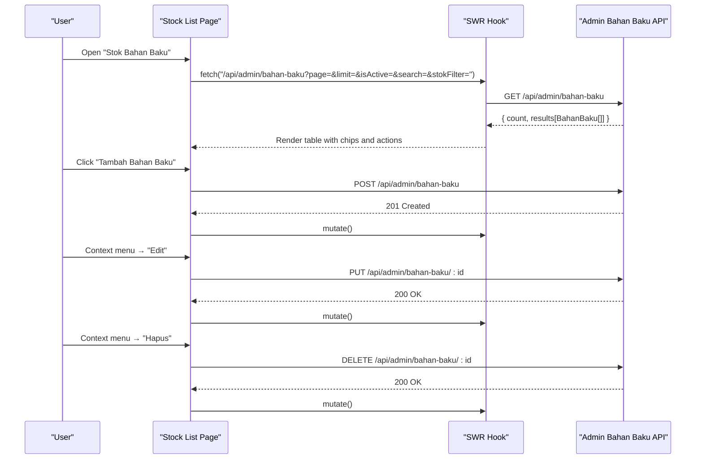
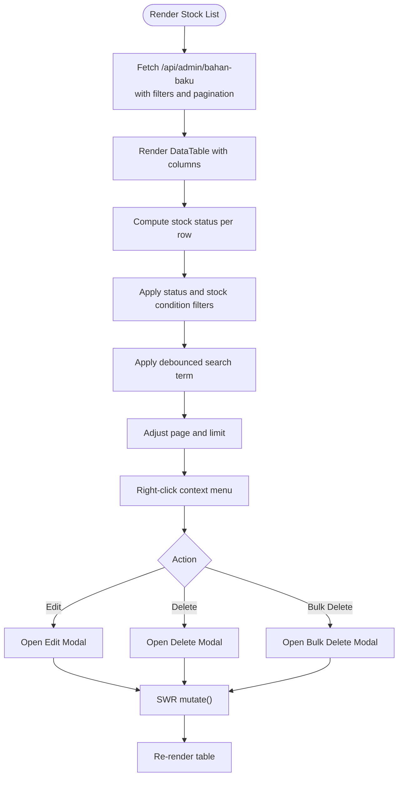
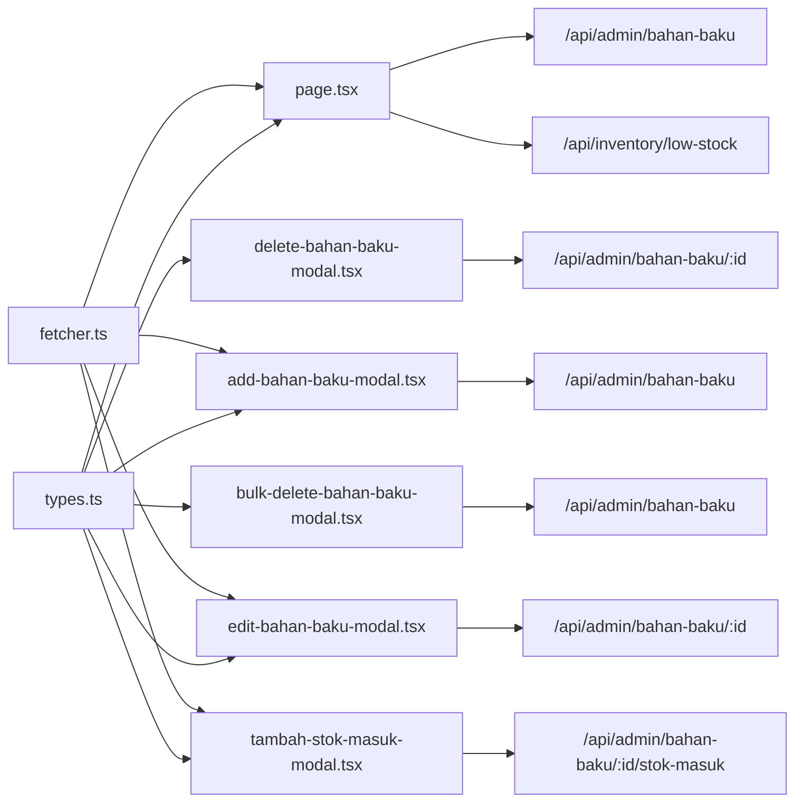

# Raw Material Tracking

<cite>
**Referenced Files in This Document**
- [page.tsx](file://src/app/(LoggedIn)/inventory/stock/page.tsx)
- [columns.tsx](file://src/app/(LoggedIn)/inventory/stock/components/columns.tsx)
- [add-bahan-baku-modal.tsx](file://src/app/(LoggedIn)/inventory/stock/components/add-bahan-baku-modal.tsx)
- [edit-bahan-baku-modal.tsx](file://src/app/(LoggedIn)/inventory/stock/components/edit-bahan-baku-modal.tsx)
- [delete-bahan-baku-modal.tsx](file://src/app/(LoggedIn)/inventory/stock/components/delete-bahan-baku-modal.tsx)
- [bulk-delete-bahan-baku-modal.tsx](file://src/app/(LoggedIn)/inventory/stock/components/bulk-delete-bahan-baku-modal.tsx)
- [tambah-stok-masuk-modal.tsx](file://src/app/(LoggedIn)/inventory/stock/components/tambah-stok-masuk-modal.tsx)
- [route.ts](file://src/app/api/admin/bahan-baku/route.ts)
- [route.ts](file://src/app/api/admin/bahan-baku/[id]/route.ts)
- [route.ts](file://src/app/api/admin/bahan-baku/[id]/stok-masuk/route.ts)
- [route.ts](file://src/app/api/inventory/low-stock/route.ts)
- [types.ts](file://src/types/types.ts)
- [fetcher.ts](file://src/lib/func.ts)
</cite>

## Table of Contents
1. [Introduction](#introduction)
2. [Project Structure](#project-structure)
3. [Core Components](#core-components)
4. [Architecture Overview](#architecture-overview)
5. [Detailed Component Analysis](#detailed-component-analysis)
6. [Dependency Analysis](#dependency-analysis)
7. [Performance Considerations](#performance-considerations)
8. [Troubleshooting Guide](#troubleshooting-guide)
9. [Conclusion](#conclusion)
10. [Appendices](#appendices)

## Introduction
This document explains the raw material (bahan baku) tracking system, covering material registration, categorization, unit conversion, minimum stock level settings, stock status indicators, filtering and search, CRUD operations, stock entry procedures, supplier integration, purchase order linkage, barcode scanning integration, batch tracking, expiry date management, inventory valuation, material requisition, wastage tracking, and inter-location transfers. It synthesizes frontend UI flows and backend API routes to present a complete operational picture.

## Project Structure
The raw material tracking feature spans:
- Frontend pages and modals under inventory/stock for listing, filtering, CRUD, and stock entry
- Backend API routes under /api/admin/bahan-baku and related endpoints
- Shared types and utilities for data modeling and network requests

**Diagram sources**
- [page.tsx:1-351](file://src/app/(LoggedIn)/inventory/stock/page.tsx#L1-L351)
- [columns.tsx:1-61](file://src/app/(LoggedIn)/inventory/stock/components/columns.tsx#L1-L61)
- [add-bahan-baku-modal.tsx:1-212](file://src/app/(LoggedIn)/inventory/stock/components/add-bahan-baku-modal.tsx#L1-L212)
- [edit-bahan-baku-modal.tsx:1-211](file://src/app/(LoggedIn)/inventory/stock/components/edit-bahan-baku-modal.tsx#L1-L211)
- [delete-bahan-baku-modal.tsx:1-145](file://src/app/(LoggedIn)/inventory/stock/components/delete-bahan-baku-modal.tsx#L1-L145)
- [bulk-delete-bahan-baku-modal.tsx:1-118](file://src/app/(LoggedIn)/inventory/stock/components/bulk-delete-bahan-baku-modal.tsx#L1-L118)
- [tambah-stok-masuk-modal.tsx:1-394](file://src/app/(LoggedIn)/inventory/stock/components/tambah-stok-masuk-modal.tsx#L1-L394)
- [route.ts](file://src/app/api/admin/bahan-baku/route.ts)
- [route.ts](file://src/app/api/admin/bahan-baku/[id]/route.ts)
- [route.ts](file://src/app/api/admin/bahan-baku/[id]/stok-masuk/route.ts)
- [route.ts](file://src/app/api/inventory/low-stock/route.ts)
- [types.ts](file://src/types/types.ts)
- [fetcher.ts](file://src/lib/func.ts)

**Section sources**
- [page.tsx:1-351](file://src/app/(LoggedIn)/inventory/stock/page.tsx#L1-L351)
- [columns.tsx:1-61](file://src/app/(LoggedIn)/inventory/stock/components/columns.tsx#L1-L61)
- [add-bahan-baku-modal.tsx:1-212](file://src/app/(LoggedIn)/inventory/stock/components/add-bahan-baku-modal.tsx#L1-L212)
- [edit-bahan-baku-modal.tsx:1-211](file://src/app/(LoggedIn)/inventory/stock/components/edit-bahan-baku-modal.tsx#L1-L211)
- [delete-bahan-baku-modal.tsx:1-145](file://src/app/(LoggedIn)/inventory/stock/components/delete-bahan-baku-modal.tsx#L1-L145)
- [bulk-delete-bahan-baku-modal.tsx:1-118](file://src/app/(LoggedIn)/inventory/stock/components/bulk-delete-bahan-baku-modal.tsx#L1-L118)
- [tambah-stok-masuk-modal.tsx:1-394](file://src/app/(LoggedIn)/inventory/stock/components/tambah-stok-masuk-modal.tsx#L1-L394)

## Core Components
- Stock list page with search, filters, pagination, context menu, and bulk actions
- Modals for add, edit, delete, and bulk delete
- Stock-in entry modal with supplier, invoice number, price, and receipt attachment
- Low stock indicator and status chip rendering
- Shared types for BahanBaku and Unit

Key behaviors:
- Stock status computed from current stock vs minimum stock threshold
- Filtering by activation status and stock condition (all, normal, low, out-of-stock)
- Search with debounced query string passed to the API
- Pagination via page and limit parameters

**Section sources**
- [page.tsx:45-52](file://src/app/(LoggedIn)/inventory/stock/page.tsx#L45-L52)
- [page.tsx:80-84](file://src/app/(LoggedIn)/inventory/stock/page.tsx#L80-L84)
- [page.tsx:114-154](file://src/app/(LoggedIn)/inventory/stock/page.tsx#L114-L154)
- [page.tsx:175-285](file://src/app/(LoggedIn)/inventory/stock/page.tsx#L175-L285)
- [columns.tsx:4-60](file://src/app/(LoggedIn)/inventory/stock/components/columns.tsx#L4-L60)

## Architecture Overview
The system follows a client-server pattern:
- Client-side Next.js app renders the UI and manages state
- SWR handles data fetching, caching, and revalidation
- API routes under /api/admin/bahan-baku implement CRUD and stock-in operations
- Low stock endpoint provides alerts for replenishment planning

**Diagram sources**
- [page.tsx:80-84](file://src/app/(LoggedIn)/inventory/stock/page.tsx#L80-L84)
- [route.ts](file://src/app/api/admin/bahan-baku/route.ts)
- [route.ts](file://src/app/api/admin/bahan-baku/[id]/route.ts)

## Detailed Component Analysis

### Stock List Page
Responsibilities:
- Debounced search input
- Status filter (active/inactive/all)
- Stock condition filter (all/low stock/out of stock)
- Pagination controls
- Context menu for single item actions
- Bulk selection bar with bulk delete
- Stock status chip rendering (normal, low stock, out of stock)
- Drawer to manage categories and refresh related caches

**Diagram sources**
- [page.tsx:54-351](file://src/app/(LoggedIn)/inventory/stock/page.tsx#L54-L351)
- [columns.tsx:4-60](file://src/app/(LoggedIn)/inventory/stock/components/columns.tsx#L4-L60)

**Section sources**
- [page.tsx:45-52](file://src/app/(LoggedIn)/inventory/stock/page.tsx#L45-L52)
- [page.tsx:80-84](file://src/app/(LoggedIn)/inventory/stock/page.tsx#L80-L84)
- [page.tsx:114-154](file://src/app/(LoggedIn)/inventory/stock/page.tsx#L114-L154)
- [page.tsx:175-285](file://src/app/(LoggedIn)/inventory/stock/page.tsx#L175-L285)

### Columns Definition
Defines visible columns for the stock table:
- Name, Unit, Stock, Minimum Stock, Description, Active Status
- Action column for mobile context menu

**Section sources**
- [columns.tsx:4-60](file://src/app/(LoggedIn)/inventory/stock/components/columns.tsx#L4-L60)

### Add Bahan Baku Modal
Features:
- Form validation for name, unit, optional initial stock and minimum stock
- Unit picker populated from /api/unit
- Formatted number inputs for stock and minimum stock
- Submission posts to /api/admin/bahan-baku

Operational notes:
- Initial stock defaults to zero
- Minimum stock may be empty (null persisted)
- On success, toast confirms creation and closes modal

**Section sources**
- [add-bahan-baku-modal.tsx:28-44](file://src/app/(LoggedIn)/inventory/stock/components/add-bahan-baku-modal.tsx#L28-L44)
- [add-bahan-baku-modal.tsx:65-98](file://src/app/(LoggedIn)/inventory/stock/components/add-bahan-baku-modal.tsx#L65-L98)
- [add-bahan-baku-modal.tsx:56-57](file://src/app/(LoggedIn)/inventory/stock/components/add-bahan-baku-modal.tsx#L56-L57)

### Edit Bahan Baku Modal
Features:
- Pre-populated form with name, unit, minimum stock, description, and active status
- Unit picker from /api/unit
- Toggle for active status
- Submission updates /api/admin/bahan-baku/:id

Operational notes:
- Minimum stock accepts empty input to clear the value
- Toast confirms successful update

**Section sources**
- [edit-bahan-baku-modal.tsx:55-75](file://src/app/(LoggedIn)/inventory/stock/components/edit-bahan-baku-modal.tsx#L55-L75)
- [edit-bahan-baku-modal.tsx:80-109](file://src/app/(LoggedIn)/inventory/stock/components/edit-bahan-baku-modal.tsx#L80-L109)
- [edit-bahan-baku-modal.tsx:49-50](file://src/app/(LoggedIn)/inventory/stock/components/edit-bahan-baku-modal.tsx#L49-L50)

### Delete Bahan Baku Modal
Features:
- Confirmation modal with warning about permanent deletion
- Single item deletion via DELETE /api/admin/bahan-baku/:id
- Toast feedback for success/failure

**Section sources**
- [delete-bahan-baku-modal.tsx:41-72](file://src/app/(LoggedIn)/inventory/stock/components/delete-bahan-baku-modal.tsx#L41-L72)

### Bulk Delete Bahan Baku Modal
Features:
- Bulk deletion via DELETE /api/admin/bahan-baku with array of IDs
- Confirmation modal with warning
- Toast displays count of deleted items

**Section sources**
- [bulk-delete-bahan-baku-modal.tsx:27-60](file://src/app/(LoggedIn)/inventory/stock/components/bulk-delete-bahan-baku-modal.tsx#L27-L60)

### Stock-In Entry Modal
Features:
- Adds incoming stock for a selected raw material
- Fields: quantity, date, optional supplier, purchase price, invoice number, description, and receipt attachment
- History tab shows recent stock-in entries with dates, quantities, added-by, supplier, and receipt links
- Submits multipart/form-data to /api/admin/bahan-baku/:id/stok-masuk

Supplier integration:
- Supplier dropdown filtered to active suppliers
- Optional supplier association with each stock-in record

Receipt management:
- Image/PDF upload for purchase receipts
- Link to view receipt in new tab

**Section sources**
- [tambah-stok-masuk-modal.tsx:27-34](file://src/app/(LoggedIn)/inventory/stock/components/tambah-stok-masuk-modal.tsx#L27-L34)
- [tambah-stok-masuk-modal.tsx:102-144](file://src/app/(LoggedIn)/inventory/stock/components/tambah-stok-masuk-modal.tsx#L102-L144)
- [tambah-stok-masuk-modal.tsx:63-71](file://src/app/(LoggedIn)/inventory/stock/components/tambah-stok-masuk-modal.tsx#L63-L71)
- [tambah-stok-masuk-modal.tsx:303-384](file://src/app/(LoggedIn)/inventory/stock/components/tambah-stok-masuk-modal.tsx#L303-L384)

### Low Stock Endpoint
- Provides low stock alerts for procurement/replenishment planning
- Used by the frontend to surface low-stock banners or lists

**Section sources**
- [route.ts](file://src/app/api/inventory/low-stock/route.ts)

### Data Models and Types
- BahanBaku: includes name, unitId, unit relation, stock quantity, minimum stock, description, active status, and timestamps
- Unit: includes unit name and related conversions

These types inform frontend rendering and API payloads.

**Section sources**
- [types.ts](file://src/types/types.ts)

## Dependency Analysis
High-level dependencies:
- UI components depend on shared types and SWR fetcher
- Modals depend on API routes for create/update/delete
- Stock-in modal depends on supplier and unit endpoints
- Stock list depends on low stock endpoint and filters

**Diagram sources**
- [page.tsx:1-351](file://src/app/(LoggedIn)/inventory/stock/page.tsx#L1-L351)
- [add-bahan-baku-modal.tsx:1-212](file://src/app/(LoggedIn)/inventory/stock/components/add-bahan-baku-modal.tsx#L1-L212)
- [edit-bahan-baku-modal.tsx:1-211](file://src/app/(LoggedIn)/inventory/stock/components/edit-bahan-baku-modal.tsx#L1-L211)
- [delete-bahan-baku-modal.tsx:1-145](file://src/app/(LoggedIn)/inventory/stock/components/delete-bahan-baku-modal.tsx#L1-L145)
- [bulk-delete-bahan-baku-modal.tsx:1-118](file://src/app/(LoggedIn)/inventory/stock/components/bulk-delete-bahan-baku-modal.tsx#L1-L118)
- [tambah-stok-masuk-modal.tsx:1-394](file://src/app/(LoggedIn)/inventory/stock/components/tambah-stok-masuk-modal.tsx#L1-L394)
- [route.ts](file://src/app/api/admin/bahan-baku/route.ts)
- [route.ts](file://src/app/api/admin/bahan-baku/[id]/route.ts)
- [route.ts](file://src/app/api/admin/bahan-baku/[id]/stok-masuk/route.ts)
- [route.ts](file://src/app/api/inventory/low-stock/route.ts)
- [types.ts](file://src/types/types.ts)
- [fetcher.ts](file://src/lib/func.ts)

**Section sources**
- [page.tsx:1-351](file://src/app/(LoggedIn)/inventory/stock/page.tsx#L1-L351)
- [tambah-stok-masuk-modal.tsx:1-394](file://src/app/(LoggedIn)/inventory/stock/components/tambah-stok-masuk-modal.tsx#L1-L394)

## Performance Considerations
- Debounced search reduces API calls during typing
- Keep previous data while refetching improves perceived responsiveness
- Pagination limits rows per page to avoid large payloads
- SWR cache invalidation after mutations ensures UI stays in sync
- Conditional SWR fetches (only when modal is open) reduce unnecessary network usage

[No sources needed since this section provides general guidance]

## Troubleshooting Guide
Common issues and resolutions:
- Network errors during CRUD: UI displays generic network error; retry after checking connectivity
- Validation errors on forms: resolve field-specific messages (required fields, numeric values)
- Deleting items: confirmation modal prevents accidental deletions; ensure no dependent records exist
- Bulk deletion: confirm the count and understand that related stock-in history is also removed
- Stock-in entry: ensure quantity is greater than zero; attach valid receipt images/PDFs

**Section sources**
- [add-bahan-baku-modal.tsx:95-97](file://src/app/(LoggedIn)/inventory/stock/components/add-bahan-baku-modal.tsx#L95-L97)
- [edit-bahan-baku-modal.tsx:106-108](file://src/app/(LoggedIn)/inventory/stock/components/edit-bahan-baku-modal.tsx#L106-L108)
- [delete-bahan-baku-modal.tsx:63-69](file://src/app/(LoggedIn)/inventory/stock/components/delete-bahan-baku-modal.tsx#L63-L69)
- [bulk-delete-bahan-baku-modal.tsx:51-57](file://src/app/(LoggedIn)/inventory/stock/components/bulk-delete-bahan-baku-modal.tsx#L51-L57)
- [tambah-stok-masuk-modal.tsx:141-143](file://src/app/(LoggedIn)/inventory/stock/components/tambah-stok-masuk-modal.tsx#L141-L143)

## Conclusion
The raw material tracking system integrates a responsive UI with robust API endpoints to support end-to-end inventory management. Users can register materials, configure units and minimum thresholds, monitor stock status, and record stock-in events linked to suppliers and receipts. The system’s design supports scalability via pagination, filtering, and efficient data fetching.

[No sources needed since this section summarizes without analyzing specific files]

## Appendices

### Practical Workflows

- Material Registration
  - Open “Tambah Bahan Baku” modal
  - Select unit, optionally set initial stock and minimum stock
  - Submit to create the material record

- Editing Existing Records
  - Right-click a row → “Edit”
  - Adjust name, unit, minimum stock, description, and active status
  - Save changes

- Bulk Deletion
  - Select multiple rows
  - Use bulk delete action
  - Confirm deletion in modal

- Individual Deletion
  - Right-click a row → “Hapus”
  - Confirm in modal

- Stock Entry Procedures
  - From the stock list, open “Catat Masuk” for a material
  - Enter quantity, date, optional supplier, price, invoice number, and receipt
  - Submit to update stock and record transaction

- Supplier Integration
  - Supplier dropdown is preloaded and filtered to active suppliers
  - Each stock-in can be associated with a supplier for auditability

- Purchase Order Linkage
  - Invoice number can be recorded during stock-in for PO linkage
  - Receipt attachments support document retention

- Barcode Scanning Integration
  - Suggested enhancement: integrate barcode scanner to auto-fill material and quantity fields in stock-in modal

- Batch Tracking
  - Enhancement suggestion: add batch number and expiry date fields to stock-in modal for traceability

- Expiry Date Management
  - Enhancement suggestion: add expiry date column and expiry alerts in low stock reporting

- Inventory Valuation Methods
  - Enhancement suggestion: implement FIFO/LIFO valuation modes selectable per material or globally

- Material Requisition Processes
  - Enhancement suggestion: add stock-out entry modal for internal requisitions with requester and approval fields

- Wastage Tracking
  - Enhancement suggestion: add wastage stock-out entries with reason codes and loss valuation

- Inter-Location Transfers
  - Enhancement suggestion: add transfer modal with source/destination location fields and transfer documentation

[No sources needed since this section provides general guidance]