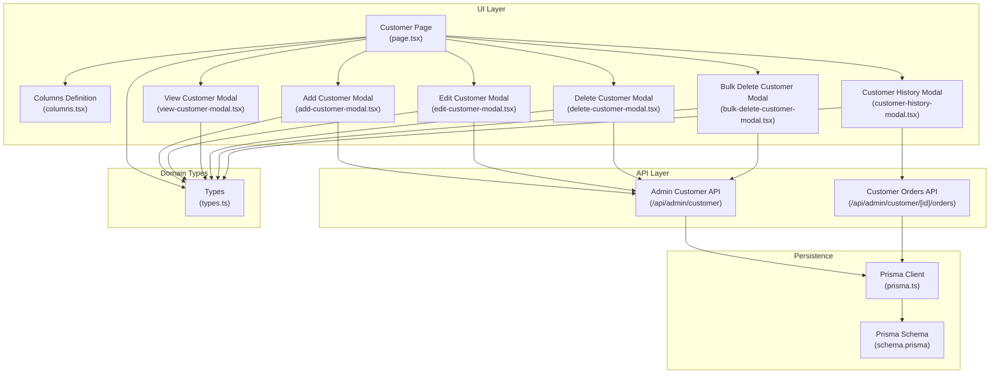
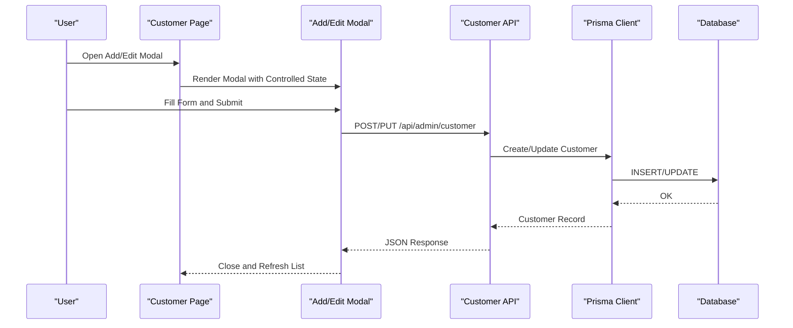
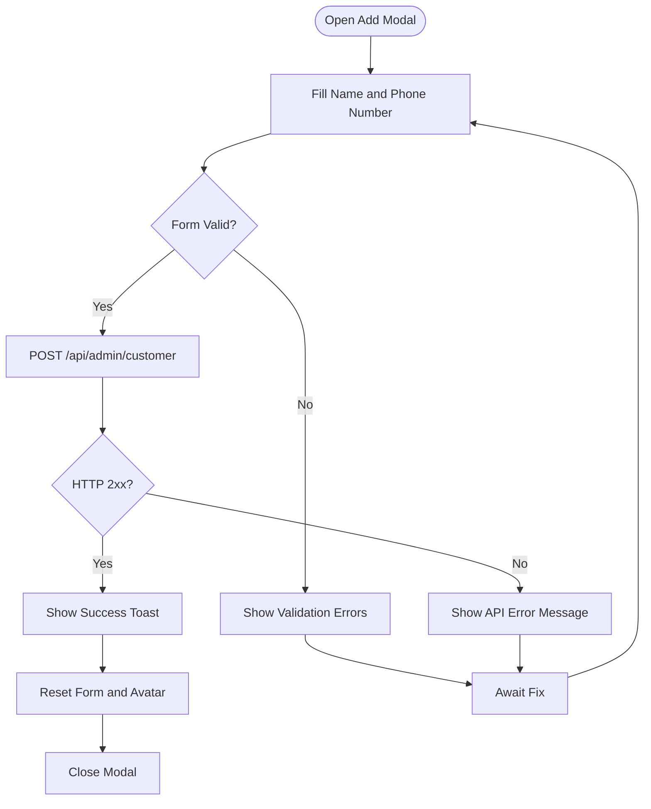
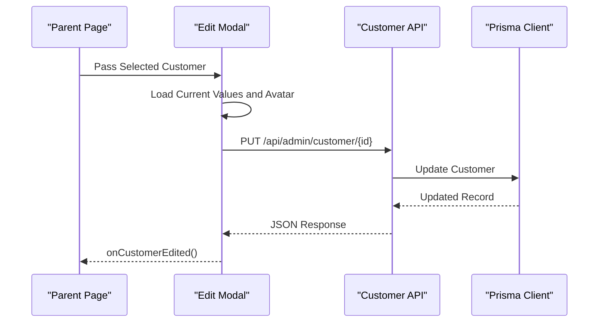
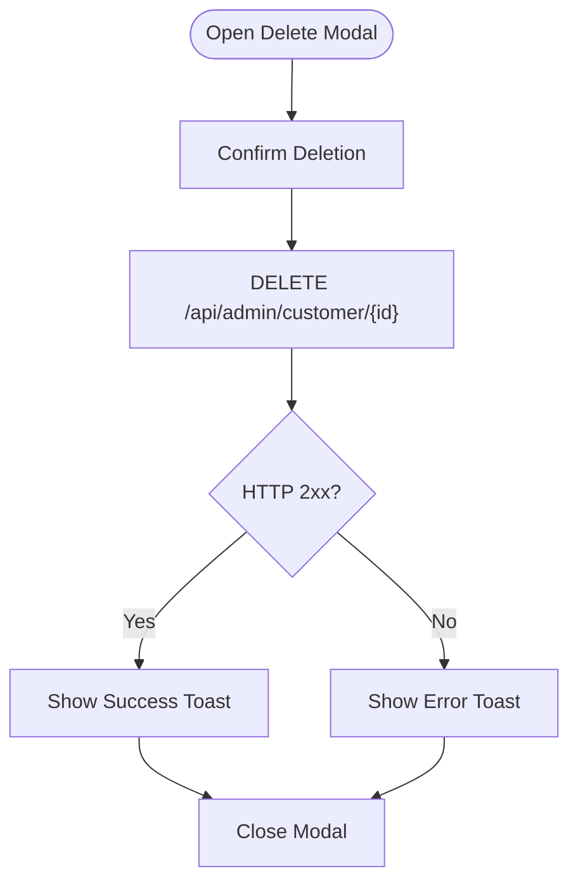
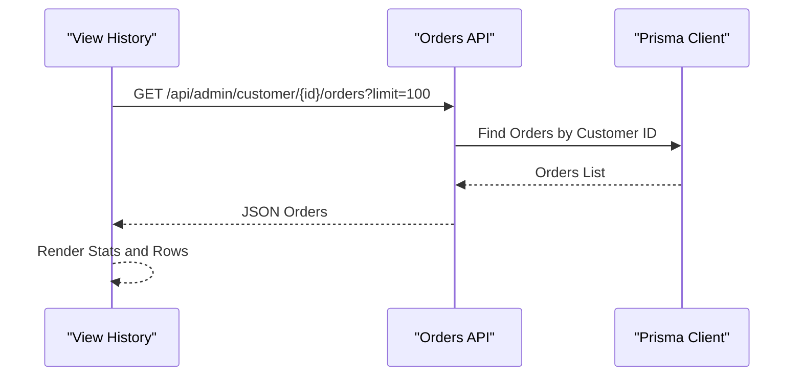
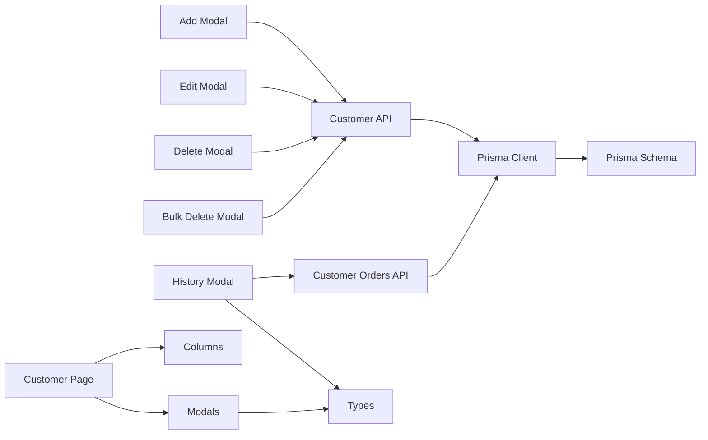
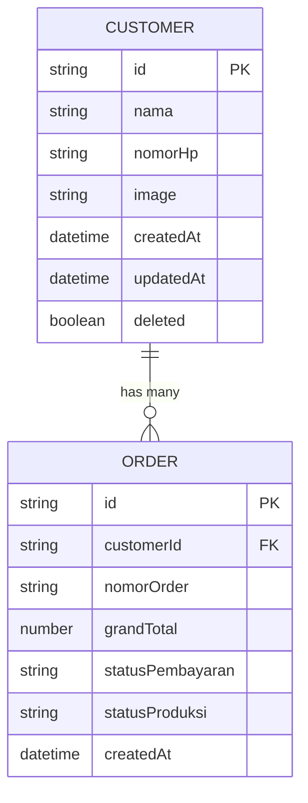

# Customer Management

<cite>
**Referenced Files in This Document**
- [add-customer-modal.tsx](file://src/app/(LoggedIn)/master/customer/components/add-customer-modal.tsx)
- [edit-customer-modal.tsx](file://src/app/(LoggedIn)/master/customer/components/edit-customer-modal.tsx)
- [view-customer-modal.tsx](file://src/app/(LoggedIn)/master/customer/components/view-customer-modal.tsx)
- [delete-customer-modal.tsx](file://src/app/(LoggedIn)/master/customer/components/delete-customer-modal.tsx)
- [bulk-delete-customer-modal.tsx](file://src/app/(LoggedIn)/master/customer/components/bulk-delete-customer-modal.tsx)
- [customer-history-modal.tsx](file://src/app/(LoggedIn)/master/customer/components/customer-history-modal.tsx)
- [columns.tsx](file://src/app/(LoggedIn)/master/customer/components/columns.tsx)
- [page.tsx](file://src/app/(LoggedIn)/master/customer/page.tsx)
- [route.ts](file://src/app/api/admin/customer/route.ts)
- [order-route.ts](file://src/app/api/admin/customer/[id]/orders/route.ts)
- [types.ts](file://src/types/types.ts)
- [func.ts](file://src/lib/func.ts)
- [prisma.ts](file://src/lib/prisma.ts)
- [schema.prisma](file://prisma/schema.prisma)
</cite>

## Table of Contents
1. [Introduction](#introduction)
2. [Project Structure](#project-structure)
3. [Core Components](#core-components)
4. [Architecture Overview](#architecture-overview)
5. [Detailed Component Analysis](#detailed-component-analysis)
6. [Dependency Analysis](#dependency-analysis)
7. [Performance Considerations](#performance-considerations)
8. [Troubleshooting Guide](#troubleshooting-guide)
9. [Conclusion](#conclusion)
10. [Appendices](#appendices)

## Introduction
This document describes the customer management system within the application. It covers the complete customer lifecycle: registration, profile updates, contact information maintenance, and deletion with soft-delete semantics. It documents the modal-based interface for adding, editing, viewing, and deleting customers, along with bulk deletion capabilities. It also explains customer history tracking via order associations, validation rules, duplicate prevention mechanisms, search functionality, and integration with order management and financial systems.

## Project Structure
The customer management feature is organized under the master data section, with dedicated components for modals and a server-side API for persistence and queries. The UI components are React-based modal dialogs built with a UI library, while the backend is implemented as Next.js App Router API handlers.

**Diagram sources**
- [page.tsx](file://src/app/(LoggedIn)/master/customer/page.tsx)
- [columns.tsx](file://src/app/(LoggedIn)/master/customer/components/columns.tsx)
- [add-customer-modal.tsx](file://src/app/(LoggedIn)/master/customer/components/add-customer-modal.tsx)
- [edit-customer-modal.tsx](file://src/app/(LoggedIn)/master/customer/components/edit-customer-modal.tsx)
- [view-customer-modal.tsx](file://src/app/(LoggedIn)/master/customer/components/view-customer-modal.tsx)
- [delete-customer-modal.tsx](file://src/app/(LoggedIn)/master/customer/components/delete-customer-modal.tsx)
- [bulk-delete-customer-modal.tsx](file://src/app/(LoggedIn)/master/customer/components/bulk-delete-customer-modal.tsx)
- [customer-history-modal.tsx](file://src/app/(LoggedIn)/master/customer/components/customer-history-modal.tsx)
- [route.ts](file://src/app/api/admin/customer/route.ts)
- [order-route.ts](file://src/app/api/admin/customer/[id]/orders/route.ts)
- [types.ts](file://src/types/types.ts)
- [prisma.ts](file://src/lib/prisma.ts)
- [schema.prisma](file://prisma/schema.prisma)

**Section sources**
- [page.tsx](file://src/app/(LoggedIn)/master/customer/page.tsx)
- [columns.tsx](file://src/app/(LoggedIn)/master/customer/components/columns.tsx)

## Core Components
- Add Customer Modal: Provides a form to register new customers with validation and avatar selection. Submits to the customer API endpoint.
- Edit Customer Modal: Allows updating customer details and avatar; validates inputs and persists changes.
- View Customer Modal: Displays customer information in a read-only modal.
- Delete Customer Modal: Initiates soft deletion of a customer with confirmation and explanatory messaging.
- Bulk Delete Customer Modal: Deletes multiple customers at once with explicit warnings about data loss.
- Customer History Modal: Shows order history for a customer, including payment status and production status.
- Columns: Defines the customer table columns and action buttons (view, edit, delete, history).
- Page: Orchestrates the customer list, pagination, and modal rendering lifecycle.

Validation rules enforced in modals:
- Required fields: Name and phone number.
- Form submission uses controlled modals with Zod validation and React Hook Form.

Duplicate prevention:
- The UI enforces required fields and prevents empty submissions.
- The database schema defines uniqueness constraints for identifiers; the API handles constraint violations and returns appropriate errors.

Search and filtering:
- The customer list supports pagination and limits; search/filter UI components are reused across master data pages.

Integration with order management:
- Customer history modal fetches order records via the customer orders API endpoint.
- Order creation screens can reference customers and link orders to customer IDs.

**Section sources**
- [add-customer-modal.tsx](file://src/app/(LoggedIn)/master/customer/components/add-customer-modal.tsx)
- [edit-customer-modal.tsx](file://src/app/(LoggedIn)/master/customer/components/edit-customer-modal.tsx)
- [view-customer-modal.tsx](file://src/app/(LoggedIn)/master/customer/components/view-customer-modal.tsx)
- [delete-customer-modal.tsx](file://src/app/(LoggedIn)/master/customer/components/delete-customer-modal.tsx)
- [bulk-delete-customer-modal.tsx](file://src/app/(LoggedIn)/master/customer/components/bulk-delete-customer-modal.tsx)
- [customer-history-modal.tsx](file://src/app/(LoggedIn)/master/customer/components/customer-history-modal.tsx)
- [columns.tsx](file://src/app/(LoggedIn)/master/customer/components/columns.tsx)
- [page.tsx](file://src/app/(LoggedIn)/master/customer/page.tsx)

## Architecture Overview
The customer management feature follows a layered architecture:
- UI Layer: Modal components and table columns render and collect user input.
- API Layer: Next.js App Router API handlers manage CRUD operations and customer history retrieval.
- Domain Types: Strongly typed customer and order row models.
- Persistence: Prisma client interacts with the database schema.

**Diagram sources**
- [add-customer-modal.tsx](file://src/app/(LoggedIn)/master/customer/components/add-customer-modal.tsx)
- [edit-customer-modal.tsx](file://src/app/(LoggedIn)/master/customer/components/edit-customer-modal.tsx)
- [route.ts](file://src/app/api/admin/customer/route.ts)
- [prisma.ts](file://src/lib/prisma.ts)
- [schema.prisma](file://prisma/schema.prisma)

## Detailed Component Analysis

### Add Customer Modal
Purpose:
- Capture customer name and phone number.
- Allow avatar selection with a preview.
- Validate inputs and submit to the API.

Key behaviors:
- Uses Zod schema for validation and React Hook Form for state.
- On success, resets form, shows a toast, and closes the modal.
- On failure, displays a global error returned by the API.

**Diagram sources**
- [add-customer-modal.tsx](file://src/app/(LoggedIn)/master/customer/components/add-customer-modal.tsx)
- [route.ts](file://src/app/api/admin/customer/route.ts)

**Section sources**
- [add-customer-modal.tsx](file://src/app/(LoggedIn)/master/customer/components/add-customer-modal.tsx)

### Edit Customer Modal
Purpose:
- Update existing customer details and avatar.
- Pre-populate form with current values.

Key behaviors:
- Controlled modal pattern allows parent orchestration.
- Validates inputs and PUTs to the customer endpoint.
- On success, closes modal and notifies parent to refresh data.

**Diagram sources**
- [edit-customer-modal.tsx](file://src/app/(LoggedIn)/master/customer/components/edit-customer-modal.tsx)
- [route.ts](file://src/app/api/admin/customer/route.ts)
- [prisma.ts](file://src/lib/prisma.ts)

**Section sources**
- [edit-customer-modal.tsx](file://src/app/(LoggedIn)/master/customer/components/edit-customer-modal.tsx)

### View Customer Modal
Purpose:
- Display customer details in a read-only modal with avatar and basic info.

Key behaviors:
- Uses controlled open state for parent-driven visibility.
- Formats creation date for readability.

**Section sources**
- [view-customer-modal.tsx](file://src/app/(LoggedIn)/master/customer/components/view-customer-modal.tsx)

### Delete Customer Modal
Purpose:
- Soft-delete a single customer with confirmation and explanatory messaging.

Key behaviors:
- Confirms deletion intent and warns about moving to trash.
- Calls DELETE endpoint and shows feedback via toast.

**Diagram sources**
- [delete-customer-modal.tsx](file://src/app/(LoggedIn)/master/customer/components/delete-customer-modal.tsx)
- [route.ts](file://src/app/api/admin/customer/route.ts)

**Section sources**
- [delete-customer-modal.tsx](file://src/app/(LoggedIn)/master/customer/components/delete-customer-modal.tsx)

### Bulk Delete Customer Modal
Purpose:
- Permanently delete multiple customers with explicit warnings.

Key behaviors:
- Sends selected IDs to the customer API for bulk deletion.
- Warns about permanent deletion and associated data loss.

**Section sources**
- [bulk-delete-customer-modal.tsx](file://src/app/(LoggedIn)/master/customer/components/bulk-delete-customer-modal.tsx)

### Customer History Modal
Purpose:
- Display order history for a customer with payment and production statuses.

Key behaviors:
- Fetches paginated order data from the customer orders API.
- Renders stats and order rows with status chips.
- Uses SWR for data fetching and skeleton loaders during loading.

**Diagram sources**
- [customer-history-modal.tsx](file://src/app/(LoggedIn)/master/customer/components/customer-history-modal.tsx)
- [order-route.ts](file://src/app/api/admin/customer/[id]/orders/route.ts)
- [prisma.ts](file://src/lib/prisma.ts)

**Section sources**
- [customer-history-modal.tsx](file://src/app/(LoggedIn)/master/customer/components/customer-history-modal.tsx)

### Columns and Page Orchestration
Purpose:
- Define table columns and action buttons.
- Manage modal visibility and refresh lifecycle.

Key behaviors:
- Columns define rendering and actions per row.
- Page composes modals and passes callbacks to refresh data after edits/deletes.

**Section sources**
- [columns.tsx](file://src/app/(LoggedIn)/master/customer/components/columns.tsx)
- [page.tsx](file://src/app/(LoggedIn)/master/customer/page.tsx)

## Dependency Analysis
The customer feature depends on:
- UI components for modals and table columns.
- API handlers for CRUD and history retrieval.
- Domain types for strongly typed data contracts.
- Prisma client and schema for persistence.

**Diagram sources**
- [add-customer-modal.tsx](file://src/app/(LoggedIn)/master/customer/components/add-customer-modal.tsx)
- [edit-customer-modal.tsx](file://src/app/(LoggedIn)/master/customer/components/edit-customer-modal.tsx)
- [delete-customer-modal.tsx](file://src/app/(LoggedIn)/master/customer/components/delete-customer-modal.tsx)
- [bulk-delete-customer-modal.tsx](file://src/app/(LoggedIn)/master/customer/components/bulk-delete-customer-modal.tsx)
- [customer-history-modal.tsx](file://src/app/(LoggedIn)/master/customer/components/customer-history-modal.tsx)
- [route.ts](file://src/app/api/admin/customer/route.ts)
- [order-route.ts](file://src/app/api/admin/customer/[id]/orders/route.ts)
- [prisma.ts](file://src/lib/prisma.ts)
- [schema.prisma](file://prisma/schema.prisma)
- [types.ts](file://src/types/types.ts)
- [page.tsx](file://src/app/(LoggedIn)/master/customer/page.tsx)
- [columns.tsx](file://src/app/(LoggedIn)/master/customer/components/columns.tsx)

**Section sources**
- [route.ts](file://src/app/api/admin/customer/route.ts)
- [order-route.ts](file://src/app/api/admin/customer/[id]/orders/route.ts)
- [prisma.ts](file://src/lib/prisma.ts)
- [schema.prisma](file://prisma/schema.prisma)
- [types.ts](file://src/types/types.ts)

## Performance Considerations
- Modal rendering is lightweight; controlled state minimizes unnecessary re-renders.
- Customer history uses paginated queries to avoid large payloads.
- SWR caching can improve repeated history fetches; consider cache keys aligned with customer ID and pagination parameters.
- Bulk operations send a single request with an array of IDs; ensure server-side batching reduces round-trips.

## Troubleshooting Guide
Common issues and resolutions:
- Network errors during submission: UI displays a generic network error; retry submission or check connectivity.
- API errors: The UI reads the error field from the response and shows it; address validation or constraint violations reported by the backend.
- Duplicate prevention: If the database enforces unique constraints, the API returns an error; ensure unique identifiers are respected.
- Search and filters: Use the shared filter components to refine lists; verify pagination parameters when navigating.

Operational tips:
- After edits/deletes, trigger a data refresh to reflect changes in the UI.
- For bulk deletions, confirm the scope of IDs and understand the impact on order history.

**Section sources**
- [add-customer-modal.tsx](file://src/app/(LoggedIn)/master/customer/components/add-customer-modal.tsx)
- [edit-customer-modal.tsx](file://src/app/(LoggedIn)/master/customer/components/edit-customer-modal.tsx)
- [delete-customer-modal.tsx](file://src/app/(LoggedIn)/master/customer/components/delete-customer-modal.tsx)
- [bulk-delete-customer-modal.tsx](file://src/app/(LoggedIn)/master/customer/components/bulk-delete-customer-modal.tsx)
- [customer-history-modal.tsx](file://src/app/(LoggedIn)/master/customer/components/customer-history-modal.tsx)

## Conclusion
The customer management system provides a robust, modal-driven interface for customer lifecycle operations with strong validation and clear feedback. It integrates seamlessly with order history and leverages a clean separation between UI, API, and persistence layers. The design supports safe deletion with soft-delete semantics and offers bulk operations for efficient administration.

## Appendices

### Data Model Overview
Customer entity and related order row model are defined in domain types and used across components.

**Diagram sources**
- [types.ts](file://src/types/types.ts)
- [schema.prisma](file://prisma/schema.prisma)

### Practical Workflows

- Customer onboarding:
  - Open Add Customer Modal, fill name and phone number, select avatar, submit.
  - On success, the list refreshes and the customer appears.

- Editing a customer:
  - Select Edit from the customer row, update details, save.
  - Parent receives a callback to refresh the table.

- Viewing customer history:
  - Open the history modal from the customer row.
  - The modal fetches recent orders and displays stats and rows.

- Deleting a customer:
  - Open Delete Customer Modal, confirm, and observe the toast feedback.
  - The customer moves to trash; order history remains intact.

- Bulk customer operations:
  - Select multiple rows, open Bulk Delete Customer Modal, confirm.
  - The operation permanently deletes selected customers and their order history.

- Customer segmentation for marketing:
  - Use the order history modal to analyze purchasing behavior and payment trends.
  - Combine with filters and export capabilities to build targeted campaigns.

**Section sources**
- [customer-history-modal.tsx](file://src/app/(LoggedIn)/master/customer/components/customer-history-modal.tsx)
- [page.tsx](file://src/app/(LoggedIn)/master/customer/page.tsx)