# Employee Management

<cite>
**Referenced Files in This Document**
- [page.tsx](file://src/app/(LoggedIn)/master/karyawan/page.tsx)
- [add-karyawan-modal.tsx](file://src/app/(LoggedIn)/master/karyawan/components/add-karyawan-modal.tsx)
- [edit-karyawan-modal.tsx](file://src/app/(LoggedIn)/master/karyawan/components/edit-karyawan-modal.tsx)
- [view-karyawan-modal.tsx](file://src/app/(LoggedIn)/master/karyawan/components/view-karyawan-modal.tsx)
- [delete-karyawan-modal.tsx](file://src/app/(LoggedIn)/master/karyawan/components/delete-karyawan-modal.tsx)
- [bulk-delete-karyawan-modal.tsx](file://src/app/(LoggedIn)/master/karyawan/components/bulk-delete-karyawan-modal.tsx)
- [columns.tsx](file://src/app/(LoggedIn)/master/karyawan/components/columns.tsx)
- [layout.tsx](file://src/app/(LoggedIn)/master/karyawan/layout.tsx)
- [route.ts](file://src/app/api/admin/karyawan/route.ts)
- [types.ts](file://src/types/types.ts)
- [schema.prisma](file://prisma/schema.prisma)
- [roles.ts](file://src/config/roles.ts)
- [permissions.ts](file://src/lib/permissions.ts)
- [navigation.ts](file://src/config/navigation.ts)
- [page.tsx](file://src/app/(LoggedIn)/production/spk/page.tsx)
- [page.tsx](file://src/app/(LoggedIn)/finance/dashboard/page.tsx)
- [seed-transactions.ts](file://prisma/seed-transactions.ts)
- [seed-finance.ts](file://prisma/seed-finance.ts)
</cite>

## Table of Contents
1. [Introduction](#introduction)
2. [Project Structure](#project-structure)
3. [Core Components](#core-components)
4. [Architecture Overview](#architecture-overview)
5. [Detailed Component Analysis](#detailed-component-analysis)
6. [Dependency Analysis](#dependency-analysis)
7. [Performance Considerations](#performance-considerations)
8. [Troubleshooting Guide](#troubleshooting-guide)
9. [Conclusion](#conclusion)
10. [Appendices](#appendices)

## Introduction
This document describes the employee management subsystem of the POS system with a focus on:
- Employee registration and personal information management
- Position assignment and department-like categorization
- Employee status tracking and lifecycle (active/inactive)
- Organizational hierarchy and role-based access
- Modal-based CRUD and bulk operations
- Integration touchpoints with payroll, production workflows, and finance

It synthesizes frontend UI components, backend API routes, database schema, and configuration to present a cohesive operational picture.

## Project Structure
The employee management feature is organized around a dedicated master data module under the logged-in dashboard, with a dedicated API surface and shared types.

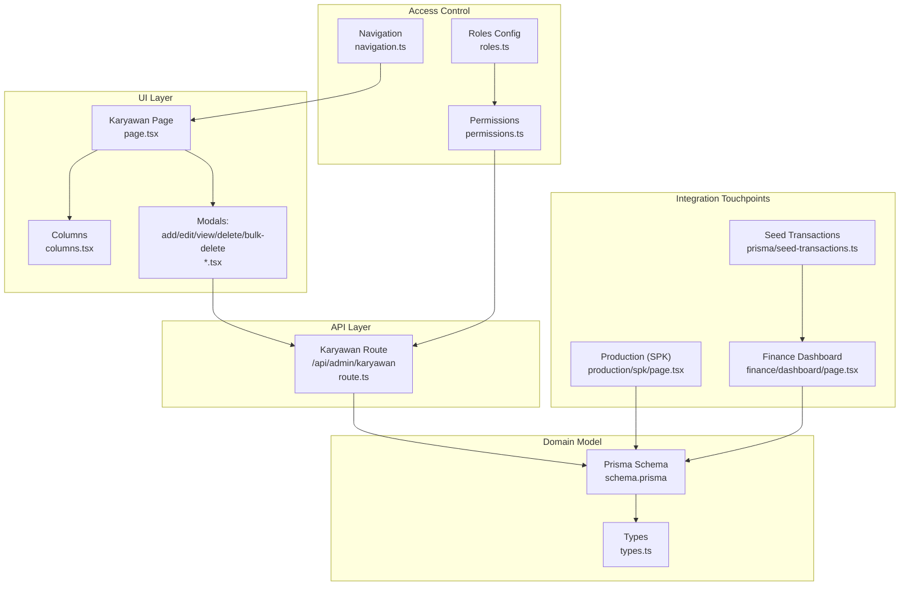

**Diagram sources**
- [page.tsx](file://src/app/(LoggedIn)/master/karyawan/page.tsx#L38-L264)
- [columns.tsx](file://src/app/(LoggedIn)/master/karyawan/components/columns.tsx#L1-L43)
- [add-karyawan-modal.tsx](file://src/app/(LoggedIn)/master/karyawan/components/add-karyawan-modal.tsx#L1-L145)
- [edit-karyawan-modal.tsx](file://src/app/(LoggedIn)/master/karyawan/components/edit-karyawan-modal.tsx#L1-L191)
- [view-karyawan-modal.tsx](file://src/app/(LoggedIn)/master/karyawan/components/view-karyawan-modal.tsx#L1-L97)
- [delete-karyawan-modal.tsx](file://src/app/(LoggedIn)/master/karyawan/components/delete-karyawan-modal.tsx#L1-L73)
- [bulk-delete-karyawan-modal.tsx](file://src/app/(LoggedIn)/master/karyawan/components/bulk-delete-karyawan-modal.tsx#L1-L114)
- [route.ts:1-184](file://src/app/api/admin/karyawan/route.ts#L1-L184)
- [types.ts:66-74](file://src/types/types.ts#L66-L74)
- [schema.prisma:332-344](file://prisma/schema.prisma#L332-L344)
- [roles.ts:1-17](file://src/config/roles.ts#L1-L17)
- [permissions.ts:1-66](file://src/lib/permissions.ts#L1-L66)
- [navigation.ts:59-115](file://src/config/navigation.ts#L59-L115)
- [page.tsx](file://src/app/(LoggedIn)/production/spk/page.tsx#L1-L43)
- [page.tsx](file://src/app/(LoggedIn)/finance/dashboard/page.tsx#L764-L816)
- [seed-transactions.ts:246-284](file://prisma/seed-transactions.ts#L246-L284)
- [seed-finance.ts:40-62](file://prisma/seed-finance.ts#L40-L62)

**Section sources**
- [page.tsx](file://src/app/(LoggedIn)/master/karyawan/page.tsx#L38-L264)
- [layout.tsx](file://src/app/(LoggedIn)/master/karyawan/layout.tsx#L1-L11)

## Core Components
- Employee listing and filtering: paginated table with search and status filters, context menu, and bulk selection bar.
- Modal forms: add, edit (with activation toggle), view details, and delete confirmation.
- Bulk deletion modal for mass removal.
- Backend API: list, create, and bulk delete endpoints guarded by role checks.
- Shared domain type for employees.
- Prisma model for employees with relations to production SPK records.

Key capabilities:
- Register employees with name, optional phone, and position.
- Toggle active status.
- View detailed profile.
- Bulk delete with confirmation.
- Paginated listing with search and status filtering.

**Section sources**
- [page.tsx](file://src/app/(LoggedIn)/master/karyawan/page.tsx#L38-L264)
- [add-karyawan-modal.tsx](file://src/app/(LoggedIn)/master/karyawan/components/add-karyawan-modal.tsx#L21-L71)
- [edit-karyawan-modal.tsx](file://src/app/(LoggedIn)/master/karyawan/components/edit-karyawan-modal.tsx#L22-L91)
- [view-karyawan-modal.tsx](file://src/app/(LoggedIn)/master/karyawan/components/view-karyawan-modal.tsx#L15-L96)
- [delete-karyawan-modal.tsx](file://src/app/(LoggedIn)/master/karyawan/components/delete-karyawan-modal.tsx#L8-L72)
- [bulk-delete-karyawan-modal.tsx](file://src/app/(LoggedIn)/master/karyawan/components/bulk-delete-karyawan-modal.tsx#L17-L54)
- [route.ts:6-69](file://src/app/api/admin/karyawan/route.ts#L6-L69)
- [types.ts:66-74](file://src/types/types.ts#L66-L74)
- [schema.prisma:332-344](file://prisma/schema.prisma#L332-L344)

## Architecture Overview
The system follows a layered architecture:
- UI: Next.js client components with modal dialogs and data table.
- API: Next.js API route handlers enforcing session and role checks.
- Persistence: Prisma ORM mapping to MySQL.
- Access control: centralized roles and permissions configuration.

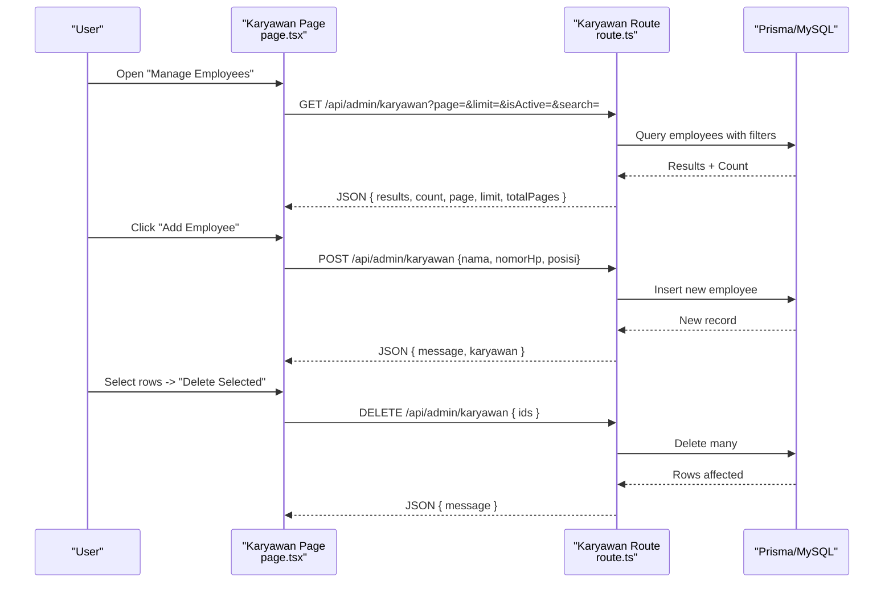

**Diagram sources**
- [page.tsx](file://src/app/(LoggedIn)/master/karyawan/page.tsx#L61-L65)
- [route.ts:6-69](file://src/app/api/admin/karyawan/route.ts#L6-L69)
- [route.ts:71-138](file://src/app/api/admin/karyawan/route.ts#L71-L138)
- [route.ts:140-183](file://src/app/api/admin/karyawan/route.ts#L140-L183)

## Detailed Component Analysis

### Employee Listing and Interaction
- Filtering: status (active/inactive/all), search by name, pagination.
- Actions: context menu (view, edit, delete), bulk selection bar with bulk delete.
- Data presentation: columns for name, position, phone, and status indicator.

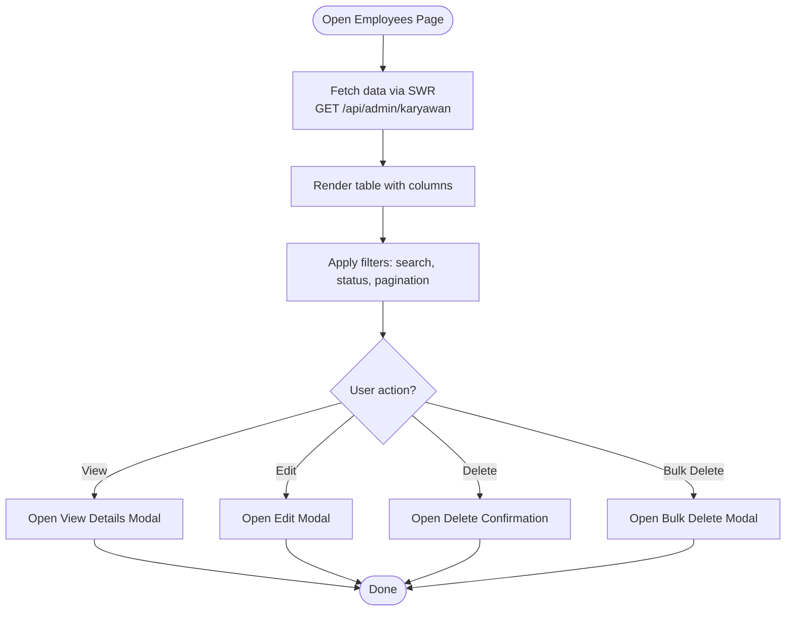

**Diagram sources**
- [page.tsx](file://src/app/(LoggedIn)/master/karyawan/page.tsx#L38-L264)
- [columns.tsx](file://src/app/(LoggedIn)/master/karyawan/components/columns.tsx#L4-L42)
- [view-karyawan-modal.tsx](file://src/app/(LoggedIn)/master/karyawan/components/view-karyawan-modal.tsx#L15-L96)
- [edit-karyawan-modal.tsx](file://src/app/(LoggedIn)/master/karyawan/components/edit-karyawan-modal.tsx#L31-L91)
- [delete-karyawan-modal.tsx](file://src/app/(LoggedIn)/master/karyawan/components/delete-karyawan-modal.tsx#L8-L72)
- [bulk-delete-karyawan-modal.tsx](file://src/app/(LoggedIn)/master/karyawan/components/bulk-delete-karyawan-modal.tsx#L17-L54)

**Section sources**
- [page.tsx](file://src/app/(LoggedIn)/master/karyawan/page.tsx#L38-L264)
- [columns.tsx](file://src/app/(LoggedIn)/master/karyawan/components/columns.tsx#L4-L42)

### Employee Registration (Add)
- Form fields: name (required), position (optional), phone (optional).
- Validation: Zod schema enforces required name.
- Submission: POST to API endpoint; success clears form and closes modal.

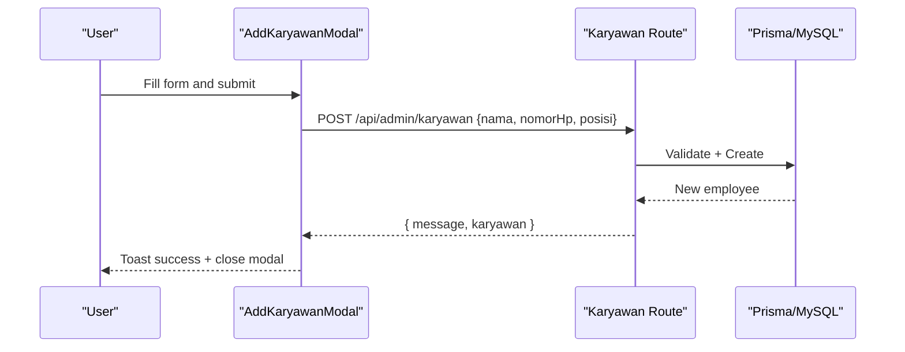

**Diagram sources**
- [add-karyawan-modal.tsx](file://src/app/(LoggedIn)/master/karyawan/components/add-karyawan-modal.tsx#L21-L71)
- [route.ts:71-138](file://src/app/api/admin/karyawan/route.ts#L71-L138)

**Section sources**
- [add-karyawan-modal.tsx](file://src/app/(LoggedIn)/master/karyawan/components/add-karyawan-modal.tsx#L21-L71)
- [route.ts:71-138](file://src/app/api/admin/karyawan/route.ts#L71-L138)

### Personal Information Management (Edit)
- Fields: name, position, phone, active status switch.
- Controlled modal with pre-filled values; updates persisted via PUT to API.

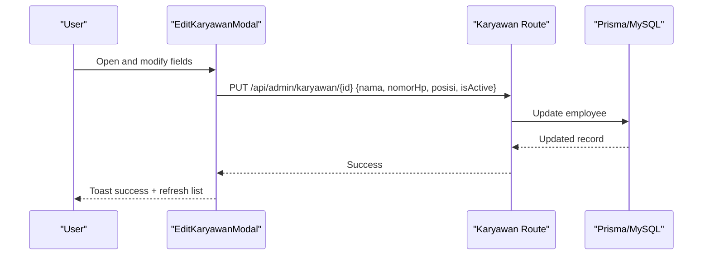

**Diagram sources**
- [edit-karyawan-modal.tsx](file://src/app/(LoggedIn)/master/karyawan/components/edit-karyawan-modal.tsx#L65-L91)
- [route.ts:6-69](file://src/app/api/admin/karyawan/route.ts#L6-L69)

**Section sources**
- [edit-karyawan-modal.tsx](file://src/app/(LoggedIn)/master/karyawan/components/edit-karyawan-modal.tsx#L22-L91)
- [route.ts:6-69](file://src/app/api/admin/karyawan/route.ts#L6-L69)

### Position Assignment and Department Allocation
- Position field: stored as free-text string on the employee entity.
- Department alignment: while not modeled as a separate department entity, roles and navigation define functional departments (e.g., admin, designer, production, warehouse) that align with organizational units.

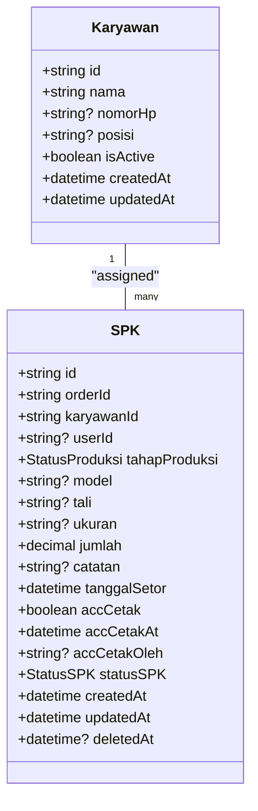

**Diagram sources**
- [schema.prisma:332-344](file://prisma/schema.prisma#L332-L344)
- [schema.prisma:346-374](file://prisma/schema.prisma#L346-L374)

**Section sources**
- [schema.prisma:332-344](file://prisma/schema.prisma#L332-L344)
- [page.tsx](file://src/app/(LoggedIn)/production/spk/page.tsx#L35-L40)

### Employee Status Tracking and Lifecycle
- Active/inactive toggle in edit modal; reflected in table chip color.
- API enforces role-based access for create/update/delete operations.

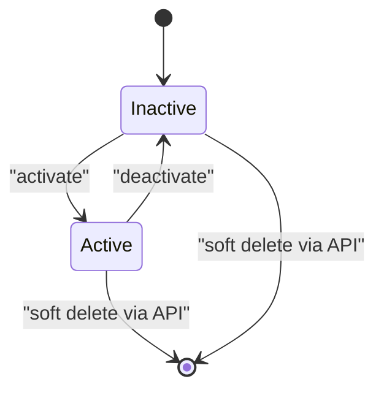

**Diagram sources**
- [edit-karyawan-modal.tsx](file://src/app/(LoggedIn)/master/karyawan/components/edit-karyawan-modal.tsx#L154-L168)
- [page.tsx](file://src/app/(LoggedIn)/master/karyawan/page.tsx#L159-L171)
- [route.ts:71-138](file://src/app/api/admin/karyawan/route.ts#L71-L138)

**Section sources**
- [edit-karyawan-modal.tsx](file://src/app/(LoggedIn)/master/karyawan/components/edit-karyawan-modal.tsx#L154-L168)
- [page.tsx](file://src/app/(LoggedIn)/master/karyawan/page.tsx#L159-L171)
- [route.ts:71-138](file://src/app/api/admin/karyawan/route.ts#L71-L138)

### Organizational Hierarchy and Role-Based Access
- Roles: admin, kasir, designer, produksi, gudang.
- Navigation groups: Manajemen Produksi, Inventori Bahan Baku, Keuangan.
- Permissions: centralized statements and role definitions.

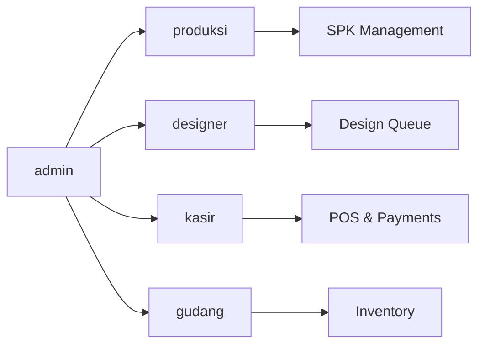

**Diagram sources**
- [roles.ts:5-11](file://src/config/roles.ts#L5-L11)
- [permissions.ts:25-66](file://src/lib/permissions.ts#L25-L66)
- [navigation.ts:59-115](file://src/config/navigation.ts#L59-L115)

**Section sources**
- [roles.ts:1-17](file://src/config/roles.ts#L1-L17)
- [permissions.ts:1-66](file://src/lib/permissions.ts#L1-L66)
- [navigation.ts:59-115](file://src/config/navigation.ts#L59-L115)

### Modal-Based CRUD and Bulk Operations
- Add/Edit/View/Delete modals encapsulate form logic and submission.
- Bulk delete modal confirms mass removal and communicates via toast.

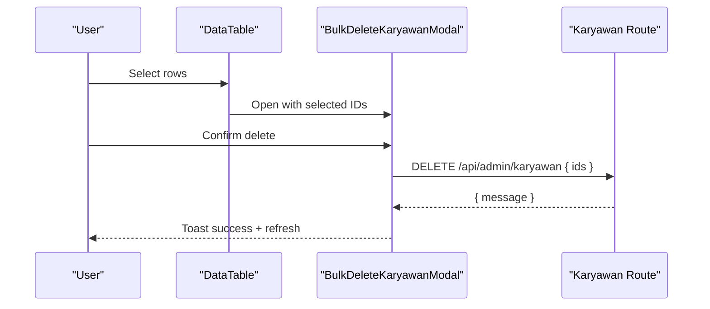

**Diagram sources**
- [bulk-delete-karyawan-modal.tsx](file://src/app/(LoggedIn)/master/karyawan/components/bulk-delete-karyawan-modal.tsx#L28-L54)
- [route.ts:140-183](file://src/app/api/admin/karyawan/route.ts#L140-L183)

**Section sources**
- [bulk-delete-karyawan-modal.tsx](file://src/app/(LoggedIn)/master/karyawan/components/bulk-delete-karyawan-modal.tsx#L17-L54)
- [delete-karyawan-modal.tsx](file://src/app/(LoggedIn)/master/karyawan/components/delete-karyawan-modal.tsx#L8-L72)

### Employment History and Organizational Hierarchy
- Employment history: not modeled as a dedicated entity; historical changes are captured implicitly by audit timestamps and status transitions.
- Organizational hierarchy: roles and navigation groupings define functional departments; employees are linked to production tasks via SPK assignments.

**Section sources**
- [schema.prisma:332-344](file://prisma/schema.prisma#L332-L344)
- [schema.prisma:346-374](file://prisma/schema.prisma#L346-L374)
- [navigation.ts:59-115](file://src/config/navigation.ts#L59-L115)

### Employee-Role Relationships, Skill Tracking, and Performance Evaluation
- Employee-role relationships: enforced by backend role checks on API endpoints.
- Skills and evaluations: not modeled in the current schema; could be extended via additional entities and relations.

**Section sources**
- [route.ts:6-69](file://src/app/api/admin/karyawan/route.ts#L6-L69)
- [permissions.ts:1-66](file://src/lib/permissions.ts#L1-L66)

### Practical Examples

#### Employee Onboarding Workflow
- Create employee: use Add Employee modal to register name, position, and contact.
- Assign to production: link employee to SPK during production workflow.
- Activate: set active status to enable access to related systems.

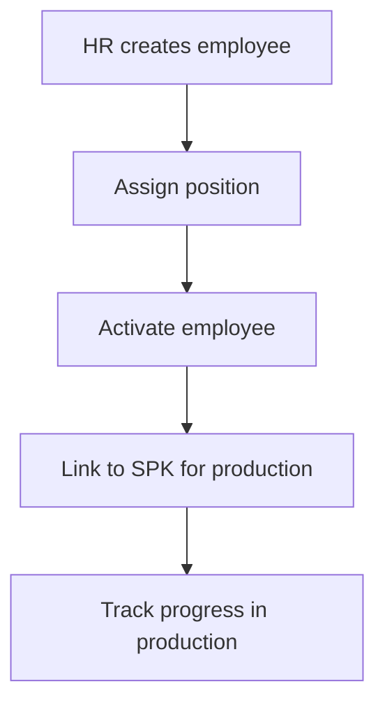

[No sources needed since this diagram shows conceptual workflow, not actual code structure]

#### Organizational Chart Management
- Use roles and navigation to reflect organizational units.
- Employees are grouped by position; no explicit parent-child relationship exists.

**Section sources**
- [roles.ts:5-11](file://src/config/roles.ts#L5-L11)
- [navigation.ts:59-115](file://src/config/navigation.ts#L59-L115)

#### Payroll Integration
- Payroll-related expenses are represented in the finance module (e.g., salary categories).
- The finance dashboard aggregates payroll costs across categories.

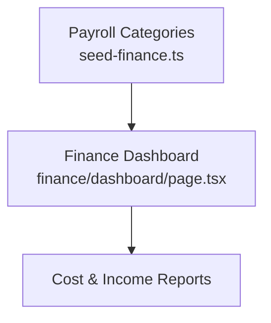

**Diagram sources**
- [seed-finance.ts:40-62](file://prisma/seed-finance.ts#L40-L62)
- [page.tsx](file://src/app/(LoggedIn)/finance/dashboard/page.tsx#L764-L816)
- [seed-transactions.ts:246-284](file://prisma/seed-transactions.ts#L246-L284)

**Section sources**
- [seed-finance.ts:40-62](file://prisma/seed-finance.ts#L40-L62)
- [page.tsx](file://src/app/(LoggedIn)/finance/dashboard/page.tsx#L764-L816)
- [seed-transactions.ts:246-284](file://prisma/seed-transactions.ts#L246-L284)

#### Attendance Systems, Production Workflows, and Access Control
- Attendance: not modeled in the current schema; could integrate via time-tracking entities.
- Production workflows: employees are linked to SPK records; production status updates occur via production module.
- Access control: role-based navigation and API guards restrict sensitive operations.

**Section sources**
- [schema.prisma:332-344](file://prisma/schema.prisma#L332-L344)
- [schema.prisma:346-374](file://prisma/schema.prisma#L346-L374)
- [page.tsx](file://src/app/(LoggedIn)/production/spk/page.tsx#L1-L43)
- [navigation.ts:59-115](file://src/config/navigation.ts#L59-L115)
- [route.ts:6-69](file://src/app/api/admin/karyawan/route.ts#L6-L69)

## Dependency Analysis
- UI depends on shared types and Prisma models.
- API depends on authentication/session and Prisma.
- Roles and permissions influence UI visibility and API access.
- Finance and production modules depend on employee presence for reporting and workflow linkage.

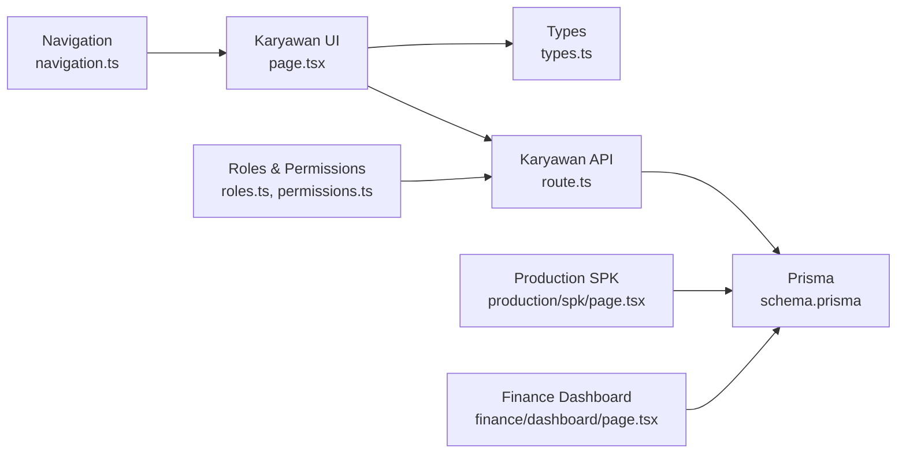

**Diagram sources**
- [page.tsx](file://src/app/(LoggedIn)/master/karyawan/page.tsx#L38-L264)
- [types.ts:66-74](file://src/types/types.ts#L66-L74)
- [route.ts:1-184](file://src/app/api/admin/karyawan/route.ts#L1-L184)
- [schema.prisma:332-344](file://prisma/schema.prisma#L332-L344)
- [roles.ts:1-17](file://src/config/roles.ts#L1-L17)
- [permissions.ts:1-66](file://src/lib/permissions.ts#L1-L66)
- [navigation.ts:59-115](file://src/config/navigation.ts#L59-L115)
- [page.tsx](file://src/app/(LoggedIn)/production/spk/page.tsx#L1-L43)
- [page.tsx](file://src/app/(LoggedIn)/finance/dashboard/page.tsx#L764-L816)

**Section sources**
- [page.tsx](file://src/app/(LoggedIn)/master/karyawan/page.tsx#L38-L264)
- [route.ts:1-184](file://src/app/api/admin/karyawan/route.ts#L1-L184)
- [schema.prisma:332-344](file://prisma/schema.prisma#L332-L344)

## Performance Considerations
- Pagination and debounced search reduce payload sizes and database load.
- SWR caching minimizes repeated network requests.
- Bulk operations consolidate deletions to reduce round trips.
- Consider adding database indexes on frequently filtered fields (e.g., name) if growth warrants.

[No sources needed since this section provides general guidance]

## Troubleshooting Guide
Common issues and remedies:
- Unauthorized access: ensure session is valid and user role matches allowed roles for the endpoint.
- Validation errors: verify required fields and uniqueness constraints.
- Network failures: UI displays generic network error messages; retry after connectivity is restored.
- Bulk delete failures: confirm IDs are provided and non-empty.

**Section sources**
- [route.ts:6-69](file://src/app/api/admin/karyawan/route.ts#L6-L69)
- [route.ts:71-138](file://src/app/api/admin/karyawan/route.ts#L71-L138)
- [route.ts:140-183](file://src/app/api/admin/karyawan/route.ts#L140-L183)
- [add-karyawan-modal.tsx](file://src/app/(LoggedIn)/master/karyawan/components/add-karyawan-modal.tsx#L43-L71)
- [edit-karyawan-modal.tsx](file://src/app/(LoggedIn)/master/karyawan/components/edit-karyawan-modal.tsx#L65-L91)
- [delete-karyawan-modal.tsx](file://src/app/(LoggedIn)/master/karyawan/components/delete-karyawan-modal.tsx#L21-L52)
- [bulk-delete-karyawan-modal.tsx](file://src/app/(LoggedIn)/master/karyawan/components/bulk-delete-karyawan-modal.tsx#L28-L54)

## Conclusion
The employee management subsystem provides a robust foundation for registering, maintaining, and organizing workforce data. It integrates with production workflows via SPK assignments and with finance reporting via payroll categories. The modular UI, strict role-based API guards, and shared types ensure maintainability and scalability. Future enhancements can include formal department modeling, skills/evaluations tracking, and attendance/timekeeping integrations.

[No sources needed since this section summarizes without analyzing specific files]

## Appendices

### Data Model Snapshot
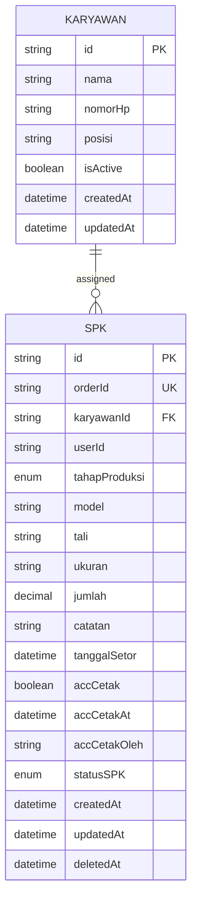

**Diagram sources**
- [schema.prisma:332-344](file://prisma/schema.prisma#L332-L344)
- [schema.prisma:346-374](file://prisma/schema.prisma#L346-L374)