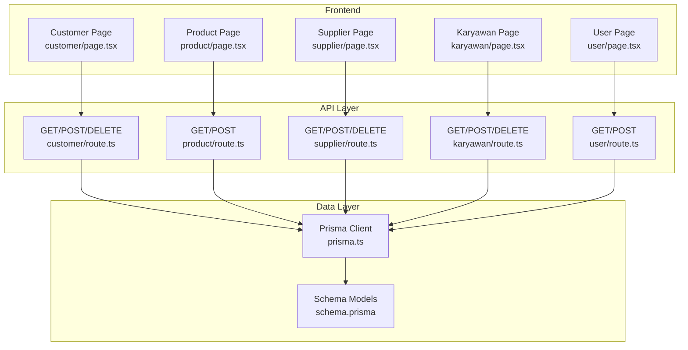
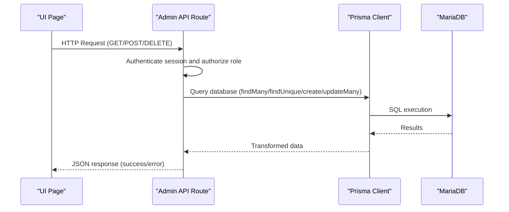
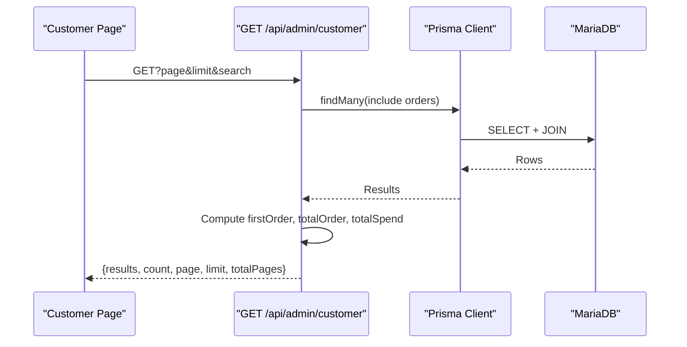
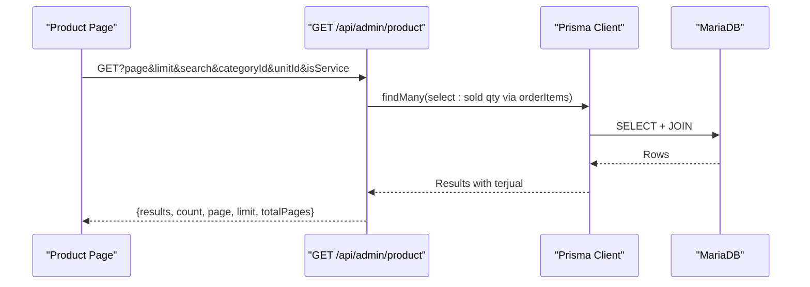
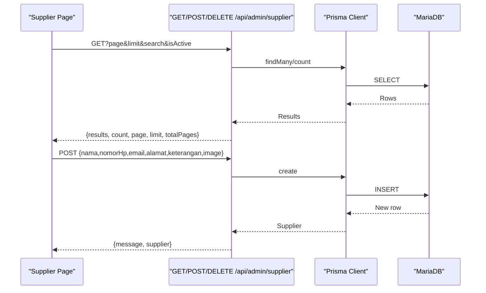
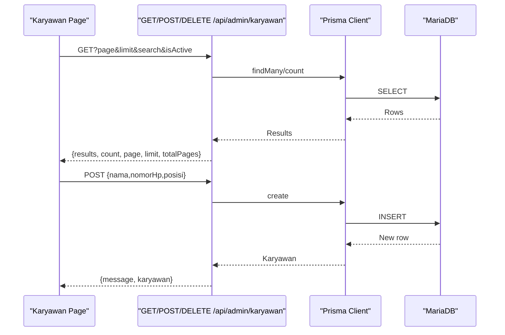
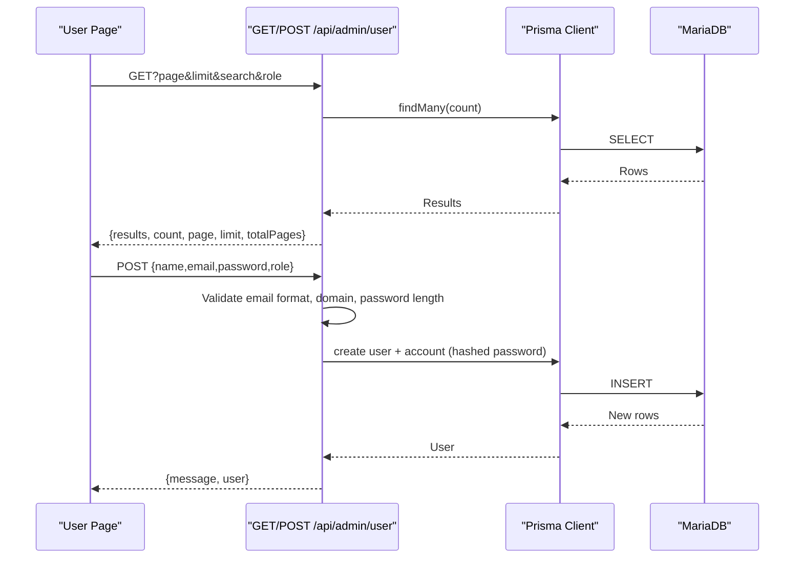
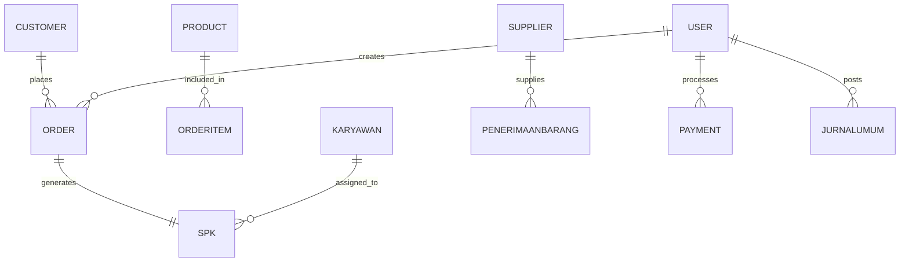
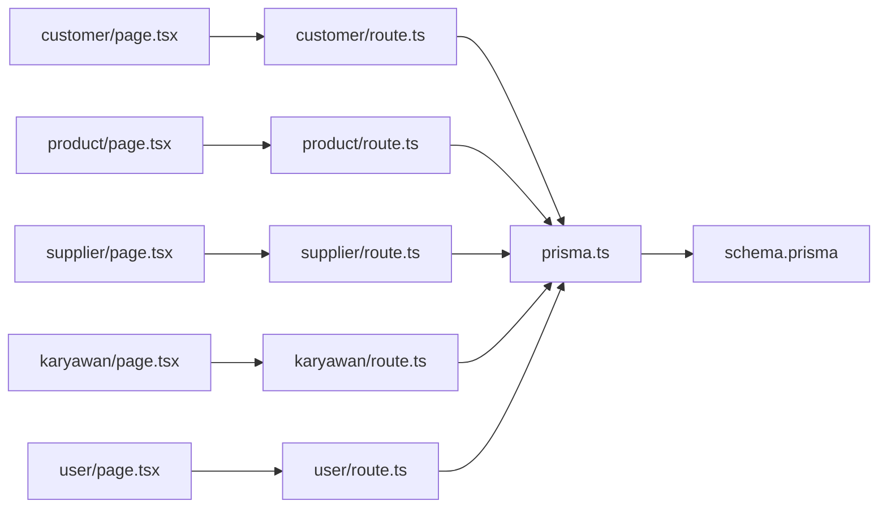
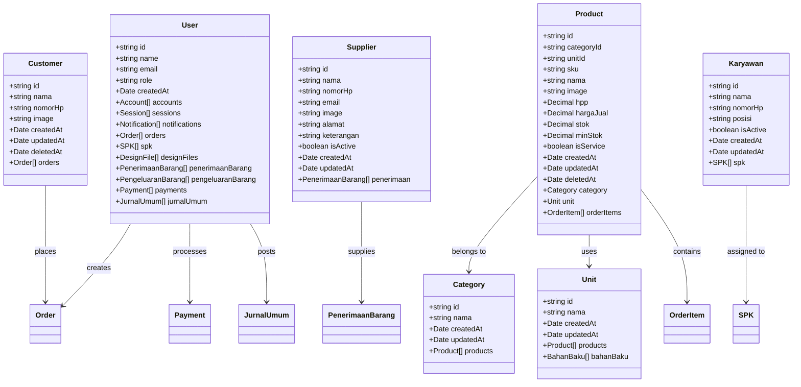

# Master Data Management

<cite>
**Referenced Files in This Document**
- [schema.prisma](file://prisma/schema.prisma)
- [prisma.ts](file://src/lib/prisma.ts)
- [customer page](file://src/app/(LoggedIn)/master/customer/page.tsx)
- [customer columns](file://src/app/(LoggedIn)/master/customer/components/columns.tsx)
- [customer API](file://src/app/api/admin/customer/route.ts)
- [product page](file://src/app/(LoggedIn)/master/product/page.tsx)
- [product columns](file://src/app/(LoggedIn)/master/product/components/columns.tsx)
- [product API](file://src/app/api/admin/product/route.ts)
- [supplier page](file://src/app/(LoggedIn)/master/supplier/page.tsx)
- [supplier columns](file://src/app/(LoggedIn)/master/supplier/components/columns.tsx)
- [supplier API](file://src/app/api/admin/supplier/route.ts)
- [karyawan page](file://src/app/(LoggedIn)/master/karyawan/page.tsx)
- [karyawan columns](file://src/app/(LoggedIn)/master/karyawan/components/columns.tsx)
- [karyawan API](file://src/app/api/admin/karyawan/route.ts)
- [user page](file://src/app/(LoggedIn)/master/user/page.tsx)
- [user columns](file://src/app/(LoggedIn)/master/user/components/columns.tsx)
- [user API](file://src/app/api/admin/user/route.ts)
- [types.ts](file://src/types/types.ts)
- [part1-master-data class diagram](file://diagram/class/part1-master-data.plantuml)
</cite>

## Table of Contents
1. [Introduction](#introduction)
2. [Project Structure](#project-structure)
3. [Core Components](#core-components)
4. [Architecture Overview](#architecture-overview)
5. [Detailed Component Analysis](#detailed-component-analysis)
6. [Dependency Analysis](#dependency-analysis)
7. [Performance Considerations](#performance-considerations)
8. [Troubleshooting Guide](#troubleshooting-guide)
9. [Conclusion](#conclusion)
10. [Appendices](#appendices)

## Introduction
This document describes the master data management system that powers customer, product, supplier, employee (karyawan), and user administration. It explains how business entities are modeled, validated, and exposed via APIs and UI components, and how data integrity is maintained through constraints, soft deletes, and role-based access controls. It also covers integration points between entities and their impact on business workflows such as order creation, production scheduling, and financial posting.

## Project Structure
The master data system spans three layers:
- Data modeling: Prisma schema defines entities, relations, and indexes.
- Backend API: Route handlers under /api/admin handle CRUD operations with validation and pagination.
- Frontend UI: Pages and components render lists, modals, and forms for managing master data.

**Diagram sources**
- [customer page](file://src/app/(LoggedIn)/master/customer/page.tsx#L1-L302)
- [product page](file://src/app/(LoggedIn)/master/product/page.tsx#L27-L136)
- [supplier page](file://src/app/(LoggedIn)/master/supplier/page.tsx)
- [karyawan page](file://src/app/(LoggedIn)/master/karyawan/page.tsx)
- [user page](file://src/app/(LoggedIn)/master/user/page.tsx)
- [customer API:1-198](file://src/app/api/admin/customer/route.ts#L1-L198)
- [product API:1-268](file://src/app/api/admin/product/route.ts#L1-L268)
- [supplier API:1-208](file://src/app/api/admin/supplier/route.ts#L1-L208)
- [karyawan API:1-184](file://src/app/api/admin/karyawan/route.ts#L1-L184)
- [user API:1-214](file://src/app/api/admin/user/route.ts#L1-L214)
- [prisma.ts:1-25](file://src/lib/prisma.ts#L1-L25)
- [schema.prisma:1-675](file://prisma/schema.prisma#L1-L675)

**Section sources**
- [schema.prisma:1-675](file://prisma/schema.prisma#L1-L675)
- [prisma.ts:1-25](file://src/lib/prisma.ts#L1-L25)
- [customer page](file://src/app/(LoggedIn)/master/customer/page.tsx#L1-L302)
- [product page](file://src/app/(LoggedIn)/master/product/page.tsx#L27-L136)
- [supplier page](file://src/app/(LoggedIn)/master/supplier/page.tsx)
- [karyawan page](file://src/app/(LoggedIn)/master/karyawan/page.tsx)
- [user page](file://src/app/(LoggedIn)/master/user/page.tsx)

## Core Components
This section outlines the primary master data entities and their key attributes, constraints, and relationships.

- Customer
  - Fields: id, nama, nomorHp, image, timestamps, soft delete marker.
  - Indexes: nama for fast lookup.
  - Relations: orders.
  - Notes: Soft deletion via deletedAt; statistics computed in API (first order, total orders, total spend).

- Product
  - Fields: id, categoryId, unitId, sku (unique), nama, image, hpp, hargaJual, stok, minStok, isService, timestamps, soft delete marker.
  - Unique constraints: sku.
  - Relations: category, unit, orderItems.
  - Notes: Sold quantity derived from orderItems during listing.

- Category
  - Fields: id, nama, timestamps.
  - Indexes: nama.

- Unit
  - Fields: id, nama, timestamps.
  - Indexes: nama.

- Supplier
  - Fields: id, nama, nomorHp, email, image, alamat, keterangan, isActive, timestamps.
  - Notes: isActive flag; used in purchase receipt creation.

- Karyawan
  - Fields: id, nama, nomorHp, posisi, isActive, timestamps.
  - Notes: Used in SPK (production work order) creation.

- User
  - Fields: id, name, email (unique), emailVerified, image, createdAt/updatedAt, ban fields, role, accounts, sessions, notifications, orders, spk, designFiles, penerimaanBarang, pengeluaranBarang, payments, jurnalUmum, designerOrders, comments, commentRecipients.
  - Notes: Role-based access control enforced in API routes.

- Roles and Access Control
  - Admin: Full access to master data management.
  - Kasir: Can manage customers and products (limited).
  - Gudang: Can manage suppliers and products.
  - Produksi/Designer/Kasir: Read access to employees and basic reporting.

**Section sources**
- [schema.prisma:147-176](file://prisma/schema.prisma#L147-L176)
- [schema.prisma:119-141](file://prisma/schema.prisma#L119-L141)
- [schema.prisma:96-105](file://prisma/schema.prisma#L96-L105)
- [schema.prisma:107-117](file://prisma/schema.prisma#L107-L117)
- [schema.prisma:161-176](file://prisma/schema.prisma#L161-L176)
- [schema.prisma:332-344](file://prisma/schema.prisma#L332-L344)
- [schema.prisma:15-42](file://prisma/schema.prisma#L15-L42)
- [customer API:17-22](file://src/app/api/admin/customer/route.ts#L17-L22)
- [product API:132-137](file://src/app/api/admin/product/route.ts#L132-L137)
- [supplier API:20-25](file://src/app/api/admin/supplier/route.ts#L20-L25)
- [karyawan API:20-26](file://src/app/api/admin/karyawan/route.ts#L20-L26)
- [user API:24-29](file://src/app/api/admin/user/route.ts#L24-L29)

## Architecture Overview
The system follows a layered architecture:
- UI pages orchestrate state, search, pagination, and modals.
- API routes validate requests, enforce roles, and query Prisma.
- Prisma client connects to MariaDB using a dedicated adapter.
- Schema enforces referential integrity and uniqueness.

**Diagram sources**
- [customer API:8-85](file://src/app/api/admin/customer/route.ts#L8-L85)
- [product API:7-116](file://src/app/api/admin/product/route.ts#L7-L116)
- [supplier API:6-70](file://src/app/api/admin/supplier/route.ts#L6-L70)
- [karyawan API:6-69](file://src/app/api/admin/karyawan/route.ts#L6-L69)
- [user API:10-97](file://src/app/api/admin/user/route.ts#L10-L97)
- [prisma.ts:1-25](file://src/lib/prisma.ts#L1-L25)
- [schema.prisma:1-675](file://prisma/schema.prisma#L1-L675)

## Detailed Component Analysis

### Customer Management
Customer management supports listing, searching, adding, editing, viewing details, and bulk deletion with soft delete semantics. The API computes customer statistics (first order, total orders, total spend) by aggregating order data.

**Diagram sources**
- [customer API:8-85](file://src/app/api/admin/customer/route.ts#L8-L85)
- [customer page](file://src/app/(LoggedIn)/master/customer/page.tsx#L57-L81)

Key validations and constraints:
- Uniqueness: Customer name uniqueness enforced at API level.
- Soft delete: DELETE updates deletedAt; queries filter by deletedAt null.
- Role access: Admin and Kasir allowed.

**Section sources**
- [customer API:17-22](file://src/app/api/admin/customer/route.ts#L17-L22)
- [customer API:124-133](file://src/app/api/admin/customer/route.ts#L124-L133)
- [customer API:183-186](file://src/app/api/admin/customer/route.ts#L183-L186)
- [customer columns](file://src/app/(LoggedIn)/master/customer/components/columns.tsx#L1-L51)
- [customer page](file://src/app/(LoggedIn)/master/customer/page.tsx#L1-L302)

### Product Management
Product management includes listing with filters (category, unit, service type), searching by SKU or name, and creating products with strict validation. Sold quantities are computed from order items.

**Diagram sources**
- [product API:7-116](file://src/app/api/admin/product/route.ts#L7-L116)
- [product page](file://src/app/(LoggedIn)/master/product/page.tsx#L27-L136)

Validation and constraints:
- Required fields: sku, nama, hpp, hargaJual, isService, categoryId, unitId.
- Unique constraint: sku.
- Category and Unit existence checked before creation.
- Role access: Admin, Kasir, Gudang.

**Section sources**
- [product API:132-137](file://src/app/api/admin/product/route.ts#L132-L137)
- [product API:153-176](file://src/app/api/admin/product/route.ts#L153-L176)
- [product API:178-198](file://src/app/api/admin/product/route.ts#L178-L198)
- [product API:200-209](file://src/app/api/admin/product/route.ts#L200-L209)
- [product columns](file://src/app/(LoggedIn)/master/product/components/columns.tsx#L1-L75)
- [product page](file://src/app/(LoggedIn)/master/product/page.tsx#L27-L136)

### Supplier Management
Supplier management supports listing with optional filters (active/inactive, search), creating suppliers with validation, and bulk deletion.

**Diagram sources**
- [supplier API:6-70](file://src/app/api/admin/supplier/route.ts#L6-L70)
- [supplier API:72-162](file://src/app/api/admin/supplier/route.ts#L72-L162)
- [supplier page](file://src/app/(LoggedIn)/master/supplier/page.tsx)
- [supplier columns](file://src/app/(LoggedIn)/master/supplier/components/columns.tsx#L1-L60)

Constraints:
- Name uniqueness enforced at API level.
- Role access: Admin and Gudang.

**Section sources**
- [supplier API:20-25](file://src/app/api/admin/supplier/route.ts#L20-L25)
- [supplier API:96-119](file://src/app/api/admin/supplier/route.ts#L96-L119)
- [supplier API:121-132](file://src/app/api/admin/supplier/route.ts#L121-L132)
- [supplier API:164-207](file://src/app/api/admin/supplier/route.ts#L164-L207)

### Employee (Karyawan) Management
Employee records support listing with filters, creating new employees, and bulk deletion.

**Diagram sources**
- [karyawan API:6-69](file://src/app/api/admin/karyawan/route.ts#L6-L69)
- [karyawan API:71-138](file://src/app/api/admin/karyawan/route.ts#L71-L138)
- [karyawan page](file://src/app/(LoggedIn)/master/karyawan/page.tsx)
- [karyawan columns](file://src/app/(LoggedIn)/master/karyawan/components/columns.tsx#L1-L43)

Constraints:
- Name uniqueness enforced at API level.
- Role access: Admin.

**Section sources**
- [karyawan API:85-90](file://src/app/api/admin/karyawan/route.ts#L85-L90)
- [karyawan API:95-100](file://src/app/api/admin/karyawan/route.ts#L95-L100)
- [karyawan API:104-116](file://src/app/api/admin/karyawan/route.ts#L104-L116)

### User Administration and Role Assignments
User administration allows listing users with role filtering, creating users with validation, and leveraging role keys from configuration.

**Diagram sources**
- [user API:10-97](file://src/app/api/admin/user/route.ts#L10-L97)
- [user API:99-214](file://src/app/api/admin/user/route.ts#L99-L214)
- [user page](file://src/app/(LoggedIn)/master/user/page.tsx)
- [user columns](file://src/app/(LoggedIn)/master/user/components/columns.tsx#L1-L46)

Constraints:
- Email uniqueness enforced at API level.
- Allowed roles from configuration keys.
- Role access: Admin only.

**Section sources**
- [user API:24-29](file://src/app/api/admin/user/route.ts#L24-L29)
- [user API:123-128](file://src/app/api/admin/user/route.ts#L123-L128)
- [user API:133-147](file://src/app/api/admin/user/route.ts#L133-L147)
- [user API:149-154](file://src/app/api/admin/user/route.ts#L149-L154)
- [user API:156-165](file://src/app/api/admin/user/route.ts#L156-L165)

### Data Validation Rules and Duplicate Prevention
- Customer: Name uniqueness enforced before create; soft delete via deletedAt.
- Product: SKU uniqueness enforced; category and unit existence verified; required fields validated.
- Supplier: Name uniqueness enforced; required fields validated.
- Karyawan: Name uniqueness enforced.
- User: Email uniqueness enforced; email format and domain validation; password length validation; role normalization.

**Section sources**
- [customer API:124-133](file://src/app/api/admin/customer/route.ts#L124-L133)
- [product API:153-176](file://src/app/api/admin/product/route.ts#L153-L176)
- [product API:178-198](file://src/app/api/admin/product/route.ts#L178-L198)
- [product API:200-209](file://src/app/api/admin/product/route.ts#L200-L209)
- [supplier API:121-132](file://src/app/api/admin/supplier/route.ts#L121-L132)
- [karyawan API:104-116](file://src/app/api/admin/karyawan/route.ts#L104-L116)
- [user API:156-165](file://src/app/api/admin/user/route.ts#L156-L165)

### Data Import/Export Capabilities
- No explicit import/export endpoints were identified in the master data routes.
- Consider extending APIs with CSV/XLSX handlers for bulk operations and report generation.

[No sources needed since this section provides general guidance]

### Master Data Synchronization
- Entities are synchronized via Prisma ORM with MariaDB.
- Soft deletes (deletedAt) enable reversible removal without losing referential integrity.
- Unique constraints (email, sku, customer name) prevent duplicates across environments.

**Section sources**
- [schema.prisma:18-26](file://prisma/schema.prisma#L18-L26)
- [schema.prisma:123-123](file://prisma/schema.prisma#L123-L123)
- [schema.prisma:149-150](file://prisma/schema.prisma#L149-L150)
- [schema.prisma:162-162](file://prisma/schema.prisma#L162-L162)

### Integration Between Master Data Entities and Business Workflows
- Customer → Order: Customers place orders; order status influences production and finance.
- Product → OrderItem: Products are added to orders; sold quantities derived from order items.
- Supplier → Purchase Receipts: Suppliers populate purchase receipts; affects inventory and finance.
- Karyawan → SPK: Employees are assigned to SPKs; drives production progress.
- User → Orders/Payments/Journals: Users trigger financial postings and order/commenting.

**Diagram sources**
- [schema.prisma:260-296](file://prisma/schema.prisma#L260-L296)
- [schema.prisma:298-315](file://prisma/schema.prisma#L298-L315)
- [schema.prisma:346-374](file://prisma/schema.prisma#L346-L374)
- [schema.prisma:201-222](file://prisma/schema.prisma#L201-L222)
- [schema.prisma:147-159](file://prisma/schema.prisma#L147-L159)
- [schema.prisma:332-344](file://prisma/schema.prisma#L332-L344)
- [schema.prisma:15-42](file://prisma/schema.prisma#L15-L42)

### Practical Examples
- Master data maintenance
  - Adding a new customer: POST to customer API with nama and nomorHp; API validates presence and uniqueness.
  - Creating a product: POST to product API with sku, nama, hpp, hargaJual, isService, categoryId, unitId; API validates existence of category/unit and uniqueness of sku.
  - Managing suppliers: Use supplier API to create/update/list; toggle isActive to archive inactive suppliers.
- Data quality assurance
  - Enforce unique SKUs and customer names.
  - Validate numeric fields (hpp, hargaJual, stok) and booleans (isService).
  - Use isActive flags to mark inactive suppliers/employees without hard deletion.
- Bulk operations
  - Bulk delete customers and suppliers via DELETE endpoints; API ensures payload includes ids array.

**Section sources**
- [customer API:88-154](file://src/app/api/admin/customer/route.ts#L88-L154)
- [product API:118-267](file://src/app/api/admin/product/route.ts#L118-L267)
- [supplier API:72-162](file://src/app/api/admin/supplier/route.ts#L72-L162)
- [karyawan API:71-138](file://src/app/api/admin/karyawan/route.ts#L71-L138)

### Audit Trail and Data Change Tracking
- The schema does not define a dedicated audit log table.
- Change tracking can be achieved by:
  - Leveraging createdAt/updatedAt timestamps on entities.
  - Using soft deletes (deletedAt) to preserve history.
  - Extending models with audit fields or a separate AuditLog model.

[No sources needed since this section provides general guidance]

## Dependency Analysis
The frontend pages depend on API routes, which depend on Prisma client and the database. Prisma client uses a MariaDB adapter configured from environment variables.

**Diagram sources**
- [customer page](file://src/app/(LoggedIn)/master/customer/page.tsx#L1-L302)
- [product page](file://src/app/(LoggedIn)/master/product/page.tsx#L27-L136)
- [supplier page](file://src/app/(LoggedIn)/master/supplier/page.tsx)
- [karyawan page](file://src/app/(LoggedIn)/master/karyawan/page.tsx)
- [user page](file://src/app/(LoggedIn)/master/user/page.tsx)
- [customer API:1-198](file://src/app/api/admin/customer/route.ts#L1-L198)
- [product API:1-268](file://src/app/api/admin/product/route.ts#L1-L268)
- [supplier API:1-208](file://src/app/api/admin/supplier/route.ts#L1-L208)
- [karyawan API:1-184](file://src/app/api/admin/karyawan/route.ts#L1-L184)
- [user API:1-214](file://src/app/api/admin/user/route.ts#L1-L214)
- [prisma.ts:1-25](file://src/lib/prisma.ts#L1-L25)
- [schema.prisma:1-675](file://prisma/schema.prisma#L1-L675)

**Section sources**
- [prisma.ts:9-20](file://src/lib/prisma.ts#L9-L20)
- [schema.prisma:1-10](file://prisma/schema.prisma#L1-L10)

## Performance Considerations
- Pagination: All list endpoints accept page and limit parameters; use appropriate limits to avoid heavy payloads.
- Indexes: Ensure frequently filtered fields (nama, sku, email) leverage indexes defined in the schema.
- Aggregation: Computation of firstOrder, totalOrder, totalSpend and sold quantities occurs in API; consider caching or materialized views for high-volume scenarios.
- Soft deletes: deletedAt filtering reduces result sets but requires careful index coverage.

[No sources needed since this section provides general guidance]

## Troubleshooting Guide
Common issues and resolutions:
- Unauthorized access: Verify session and role checks in API routes; ensure user has admin/kasir/gudang/produksi/designer/kasir roles as required.
- Validation errors: Review missing fields and constraints (unique SKUs, unique customer names, required numeric fields).
- Bulk delete failures: Confirm payload includes ids array; ensure endpoint supports bulk deletion for the entity.
- Soft delete behavior: Deleted records are hidden from listings; use restore logic if implemented elsewhere.

**Section sources**
- [customer API:10-22](file://src/app/api/admin/customer/route.ts#L10-L22)
- [product API:132-137](file://src/app/api/admin/product/route.ts#L132-L137)
- [supplier API:164-193](file://src/app/api/admin/supplier/route.ts#L164-L193)
- [karyawan API:141-171](file://src/app/api/admin/karyawan/route.ts#L141-L171)
- [user API:123-128](file://src/app/api/admin/user/route.ts#L123-L128)

## Conclusion
The master data management system provides robust foundations for customer, product, supplier, employee, and user administration. It enforces data integrity through schema constraints and API-level validations, supports role-based access, and integrates seamlessly with order, production, and financial workflows. Extending the system with import/export capabilities, audit logging, and advanced reporting would further enhance operational efficiency.

## Appendices

### Entity Class Diagram (Code-Level)

**Diagram sources**
- [schema.prisma:15-42](file://prisma/schema.prisma#L15-L42)
- [schema.prisma:147-176](file://prisma/schema.prisma#L147-L176)
- [schema.prisma:161-176](file://prisma/schema.prisma#L161-L176)
- [schema.prisma:96-105](file://prisma/schema.prisma#L96-L105)
- [schema.prisma:107-117](file://prisma/schema.prisma#L107-L117)
- [schema.prisma:119-141](file://prisma/schema.prisma#L119-L141)
- [schema.prisma:332-344](file://prisma/schema.prisma#L332-L344)