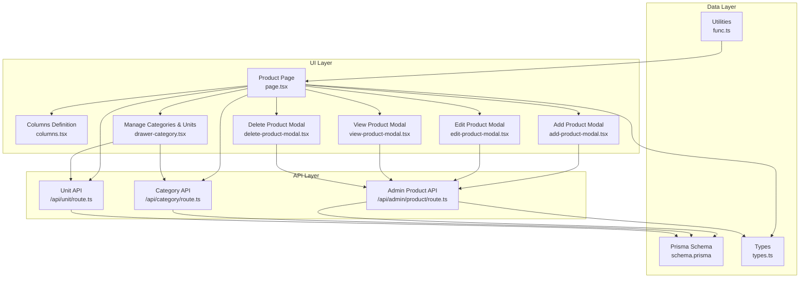
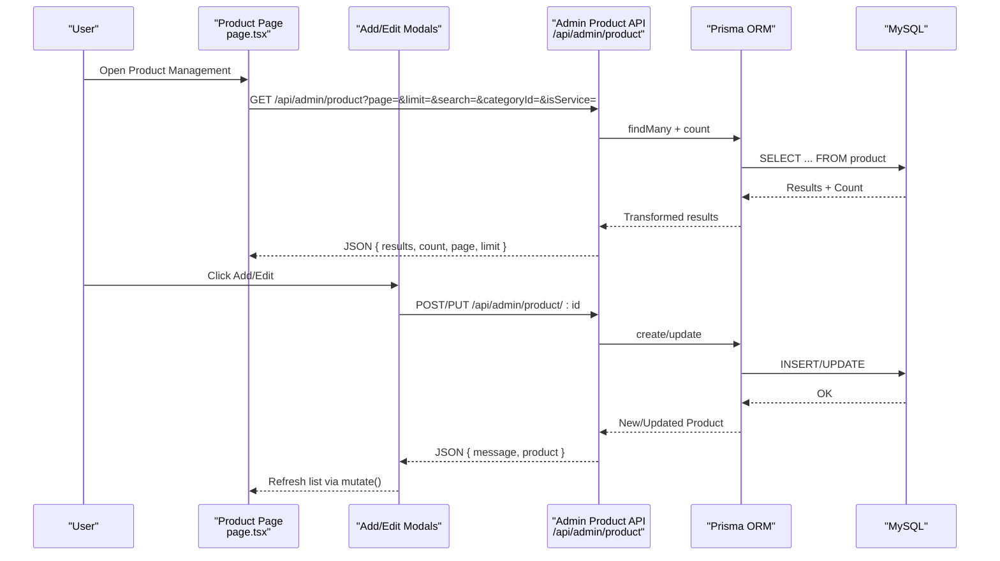
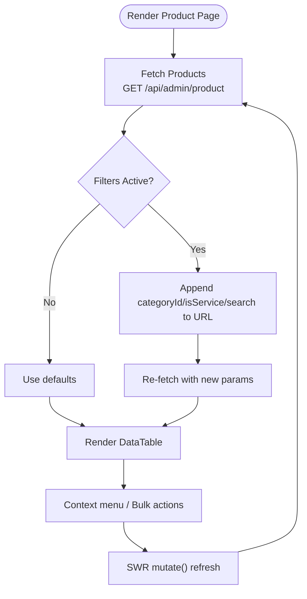
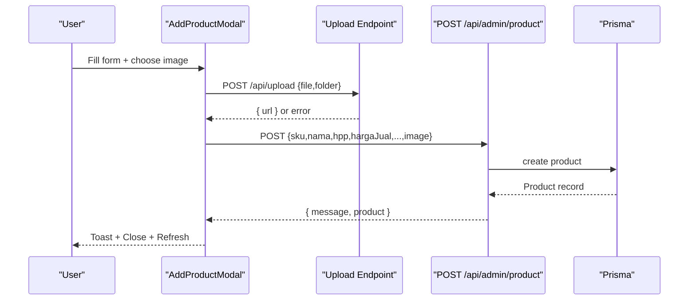
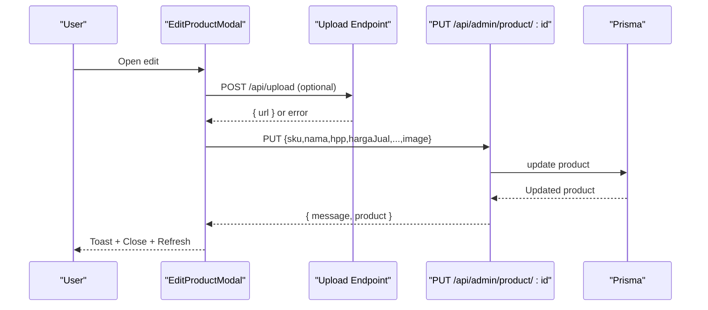
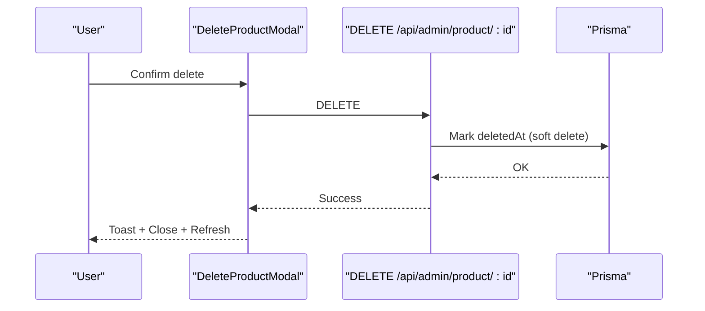
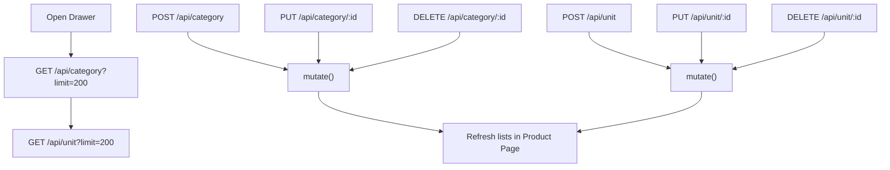
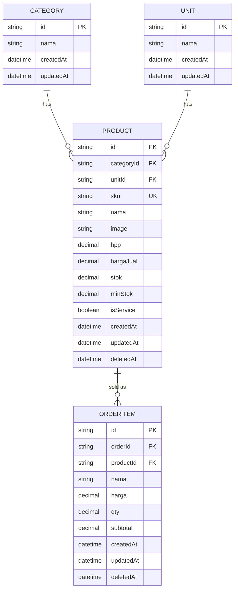
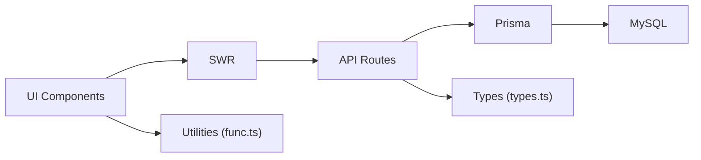

# Product Management

<cite>
**Referenced Files in This Document**
- [page.tsx](file://src/app/(LoggedIn)/master/product/page.tsx)
- [columns.tsx](file://src/app/(LoggedIn)/master/product/components/columns.tsx)
- [add-product-modal.tsx](file://src/app/(LoggedIn)/master/product/components/add-product-modal.tsx)
- [edit-product-modal.tsx](file://src/app/(LoggedIn)/master/product/components/edit-product-modal.tsx)
- [view-product-modal.tsx](file://src/app/(LoggedIn)/master/product/components/view-product-modal.tsx)
- [delete-product-modal.tsx](file://src/app/(LoggedIn)/master/product/components/delete-product-modal.tsx)
- [route.ts](file://src/app/api/admin/product/route.ts)
- [schema.prisma](file://prisma/schema.prisma)
- [types.ts](file://src/types/types.ts)
- [func.ts](file://src/lib/func.ts)
- [drawer-category.tsx](file://src/app/(LoggedIn)/master/customer/components/drawer-category.tsx)
- [route.ts](file://src/app/api/category/route.ts)
- [route.ts](file://src/app/api/unit/route.ts)
</cite>

## Table of Contents
1. [Introduction](#introduction)
2. [Project Structure](#project-structure)
3. [Core Components](#core-components)
4. [Architecture Overview](#architecture-overview)
5. [Detailed Component Analysis](#detailed-component-analysis)
6. [Dependency Analysis](#dependency-analysis)
7. [Performance Considerations](#performance-considerations)
8. [Troubleshooting Guide](#troubleshooting-guide)
9. [Conclusion](#conclusion)
10. [Appendices](#appendices)

## Introduction
This document describes the product management system within the POS application. It covers the product catalog structure, pricing and inventory handling, category and unit management, and the modal-driven CRUD interface. It also outlines integration points with inventory, order processing, and supplier systems, along with practical workflows for onboarding, pricing, and categorization.

## Project Structure
The product management feature is centered around a dedicated page and a suite of modal components for Create, Read, Update, and Delete operations. Supporting APIs handle listing, creation, updates, and deletions, while Prisma defines the data model. Utility functions support stock status calculation and formatting.

**Diagram sources**
- [page.tsx](file://src/app/(LoggedIn)/master/product/page.tsx#L34-L311)
- [columns.tsx](file://src/app/(LoggedIn)/master/product/components/columns.tsx#L1-L75)
- [add-product-modal.tsx](file://src/app/(LoggedIn)/master/product/components/add-product-modal.tsx#L1-L425)
- [edit-product-modal.tsx](file://src/app/(LoggedIn)/master/product/components/edit-product-modal.tsx#L1-L437)
- [view-product-modal.tsx](file://src/app/(LoggedIn)/master/product/components/view-product-modal.tsx#L1-L195)
- [delete-product-modal.tsx](file://src/app/(LoggedIn)/master/product/components/delete-product-modal.tsx#L1-L160)
- [route.ts:1-268](file://src/app/api/admin/product/route.ts#L1-L268)
- [route.ts:1-136](file://src/app/api/category/route.ts#L1-L136)
- [route.ts:1-136](file://src/app/api/unit/route.ts#L1-L136)
- [schema.prisma:96-141](file://prisma/schema.prisma#L96-L141)
- [types.ts:35-64](file://src/types/types.ts#L35-L64)
- [func.ts:28-40](file://src/lib/func.ts#L28-L40)

**Section sources**
- [page.tsx](file://src/app/(LoggedIn)/master/product/page.tsx#L1-L312)
- [route.ts:1-268](file://src/app/api/admin/product/route.ts#L1-L268)
- [schema.prisma:96-141](file://prisma/schema.prisma#L96-L141)

## Core Components
- Product Catalog Listing: Real-time paginated table with search, filters (category, service type), and bulk actions.
- Modal-Based CRUD:
  - Add Product: Validates inputs, optionally uploads images to storage, creates product via API.
  - Edit Product: Updates product metadata, handles optional image replacement.
  - View Product: Displays detailed info including pricing, stock status, and computed margin.
  - Delete Product: Moves product to trash with confirmation and guidance.
- Category and Unit Management: Inline add/edit/remove via a drawer that also manages units.
- Utilities: Stock status computation, number formatting, and SWR-based data fetching.

**Section sources**
- [page.tsx](file://src/app/(LoggedIn)/master/product/page.tsx#L34-L311)
- [columns.tsx](file://src/app/(LoggedIn)/master/product/components/columns.tsx#L1-L75)
- [add-product-modal.tsx](file://src/app/(LoggedIn)/master/product/components/add-product-modal.tsx#L96-L140)
- [edit-product-modal.tsx](file://src/app/(LoggedIn)/master/product/components/edit-product-modal.tsx#L113-L157)
- [view-product-modal.tsx](file://src/app/(LoggedIn)/master/product/components/view-product-modal.tsx#L50-L79)
- [delete-product-modal.tsx](file://src/app/(LoggedIn)/master/product/components/delete-product-modal.tsx#L41-L75)
- [drawer-category.tsx](file://src/app/(LoggedIn)/master/customer/components/drawer-category.tsx#L176-L473)

## Architecture Overview
The system follows a client-server pattern:
- Client-side React components manage UI state, modals, and pagination.
- SWR is used for data fetching and caching.
- RESTful API routes under /api/admin/product handle product lifecycle operations.
- Prisma ORM maps to MySQL, enforcing referential integrity with Category and Unit.

**Diagram sources**
- [page.tsx](file://src/app/(LoggedIn)/master/product/page.tsx#L65-L69)
- [route.ts:8-116](file://src/app/api/admin/product/route.ts#L8-L116)
- [route.ts:118-267](file://src/app/api/admin/product/route.ts#L118-L267)

## Detailed Component Analysis

### Product Catalog and Filtering
- Pagination and search: Debounced search term drives query params; category and service-type filters are supported.
- Stock status chip: Computed via utility function considering service vs physical stock and configured minimum stock thresholds.
- Bulk selection and actions: Selected rows enable bulk deletion.

**Diagram sources**
- [page.tsx](file://src/app/(LoggedIn)/master/product/page.tsx#L34-L311)
- [func.ts:28-40](file://src/lib/func.ts#L28-L40)

**Section sources**
- [page.tsx](file://src/app/(LoggedIn)/master/product/page.tsx#L34-L311)
- [columns.tsx](file://src/app/(LoggedIn)/master/product/components/columns.tsx#L1-L75)
- [func.ts:28-40](file://src/lib/func.ts#L28-L40)

### Product Creation Workflow
- Inputs validated by form library; image upload handled via multipart/form-data to a storage endpoint, then persisted as URL.
- Required fields enforced server-side; SKU uniqueness checked; category and unit existence verified.

**Diagram sources**
- [add-product-modal.tsx](file://src/app/(LoggedIn)/master/product/components/add-product-modal.tsx#L96-L140)
- [route.ts:118-267](file://src/app/api/admin/product/route.ts#L118-L267)

**Section sources**
- [add-product-modal.tsx](file://src/app/(LoggedIn)/master/product/components/add-product-modal.tsx#L35-L140)
- [route.ts:118-267](file://src/app/api/admin/product/route.ts#L118-L267)

### Product Update Workflow
- Optional image replacement; service flag disables stock editing in UI; server validates and persists changes.

**Diagram sources**
- [edit-product-modal.tsx](file://src/app/(LoggedIn)/master/product/components/edit-product-modal.tsx#L113-L157)
- [route.ts:118-267](file://src/app/api/admin/product/route.ts#L118-L267)

**Section sources**
- [edit-product-modal.tsx](file://src/app/(LoggedIn)/master/product/components/edit-product-modal.tsx#L56-L157)
- [route.ts:118-267](file://src/app/api/admin/product/route.ts#L118-L267)

### Product Deletion and Soft Lifecycle
- Deletion moves product to trash; UI warns about historical order impact and suggests deactivation for archival purposes.

**Diagram sources**
- [delete-product-modal.tsx](file://src/app/(LoggedIn)/master/product/components/delete-product-modal.tsx#L41-L75)
- [route.ts:118-267](file://src/app/api/admin/product/route.ts#L118-L267)

**Section sources**
- [delete-product-modal.tsx](file://src/app/(LoggedIn)/master/product/components/delete-product-modal.tsx#L18-L75)
- [route.ts:118-267](file://src/app/api/admin/product/route.ts#L118-L267)

### Category and Unit Management
- Inline add/edit/delete for categories and units; drawer integrates with SWR to keep lists fresh after mutations.
- Category and unit selections are required during product creation and editing.

**Diagram sources**
- [drawer-category.tsx](file://src/app/(LoggedIn)/master/customer/components/drawer-category.tsx#L176-L473)
- [route.ts:6-64](file://src/app/api/category/route.ts#L6-L64)
- [route.ts:6-64](file://src/app/api/unit/route.ts#L6-L64)

**Section sources**
- [drawer-category.tsx](file://src/app/(LoggedIn)/master/customer/components/drawer-category.tsx#L476-L589)
- [route.ts:1-136](file://src/app/api/category/route.ts#L1-L136)
- [route.ts:1-136](file://src/app/api/unit/route.ts#L1-L136)

### Data Model and Relationships
- Product belongs to Category and Unit; sold quantity derived from OrderItem aggregation.
- Stock thresholds and service flag control stock visibility and editing UX.

**Diagram sources**
- [schema.prisma:96-141](file://prisma/schema.prisma#L96-L141)
- [schema.prisma:298-315](file://prisma/schema.prisma#L298-L315)

**Section sources**
- [schema.prisma:96-141](file://prisma/schema.prisma#L96-L141)
- [types.ts:35-50](file://src/types/types.ts#L35-L50)

## Dependency Analysis
- UI depends on SWR for data fetching and on modal components for actions.
- API routes depend on Prisma for persistence and enforce validation.
- Utilities encapsulate formatting and stock status logic.

**Diagram sources**
- [page.tsx](file://src/app/(LoggedIn)/master/product/page.tsx#L65-L69)
- [route.ts:8-116](file://src/app/api/admin/product/route.ts#L8-L116)
- [func.ts:26-40](file://src/lib/func.ts#L26-L40)
- [types.ts:35-64](file://src/types/types.ts#L35-L64)

**Section sources**
- [page.tsx](file://src/app/(LoggedIn)/master/product/page.tsx#L65-L69)
- [route.ts:8-116](file://src/app/api/admin/product/route.ts#L8-L116)
- [func.ts:26-40](file://src/lib/func.ts#L26-L40)
- [types.ts:35-64](file://src/types/types.ts#L35-L64)

## Performance Considerations
- Debounced search reduces network requests during typing.
- Pagination limits result sets; count queries avoid rendering large datasets.
- SWR caching minimizes redundant fetches; targeted mutate refreshes invalidate stale data.
- Image uploads occur before product creation to prevent partial records.

## Troubleshooting Guide
- Authentication errors: API routes require a valid session; unauthorized responses indicate login issues.
- Authorization errors: Some roles may be restricted from product operations.
- Validation errors: Missing or invalid fields trigger structured error responses with missing fields list.
- Duplicate SKU: Creation fails if SKU already exists.
- Category/Unit not found: Creation requires valid foreign keys.
- Network failures: UI displays generic network error messages; retry after connectivity restored.

**Section sources**
- [route.ts:14-19](file://src/app/api/admin/product/route.ts#L14-L19)
- [route.ts:125-137](file://src/app/api/admin/product/route.ts#L125-L137)
- [route.ts:153-176](file://src/app/api/admin/product/route.ts#L153-L176)
- [route.ts:200-209](file://src/app/api/admin/product/route.ts#L200-L209)

## Conclusion
The product management system provides a robust, modal-driven interface for managing SKUs, pricing, categories, units, and stock. Its architecture cleanly separates UI, API, and data concerns, enabling scalable enhancements such as product variants, barcode integration, and advanced search.

## Appendices

### Practical Workflows

- Product Onboarding
  - Open “Tambah Produk” modal, fill mandatory fields (SKU, name, HPP, selling price, category, unit), optionally upload an image, submit.
  - Verify listing appears with correct category, unit, and initial stock status.

- Price Management
  - Use “Edit” modal to adjust selling price; computed margin displayed in view modal helps assess profitability.
  - For services, stock fields are disabled in edit UI.

- Categorization Strategies
  - Use the drawer to add categories and units; assign appropriate category/unit during creation.
  - Keep category names distinct and meaningful; leverage units consistently (e.g., pcs, meter, kg).

- Inventory Tracking
  - Physical products show stock and minimum stock thresholds; stock status chips reflect availability.
  - Services do not track physical stock; stock fields are hidden in edit UI.

- Barcode Integration
  - Current implementation supports SKU as primary identifier; future enhancements can map barcode to SKU or introduce a separate barcode field in the product model.

- Product Search
  - Use the search bar to filter by product name or SKU; combine with category and service-type filters for precise results.

- Integration Notes
  - Sold quantities are derived from order items; historical sales remain intact even after soft deletion.
  - Supplier integrations are managed separately under supplier master data; product creation references supplier entities indirectly via purchase flows.