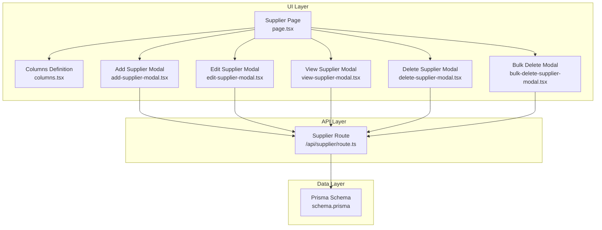
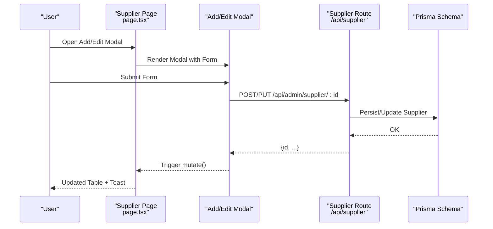
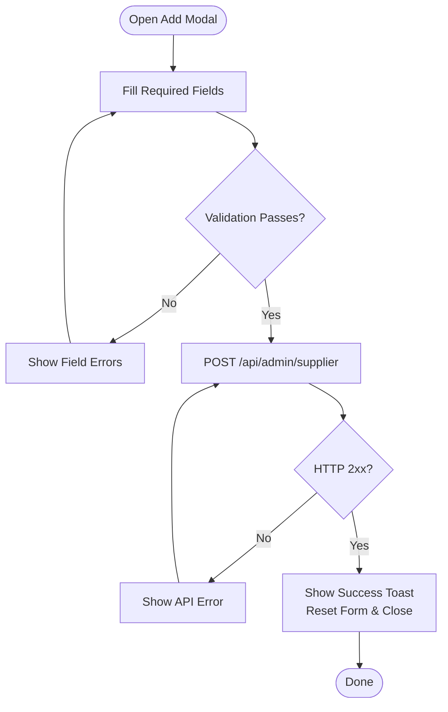
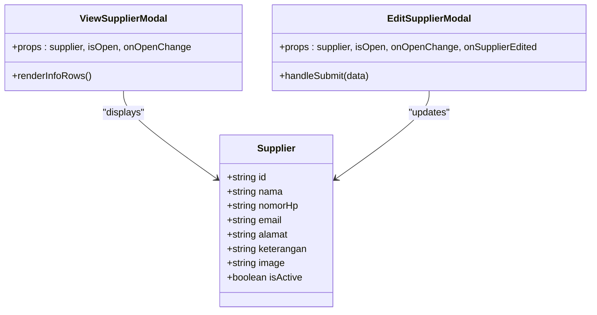
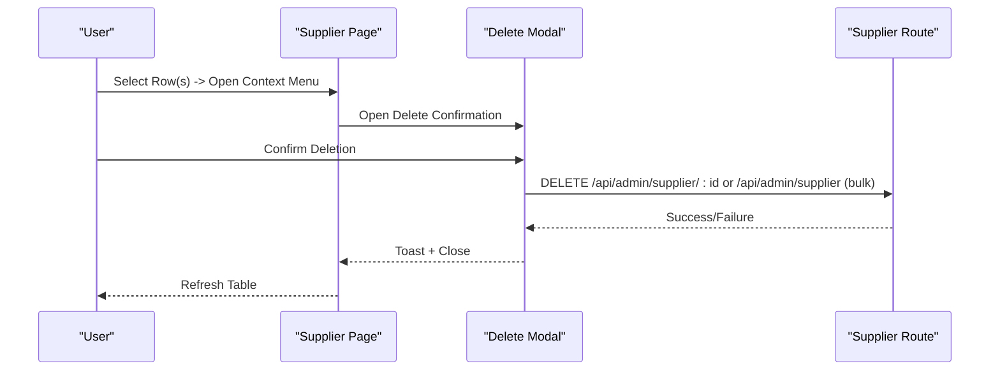
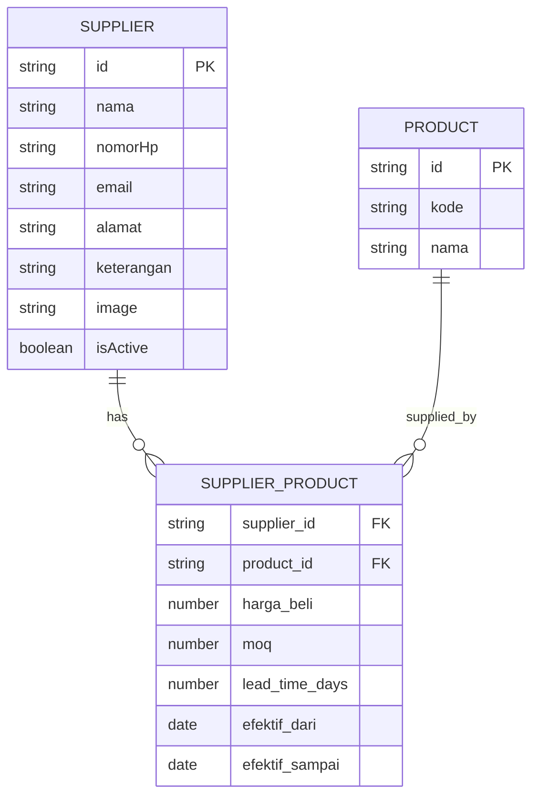
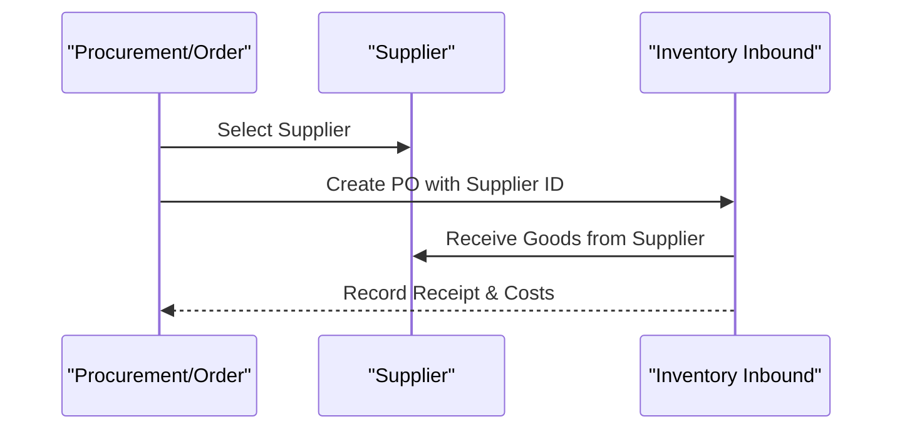

# Supplier Management

<cite>
**Referenced Files in This Document**
- [add-supplier-modal.tsx](file://src/app/(LoggedIn)/master/supplier/components/add-supplier-modal.tsx)
- [edit-supplier-modal.tsx](file://src/app/(LoggedIn)/master/supplier/components/edit-supplier-modal.tsx)
- [view-supplier-modal.tsx](file://src/app/(LoggedIn)/master/supplier/components/view-supplier-modal.tsx)
- [delete-supplier-modal.tsx](file://src/app/(LoggedIn)/master/supplier/components/delete-supplier-modal.tsx)
- [bulk-delete-supplier-modal.tsx](file://src/app/(LoggedIn)/master/supplier/components/bulk-delete-supplier-modal.tsx)
- [columns.tsx](file://src/app/(LoggedIn)/master/supplier/components/columns.tsx)
- [page.tsx](file://src/app/(LoggedIn)/master/supplier/page.tsx)
- [layout.tsx](file://src/app/(LoggedIn)/master/supplier/layout.tsx)
- [route.ts](file://src/app/api/supplier/route.ts)
- [schema.prisma](file://prisma/schema.prisma)
- [inventory-in-page.tsx](file://src/app/(LoggedIn)/inventory/in/[id]/edit/page.tsx)
- [inventory-in-create-page.tsx](file://src/app/(LoggedIn)/inventory/in/create/page.tsx)
- [order-page.tsx](file://src/app/(LoggedIn)/order/[id]/page.tsx)
- [order-list-page.tsx](file://src/app/(LoggedIn)/order/list/page.tsx)
</cite>

## Table of Contents
1. [Introduction](#introduction)
2. [Project Structure](#project-structure)
3. [Core Components](#core-components)
4. [Architecture Overview](#architecture-overview)
5. [Detailed Component Analysis](#detailed-component-analysis)
6. [Supplier Evaluation and Classification](#supplier-evaluation-and-classification)
7. [Supplier-Product Relationships and Pricing](#supplier-product-relationships-and-pricing)
8. [Supply Chain Integration](#supply-chain-integration)
9. [Performance Considerations](#performance-considerations)
10. [Troubleshooting Guide](#troubleshooting-guide)
11. [Conclusion](#conclusion)

## Introduction
This document describes the supplier management system within the POS application. It covers the supplier registration process, profile management, contact information maintenance, and purchasing terms configuration. It also explains the evaluation system, performance tracking, and classification strategies, along with modal-based interface components for CRUD operations and bulk management. Finally, it documents supplier-product relationships, pricing agreements, and supply chain integration with procurement and inventory processes.

## Project Structure
The supplier module is organized under the master data section with dedicated components for modals, table columns, page rendering, and API routes. The UI components leverage modal dialogs for create, read, update, and delete operations, while the backend exposes REST endpoints for supplier management.

**Diagram sources**
- [page.tsx:1-279](file://src/app/(LoggedIn)/master/supplier/page.tsx#L1-L279)
- [columns.tsx:1-60](file://src/app/(LoggedIn)/master/supplier/components/columns.tsx#L1-L60)
- [add-supplier-modal.tsx:1-200](file://src/app/(LoggedIn)/master/supplier/components/add-supplier-modal.tsx#L1-L200)
- [edit-supplier-modal.tsx:1-226](file://src/app/(LoggedIn)/master/supplier/components/edit-supplier-modal.tsx#L1-L226)
- [view-supplier-modal.tsx:1-172](file://src/app/(LoggedIn)/master/supplier/components/view-supplier-modal.tsx#L1-L172)
- [delete-supplier-modal.tsx:1-155](file://src/app/(LoggedIn)/master/supplier/components/delete-supplier-modal.tsx#L1-L155)
- [bulk-delete-supplier-modal.tsx:1-118](file://src/app/(LoggedIn)/master/supplier/components/bulk-delete-supplier-modal.tsx#L1-L118)
- [route.ts](file://src/app/api/supplier/route.ts)
- [schema.prisma](file://prisma/schema.prisma)

**Section sources**
- [page.tsx:1-279](file://src/app/(LoggedIn)/master/supplier/page.tsx#L1-L279)
- [layout.tsx:1-11](file://src/app/(LoggedIn)/master/supplier/layout.tsx#L1-L11)

## Core Components
- Supplier Page: Renders the supplier table, filters, pagination, and context menu actions. Integrates SWR for data fetching and real-time updates.
- Modal Components: Encapsulate create, update, view, and delete operations with form validation and toast feedback.
- Columns Definition: Defines table column headers and icons for consistent presentation.
- API Route: Exposes endpoints for listing, creating, updating, and deleting suppliers.

Key capabilities:
- Supplier registration with contact info and optional avatar
- Profile editing with activation toggle
- Bulk selection and deletion
- Filtering by status and search
- Real-time updates via SWR mutation

**Section sources**
- [page.tsx:39-279](file://src/app/(LoggedIn)/master/supplier/page.tsx#L39-L279)
- [columns.tsx:1-60](file://src/app/(LoggedIn)/master/supplier/components/columns.tsx#L1-L60)
- [add-supplier-modal.tsx:34-200](file://src/app/(LoggedIn)/master/supplier/components/add-supplier-modal.tsx#L34-L200)
- [edit-supplier-modal.tsx:34-226](file://src/app/(LoggedIn)/master/supplier/components/edit-supplier-modal.tsx#L34-L226)
- [view-supplier-modal.tsx:40-172](file://src/app/(LoggedIn)/master/supplier/components/view-supplier-modal.tsx#L40-L172)
- [delete-supplier-modal.tsx:18-155](file://src/app/(LoggedIn)/master/supplier/components/delete-supplier-modal.tsx#L18-L155)
- [bulk-delete-supplier-modal.tsx:17-118](file://src/app/(LoggedIn)/master/supplier/components/bulk-delete-supplier-modal.tsx#L17-L118)

## Architecture Overview
The supplier management follows a client-driven UI pattern with server-side API endpoints. The page component orchestrates state, filtering, and pagination, while modal components encapsulate forms and actions. Data persistence is handled by Prisma ORM.

**Diagram sources**
- [page.tsx:65-69](file://src/app/(LoggedIn)/master/supplier/page.tsx#L65-L69)
- [add-supplier-modal.tsx:56-93](file://src/app/(LoggedIn)/master/supplier/components/add-supplier-modal.tsx#L56-L93)
- [edit-supplier-modal.tsx:73-99](file://src/app/(LoggedIn)/master/supplier/components/edit-supplier-modal.tsx#L73-L99)
- [route.ts](file://src/app/api/supplier/route.ts)
- [schema.prisma](file://prisma/schema.prisma)

## Detailed Component Analysis

### Supplier Registration Process
- Form fields include name, phone, email, address, notes, and avatar.
- Validation ensures required fields and valid email format.
- Submission posts to the supplier API endpoint and resets form on success.
- Toast notifications confirm success or errors.

**Diagram sources**
- [add-supplier-modal.tsx:23-32](file://src/app/(LoggedIn)/master/supplier/components/add-supplier-modal.tsx#L23-L32)
- [add-supplier-modal.tsx:56-93](file://src/app/(LoggedIn)/master/supplier/components/add-supplier-modal.tsx#L56-L93)

**Section sources**
- [add-supplier-modal.tsx:34-200](file://src/app/(LoggedIn)/master/supplier/components/add-supplier-modal.tsx#L34-L200)

### Supplier Profile Management
- View modal displays contact info, status chip, and registration date.
- Edit modal supports toggling active status and updating contact details.
- Avatar picker allows changing supplier images with fallback initials.

**Diagram sources**
- [view-supplier-modal.tsx:40-172](file://src/app/(LoggedIn)/master/supplier/components/view-supplier-modal.tsx#L40-L172)
- [edit-supplier-modal.tsx:34-226](file://src/app/(LoggedIn)/master/supplier/components/edit-supplier-modal.tsx#L34-L226)
- [schema.prisma](file://prisma/schema.prisma)

**Section sources**
- [view-supplier-modal.tsx:40-172](file://src/app/(LoggedIn)/master/supplier/components/view-supplier-modal.tsx#L40-L172)
- [edit-supplier-modal.tsx:34-226](file://src/app/(LoggedIn)/master/supplier/components/edit-supplier-modal.tsx#L34-L226)

### Contact Information Maintenance
- Phone number, email, address, and notes are editable in the edit modal.
- Status toggle enables/disables supplier participation in procurement.
- Avatar management uses inline picker with random fallbacks.

**Section sources**
- [edit-supplier-modal.tsx:159-188](file://src/app/(LoggedIn)/master/supplier/components/edit-supplier-modal.tsx#L159-L188)
- [view-supplier-modal.tsx:123-155](file://src/app/(LoggedIn)/master/supplier/components/view-supplier-modal.tsx#L123-L155)

### Purchasing Terms Configuration
- Current UI captures basic contact and status; purchasing terms are not exposed in the modal forms.
- To implement terms (payment terms, lead time, discounts), extend the modal schemas and API payload, and add term fields to the supplier entity in the database schema.

[No sources needed since this section proposes future enhancements]

### Supplier Evaluation System and Performance Tracking
- No built-in evaluation metrics or performance tracking in the current codebase.
- Recommended approach:
  - Add evaluation score, rating history, and performance KPIs to the supplier entity.
  - Integrate evaluation forms and historical records in the supplier view modal.
  - Track purchase order performance and delivery metrics for automated scoring.

[No sources needed since this section proposes future enhancements]

### Supplier Classification Strategies
- No explicit classification logic exists in the current codebase.
- Recommended approach:
  - Add classification fields (tier, category, risk level) to the supplier entity.
  - Implement classification filters and sorting in the supplier table.
  - Use classifications to drive procurement decisions and risk management.

[No sources needed since this section proposes future enhancements]

### Modal-Based Interface Components for CRUD Operations
- AddSupplierModal: Handles creation with validation and success feedback.
- EditSupplierModal: Manages updates with controlled open/close and status toggle.
- ViewSupplierModal: Presents read-only supplier details with status indicators.
- DeleteSupplierModal: Confirms permanent deletion with related data warnings.
- BulkDeleteSupplierModal: Deletes multiple suppliers with confirmation and batch feedback.

**Diagram sources**
- [page.tsx:200-234](file://src/app/(LoggedIn)/master/supplier/page.tsx#L200-L234)
- [delete-supplier-modal.tsx:41-76](file://src/app/(LoggedIn)/master/supplier/components/delete-supplier-modal.tsx#L41-L76)
- [bulk-delete-supplier-modal.tsx:27-64](file://src/app/(LoggedIn)/master/supplier/components/bulk-delete-supplier-modal.tsx#L27-L64)
- [route.ts](file://src/app/api/supplier/route.ts)

**Section sources**
- [add-supplier-modal.tsx:105-196](file://src/app/(LoggedIn)/master/supplier/components/add-supplier-modal.tsx#L105-L196)
- [edit-supplier-modal.tsx:109-222](file://src/app/(LoggedIn)/master/supplier/components/edit-supplier-modal.tsx#L109-L222)
- [view-supplier-modal.tsx:74-168](file://src/app/(LoggedIn)/master/supplier/components/view-supplier-modal.tsx#L74-L168)
- [delete-supplier-modal.tsx:91-151](file://src/app/(LoggedIn)/master/supplier/components/delete-supplier-modal.tsx#L91-L151)
- [bulk-delete-supplier-modal.tsx:77-114](file://src/app/(LoggedIn)/master/supplier/components/bulk-delete-supplier-modal.tsx#L77-L114)

### Bulk Management
- Bulk selection bar enables multi-row deletion with a single action.
- Selected IDs are computed from the current page and selection state.
- Bulk delete modal confirms deletion scope and triggers API call.

**Section sources**
- [page.tsx:127-135](file://src/app/(LoggedIn)/master/supplier/page.tsx#L127-L135)
- [bulk-delete-supplier-modal.tsx:17-118](file://src/app/(LoggedIn)/master/supplier/components/bulk-delete-supplier-modal.tsx#L17-L118)

## Supplier Evaluation and Classification
- Current implementation does not include supplier evaluation or classification features.
- Future enhancements should include:
  - Evaluation metrics (quality score, delivery performance, price competitiveness)
  - Classification tiers (preferred, standard, restricted)
  - Automated scoring based on historical purchase data
  - Reporting dashboards for supplier performance

[No sources needed since this section proposes future enhancements]

## Supplier-Product Relationships and Pricing
- The supplier entity currently stores contact and status information.
- Supplier-product relationships and pricing agreements are not modeled in the current schema.
- Recommended schema additions:
  - SupplierProduct junction table linking suppliers to products with pricing tiers, minimum order quantities, and lead times.
  - Product-specific pricing per supplier with effective dates and currency support.

**Diagram sources**
- [schema.prisma](file://prisma/schema.prisma)

[No sources needed since this diagram illustrates recommended schema extensions]

## Supply Chain Integration
- Inventory inbound: Suppliers populate raw materials; supplier selection influences purchase orders and receipts.
- Procurement integration: Purchase orders can reference supplier IDs to track sourcing and costs.
- Order fulfillment: Supplier reliability impacts delivery timelines and stock availability.

**Diagram sources**
- [order-page.tsx](file://src/app/(LoggedIn)/order/[id]/page.tsx)
- [order-list-page.tsx](file://src/app/(LoggedIn)/order/list/page.tsx)
- [inventory-in-create-page.tsx](file://src/app/(LoggedIn)/inventory/in/create/page.tsx)
- [inventory-in-page.tsx](file://src/app/(LoggedIn)/inventory/in/[id]/edit/page.tsx)

**Section sources**
- [order-page.tsx](file://src/app/(LoggedIn)/order/[id]/page.tsx)
- [order-list-page.tsx](file://src/app/(LoggedIn)/order/list/page.tsx)
- [inventory-in-create-page.tsx](file://src/app/(LoggedIn)/inventory/in/create/page.tsx)
- [inventory-in-page.tsx](file://src/app/(LoggedIn)/inventory/in/[id]/edit/page.tsx)

## Performance Considerations
- Client-side pagination and filtering reduce initial load; use debounced search to minimize API calls.
- SWR keeps data fresh; use mutate after successful operations to refresh the table.
- Modal forms disable inputs during submission to prevent duplicate requests.
- Consider adding server-side filtering for large datasets to improve responsiveness.

[No sources needed since this section provides general guidance]

## Troubleshooting Guide
Common issues and resolutions:
- Network errors during supplier creation/update: The modal catches network exceptions and displays a generic error; retry the operation.
- API validation failures: Form errors surface specific messages for required fields and invalid email formats.
- Bulk deletion failures: Errors are surfaced via toast notifications; verify that selected suppliers still exist and are deletable.

**Section sources**
- [add-supplier-modal.tsx:89-93](file://src/app/(LoggedIn)/master/supplier/components/add-supplier-modal.tsx#L89-L93)
- [edit-supplier-modal.tsx:95-99](file://src/app/(LoggedIn)/master/supplier/components/edit-supplier-modal.tsx#L95-L99)
- [delete-supplier-modal.tsx:48-57](file://src/app/(LoggedIn)/master/supplier/components/delete-supplier-modal.tsx#L48-L57)
- [bulk-delete-supplier-modal.tsx:36-45](file://src/app/(LoggedIn)/master/supplier/components/bulk-delete-supplier-modal.tsx#L36-L45)

## Conclusion
The supplier management module provides a robust foundation for supplier registration, profile maintenance, and bulk operations through modal-driven UI components. While current features focus on contact information and status, the system is extensible to support supplier evaluation, classification, supplier-product pricing relationships, and deeper supply chain integration. Future enhancements should prioritize schema modeling for relationships and pricing, evaluation metrics, and classification strategies to enable data-driven procurement decisions.