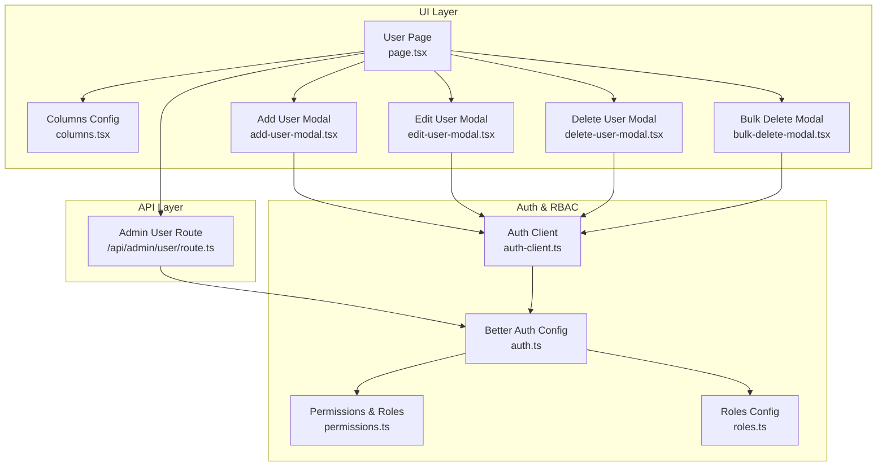
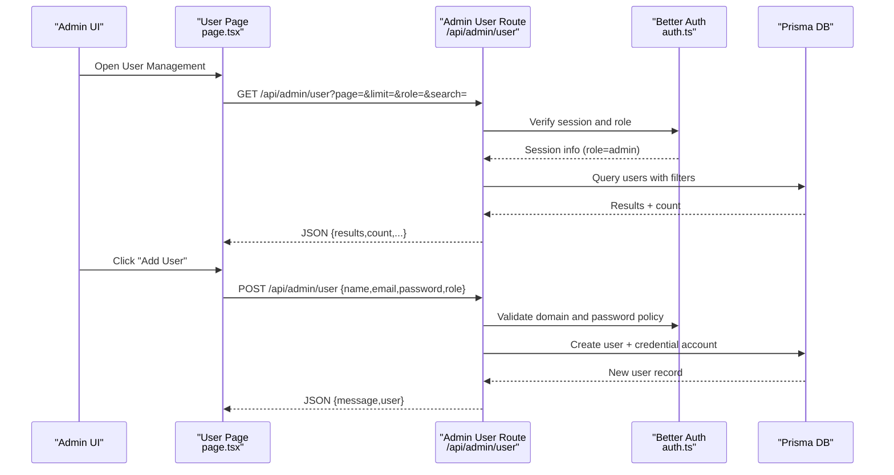
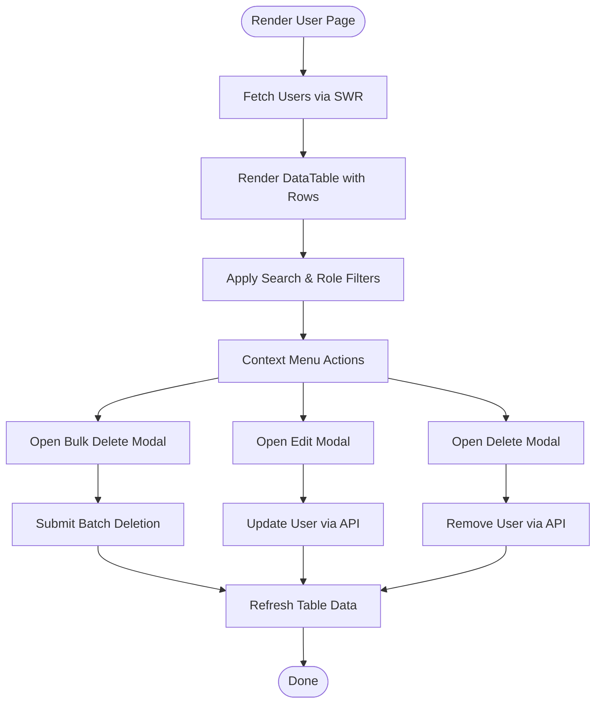
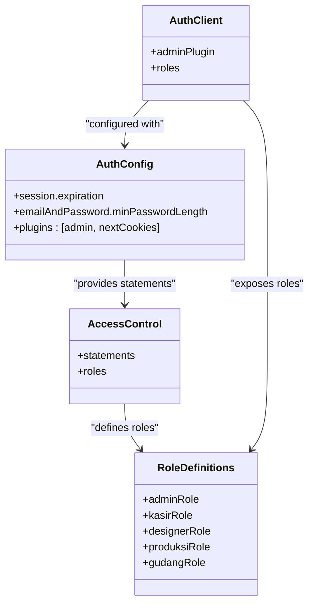
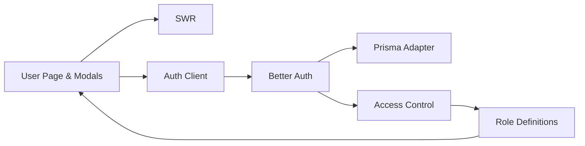

# User Administration

<cite>
**Referenced Files in This Document**
- [page.tsx](file://src/app/(LoggedIn)/master/user/page.tsx)
- [columns.tsx](file://src/app/(LoggedIn)/master/user/components/columns.tsx)
- [add-user-modal.tsx](file://src/app/(LoggedIn)/master/user/components/add-user-modal.tsx)
- [edit-user-modal.tsx](file://src/app/(LoggedIn)/master/user/components/edit-user-modal.tsx)
- [delete-user-modal.tsx](file://src/app/(LoggedIn)/master/user/components/delete-user-modal.tsx)
- [bulk-delete-modal.tsx](file://src/app/(LoggedIn)/master/user/components/bulk-delete-modal.tsx)
- [route.ts](file://src/app/api/admin/user/route.ts)
- [auth-client.ts](file://src/lib/auth-client.ts)
- [auth.ts](file://src/lib/auth.ts)
- [permissions.ts](file://src/lib/permissions.ts)
- [roles.ts](file://src/config/roles.ts)
</cite>

## Table of Contents
1. [Introduction](#introduction)
2. [Project Structure](#project-structure)
3. [Core Components](#core-components)
4. [Architecture Overview](#architecture-overview)
5. [Detailed Component Analysis](#detailed-component-analysis)
6. [Dependency Analysis](#dependency-analysis)
7. [Performance Considerations](#performance-considerations)
8. [Troubleshooting Guide](#troubleshooting-guide)
9. [Conclusion](#conclusion)
10. [Appendices](#appendices)

## Introduction
This document describes the user administration system for managing user accounts, roles, permissions, and access levels. It covers user registration, profile updates, account status control, role assignment, permission management, authentication integration, session management, and security settings. It also documents the modal-based interface for user CRUD operations and bulk management, along with practical examples of onboarding workflows, role-based access control (RBAC) implementation, and user activity monitoring via audit-friendly APIs.

## Project Structure
The user administration feature is organized under a dedicated master/user module with:
- A page component that renders the user table, filters, search, pagination, and context menu actions.
- Modal components for adding, editing, deleting, and bulk deletion of users.
- An API route for listing and creating users with strict validation and RBAC checks.
- Authentication and RBAC configuration integrated via Better Auth and Access Control.

**Diagram sources**
- [page.tsx:1-313](file://src/app/(LoggedIn)/master/user/page.tsx#L1-L313)
- [columns.tsx:1-46](file://src/app/(LoggedIn)/master/user/components/columns.tsx#L1-L46)
- [add-user-modal.tsx:1-242](file://src/app/(LoggedIn)/master/user/components/add-user-modal.tsx#L1-L242)
- [edit-user-modal.tsx:1-278](file://src/app/(LoggedIn)/master/user/components/edit-user-modal.tsx#L1-L278)
- [delete-user-modal.tsx:1-149](file://src/app/(LoggedIn)/master/user/components/delete-user-modal.tsx#L1-L149)
- [bulk-delete-modal.tsx:1-123](file://src/app/(LoggedIn)/master/user/components/bulk-delete-modal.tsx#L1-L123)
- [route.ts:1-214](file://src/app/api/admin/user/route.ts#L1-L214)
- [auth-client.ts:1-27](file://src/lib/auth-client.ts#L1-L27)
- [auth.ts:1-95](file://src/lib/auth.ts#L1-L95)
- [permissions.ts:1-67](file://src/lib/permissions.ts#L1-L67)
- [roles.ts:1-18](file://src/config/roles.ts#L1-L18)

**Section sources**
- [page.tsx:1-313](file://src/app/(LoggedIn)/master/user/page.tsx#L1-L313)
- [route.ts:1-214](file://src/app/api/admin/user/route.ts#L1-L214)
- [auth-client.ts:1-27](file://src/lib/auth-client.ts#L1-L27)
- [auth.ts:1-95](file://src/lib/auth.ts#L1-L95)
- [permissions.ts:1-67](file://src/lib/permissions.ts#L1-L67)
- [roles.ts:1-18](file://src/config/roles.ts#L1-L18)

## Core Components
- User Management Page: Renders the user table, search, filters, pagination, context menu, and bulk selection bar. Fetches paginated user data from the backend and supports role-based filtering.
- Modal Components:
  - Add User Modal: Validates and submits new user creation with role selection and password requirements.
  - Edit User Modal: Updates role and optionally resets password with session revocation.
  - Delete User Modal: Confirms permanent deletion and warns about associated data loss.
  - Bulk Delete Modal: Deletes multiple users concurrently and reports partial failures.
- Admin API Route: Implements listing and creation of users with domain validation, password policies, uniqueness checks, and role enforcement.
- Authentication and RBAC:
  - Better Auth configuration with email/password and admin plugin.
  - Access control statements and role definitions for resource-level permissions.
  - Auth client configured with admin plugin and centralized role mapping.

**Section sources**
- [page.tsx:85-313](file://src/app/(LoggedIn)/master/user/page.tsx#L85-L313)
- [add-user-modal.tsx:23-242](file://src/app/(LoggedIn)/master/user/components/add-user-modal.tsx#L23-L242)
- [edit-user-modal.tsx:26-278](file://src/app/(LoggedIn)/master/user/components/edit-user-modal.tsx#L26-L278)
- [delete-user-modal.tsx:20-149](file://src/app/(LoggedIn)/master/user/components/delete-user-modal.tsx#L20-L149)
- [bulk-delete-modal.tsx:18-123](file://src/app/(LoggedIn)/master/user/components/bulk-delete-modal.tsx#L18-L123)
- [route.ts:10-214](file://src/app/api/admin/user/route.ts#L10-L214)
- [auth.ts:20-95](file://src/lib/auth.ts#L20-L95)
- [auth-client.ts:12-27](file://src/lib/auth-client.ts#L12-L27)
- [permissions.ts:1-67](file://src/lib/permissions.ts#L1-L67)
- [roles.ts:1-18](file://src/config/roles.ts#L1-L18)

## Architecture Overview
The user administration system integrates UI modals with a backend API secured by Better Auth. The UI communicates with the API through typed requests, while the API enforces role-based access and validates inputs. RBAC is defined centrally and applied by the admin plugin.

**Diagram sources**
- [page.tsx:105-109](file://src/app/(LoggedIn)/master/user/page.tsx#L105-L109)
- [route.ts:10-97](file://src/app/api/admin/user/route.ts#L10-L97)
- [auth.ts:20-95](file://src/lib/auth.ts#L20-L95)

## Detailed Component Analysis

### User Management Page
Responsibilities:
- Fetches paginated user data with SWR.
- Supports search and role filtering.
- Renders user rows with provider badges (email/password, Google).
- Provides context menu actions (Edit, Delete) and bulk selection.
- Integrates with modals for add/edit/delete/bulk-delete.

Key behaviors:
- Debounced search input to reduce network load.
- Role filter options derived from centralized roles configuration.
- Pagination controls update page and limit, resetting to first page on limit change.
- Context menu opens edit/delete dialogs bound to the selected user.

**Diagram sources**
- [page.tsx:85-313](file://src/app/(LoggedIn)/master/user/page.tsx#L85-L313)

**Section sources**
- [page.tsx:85-313](file://src/app/(LoggedIn)/master/user/page.tsx#L85-L313)

### Columns Configuration
Defines visible columns for the user table:
- Name, Email, Provider, Role.
- Provider column includes a tooltip explaining provider meaning.
- Action column optimized for mobile contexts.

**Section sources**
- [columns.tsx:5-46](file://src/app/(LoggedIn)/master/user/components/columns.tsx#L5-L46)

### Add User Modal
Responsibilities:
- Collects name, email, password, confirm password, and role.
- Validates form using Zod resolver.
- Submits to admin API via auth client.
- Handles global errors and displays field-specific errors.
- Resets form and closes on success.

Security and UX:
- Password visibility toggle.
- Role selection from centralized roles.
- Toast feedback on success/error.

**Section sources**
- [add-user-modal.tsx:23-242](file://src/app/(LoggedIn)/master/user/components/add-user-modal.tsx#L23-L242)

### Edit User Modal
Responsibilities:
- Updates user role.
- Optionally resets password and revokes sessions for the affected user.
- Displays current avatar initials and provider badges.
- Conditional password reset UI based on credential provider availability.

Security and UX:
- Checkbox to enable password reset.
- Conditional hints when credential provider is missing.
- Toast feedback and form reset on success.

**Section sources**
- [edit-user-modal.tsx:26-278](file://src/app/(LoggedIn)/master/user/components/edit-user-modal.tsx#L26-L278)

### Delete User Modal
Responsibilities:
- Confirms permanent deletion of a single user.
- Warns about data loss (sessions, connected accounts, design files).
- Submits removal via admin API and notifies via toast.

**Section sources**
- [delete-user-modal.tsx:20-149](file://src/app/(LoggedIn)/master/user/components/delete-user-modal.tsx#L20-L149)

### Bulk Delete Modal
Responsibilities:
- Deletes multiple users concurrently using Promise.allSettled.
- Reports partial successes/failures with toast messages.
- Confirms bulk action and lists impacted data categories.

**Section sources**
- [bulk-delete-modal.tsx:18-123](file://src/app/(LoggedIn)/master/user/components/bulk-delete-modal.tsx#L18-L123)

### Admin API Route: Listing and Creating Users
Endpoints:
- GET /api/admin/user: Lists users with pagination, search, and role filters. Enforces admin role and excludes self.
- POST /api/admin/user: Creates a new user with normalized name, hashed password, random avatar, and credential account. Enforces domain whitelist, password length, and uniqueness.

Validation and Security:
- Session verification and role check.
- Email format and domain validation.
- Password minimum length enforcement.
- Unique email constraint.

**Section sources**
- [route.ts:10-97](file://src/app/api/admin/user/route.ts#L10-L97)
- [route.ts:99-214](file://src/app/api/admin/user/route.ts#L99-L214)

### Authentication Integration and RBAC
- Better Auth configuration enables email/password with custom hooks for domain validation and avatar assignment.
- Admin plugin with centralized access control statements and role definitions.
- Auth client initialized with admin plugin and role mappings for UI integration.

**Diagram sources**
- [auth.ts:20-95](file://src/lib/auth.ts#L20-L95)
- [permissions.ts:1-67](file://src/lib/permissions.ts#L1-L67)
- [auth-client.ts:12-27](file://src/lib/auth-client.ts#L12-L27)

**Section sources**
- [auth.ts:20-95](file://src/lib/auth.ts#L20-L95)
- [permissions.ts:1-67](file://src/lib/permissions.ts#L1-L67)
- [auth-client.ts:12-27](file://src/lib/auth-client.ts#L12-L27)
- [roles.ts:1-18](file://src/config/roles.ts#L1-L18)

## Dependency Analysis
- UI depends on:
  - SWR for data fetching.
  - Better Auth client for admin operations.
  - Centralized roles configuration for role selection.
- Backend depends on:
  - Better Auth for session verification and admin plugin.
  - Prisma adapter for database operations.
  - Argon2 for password hashing.
  - Centralized roles and permissions for access control.

**Diagram sources**
- [page.tsx:105-109](file://src/app/(LoggedIn)/master/user/page.tsx#L105-L109)
- [auth-client.ts:12-27](file://src/lib/auth-client.ts#L12-L27)
- [auth.ts:20-95](file://src/lib/auth.ts#L20-L95)
- [permissions.ts:1-67](file://src/lib/permissions.ts#L1-L67)
- [roles.ts:1-18](file://src/config/roles.ts#L1-L18)

**Section sources**
- [page.tsx:105-109](file://src/app/(LoggedIn)/master/user/page.tsx#L105-L109)
- [auth-client.ts:12-27](file://src/lib/auth-client.ts#L12-L27)
- [auth.ts:20-95](file://src/lib/auth.ts#L20-L95)
- [permissions.ts:1-67](file://src/lib/permissions.ts#L1-L67)
- [roles.ts:1-18](file://src/config/roles.ts#L1-L18)

## Performance Considerations
- Debounced search reduces unnecessary API calls during typing.
- Keep previous data during pagination to improve perceived performance.
- Batch deletion uses Promise.allSettled to avoid blocking on partial failures.
- Limit and page parameters control payload sizes for listing endpoints.

[No sources needed since this section provides general guidance]

## Troubleshooting Guide
Common issues and resolutions:
- Unauthorized or Forbidden:
  - Ensure the session has admin role before calling admin endpoints.
- Validation errors on creation:
  - Verify email format, domain whitelist, password length, and unique email.
- Password reset blocked:
  - Reset password is only available when credential provider exists for the user.
- Network errors:
  - UI displays generic network error messages; retry after checking connectivity.

**Section sources**
- [route.ts:17-29](file://src/app/api/admin/user/route.ts#L17-L29)
- [route.ts:123-165](file://src/app/api/admin/user/route.ts#L123-L165)
- [edit-user-modal.tsx:183-255](file://src/app/(LoggedIn)/master/user/components/edit-user-modal.tsx#L183-L255)

## Conclusion
The user administration system provides a secure, role-aware interface for managing users with robust validation, session control, and audit-friendly operations. The UI modals encapsulate CRUD and bulk operations, while the backend enforces strict access control and data integrity. RBAC is centrally defined and consistently enforced across the application.

[No sources needed since this section summarizes without analyzing specific files]

## Appendices

### Practical Examples

- User Onboarding Workflow
  - Steps: Search → Add User → Select Role → Set Password → Confirm.
  - UI: Add User Modal collects required fields and role; submission handled by auth client to admin API.
  - Backend: Creation validated by domain, password policy, and uniqueness; credential account created automatically.

- Role-Based Access Control Implementation
  - Define roles and statements in permissions module.
  - Configure Better Auth admin plugin with roles and default role.
  - Expose roles to UI via roles configuration for selection.

- User Activity Monitoring
  - Use admin API endpoints to list users and apply filters (role, search).
  - Track session expiration and revocation when passwords are reset.
  - Monitor audit trails via admin operations and logs.

**Section sources**
- [add-user-modal.tsx:46-78](file://src/app/(LoggedIn)/master/user/components/add-user-modal.tsx#L46-L78)
- [route.ts:99-214](file://src/app/api/admin/user/route.ts#L99-L214)
- [permissions.ts:25-67](file://src/lib/permissions.ts#L25-L67)
- [auth.ts:79-91](file://src/lib/auth.ts#L79-L91)
- [page.tsx:105-109](file://src/app/(LoggedIn)/master/user/page.tsx#L105-L109)
- [edit-user-modal.tsx:77-97](file://src/app/(LoggedIn)/master/user/components/edit-user-modal.tsx#L77-L97)