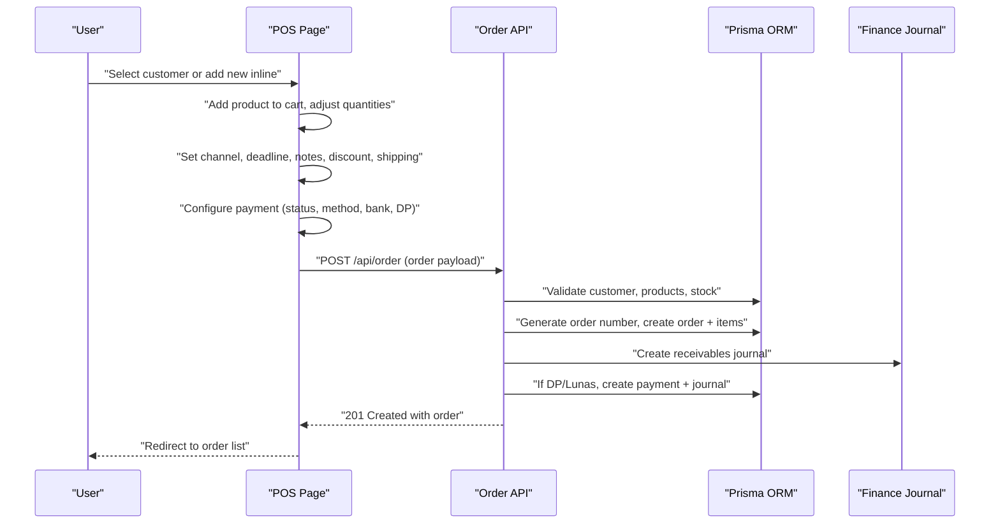
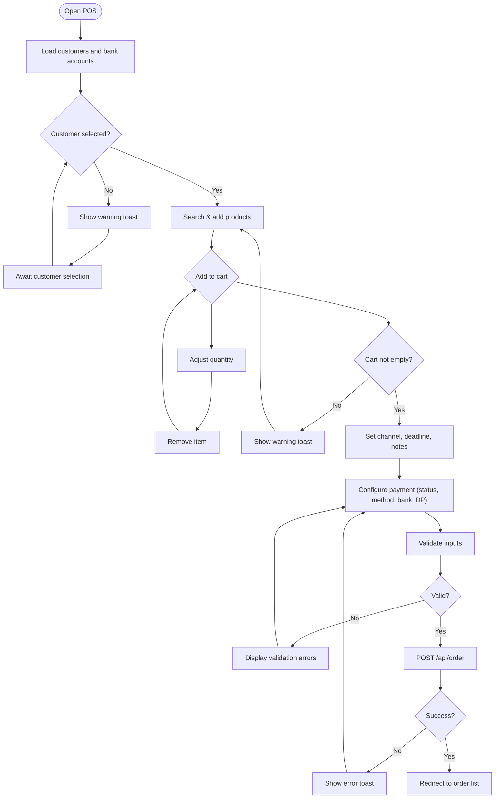
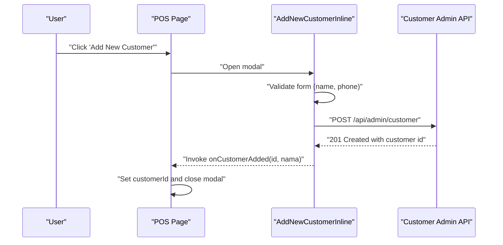
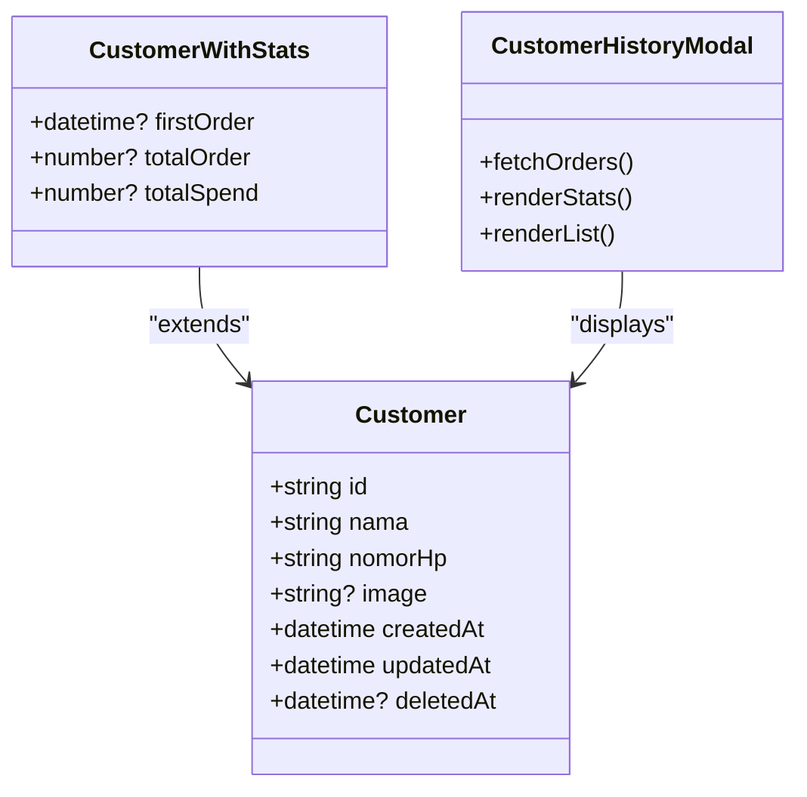
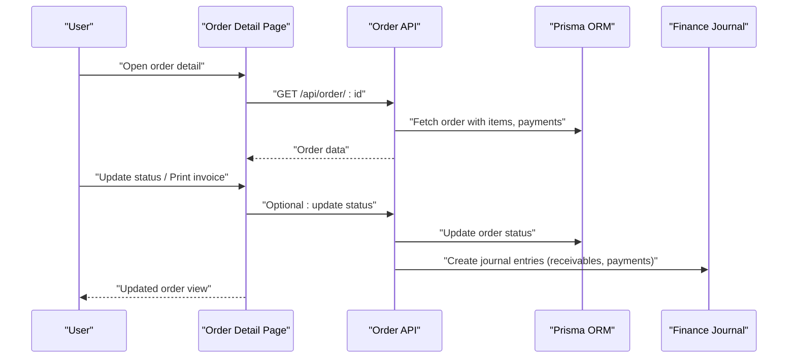
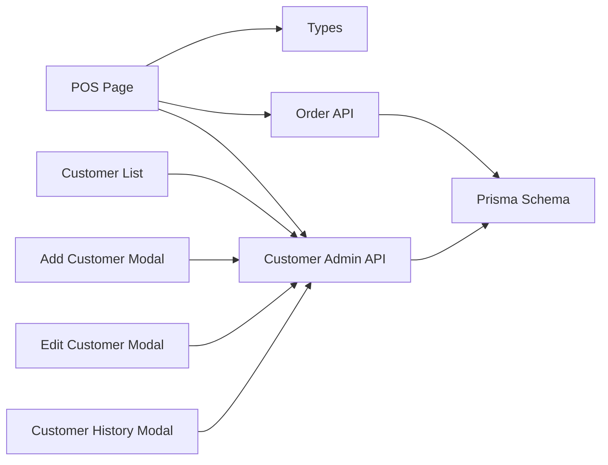

# Order Creation & Customer Management

<cite>
**Referenced Files in This Document**
- [src/app/(LoggedIn)/order/pos/page.tsx](file://src/app/(LoggedIn)/order/pos/page.tsx)
- [src/app/(LoggedIn)/order/pos/components/types.ts](file://src/app/(LoggedIn)/order/pos/components/types.ts)
- [src/app/(LoggedIn)/order/pos/components/cart-item-row.tsx](file://src/app/(LoggedIn)/order/pos/components/cart-item-row.tsx)
- [src/app/(LoggedIn)/order/pos/components/product-search-panel.tsx](file://src/app/(LoggedIn)/order/pos/components/product-search-panel.tsx)
- [src/app/(LoggedIn)/order/components/add-new-customer-inline.tsx](file://src/app/(LoggedIn)/order/components/add-new-customer-inline.tsx)
- [src/app/(LoggedIn)/order/[id]/page.tsx](file://src/app/(LoggedIn)/order/[id]/page.tsx)
- [src/app/(LoggedIn)/order/list/page.tsx](file://src/app/(LoggedIn)/order/list/page.tsx)
- [src/app/(LoggedIn)/master/customer/page.tsx](file://src/app/(LoggedIn)/master/customer/page.tsx)
- [src/app/(LoggedIn)/master/customer/components/add-customer-modal.tsx](file://src/app/(LoggedIn)/master/customer/components/add-customer-modal.tsx)
- [src/app/(LoggedIn)/master/customer/components/edit-customer-modal.tsx](file://src/app/(LoggedIn)/master/customer/components/edit-customer-modal.tsx)
- [src/app/(LoggedIn)/master/customer/components/customer-history-modal.tsx](file://src/app/(LoggedIn)/master/customer/components/customer-history-modal.tsx)
- [src/app/api/order/route.ts](file://src/app/api/order/route.ts)
- [src/app/api/admin/customer/route.ts](file://src/app/api/admin/customer/route.ts)
- [src/types/types.ts](file://src/types/types.ts)
- [prisma/schema.prisma](file://prisma/schema.prisma)
</cite>

## Table of Contents
1. [Introduction](#introduction)
2. [Project Structure](#project-structure)
3. [Core Components](#core-components)
4. [Architecture Overview](#architecture-overview)
5. [Detailed Component Analysis](#detailed-component-analysis)
6. [Dependency Analysis](#dependency-analysis)
7. [Performance Considerations](#performance-considerations)
8. [Troubleshooting Guide](#troubleshooting-guide)
9. [Conclusion](#conclusion)

## Introduction
This document explains the end-to-end order creation workflow and customer management system. It covers how to create new orders (POS flow), how to select or add customers inline, how customer history and segmentation are supported, and how the order form handles product selection, quantities, pricing, discounts, and payment. It also documents validation rules, error handling, data integrity checks, and integration with the customer master data system.

## Project Structure
The order and customer management features are implemented across:
- Frontend pages and components under the order and master/customer sections
- API routes for order creation and customer administration
- Prisma schema defining domain models and relationships
- Type definitions shared across the application

```mermaid
graph TB
subgraph "Order UI"
POS["POS Page<br/>src/app/(LoggedIn)/order/pos/page.tsx"]
OrderDetail["Order Detail Page<br/>src/app/(LoggedIn)/order/[id]/page.tsx"]
OrderList["Order List Page<br/>src/app/(LoggedIn)/order/list/page.tsx"]
end
subgraph "Customer UI"
CustomerList["Customer List<br/>src/app/(LoggedIn)/master/customer/page.tsx"]
AddCustomerModal["Add Customer Modal<br/>src/app/(LoggedIn)/master/customer/components/add-customer-modal.tsx"]
EditCustomerModal["Edit Customer Modal<br/>src/app/(LoggedIn)/master/customer/components/edit-customer-modal.tsx"]
CustomerHistoryModal["Customer History Modal<br/>src/app/(LoggedIn)/master/customer/components/customer-history-modal.tsx"]
AddNewCustomerInline["Add New Customer Inline<br/>src/app/(LoggedIn)/order/components/add-new-customer-inline.tsx"]
end
subgraph "API"
OrderRoute["Order Route<br/>src/app/api/order/route.ts"]
CustomerAdminRoute["Customer Admin Route<br/>src/app/api/admin/customer/route.ts"]
end
subgraph "Data"
Schema["Prisma Schema<br/>prisma/schema.prisma"]
Types["Shared Types<br/>src/types/types.ts"]
end
POS --> OrderRoute
POS --> CustomerAdminRoute
OrderDetail --> OrderRoute
OrderList --> OrderRoute
CustomerList --> CustomerAdminRoute
AddNewCustomerInline --> CustomerAdminRoute
AddCustomerModal --> CustomerAdminRoute
EditCustomerModal --> CustomerAdminRoute
CustomerHistoryModal --> CustomerAdminRoute
OrderRoute --> Schema
CustomerAdminRoute --> Schema
POS --> Types
OrderDetail --> Types
CustomerList --> Types
```

**Diagram sources**
- [src/app/(LoggedIn)/order/pos/page.tsx](file://src/app/(LoggedIn)/order/pos/page.tsx#L54-L603)
- [src/app/(LoggedIn)/order/[id]/page.tsx](file://src/app/(LoggedIn)/order/[id]/page.tsx#L25-L276)
- [src/app/(LoggedIn)/order/list/page.tsx](file://src/app/(LoggedIn)/order/list/page.tsx#L17-L137)
- [src/app/(LoggedIn)/master/customer/page.tsx](file://src/app/(LoggedIn)/master/customer/page.tsx#L35-L303)
- [src/app/(LoggedIn)/order/components/add-new-customer-inline.tsx](file://src/app/(LoggedIn)/order/components/add-new-customer-inline.tsx#L42-L166)
- [src/app/api/order/route.ts:141-443](file://src/app/api/order/route.ts#L141-L443)
- [src/app/api/admin/customer/route.ts:7-198](file://src/app/api/admin/customer/route.ts#L7-L198)
- [prisma/schema.prisma:147-296](file://prisma/schema.prisma#L147-L296)
- [src/types/types.ts:26-50](file://src/types/types.ts#L26-L50)

**Section sources**
- [src/app/(LoggedIn)/order/pos/page.tsx](file://src/app/(LoggedIn)/order/pos/page.tsx#L54-L603)
- [src/app/(LoggedIn)/master/customer/page.tsx](file://src/app/(LoggedIn)/master/customer/page.tsx#L35-L303)
- [src/app/api/order/route.ts:141-443](file://src/app/api/order/route.ts#L141-L443)
- [src/app/api/admin/customer/route.ts:7-198](file://src/app/api/admin/customer/route.ts#L7-L198)
- [prisma/schema.prisma:147-296](file://prisma/schema.prisma#L147-L296)
- [src/types/types.ts:26-50](file://src/types/types.ts#L26-L50)

## Core Components
- POS Order Creation Page: Handles customer selection (autocomplete or inline add), product search and cart, order metadata (channel, deadline, notes), payment configuration (status, method, bank account, down payment), discount and shipping adjustments, and submission to the backend.
- Customer Management Pages: Provide listing, viewing, editing, bulk deletion, and history inspection of customer records.
- Inline Customer Addition: Allows quick creation of a new customer directly from the POS form.
- Order API: Validates inputs, ensures product availability, generates order numbers, creates journal entries, and notifies stakeholders.
- Customer Admin API: Manages CRUD operations and computes customer statistics for the list view.

Key responsibilities:
- Cart management: add, update quantity, remove items, compute totals
- Validation: cart not empty, customer selected, DP/Lunas constraints, stock sufficiency
- Pricing: subtotal, discount, shipping, grand total
- Payment: bank account selection, nominal validation, auto-upgrade DP to LUNAS when applicable
- Customer history: first order, total orders, total spend

**Section sources**
- [src/app/(LoggedIn)/order/pos/page.tsx](file://src/app/(LoggedIn)/order/pos/page.tsx#L58-L232)
- [src/app/(LoggedIn)/order/pos/components/types.ts](file://src/app/(LoggedIn)/order/pos/components/types.ts#L1-L53)
- [src/app/(LoggedIn)/order/components/add-new-customer-inline.tsx](file://src/app/(LoggedIn)/order/components/add-new-customer-inline.tsx#L42-L166)
- [src/app/api/order/route.ts:141-443](file://src/app/api/order/route.ts#L141-L443)
- [src/app/api/admin/customer/route.ts:7-198](file://src/app/api/admin/customer/route.ts#L7-L198)

## Architecture Overview
The order creation workflow integrates frontend UI, inline customer creation, and backend APIs with database transactions and financial journaling.

**Diagram sources**
- [src/app/(LoggedIn)/order/pos/page.tsx](file://src/app/(LoggedIn)/order/pos/page.tsx#L139-L232)
- [src/app/api/order/route.ts:141-443](file://src/app/api/order/route.ts#L141-L443)

## Detailed Component Analysis

### POS Order Creation Workflow
The POS page orchestrates order creation:
- Customer selection via autocomplete or inline creation
- Product search panel adds items to cart
- Cart item row supports quantity updates and removal
- Order metadata and payment configuration
- Real-time price summary with discount and shipping
- Submission with validation and error feedback

**Diagram sources**
- [src/app/(LoggedIn)/order/pos/page.tsx](file://src/app/(LoggedIn)/order/pos/page.tsx#L58-L232)

**Section sources**
- [src/app/(LoggedIn)/order/pos/page.tsx](file://src/app/(LoggedIn)/order/pos/page.tsx#L58-L232)
- [src/app/(LoggedIn)/order/pos/components/cart-item-row.tsx](file://src/app/(LoggedIn)/order/pos/components/cart-item-row.tsx)
- [src/app/(LoggedIn)/order/pos/components/product-search-panel.tsx](file://src/app/(LoggedIn)/order/pos/components/product-search-panel.tsx)
- [src/app/(LoggedIn)/order/pos/components/types.ts](file://src/app/(LoggedIn)/order/pos/components/types.ts#L1-L53)

### Inline Customer Creation (POS)
Allows adding a new customer without leaving the POS form:
- Modal validates required fields (name, phone)
- Submits to customer admin API
- On success, selects the new customer and resets form

**Diagram sources**
- [src/app/(LoggedIn)/order/components/add-new-customer-inline.tsx](file://src/app/(LoggedIn)/order/components/add-new-customer-inline.tsx#L63-L86)
- [src/app/api/admin/customer/route.ts:87-155](file://src/app/api/admin/customer/route.ts#L87-L155)

**Section sources**
- [src/app/(LoggedIn)/order/components/add-new-customer-inline.tsx](file://src/app/(LoggedIn)/order/components/add-new-customer-inline.tsx#L42-L166)
- [src/app/api/admin/customer/route.ts:87-155](file://src/app/api/admin/customer/route.ts#L87-L155)

### Customer Management Features
- Listing with search, pagination, and statistics (first order, total orders, total spend)
- Context menu actions: view, history, edit, delete
- Modals for add, edit, and history inspection
- Bulk delete capability

**Diagram sources**
- [prisma/schema.prisma:147-159](file://prisma/schema.prisma#L147-L159)
- [src/app/(LoggedIn)/master/customer/page.tsx](file://src/app/(LoggedIn)/master/customer/page.tsx#L28-L33)
- [src/app/(LoggedIn)/master/customer/components/customer-history-modal.tsx](file://src/app/(LoggedIn)/master/customer/components/customer-history-modal.tsx#L45-L209)

**Section sources**
- [src/app/(LoggedIn)/master/customer/page.tsx](file://src/app/(LoggedIn)/master/customer/page.tsx#L35-L303)
- [src/app/(LoggedIn)/master/customer/components/add-customer-modal.tsx](file://src/app/(LoggedIn)/master/customer/components/add-customer-modal.tsx#L30-L149)
- [src/app/(LoggedIn)/master/customer/components/edit-customer-modal.tsx](file://src/app/(LoggedIn)/master/customer/components/edit-customer-modal.tsx#L28-L163)
- [src/app/(LoggedIn)/master/customer/components/customer-history-modal.tsx](file://src/app/(LoggedIn)/master/customer/components/customer-history-modal.tsx#L45-L209)

### Order Detail and Payment Flow
The order detail page displays order information, items, design files, and payment summary. It supports status updates and printing invoices. Payments are recorded and journal entries are generated.

**Diagram sources**
- [src/app/(LoggedIn)/order/[id]/page.tsx](file://src/app/(LoggedIn)/order/[id]/page.tsx#L25-L276)
- [src/app/api/order/route.ts:141-443](file://src/app/api/order/route.ts#L141-L443)

**Section sources**
- [src/app/(LoggedIn)/order/[id]/page.tsx](file://src/app/(LoggedIn)/order/[id]/page.tsx#L25-L276)
- [src/app/api/order/route.ts:141-443](file://src/app/api/order/route.ts#L141-L443)

## Dependency Analysis
- POS depends on:
  - Customer autocomplete and inline add for customer selection
  - Product search panel for adding items
  - Cart item row for quantity and removal
  - Types for enums and constants
  - Order API for submission
- Customer management depends on:
  - Customer admin API for CRUD and history
  - Modals for add/edit/history
- Order API depends on:
  - Prisma models for order, items, payments, journals
  - Finance utilities for double-entry journaling
  - Notifications for stakeholder alerts

**Diagram sources**
- [src/app/(LoggedIn)/order/pos/page.tsx](file://src/app/(LoggedIn)/order/pos/page.tsx#L54-L603)
- [src/app/(LoggedIn)/master/customer/page.tsx](file://src/app/(LoggedIn)/master/customer/page.tsx#L35-L303)
- [src/app/api/order/route.ts:141-443](file://src/app/api/order/route.ts#L141-L443)
- [src/app/api/admin/customer/route.ts:7-198](file://src/app/api/admin/customer/route.ts#L7-L198)
- [prisma/schema.prisma:147-296](file://prisma/schema.prisma#L147-L296)

**Section sources**
- [src/app/(LoggedIn)/order/pos/page.tsx](file://src/app/(LoggedIn)/order/pos/page.tsx#L54-L603)
- [src/app/(LoggedIn)/master/customer/page.tsx](file://src/app/(LoggedIn)/master/customer/page.tsx#L35-L303)
- [src/app/api/order/route.ts:141-443](file://src/app/api/order/route.ts#L141-L443)
- [src/app/api/admin/customer/route.ts:7-198](file://src/app/api/admin/customer/route.ts#L7-L198)
- [prisma/schema.prisma:147-296](file://prisma/schema.prisma#L147-L296)

## Performance Considerations
- Use SWR for efficient caching and revalidation of customer lists and order lists.
- Debounce search inputs to reduce unnecessary API calls.
- Paginate customer and order listings to avoid large payloads.
- Keep cart operations client-side until submission to minimize network requests.
- Batch notifications and journal entries within a single transaction to reduce overhead.

## Troubleshooting Guide
Common issues and resolutions:
- Empty cart submission: The POS page prevents submission and shows a warning toast. Add at least one product to the cart.
- Missing customer selection: The POS page requires a customer to be selected before submission.
- DP nominal validation: When status is DP, the nominal must be greater than zero and not exceed the grand total. Clear the error and adjust accordingly.
- Product stock insufficient: The backend validates stock for non-service products and rejects orders exceeding available stock.
- Unauthorized or forbidden access: Certain endpoints require authenticated sessions and appropriate roles (admin, kasir, etc.).
- Network errors: The POS page catches network exceptions during submission and displays a generic error toast.

Validation and error handling highlights:
- POS validation: cart not empty, customer selected, DP nominal constraints, submission state management
- Backend validation: customer existence, product existence, stock sufficiency, required fields, DP/Lunas constraints
- Error responses: structured JSON with error messages returned to the frontend

**Section sources**
- [src/app/(LoggedIn)/order/pos/page.tsx](file://src/app/(LoggedIn)/order/pos/page.tsx#L139-L232)
- [src/app/api/order/route.ts:164-248](file://src/app/api/order/route.ts#L164-L248)
- [src/app/api/admin/customer/route.ts:107-133](file://src/app/api/admin/customer/route.ts#L107-L133)

## Conclusion
The order creation workflow integrates a streamlined POS interface with robust validation, real-time pricing, and inline customer management. Customer history and segmentation are supported through dedicated views and computed metrics. The backend enforces data integrity, manages inventory, and maintains financial records through double-entry journaling. Together, these components deliver a reliable and user-friendly order management experience.