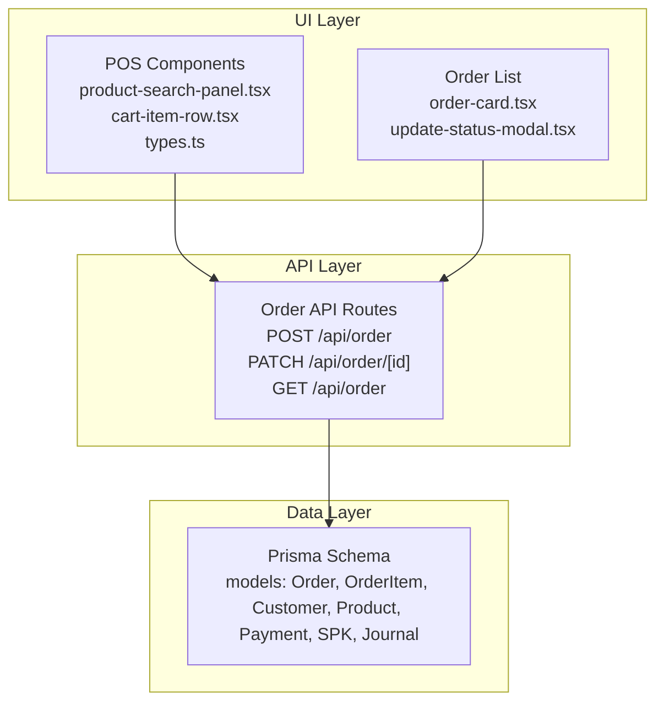
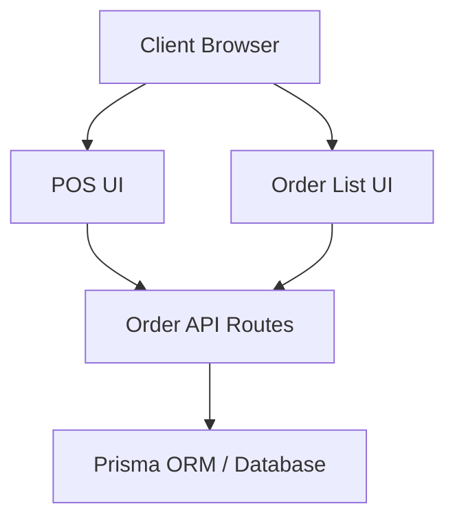
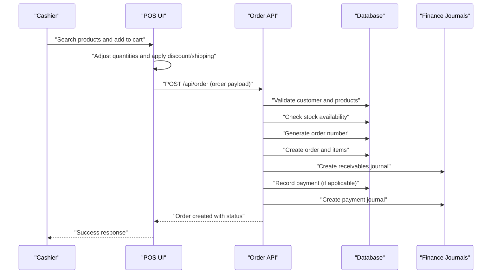
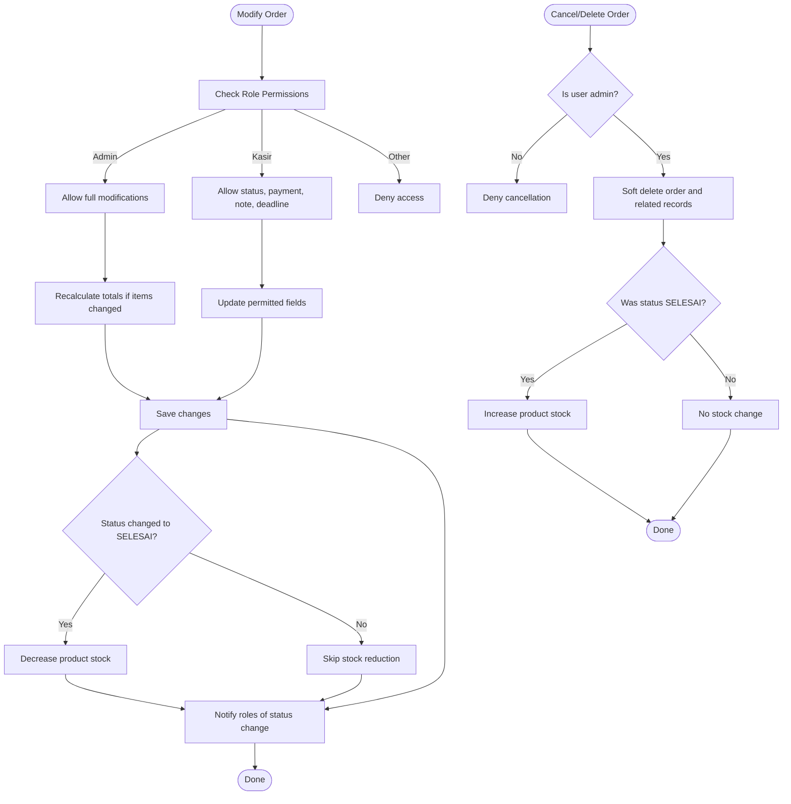
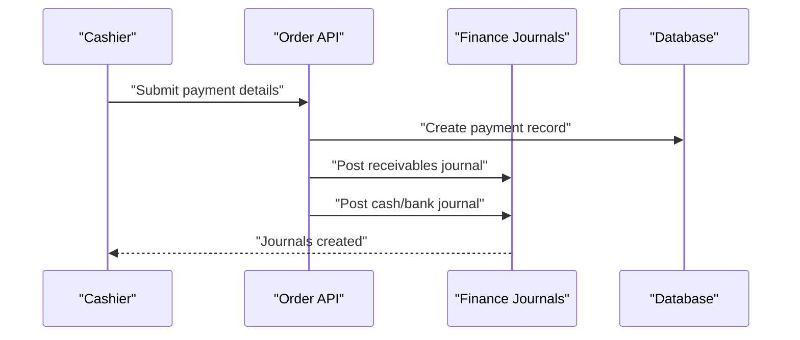
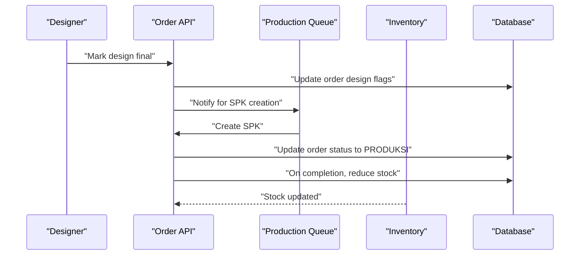
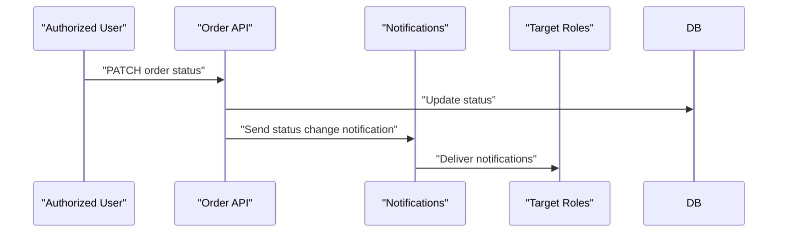
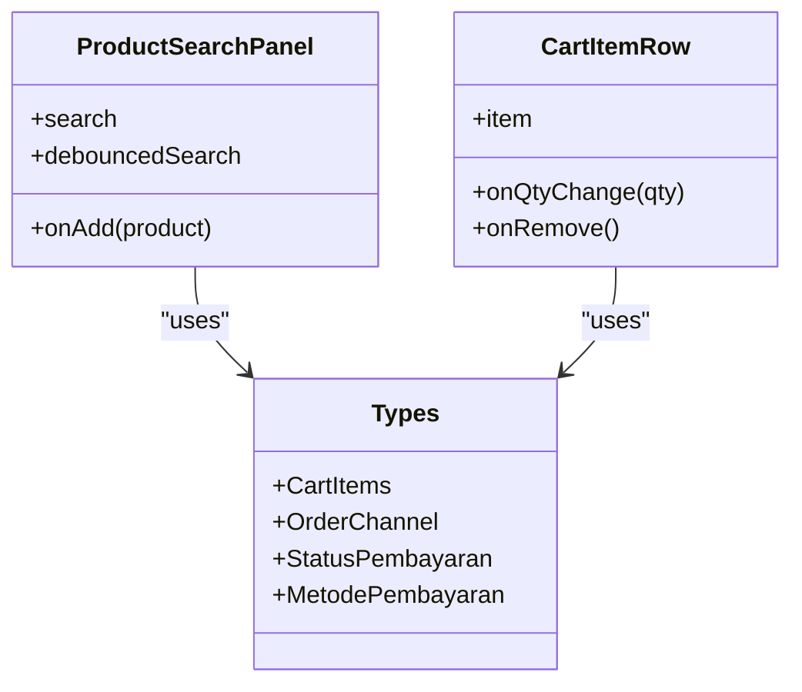
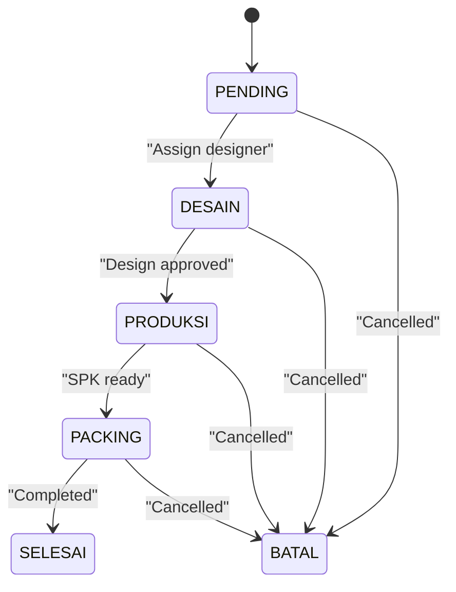
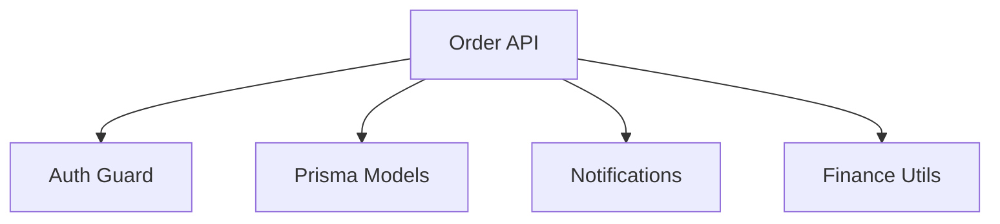

# Order Management System

<cite>
**Referenced Files in This Document**
- [src/app/api/order/route.ts](file://src/app/api/order/route.ts)
- [src/app/api/order/[id]/route.ts](file://src/app/api/order/[id]/route.ts)
- [src/app/(LoggedIn)/order/pos/components/product-search-panel.tsx](file://src/app/(LoggedIn)/order/pos/components/product-search-panel.tsx)
- [src/app/(LoggedIn)/order/pos/components/cart-item-row.tsx](file://src/app/(LoggedIn)/order/pos/components/cart-item-row.tsx)
- [src/app/(LoggedIn)/order/pos/components/types.ts](file://src/app/(LoggedIn)/order/pos/components/types.ts)
- [src/app/(LoggedIn)/order/list/components/order-card.tsx](file://src/app/(LoggedIn)/order/list/components/order-card.tsx)
- [src/app/(LoggedIn)/order/list/components/update-status-modal.tsx](file://src/app/(LoggedIn)/order/list/components/update-status-modal.tsx)
- [prisma/schema.prisma](file://prisma/schema.prisma)
- [diagram/sequence/01-buat-pesanan.mmd](file://diagram/sequence/01-buat-pesanan.mmd)
- [diagram/sequence/03-update-status-pesanan.mmd](file://diagram/sequence/03-update-status-pesanan.mmd)
- [diagram/sequence/05-pembayaran-order.mmd](file://diagram/sequence/05-pembayaran-order.mmd)
- [diagram/sequence/06-buat-spk-produksi.mmd](file://diagram/sequence/06-buat-spk-produksi.mmd)
- [diagram/sequence/07-update-status-spk.mmd](file://diagram/sequence/07-update-status-spk.mmd)
- [diagram/sequence/08-penerimaan-barang.mmd](file://diagram/sequence/08-penerimaan-barang.mmd)
- [diagram/sequence/09-jurnal-keuangan.mmd](file://diagram/sequence/09-jurnal-keuangan.mmd)
- [diagram/usecase/pesanan.puml](file://diagram/usecase/pesanan.puml)
</cite>

## Table of Contents
1. [Introduction](#introduction)
2. [Project Structure](#project-structure)
3. [Core Components](#core-components)
4. [Architecture Overview](#architecture-overview)
5. [Detailed Component Analysis](#detailed-component-analysis)
6. [Dependency Analysis](#dependency-analysis)
7. [Performance Considerations](#performance-considerations)
8. [Troubleshooting Guide](#troubleshooting-guide)
9. [Conclusion](#conclusion)
10. [Appendices](#appendices)

## Introduction
This document provides comprehensive documentation for the order management system, covering the complete order lifecycle from creation to delivery. It explains order creation workflow, customer management integration, product selection, quantity management, pricing calculations, and discount application. It documents order processing logic, status tracking, payment integration, and invoice generation. It also covers the POS interface for cash transactions, order modification, cancellation procedures, and customer history management. The document details order status transitions, workflow automation, and real-time order tracking, along with order reporting, historical data management, and integrations with inventory and production systems. Practical examples and troubleshooting guidance for common order processing issues are included.

## Project Structure
The order management system is implemented as a Next.js application with a layered architecture:
- API routes under src/app/api handle backend operations for order CRUD, status updates, and payment processing.
- UI components under src/app/(LoggedIn)/order provide the POS interface, order listing, and status update modals.
- Prisma schema defines the database models and relationships.
- PlantUML and Mermaid diagrams illustrate workflows and sequences.

**Diagram sources**
- [src/app/(LoggedIn)/order/pos/components/product-search-panel.tsx](file://src/app/(LoggedIn)/order/pos/components/product-search-panel.tsx#L1-L106)
- [src/app/(LoggedIn)/order/pos/components/cart-item-row.tsx](file://src/app/(LoggedIn)/order/pos/components/cart-item-row.tsx#L1-L84)
- [src/app/(LoggedIn)/order/pos/components/types.ts](file://src/app/(LoggedIn)/order/pos/components/types.ts#L1-L53)
- [src/app/(LoggedIn)/order/list/components/order-card.tsx](file://src/app/(LoggedIn)/order/list/components/order-card.tsx#L1-L156)
- [src/app/(LoggedIn)/order/list/components/update-status-modal.tsx](file://src/app/(LoggedIn)/order/list/components/update-status-modal.tsx#L1-L296)
- [src/app/api/order/route.ts:1-443](file://src/app/api/order/route.ts#L1-L443)
- [src/app/api/order/[id]/route.ts](file://src/app/api/order/[id]/route.ts#L1-L615)
- [prisma/schema.prisma](file://prisma/schema.prisma)

**Section sources**
- [src/app/api/order/route.ts:1-443](file://src/app/api/order/route.ts#L1-L443)
- [src/app/api/order/[id]/route.ts](file://src/app/api/order/[id]/route.ts#L1-L615)
- [src/app/(LoggedIn)/order/pos/components/product-search-panel.tsx](file://src/app/(LoggedIn)/order/pos/components/product-search-panel.tsx#L1-L106)
- [src/app/(LoggedIn)/order/pos/components/cart-item-row.tsx](file://src/app/(LoggedIn)/order/pos/components/cart-item-row.tsx#L1-L84)
- [src/app/(LoggedIn)/order/pos/components/types.ts](file://src/app/(LoggedIn)/order/pos/components/types.ts#L1-L53)
- [src/app/(LoggedIn)/order/list/components/order-card.tsx](file://src/app/(LoggedIn)/order/list/components/order-card.tsx#L1-L156)
- [src/app/(LoggedIn)/order/list/components/update-status-modal.tsx](file://src/app/(LoggedIn)/order/list/components/update-status-modal.tsx#L1-L296)
- [prisma/schema.prisma](file://prisma/schema.prisma)

## Core Components
- Order API (POST): Creates orders with validation, generates order numbers, applies discounts and shipping, checks product stock, and records payments and journal entries.
- Order API (PATCH): Updates order status, payment status, and metadata with role-based restrictions; triggers stock reductions on completion; handles design review and finalization.
- Order API (DELETE): Soft deletes orders and restores inventory if previously reduced.
- POS Components: Product search panel and cart item row manage product selection, quantity adjustments, and checkout submission.
- Order List Components: Order cards and status update modal enable role-appropriate status transitions and SPK creation.

**Section sources**
- [src/app/api/order/route.ts:141-443](file://src/app/api/order/route.ts#L141-L443)
- [src/app/api/order/[id]/route.ts](file://src/app/api/order/[id]/route.ts#L148-L615)
- [src/app/(LoggedIn)/order/pos/components/product-search-panel.tsx](file://src/app/(LoggedIn)/order/pos/components/product-search-panel.tsx#L1-L106)
- [src/app/(LoggedIn)/order/pos/components/cart-item-row.tsx](file://src/app/(LoggedIn)/order/pos/components/cart-item-row.tsx#L1-L84)
- [src/app/(LoggedIn)/order/list/components/order-card.tsx](file://src/app/(LoggedIn)/order/list/components/order-card.tsx#L1-L156)
- [src/app/(LoggedIn)/order/list/components/update-status-modal.tsx](file://src/app/(LoggedIn)/order/list/components/update-status-modal.tsx#L1-L296)

## Architecture Overview
The system follows a clean architecture with clear separation between UI, API, and data layers. Authentication and authorization are enforced at the API level. Transactions ensure data consistency during order creation and updates. Notifications and journals integrate with cross-functional teams and financial systems.

**Diagram sources**
- [src/app/api/order/route.ts:1-443](file://src/app/api/order/route.ts#L1-L443)
- [src/app/api/order/[id]/route.ts](file://src/app/api/order/[id]/route.ts#L1-L615)
- [prisma/schema.prisma](file://prisma/schema.prisma)

## Detailed Component Analysis

### Order Creation Workflow (Cash POS)
This sequence illustrates the end-to-end order creation process in the POS, including product selection, quantity management, discount application, payment recording, and financial journal entries.

**Diagram sources**
- [src/app/api/order/route.ts:141-443](file://src/app/api/order/route.ts#L141-L443)
- [src/app/(LoggedIn)/order/pos/components/product-search-panel.tsx](file://src/app/(LoggedIn)/order/pos/components/product-search-panel.tsx#L1-L106)
- [src/app/(LoggedIn)/order/pos/components/cart-item-row.tsx](file://src/app/(LoggedIn)/order/pos/components/cart-item-row.tsx#L1-L84)
- [diagram/sequence/01-buat-pesanan.mmd](file://diagram/sequence/01-buat-pesanan.mmd)

**Section sources**
- [src/app/api/order/route.ts:141-443](file://src/app/api/order/route.ts#L141-L443)
- [src/app/(LoggedIn)/order/pos/components/product-search-panel.tsx](file://src/app/(LoggedIn)/order/pos/components/product-search-panel.tsx#L1-L106)
- [src/app/(LoggedIn)/order/pos/components/cart-item-row.tsx](file://src/app/(LoggedIn)/order/pos/components/cart-item-row.tsx#L1-L84)

### Order Modification and Cancellation
Order modification supports role-specific updates, recalculations for admin, and design review controls. Cancellation soft-deletes orders and restores inventory if previously reduced.

**Diagram sources**
- [src/app/api/order/[id]/route.ts](file://src/app/api/order/[id]/route.ts#L148-L615)

**Section sources**
- [src/app/api/order/[id]/route.ts](file://src/app/api/order/[id]/route.ts#L148-L615)

### Payment Integration and Financial Journals
Payments are recorded alongside order creation or later updates. Receivables and cash/bank journals are automatically generated to maintain double-entry bookkeeping.

**Diagram sources**
- [src/app/api/order/route.ts:333-408](file://src/app/api/order/route.ts#L333-L408)
- [diagram/sequence/05-pembayaran-order.mmd](file://diagram/sequence/05-pembayaran-order.mmd)
- [diagram/sequence/09-jurnal-keuangan.mmd](file://diagram/sequence/09-jurnal-keuangan.mmd)

**Section sources**
- [src/app/api/order/route.ts:333-408](file://src/app/api/order/route.ts#L333-L408)

### Production and Inventory Integration
Production steps are coordinated via SPK creation and status updates. Inventory stock is reduced upon order completion.

**Diagram sources**
- [src/app/api/order/[id]/route.ts](file://src/app/api/order/[id]/route.ts#L446-L462)
- [diagram/sequence/06-buat-spk-produksi.mmd](file://diagram/sequence/06-buat-spk-produksi.mmd)
- [diagram/sequence/07-update-status-spk.mmd](file://diagram/sequence/07-update-status-spk.mmd)
- [diagram/sequence/08-penerimaan-barang.mmd](file://diagram/sequence/08-penerimaan-barang.mmd)

**Section sources**
- [src/app/api/order/[id]/route.ts](file://src/app/api/order/[id]/route.ts#L446-L462)

### Real-Time Status Tracking and Notifications
Status changes trigger notifications to relevant roles, enabling real-time collaboration across design, production, and administration.

**Diagram sources**
- [src/app/api/order/[id]/route.ts](file://src/app/api/order/[id]/route.ts#L464-L474)

**Section sources**
- [src/app/api/order/[id]/route.ts](file://src/app/api/order/[id]/route.ts#L464-L474)

### POS Interface for Cash Transactions
The POS interface enables quick product search, cart management, and checkout submission with immediate order creation and payment recording.

**Diagram sources**
- [src/app/(LoggedIn)/order/pos/components/product-search-panel.tsx](file://src/app/(LoggedIn)/order/pos/components/product-search-panel.tsx#L1-L106)
- [src/app/(LoggedIn)/order/pos/components/cart-item-row.tsx](file://src/app/(LoggedIn)/order/pos/components/cart-item-row.tsx#L1-L84)
- [src/app/(LoggedIn)/order/pos/components/types.ts](file://src/app/(LoggedIn)/order/pos/components/types.ts#L1-L53)

**Section sources**
- [src/app/(LoggedIn)/order/pos/components/product-search-panel.tsx](file://src/app/(LoggedIn)/order/pos/components/product-search-panel.tsx#L1-L106)
- [src/app/(LoggedIn)/order/pos/components/cart-item-row.tsx](file://src/app/(LoggedIn)/order/pos/components/cart-item-row.tsx#L1-L84)
- [src/app/(LoggedIn)/order/pos/components/types.ts](file://src/app/(LoggedIn)/order/pos/components/types.ts#L1-L53)

### Order Status Transitions and Automation
The system enforces a strict status progression with automated actions triggered by state changes, ensuring workflow compliance and auditability.

**Diagram sources**
- [src/app/api/order/[id]/route.ts](file://src/app/api/order/[id]/route.ts#L214-L228)
- [src/app/(LoggedIn)/order/list/components/update-status-modal.tsx](file://src/app/(LoggedIn)/order/list/components/update-status-modal.tsx#L117-L141)

**Section sources**
- [src/app/api/order/[id]/route.ts](file://src/app/api/order/[id]/route.ts#L214-L228)
- [src/app/(LoggedIn)/order/list/components/update-status-modal.tsx](file://src/app/(LoggedIn)/order/list/components/update-status-modal.tsx#L117-L141)

### Customer History Management
Order history is maintained through order records, payment histories, and associated journals, enabling comprehensive customer transaction tracking.

**Section sources**
- [src/app/api/order/[id]/route.ts](file://src/app/api/order/[id]/route.ts#L16-L91)

## Dependency Analysis
The order module depends on:
- Authentication and authorization guards for role-based access.
- Prisma models for order, items, customers, products, payments, SPKs, and journals.
- Notification service for inter-role communication.
- Finance utilities for double-entry journal creation.

**Diagram sources**
- [src/app/api/order/route.ts:10-28](file://src/app/api/order/route.ts#L10-L28)
- [src/app/api/order/[id]/route.ts](file://src/app/api/order/[id]/route.ts#L93-L117)
- [prisma/schema.prisma](file://prisma/schema.prisma)

**Section sources**
- [src/app/api/order/route.ts:10-28](file://src/app/api/order/route.ts#L10-L28)
- [src/app/api/order/[id]/route.ts](file://src/app/api/order/[id]/route.ts#L93-L117)
- [prisma/schema.prisma](file://prisma/schema.prisma)

## Performance Considerations
- Batch stock updates: When reducing inventory on completion, batch operations are used to minimize database round-trips.
- Transaction boundaries: Critical operations (order creation, payment posting, stock adjustment) are wrapped in database transactions to ensure atomicity.
- Efficient queries: Pagination and selective field retrieval are used in order listings to reduce payload sizes.
- Debounced search: Product search in POS uses debounced queries to avoid excessive API calls.

[No sources needed since this section provides general guidance]

## Troubleshooting Guide
Common issues and resolutions:
- Unauthorized or forbidden access: Verify user role and session; ensure access is restricted to authorized roles.
- Invalid order payload: Ensure required fields (customer, items, subtotal/grandTotal) are present and valid; verify product existence and sufficient stock.
- Payment validation errors: Confirm payment method and amount; ensure DP does not exceed grand total.
- Status update failures: Check role permissions; certain statuses require specific prerequisites (e.g., payment status for completion).
- Cancellation complications: Admin-only operation; ensure inventory restoration occurs when applicable.

**Section sources**
- [src/app/api/order/route.ts:164-203](file://src/app/api/order/route.ts#L164-L203)
- [src/app/api/order/[id]/route.ts](file://src/app/api/order/[id]/route.ts#L200-L236)
- [src/app/api/order/[id]/route.ts](file://src/app/api/order/[id]/route.ts#L524-L615)

## Conclusion
The order management system provides a robust, role-aware, and financially integrated solution for managing the complete order lifecycle. Its POS interface accelerates cash transactions, while backend APIs enforce validation, automate inventory and financial updates, and support real-time collaboration across departments. The modular architecture and clear status workflows facilitate scalability and maintainability.

[No sources needed since this section summarizes without analyzing specific files]

## Appendices

### Practical Scenarios
- Creating an order with multiple items, applying a discount, and recording a partial payment.
- Updating order status from pending to design-approved, triggering SPK creation.
- Completing an order and observing automatic stock reduction and journal entries.
- Cancelling an order and verifying inventory restoration.

[No sources needed since this section provides general guidance]