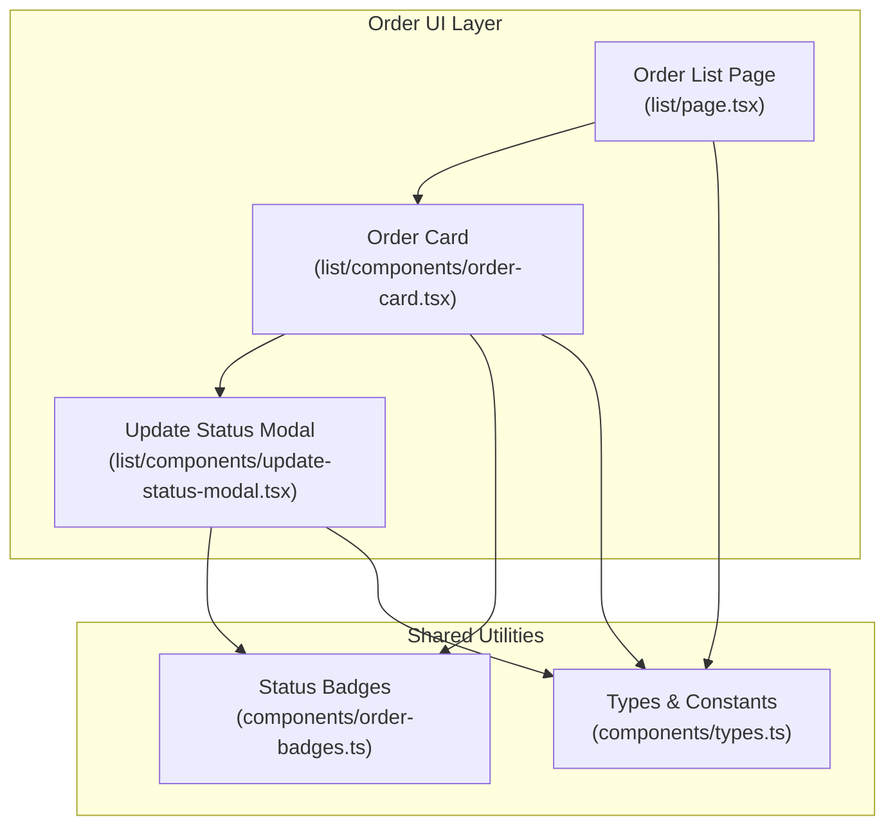
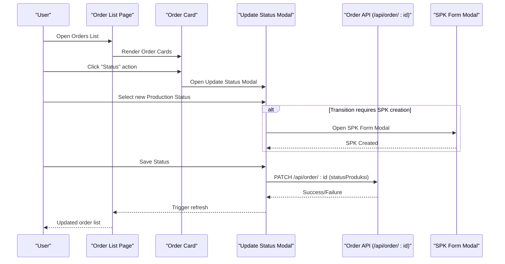
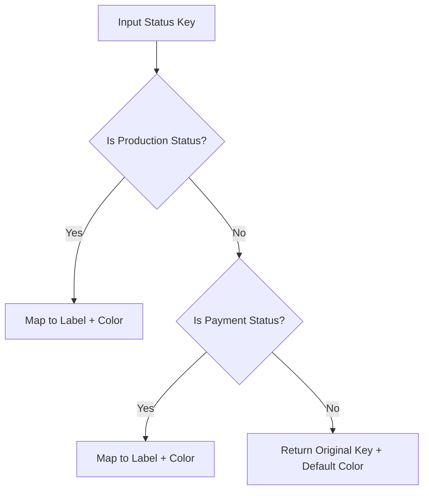
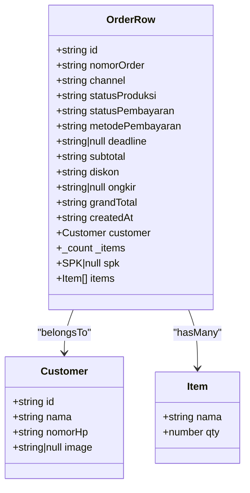
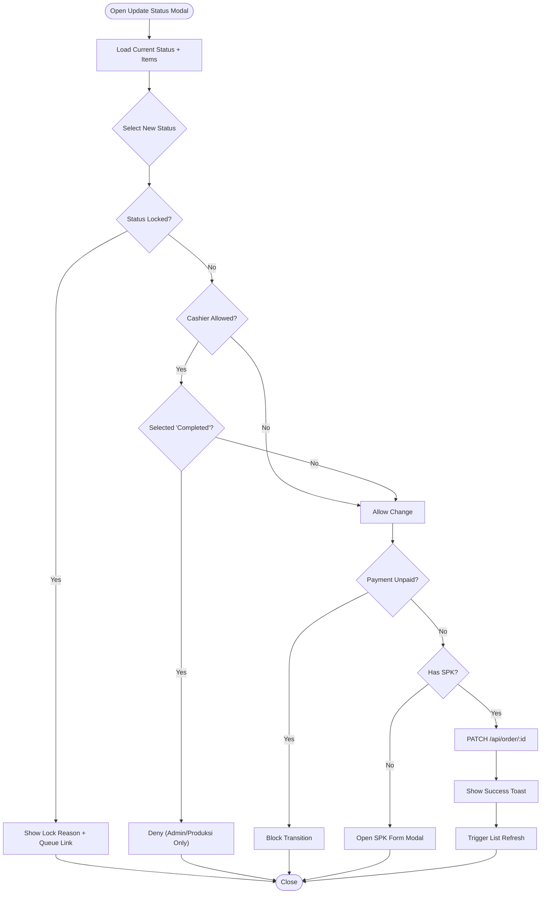
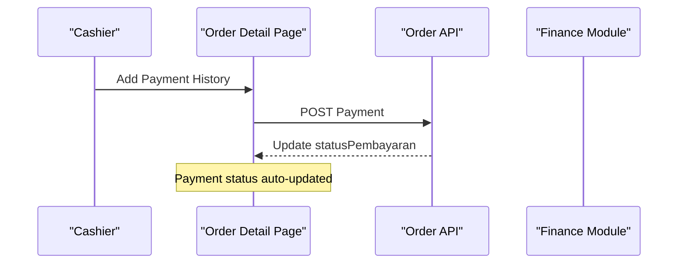
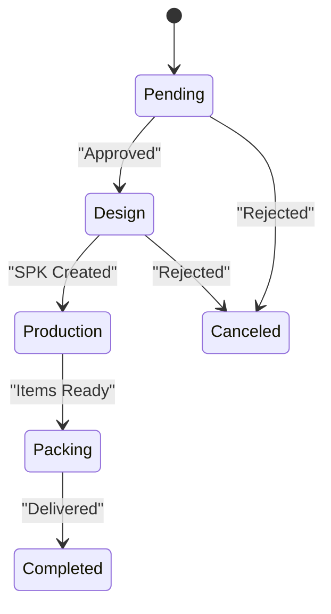
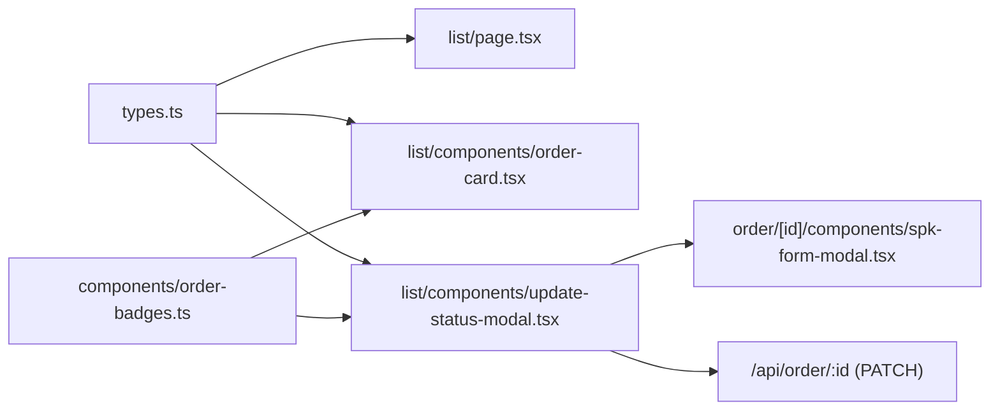
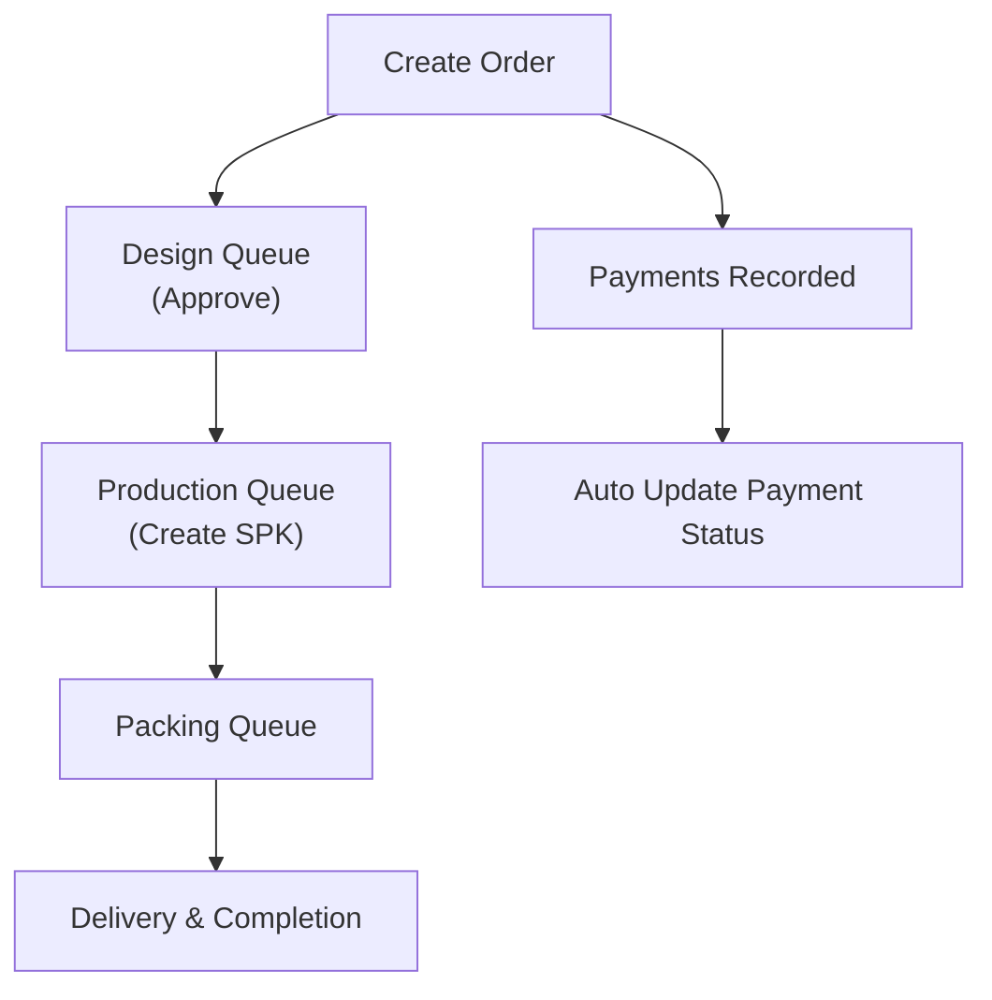
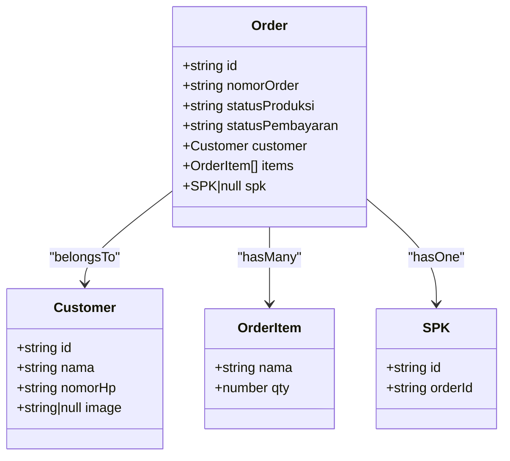

# Order Processing & Status Management

<cite>
**Referenced Files in This Document**
- [order-badges.ts](file://src/app/(LoggedIn)/order/components/order-badges.ts)
- [types.ts](file://src/app/(LoggedIn)/order/components/types.ts)
- [page.tsx](file://src/app/(LoggedIn)/order/list/page.tsx)
- [order-card.tsx](file://src/app/(LoggedIn)/order/list/components/order-card.tsx)
- [update-status-modal.tsx](file://src/app/(LoggedIn)/order/list/components/update-status-modal.tsx)
- [01-buat-pesanan.mmd](file://diagram/sequence/01-buat-pesanan.mmd)
- [03-update-status-pesanan.mmd](file://diagram/sequence/03-update-status-pesanan.mmd)
- [05-pembayaran-order.mmd](file://diagram/sequence/05-pembayaran-order.mmd)
- [06-buat-spk-produksi.mmd](file://diagram/sequence/06-buat-spk-produksi.mmd)
- [07-update-status-spk.mmd](file://diagram/sequence/07-update-status-spk.mmd)
- [08-penerimaan-barang.mmd](file://diagram/sequence/08-penerimaan-barang.mmd)
- [part2-order-desain.plantuml](file://diagram/class/part2-order-desain.plantuml)
</cite>

## Table of Contents
1. [Introduction](#introduction)
2. [Project Structure](#project-structure)
3. [Core Components](#core-components)
4. [Architecture Overview](#architecture-overview)
5. [Detailed Component Analysis](#detailed-component-analysis)
6. [Dependency Analysis](#dependency-analysis)
7. [Performance Considerations](#performance-considerations)
8. [Troubleshooting Guide](#troubleshooting-guide)
9. [Conclusion](#conclusion)
10. [Appendices](#appendices)

## Introduction
This document explains the order processing and status management functionality of the POS system. It covers the complete order lifecycle from creation to delivery, including status transitions, visual tracking, approval workflows, and integrations with production and inventory systems. It also documents the order information display, item details management, status change audit trails, typical status sequences, exception handling for status conflicts, and automated status updates driven by business rules.

## Project Structure
The order module is organized around shared components, list views, and modals that manage status updates. Key areas:
- Shared types and status badges for consistent UI and logic
- List page with filtering, sorting, pagination, and order cards
- Order card displays status badges, deadlines, totals, and action buttons
- Update status modal handles status transitions with role-based restrictions and SPK creation flow
- Sequence diagrams illustrate end-to-end workflows for order creation, status updates, payments, SPK creation, and delivery

**Diagram sources**
- [page.tsx:17-136](file://src/app/(LoggedIn)/order/list/page.tsx#L17-L136)
- [order-card.tsx:20-155](file://src/app/(LoggedIn)/order/list/components/order-card.tsx#L20-L155)
- [update-status-modal.tsx:42-295](file://src/app/(LoggedIn)/order/list/components/update-status-modal.tsx#L42-L295)
- [order-badges.ts:11-51](file://src/app/(LoggedIn)/order/components/order-badges.ts#L11-L51)
- [types.ts:3-73](file://src/app/(LoggedIn)/order/components/types.ts#L3-L73)

**Section sources**
- [page.tsx:17-136](file://src/app/(LoggedIn)/order/list/page.tsx#L17-L136)
- [order-card.tsx:20-155](file://src/app/(LoggedIn)/order/list/components/order-card.tsx#L20-L155)
- [update-status-modal.tsx:42-295](file://src/app/(LoggedIn)/order/list/components/update-status-modal.tsx#L42-L295)
- [order-badges.ts:11-51](file://src/app/(LoggedIn)/order/components/order-badges.ts#L11-L51)
- [types.ts:3-73](file://src/app/(LoggedIn)/order/components/types.ts#L3-L73)

## Core Components
- Status badges: Provide consistent label and color mapping for production and payment statuses.
- Types and constants: Define status enums, options, and step sequences used across the UI.
- Order list page: Fetches orders via SWR, supports search, filters, sorting, and pagination.
- Order card: Renders customer info, order number, status chips, deadline, and action buttons.
- Update status modal: Manages status transitions with role-based restrictions, SPK creation flow, and toast feedback.

**Section sources**
- [order-badges.ts:11-51](file://src/app/(LoggedIn)/order/components/order-badges.ts#L11-L51)
- [types.ts:22-73](file://src/app/(LoggedIn)/order/components/types.ts#L22-L73)
- [page.tsx:39-47](file://src/app/(LoggedIn)/order/list/page.tsx#L39-L47)
- [order-card.tsx:26-94](file://src/app/(LoggedIn)/order/list/components/order-card.tsx#L26-L94)
- [update-status-modal.tsx:52-141](file://src/app/(LoggedIn)/order/list/components/update-status-modal.tsx#L52-L141)

## Architecture Overview
The order status management architecture combines frontend UI components with backend API endpoints. The frontend enforces role-based transitions and guides users to appropriate queues (design queue, production queue) for certain status changes. Payment status is updated automatically when payment history is recorded.

**Diagram sources**
- [page.tsx:39-47](file://src/app/(LoggedIn)/order/list/page.tsx#L39-L47)
- [order-card.tsx:123-134](file://src/app/(LoggedIn)/order/list/components/order-card.tsx#L123-L134)
- [update-status-modal.tsx:70-111](file://src/app/(LoggedIn)/order/list/components/update-status-modal.tsx#L70-L111)

## Detailed Component Analysis

### Status Badges and Visual Tracking
- Production status badges map internal keys to human-readable labels and colors for Pending, Design, Production, Packing, Completed, and Canceled.
- Payment status badges map to Unpaid, Down Payment, and Paid.
- Channel formatting ensures consistent display across UI.

**Diagram sources**
- [order-badges.ts:11-39](file://src/app/(LoggedIn)/order/components/order-badges.ts#L11-L39)

**Section sources**
- [order-badges.ts:11-39](file://src/app/(LoggedIn)/order/components/order-badges.ts#L11-L39)

### Order Information Display and Item Details
- The order row type defines fields for order metadata, customer info, counts, SPK presence, and item summaries.
- The order card renders customer avatar, order number, production/payment badges, deadline with overdue indicator, and grand total.
- Mobile layout adapts with a compact summary row.

**Diagram sources**
- [types.ts:3-20](file://src/app/(LoggedIn)/order/components/types.ts#L3-L20)

**Section sources**
- [types.ts:3-20](file://src/app/(LoggedIn)/order/components/types.ts#L3-L20)
- [order-card.tsx:26-116](file://src/app/(LoggedIn)/order/list/components/order-card.tsx#L26-L116)

### Status Update Workflow and Approval Processes
- The update status modal allows authorized users to select a new production status from predefined steps.
- Role-based restrictions prevent certain transitions (e.g., cashiers cannot mark as Completed; locked statuses require queue navigation).
- Payment dependency: Orders with unpaid status cannot transition to Completed.
- SPK creation flow: Transitioning to Production opens the SPK form modal when no SPK exists.

**Diagram sources**
- [update-status-modal.tsx:52-141](file://src/app/(LoggedIn)/order/list/components/update-status-modal.tsx#L52-L141)
- [update-status-modal.tsx:70-111](file://src/app/(LoggedIn)/order/list/components/update-status-modal.tsx#L70-L111)

**Section sources**
- [update-status-modal.tsx:52-141](file://src/app/(LoggedIn)/order/list/components/update-status-modal.tsx#L52-L141)
- [update-status-modal.tsx:117-141](file://src/app/(LoggedIn)/order/list/components/update-status-modal.tsx#L117-L141)

### Automated Status Changes and Integrations
- Payment status updates automatically when payment history is recorded in the order detail page.
- Production and packing statuses are managed via dedicated queues:
  - Design Queue: moves orders from Design to Production after approval.
  - Production Queue (SPK): manages Packing and Completion stages.
- Inventory and production systems integrate indirectly through SPK creation and status progression.

**Diagram sources**
- [05-pembayaran-order.mmd:1-200](file://diagram/sequence/05-pembayaran-order.mmd#L1-L200)
- [06-buat-spk-produksi.mmd:1-200](file://diagram/sequence/06-buat-spk-produksi.mmd#L1-L200)
- [07-update-status-spk.mmd:1-200](file://diagram/sequence/07-update-status-spk.mmd#L1-L200)

### Typical Status Sequences
Common production status progression:
- Pending → Design → Production → Packing → Completed
- Alternative: Pending → Design → Canceled (if rejected)
- Payment milestones: Unpaid → Down Payment → Paid

**Diagram sources**
- [types.ts:52-62](file://src/app/(LoggedIn)/order/components/types.ts#L52-L62)

### Exception Handling for Status Conflicts
- Locked statuses (Production, Packing) are inaccessible from the order list modal and must be changed via their respective queues.
- Role restrictions prevent unauthorized transitions (e.g., cashiers cannot mark as Completed).
- Payment dependency blocks completion until payment is recorded.
- Network errors during status save are handled with user-visible toasts.

**Section sources**
- [update-status-modal.tsx:117-141](file://src/app/(LoggedIn)/order/list/components/update-status-modal.tsx#L117-L141)
- [update-status-modal.tsx:84-111](file://src/app/(LoggedIn)/order/list/components/update-status-modal.tsx#L84-L111)

## Dependency Analysis
The order UI components depend on shared types and badge utilities. The list page depends on the order card, which in turn depends on the update status modal and badge helpers. The modal coordinates with the SPK form modal and the backend API.

**Diagram sources**
- [types.ts:3-73](file://src/app/(LoggedIn)/order/components/types.ts#L3-L73)
- [page.tsx:39-47](file://src/app/(LoggedIn)/order/list/page.tsx#L39-L47)
- [order-card.tsx:26-94](file://src/app/(LoggedIn)/order/list/components/order-card.tsx#L26-L94)
- [update-status-modal.tsx:29, 285-292](file://src/app/(LoggedIn)/order/list/components/update-status-modal.tsx#L29,L285-L292)

**Section sources**
- [types.ts:3-73](file://src/app/(LoggedIn)/order/components/types.ts#L3-L73)
- [page.tsx:39-47](file://src/app/(LoggedIn)/order/list/page.tsx#L39-L47)
- [order-card.tsx:26-94](file://src/app/(LoggedIn)/order/list/components/order-card.tsx#L26-L94)
- [update-status-modal.tsx:29, 285-292](file://src/app/(LoggedIn)/order/list/components/update-status-modal.tsx#L29,L285-L292)

## Performance Considerations
- Client-side filtering and debounced search reduce unnecessary API calls.
- Pagination limits data volume per request.
- SWR caching and optimistic UI updates improve perceived responsiveness.
- Badge rendering is lightweight and computed per render; memoization can be considered if rendering many cards frequently.

## Troubleshooting Guide
- Status not updating: Verify network connectivity and check toast messages for server errors.
- Cannot change status: Confirm role permissions and payment status; ensure the status is not locked by the UI.
- SPK creation blocked: Ensure items exist; the modal opens the SPK form when transitioning to Production without an existing SPK.
- Overdue warnings: Deadline checks compare dates and apply visual indicators for overdue orders.

**Section sources**
- [update-status-modal.tsx:84-111](file://src/app/(LoggedIn)/order/list/components/update-status-modal.tsx#L84-L111)
- [order-card.tsx:37-41](file://src/app/(LoggedIn)/order/list/components/order-card.tsx#L37-L41)

## Conclusion
The order processing and status management system provides a robust, role-aware workflow for managing production and payment statuses. Visual badges and cards offer clear status tracking, while modals enforce business rules and guide users to appropriate queues. Automated payment updates and SPK-driven production transitions streamline end-to-end order fulfillment.

## Appendices

### End-to-End Workflows
- Creating an order and progressing through Design → Production → Packing → Completed
- Recording payments to update payment status
- Creating SPKs to enable Production status
- Updating Packing and Completed statuses via production queues

**Diagram sources**
- [01-buat-pesanan.mmd:1-200](file://diagram/sequence/01-buat-pesanan.mmd#L1-L200)
- [05-pembayaran-order.mmd:1-200](file://diagram/sequence/05-pembayaran-order.mmd#L1-L200)
- [06-buat-spk-produksi.mmd:1-200](file://diagram/sequence/06-buat-spk-produksi.mmd#L1-L200)
- [07-update-status-spk.mmd:1-200](file://diagram/sequence/07-update-status-spk.mmd#L1-L200)
- [08-penerimaan-barang.mmd:1-200](file://diagram/sequence/08-penerimaan-barang.mmd#L1-L200)

### Class Model for Order Domain

**Diagram sources**
- [part2-order-desain.plantuml:1-200](file://diagram/class/part2-order-desain.plantuml#L1-L200)