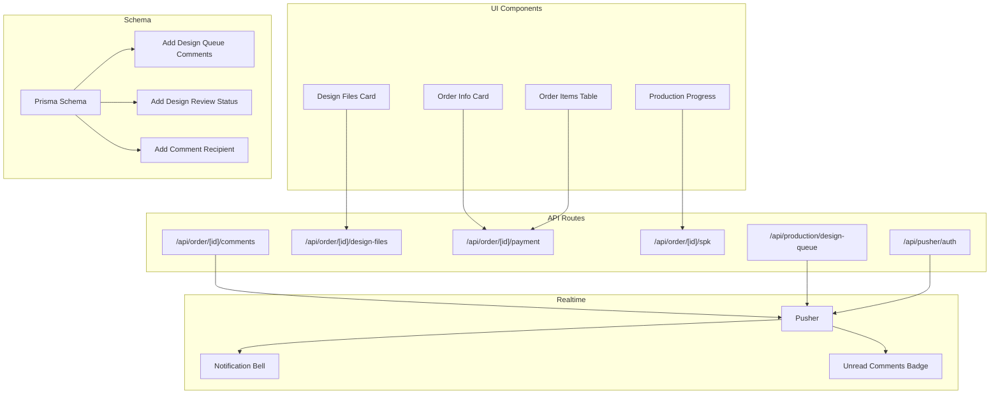
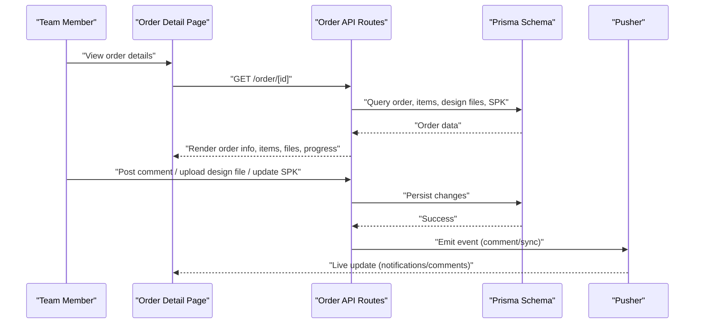
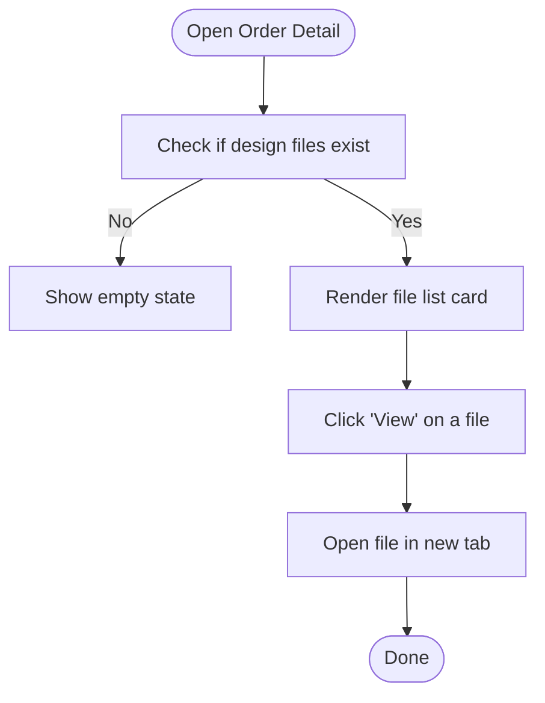
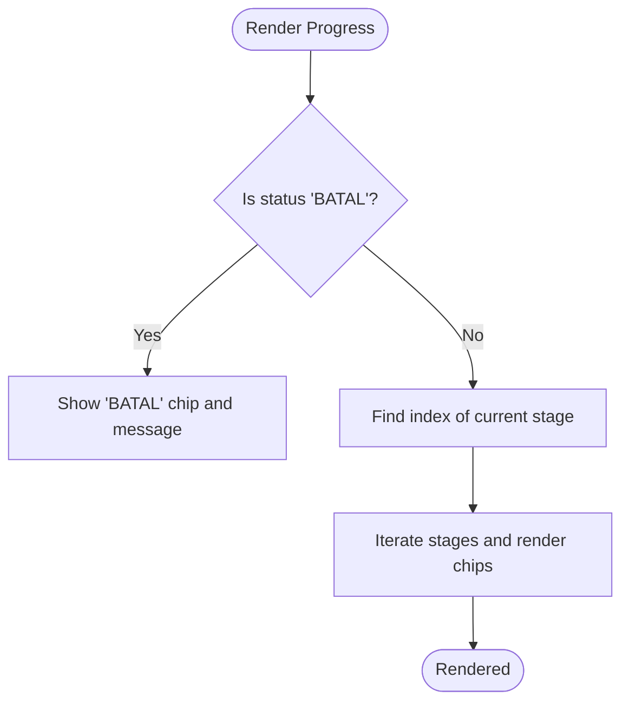
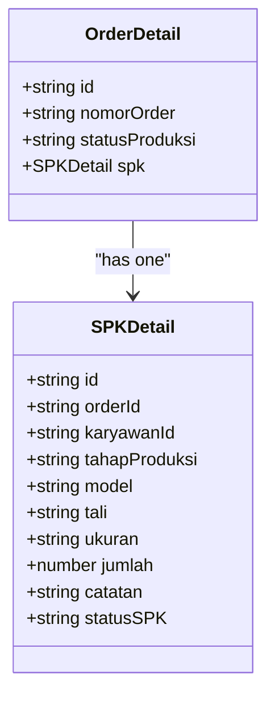
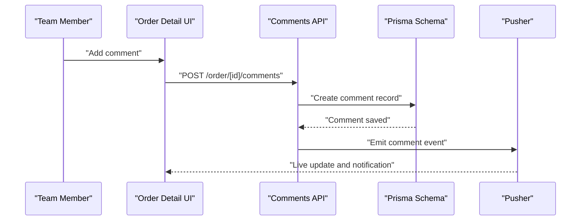
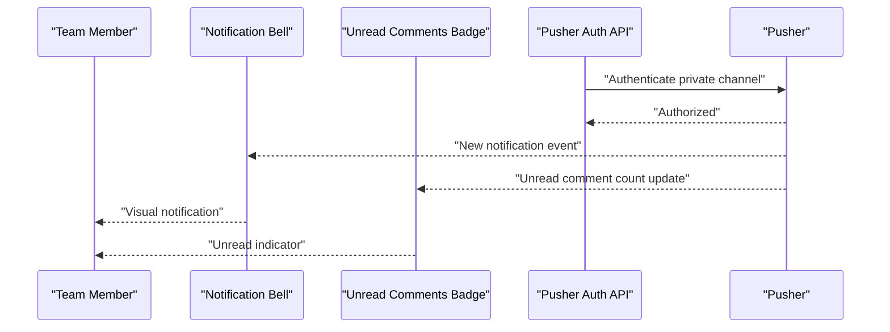
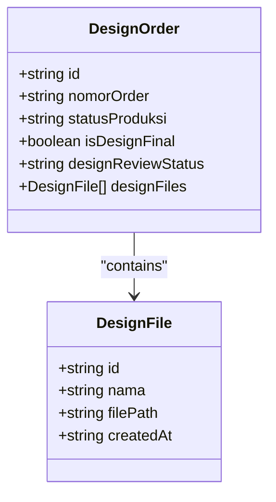
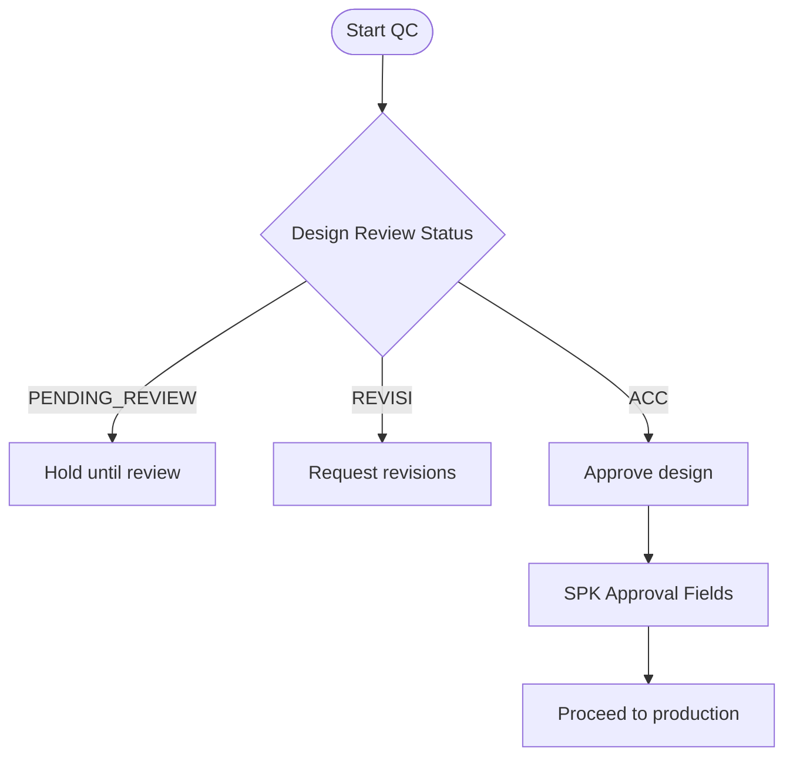
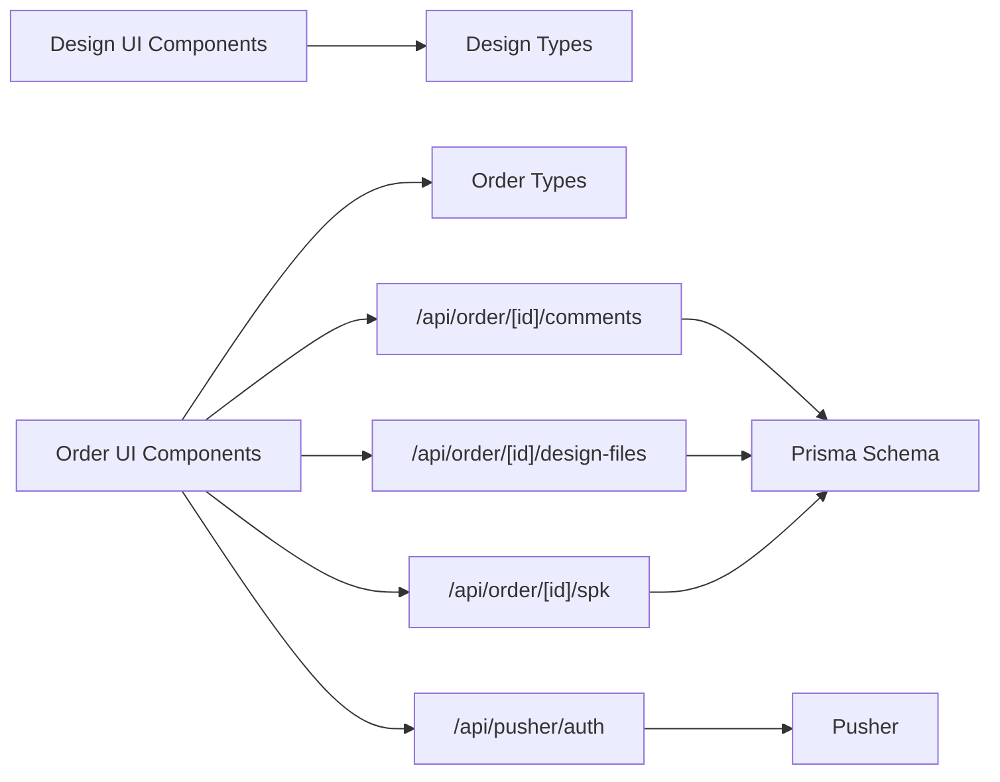

# Order Tracking & Team Collaboration

<cite>
**Referenced Files in This Document**
- [types.ts](file://src/app/(LoggedIn)/order/[id]/components/types.ts)
- [types.ts](file://src/app/(LoggedIn)/order/components/types.ts)
- [types.ts](file://src/app/(LoggedIn)/production/design-queue/components/types.ts)
- [design-files-card.tsx](file://src/app/(LoggedIn)/order/[id]/components/design-files-card.tsx)
- [order-info-card.tsx](file://src/app/(LoggedIn)/order/[id]/components/order-info-card.tsx)
- [order-items-table.tsx](file://src/app/(LoggedIn)/order/[id]/components/order-items-table.tsx)
- [produksi-progress.tsx](file://src/app/(LoggedIn)/order/[id]/components/produksi-progress.tsx)
- [route.ts](file://src/app/api/order/[id]/comments/route.ts)
- [route.ts](file://src/app/api/order/[id]/design-files/route.ts)
- [route.ts](file://src/app/api/order/[id]/payment/route.ts)
- [route.ts](file://src/app/api/order/[id]/spk/route.ts)
- [route.ts](file://src/app/api/production/design-queue/route.ts)
- [route.ts](file://src/app/api/pusher/auth/route.ts)
- [migration.sql](file://prisma/migrations/20260518134933_add_design_queue_comments/migration.sql)
- [migration.sql](file://prisma/migrations/20260528080542_add_design_review_status/migration.sql)
- [migration.sql](file://prisma/migrations/20260601160457_add_comment_recipient/migration.sql)
- [schema.prisma](file://prisma/schema.prisma)
- [order-badges.ts](file://src/app/(LoggedIn)/order/components/order-badges.ts)
- [notification-bell.tsx](file://src/components/notification-bell.tsx)
- [unread-comments-badge.tsx](file://src/components/unread-comments-badge.tsx)
- [use-notifications.ts](file://src/hooks/use-notifications.ts)
- [pusher.ts](file://src/lib/pusher.ts)
- [pusher-client.ts](file://src/lib/pusher-client.ts)
</cite>

## Table of Contents
1. [Introduction](#introduction)
2. [Project Structure](#project-structure)
3. [Core Components](#core-components)
4. [Architecture Overview](#architecture-overview)
5. [Detailed Component Analysis](#detailed-component-analysis)
6. [Dependency Analysis](#dependency-analysis)
7. [Performance Considerations](#performance-considerations)
8. [Troubleshooting Guide](#troubleshooting-guide)
9. [Conclusion](#conclusion)

## Introduction
This document explains the order tracking and team collaboration features implemented in the system. It covers:
- Design files management for order workflows
- Production progress tracking across stages
- Work order (SPK) integration within the order lifecycle
- Comment system for order collaboration
- File sharing between team members
- Real-time updates for order status
- Integration with production management and inventory updates during production
- Quality control checkpoints
- Collaborative workflows, notifications, and interdepartmental communication patterns

## Project Structure
The order tracking and collaboration features span UI components, API routes, database schema, and real-time messaging:
- UI components under order and production modules render order details, design files, production steps, and SPK cards
- API routes handle comments, design files, payments, and SPK creation/update
- Prisma schema defines data models and migrations supporting design queue comments, review status, and recipients
- Pusher integration enables real-time notifications and live updates

**Diagram sources**
- [order-info-card.tsx](file://src/app/(LoggedIn)/order/[id]/components/order-info-card.tsx#L1-L111)
- [order-items-table.tsx](file://src/app/(LoggedIn)/order/[id]/components/order-items-table.tsx#L1-L76)
- [design-files-card.tsx](file://src/app/(LoggedIn)/order/[id]/components/design-files-card.tsx#L1-L59)
- [produksi-progress.tsx](file://src/app/(LoggedIn)/order/[id]/components/produksi-progress.tsx#L1-L63)
- [route.ts](file://src/app/api/order/[id]/comments/route.ts)
- [route.ts](file://src/app/api/order/[id]/design-files/route.ts)
- [route.ts](file://src/app/api/order/[id]/payment/route.ts)
- [route.ts](file://src/app/api/order/[id]/spk/route.ts)
- [route.ts](file://src/app/api/production/design-queue/route.ts)
- [route.ts](file://src/app/api/pusher/auth/route.ts)
- [schema.prisma](file://prisma/schema.prisma)
- [migration.sql](file://prisma/migrations/20260518134933_add_design_queue_comments/migration.sql)
- [migration.sql](file://prisma/migrations/20260528080542_add_design_review_status/migration.sql)
- [migration.sql](file://prisma/migrations/20260601160457_add_comment_recipient/migration.sql)

**Section sources**
- [order-info-card.tsx](file://src/app/(LoggedIn)/order/[id]/components/order-info-card.tsx#L1-L111)
- [order-items-table.tsx](file://src/app/(LoggedIn)/order/[id]/components/order-items-table.tsx#L1-L76)
- [design-files-card.tsx](file://src/app/(LoggedIn)/order/[id]/components/design-files-card.tsx#L1-L59)
- [produksi-progress.tsx](file://src/app/(LoggedIn)/order/[id]/components/produksi-progress.tsx#L1-L63)
- [route.ts](file://src/app/api/order/[id]/comments/route.ts)
- [route.ts](file://src/app/api/order/[id]/design-files/route.ts)
- [route.ts](file://src/app/api/order/[id]/payment/route.ts)
- [route.ts](file://src/app/api/order/[id]/spk/route.ts)
- [route.ts](file://src/app/api/production/design-queue/route.ts)
- [route.ts](file://src/app/api/pusher/auth/route.ts)
- [schema.prisma](file://prisma/schema.prisma)
- [migration.sql](file://prisma/migrations/20260518134933_add_design_queue_comments/migration.sql)
- [migration.sql](file://prisma/migrations/20260528080542_add_design_review_status/migration.sql)
- [migration.sql](file://prisma/migrations/20260601160457_add_comment_recipient/migration.sql)

## Core Components
- Order detail types define order metadata, items, design files, payments, and SPK details
- Order list types define row-level attributes and status enumerations
- Design queue types define design order attributes, file references, and review status
- UI components render order info, items, design files, and production progress
- API routes manage comments, design files, payments, and SPK operations
- Real-time integration via Pusher for notifications and live updates

**Section sources**
- [types.ts](file://src/app/(LoggedIn)/order/[id]/components/types.ts#L1-L80)
- [types.ts](file://src/app/(LoggedIn)/order/components/types.ts#L1-L73)
- [types.ts](file://src/app/(LoggedIn)/production/design-queue/components/types.ts#L1-L25)
- [order-info-card.tsx](file://src/app/(LoggedIn)/order/[id]/components/order-info-card.tsx#L1-L111)
- [order-items-table.tsx](file://src/app/(LoggedIn)/order/[id]/components/order-items-table.tsx#L1-L76)
- [design-files-card.tsx](file://src/app/(LoggedIn)/order/[id]/components/design-files-card.tsx#L1-L59)
- [produksi-progress.tsx](file://src/app/(LoggedIn)/order/[id]/components/produksi-progress.tsx#L1-L63)
- [route.ts](file://src/app/api/order/[id]/comments/route.ts)
- [route.ts](file://src/app/api/order/[id]/design-files/route.ts)
- [route.ts](file://src/app/api/order/[id]/payment/route.ts)
- [route.ts](file://src/app/api/order/[id]/spk/route.ts)
- [route.ts](file://src/app/api/production/design-queue/route.ts)
- [route.ts](file://src/app/api/pusher/auth/route.ts)

## Architecture Overview
The order tracking and collaboration system integrates UI components, backend APIs, database models, and real-time messaging:

**Diagram sources**
- [order-info-card.tsx](file://src/app/(LoggedIn)/order/[id]/components/order-info-card.tsx#L1-L111)
- [order-items-table.tsx](file://src/app/(LoggedIn)/order/[id]/components/order-items-table.tsx#L1-L76)
- [design-files-card.tsx](file://src/app/(LoggedIn)/order/[id]/components/design-files-card.tsx#L1-L59)
- [produksi-progress.tsx](file://src/app/(LoggedIn)/order/[id]/components/produksi-progress.tsx#L1-L63)
- [route.ts](file://src/app/api/order/[id]/comments/route.ts)
- [route.ts](file://src/app/api/order/[id]/design-files/route.ts)
- [route.ts](file://src/app/api/order/[id]/spk/route.ts)
- [schema.prisma](file://prisma/schema.prisma)
- [pusher.ts](file://src/lib/pusher.ts)
- [pusher-client.ts](file://src/lib/pusher-client.ts)

## Detailed Component Analysis

### Design Files Management System
Design files are attached to orders and visible in the order detail view. Each file includes metadata such as name, path, uploader, and upload date. Users can preview and download files directly from the UI.

**Diagram sources**
- [design-files-card.tsx](file://src/app/(LoggedIn)/order/[id]/components/design-files-card.tsx#L1-L59)
- [types.ts](file://src/app/(LoggedIn)/order/[id]/components/types.ts#L62-L68)

**Section sources**
- [design-files-card.tsx](file://src/app/(LoggedIn)/order/[id]/components/design-files-card.tsx#L1-L59)
- [types.ts](file://src/app/(LoggedIn)/order/[id]/components/types.ts#L62-L68)

### Production Progress Tracking
Production progress is visualized as a linear stage tracker with distinct states: Pending, Design, Production, Packing, and Completed. The component highlights the current stage and past completed stages.

**Diagram sources**
- [produksi-progress.tsx](file://src/app/(LoggedIn)/order/[id]/components/produksi-progress.tsx#L1-L63)
- [order-badges.ts](file://src/app/(LoggedIn)/order/components/order-badges.ts)

**Section sources**
- [produksi-progress.tsx](file://src/app/(LoggedIn)/order/[id]/components/produksi-progress.tsx#L1-L63)
- [order-badges.ts](file://src/app/(LoggedIn)/order/components/order-badges.ts)

### Work Order (SPK) Integration
SPK details are associated with orders and include production stage, model, size, quantity, notes, and approval fields. The order detail page displays SPK information when available.

**Diagram sources**
- [types.ts](file://src/app/(LoggedIn)/order/[id]/components/types.ts#L1-L18)

**Section sources**
- [types.ts](file://src/app/(LoggedIn)/order/[id]/components/types.ts#L1-L18)

### Comment System for Order Collaboration
Comments enable team collaboration around specific orders. The system supports adding comments and notifying recipients. Migrations introduce design queue comments, review status, and recipient fields.

**Diagram sources**
- [route.ts](file://src/app/api/order/[id]/comments/route.ts)
- [migration.sql](file://prisma/migrations/20260518134933_add_design_queue_comments/migration.sql)
- [migration.sql](file://prisma/migrations/20260528080542_add_design_review_status/migration.sql)
- [migration.sql](file://prisma/migrations/20260601160457_add_comment_recipient/migration.sql)

**Section sources**
- [route.ts](file://src/app/api/order/[id]/comments/route.ts)
- [migration.sql](file://prisma/migrations/20260518134933_add_design_queue_comments/migration.sql)
- [migration.sql](file://prisma/migrations/20260528080542_add_design_review_status/migration.sql)
- [migration.sql](file://prisma/migrations/20260601160457_add_comment_recipient/migration.sql)

### File Sharing Between Team Members
Design files are shared via links rendered in the UI. Uploader identity and timestamps are shown alongside each file entry.

**Section sources**
- [design-files-card.tsx](file://src/app/(LoggedIn)/order/[id]/components/design-files-card.tsx#L1-L59)
- [types.ts](file://src/app/(LoggedIn)/order/[id]/components/types.ts#L62-L68)

### Real-Time Updates on Order Status
Real-time updates are powered by Pusher. The notification bell and unread comments badge reflect live events. Authentication for private channels is handled by the Pusher auth endpoint.

**Diagram sources**
- [notification-bell.tsx](file://src/components/notification-bell.tsx)
- [unread-comments-badge.tsx](file://src/components/unread-comments-badge.tsx)
- [route.ts](file://src/app/api/pusher/auth/route.ts)
- [pusher.ts](file://src/lib/pusher.ts)
- [pusher-client.ts](file://src/lib/pusher-client.ts)

**Section sources**
- [notification-bell.tsx](file://src/components/notification-bell.tsx)
- [unread-comments-badge.tsx](file://src/components/unread-comments-badge.tsx)
- [route.ts](file://src/app/api/pusher/auth/route.ts)
- [pusher.ts](file://src/lib/pusher.ts)
- [pusher-client.ts](file://src/lib/pusher-client.ts)

### Integration with Production Management
The design queue module manages design orders, deadlines, and review statuses. It surfaces design files and allows assigning designers and marking finalization.

**Diagram sources**
- [types.ts](file://src/app/(LoggedIn)/production/design-queue/components/types.ts#L9-L24)

**Section sources**
- [types.ts](file://src/app/(LoggedIn)/production/design-queue/components/types.ts#L1-L25)

### Inventory Updates During Production
Inventory movement is managed via dedicated inventory APIs for incoming stock and outgoing consumption. While not directly tied to order status, inventory operations occur concurrently with production stages.

**Section sources**
- [route.ts](file://src/app/api/inventory/in/[id]/route.ts)
- [route.ts](file://src/app/api/inventory/out/route.ts)

### Quality Control Checkpoints
Quality control is integrated into the production workflow through SPK approvals and design review statuses. The SPK model includes approval fields and status indicators, while design review status captures PENDING_REVIEW, REVISI, and ACC outcomes.

**Diagram sources**
- [types.ts](file://src/app/(LoggedIn)/production/design-queue/components/types.ts#L22-L22)
- [types.ts](file://src/app/(LoggedIn)/order/[id]/components/types.ts#L12-L15)

**Section sources**
- [types.ts](file://src/app/(LoggedIn)/production/design-queue/components/types.ts#L22-L22)
- [types.ts](file://src/app/(LoggedIn)/order/[id]/components/types.ts#L12-L15)

### Examples of Collaborative Workflows
- Design handoff: Designer uploads files; reviewer sets review status; upon approval, production stage begins
- Comment-driven coordination: Team members add comments for feedback; unread badges notify recipients; Pusher emits live updates
- SPK creation: Production team creates SPK with stage, model, size, and quantities; approvals recorded; progress updated

**Section sources**
- [design-files-card.tsx](file://src/app/(LoggedIn)/order/[id]/components/design-files-card.tsx#L1-L59)
- [route.ts](file://src/app/api/order/[id]/comments/route.ts)
- [route.ts](file://src/app/api/order/[id]/spk/route.ts)
- [produksi-progress.tsx](file://src/app/(LoggedIn)/order/[id]/components/produksi-progress.tsx#L1-L63)

### Notification Systems for Status Changes
Notifications surface via the notification bell and unread comments badge. Pusher events trigger UI updates to inform stakeholders of changes across design, production, and SPK stages.

**Section sources**
- [notification-bell.tsx](file://src/components/notification-bell.tsx)
- [unread-comments-badge.tsx](file://src/components/unread-comments-badge.tsx)
- [route.ts](file://src/app/api/pusher/auth/route.ts)

### Communication Patterns Across Departments
- Design department: uploads design files, manages review status, and finalizes designs
- Production department: creates and updates SPKs, tracks production progress, and handles approvals
- Warehouse/logistics: aligns with packing and delivery stages reflected in production progress
- Finance: monitors payments linked to order records

**Section sources**
- [order-info-card.tsx](file://src/app/(LoggedIn)/order/[id]/components/order-info-card.tsx#L1-L111)
- [order-items-table.tsx](file://src/app/(LoggedIn)/order/[id]/components/order-items-table.tsx#L1-L76)
- [produksi-progress.tsx](file://src/app/(LoggedIn)/order/[id]/components/produksi-progress.tsx#L1-L63)
- [route.ts](file://src/app/api/order/[id]/payment/route.ts)

## Dependency Analysis
The system exhibits clear separation of concerns:
- UI components depend on shared types and local state
- API routes encapsulate CRUD operations for comments, design files, payments, and SPKs
- Prisma schema and migrations define data contracts and evolve collaboratively
- Pusher provides real-time capabilities with explicit authentication

**Diagram sources**
- [order-info-card.tsx](file://src/app/(LoggedIn)/order/[id]/components/order-info-card.tsx#L1-L111)
- [order-items-table.tsx](file://src/app/(LoggedIn)/order/[id]/components/order-items-table.tsx#L1-L76)
- [design-files-card.tsx](file://src/app/(LoggedIn)/order/[id]/components/design-files-card.tsx#L1-L59)
- [produksi-progress.tsx](file://src/app/(LoggedIn)/order/[id]/components/produksi-progress.tsx#L1-L63)
- [route.ts](file://src/app/api/order/[id]/comments/route.ts)
- [route.ts](file://src/app/api/order/[id]/design-files/route.ts)
- [route.ts](file://src/app/api/order/[id]/spk/route.ts)
- [route.ts](file://src/app/api/pusher/auth/route.ts)
- [schema.prisma](file://prisma/schema.prisma)

**Section sources**
- [order-info-card.tsx](file://src/app/(LoggedIn)/order/[id]/components/order-info-card.tsx#L1-L111)
- [order-items-table.tsx](file://src/app/(LoggedIn)/order/[id]/components/order-items-table.tsx#L1-L76)
- [design-files-card.tsx](file://src/app/(LoggedIn)/order/[id]/components/design-files-card.tsx#L1-L59)
- [produksi-progress.tsx](file://src/app/(LoggedIn)/order/[id]/components/produksi-progress.tsx#L1-L63)
- [route.ts](file://src/app/api/order/[id]/comments/route.ts)
- [route.ts](file://src/app/api/order/[id]/design-files/route.ts)
- [route.ts](file://src/app/api/order/[id]/spk/route.ts)
- [route.ts](file://src/app/api/pusher/auth/route.ts)
- [schema.prisma](file://prisma/schema.prisma)

## Performance Considerations
- Minimize unnecessary re-renders by leveraging client-side state and memoization in UI components
- Batch API requests for comments and file operations to reduce network overhead
- Use pagination or virtualization for long lists of design files and order items
- Optimize Pusher subscriptions to avoid redundant listeners and excessive event handling

## Troubleshooting Guide
- Real-time updates not appearing:
  - Verify Pusher authentication endpoint is reachable
  - Confirm channel subscription and presence of event handlers
- Comments not visible:
  - Check comment creation API response and database persistence
  - Ensure unread badge and notification bell are wired to emitted events
- SPK updates not reflected:
  - Validate SPK creation/update API and associated status transitions
  - Confirm production progress component receives updated order data

**Section sources**
- [route.ts](file://src/app/api/pusher/auth/route.ts)
- [route.ts](file://src/app/api/order/[id]/comments/route.ts)
- [route.ts](file://src/app/api/order/[id]/spk/route.ts)
- [notification-bell.tsx](file://src/components/notification-bell.tsx)
- [unread-comments-badge.tsx](file://src/components/unread-comments-badge.tsx)

## Conclusion
The order tracking and team collaboration system integrates design file management, production progress visualization, SPK workflows, and real-time communication. By combining robust UI components, well-defined APIs, evolving schema migrations, and Pusher-powered real-time updates, the platform supports seamless cross-departmental collaboration from design through production and delivery.