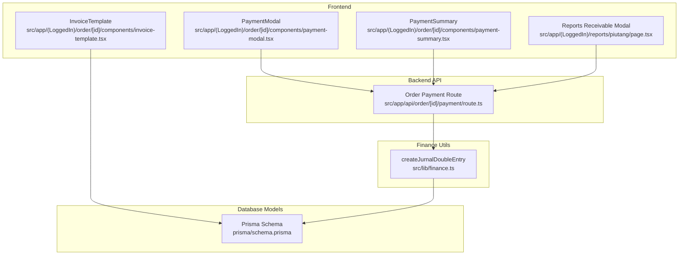
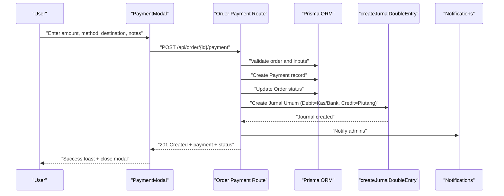
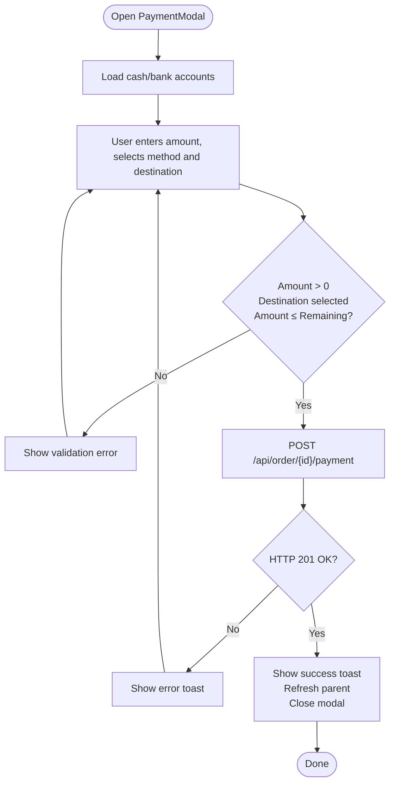
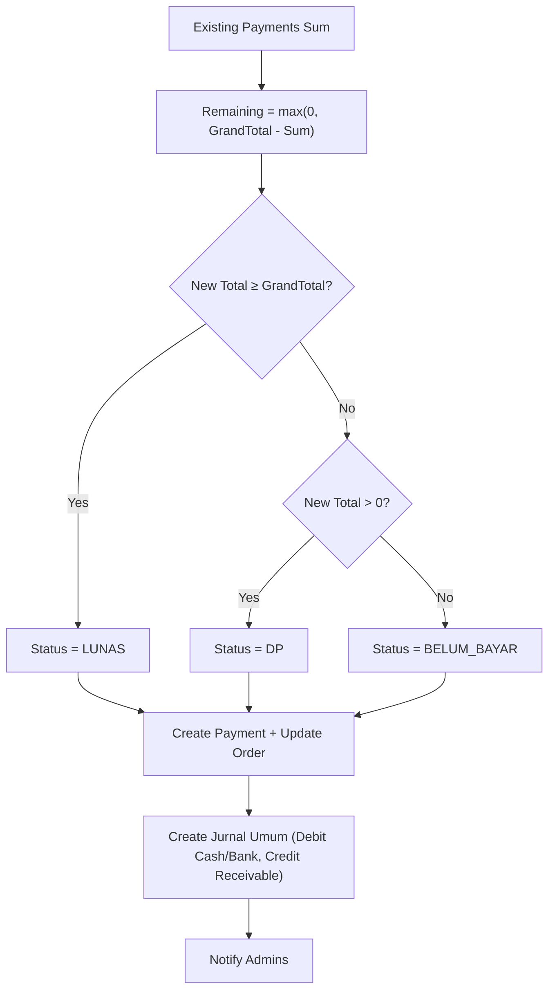
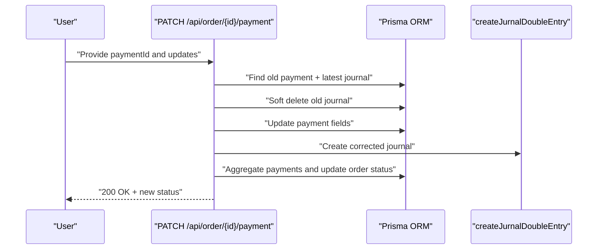
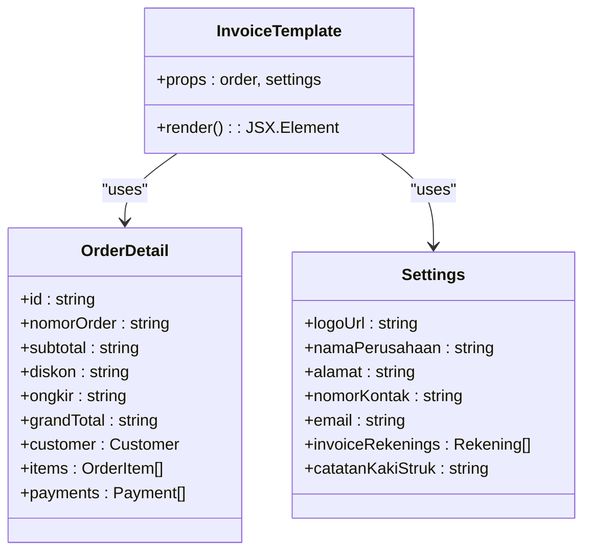
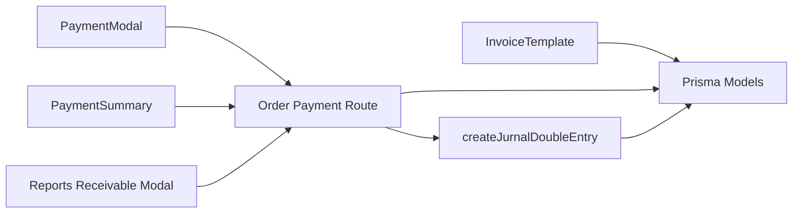

# Payment Processing & Invoice Management

<cite>
**Referenced Files in This Document**
- [payment-modal.tsx](file://src/app/(LoggedIn)/order/[id]/components/payment-modal.tsx)
- [payment-summary.tsx](file://src/app/(LoggedIn)/order/[id]/components/payment-summary.tsx)
- [invoice-template.tsx](file://src/app/(LoggedIn)/order/[id]/components/invoice-template.tsx)
- [route.ts](file://src/app/api/order/[id]/payment/route.ts)
- [finance.ts](file://src/lib/finance.ts)
- [types.ts](file://src/app/(LoggedIn)/order/[id]/components/types.ts)
- [types.ts](file://src/app/(LoggedIn)/order/components/types.ts)
- [schema.prisma](file://prisma/schema.prisma)
- [page.tsx](file://src/app/(LoggedIn)/reports/piutang/page.tsx)
</cite>

## Table of Contents
1. [Introduction](#introduction)
2. [Project Structure](#project-structure)
3. [Core Components](#core-components)
4. [Architecture Overview](#architecture-overview)
5. [Detailed Component Analysis](#detailed-component-analysis)
6. [Dependency Analysis](#dependency-analysis)
7. [Performance Considerations](#performance-considerations)
8. [Troubleshooting Guide](#troubleshooting-guide)
9. [Conclusion](#conclusion)
10. [Appendices](#appendices)

## Introduction
This document explains the payment processing and invoice management system, focusing on:
- Payment modal interface and payment method options
- Amount calculation and payment recording
- Invoice template rendering and printing
- Partial payments, payment corrections, and deletion
- Financial accounting integration via double-entry journal entries
- Examples of payment scenarios, error handling, and extensibility for external payment processors

## Project Structure
The payment and invoicing features span UI components, API routes, and database models:
- Frontend UI: Payment modal, payment summary, and invoice template
- Backend API: Payment creation, correction, deletion, and notifications
- Finance utilities: Double-entry journal creation
- Database models: Orders, Payments, Journal, Accounts, Cash/Bank

**Diagram sources**
- [payment-modal.tsx](file://src/app/(LoggedIn)/order/[id]/components/payment-modal.tsx#L1-L167)
- [payment-summary.tsx](file://src/app/(LoggedIn)/order/[id]/components/payment-summary.tsx#L1-L161)
- [invoice-template.tsx](file://src/app/(LoggedIn)/order/[id]/components/invoice-template.tsx#L1-L191)
- [page.tsx](file://src/app/(LoggedIn)/reports/piutang/page.tsx#L93-L328)
- [route.ts:1-338](file://src/app/api/order/[id]/payment/route.ts#L1-L338)
- [finance.ts:1-55](file://src/lib/finance.ts#L1-L55)
- [schema.prisma:1-200](file://prisma/schema.prisma#L1-L200)

**Section sources**
- [payment-modal.tsx](file://src/app/(LoggedIn)/order/[id]/components/payment-modal.tsx#L1-L167)
- [payment-summary.tsx](file://src/app/(LoggedIn)/order/[id]/components/payment-summary.tsx#L1-L161)
- [invoice-template.tsx](file://src/app/(LoggedIn)/order/[id]/components/invoice-template.tsx#L1-L191)
- [route.ts:1-338](file://src/app/api/order/[id]/payment/route.ts#L1-L338)
- [finance.ts:1-55](file://src/lib/finance.ts#L1-L55)
- [schema.prisma:1-200](file://prisma/schema.prisma#L1-L200)

## Core Components
- Payment Modal: Captures payment amount, method, destination account, optional notes, and date; validates inputs and posts to the backend.
- Payment Summary: Displays order totals, paid vs remaining amounts, and payment history; opens the payment modal for partial payments.
- Invoice Template: Renders printable invoices with company info, customer details, items, totals, payment summary, and bank account details.
- Payment API: Handles creation, correction, and deletion of payments; updates order status; creates financial journal entries; notifies admins.
- Finance Utility: Creates double-entry journal records for cash/bank debits and receivables credits.
- Types: Defines payment method mapping and shared order/payment types.

**Section sources**
- [payment-modal.tsx](file://src/app/(LoggedIn)/order/[id]/components/payment-modal.tsx#L1-L167)
- [payment-summary.tsx](file://src/app/(LoggedIn)/order/[id]/components/payment-summary.tsx#L1-L161)
- [invoice-template.tsx](file://src/app/(LoggedIn)/order/[id]/components/invoice-template.tsx#L1-L191)
- [route.ts:1-338](file://src/app/api/order/[id]/payment/route.ts#L1-L338)
- [finance.ts:1-55](file://src/lib/finance.ts#L1-L55)
- [types.ts](file://src/app/(LoggedIn)/order/[id]/components/types.ts#L70-L80)
- [types.ts](file://src/app/(LoggedIn)/order/components/types.ts#L30-L73)

## Architecture Overview
End-to-end flow for payment recording and financial reconciliation:

**Diagram sources**
- [payment-modal.tsx](file://src/app/(LoggedIn)/order/[id]/components/payment-modal.tsx#L48-L89)
- [route.ts:47-173](file://src/app/api/order/[id]/payment/route.ts#L47-L173)
- [finance.ts:26-54](file://src/lib/finance.ts#L26-L54)

## Detailed Component Analysis

### Payment Modal Interface and Options
- Inputs:
  - Nominal: validated against remaining balance and must be greater than zero
  - Method: selectable from supported methods
  - Destination: cash/bank account selection
  - Notes: optional
  - Date: optional, defaults to current date
- Validation:
  - Rejects zero/negative amounts
  - Ensures destination account is selected
  - Prevents overpayment beyond remaining balance
- Submission:
  - Sends JSON payload to backend
  - Handles network errors and server-side errors
  - On success, shows success toast, refreshes parent, and closes modal

**Diagram sources**
- [payment-modal.tsx](file://src/app/(LoggedIn)/order/[id]/components/payment-modal.tsx#L30-L89)
- [route.ts:68-104](file://src/app/api/order/[id]/payment/route.ts#L68-L104)

**Section sources**
- [payment-modal.tsx](file://src/app/(LoggedIn)/order/[id]/components/payment-modal.tsx#L1-L167)
- [route.ts:68-104](file://src/app/api/order/[id]/payment/route.ts#L68-L104)

### Amount Calculation and Payment Recording
- Calculation:
  - Sums existing payments for the order
  - Computes remaining balance as max(0, grandTotal - paid)
  - Determines order payment status: “BELUM_BAYAR” | “DP” | “LUNAS”
- Recording:
  - Creates a Payment record with amount, method, notes, and date
  - Updates Order status accordingly
  - Generates a double-entry journal:
    - Debit: Cash/Bank account
    - Credit: Accounts Receivable (Piutang Usaha)
  - Notifies admins on successful payment

**Diagram sources**
- [route.ts:88-132](file://src/app/api/order/[id]/payment/route.ts#L88-L132)
- [route.ts:136-148](file://src/app/api/order/[id]/payment/route.ts#L136-L148)

**Section sources**
- [route.ts:88-148](file://src/app/api/order/[id]/payment/route.ts#L88-L148)

### Payment Modification (Correction)
- Endpoint: PATCH /api/order/{id}/payment?paymentId={id}
- Behavior:
  - Validates existence and ownership of the payment
  - Soft-deletes previous journal entry
  - Updates payment fields (amount, method, notes, date)
  - Creates a corrected journal entry
  - Recalculates order status based on updated payments
- Access control: Requires authenticated user with role “admin” or “kasir”

**Diagram sources**
- [route.ts:176-271](file://src/app/api/order/[id]/payment/route.ts#L176-L271)
- [finance.ts:26-54](file://src/lib/finance.ts#L26-L54)

**Section sources**
- [route.ts:176-271](file://src/app/api/order/[id]/payment/route.ts#L176-L271)

### Payment Deletion
- Endpoint: DELETE /api/order/{id}/payment?paymentId={id}
- Behavior:
  - Only allowed for “admin”
  - Soft-deletes the journal entry and payment
  - Recalculates order status
- Access control: Role “admin” only

**Section sources**
- [route.ts:273-337](file://src/app/api/order/[id]/payment/route.ts#L273-L337)

### Invoice Template System
- Rendering:
  - Company header with logo/contact info
  - Customer billing address
  - Line items table (product, quantity, price, subtotal)
  - Totals: subtotal, discount, shipping, grand total
  - Payment summary: total paid and remaining balance
  - Bank account details for invoices
  - Print-only watermark
- Printing:
  - Uses a hidden DOM element rendered by the template
  - Designed for A4 paper dimensions suitable for printing

**Diagram sources**
- [invoice-template.tsx](file://src/app/(LoggedIn)/order/[id]/components/invoice-template.tsx#L8-L191)
- [types.ts](file://src/app/(LoggedIn)/order/[id]/components/types.ts#L22-L50)

**Section sources**
- [invoice-template.tsx](file://src/app/(LoggedIn)/order/[id]/components/invoice-template.tsx#L1-L191)
- [types.ts](file://src/app/(LoggedIn)/order/[id]/components/types.ts#L22-L50)

### Reports Receivable Payment Entry (Bulk/Collection)
- Purpose: Allows adding payments for overdue or receivable orders from the receivables report screen
- Features:
  - Pre-filled order/customer info
  - Amount validation against remaining balance
  - Optional date picker for payment date
  - Method selection and destination account
  - Notes field
- Behavior mirrors the order detail payment modal with additional date control

**Section sources**
- [page.tsx](file://src/app/(LoggedIn)/reports/piutang/page.tsx#L93-L328)

## Dependency Analysis
- UI depends on:
  - SWR for fetching cash/bank accounts
  - FormattedNumberInput for numeric input
  - Toast notifications for feedback
- API depends on:
  - Prisma ORM for data persistence
  - Finance utility for double-entry journals
  - Notification service for admin alerts
- Database models:
  - Order, Payment, JurnalUmum, Akun, KasBank

**Diagram sources**
- [payment-modal.tsx](file://src/app/(LoggedIn)/order/[id]/components/payment-modal.tsx#L4-L46)
- [payment-summary.tsx](file://src/app/(LoggedIn)/order/[id]/components/payment-summary.tsx#L31-L32)
- [invoice-template.tsx](file://src/app/(LoggedIn)/order/[id]/components/invoice-template.tsx#L1-L191)
- [route.ts:1-338](file://src/app/api/order/[id]/payment/route.ts#L1-L338)
- [finance.ts:1-55](file://src/lib/finance.ts#L1-L55)
- [schema.prisma:1-200](file://prisma/schema.prisma#L1-L200)
- [page.tsx](file://src/app/(LoggedIn)/reports/piutang/page.tsx#L93-L328)

**Section sources**
- [schema.prisma:1-200](file://prisma/schema.prisma#L1-L200)
- [route.ts:1-338](file://src/app/api/order/[id]/payment/route.ts#L1-L338)

## Performance Considerations
- Transactional writes: Payment creation and order status update occur in a single transaction to maintain consistency.
- Aggregation queries: Recalculation of order status uses aggregated sums to avoid loading all payment rows.
- Journal creation: Double-entry journal creation is centralized to reduce duplication and ensure consistency.
- UI responsiveness: SWR caching for cash/bank accounts reduces repeated network requests.

[No sources needed since this section provides general guidance]

## Troubleshooting Guide
Common issues and resolutions:
- Overpayment error: Server rejects if amount exceeds remaining balance; adjust amount to remaining or less.
- Missing destination account: Ensure a valid cash/bank account is selected; otherwise, reject with validation error.
- Network failures: UI shows connection error toast; retry after connectivity is restored.
- Payment not found or deleted: Correction/delete endpoints return not-found if payment is missing or soft-deleted.
- Role restrictions: Payment deletion requires admin role; otherwise, forbidden response.

**Section sources**
- [route.ts:74-104](file://src/app/api/order/[id]/payment/route.ts#L74-L104)
- [route.ts:197-199](file://src/app/api/order/[id]/payment/route.ts#L197-L199)
- [route.ts:279-280](file://src/app/api/order/[id]/payment/route.ts#L279-L280)
- [payment-modal.tsx](file://src/app/(LoggedIn)/order/[id]/components/payment-modal.tsx#L48-L89)

## Conclusion
The system provides a robust, auditable payment workflow with:
- Intuitive UI for capturing payments and generating invoices
- Strict validation and transactional integrity
- Automated financial journal entries aligned with accounting standards
- Support for partial payments, corrections, and deletions under role-based controls
- Extensible foundation for integrating external payment processors (e.g., via webhooks and additional payment methods)

[No sources needed since this section summarizes without analyzing specific files]

## Appendices

### Payment Scenarios
- Partial payment: Enter amount ≤ remaining; status becomes “DP”; journal recorded.
- Full payment: Amount equals remaining; status becomes “LUNAS”; journal recorded.
- Correction: Adjust amount/method/date; old journal soft-deleted, new journal created; status recalculated.
- Deletion (admin): Removes payment and journal; status recalculated.

**Section sources**
- [route.ts:106-148](file://src/app/api/order/[id]/payment/route.ts#L106-L148)
- [route.ts:176-271](file://src/app/api/order/[id]/payment/route.ts#L176-L271)
- [route.ts:273-337](file://src/app/api/order/[id]/payment/route.ts#L273-L337)

### Payment Methods and Mapping
- Supported methods: TUNAI, TRANSFER, QRIS, KREDIT
- UI mapping: Converts internal keys to display labels

**Section sources**
- [payment-modal.tsx](file://src/app/(LoggedIn)/order/[id]/components/payment-modal.tsx#L19-L19)
- [types.ts](file://src/app/(LoggedIn)/order/[id]/components/types.ts#L70-L79)

### Financial Accounting Integration
- Journal entries:
  - Debit: Cash/Bank (from selected destination)
  - Credit: Accounts Receivable (Piutang Usaha)
- Reference and description include order number and notes
- Journal linkage to payment enables auditability

**Section sources**
- [route.ts:136-148](file://src/app/api/order/[id]/payment/route.ts#L136-L148)
- [finance.ts:26-54](file://src/lib/finance.ts#L26-L54)