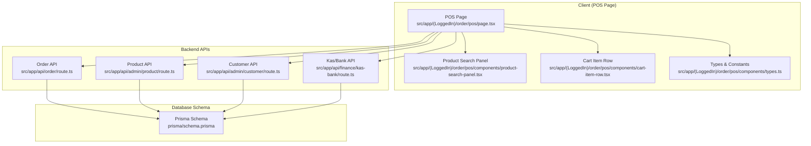
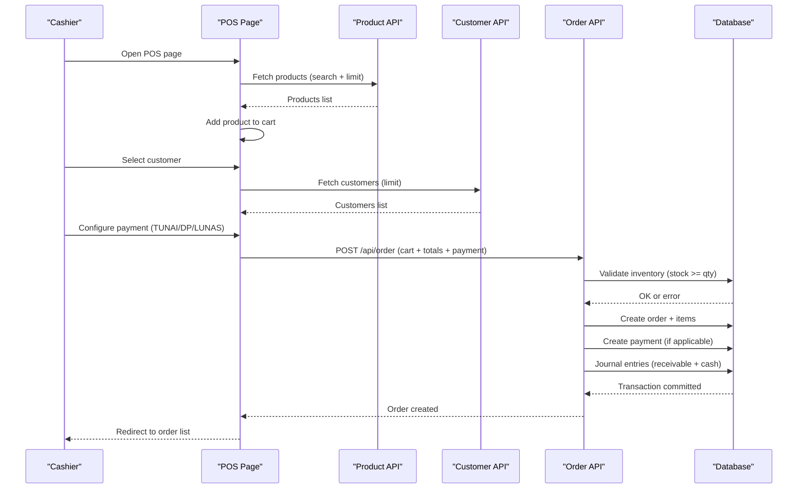
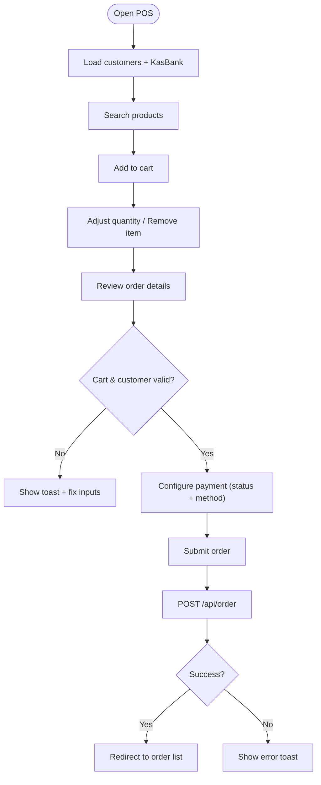
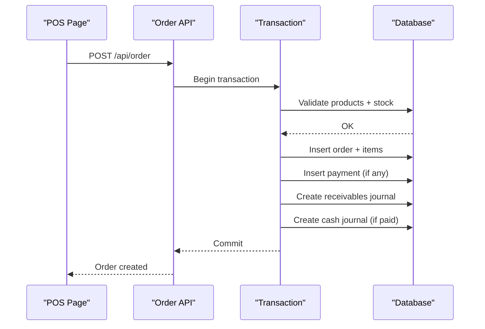
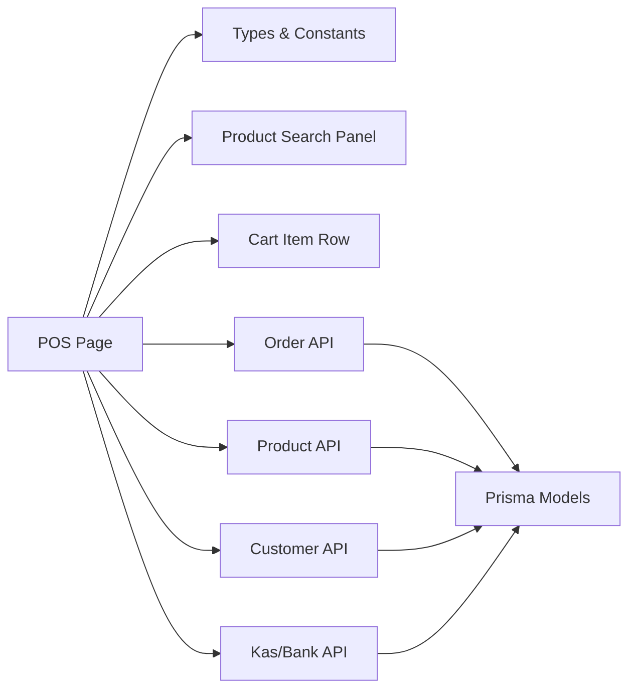

# Point of Sale (POS) Interface

<cite>
**Referenced Files in This Document**
- [page.tsx](file://src/app/(LoggedIn)/order/pos/page.tsx)
- [layout.tsx](file://src/app/(LoggedIn)/order/pos/layout.tsx)
- [product-search-panel.tsx](file://src/app/(LoggedIn)/order/pos/components/product-search-panel.tsx)
- [cart-item-row.tsx](file://src/app/(LoggedIn)/order/pos/components/cart-item-row.tsx)
- [types.ts](file://src/app/(LoggedIn)/order/pos/components/types.ts)
- [route.ts](file://src/app/api/order/route.ts)
- [route.ts](file://src/app/api/admin/product/route.ts)
- [route.ts](file://src/app/api/admin/customer/route.ts)
- [route.ts](file://src/app/api/finance/kas-bank/route.ts)
- [schema.prisma](file://prisma/schema.prisma)
- [use-hotkeys.ts](file://src/hooks/use-hotkeys.ts)
- [login-client.tsx](file://src/app/auth/login/login-client.tsx)
</cite>

## Table of Contents
1. [Introduction](#introduction)
2. [Project Structure](#project-structure)
3. [Core Components](#core-components)
4. [Architecture Overview](#architecture-overview)
5. [Detailed Component Analysis](#detailed-component-analysis)
6. [Dependency Analysis](#dependency-analysis)
7. [Performance Considerations](#performance-considerations)
8. [Troubleshooting Guide](#troubleshooting-guide)
9. [Conclusion](#conclusion)
10. [Appendices](#appendices)

## Introduction
This document describes the Point of Sale (POS) interface system for real-time cash transactions. It covers product search and selection, cart management, price calculation, discount application, payment processing, and transaction completion for walk-in customers. It also explains integration with the main order management system, real-time inventory checks during sales, financial journal entries, and POS-specific reporting considerations. Typical POS operations, keyboard shortcuts, and troubleshooting steps are included to help cashiers operate efficiently.

## Project Structure
The POS interface is implemented as a Next.js client-side page with reusable UI components and integrates with backend APIs for product lookup, customer selection, and order creation. The backend enforces inventory validation and records financial journals automatically upon order creation.

**Diagram sources**
- [page.tsx](file://src/app/(LoggedIn)/order/pos/page.tsx#L54-L602)
- [product-search-panel.tsx](file://src/app/(LoggedIn)/order/pos/components/product-search-panel.tsx#L15-L105)
- [cart-item-row.tsx](file://src/app/(LoggedIn)/order/pos/components/cart-item-row.tsx#L14-L83)
- [types.ts](file://src/app/(LoggedIn)/order/pos/components/types.ts#L1-L53)
- [route.ts:142-442](file://src/app/api/order/route.ts#L142-L442)
- [route.ts:8-116](file://src/app/api/admin/product/route.ts#L8-L116)
- [route.ts:8-84](file://src/app/api/admin/customer/route.ts#L8-L84)
- [route.ts:16-81](file://src/app/api/finance/kas-bank/route.ts#L16-L81)
- [schema.prisma:260-419](file://prisma/schema.prisma#L260-L419)

**Section sources**
- [page.tsx](file://src/app/(LoggedIn)/order/pos/page.tsx#L54-L602)
- [layout.tsx](file://src/app/(LoggedIn)/order/pos/layout.tsx#L1-L11)

## Core Components
- POS Page: Orchestrates cart state, totals computation, customer selection, order submission, and payment configuration.
- Product Search Panel: Debounced search, product listing, and add-to-cart action.
- Cart Item Row: Adjust quantities, remove items, and display item totals.
- Types & Constants: Defines cart item shape, order channels, payment statuses, and payment methods.
- Backend APIs: Product listing, customer listing, order creation with inventory validation and financial journals, and Kas/Bank retrieval.

Key responsibilities:
- Real-time product search with debouncing and pagination-friendly results.
- Cart manipulation with immediate quantity adjustments and item removal.
- Price calculation with discount and shipping fee support.
- Payment configuration for cash transactions (TUNAI) and partial payments (DP).
- Inventory validation against product stock prior to order creation.
- Automatic financial journal entries for receivables and cash receipts.

**Section sources**
- [page.tsx](file://src/app/(LoggedIn)/order/pos/page.tsx#L58-L136)
- [product-search-panel.tsx](file://src/app/(LoggedIn)/order/pos/components/product-search-panel.tsx#L15-L105)
- [cart-item-row.tsx](file://src/app/(LoggedIn)/order/pos/components/cart-item-row.tsx#L14-L83)
- [types.ts](file://src/app/(LoggedIn)/order/pos/components/types.ts#L1-L53)

## Architecture Overview
The POS workflow connects the UI to backend services and database through a transactional process that validates inventory and records financial entries.

**Diagram sources**
- [page.tsx](file://src/app/(LoggedIn)/order/pos/page.tsx#L89-L93)
- [route.ts:8-116](file://src/app/api/admin/product/route.ts#L8-L116)
- [route.ts:8-84](file://src/app/api/admin/customer/route.ts#L8-L84)
- [route.ts:142-442](file://src/app/api/order/route.ts#L142-L442)
- [schema.prisma:260-419](file://prisma/schema.prisma#L260-L419)

## Detailed Component Analysis

### POS Page (Real-Time Cash Transactions)
Responsibilities:
- Manage cart state and compute subtotal/grand total.
- Collect customer, channel, deadline, notes, discount, and shipping fee.
- Configure payment status (BELUM_BAYAR, DP, LUNAS) and method (TUNAI, TRANSFER, QRIS, KREDIT, LAINNYA).
- Validate cart and customer selection before submission.
- Submit order to backend and redirect on success.

Processing logic highlights:
- Cart helpers: add, update quantity, remove item.
- Totals: subtotal = sum of item prices × quantities; grand total = subtotal − discount + shipping.
- Validation: cart not empty, customer selected, DP nominal ≤ grand total, required fields present.
- Submission payload includes items with computed subtotals, payment details, and optional shipping/delivery fields.

**Diagram sources**
- [page.tsx](file://src/app/(LoggedIn)/order/pos/page.tsx#L58-L232)

**Section sources**
- [page.tsx](file://src/app/(LoggedIn)/order/pos/page.tsx#L58-L232)
- [types.ts](file://src/app/(LoggedIn)/order/pos/components/types.ts#L18-L52)

### Product Search Panel
Features:
- Debounced search input to reduce API calls.
- Displays product image, name, SKU, category, selling price, and stock level.
- Click-to-add-to-cart behavior.

Implementation notes:
- Uses SWR with keepPreviousData for smooth UX.
- Limits results to avoid heavy lists.
- Clearable input for quick resets.

**Section sources**
- [product-search-panel.tsx](file://src/app/(LoggedIn)/order/pos/components/product-search-panel.tsx#L15-L105)

### Cart Item Row
Features:
- Increment/decrement quantity with buttons and numeric input.
- Remove item from cart.
- Real-time item subtotal display.

**Section sources**
- [cart-item-row.tsx](file://src/app/(LoggedIn)/order/pos/components/cart-item-row.tsx#L14-L83)

### Types & Constants
Defines:
- CartItem shape for cart state.
- OrderChannel enumeration for sale channels.
- StatusPembayaran and MetodePembayaran enumerations.
- UI-friendly arrays for selects.

**Section sources**
- [types.ts](file://src/app/(LoggedIn)/order/pos/components/types.ts#L1-L53)

### Backend Integration: Order Creation
End-to-end flow:
- Authentication and role checks.
- Validate required fields and payment details.
- Verify product existence and sufficient stock.
- Generate order number using app settings.
- Create order and items in a transaction.
- Record receivables journal (Piutang Usaha vs Pendapatan).
- If payment made (DP/LUNAS), record payment and cash receipt journal.
- Broadcast notifications to relevant roles.

**Diagram sources**
- [route.ts:142-442](file://src/app/api/order/route.ts#L142-L442)
- [schema.prisma:260-419](file://prisma/schema.prisma#L260-L419)

**Section sources**
- [route.ts:142-442](file://src/app/api/order/route.ts#L142-L442)

### Backend Integration: Product and Customer APIs
- Product API: Lists products with search, category/unit filters, and computed sales metrics.
- Customer API: Lists customers with order history and spending metrics.

These APIs power the POS search and customer selection experiences.

**Section sources**
- [route.ts:8-116](file://src/app/api/admin/product/route.ts#L8-L116)
- [route.ts:8-84](file://src/app/api/admin/customer/route.ts#L8-L84)

### Backend Integration: Kas/Bank API
- Retrieves active Kas/Bank accounts with balances derived from journal entries.
- Used to populate payment destination dropdown in POS.

**Section sources**
- [route.ts:16-81](file://src/app/api/finance/kas-bank/route.ts#L16-L81)

## Dependency Analysis
High-level dependencies:
- POS Page depends on Product Search Panel and Cart Item Row for UI interactions.
- POS Page calls Product API, Customer API, and Order API for data and mutations.
- Order API depends on Prisma models for order, items, payments, and journals.
- Financial journals depend on chart-of-account mappings and app settings.

**Diagram sources**
- [page.tsx](file://src/app/(LoggedIn)/order/pos/page.tsx#L54-L602)
- [route.ts:142-442](file://src/app/api/order/route.ts#L142-L442)
- [route.ts:8-116](file://src/app/api/admin/product/route.ts#L8-L116)
- [route.ts:8-84](file://src/app/api/admin/customer/route.ts#L8-L84)
- [route.ts:16-81](file://src/app/api/finance/kas-bank/route.ts#L16-L81)
- [schema.prisma:260-419](file://prisma/schema.prisma#L260-L419)

**Section sources**
- [page.tsx](file://src/app/(LoggedIn)/order/pos/page.tsx#L54-L602)
- [route.ts:142-442](file://src/app/api/order/route.ts#L142-L442)

## Performance Considerations
- Debounced product search reduces network load and improves responsiveness.
- Keep previous data caching minimizes flicker during rapid typing.
- Limit search result sizes to maintain UI performance.
- Computation of totals occurs client-side; keep cart sizes reasonable for smooth updates.
- Transactional backend ensures atomicity and avoids inconsistent inventory states.

## Troubleshooting Guide
Common issues and resolutions:
- Empty cart submission: Ensure at least one item is added before saving.
- Missing customer: Select a customer from the autocomplete or add a new one inline.
- DP amount exceeds grand total: Adjust DP to be less than or equal to the total.
- Insufficient stock: Remove or reduce quantity for items that exceed available stock.
- Network errors: Retry submission; check connectivity and backend health.
- Unauthorized/Forbidden: Confirm cashier role and session validity.

Operational tips:
- Use the inline customer creation to quickly add walk-in customers.
- Use quantity controls to adjust items without re-searching.
- Enable notifications for new orders to coordinate with production and warehouse.

**Section sources**
- [page.tsx](file://src/app/(LoggedIn)/order/pos/page.tsx#L139-L232)
- [route.ts:231-248](file://src/app/api/order/route.ts#L231-L248)

## Conclusion
The POS interface provides a streamlined, real-time cash transaction experience with robust validation and financial integration. It supports walk-in customers, instant product search, flexible cart management, and automatic inventory and journal updates. The modular component design and backend transaction guarantees ensure reliability and scalability for daily operations.

## Appendices

### POS Workflow Summary
- Walk-in customer: Select or add a new customer.
- Product search: Type to search by name/SKU; click to add.
- Cart management: Adjust quantities or remove items.
- Pricing: Enter discount and shipping; review totals.
- Payment: Choose status (BELUM_BAYAR/DP/LUNAS) and method (TUNAI); optionally select Kas/Bank.
- Submit: Validate and save order; on success, redirect to order list.

### Keyboard Shortcuts
- Global hotkey hook available for advanced shortcuts; configure combinations for productivity.

**Section sources**
- [use-hotkeys.ts:1-26](file://src/hooks/use-hotkeys.ts#L1-L26)
- [login-client.tsx:65-84](file://src/app/auth/login/login-client.tsx#L65-L84)