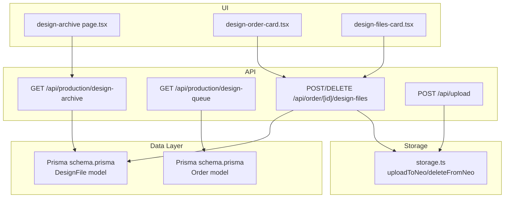
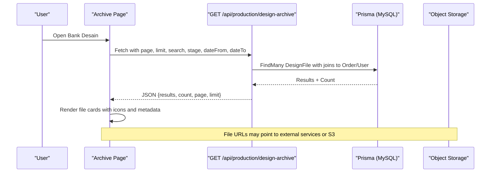
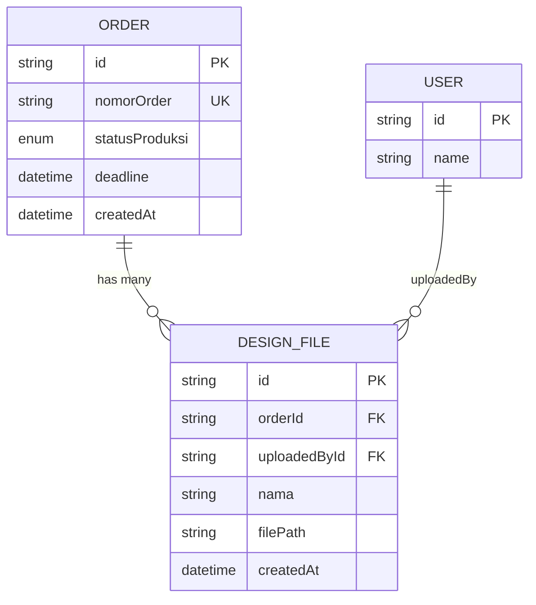
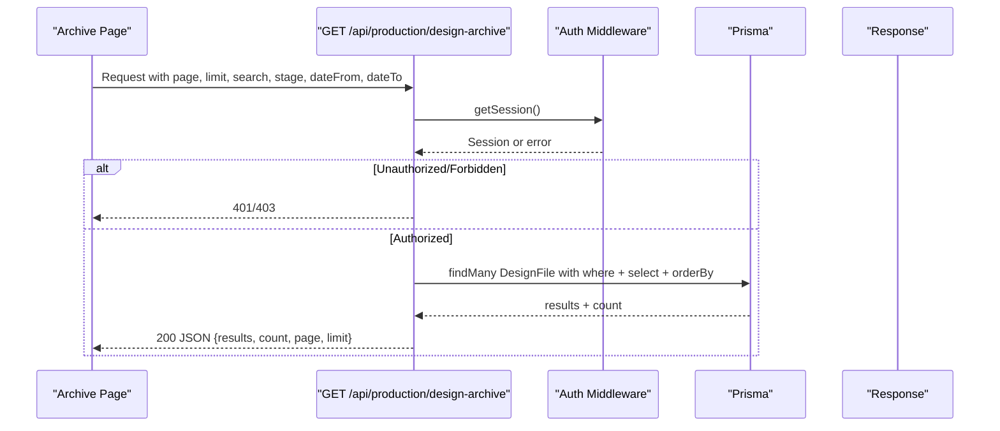
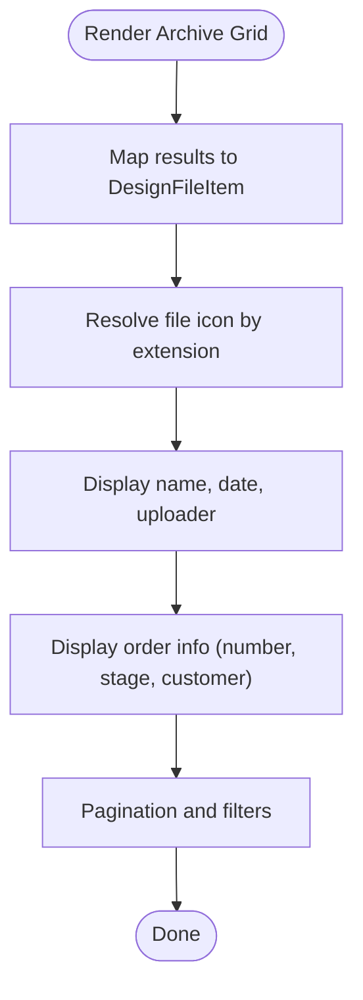
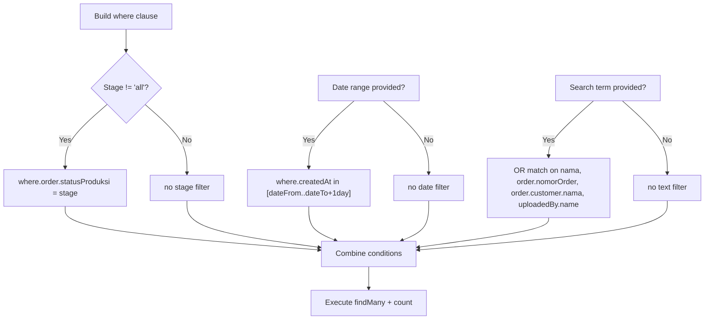
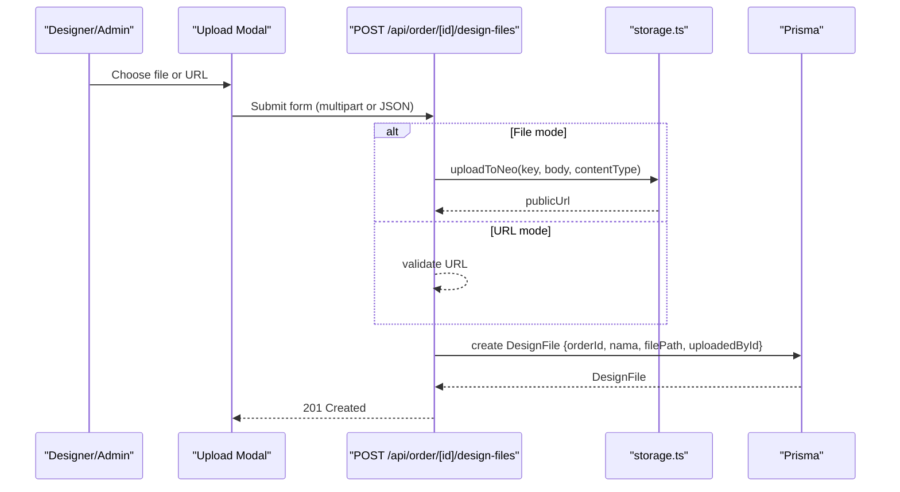
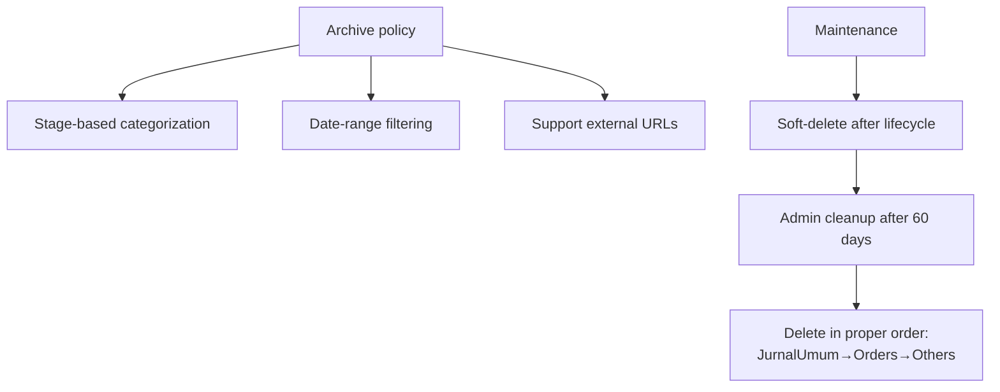
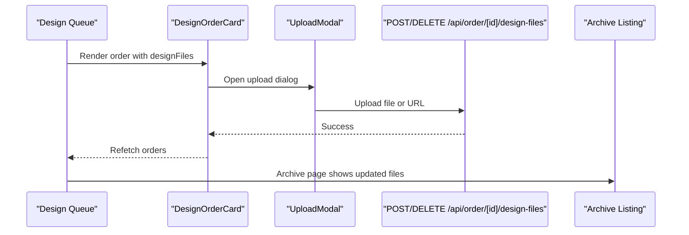
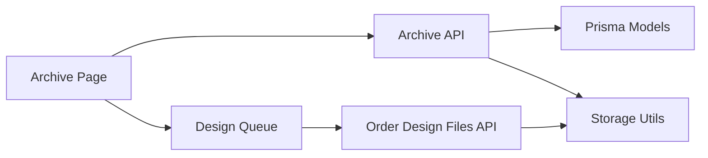

# Design Archive Management

<cite>
**Referenced Files in This Document**
- [schema.prisma](file://prisma/schema.prisma)
- [design-archive page.tsx](file://src/app/(LoggedIn)/production/design-archive/page.tsx)
- [design-archive layout.tsx](file://src/app/(LoggedIn)/production/design-archive/layout.tsx)
- [design-archive route.ts](file://src/app/api/production/design-archive/route.ts)
- [design-queue route.ts](file://src/app/api/production/design-queue/route.ts)
- [design-order-card.tsx](file://src/app/(LoggedIn)/production/design-queue/components/design-order-card.tsx)
- [upload-modal.tsx](file://src/app/(LoggedIn)/production/design-queue/components/upload-modal.tsx)
- [design-files-card.tsx](file://src/app/(LoggedIn)/order/[id]/components/design-files-card.tsx)
- [design-files route.ts](file://src/app/api/order/[id]/design-files/route.ts)
- [storage.ts](file://src/lib/storage.ts)
- [upload route.ts](file://src/app/api/upload/route.ts)
- [trash cleanup route.ts](file://src/app/api/admin/trash/cleanup/route.ts)
</cite>

## Table of Contents
1. [Introduction](#introduction)
2. [Project Structure](#project-structure)
3. [Core Components](#core-components)
4. [Architecture Overview](#architecture-overview)
5. [Detailed Component Analysis](#detailed-component-analysis)
6. [Dependency Analysis](#dependency-analysis)
7. [Performance Considerations](#performance-considerations)
8. [Troubleshooting Guide](#troubleshooting-guide)
9. [Conclusion](#conclusion)
10. [Appendices](#appendices)

## Introduction
This document describes the design archive management system within the POS application. It explains how design files are stored and organized, how archives are categorized and retrieved, and how the file card interface presents archived designs. It also covers metadata management, search and filtering, lifecycle and archival policies, maintenance procedures, file organization strategies, long-term storage considerations, integration with the design queue system, backup strategies, and security measures.

## Project Structure
The design archive spans UI pages, API routes, Prisma models, and storage utilities:
- UI: Production design archive page and file cards
- API: Archive listing and queue queries
- Models: DesignFile and Order relations
- Storage: S3-compatible object storage integration
- Utilities: Upload and deletion helpers

**Diagram sources**
- [design-archive page.tsx](file://src/app/(LoggedIn)/production/design-archive/page.tsx#L34-L76)
- [design-order-card.tsx](file://src/app/(LoggedIn)/production/design-queue/components/design-order-card.tsx#L249-L276)
- [design-files-card.tsx](file://src/app/(LoggedIn)/order/[id]/components/design-files-card.tsx#L1-L34)
- [design-archive route.ts:16-95](file://src/app/api/production/design-archive/route.ts#L16-L95)
- [design-queue route.ts:17-151](file://src/app/api/production/design-queue/route.ts#L17-L151)
- [design-files route.ts:76-173](file://src/app/api/order/[id]/design-files/route.ts#L76-L173)
- [upload route.ts:1-75](file://src/app/api/upload/route.ts#L1-L75)
- [schema.prisma:317-330](file://prisma/schema.prisma#L317-L330)
- [schema.prisma:260-296](file://prisma/schema.prisma#L260-L296)
- [storage.ts:48-90](file://src/lib/storage.ts#L48-L90)

**Section sources**
- [design-archive page.tsx](file://src/app/(LoggedIn)/production/design-archive/page.tsx#L34-L76)
- [design-archive layout.tsx](file://src/app/(LoggedIn)/production/design-archive/layout.tsx#L1-L11)
- [design-archive route.ts:16-95](file://src/app/api/production/design-archive/route.ts#L16-L95)
- [design-queue route.ts:17-151](file://src/app/api/production/design-queue/route.ts#L17-L151)
- [design-order-card.tsx](file://src/app/(LoggedIn)/production/design-queue/components/design-order-card.tsx#L249-L276)
- [design-files-card.tsx](file://src/app/(LoggedIn)/order/[id]/components/design-files-card.tsx#L1-L34)
- [design-files route.ts:76-173](file://src/app/api/order/[id]/design-files/route.ts#L76-L173)
- [upload route.ts:1-75](file://src/app/api/upload/route.ts#L1-L75)
- [schema.prisma:317-330](file://prisma/schema.prisma#L317-L330)
- [schema.prisma:260-296](file://prisma/schema.prisma#L260-L296)
- [storage.ts:48-90](file://src/lib/storage.ts#L48-L90)

## Core Components
- DesignFile model: Stores file metadata and links to Order and User (uploader).
- Order model: Contains designFiles relation and production status used for archive categorization.
- Archive page: Provides paginated listing, search, and date-range filters across all orders and stages.
- Queue integration: Uploads and deletions originate from the design queue workflow.
- Storage utilities: Upload and delete operations against S3-compatible object storage.

**Section sources**
- [schema.prisma:317-330](file://prisma/schema.prisma#L317-L330)
- [schema.prisma:260-296](file://prisma/schema.prisma#L260-L296)
- [design-archive page.tsx](file://src/app/(LoggedIn)/production/design-archive/page.tsx#L34-L76)
- [design-archive route.ts:16-95](file://src/app/api/production/design-archive/route.ts#L16-L95)
- [design-order-card.tsx](file://src/app/(LoggedIn)/production/design-queue/components/design-order-card.tsx#L249-L276)
- [design-files route.ts:76-173](file://src/app/api/order/[id]/design-files/route.ts#L76-L173)
- [storage.ts:48-90](file://src/lib/storage.ts#L48-L90)

## Architecture Overview
The archive system retrieves DesignFile records with associated Order and User metadata. Filtering supports stage, date range, and free-text search across multiple fields. File uploads support direct file or external URL modes, persisted in the database and stored in object storage.

**Diagram sources**
- [design-archive page.tsx](file://src/app/(LoggedIn)/production/design-archive/page.tsx#L34-L76)
- [design-archive route.ts:16-95](file://src/app/api/production/design-archive/route.ts#L16-L95)
- [schema.prisma:317-330](file://prisma/schema.prisma#L317-L330)
- [schema.prisma:260-296](file://prisma/schema.prisma#L260-L296)

## Detailed Component Analysis

### Data Model: DesignFile and Order Relations
DesignFile stores:
- Identifier, name, file path, timestamps
- Foreign keys to Order and User (uploader)
Order stores:
- Production status used for archive categorization
- Customer and items for contextual metadata

**Diagram sources**
- [schema.prisma:317-330](file://prisma/schema.prisma#L317-L330)
- [schema.prisma:260-296](file://prisma/schema.prisma#L260-L296)

**Section sources**
- [schema.prisma:317-330](file://prisma/schema.prisma#L317-L330)
- [schema.prisma:260-296](file://prisma/schema.prisma#L260-L296)

### Archive Retrieval API
The archive endpoint:
- Validates access by role
- Applies pagination and optional filters (stage, date range, search)
- Joins DesignFile with Order and User to enrich metadata
- Returns paginated results and total count

**Diagram sources**
- [design-archive route.ts:16-95](file://src/app/api/production/design-archive/route.ts#L16-L95)

**Section sources**
- [design-archive route.ts:16-95](file://src/app/api/production/design-archive/route.ts#L16-L95)

### File Card Interface
The archive page renders a grid of file cards. Each card displays:
- File icon derived from extension
- Name, upload date, uploader
- Associated order number, production stage, customer info
- Pagination controls and filter badges

**Diagram sources**
- [design-archive page.tsx](file://src/app/(LoggedIn)/production/design-archive/page.tsx#L34-L76)
- [design-archive route.ts:61-87](file://src/app/api/production/design-archive/route.ts#L61-L87)

**Section sources**
- [design-archive page.tsx](file://src/app/(LoggedIn)/production/design-archive/page.tsx#L34-L76)
- [design-archive route.ts:61-87](file://src/app/api/production/design-archive/route.ts#L61-L87)

### Search and Filters
- Free-text search matches file name, order number, customer name, and uploader name.
- Stage filter narrows by Order.statusProduksi.
- Date range filter constrains upload date inclusively.
- Debounced search input ensures efficient network usage.

**Diagram sources**
- [design-archive route.ts:32-59](file://src/app/api/production/design-archive/route.ts#L32-L59)

**Section sources**
- [design-archive route.ts:32-59](file://src/app/api/production/design-archive/route.ts#L32-L59)

### Lifecycle and Version Control
- Upload modes:
  - File upload: Binary uploaded to object storage, URL stored in filePath.
  - URL mode: External URL stored directly in filePath.
- Deletion:
  - Deletes from object storage when filePath is an internal S3 key.
  - Skips deletion for external URLs to avoid breaking third-party links.
- Finalization and review:
  - Orders track design review status and finalization flag.
  - Archive lists all files regardless of review state.

**Diagram sources**
- [upload-modal.tsx](file://src/app/(LoggedIn)/production/design-queue/components/upload-modal.tsx#L55-L112)
- [design-files route.ts:76-121](file://src/app/api/order/[id]/design-files/route.ts#L76-L121)
- [storage.ts:48-69](file://src/lib/storage.ts#L48-L69)

**Section sources**
- [upload-modal.tsx](file://src/app/(LoggedIn)/production/design-queue/components/upload-modal.tsx#L55-L112)
- [design-files route.ts:76-173](file://src/app/api/order/[id]/design-files/route.ts#L76-L173)
- [storage.ts:48-90](file://src/lib/storage.ts#L48-L90)

### Archive Policies and Maintenance
- Archive categorization:
  - Stage: filtered by Order.statusProduksi.
  - Date range: inclusive end-day adjustment for UI convenience.
- Long-term storage:
  - Files are stored in S3-compatible object storage; URLs are persisted.
  - External URLs are supported and preserved.
- Cleanup:
  - Soft-deleted records beyond 60 days are eligible for administrative cleanup.
  - Cleanup follows strict deletion order to respect foreign key constraints.

**Diagram sources**
- [design-archive route.ts:34-50](file://src/app/api/production/design-archive/route.ts#L34-L50)
- [trash cleanup route.ts:16-119](file://src/app/api/admin/trash/cleanup/route.ts#L16-L119)

**Section sources**
- [design-archive route.ts:34-50](file://src/app/api/production/design-archive/route.ts#L34-L50)
- [trash cleanup route.ts:16-119](file://src/app/api/admin/trash/cleanup/route.ts#L16-L119)

### Integration with Design Queue System
- Uploads originate from the design queue’s order card and upload modal.
- Deletions are initiated from the same context.
- The archive aggregates files across all orders and stages.

**Diagram sources**
- [design-order-card.tsx](file://src/app/(LoggedIn)/production/design-queue/components/design-order-card.tsx#L249-L276)
- [upload-modal.tsx](file://src/app/(LoggedIn)/production/design-queue/components/upload-modal.tsx#L55-L112)
- [design-files route.ts:76-173](file://src/app/api/order/[id]/design-files/route.ts#L76-L173)
- [design-archive page.tsx](file://src/app/(LoggedIn)/production/design-archive/page.tsx#L34-L76)

**Section sources**
- [design-order-card.tsx](file://src/app/(LoggedIn)/production/design-queue/components/design-order-card.tsx#L249-L276)
- [upload-modal.tsx](file://src/app/(LoggedIn)/production/design-queue/components/upload-modal.tsx#L55-L112)
- [design-files route.ts:76-173](file://src/app/api/order/[id]/design-files/route.ts#L76-L173)
- [design-archive page.tsx](file://src/app/(LoggedIn)/production/design-archive/page.tsx#L34-L76)

### Backup Strategies and Security Measures
- Backup:
  - Object storage provides durable offsite storage for design files.
  - Public URLs enable direct access; private ACLs can be used for sensitive files.
- Security:
  - Role-based access control restricts archive access to authorized roles.
  - Authentication middleware validates sessions before serving data.
  - File deletion avoids touching external URLs to prevent unintended link breakage.

**Section sources**
- [design-archive route.ts:8-14](file://src/app/api/production/design-archive/route.ts#L8-L14)
- [design-files route.ts:176-231](file://src/app/api/order/[id]/design-files/route.ts#L176-L231)
- [storage.ts:48-69](file://src/lib/storage.ts#L48-L69)

## Dependency Analysis
The archive depends on:
- Prisma models for data relations
- API routes for filtering and pagination
- Storage utilities for object storage operations
- UI components for rendering and user interactions

**Diagram sources**
- [design-archive page.tsx](file://src/app/(LoggedIn)/production/design-archive/page.tsx#L34-L76)
- [design-archive route.ts:16-95](file://src/app/api/production/design-archive/route.ts#L16-L95)
- [design-files route.ts:76-173](file://src/app/api/order/[id]/design-files/route.ts#L76-L173)
- [storage.ts:48-90](file://src/lib/storage.ts#L48-L90)
- [schema.prisma:317-330](file://prisma/schema.prisma#L317-L330)
- [schema.prisma:260-296](file://prisma/schema.prisma#L260-L296)

**Section sources**
- [design-archive page.tsx](file://src/app/(LoggedIn)/production/design-archive/page.tsx#L34-L76)
- [design-archive route.ts:16-95](file://src/app/api/production/design-archive/route.ts#L16-L95)
- [design-files route.ts:76-173](file://src/app/api/order/[id]/design-files/route.ts#L76-L173)
- [storage.ts:48-90](file://src/lib/storage.ts#L48-L90)
- [schema.prisma:317-330](file://prisma/schema.prisma#L317-L330)
- [schema.prisma:260-296](file://prisma/schema.prisma#L260-L296)

## Performance Considerations
- Pagination and limits: Enforced on API to cap result sizes and reduce load.
- Debounced search: Reduces unnecessary requests during typing.
- Efficient joins: Select only required fields to minimize payload size.
- Date range inclusivity: Adjusts end date to ensure completeness.

[No sources needed since this section provides general guidance]

## Troubleshooting Guide
Common issues and resolutions:
- Unauthorized or forbidden access: Verify user role meets allowed roles for archive access.
- File deletion failures: External URLs are intentionally not deleted from storage; confirm URL origin.
- Upload errors: Validate file size/type constraints and ensure multipart/form-data for file mode.
- Cleanup not removing files: Confirm soft-deleted records exceed 60 days threshold and follow cleanup order.

**Section sources**
- [design-archive route.ts:8-14](file://src/app/api/production/design-archive/route.ts#L8-L14)
- [design-files route.ts:176-231](file://src/app/api/order/[id]/design-files/route.ts#L176-L231)
- [upload route.ts:25-38](file://src/app/api/upload/route.ts#L25-L38)
- [trash cleanup route.ts:16-119](file://src/app/api/admin/trash/cleanup/route.ts#L16-L119)

## Conclusion
The design archive system centralizes access to design files across all orders and production stages. It leverages role-based access, robust filtering, and flexible upload modes (file or URL) while integrating tightly with the design queue. Object storage underpins durable, scalable file retention, and administrative cleanup helps maintain system hygiene over time.

[No sources needed since this section summarizes without analyzing specific files]

## Appendices

### Example Operations
- View archive: Navigate to the archive page and apply filters (stage, date range, search).
- Upload design file: From the design queue, open the upload modal and choose file or URL mode.
- Delete design file: From the design queue, confirm deletion; external URLs are not removed from storage.
- Admin cleanup: Trigger the cleanup endpoint to permanently remove soft-deleted records older than 60 days.

**Section sources**
- [design-archive page.tsx](file://src/app/(LoggedIn)/production/design-archive/page.tsx#L34-L76)
- [upload-modal.tsx](file://src/app/(LoggedIn)/production/design-queue/components/upload-modal.tsx#L55-L112)
- [design-files route.ts:176-231](file://src/app/api/order/[id]/design-files/route.ts#L176-L231)
- [trash cleanup route.ts:16-119](file://src/app/api/admin/trash/cleanup/route.ts#L16-L119)