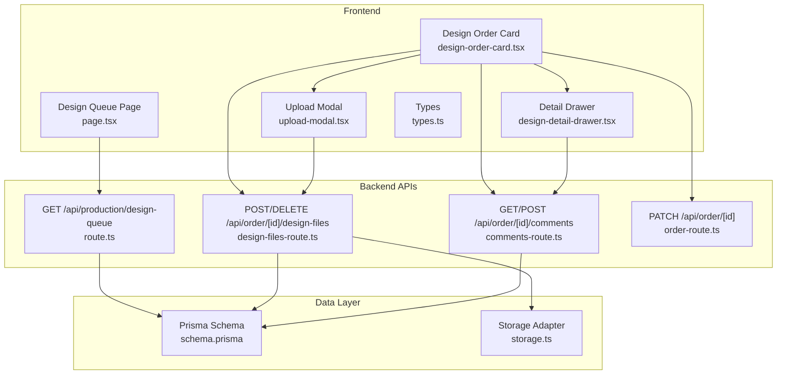
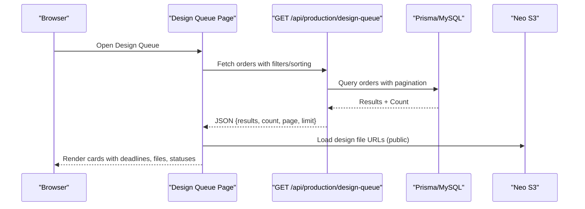
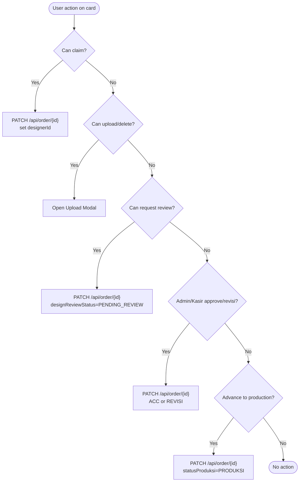
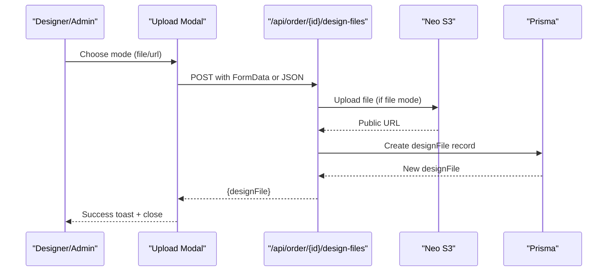
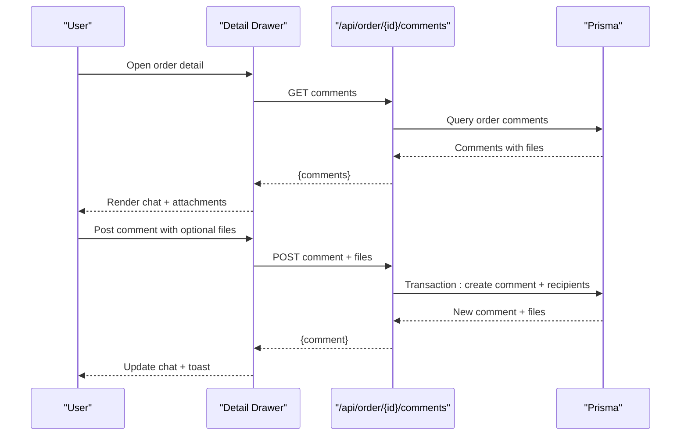
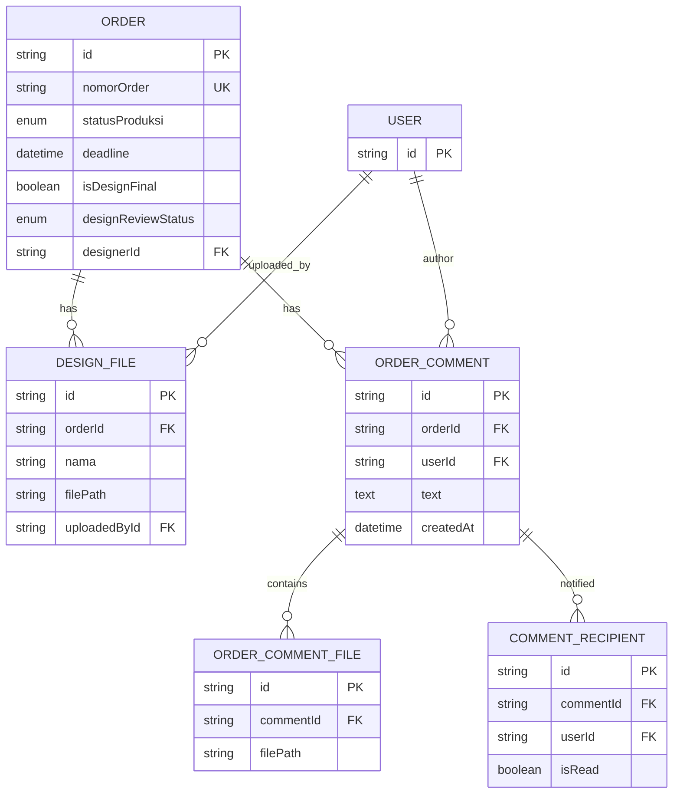
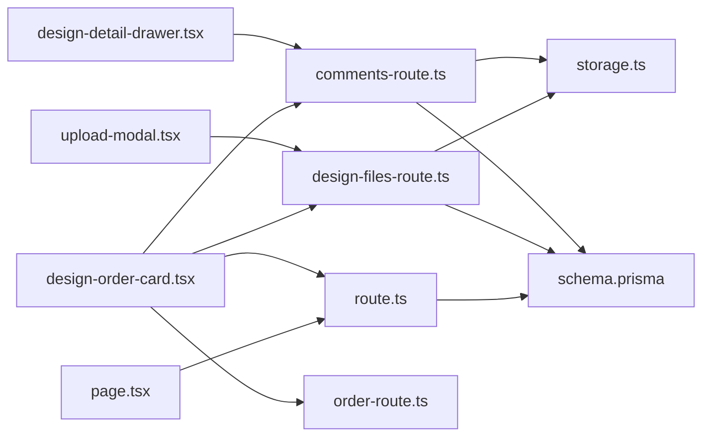

# Design Queue Management

<cite>
**Referenced Files in This Document**
- [page.tsx](file://src/app/(LoggedIn)/production/design-queue/page.tsx)
- [types.ts](file://src/app/(LoggedIn)/production/design-queue/components/types.ts)
- [upload-modal.tsx](file://src/app/(LoggedIn)/production/design-queue/components/upload-modal.tsx)
- [design-detail-drawer.tsx](file://src/app/(LoggedIn)/production/design-queue/components/design-detail-drawer.tsx)
- [design-order-card.tsx](file://src/app/(LoggedIn)/production/design-queue/components/design-order-card.tsx)
- [route.ts](file://src/app/api/production/design-queue/route.ts)
- [design-files-route.ts](file://src/app/api/order/[id]/design-files/route.ts)
- [comments-route.ts](file://src/app/api/order/[id]/comments/route.ts)
- [schema.prisma](file://prisma/schema.prisma)
- [storage.ts](file://src/lib/storage.ts)
- [order-route.ts](file://src/app/api/order/[id]/route.ts)
</cite>

## Table of Contents
1. [Introduction](#introduction)
2. [Project Structure](#project-structure)
3. [Core Components](#core-components)
4. [Architecture Overview](#architecture-overview)
5. [Detailed Component Analysis](#detailed-component-analysis)
6. [Dependency Analysis](#dependency-analysis)
7. [Performance Considerations](#performance-considerations)
8. [Troubleshooting Guide](#troubleshooting-guide)
9. [Conclusion](#conclusion)

## Introduction
This document explains the design queue management system that powers the design file submission workflow, order creation process, queue prioritization, and collaborative review process. It covers the design file upload interface, supported formats and limits, validation rules, the design detail drawer, order information display, design specifications management, approval workflow, reviewer assignment, status tracking, practical operation examples, versioning and storage integration, and retrieval processes.

## Project Structure
The design queue feature spans frontend pages, shared UI components, and backend APIs with Prisma ORM and Neo Object Storage integration.

**Diagram sources**
- [page.tsx:1-247](file://src/app/(LoggedIn)/production/design-queue/page.tsx#L1-L247)
- [design-order-card.tsx:1-773](file://src/app/(LoggedIn)/production/design-queue/components/design-order-card.tsx#L1-L773)
- [upload-modal.tsx:1-222](file://src/app/(LoggedIn)/production/design-queue/components/upload-modal.tsx#L1-L222)
- [design-detail-drawer.tsx:1-429](file://src/app/(LoggedIn)/production/design-queue/components/design-detail-drawer.tsx#L1-L429)
- [route.ts:1-152](file://src/app/api/production/design-queue/route.ts#L1-L152)
- [design-files-route.ts:1-232](file://src/app/api/order/[id]/design-files/route.ts#L1-L232)
- [comments-route.ts:1-234](file://src/app/api/order/[id]/comments/route.ts#L1-L234)
- [order-route.ts:299-437](file://src/app/api/order/[id]/route.ts#L299-L437)
- [schema.prisma:260-330](file://prisma/schema.prisma#L260-L330)
- [storage.ts:1-91](file://src/lib/storage.ts#L1-L91)

**Section sources**
- [page.tsx:1-247](file://src/app/(LoggedIn)/production/design-queue/page.tsx#L1-L247)
- [route.ts:17-152](file://src/app/api/production/design-queue/route.ts#L17-L152)

## Core Components
- Design Queue Page: Renders paginated, filtered, and sorted design orders with live updates.
- Design Order Card: Provides actions for claiming, uploading files, requesting reviews, approving/revising, and advancing to production.
- Upload Modal: Handles file uploads to Neo S3 or external URL storage with validation.
- Design Detail Drawer: Displays order info, design files, and a threaded discussion with file attachments.
- Backend APIs: Serve queue data, manage design files, and handle comments with real-time notifications.
- Prisma Models: Define order, design file, comment, and recipient entities.
- Storage Adapter: Integrates with Neo Object Storage for secure file retrieval.

**Section sources**
- [design-order-card.tsx:69-773](file://src/app/(LoggedIn)/production/design-queue/components/design-order-card.tsx#L69-L773)
- [upload-modal.tsx:16-222](file://src/app/(LoggedIn)/production/design-queue/components/upload-modal.tsx#L16-L222)
- [design-detail-drawer.tsx:46-429](file://src/app/(LoggedIn)/production/design-queue/components/design-detail-drawer.tsx#L46-L429)
- [route.ts:17-152](file://src/app/api/production/design-queue/route.ts#L17-L152)
- [design-files-route.ts:36-232](file://src/app/api/order/[id]/design-files/route.ts#L36-L232)
- [comments-route.ts:36-234](file://src/app/api/order/[id]/comments/route.ts#L36-L234)
- [schema.prisma:260-330](file://prisma/schema.prisma#L260-L330)
- [storage.ts:48-91](file://src/lib/storage.ts#L48-L91)

## Architecture Overview
The system follows a client-server architecture with a React-based UI and a Next.js API Routes backend. Data persistence is handled by Prisma connected to MySQL, while file storage is handled via Neo Object Storage (S3-compatible). Real-time updates are achieved through periodic polling and Pusher events.

**Diagram sources**
- [page.tsx:64-70](file://src/app/(LoggedIn)/production/design-queue/page.tsx#L64-L70)
- [route.ts:17-152](file://src/app/api/production/design-queue/route.ts#L17-L152)
- [schema.prisma:260-330](file://prisma/schema.prisma#L260-L330)
- [storage.ts:48-69](file://src/lib/storage.ts#L48-L69)

## Detailed Component Analysis

### Design Queue Page
- Purpose: Central hub for viewing, filtering, sorting, and navigating design orders.
- Features:
  - Tabs: All Queue, My Queue, Unread Comments.
  - Filters: Search by order/customer, file presence, sort by created date or deadline, review status.
  - Pagination and live refresh every 30 seconds.
  - Role-aware editing controls (admin/designer).
- Data fetching: Uses SWR with debounced search and configurable limit.

**Section sources**
- [page.tsx:44-247](file://src/app/(LoggedIn)/production/design-queue/page.tsx#L44-L247)
- [route.ts:17-80](file://src/app/api/production/design-queue/route.ts#L17-L80)

### Design Order Card
- Purpose: Individual order tile with actionable controls and status indicators.
- Key capabilities:
  - Claim/Reset claim (designer/admin).
  - Upload/Delete design files (designer/admin who claimed).
  - Request Review (designer who claimed).
  - Approve/Revisi (admin/kasir).
  - Reset Finalization (admin/kasir).
  - Advance to Production or create SPK.
  - Visual indicators: Overdue, near-deadline, review status, unread comments.
- Permissions: Enforced per user role and assignment.

**Diagram sources**
- [design-order-card.tsx:116-300](file://src/app/(LoggedIn)/production/design-queue/components/design-order-card.tsx#L116-L300)
- [order-route.ts:299-437](file://src/app/api/order/[id]/route.ts#L299-L437)

**Section sources**
- [design-order-card.tsx:69-773](file://src/app/(LoggedIn)/production/design-queue/components/design-order-card.tsx#L69-L773)

### Upload Modal
- Purpose: Unified interface for uploading design files or saving external links.
- Supported modes:
  - File upload: Accepts JPG, PNG, PDF, AI, PSD, ZIP up to 10 MB.
  - URL mode: Saves external drive links with validation.
- Validation:
  - Name required.
  - File selection required for file mode.
  - URL format validation for URL mode.
  - Size and MIME checks enforced by backend.
- Storage:
  - File mode: Uploads to Neo S3 under design/{orderId}/{uuid.ext}, returns public URL.
  - URL mode: Stores the provided URL directly.

**Diagram sources**
- [upload-modal.tsx:55-112](file://src/app/(LoggedIn)/production/design-queue/components/upload-modal.tsx#L55-L112)
- [design-files-route.ts:36-173](file://src/app/api/order/[id]/design-files/route.ts#L36-L173)
- [storage.ts:48-69](file://src/lib/storage.ts#L48-L69)

**Section sources**
- [upload-modal.tsx:16-222](file://src/app/(LoggedIn)/production/design-queue/components/upload-modal.tsx#L16-L222)
- [design-files-route.ts:10-232](file://src/app/api/order/[id]/design-files/route.ts#L10-L232)
- [storage.ts:48-91](file://src/lib/storage.ts#L48-L91)

### Design Detail Drawer
- Purpose: Comprehensive order view with order info, design files, and threaded comments.
- Features:
  - Order items, customer info, notes, and deadline badges.
  - File previews with icons and image rendering.
  - Comment thread with file attachments.
  - Auto-scroll to latest comment and mark as read on open.
  - Rich media support: images, PDFs, archives.

**Diagram sources**
- [design-detail-drawer.tsx:77-164](file://src/app/(LoggedIn)/production/design-queue/components/design-detail-drawer.tsx#L77-L164)
- [comments-route.ts:78-234](file://src/app/api/order/[id]/comments/route.ts#L78-L234)

**Section sources**
- [design-detail-drawer.tsx:46-429](file://src/app/(LoggedIn)/production/design-queue/components/design-detail-drawer.tsx#L46-L429)
- [comments-route.ts:36-234](file://src/app/api/order/[id]/comments/route.ts#L36-L234)

### Backend APIs and Data Models
- Design Queue API:
  - Filters: search, hasFile, sortBy, designerId, reviewStatus (including unread).
  - Sorting: deadline asc (then created desc) or created desc.
  - Selective fields and unread comment detection for badge rendering.
- Design File API:
  - POST: Upload to Neo S3 or save external URL; validates size and MIME.
  - DELETE: Remove file from storage (when applicable) and DB.
- Comments API:
  - GET: Fetch ordered comment thread.
  - POST: Upload attachments to Neo S3, persist comment and recipients, broadcast real-time events.
- Prisma Models:
  - Order, DesignFile, OrderComment, OrderCommentFile, CommentRecipient.
  - Enums: StatusProduksi, DesignReviewStatus.

**Diagram sources**
- [schema.prisma:260-330](file://prisma/schema.prisma#L260-L330)
- [schema.prisma:632-674](file://prisma/schema.prisma#L632-L674)

**Section sources**
- [route.ts:17-152](file://src/app/api/production/design-queue/route.ts#L17-L152)
- [design-files-route.ts:36-232](file://src/app/api/order/[id]/design-files/route.ts#L36-L232)
- [comments-route.ts:36-234](file://src/app/api/order/[id]/comments/route.ts#L36-L234)
- [schema.prisma:260-330](file://prisma/schema.prisma#L260-L330)
- [schema.prisma:632-674](file://prisma/schema.prisma#L632-L674)

## Dependency Analysis
- Frontend-to-Backend:
  - Design Queue Page depends on GET /api/production/design-queue.
  - Design Order Card triggers PATCH /api/order/{id} for claims, approvals, and status changes.
  - Upload Modal posts to /api/order/{id}/design-files.
  - Detail Drawer reads and writes to /api/order/{id}/comments.
- Backend-to-Data:
  - All APIs use Prisma queries and mutations against MySQL.
- Backend-to-Storage:
  - Design file uploads and comment attachments are stored in Neo S3 via uploadToNeo.
- Notifications:
  - Real-time events broadcast via Pusher for new comments and design finalization.

**Diagram sources**
- [page.tsx:64-70](file://src/app/(LoggedIn)/production/design-queue/page.tsx#L64-L70)
- [design-order-card.tsx:116-300](file://src/app/(LoggedIn)/production/design-queue/components/design-order-card.tsx#L116-L300)
- [upload-modal.tsx:85-95](file://src/app/(LoggedIn)/production/design-queue/components/upload-modal.tsx#L85-L95)
- [design-detail-drawer.tsx:135-138](file://src/app/(LoggedIn)/production/design-queue/components/design-detail-drawer.tsx#L135-L138)
- [route.ts:17-152](file://src/app/api/production/design-queue/route.ts#L17-L152)
- [design-files-route.ts:36-173](file://src/app/api/order/[id]/design-files/route.ts#L36-L173)
- [comments-route.ts:78-234](file://src/app/api/order/[id]/comments/route.ts#L78-L234)
- [order-route.ts:299-437](file://src/app/api/order/[id]/route.ts#L299-L437)
- [storage.ts:48-91](file://src/lib/storage.ts#L48-L91)
- [schema.prisma:260-330](file://prisma/schema.prisma#L260-L330)

**Section sources**
- [page.tsx:64-70](file://src/app/(LoggedIn)/production/design-queue/page.tsx#L64-L70)
- [design-order-card.tsx:116-300](file://src/app/(LoggedIn)/production/design-queue/components/design-order-card.tsx#L116-L300)
- [upload-modal.tsx:85-95](file://src/app/(LoggedIn)/production/design-queue/components/upload-modal.tsx#L85-L95)
- [design-detail-drawer.tsx:135-138](file://src/app/(LoggedIn)/production/design-queue/components/design-detail-drawer.tsx#L135-L138)
- [route.ts:17-152](file://src/app/api/production/design-queue/route.ts#L17-L152)
- [design-files-route.ts:36-173](file://src/app/api/order/[id]/design-files/route.ts#L36-L173)
- [comments-route.ts:78-234](file://src/app/api/order/[id]/comments/route.ts#L78-L234)
- [order-route.ts:299-437](file://src/app/api/order/[id]/route.ts#L299-L437)
- [storage.ts:48-91](file://src/lib/storage.ts#L48-L91)
- [schema.prisma:260-330](file://prisma/schema.prisma#L260-L330)

## Performance Considerations
- Pagination and Limit: The queue enforces a maximum page size and calculates total pages to avoid heavy loads.
- Debounced Search: Reduces unnecessary API calls during typing.
- Live Refresh: Background polling keeps the queue fresh without manual refresh.
- Selective Field Queries: Backend selects only necessary fields to minimize payload size.
- Image Preview Optimization: Inline image previews are constrained to prevent excessive DOM size.

[No sources needed since this section provides general guidance]

## Troubleshooting Guide
- Upload Failures:
  - Verify file size (< 10 MB) and MIME type (JPG, PNG, PDF, AI, PSD, ZIP).
  - Ensure Neo S3 credentials and bucket configuration are correct.
- URL Mode Issues:
  - Confirm URL is valid and publicly accessible.
- Permission Errors:
  - Only designers and admins can upload; only admins and kasir can finalize designs.
  - Review status changes require proper role or assignment.
- Comment Attachment Problems:
  - Ensure attachments meet size and MIME constraints; check Neo S3 write permissions.
- Real-time Updates:
  - Confirm Pusher configuration and channel subscriptions for private and global channels.

**Section sources**
- [design-files-route.ts:10-232](file://src/app/api/order/[id]/design-files/route.ts#L10-L232)
- [comments-route.ts:10-234](file://src/app/api/order/[id]/comments/route.ts#L10-L234)
- [order-route.ts:299-437](file://src/app/api/order/[id]/route.ts#L299-L437)
- [storage.ts:18-91](file://src/lib/storage.ts#L18-L91)

## Conclusion
The design queue management system provides a robust, role-aware platform for managing design submissions, approvals, and collaboration. Its modular frontend components integrate seamlessly with backend APIs and Prisma-driven data models, while Neo S3 ensures scalable and secure file storage. The system’s filtering, sorting, and real-time features streamline cross-team workflows between designers and production staff.