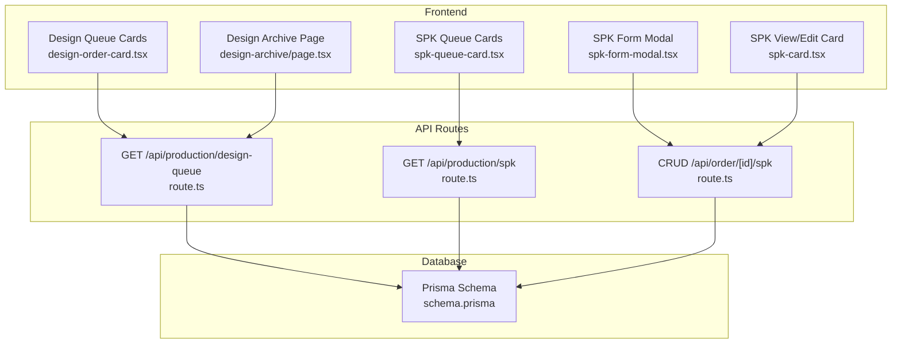
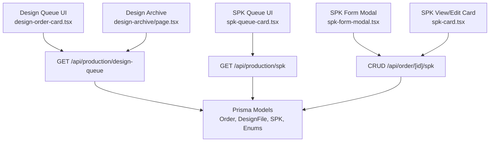
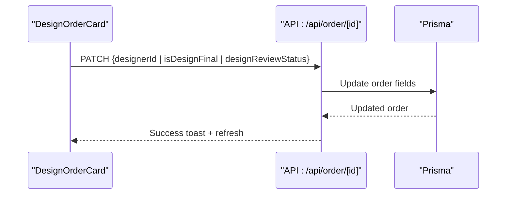
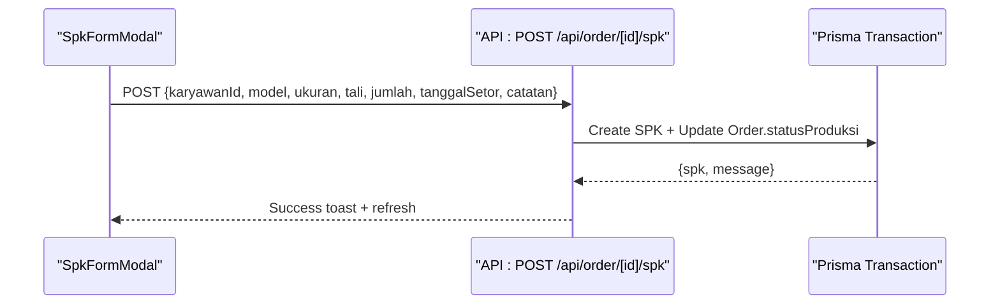
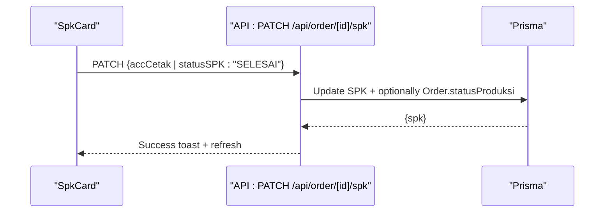
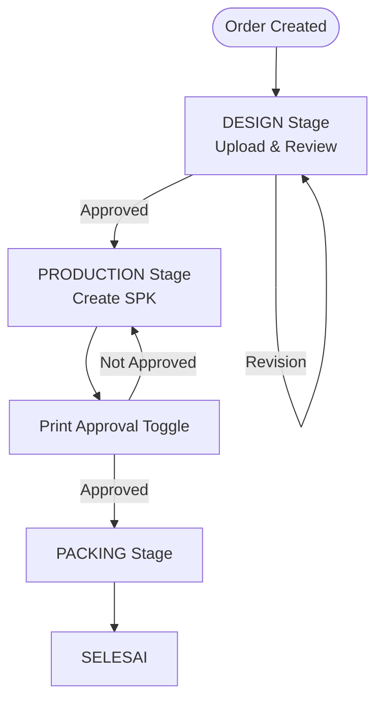
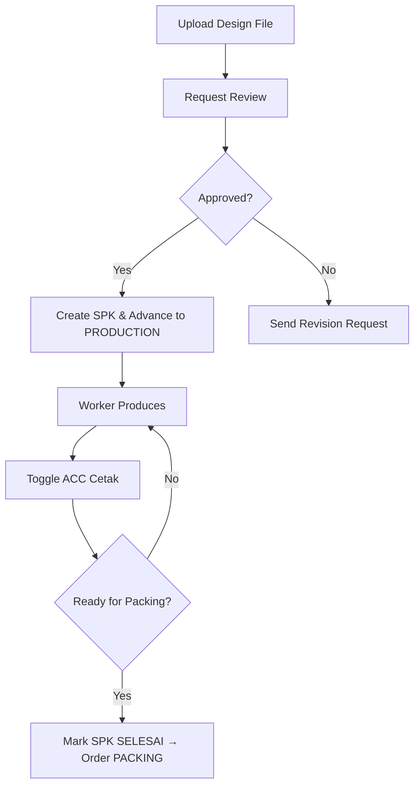
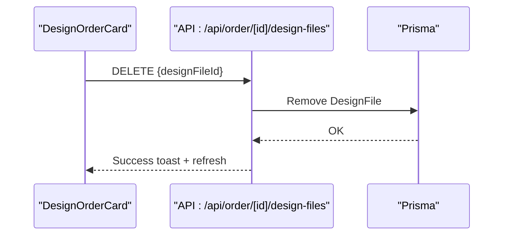
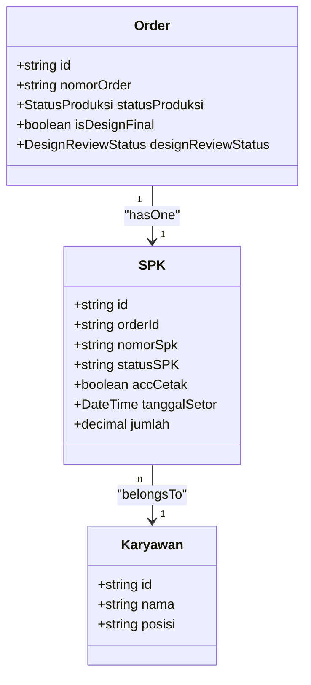
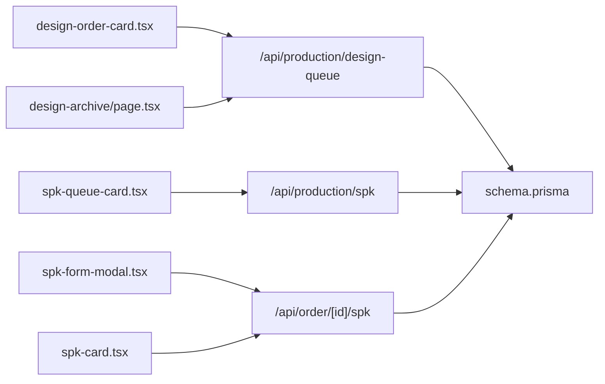

# Production Management

<cite>
**Referenced Files in This Document**
- [schema.prisma](file://prisma/schema.prisma)
- [design-order-card.tsx](file://src/app/(LoggedIn)/production/design-queue/components/design-order-card.tsx)
- [spk-queue-card.tsx](file://src/app/(LoggedIn)/production/spk/components/spk-queue-card.tsx)
- [spk-form-modal.tsx](file://src/app/(LoggedIn)/order/[id]/components/spk-form-modal.tsx)
- [spk-card.tsx](file://src/app/(LoggedIn)/order/[id]/components/spk-card.tsx)
- [route.ts (design-queue API)](file://src/app/api/production/design-queue/route.ts)
- [route.ts (spk API)](file://src/app/api/production/spk/route.ts)
- [route.ts (order spk API)](file://src/app/api/order/[id]/spk/route.ts)
- [page.tsx (design-archive)](file://src/app/(LoggedIn)/production/design-archive/page.tsx)
</cite>

## Table of Contents
1. [Introduction](#introduction)
2. [Project Structure](#project-structure)
3. [Core Components](#core-components)
4. [Architecture Overview](#architecture-overview)
5. [Detailed Component Analysis](#detailed-component-analysis)
6. [Dependency Analysis](#dependency-analysis)
7. [Performance Considerations](#performance-considerations)
8. [Troubleshooting Guide](#troubleshooting-guide)
9. [Conclusion](#conclusion)
10. [Appendices](#appendices)

## Introduction
This document explains the production management system for garment manufacturing workflows. It covers the design queue management, SPK (Work Order) creation and tracking, production workflow orchestration, and quality control checkpoints. It also documents the design file upload and management system, design review processes, collaboration features, production tracking, material allocation linkage via inventory, and production reporting capabilities. Practical examples illustrate typical production scenarios, bottleneck identification, and efficiency optimization strategies.

## Project Structure
The system is a Next.js application with:
- Prisma schema modeling orders, designs, SPKs, employees, inventory movements, and related enums.
- Frontend pages and components under src/app for design queue, SPK queue, order details, and design archive.
- API routes under src/app/api for production-related queries and mutations.

**Diagram sources**
- [design-order-card.tsx](file://src/app/(LoggedIn)/production/design-queue/components/design-order-card.tsx#L1-773)
- [spk-queue-card.tsx](file://src/app/(LoggedIn)/production/spk/components/spk-queue-card.tsx#L1-299)
- [spk-form-modal.tsx](file://src/app/(LoggedIn)/order/[id]/components/spk-form-modal.tsx#L1-274)
- [spk-card.tsx](file://src/app/(LoggedIn)/order/[id]/components/spk-card.tsx#L1-347)
- [route.ts (design-queue API):1-152](file://src/app/api/production/design-queue/route.ts#L1-152)
- [route.ts (spk API):1-107](file://src/app/api/production/spk/route.ts#L1-107)
- [route.ts (order spk API):1-273](file://src/app/api/order/[id]/spk/route.ts#L1-273)
- [schema.prisma:260-393](file://prisma/schema.prisma#L260-L393)

**Section sources**
- [design-order-card.tsx](file://src/app/(LoggedIn)/production/design-queue/components/design-order-card.tsx#L1-773)
- [spk-queue-card.tsx](file://src/app/(LoggedIn)/production/spk/components/spk-queue-card.tsx#L1-299)
- [spk-form-modal.tsx](file://src/app/(LoggedIn)/order/[id]/components/spk-form-modal.tsx#L1-274)
- [spk-card.tsx](file://src/app/(LoggedIn)/order/[id]/components/spk-card.tsx#L1-347)
- [route.ts (design-queue API):1-152](file://src/app/api/production/design-queue/route.ts#L1-152)
- [route.ts (spk API):1-107](file://src/app/api/production/spk/route.ts#L1-107)
- [route.ts (order spk API):1-273](file://src/app/api/order/[id]/spk/route.ts#L1-273)
- [schema.prisma:260-393](file://prisma/schema.prisma#L260-L393)

## Core Components
- Design Queue: Displays orders awaiting design approval, supports claiming, uploading design files, initiating reviews, and advancing to production.
- SPK Queue: Shows active work orders with deadlines, worker assignments, and status toggles for print approval and completion.
- SPK Creation and Editing: Modal-driven creation and inline editing of SPK details, worker assignment, quantities, and deadlines.
- Design Archive: Centralized browsing and filtering of all uploaded design files across orders.
- Backend APIs: Secure endpoints for listing design queue, SPK queue, and managing SPK lifecycle.

Key data models and enums:
- Order: Tracks order lifecycle, design ownership, design review status, and production stage.
- DesignFile: Stores uploaded design assets linked to orders.
- SPK: Work order with worker assignment, print approval, status, and production stage synchronization.
- Enums: StatusSPK, StatusProduksi, DesignReviewStatus define workflow states.

**Section sources**
- [schema.prisma:260-393](file://prisma/schema.prisma#L260-L393)
- [design-order-card.tsx](file://src/app/(LoggedIn)/production/design-queue/components/design-order-card.tsx#L1-773)
- [spk-queue-card.tsx](file://src/app/(LoggedIn)/production/spk/components/spk-queue-card.tsx#L1-299)
- [spk-form-modal.tsx](file://src/app/(LoggedIn)/order/[id]/components/spk-form-modal.tsx#L1-274)
- [spk-card.tsx](file://src/app/(LoggedIn)/order/[id]/components/spk-card.tsx#L1-347)
- [route.ts (design-queue API):1-152](file://src/app/api/production/design-queue/route.ts#L1-152)
- [route.ts (spk API):1-107](file://src/app/api/production/spk/route.ts#L1-107)
- [route.ts (order spk API):1-273](file://src/app/api/order/[id]/spk/route.ts#L1-273)

## Architecture Overview
The system follows a layered architecture:
- Presentation Layer: React components and modals for design queue, SPK queue, and order details.
- API Layer: Next.js routes implementing CRUD and state transitions for production workflows.
- Data Access: Prisma ORM queries and transactions for atomic updates.
- Data Model: Strongly typed entities and enums for orders, design files, SPKs, and statuses.

**Diagram sources**
- [design-order-card.tsx](file://src/app/(LoggedIn)/production/design-queue/components/design-order-card.tsx#L1-773)
- [spk-queue-card.tsx](file://src/app/(LoggedIn)/production/spk/components/spk-queue-card.tsx#L1-299)
- [spk-form-modal.tsx](file://src/app/(LoggedIn)/order/[id]/components/spk-form-modal.tsx#L1-274)
- [spk-card.tsx](file://src/app/(LoggedIn)/order/[id]/components/spk-card.tsx#L1-347)
- [page.tsx (design-archive)](file://src/app/(LoggedIn)/production/design-archive/page.tsx#L1-169)
- [route.ts (design-queue API):1-152](file://src/app/api/production/design-queue/route.ts#L1-152)
- [route.ts (spk API):1-107](file://src/app/api/production/spk/route.ts#L1-107)
- [route.ts (order spk API):1-273](file://src/app/api/order/[id]/spk/route.ts#L1-273)
- [schema.prisma:260-393](file://prisma/schema.prisma#L260-L393)

## Detailed Component Analysis

### Design Queue Management
The design queue displays orders in the DESIGN stage, enabling:
- Claiming/unclaiming design responsibility.
- Uploading design files and deleting uploaded files.
- Initiating design review and approving/requiring revisions.
- Advancing to PRODUCTION when design is finalized.

**Diagram sources**
- [design-order-card.tsx](file://src/app/(LoggedIn)/production/design-queue/components/design-order-card.tsx#L116-L247)
- [route.ts (order spk API):154-213](file://src/app/api/order/[id]/spk/route.ts#L154-L213)

**Section sources**
- [design-order-card.tsx](file://src/app/(LoggedIn)/production/design-queue/components/design-order-card.tsx#L1-773)
- [route.ts (design-queue API):17-151](file://src/app/api/production/design-queue/route.ts#L17-L151)

### SPK Creation and Tracking
SPK creation links to an order, sets initial status to ACTIVE, and advances order to PRODUCTION atomically. SPK tracking allows toggling print approval and marking completion to move order to PACKING.

**Diagram sources**
- [spk-form-modal.tsx](file://src/app/(LoggedIn)/order/[id]/components/spk-form-modal.tsx#L100-L124)
- [route.ts (order spk API):59-151](file://src/app/api/order/[id]/spk/route.ts#L59-L151)

**Diagram sources**
- [spk-card.tsx](file://src/app/(LoggedIn)/order/[id]/components/spk-card.tsx#L89-L110)
- [route.ts (order spk API):215-272](file://src/app/api/order/[id]/spk/route.ts#L215-L272)

**Section sources**
- [spk-form-modal.tsx](file://src/app/(LoggedIn)/order/[id]/components/spk-form-modal.tsx#L1-274)
- [spk-card.tsx](file://src/app/(LoggedIn)/order/[id]/components/spk-card.tsx#L1-347)
- [route.ts (order spk API):1-273](file://src/app/api/order/[id]/spk/route.ts#L1-273)

### Production Workflow Orchestration
Workflow stages:
- DESIGN: Design files uploaded, reviewed, approved or requested revision.
- PRODUCTION: SPK created, worker assigned, print approved, production tracked.
- PACKING: Completion triggers packing workflow.
- SELESAI: Order marked complete.

**Diagram sources**
- [schema.prisma:526-533](file://prisma/schema.prisma#L526-L533)
- [route.ts (order spk API):138-146](file://src/app/api/order/[id]/spk/route.ts#L138-L146)
- [route.ts (order spk API):252-262](file://src/app/api/order/[id]/spk/route.ts#L252-L262)

**Section sources**
- [schema.prisma:526-533](file://prisma/schema.prisma#L526-L533)
- [route.ts (order spk API):112-136](file://src/app/api/order/[id]/spk/route.ts#L112-L136)
- [route.ts (order spk API):247-257](file://src/app/api/order/[id]/spk/route.ts#L247-L257)

### Quality Control Processes
Quality gates:
- Print Approval: SPK card switch toggles print approval, capturing approver and timestamp.
- Review Status: Designers initiate review; admins/kasir approve or request revision.
- Deadlines: Overdue warnings for both design deadlines and SPK delivery dates.

**Diagram sources**
- [design-order-card.tsx](file://src/app/(LoggedIn)/production/design-queue/components/design-order-card.tsx#L192-L247)
- [spk-card.tsx](file://src/app/(LoggedIn)/order/[id]/components/spk-card.tsx#L89-L110)
- [route.ts (order spk API):252-262](file://src/app/api/order/[id]/spk/route.ts#L252-L262)

**Section sources**
- [design-order-card.tsx](file://src/app/(LoggedIn)/production/design-queue/components/design-order-card.tsx#L192-L247)
- [spk-card.tsx](file://src/app/(LoggedIn)/order/[id]/components/spk-card.tsx#L89-L110)

### Design File Upload and Management
- Upload: Designers can upload files to an order after claiming it.
- Delete: Authorized users can remove uploaded files.
- Archive: Centralized listing and filtering of all design files across orders.

**Diagram sources**
- [design-order-card.tsx](file://src/app/(LoggedIn)/production/design-queue/components/design-order-card.tsx#L249-L276)
- [route.ts (design-queue API):44-49](file://src/app/api/production/design-queue/route.ts#L44-L49)

**Section sources**
- [design-order-card.tsx](file://src/app/(LoggedIn)/production/design-queue/components/design-order-card.tsx#L492-L578)
- [page.tsx (design-archive)](file://src/app/(LoggedIn)/production/design-archive/page.tsx#L1-169)

### Collaboration Features
- Comments and Recipients: Orders support comments with recipient tracking for unread indicators.
- Notifications: Status changes trigger notifications to relevant users.
- Role-based Permissions: Actions are restricted by roles (admin, designer, produksi, kasir).

**Section sources**
- [schema.prisma:632-663](file://prisma/schema.prisma#L632-L663)
- [design-order-card.tsx](file://src/app/(LoggedIn)/production/design-queue/components/design-order-card.tsx#L331-L336)

### Production Tracking, Material Allocation, and Capacity Management
- Production Tracking: SPK cards show deadlines, worker assignments, print approvals, and status.
- Material Allocation: SPKs link to outgoing material records via inventory module; SPK creation triggers production workflow.
- Capacity Management: SPK queue filters and deadlines help balance workload and identify bottlenecks.

**Diagram sources**
- [schema.prisma:260-393](file://prisma/schema.prisma#L260-L393)

**Section sources**
- [spk-queue-card.tsx](file://src/app/(LoggedIn)/production/spk/components/spk-queue-card.tsx#L1-299)
- [route.ts (spk API):15-107](file://src/app/api/production/spk/route.ts#L15-L107)

### Inventory Integration for Raw Materials
- SPK Outgoing Materials: SPKs can be linked to outgoing material entries for accurate consumption tracking.
- Low Stock Alerts: Inventory module surfaces alerts for reordering.
- Integration Point: SPK creation/update can trigger inventory adjustments via backend flows.

**Section sources**
- [schema.prisma:376-393](file://prisma/schema.prisma#L376-L393)
- [page.tsx (design-archive)](file://src/app/(LoggedIn)/production/design-archive/page.tsx#L1-169)

### Real-time Collaboration and Communication
- Unread Comment Indicators: Visual badges highlight new messages requiring attention.
- Push Notifications: Status change notifications inform stakeholders across roles.
- Live Updates: SWR-powered UI refreshes after mutations.

**Section sources**
- [design-order-card.tsx](file://src/app/(LoggedIn)/production/design-queue/components/design-order-card.tsx#L331-L336)
- [route.ts (order spk API):138-141](file://src/app/api/order/[id]/spk/route.ts#L138-L141)

## Dependency Analysis
- UI components depend on API routes for mutations and queries.
- API routes depend on Prisma for database operations.
- Data models enforce referential integrity and status transitions.

**Diagram sources**
- [design-order-card.tsx](file://src/app/(LoggedIn)/production/design-queue/components/design-order-card.tsx#L1-773)
- [spk-queue-card.tsx](file://src/app/(LoggedIn)/production/spk/components/spk-queue-card.tsx#L1-299)
- [spk-form-modal.tsx](file://src/app/(LoggedIn)/order/[id]/components/spk-form-modal.tsx#L1-274)
- [spk-card.tsx](file://src/app/(LoggedIn)/order/[id]/components/spk-card.tsx#L1-347)
- [page.tsx (design-archive)](file://src/app/(LoggedIn)/production/design-archive/page.tsx#L1-169)
- [route.ts (design-queue API):1-152](file://src/app/api/production/design-queue/route.ts#L1-152)
- [route.ts (spk API):1-107](file://src/app/api/production/spk/route.ts#L1-107)
- [route.ts (order spk API):1-273](file://src/app/api/order/[id]/spk/route.ts#L1-273)
- [schema.prisma:260-393](file://prisma/schema.prisma#L260-L393)

**Section sources**
- [route.ts (design-queue API):17-151](file://src/app/api/production/design-queue/route.ts#L17-L151)
- [route.ts (spk API):15-107](file://src/app/api/production/spk/route.ts#L15-L107)
- [route.ts (order spk API):1-273](file://src/app/api/order/[id]/spk/route.ts#L1-L273)
- [schema.prisma:260-393](file://prisma/schema.prisma#L260-L393)

## Performance Considerations
- Pagination and Filtering: API endpoints support pagination and filtering to reduce payload sizes.
- Efficient Queries: Selective projections minimize returned fields.
- Transactions: Atomic updates prevent inconsistent states during SPK creation and status changes.
- Debounced Search: Frontend search inputs debounce to avoid excessive requests.

[No sources needed since this section provides general guidance]

## Troubleshooting Guide
Common issues and resolutions:
- Unauthorized/Forbidden Access: Verify user role matches allowed roles for endpoints.
- SPK Already Exists: Attempting to create SPK for an order that already has one returns an error.
- Missing Worker: Creating SPK requires a valid worker ID.
- Invalid Quantity: SPK quantity must be a valid number.
- Status Transition Failures: Ensure prerequisite steps (e.g., design finalization, print approval) are met before advancing.

**Section sources**
- [route.ts (order spk API):78-98](file://src/app/api/order/[id]/spk/route.ts#L78-L98)
- [route.ts (order spk API):161-181](file://src/app/api/order/[id]/spk/route.ts#L161-L181)
- [route.ts (order spk API):225-230](file://src/app/api/order/[id]/spk/route.ts#L225-L230)

## Conclusion
The production management system integrates design review, SPK lifecycle, and production tracking with robust data models and secure API endpoints. It supports real-time collaboration, quality gates, and scalable pagination. By leveraging SPK queues and deadlines, teams can identify bottlenecks and optimize throughput while maintaining visibility into material usage and order status.

## Appendices

### Practical Scenarios and Examples
- Scenario 1: Design Review and Production Launch
  - Designer uploads files and requests review.
  - Admin approves or requests revision.
  - Upon approval, SPK is created and order moves to PRODUCTION.
- Scenario 2: Bottleneck Identification
  - High overdue SPKs indicate production delays.
  - Filter SPK queue by worker or deadline to allocate resources.
- Scenario 3: Efficiency Optimization
  - Use print approval toggle to ensure quality before moving to packing.
  - Monitor design archive for repeated templates to streamline future orders.

[No sources needed since this section provides general guidance]