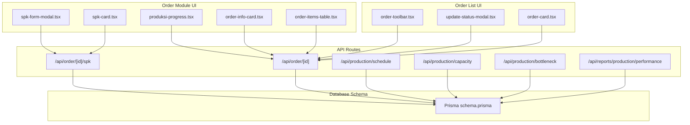
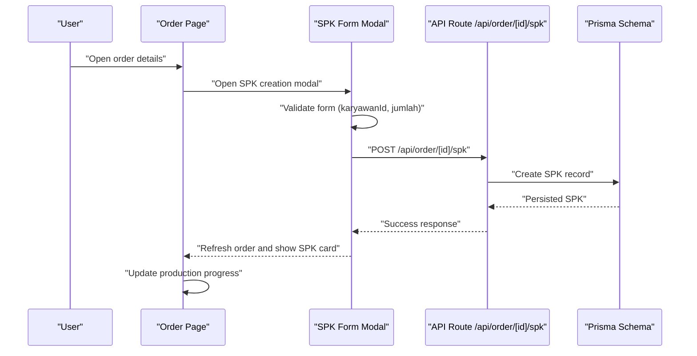
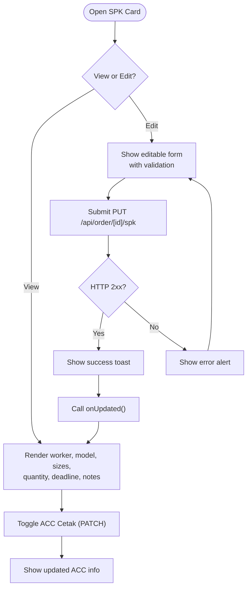
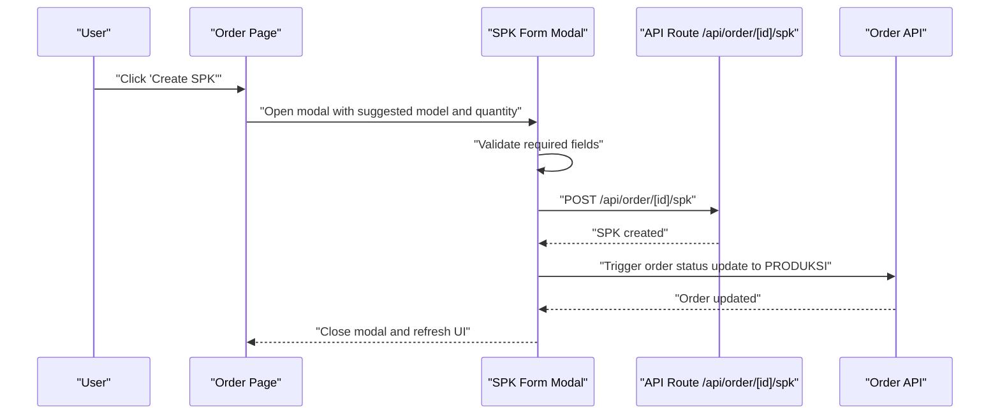
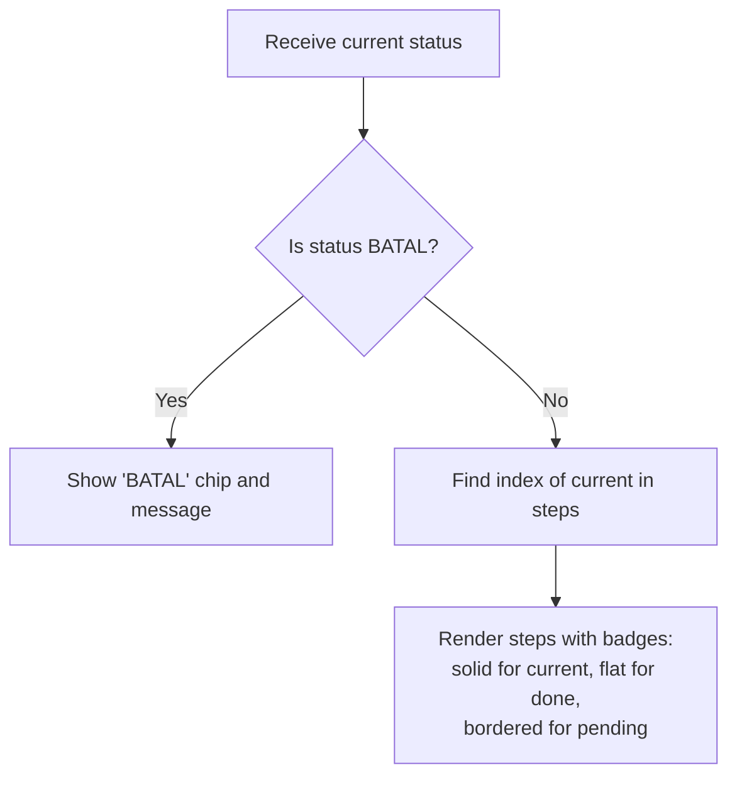
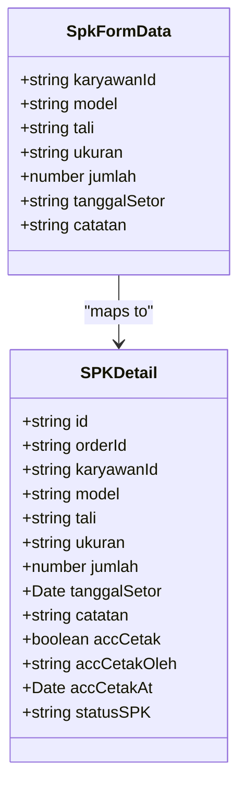
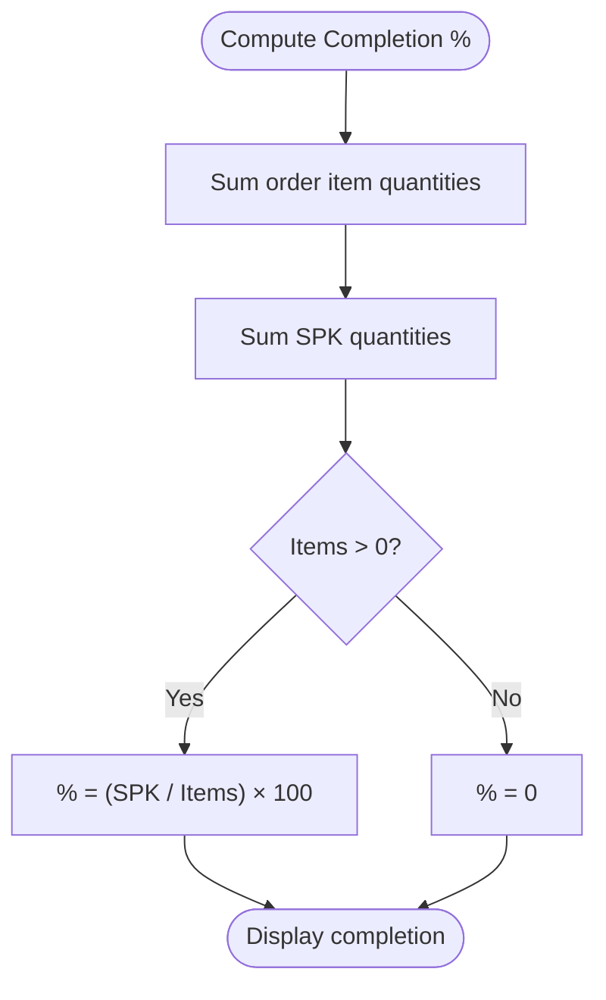
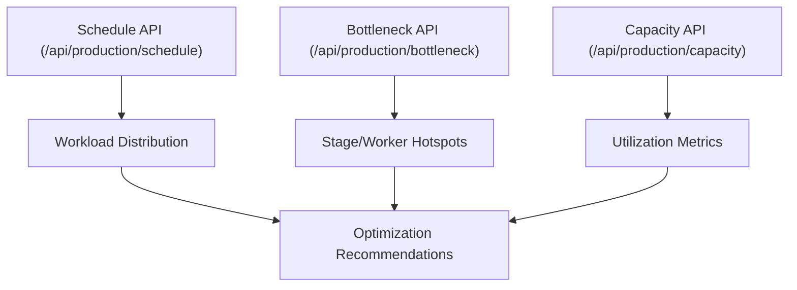
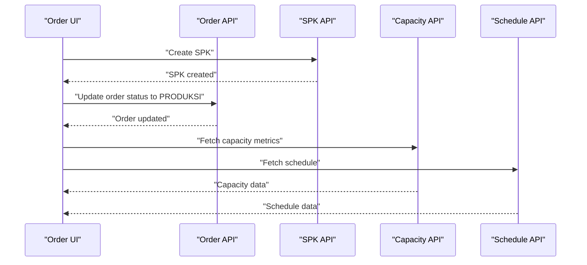
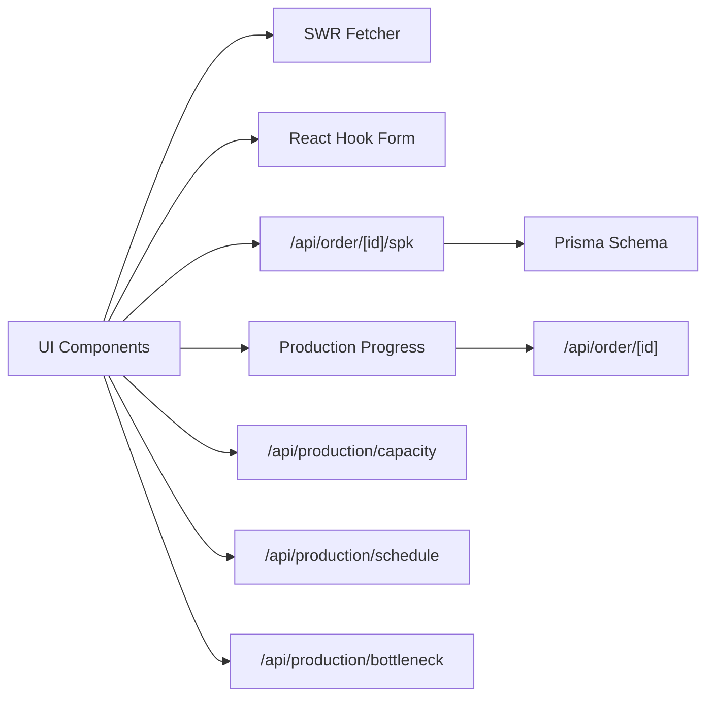

# Production Tracking & Progress

<cite>
**Referenced Files in This Document**
- [spk-card.tsx](file://src/app/(LoggedIn)/order/[id]/components/spk-card.tsx)
- [spk-form-modal.tsx](file://src/app/(LoggedIn)/order/[id]/components/spk-form-modal.tsx)
- [produksi-progress.tsx](file://src/app/(LoggedIn)/order/[id]/components/produksi-progress.tsx)
- [order-info-card.tsx](file://src/app/(LoggedIn)/order/[id]/components/order-info-card.tsx)
- [order-items-table.tsx](file://src/app/(LoggedIn)/order/[id]/components/order-items-table.tsx)
- [update-status-modal.tsx](file://src/app/(LoggedIn)/order/list/components/update-status-modal.tsx)
- [order-toolbar.tsx](file://src/app/(LoggedIn)/order/list/components/order-toolbar.tsx)
- [order-card.tsx](file://src/app/(LoggedIn)/order/list/components/order-card.tsx)
- [order.ts](file://src/lib/orders.ts)
- [route.ts](file://src/app/api/order/[id]/route.ts)
- [route.ts](file://src/app/api/order/[id]/spk/route.ts)
- [route.ts](file://src/app/api/production/schedule/route.ts)
- [route.ts](file://src/app/api/production/capacity/route.ts)
- [route.ts](file://src/app/api/production/bottleneck/route.ts)
- [route.ts](file://src/app/api/reports/production/performance/route.ts)
- [schema.prisma](file://prisma/schema.prisma)
</cite>

## Table of Contents
1. [Introduction](#introduction)
2. [Project Structure](#project-structure)
3. [Core Components](#core-components)
4. [Architecture Overview](#architecture-overview)
5. [Detailed Component Analysis](#detailed-component-analysis)
6. [Dependency Analysis](#dependency-analysis)
7. [Performance Considerations](#performance-considerations)
8. [Troubleshooting Guide](#troubleshooting-guide)
9. [Conclusion](#conclusion)
10. [Appendices](#appendices)

## Introduction
This document explains the production tracking and progress monitoring system, focusing on:
- Production progress visualization and work order status updates
- Real-time production metrics and completion percentage calculations
- SPK card interface for viewing and editing production assignments
- SPK form modal for creating production work orders and initiating production
- Production capacity monitoring, bottleneck identification, and resource allocation optimization
- Integration points with order management, production scheduling, and capacity planning

The system centers around the Order module’s SPK (Work Order) lifecycle and the production progress visualization that reflects stage transitions from PENDING to DESAIN to PRODUKSI to PACKING to SELESAI.

## Project Structure
The production tracking features are primarily implemented under the Order module with reusable UI components and API routes supporting SPK creation, updates, and progress tracking. Supporting APIs exist for capacity monitoring, bottleneck detection, and performance analytics.

**Diagram sources**
- [spk-form-modal.tsx:1-274](file://src/app/(LoggedIn)/order/[id]/components/spk-form-modal.tsx#L1-L274)
- [spk-card.tsx:1-347](file://src/app/(LoggedIn)/order/[id]/components/spk-card.tsx#L1-L347)
- [produksi-progress.tsx:1-63](file://src/app/(LoggedIn)/order/[id]/components/produksi-progress.tsx#L1-L63)
- [order-info-card.tsx](file://src/app/(LoggedIn)/order/[id]/components/order-info-card.tsx)
- [order-items-table.tsx](file://src/app/(LoggedIn)/order/[id]/components/order-items-table.tsx)
- [order-toolbar.tsx](file://src/app/(LoggedIn)/order/list/components/order-toolbar.tsx)
- [update-status-modal.tsx](file://src/app/(LoggedIn)/order/list/components/update-status-modal.tsx)
- [order-card.tsx](file://src/app/(LoggedIn)/order/list/components/order-card.tsx)
- [route.ts](file://src/app/api/order/[id]/spk/route.ts)
- [route.ts](file://src/app/api/order/[id]/route.ts)
- [route.ts](file://src/app/api/production/schedule/route.ts)
- [route.ts](file://src/app/api/production/capacity/route.ts)
- [route.ts](file://src/app/api/production/bottleneck/route.ts)
- [route.ts](file://src/app/api/reports/production/performance/route.ts)
- [schema.prisma](file://prisma/schema.prisma)

**Section sources**
- [spk-form-modal.tsx:1-274](file://src/app/(LoggedIn)/order/[id]/components/spk-form-modal.tsx#L1-L274)
- [spk-card.tsx:1-347](file://src/app/(LoggedIn)/order/[id]/components/spk-card.tsx#L1-L347)
- [produksi-progress.tsx:1-63](file://src/app/(LoggedIn)/order/[id]/components/produksi-progress.tsx#L1-L63)
- [order-info-card.tsx](file://src/app/(LoggedIn)/order/[id]/components/order-info-card.tsx)
- [order-items-table.tsx](file://src/app/(LoggedIn)/order/[id]/components/order-items-table.tsx)
- [order-toolbar.tsx](file://src/app/(LoggedIn)/order/list/components/order-toolbar.tsx)
- [update-status-modal.tsx](file://src/app/(LoggedIn)/order/list/components/update-status-modal.tsx)
- [order-card.tsx](file://src/app/(LoggedIn)/order/list/components/order-card.tsx)
- [route.ts](file://src/app/api/order/[id]/spk/route.ts)
- [route.ts](file://src/app/api/order/[id]/route.ts)
- [route.ts](file://src/app/api/production/schedule/route.ts)
- [route.ts](file://src/app/api/production/capacity/route.ts)
- [route.ts](file://src/app/api/production/bottleneck/route.ts)
- [route.ts](file://src/app/api/reports/production/performance/route.ts)
- [schema.prisma](file://prisma/schema.prisma)

## Core Components
- SPK Form Modal: Creates a production work order and advances order status to PRODUKSI.
- SPK Card: Displays and edits SPK details, toggles ACC Cetak, and refreshes parent views.
- Production Progress: Visualizes production stages and current status with badges and transitions.
- Order Info and Items: Provides context for SPK creation and progress tracking.
- Order List Controls: Toolbar and status update modal for managing order lifecycles.

Key capabilities:
- Real-time SPK updates via client-side forms and API routes
- Status-driven progress visualization
- Completion percentage derived from order item quantities and SPK quantities
- Integration with order management for status transitions

**Section sources**
- [spk-form-modal.tsx:1-274](file://src/app/(LoggedIn)/order/[id]/components/spk-form-modal.tsx#L1-L274)
- [spk-card.tsx:1-347](file://src/app/(LoggedIn)/order/[id]/components/spk-card.tsx#L1-L347)
- [produksi-progress.tsx:1-63](file://src/app/(LoggedIn)/order/[id]/components/produksi-progress.tsx#L1-L63)
- [order-info-card.tsx](file://src/app/(LoggedIn)/order/[id]/components/order-info-card.tsx)
- [order-items-table.tsx](file://src/app/(LoggedIn)/order/[id]/components/order-items-table.tsx)
- [order-toolbar.tsx](file://src/app/(LoggedIn)/order/list/components/order-toolbar.tsx)
- [update-status-modal.tsx](file://src/app/(LoggedIn)/order/list/components/update-status-modal.tsx)
- [order-card.tsx](file://src/app/(LoggedIn)/order/list/components/order-card.tsx)

## Architecture Overview
The production tracking system integrates UI components with backend API routes and Prisma models. The SPK lifecycle is initiated through the SPK Form Modal, persisted via the SPK API route, and reflected in the SPK Card and Production Progress visualization.

**Diagram sources**
- [spk-form-modal.tsx:100-124](file://src/app/(LoggedIn)/order/[id]/components/spk-form-modal.tsx#L100-L124)
- [route.ts](file://src/app/api/order/[id]/spk/route.ts)
- [schema.prisma](file://prisma/schema.prisma)

**Section sources**
- [spk-form-modal.tsx:100-124](file://src/app/(LoggedIn)/order/[id]/components/spk-form-modal.tsx#L100-L124)
- [route.ts](file://src/app/api/order/[id]/spk/route.ts)
- [schema.prisma](file://prisma/schema.prisma)

## Detailed Component Analysis

### SPK Card Interface
The SPK Card displays production assignment details and allows editing and toggling ACC Cetak. It fetches active workers, validates inputs, and persists updates via PUT/PATCH requests.

**Diagram sources**
- [spk-card.tsx:68-110](file://src/app/(LoggedIn)/order/[id]/components/spk-card.tsx#L68-L110)
- [spk-card.tsx:144-255](file://src/app/(LoggedIn)/order/[id]/components/spk-card.tsx#L144-L255)
- [route.ts](file://src/app/api/order/[id]/spk/route.ts)

**Section sources**
- [spk-card.tsx:1-347](file://src/app/(LoggedIn)/order/[id]/components/spk-card.tsx#L1-L347)
- [route.ts](file://src/app/api/order/[id]/spk/route.ts)

### SPK Form Modal for Production Updates
The SPK Form Modal suggests defaults from order items, validates required fields, and creates a new SPK while transitioning the order status to PRODUKSI.

**Diagram sources**
- [spk-form-modal.tsx:58-98](file://src/app/(LoggedIn)/order/[id]/components/spk-form-modal.tsx#L58-L98)
- [spk-form-modal.tsx:100-124](file://src/app/(LoggedIn)/order/[id]/components/spk-form-modal.tsx#L100-L124)
- [route.ts](file://src/app/api/order/[id]/spk/route.ts)
- [route.ts](file://src/app/api/order/[id]/route.ts)

**Section sources**
- [spk-form-modal.tsx:1-274](file://src/app/(LoggedIn)/order/[id]/components/spk-form-modal.tsx#L1-L274)
- [route.ts](file://src/app/api/order/[id]/spk/route.ts)
- [route.ts](file://src/app/api/order/[id]/route.ts)

### Production Progress Visualization
The Production Progress component renders a step-by-step visualization of the production pipeline and highlights the current stage.

**Diagram sources**
- [produksi-progress.tsx:14-62](file://src/app/(LoggedIn)/order/[id]/components/produksi-progress.tsx#L14-L62)

**Section sources**
- [produksi-progress.tsx:1-63](file://src/app/(LoggedIn)/order/[id]/components/produksi-progress.tsx#L1-L63)

### Work Order Modifications and Progress Reporting
- Editing SPK details updates worker, model, sizes, quantities, deadlines, and notes.
- Toggling ACC Cetak marks approval status and records approver metadata.
- Progress reporting leverages order items and SPK quantities to compute completion percentages.

**Diagram sources**
- [spk-form-modal.tsx:23-31](file://src/app/(LoggedIn)/order/[id]/components/spk-form-modal.tsx#L23-L31)
- [spk-card.tsx:17-18](file://src/app/(LoggedIn)/order/[id]/components/spk-card.tsx#L17-L18)

**Section sources**
- [spk-form-modal.tsx:23-31](file://src/app/(LoggedIn)/order/[id]/components/spk-form-modal.tsx#L23-L31)
- [spk-card.tsx:17-18](file://src/app/(LoggedIn)/order/[id]/components/spk-card.tsx#L17-L18)

### Completion Percentage Calculations
Completion percentage can be computed as:
- Sum of SPK quantities / Sum of order item quantities × 100
- Updated whenever SPK quantity changes or order items change

[No sources needed since this diagram shows conceptual workflow, not actual code structure]

### Production Capacity Monitoring, Bottleneck Identification, and Resource Allocation
- Capacity monitoring: Track available workers and workload distribution via production APIs.
- Bottleneck identification: Analyze throughput per stage and worker utilization.
- Resource allocation optimization: Balance workload across workers and adjust deadlines.

**Diagram sources**
- [route.ts](file://src/app/api/production/capacity/route.ts)
- [route.ts](file://src/app/api/production/schedule/route.ts)
- [route.ts](file://src/app/api/production/bottleneck/route.ts)

**Section sources**
- [route.ts](file://src/app/api/production/capacity/route.ts)
- [route.ts](file://src/app/api/production/schedule/route.ts)
- [route.ts](file://src/app/api/production/bottleneck/route.ts)

### Integration with Order Management, Production Scheduling, and Capacity Planning
- Order Management: SPK creation triggers order status to PRODUKSI; status updates propagate to UI.
- Production Scheduling: Schedule API coordinates planned vs. actual production timelines.
- Capacity Planning: Capacity API informs resource availability and constraints.

**Diagram sources**
- [route.ts](file://src/app/api/order/[id]/spk/route.ts)
- [route.ts](file://src/app/api/order/[id]/route.ts)
- [route.ts](file://src/app/api/production/capacity/route.ts)
- [route.ts](file://src/app/api/production/schedule/route.ts)

**Section sources**
- [route.ts](file://src/app/api/order/[id]/spk/route.ts)
- [route.ts](file://src/app/api/order/[id]/route.ts)
- [route.ts](file://src/app/api/production/capacity/route.ts)
- [route.ts](file://src/app/api/production/schedule/route.ts)

## Dependency Analysis
- UI components depend on SWR for fetching active workers and on react-hook-form for validation.
- SPK operations rely on API routes under /api/order/[id]/spk.
- Production progress depends on order status and shared badge utilities.
- Capacity, schedule, and bottleneck APIs support operational insights.

**Diagram sources**
- [spk-card.tsx:43-46](file://src/app/(LoggedIn)/order/[id]/components/spk-card.tsx#L43-L46)
- [spk-form-modal.tsx:68-73](file://src/app/(LoggedIn)/order/[id]/components/spk-form-modal.tsx#L68-L73)
- [route.ts](file://src/app/api/order/[id]/spk/route.ts)
- [schema.prisma](file://prisma/schema.prisma)
- [produksi-progress.tsx:4](file://src/app/(LoggedIn)/order/[id]/components/produksi-progress.tsx#L4)
- [route.ts](file://src/app/api/order/[id]/route.ts)
- [route.ts](file://src/app/api/production/capacity/route.ts)
- [route.ts](file://src/app/api/production/schedule/route.ts)
- [route.ts](file://src/app/api/production/bottleneck/route.ts)

**Section sources**
- [spk-card.tsx:43-46](file://src/app/(LoggedIn)/order/[id]/components/spk-card.tsx#L43-L46)
- [spk-form-modal.tsx:68-73](file://src/app/(LoggedIn)/order/[id]/components/spk-form-modal.tsx#L68-L73)
- [route.ts](file://src/app/api/order/[id]/spk/route.ts)
- [schema.prisma](file://prisma/schema.prisma)
- [produksi-progress.tsx:4](file://src/app/(LoggedIn)/order/[id]/components/produksi-progress.tsx#L4)
- [route.ts](file://src/app/api/order/[id]/route.ts)
- [route.ts](file://src/app/api/production/capacity/route.ts)
- [route.ts](file://src/app/api/production/schedule/route.ts)
- [route.ts](file://src/app/api/production/bottleneck/route.ts)

## Performance Considerations
- Minimize re-renders by using controlled inputs and memoized suggestions in modals.
- Debounce network requests when validating inputs to reduce API churn.
- Use SWR caching for active worker lists to avoid repeated fetches.
- Batch UI updates after SPK creation or edits to prevent excessive re-renders.

[No sources needed since this section provides general guidance]

## Troubleshooting Guide
Common issues and resolutions:
- Network errors during SPK creation/edit: Verify connectivity and retry; display global error messages.
- Validation failures: Ensure required fields (worker, quantity) are filled; show field-specific error messages.
- Status not updating: Confirm order status transitions occur after SPK creation; refresh UI on success.
- ACC Cetak toggle failure: Check PATCH endpoint response and notify user on failure.

**Section sources**
- [spk-form-modal.tsx:100-124](file://src/app/(LoggedIn)/order/[id]/components/spk-form-modal.tsx#L100-L124)
- [spk-card.tsx:68-87](file://src/app/(LoggedIn)/order/[id]/components/spk-card.tsx#L68-L87)
- [spk-card.tsx:89-110](file://src/app/(LoggedIn)/order/[id]/components/spk-card.tsx#L89-L110)

## Conclusion
The production tracking system provides a cohesive workflow for creating, editing, and monitoring SPKs, visualizing production progress, and integrating with order management and capacity planning. By leveraging validated forms, real-time updates, and modular UI components, teams can efficiently track progress, identify bottlenecks, and optimize resource allocation.

[No sources needed since this section summarizes without analyzing specific files]

## Appendices

### Example Scenarios and Workflows
- Creating a SPK: Open the SPK Form Modal, select a worker, fill model/size/tali, enter quantity and deadline, submit to create SPK and move order to PRODUKSI.
- Updating SPK details: Use the SPK Card edit mode to modify worker, model, sizes, quantities, and notes; save changes via PUT.
- Approving SPK: Toggle ACC Cetak to approve production readiness; the system records approver and timestamp.
- Monitoring progress: View the Production Progress component to see current stage and historical completions.
- Capacity and bottleneck insights: Query capacity, schedule, and bottleneck endpoints to inform optimization decisions.

[No sources needed since this section provides general guidance]