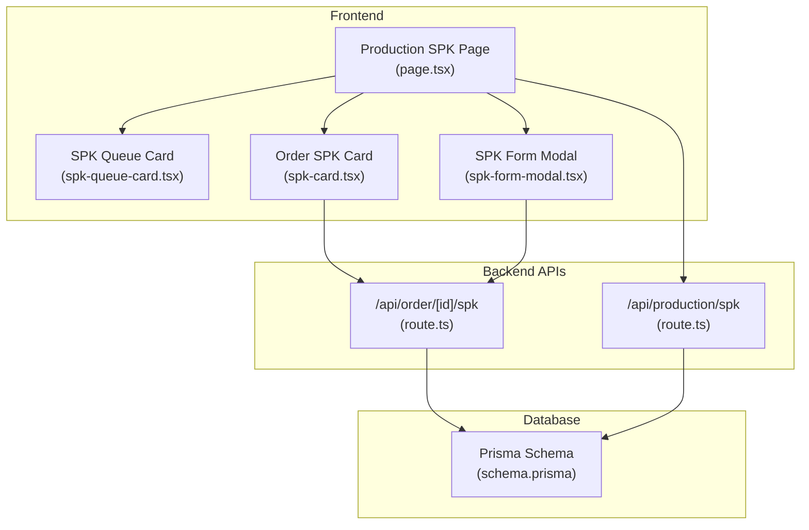
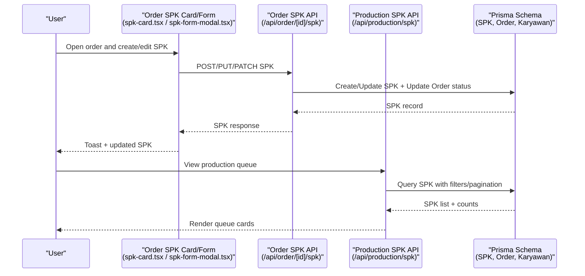
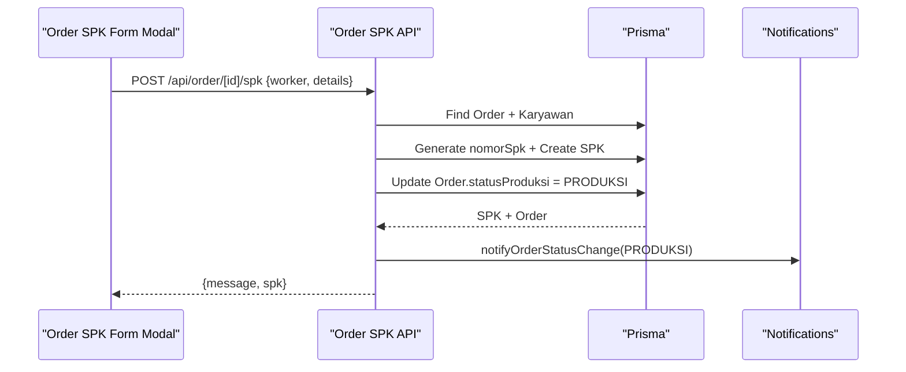
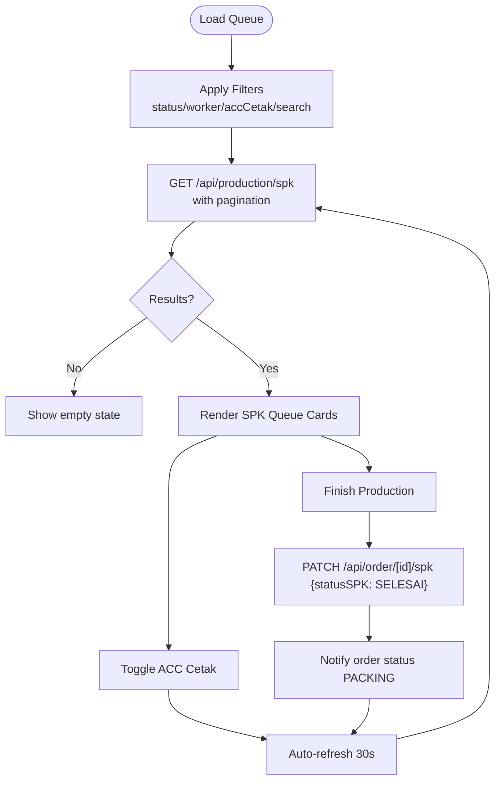
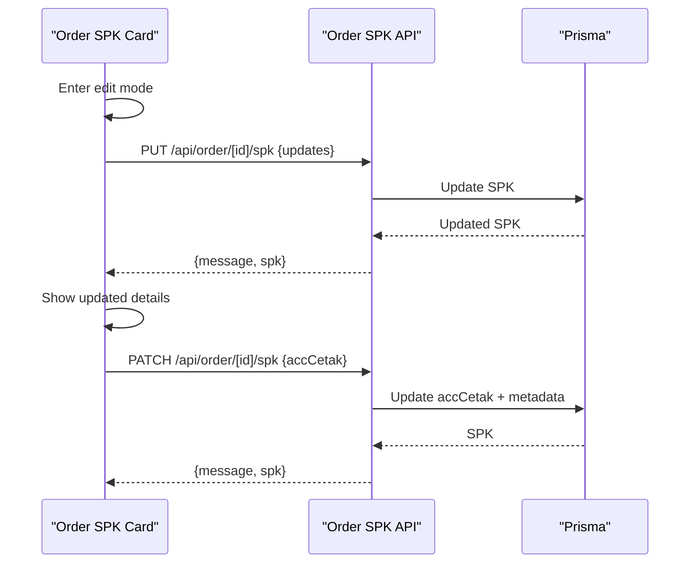
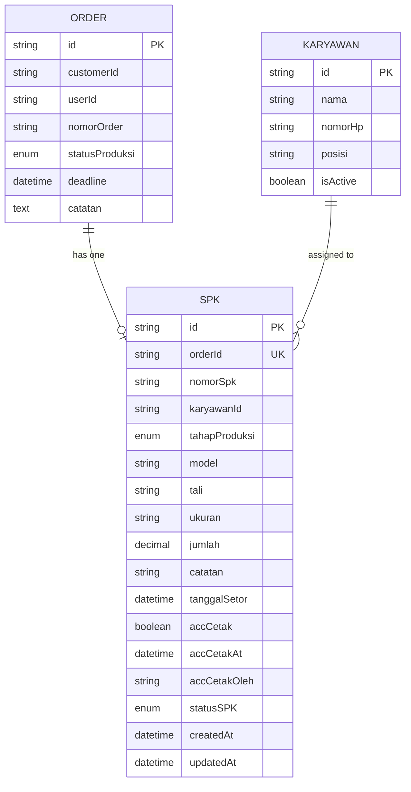
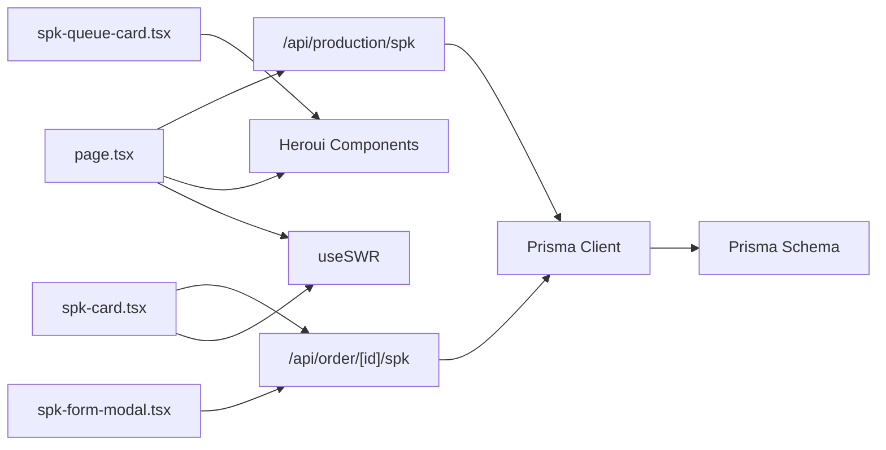

# SPK (Work Order) System

<cite>
**Referenced Files in This Document**
- [route.ts](file://src/app/api/order/[id]/spk/route.ts)
- [route.ts](file://src/app/api/production/spk/route.ts)
- [spk-queue-card.tsx](file://src/app/(LoggedIn)/production/spk/components/spk-queue-card.tsx)
- [page.tsx](file://src/app/(LoggedIn)/production/spk/page.tsx)
- [spk-card.tsx](file://src/app/(LoggedIn)/order/[id]/components/spk-card.tsx)
- [spk-form-modal.tsx](file://src/app/(LoggedIn)/order/[id]/components/spk-form-modal.tsx)
- [schema.prisma](file://prisma/schema.prisma)
</cite>

## Table of Contents
1. [Introduction](#introduction)
2. [Project Structure](#project-structure)
3. [Core Components](#core-components)
4. [Architecture Overview](#architecture-overview)
5. [Detailed Component Analysis](#detailed-component-analysis)
6. [Dependency Analysis](#dependency-analysis)
7. [Performance Considerations](#performance-considerations)
8. [Troubleshooting Guide](#troubleshooting-guide)
9. [Conclusion](#conclusion)

## Introduction
This document describes the SPK (Work Order) system that manages production work orders from approved designs through completion. It covers SPK generation from orders, assignment to production staff, real-time queue monitoring, status transitions, and integration with order lifecycle updates. It also documents the SPK queue card interface, work order details display, production timeline management, and capacity planning considerations. Examples of workflows, bottleneck identification, and efficiency optimization strategies are included, along with completion verification, quality checkpoints, and reporting integration.

## Project Structure
The SPK system spans frontend pages, shared UI components, and backend APIs:
- Production queue page and queue card component for monitoring and actions
- Order-level SPK card and form modal for creation and editing
- Backend routes for SPK CRUD and filtering
- Prisma schema defining SPK, Order, and Karyawan relations and enums

**Diagram sources**
- [page.tsx](file://src/app/(LoggedIn)/production/spk/page.tsx#L1-L336)
- [spk-queue-card.tsx](file://src/app/(LoggedIn)/production/spk/components/spk-queue-card.tsx#L1-L299)
- [spk-card.tsx](file://src/app/(LoggedIn)/order/[id]/components/spk-card.tsx#L1-L347)
- [spk-form-modal.tsx](file://src/app/(LoggedIn)/order/[id]/components/spk-form-modal.tsx#L1-L274)
- [route.ts:1-273](file://src/app/api/order/[id]/spk/route.ts#L1-L273)
- [route.ts:1-107](file://src/app/api/production/spk/route.ts#L1-L107)
- [schema.prisma:346-374](file://prisma/schema.prisma#L346-L374)

**Section sources**
- [page.tsx](file://src/app/(LoggedIn)/production/spk/page.tsx#L1-L336)
- [spk-queue-card.tsx](file://src/app/(LoggedIn)/production/spk/components/spk-queue-card.tsx#L1-L299)
- [spk-card.tsx](file://src/app/(LoggedIn)/order/[id]/components/spk-card.tsx#L1-L347)
- [spk-form-modal.tsx](file://src/app/(LoggedIn)/order/[id]/components/spk-form-modal.tsx#L1-L274)
- [route.ts:1-273](file://src/app/api/order/[id]/spk/route.ts#L1-L273)
- [route.ts:1-107](file://src/app/api/production/spk/route.ts#L1-L107)
- [schema.prisma:346-374](file://prisma/schema.prisma#L346-L374)

## Core Components
- SPK API endpoints:
  - GET /api/order/[id]/spk: Retrieve SPK for an order
  - POST /api/order/[id]/spk: Create SPK and atomically move order to PRODUKSI
  - PUT /api/order/[id]/spk: Update SPK details
  - PATCH /api/order/[id]/spk: Toggle accCetak or mark SPK status (e.g., SELESAI)
  - GET /api/production/spk: List SPK with filters, pagination, and search
- SPK queue card component: Displays SPK info, deadlines, status badges, ACC Cetak switch, and “Finish Production” action
- Order-level SPK card and form modal: Create/edit SPK, assign worker, set model/size/accessories/quantity/deadline, and toggle ACC Cetak
- Prisma models and enums: SPK, Order, Karyawan, StatusSPK, StatusProduksi

Key capabilities:
- Atomic creation of SPK and order status update
- Real-time queue with auto-refresh and filters
- Worker assignment and deadline tracking
- Status transitions: PRODUKSI → SELESAI (PACKING)
- Resource allocation via worker selection and quantity tracking

**Section sources**
- [route.ts:37-151](file://src/app/api/order/[id]/spk/route.ts#L37-L151)
- [route.ts:153-213](file://src/app/api/order/[id]/spk/route.ts#L153-L213)
- [route.ts:215-272](file://src/app/api/order/[id]/spk/route.ts#L215-L272)
- [route.ts:15-107](file://src/app/api/production/spk/route.ts#L15-L107)
- [spk-queue-card.tsx](file://src/app/(LoggedIn)/production/spk/components/spk-queue-card.tsx#L21-L96)
- [spk-card.tsx](file://src/app/(LoggedIn)/order/[id]/components/spk-card.tsx#L38-L120)
- [spk-form-modal.tsx](file://src/app/(LoggedIn)/order/[id]/components/spk-form-modal.tsx#L50-L125)
- [schema.prisma:346-374](file://prisma/schema.prisma#L346-L374)
- [schema.prisma:509-515](file://prisma/schema.prisma#L509-L515)
- [schema.prisma:526-533](file://prisma/schema.prisma#L526-L533)

## Architecture Overview
End-to-end flow from order approval to SPK completion:

**Diagram sources**
- [spk-card.tsx](file://src/app/(LoggedIn)/order/[id]/components/spk-card.tsx#L68-L110)
- [spk-form-modal.tsx](file://src/app/(LoggedIn)/order/[id]/components/spk-form-modal.tsx#L100-L124)
- [route.ts:59-151](file://src/app/api/order/[id]/spk/route.ts#L59-L151)
- [route.ts:15-107](file://src/app/api/production/spk/route.ts#L15-L107)
- [schema.prisma:346-374](file://prisma/schema.prisma#L346-L374)

## Detailed Component Analysis

### SPK Creation and Assignment Workflow
- Creation endpoint validates order existence, ensures no duplicate SPK, checks required fields, verifies worker exists, generates unique SPK number, and creates SPK with status AKTIF while atomically moving order to PRODUKSI. Notifications are sent upon status change.
- The order-level SPK card/form modal supports:
  - Worker selection from active employees
  - Model/size/accessories/quantity/deadline inputs
  - ACC Cetak toggle
  - Submission triggers atomic creation and order status update

**Diagram sources**
- [route.ts:59-151](file://src/app/api/order/[id]/spk/route.ts#L59-L151)
- [spk-form-modal.tsx](file://src/app/(LoggedIn)/order/[id]/components/spk-form-modal.tsx#L100-L124)

**Section sources**
- [route.ts:59-151](file://src/app/api/order/[id]/spk/route.ts#L59-L151)
- [spk-form-modal.tsx](file://src/app/(LoggedIn)/order/[id]/components/spk-form-modal.tsx#L50-L125)

### SPK Queue Management and Status Updates
- The production queue page:
  - Fetches SPK list with filters (status, worker, ACC Cetak), search, pagination
  - Auto-refreshes every 30 seconds
  - Provides quick ACC Cetak toggling and “Finish Production” action
- Queue card displays:
  - Order number, customer, worker, model/size/tali, quantity, items, notes
  - Deadline warnings (overdue, due soon)
  - ACC Cetak switch and “Finish Production” button disabled until ACC Cetak is enabled

**Diagram sources**
- [page.tsx](file://src/app/(LoggedIn)/production/spk/page.tsx#L79-L138)
- [route.ts:15-107](file://src/app/api/production/spk/route.ts#L15-L107)
- [spk-queue-card.tsx](file://src/app/(LoggedIn)/production/spk/components/spk-queue-card.tsx#L91-L275)

**Section sources**
- [page.tsx](file://src/app/(LoggedIn)/production/spk/page.tsx#L56-L336)
- [spk-queue-card.tsx](file://src/app/(LoggedIn)/production/spk/components/spk-queue-card.tsx#L21-L275)
- [route.ts:15-107](file://src/app/api/production/spk/route.ts#L15-L107)

### Work Order Details Display and Modification
- Order-level SPK card:
  - Shows current worker, model/size/tali, quantity, deadline, notes
  - Edit mode allows updating worker, model/size/tali, quantity, deadline, notes
  - ACC Cetak toggle updates SPK and records who approved and when
- Form modal pre-fills model suggestion from order items and total quantity

**Diagram sources**
- [spk-card.tsx](file://src/app/(LoggedIn)/order/[id]/components/spk-card.tsx#L68-L110)
- [route.ts:153-213](file://src/app/api/order/[id]/spk/route.ts#L153-L213)
- [route.ts:215-272](file://src/app/api/order/[id]/spk/route.ts#L215-L272)

**Section sources**
- [spk-card.tsx](file://src/app/(LoggedIn)/order/[id]/components/spk-card.tsx#L38-L347)
- [spk-form-modal.tsx](file://src/app/(LoggedIn)/order/[id]/components/spk-form-modal.tsx#L50-L274)
- [route.ts:153-272](file://src/app/api/order/[id]/spk/route.ts#L153-L272)

### Data Model and Enums
SPK model integrates with Order and Karyawan, and uses enums for statuses:
- SPK fields: unique orderId, nomorSpk, worker, production stage, model/tali/size, quantity, notes, deadline, ACC Cetak timestamps and approver, SPK status, timestamps
- Order: links to SPK, tracks production status
- Karyawan: worker reference
- Enums: StatusSPK (DRAFT/AKTIF/SELESAI/REVISI/BATAL), StatusProduksi (PENDING/DESAIN/PRODUKSI/PACKING/SELESAI/BATAL)

**Diagram sources**
- [schema.prisma:260-296](file://prisma/schema.prisma#L260-L296)
- [schema.prisma:332-344](file://prisma/schema.prisma#L332-L344)
- [schema.prisma:346-374](file://prisma/schema.prisma#L346-L374)
- [schema.prisma:509-515](file://prisma/schema.prisma#L509-L515)
- [schema.prisma:526-533](file://prisma/schema.prisma#L526-L533)

**Section sources**
- [schema.prisma:346-374](file://prisma/schema.prisma#L346-L374)
- [schema.prisma:509-515](file://prisma/schema.prisma#L509-L515)
- [schema.prisma:526-533](file://prisma/schema.prisma#L526-L533)

## Dependency Analysis
- Frontend depends on:
  - SWR for data fetching and caching
  - Heroui components for UI
  - Zod forms for validation
- Backend depends on:
  - Prisma ORM for database operations
  - Authentication middleware for role-based access
  - Notification service for order status updates
- Database schema defines foreign keys and indexes for performance and referential integrity

**Diagram sources**
- [page.tsx](file://src/app/(LoggedIn)/production/spk/page.tsx#L1-L336)
- [spk-queue-card.tsx](file://src/app/(LoggedIn)/production/spk/components/spk-queue-card.tsx#L1-L299)
- [spk-card.tsx](file://src/app/(LoggedIn)/order/[id]/components/spk-card.tsx#L1-L347)
- [spk-form-modal.tsx](file://src/app/(LoggedIn)/order/[id]/components/spk-form-modal.tsx#L1-L274)
- [route.ts:1-273](file://src/app/api/order/[id]/spk/route.ts#L1-L273)
- [route.ts:1-107](file://src/app/api/production/spk/route.ts#L1-L107)
- [schema.prisma:346-374](file://prisma/schema.prisma#L346-L374)

**Section sources**
- [page.tsx](file://src/app/(LoggedIn)/production/spk/page.tsx#L1-L336)
- [spk-queue-card.tsx](file://src/app/(LoggedIn)/production/spk/components/spk-queue-card.tsx#L1-L299)
- [spk-card.tsx](file://src/app/(LoggedIn)/order/[id]/components/spk-card.tsx#L1-L347)
- [spk-form-modal.tsx](file://src/app/(LoggedIn)/order/[id]/components/spk-form-modal.tsx#L1-L274)
- [route.ts:1-273](file://src/app/api/order/[id]/spk/route.ts#L1-L273)
- [route.ts:1-107](file://src/app/api/production/spk/route.ts#L1-L107)
- [schema.prisma:346-374](file://prisma/schema.prisma#L346-L374)

## Performance Considerations
- Pagination and limits: Production SPK listing supports pagination and caps page size to avoid heavy loads
- Auto-refresh interval: Queue page refreshes every 30 seconds to balance freshness and server load
- Filtering: Indexes on karyawanId and production stage support efficient queries
- Atomic operations: SPK creation uses transactions to maintain consistency and reduce partial writes
- Client-side caching: SWR caches requests to minimize redundant network calls

Recommendations:
- Monitor slow queries on large datasets and consider adding composite indexes for frequent filter combinations
- Optimize notifications to batch updates when possible
- Consider server-side rendering for initial page load to improve perceived performance

**Section sources**
- [route.ts:21-27](file://src/app/api/production/spk/route.ts#L21-L27)
- [page.tsx](file://src/app/(LoggedIn)/production/spk/page.tsx#L81-L84)
- [schema.prisma:371-372](file://prisma/schema.prisma#L371-L372)

## Troubleshooting Guide
Common issues and resolutions:
- Unauthorized/Forbidden access: Ensure user roles include admin, kasir, produksi, gudang for queue access; admin, kasir, produksi for SPK operations
- Duplicate SPK: Creation endpoint prevents duplicate SPK per order
- Missing worker: Validation requires a valid worker ID
- Network errors: Form modals and cards surface generic network errors; retry after checking connectivity
- Status transitions: SELESAI requires ACC Cetak to be enabled; ensure ACC Cetak is toggled before finishing production

Operational tips:
- Use the queue filters to isolate overdue or near-deadline SPKs
- Verify ACC Cetak is enabled before attempting to finish production
- Confirm order status transitions align with SPK status (PRODUKSI → PACKING on SELESAI)

**Section sources**
- [route.ts:9-15](file://src/app/api/order/[id]/spk/route.ts#L9-L15)
- [route.ts:6-13](file://src/app/api/production/spk/route.ts#L6-L13)
- [spk-form-modal.tsx](file://src/app/(LoggedIn)/order/[id]/components/spk-form-modal.tsx#L100-L124)
- [page.tsx](file://src/app/(LoggedIn)/production/spk/page.tsx#L89-L138)

## Conclusion
The SPK system provides a robust, role-aware workflow for managing production work orders from approved designs to completion. It offers real-time queue monitoring, deadline tracking, worker assignment, and seamless order status synchronization. The modular frontend components and transactional backend APIs enable scalable production scheduling, capacity planning, and reporting integration. By leveraging filters, auto-refresh, and status-driven transitions, teams can identify bottlenecks, optimize throughput, and maintain quality checkpoints throughout the production cycle.