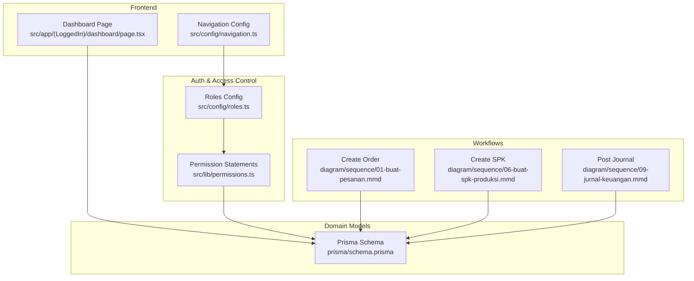
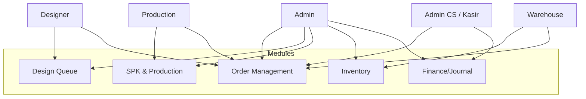
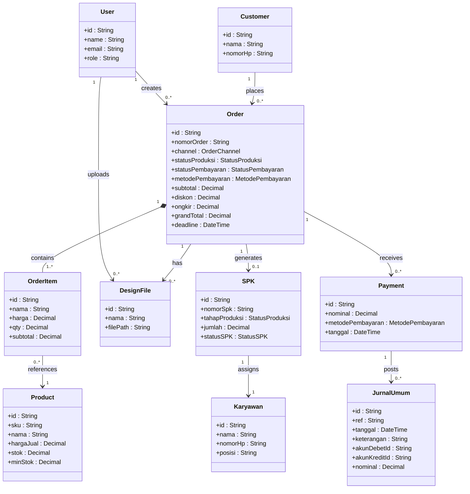
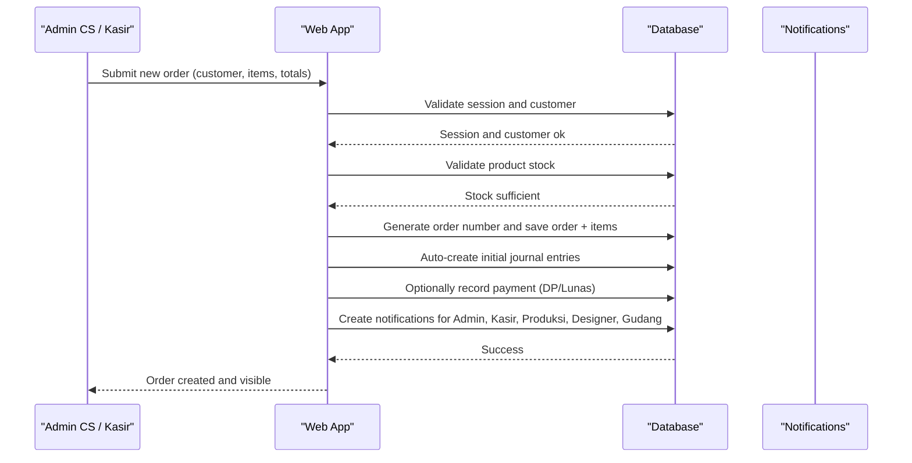
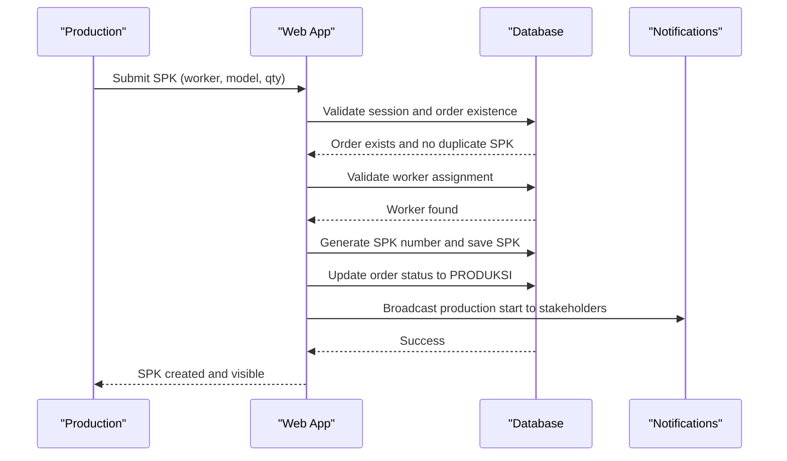
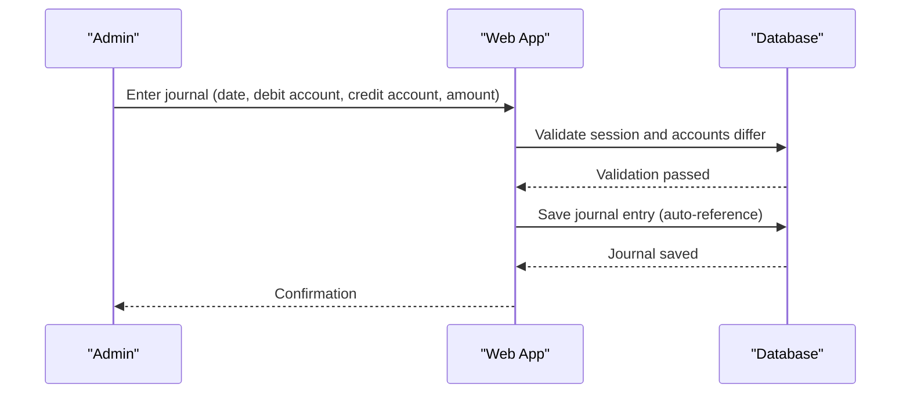
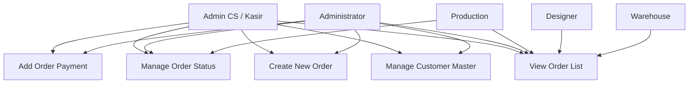
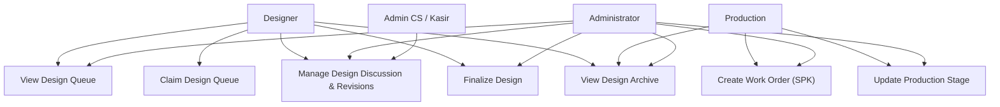
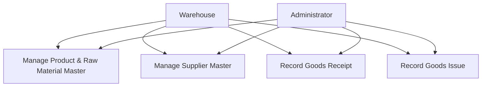
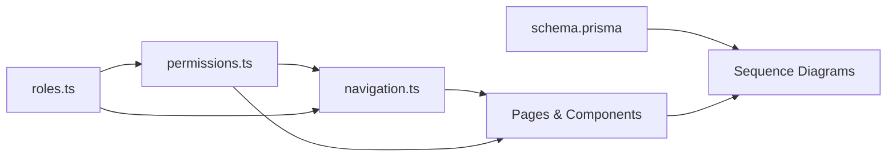

# Business Context & Roles

<cite>
**Referenced Files in This Document**
- [README.md](file://README.md)
- [roles.ts](file://src/config/roles.ts)
- [permissions.ts](file://src/lib/permissions.ts)
- [navigation.ts](file://src/config/navigation.ts)
- [schema.prisma](file://prisma/schema.prisma)
- [dashboard page](file://src/app/(LoggedIn)/dashboard/page.tsx)
- [01-buat-pesanan.mmd](file://diagram/sequence/01-buat-pesanan.mmd)
- [06-buat-spk-produksi.mmd](file://diagram/sequence/06-buat-spk-produksi.mmd)
- [09-jurnal-keuangan.mmd](file://diagram/sequence/09-jurnal-keuangan.mmd)
- [pesanan.puml](file://diagram/usecase/pesanan.puml)
- [desain_produksi.puml](file://diagram/usecase/desain_produksi.puml)
- [inventori_gudang.puml](file://diagram/usecase/inventori_gudang.puml)
- [part1-master-data.plantuml](file://diagram/class/part1-master-data.plantuml)
- [part2-order-desain.plantuml](file://diagram/class/part2-order-desain.plantuml)
</cite>

## Table of Contents
1. [Introduction](#introduction)
2. [Project Structure](#project-structure)
3. [Core Components](#core-components)
4. [Architecture Overview](#architecture-overview)
5. [Detailed Component Analysis](#detailed-component-analysis)
6. [Dependency Analysis](#dependency-analysis)
7. [Performance Considerations](#performance-considerations)
8. [Troubleshooting Guide](#troubleshooting-guide)
9. [Conclusion](#conclusion)
10. [Appendices](#appendices)

## Introduction
This document explains the business context and role-based operations for CV. Haqi Koleksi, a garment manufacturing enterprise. The system integrates Point of Sale (POS), order lifecycle management, production workflow, inventory control, and financial accounting to streamline operations from customer order to finished product delivery. It supports five distinct roles—Administrator, Admin CS/Kasir, Designer, Production, and Warehouse—each with tailored responsibilities and access controls aligned to their operational needs.

## Project Structure
The application is a Next.js 16 app using Prisma ORM and Better Auth for authentication and role-based access control (RBAC). The backend persists data in MySQL, while frontend navigation and module access are governed by centralized role definitions and permission statements. Real-time notifications integrate via Pusher/Soketi, and cloud storage supports asset uploads.

**Diagram sources**
- [dashboard page](file://src/app/(LoggedIn)/dashboard/page.tsx#L151-L475)
- [navigation.ts:35-217](file://src/config/navigation.ts#L35-L217)
- [roles.ts:1-18](file://src/config/roles.ts#L1-L18)
- [permissions.ts:1-67](file://src/lib/permissions.ts#L1-L67)
- [schema.prisma:1-675](file://prisma/schema.prisma#L1-L675)
- [01-buat-pesanan.mmd:1-59](file://diagram/sequence/01-buat-pesanan.mmd#L1-L59)
- [06-buat-spk-produksi.mmd:1-41](file://diagram/sequence/06-buat-spk-produksi.mmd#L1-L41)
- [09-jurnal-keuangan.mmd:1-30](file://diagram/sequence/09-jurnal-keuangan.mmd#L1-L30)

**Section sources**
- [README.md:1-128](file://README.md#L1-L128)
- [roles.ts:1-18](file://src/config/roles.ts#L1-L18)
- [permissions.ts:1-67](file://src/lib/permissions.ts#L1-L67)
- [navigation.ts:1-217](file://src/config/navigation.ts#L1-L217)
- [schema.prisma:1-675](file://prisma/schema.prisma#L1-L675)

## Core Components
- Roles and Access Control
  - Centralized roles configuration defines five roles: Administrator, Admin CS/Kasir, Designer, Production, and Warehouse.
  - Permission statements define granular capabilities per resource (POS, customer, payment, design, production, inventory, finance, report, master).
- Navigation and Module Access
  - Navigation groups and items are role-scoped, ensuring each role sees only relevant menus and submenus.
- Domain Model
  - Prisma schema models core entities: User, Customer, Supplier, Product, Order, OrderItem, DesignFile, SPK, Karyawan, Payments, JurnalUmum, and supporting enums for channels, production stages, payment modes, and review statuses.
- Dashboard
  - The dashboard aggregates sales metrics, recent orders, low stock alerts, and weekly revenue vs expense charts, enabling quick situational awareness across departments.

**Section sources**
- [roles.ts:5-17](file://src/config/roles.ts#L5-L17)
- [permissions.ts:8-21](file://src/lib/permissions.ts#L8-L21)
- [navigation.ts:35-217](file://src/config/navigation.ts#L35-L217)
- [schema.prisma:15-480](file://prisma/schema.prisma#L15-L480)
- [dashboard page](file://src/app/(LoggedIn)/dashboard/page.tsx#L52-L68)

## Architecture Overview
The system follows a layered architecture:
- Presentation Layer: Next.js pages and components with role-aware navigation and dashboards.
- Access Control Layer: Centralized role definitions and permission statements.
- Domain Layer: Prisma models representing business entities and their relationships.
- Workflow Layer: Sequence diagrams illustrate cross-role transactions (order creation, SPK generation, journal posting).
- Notifications: Real-time updates propagate status changes across roles.

**Diagram sources**
- [roles.ts:5-11](file://src/config/roles.ts#L5-L11)
- [permissions.ts:25-67](file://src/lib/permissions.ts#L25-L67)
- [navigation.ts:35-217](file://src/config/navigation.ts#L35-L217)

## Detailed Component Analysis

### Business Domain: Garment Manufacturing at CV. Haqi Koleksi
The system models the end-to-end garment manufacturing workflow:
- Customer orders enter via POS or order management, tracked by channel and payment status.
- Orders progress through design, production (SPK), packing, and completion.
- Inventory tracks raw materials and finished goods, with receipts and issues linked to production.
- Financials record income, expenses, and journals aligned to chart-of-accounts.

**Diagram sources**
- [part2-order-desain.plantuml:29-72](file://diagram/class/part2-order-desain.plantuml#L29-L72)
- [part1-master-data.plantuml:10-61](file://diagram/class/part1-master-data.plantuml#L10-L61)
- [schema.prisma:147-480](file://prisma/schema.prisma#L147-L480)

**Section sources**
- [part1-master-data.plantuml:1-62](file://diagram/class/part1-master-data.plantuml#L1-L62)
- [part2-order-desain.plantuml:1-74](file://diagram/class/part2-order-desain.plantuml#L1-L74)
- [schema.prisma:96-480](file://prisma/schema.prisma#L96-L480)

### Role-Based Operations

#### Administrator
- Full access to all modules, including user management, master data, finance, reports, and RBAC configuration.
- Can approve designs, manage SPK, oversee inventory, and post financial journals.

Responsibilities:
- Manage users and roles
- Oversee all business modules
- Approve design finalization and SPK initiation
- Post journals and reconcile accounts
- Configure system settings and prefixes

Access scope:
- Roles and permissions are defined centrally and enforced across UI and APIs.

**Section sources**
- [roles.ts:6-7](file://src/config/roles.ts#L6-L7)
- [permissions.ts:25-37](file://src/lib/permissions.ts#L25-L37)
- [navigation.ts:198-202](file://src/config/navigation.ts#L198-L202)

#### Admin CS / Kasir
- Primary role for front-line operations: order intake, customer management, payments, and basic finance/report views.
- Can update order/payment status and view production status.

Responsibilities:
- Create new orders and POS transactions
- Record payments and verify receipts
- Manage customer records
- View finance dashboards and reports
- Track order progress

Access scope:
- POS, customer, payment, production view, and finance/report read access.

**Section sources**
- [roles.ts:7-8](file://src/config/roles.ts#L7-L8)
- [permissions.ts:39-47](file://src/lib/permissions.ts#L39-L47)
- [navigation.ts:46-61](file://src/config/navigation.ts#L46-L61)

#### Designer
- Manages design queue, uploads design files, collaborates on revisions, and marks designs as finalized.
- Can view orders and participate in order discussions.

Responsibilities:
- Review and accept/reject design submissions
- Upload design assets
- Coordinate with clients and production
- Finalize designs for production handover

Access scope:
- Design queue, upload/update status, and order view.

**Section sources**
- [roles.ts:8-9](file://src/config/roles.ts#L8-L9)
- [permissions.ts:49-53](file://src/lib/permissions.ts#L49-L53)
- [navigation.ts:62-84](file://src/config/navigation.ts#L62-L84)

#### Production
- Creates and manages SPK (production work orders), updates production stages, and tracks output.
- Can view orders and monitor progress.

Responsibilities:
- Generate SPK from approved orders
- Assign workers and set production targets
- Update production stage and completion status
- Record material issues against SPK

Access scope:
- SPK creation/update and production status view.

**Section sources**
- [roles.ts:9-10](file://src/config/roles.ts#L9-L10)
- [permissions.ts:55-59](file://src/lib/permissions.ts#L55-L59)
- [navigation.ts:62-84](file://src/config/navigation.ts#L62-L84)

#### Warehouse
- Controls inventory of raw materials and finished goods, manages receipts and issues, and views supplier data.
- Can view orders and production-related inventory movements.

Responsibilities:
- Maintain raw material stock levels
- Record incoming and outgoing inventory
- Support production by issuing materials against SPK
- Monitor low stock alerts

Access scope:
- Inventory create/update/view and master supplier view.

**Section sources**
- [roles.ts](file://src/config/roles.ts#L10)
- [permissions.ts:61-66](file://src/lib/permissions.ts#L61-L66)
- [navigation.ts:85-104](file://src/config/navigation.ts#L85-L104)

### Cross-Functional Workflows

#### Order Lifecycle (from customer order to delivery)
This sequence illustrates how roles collaborate end-to-end: POS/Kasir initiates the order, Designer reviews and finalizes design, Production creates SPK and advances stages, Inventory supports material needs, and Finance records payments and journals.

**Diagram sources**
- [01-buat-pesanan.mmd:15-58](file://diagram/sequence/01-buat-pesanan.mmd#L15-L58)
- [schema.prisma:260-419](file://prisma/schema.prisma#L260-L419)

**Section sources**
- [01-buat-pesanan.mmd:1-59](file://diagram/sequence/01-buat-pesanan.mmd#L1-L59)
- [schema.prisma:260-419](file://prisma/schema.prisma#L260-L419)

#### SPK Creation and Production Progression
Once design is finalized, Production creates an SPK, assigns a worker, and progresses the order through stages until completion.

**Diagram sources**
- [06-buat-spk-produksi.mmd:8-40](file://diagram/sequence/06-buat-spk-produksi.mmd#L8-L40)
- [schema.prisma:346-393](file://prisma/schema.prisma#L346-L393)

**Section sources**
- [06-buat-spk-produksi.mmd:1-41](file://diagram/sequence/06-buat-spk-produksi.mmd#L1-L41)
- [schema.prisma:346-393](file://prisma/schema.prisma#L346-L393)

#### Financial Journals and Accounting
Administrators and authorized users can record journals, ensuring balanced debits and credits and proper account classification.

**Diagram sources**
- [09-jurnal-keuangan.mmd:7-29](file://diagram/sequence/09-jurnal-keuangan.mmd#L7-L29)
- [schema.prisma:452-480](file://prisma/schema.prisma#L452-L480)

**Section sources**
- [09-jurnal-keuangan.mmd:1-30](file://diagram/sequence/09-jurnal-keuangan.mmd#L1-L30)
- [schema.prisma:425-480](file://prisma/schema.prisma#L425-L480)

### Use Case Scenarios Across Modules

#### Order Management Use Cases
- Managing customer master data
- Creating new orders and POS transactions
- Viewing order lists
- Recording payments
- Updating order status

**Diagram sources**
- [pesanan.puml:12-38](file://diagram/usecase/pesanan.puml#L12-L38)

**Section sources**
- [pesanan.puml:1-39](file://diagram/usecase/pesanan.puml#L1-L39)

#### Design & Production Use Cases
- Viewing design queue and managing design discussions
- Finalizing designs
- Creating SPK and updating production stages
- Viewing design archives

**Diagram sources**
- [desain_produksi.puml:11-39](file://diagram/usecase/desain_produksi.puml#L11-L39)

**Section sources**
- [desain_produksi.puml:1-41](file://diagram/usecase/desain_produksi.puml#L1-L41)

#### Inventory & Warehouse Use Cases
- Managing product and raw material master data
- Managing supplier data
- Recording receipt and issue of goods

**Diagram sources**
- [inventori_gudang.puml:9-25](file://diagram/usecase/inventori_gudang.puml#L9-L25)

**Section sources**
- [inventori_gudang.puml:1-26](file://diagram/usecase/inventori_gudang.puml#L1-L26)

## Dependency Analysis
- Role definitions feed permission statements, which govern UI navigation and API access.
- Prisma schema defines entities and relationships that drive workflows (orders → SPK → inventory → finance).
- Sequence diagrams depend on schema relationships and role permissions to ensure valid transitions.

**Diagram sources**
- [roles.ts:1-18](file://src/config/roles.ts#L1-L18)
- [permissions.ts:1-67](file://src/lib/permissions.ts#L1-L67)
- [navigation.ts:1-217](file://src/config/navigation.ts#L1-L217)
- [schema.prisma:1-675](file://prisma/schema.prisma#L1-L675)

**Section sources**
- [roles.ts:1-18](file://src/config/roles.ts#L1-L18)
- [permissions.ts:1-67](file://src/lib/permissions.ts#L1-L67)
- [navigation.ts:1-217](file://src/config/navigation.ts#L1-L217)
- [schema.prisma:1-675](file://prisma/schema.prisma#L1-L675)

## Performance Considerations
- Use role-scoped navigation and permission checks to minimize unnecessary data fetching and rendering.
- Batch inventory updates and journal entries to reduce database round-trips.
- Leverage dashboard summaries to avoid frequent heavy queries; cache periodic analytics where appropriate.
- Keep design and production queues lean by limiting concurrent active items per role.

## Troubleshooting Guide
Common issues and resolutions:
- Login/session errors during order creation: Verify session validation and user role before proceeding with order persistence.
- Stock validation failures: Ensure product stock checks occur before saving order items; rollback transaction on failure.
- Duplicate SPK creation: Enforce uniqueness at the database level and prevent SPK recreation for the same order.
- Journal posting errors: Validate that debit and credit accounts differ and that amounts balance; auto-generate reference numbers to avoid duplicates.

**Section sources**
- [01-buat-pesanan.mmd:18-47](file://diagram/sequence/01-buat-pesanan.mmd#L18-L47)
- [06-buat-spk-produksi.mmd:11-24](file://diagram/sequence/06-buat-spk-produksi.mmd#L11-L24)
- [09-jurnal-keuangan.mmd:10-17](file://diagram/sequence/09-jurnal-keuangan.mmd#L10-L17)

## Conclusion
CV. Haqi Koleksi’s integrated system aligns role-based access with the garment manufacturing lifecycle—from customer order through design, production, inventory, and financial reconciliation. The centralized roles and permissions, coupled with clear workflows and dashboards, enable seamless collaboration across departments and efficient end-to-end operations.

## Appendices
- Role summary and focus areas are documented in the project README for quick reference.

**Section sources**
- [README.md:63-72](file://README.md#L63-L72)