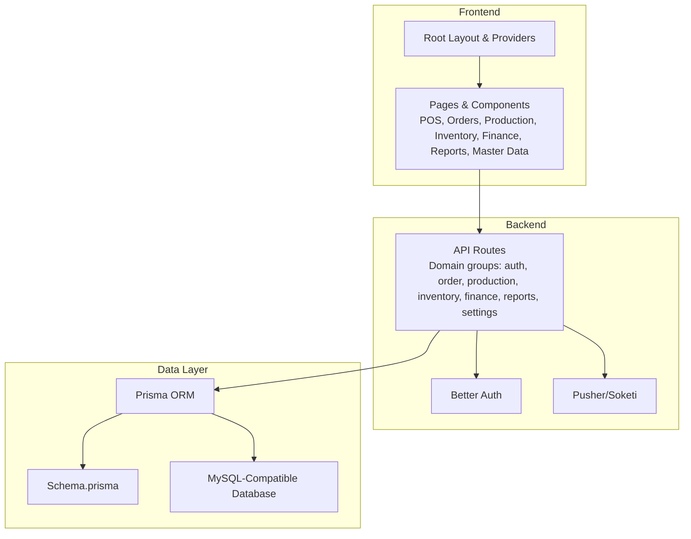
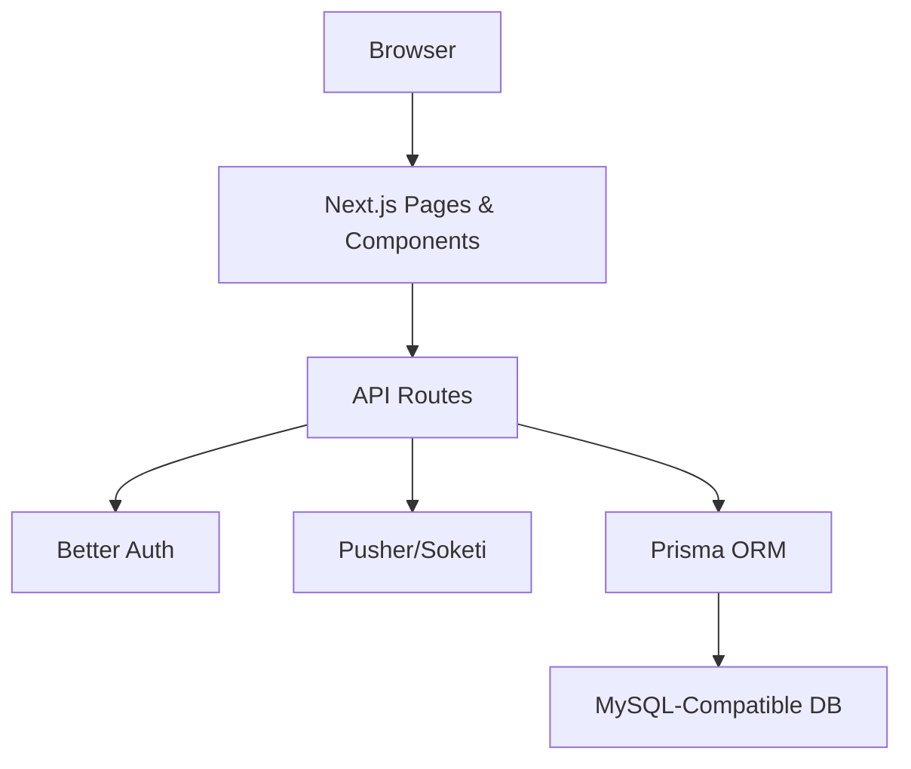
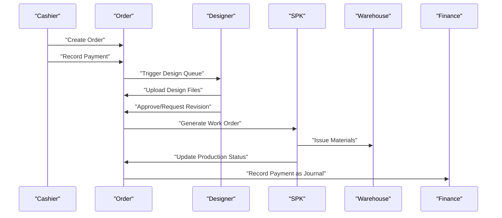
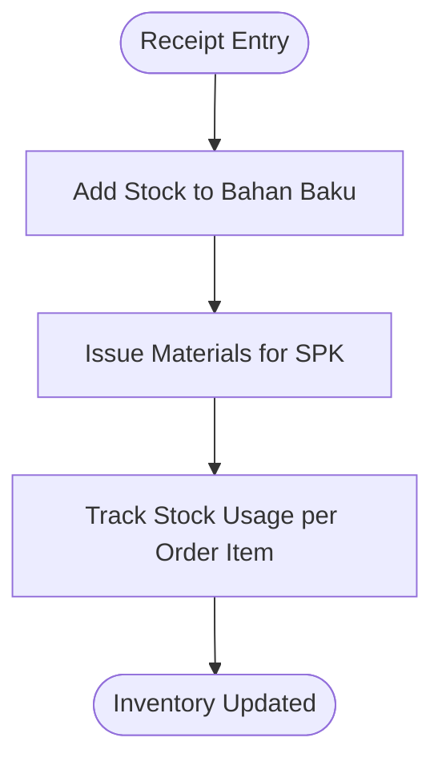
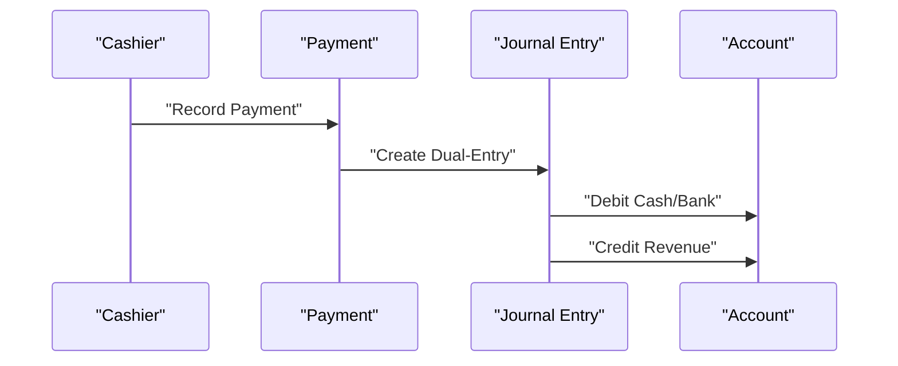
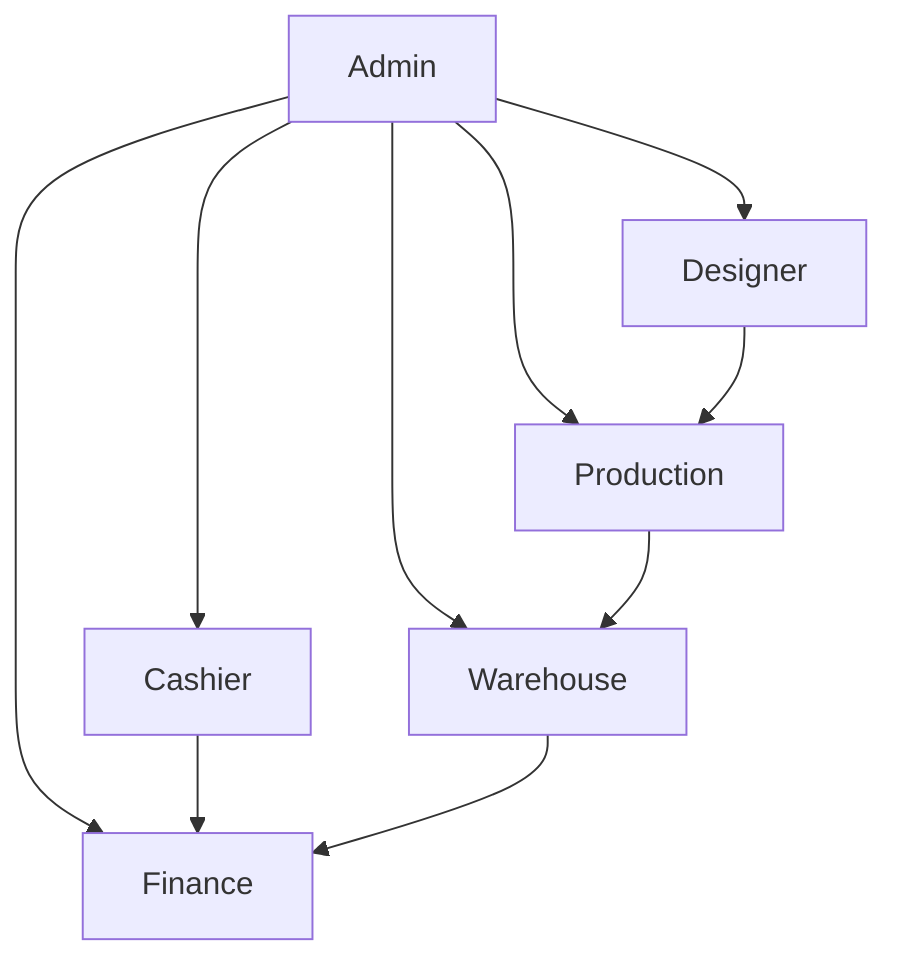
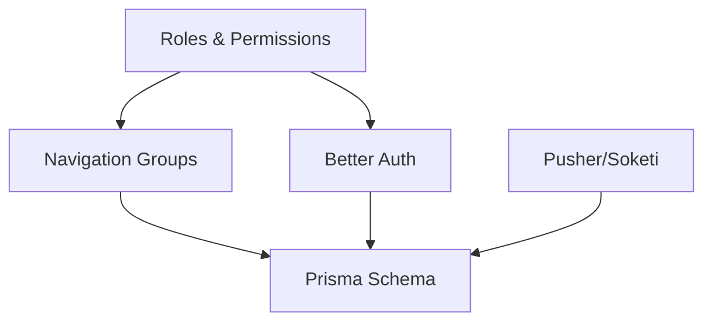

# Introduction

<cite>
**Referenced Files in This Document**
- [README.md](file://README.md)
- [layout.tsx](file://src/app/layout.tsx)
- [navigation.ts](file://src/config/navigation.ts)
- [roles.ts](file://src/config/roles.ts)
- [schema.prisma](file://prisma/schema.prisma)
- [class.plantuml](file://diagram/class.plantuml)
- [dashboard/page.tsx](file://src/app/(LoggedIn)/dashboard/page.tsx)
- [page.tsx](file://src/app/page.tsx)
- [prisma.ts](file://src/lib/prisma.ts)
</cite>

## Table of Contents
1. [Introduction](#introduction)
2. [Project Structure](#project-structure)
3. [Core Components](#core-components)
4. [Architecture Overview](#architecture-overview)
5. [Detailed Component Analysis](#detailed-component-analysis)
6. [Dependency Analysis](#dependency-analysis)
7. [Performance Considerations](#performance-considerations)
8. [Troubleshooting Guide](#troubleshooting-guide)
9. [Conclusion](#conclusion)
10. [Appendices](#appendices)

## Introduction
CV. Haqi Koleksi POS and Production Management System is an integrated Point of Sale (POS) and production management solution tailored for garment manufacturing businesses. It unifies sales transactions, order lifecycle management, design and production workflows, inventory tracking, and financial accounting into a single platform designed to streamline operations across departments.

Business Value Proposition
- Integrated Workflow: From order intake to production execution and financial reconciliation, the system reduces handoffs and improves visibility across Admin, Cashier, Designer, Production, and Warehouse teams.
- Real-Time Operations: Live updates and notifications keep stakeholders informed of order and design status, enabling timely decision-making.
- Financial Transparency: Built-in accounting features support standard financial reporting (Income Statement, Balance Sheet, Savings, Expenses, Receivables) aligned with business needs.
- Scalable Access Control: Role-Based Access Control (RBAC) ensures each department operates within defined permissions while maintaining cross-functional collaboration.

Target Audience
- Garment manufacturers and production units that manage custom or made-to-order apparel and accessories.
- Businesses requiring tight coordination between sales, design, production scheduling, warehouse inventory, and accounting.

Problems Solved
- Fragmented Processes: Disconnected systems for sales, design, production, inventory, and accounting often lead to delays and errors. This system centralizes workflows to reduce bottlenecks.
- Visibility Gaps: Lack of real-time status updates causes miscommunication between designers, production staff, and warehouse personnel. The integrated dashboard and notifications address this.
- Manual Accounting: Many small to mid-sized manufacturers rely on spreadsheets for financial tracking. This system automates journal entries and financial reporting for accuracy and compliance.
- Inventory Drift: Without integrated inventory controls, stock levels can become inaccurate. The system tracks raw materials and finished goods movement to prevent shortages and overstock.

System Scope
- Multi-Department Operations:
  - Admin: Full system control, user management, financial reporting, and settings.
  - Cashier: Order entry, payment processing, and customer management.
  - Designer: Design queue management, file uploads, and review workflows.
  - Production: Work order creation (SPK), status updates, and material issuance.
  - Warehouse: Raw material inventory management, receipts, and issue tracking.
- Integrated Modules:
  - Sales and POS: Fast transaction processing with invoice printing.
  - Order Management: Order lifecycle tracking with production status.
  - Design Queue: Design file management and review status tracking.
  - Production (SPK): Work order creation, stage tracking, and approval workflows.
  - Inventory: Raw material stock tracking, receipts, and issues.
  - Finance: Chart of Accounts, General Ledger, Journal Entries, and financial reports.
  - Reporting: Income Statement, Balance Sheet, Savings, Cost, and Receivables reports.
  - Master Data: Products, Customers, Suppliers, Employees, and Users.

Why an Integrated Approach Benefits Garment Manufacturing
- Seamless Handoffs: Orders move smoothly from sale to design to production to delivery, minimizing delays and miscommunication.
- Accurate Costing: Material usage and labor tracking feed into accurate cost calculations and pricing decisions.
- Timely Delivery: Real-time production tracking helps meet deadlines and manage customer expectations.
- Financial Alignment: Payments automatically reconcile with accounting entries, simplifying month-end closing and tax reporting.
- Operational Efficiency: Unified dashboards and role-specific views enable each department to focus on their tasks while staying informed of cross-functional progress.

Terminology Consistent with the Codebase and Business Operations
- Order: A customer request that progresses through channels (direct, WhatsApp, Instagram, Marketplace, Website, Others) and stages (Pending, Design, Production, Packing, Completed, Cancelled).
- SPK (Surat Perintah Kerja): Production work order linking an order to a worker and tracking production stages.
- Design Files: Digital assets uploaded during the design phase to guide production.
- Status Fields: Enumerations define standardized statuses for production and payment to ensure consistent tracking across departments.
- Inventory Movements: Receipts (incoming stock) and Issues (outgoing stock) tied to suppliers and production orders.
- Payments and Journals: Payment records trigger dual-entry journal postings for accurate financial reporting.

**Section sources**
- [README.md:1-128](file://README.md#L1-L128)
- [layout.tsx:17-35](file://src/app/layout.tsx#L17-L35)
- [navigation.ts:35-217](file://src/config/navigation.ts#L35-L217)
- [roles.ts:1-18](file://src/config/roles.ts#L1-L18)
- [schema.prisma:260-393](file://prisma/schema.prisma#L260-L393)
- [class.plantuml:1-229](file://diagram/class.plantuml#L1-L229)
- [dashboard/page.tsx:151-475](file://src/app/(LoggedIn)/dashboard/page.tsx#L151-L475)
- [page.tsx:5-15](file://src/app/page.tsx#L5-L15)
- [prisma.ts:1-25](file://src/lib/prisma.ts#L1-L25)

## Project Structure
The application follows a modern Next.js 16 App Router architecture with a layered structure:
- Frontend: Next.js pages, layouts, and components organized by feature (POS, Orders, Production, Inventory, Finance, Reports, Master Data).
- Backend: API routes under src/app/api/* grouped by domain (auth, order, production, inventory, finance, reports, settings).
- Data Layer: Prisma ORM with a MySQL-compatible adapter and centralized schema definitions.
- Authentication: Better Auth integration for secure sessions and role-based access.
- Real-time: Pusher/Soketi for live notifications and updates.
- UI: Tailwind CSS 4, HeroUI, and Radix UI for responsive and accessible interfaces.

**Diagram sources**
- [layout.tsx:37-62](file://src/app/layout.tsx#L37-L62)
- [navigation.ts:35-217](file://src/config/navigation.ts#L35-L217)
- [prisma.ts:1-25](file://src/lib/prisma.ts#L1-L25)
- [schema.prisma:1-675](file://prisma/schema.prisma#L1-L675)

**Section sources**
- [layout.tsx:1-63](file://src/app/layout.tsx#L1-L63)
- [navigation.ts:35-217](file://src/config/navigation.ts#L35-L217)
- [prisma.ts:1-25](file://src/lib/prisma.ts#L1-L25)
- [schema.prisma:1-675](file://prisma/schema.prisma#L1-L675)

## Core Components
- Roles and Navigation:
  - Centralized roles (Admin, Cashier, Designer, Production, Warehouse) define access to features across the application.
  - Navigation groups map roles to functional areas (Dashboard, Orders, Production, Inventory, Finance, Reports, Master Data, Settings).
- Schema and Entities:
  - Core entities include Orders, Order Items, Design Files, SPK (Work Orders), Employees, Inventory (Receipts, Issues), Payments, Journal Entries, Accounts, and Settings.
  - Enumerations standardize statuses for production and payment to ensure consistent tracking.
- Authentication and Real-time:
  - Better Auth manages sessions and integrates with RBAC.
  - Pusher/Soketi enables real-time notifications for order and design updates.

**Section sources**
- [roles.ts:1-18](file://src/config/roles.ts#L1-L18)
- [navigation.ts:35-217](file://src/config/navigation.ts#L35-L217)
- [schema.prisma:15-480](file://prisma/schema.prisma#L15-L480)
- [README.md:63-72](file://README.md#L63-L72)

## Architecture Overview
The system architecture emphasizes separation of concerns and modularity:
- Presentation Layer: Next.js pages and components render role-specific dashboards and forms.
- Application Layer: API routes encapsulate business logic for each domain (orders, production, inventory, finance).
- Domain Models: Prisma models represent business entities and relationships.
- Persistence: MySQL-compatible database stores all data with Prisma managing migrations and queries.
- Integration: Better Auth secures access; Pusher/Soketi delivers real-time updates.

**Diagram sources**
- [layout.tsx:37-62](file://src/app/layout.tsx#L37-L62)
- [prisma.ts:1-25](file://src/lib/prisma.ts#L1-L25)
- [schema.prisma:1-675](file://prisma/schema.prisma#L1-L675)
- [README.md:63-72](file://README.md#L63-L72)

## Detailed Component Analysis

### Order Lifecycle and Production Workflow
The order lifecycle spans sales, design, production, and delivery, with each stage tracked via standardized statuses and linked to SPK for production execution.

**Diagram sources**
- [schema.prisma:260-393](file://prisma/schema.prisma#L260-L393)
- [schema.prisma:452-480](file://prisma/schema.prisma#L452-L480)
- [dashboard/page.tsx:151-475](file://src/app/(LoggedIn)/dashboard/page.tsx#L151-L475)

**Section sources**
- [schema.prisma:260-393](file://prisma/schema.prisma#L260-L393)
- [schema.prisma:452-480](file://prisma/schema.prisma#L452-L480)
- [dashboard/page.tsx:151-475](file://src/app/(LoggedIn)/dashboard/page.tsx#L151-L475)

### Inventory and Material Flow
Raw materials are managed through receipts and issues, with movements tied to purchase receipts and production orders.

**Diagram sources**
- [schema.prisma:201-254](file://prisma/schema.prisma#L201-L254)
- [schema.prisma:346-393](file://prisma/schema.prisma#L346-L393)

**Section sources**
- [schema.prisma:201-254](file://prisma/schema.prisma#L201-L254)
- [schema.prisma:346-393](file://prisma/schema.prisma#L346-L393)

### Financial Accounting Integration
Payments are recorded and automatically posted to the General Ledger with dual-entry journal entries, aligning cash inflows with revenue accounts.

**Diagram sources**
- [schema.prisma:399-420](file://prisma/schema.prisma#L399-L420)
- [schema.prisma:452-480](file://prisma/schema.prisma#L452-L480)
- [schema.prisma:425-446](file://prisma/schema.prisma#L425-L446)

**Section sources**
- [schema.prisma:399-420](file://prisma/schema.prisma#L399-L420)
- [schema.prisma:452-480](file://prisma/schema.prisma#L452-L480)
- [schema.prisma:425-446](file://prisma/schema.prisma#L425-L446)

### Conceptual Overview
The system’s integrated approach ensures that each department operates efficiently within a unified framework:
- Admin coordinates access and financial reporting.
- Cashier handles sales and payments.
- Designer manages design assets and approvals.
- Production executes work orders and tracks progress.
- Warehouse maintains accurate inventory levels.

[No sources needed since this diagram shows conceptual workflow, not actual code structure]

[No sources needed since this section doesn't analyze specific source files]

## Dependency Analysis
- Roles and Navigation:
  - Roles drive UI and API access control, ensuring only authorized users can access specific features.
  - Navigation groups map roles to functional areas, reinforcing departmental boundaries and responsibilities.
- Schema Dependencies:
  - Orders depend on Customers, Users, and Payments; SPK depends on Orders and Employees; Inventory movements depend on Bahan Baku and Suppliers; Payments trigger Journal Entries linked to Accounts.
- Authentication and Real-time:
  - Better Auth secures API routes and integrates with navigation and role checks.
  - Pusher/Soketi provides real-time updates for order and design status, improving operational responsiveness.

**Diagram sources**
- [roles.ts:1-18](file://src/config/roles.ts#L1-L18)
- [navigation.ts:35-217](file://src/config/navigation.ts#L35-L217)
- [schema.prisma:15-480](file://prisma/schema.prisma#L15-L480)
- [README.md:63-72](file://README.md#L63-L72)

**Section sources**
- [roles.ts:1-18](file://src/config/roles.ts#L1-L18)
- [navigation.ts:35-217](file://src/config/navigation.ts#L35-L217)
- [schema.prisma:15-480](file://prisma/schema.prisma#L15-L480)
- [README.md:63-72](file://README.md#L63-L72)

## Performance Considerations
- Database Adapter: The system uses a MySQL-compatible adapter with connection limits to balance resource usage and throughput.
- Real-time Updates: Pusher/Soketi integration should be configured for optimal latency and scalability.
- Dashboard Queries: Aggregated analytics and charts rely on efficient API endpoints; caching and pagination help maintain responsiveness.
- Role-based Filtering: UI and API routes leverage role checks to minimize unnecessary data exposure and improve performance.

[No sources needed since this section provides general guidance]

## Troubleshooting Guide
- Authentication Issues:
  - Verify environment variables for Better Auth secret and URL.
  - Confirm session persistence and cookie settings.
- Database Connectivity:
  - Ensure DATABASE_URL points to a reachable MySQL-compatible server.
  - Run migrations and seed scripts to initialize schema and sample data.
- Real-time Notifications:
  - Configure Pusher/Soketi app ID, secret, and client keys.
  - Test event broadcasting and subscription channels.
- Role Access Problems:
  - Confirm user roles match expected keys and permissions.
  - Review navigation group configurations for role visibility.

**Section sources**
- [README.md:73-98](file://README.md#L73-L98)
- [prisma.ts:1-25](file://src/lib/prisma.ts#L1-L25)
- [page.tsx:5-15](file://src/app/page.tsx#L5-L15)

## Conclusion
CV. Haqi Koleksi POS and Production Management System delivers an integrated solution for garment manufacturers seeking streamlined operations across sales, design, production, inventory, and finance. By unifying workflows, enforcing role-based access, and providing real-time insights, the system enhances productivity, reduces errors, and supports accurate financial reporting—ultimately helping businesses operate more efficiently and profitably.

[No sources needed since this section summarizes without analyzing specific files]

## Appendices
- Company Branding and Metadata:
  - The application dynamically sets the company name and metadata from settings, reflecting brand identity across the UI.
- Class Model Overview:
  - The class diagram illustrates core entities and their relationships, serving as a reference for developers and stakeholders.

**Section sources**
- [layout.tsx:17-35](file://src/app/layout.tsx#L17-L35)
- [class.plantuml:1-229](file://diagram/class.plantuml#L1-L229)