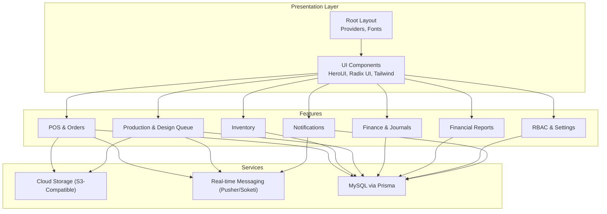
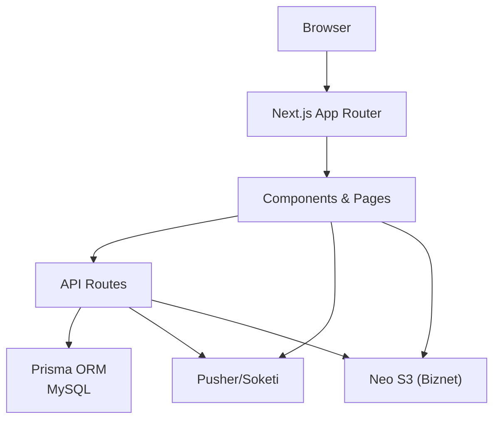
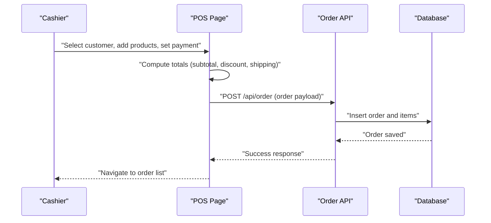
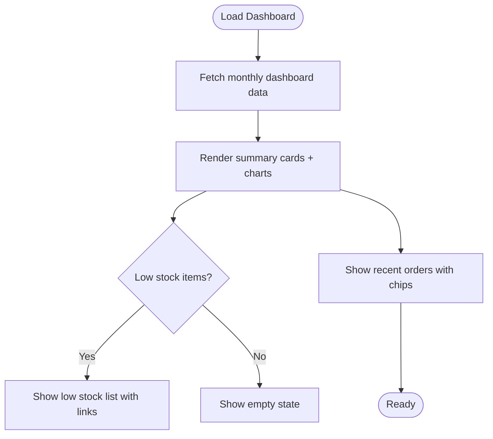
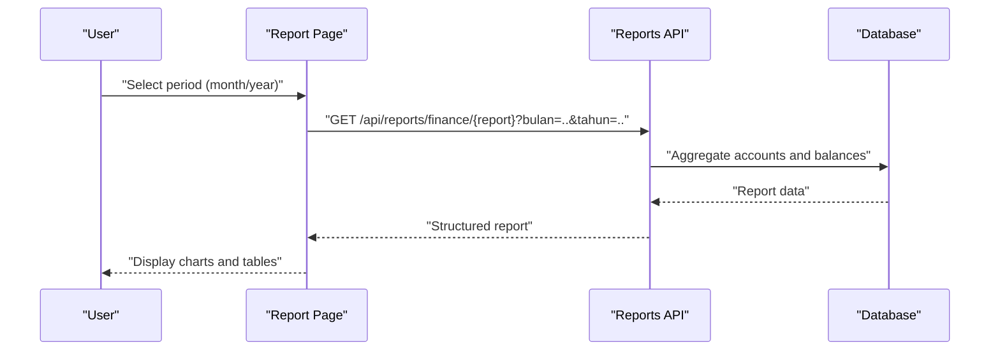
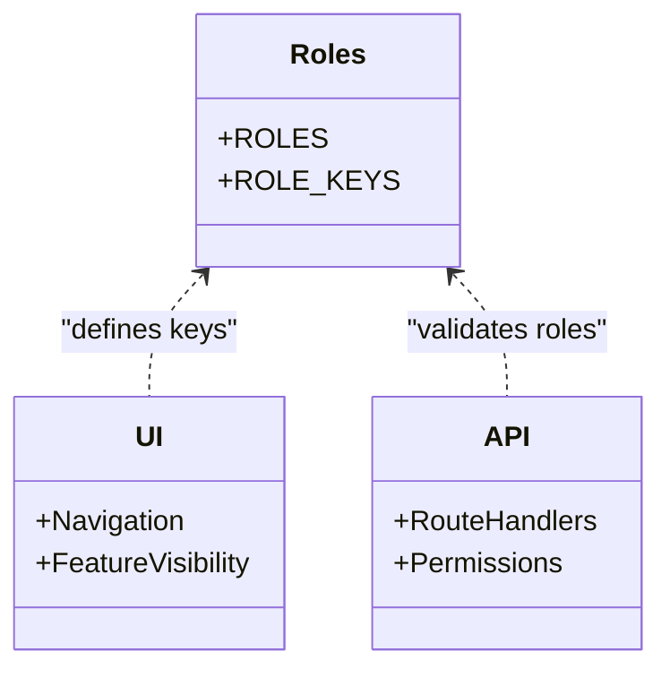
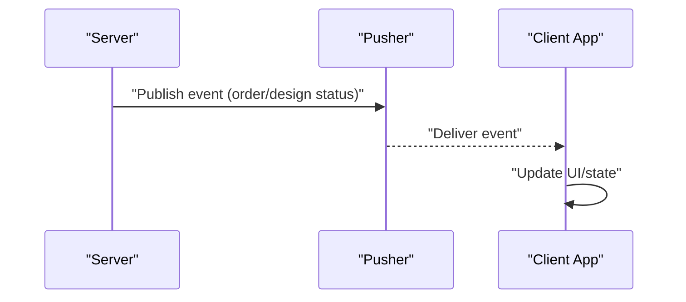
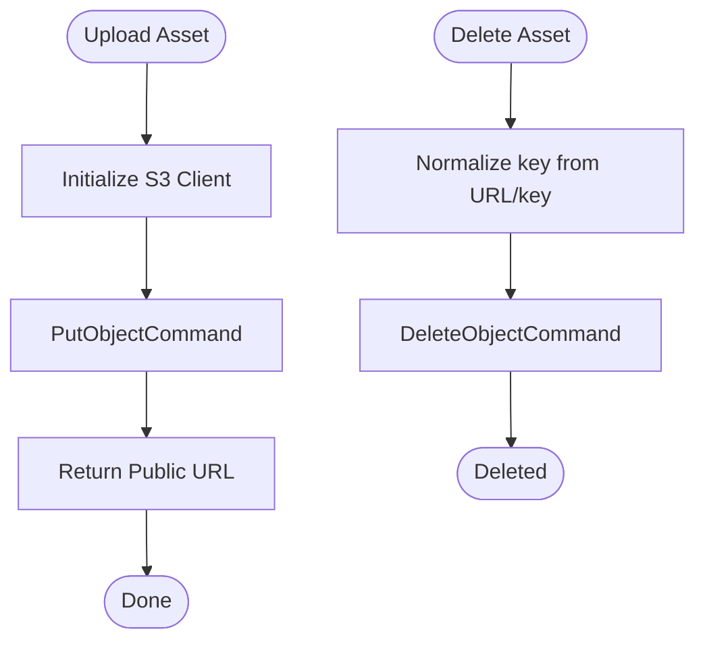
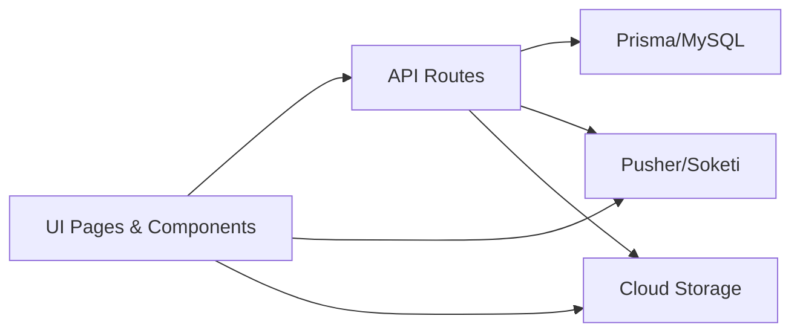

# Key Features

<cite>
**Referenced Files in This Document**
- [README.md](file://README.md)
- [roles.ts](file://src/config/roles.ts)
- [layout.tsx](file://src/app/layout.tsx)
- [pusher.ts](file://src/lib/pusher.ts)
- [storage.ts](file://src/lib/storage.ts)
- [dashboard.page.tsx](file://src/app/(LoggedIn)/dashboard/page.tsx)
- [finance-dashboard.page.tsx](file://src/app/(LoggedIn)/finance/dashboard/page.tsx)
- [pos-page.tsx](file://src/app/(LoggedIn)/order/pos/page.tsx)
- [laba-rugi-page.tsx](file://src/app/(LoggedIn)/reports/laba-rugi/page.tsx)
- [neraca-page.tsx](file://src/app/(LoggedIn)/reports/neraca/page.tsx)
</cite>

## Table of Contents
1. [Introduction](#introduction)
2. [Project Structure](#project-structure)
3. [Core Components](#core-components)
4. [Architecture Overview](#architecture-overview)
5. [Detailed Component Analysis](#detailed-component-analysis)
6. [Dependency Analysis](#dependency-analysis)
7. [Performance Considerations](#performance-considerations)
8. [Troubleshooting Guide](#troubleshooting-guide)
9. [Conclusion](#conclusion)

## Introduction
This document presents the key features of the CV. Haqi Koleksi system, focusing on operational capabilities that streamline daily business activities. It covers Point of Sales transactions with invoice support, Dashboard Analytics with sales visualization, Financial Management with standard accounting reports, Role-Based Access Control with five distinct roles, Real-time Notifications for order and design updates, Cloud Storage integration for assets and payment proofs, and a Modern UI with responsive design. Each feature is explained with its contribution to operational efficiency and typical workflows.

## Project Structure
The application follows a modern Next.js 16 App Router architecture with TypeScript, organized by domain and feature:
- Authentication and routing are centralized in the root layout and providers.
- Feature areas include POS, Order Management, Inventory, Production, Finance, Reports, RBAC, and Notifications.
- Shared libraries handle storage (S3-compatible), real-time messaging (Pusher/Soketi), and utility functions.

**Diagram sources**
- [layout.tsx:1-63](file://src/app/layout.tsx#L1-L63)
- [storage.ts:1-91](file://src/lib/storage.ts#L1-L91)
- [pusher.ts:1-11](file://src/lib/pusher.ts#L1-L11)

**Section sources**
- [README.md:1-128](file://README.md#L1-L128)
- [layout.tsx:1-63](file://src/app/layout.tsx#L1-L63)

## Core Components
- Point of Sales (POS): Fast sale transactions with customer selection, product search, cart management, discount/shipment adjustments, and payment options. Supports saving orders and optional immediate payment recording.
- Dashboard Analytics: Real-time summary cards, weekly revenue vs expense charts, low stock alerts, and recent orders for quick situational awareness.
- Financial Management: Integrated accounting reports including Income Statement (Profit & Loss), Balance Sheet, Savings (Cash/Bank), Expenses, and Receivables, with drill-down details and charts.
- Role-Based Access Control: Five roles (Admin, Cashier, Designer, Production, Warehouse) with centralized role definitions and permission enforcement across UI and APIs.
- Real-time Notifications: Live updates for order and design status via Pusher/Soketi for improved collaboration and responsiveness.
- Cloud Storage: S3-compatible uploads for product and payment proof assets with public URLs and deletion utilities.
- Modern UI: Responsive design using Tailwind CSS 4, HeroUI, and Radix UI for consistent, accessible experiences.

**Section sources**
- [README.md:5-14](file://README.md#L5-L14)
- [roles.ts:1-18](file://src/config/roles.ts#L1-L18)
- [dashboard.page.tsx](file://src/app/(LoggedIn)/dashboard/page.tsx#L1-L475)
- [finance-dashboard.page.tsx](file://src/app/(LoggedIn)/finance/dashboard/page.tsx#L1-L916)
- [pos-page.tsx](file://src/app/(LoggedIn)/order/pos/page.tsx#L1-L603)
- [laba-rugi-page.tsx](file://src/app/(LoggedIn)/reports/laba-rugi/page.tsx#L1-L340)
- [neraca-page.tsx](file://src/app/(LoggedIn)/reports/neraca/page.tsx#L1-L401)
- [pusher.ts:1-11](file://src/lib/pusher.ts#L1-L11)
- [storage.ts:1-91](file://src/lib/storage.ts#L1-L91)

## Architecture Overview
The system integrates UI, domain features, and backend services:
- UI layer uses HeroUI/Radix/Tailwind for components and responsiveness.
- Domain features (POS, Orders, Finance, Reports) communicate with the database via API routes.
- Real-time updates are handled by Pusher/Soketi channels.
- Assets and payment proofs are stored in cloud storage (S3-compatible).

**Diagram sources**
- [layout.tsx:1-63](file://src/app/layout.tsx#L1-L63)
- [pusher.ts:1-11](file://src/lib/pusher.ts#L1-L11)
- [storage.ts:1-91](file://src/lib/storage.ts#L1-L91)

## Detailed Component Analysis

### Point of Sales Transactions with Invoice Support
The POS module enables efficient order creation and payment recording:
- Product search and cart management with quantity adjustments.
- Customer selection or inline creation.
- Order details (channel, deadline, notes), payment status and method, and optional cash/bank destination.
- Discount and shipping adjustments with computed totals.
- Submission pipeline to create an order and optionally record payments.

Typical workflow:
- Cashier selects customer, adds products, sets payment terms, and submits.
- System validates inputs, persists the order, and navigates to the order list.

**Diagram sources**
- [pos-page.tsx](file://src/app/(LoggedIn)/order/pos/page.tsx#L139-L232)

**Section sources**
- [pos-page.tsx](file://src/app/(LoggedIn)/order/pos/page.tsx#L1-L603)

### Dashboard Analytics with Sales Visualization
The dashboard aggregates business metrics and visualizes trends:
- Summary cards for today’s sales, monthly income/expenses, customers, active orders, profit, receivables, and low stock counts.
- Weekly revenue vs expense area chart.
- Low stock alerts with navigation to master data.
- Recent orders with payment status chips.

**Diagram sources**
- [dashboard.page.tsx](file://src/app/(LoggedIn)/dashboard/page.tsx#L151-L475)

**Section sources**
- [dashboard.page.tsx](file://src/app/(LoggedIn)/dashboard/page.tsx#L1-L475)

### Financial Management with Standard Accounting Reports
Financial reporting includes:
- Income Statement (Profit & Loss) with grouped income and expense categories, totals, and margin.
- Balance Sheet with asset, liability, and equity breakdowns, pie charts, and balance verification.
- Savings, Expenses, and Receivables views integrated with journal entries and account structures.

**Diagram sources**
- [finance-dashboard.page.tsx](file://src/app/(LoggedIn)/finance/dashboard/page.tsx#L248-L255)
- [laba-rugi-page.tsx](file://src/app/(LoggedIn)/reports/laba-rugi/page.tsx#L141-L144)
- [neraca-page.tsx](file://src/app/(LoggedIn)/reports/neraca/page.tsx#L197-L200)

**Section sources**
- [finance-dashboard.page.tsx](file://src/app/(LoggedIn)/finance/dashboard/page.tsx#L1-L916)
- [laba-rugi-page.tsx](file://src/app/(LoggedIn)/reports/laba-rugi/page.tsx#L1-L340)
- [neraca-page.tsx](file://src/app/(LoggedIn)/reports/neraca/page.tsx#L1-L401)

### Role-Based Access Control (RBAC)
Centralized role definitions ensure consistent access control:
- Roles: Admin, Cashier, Designer, Production, Warehouse.
- Used across schemas, UI, and API routes for granular permissions.

**Diagram sources**
- [roles.ts:1-18](file://src/config/roles.ts#L1-L18)

**Section sources**
- [roles.ts:1-18](file://src/config/roles.ts#L1-L18)
- [README.md:63-71](file://README.md#L63-L71)

### Real-time Notifications for Orders and Design Updates
Live updates improve collaboration:
- Pusher/Soketi integration for real-time events.
- Channels for order and design queue updates.
- Client-side listeners to reflect status changes instantly.

**Diagram sources**
- [pusher.ts:1-11](file://src/lib/pusher.ts#L1-L11)

**Section sources**
- [README.md:10-11](file://README.md#L10-L11)
- [pusher.ts:1-11](file://src/lib/pusher.ts#L1-L11)

### Cloud Storage Integration for Assets and Payment Proofs
Asset and payment proof management:
- Upload to S3-compatible storage with public URLs.
- Delete assets by key or URL.
- Configurable endpoint, region, and base URL extraction.

**Diagram sources**
- [storage.ts:32-91](file://src/lib/storage.ts#L32-L91)

**Section sources**
- [README.md:11-12](file://README.md#L11-L12)
- [storage.ts:1-91](file://src/lib/storage.ts#L1-L91)

### Modern UI with Responsive Design
Consistent, accessible UI:
- Tailwind CSS 4 for styling.
- HeroUI and Radix UI for component primitives.
- Responsive grids and charts for optimal viewing across devices.

**Section sources**
- [README.md:16-27](file://README.md#L16-L27)
- [layout.tsx:1-63](file://src/app/layout.tsx#L1-L63)

## Dependency Analysis
The system exhibits cohesive feature modules with shared services:
- UI depends on shared components and pages.
- Features depend on API routes and database.
- Real-time and storage are cross-cutting concerns.

**Diagram sources**
- [pusher.ts:1-11](file://src/lib/pusher.ts#L1-L11)
- [storage.ts:1-91](file://src/lib/storage.ts#L1-L91)

**Section sources**
- [README.md:16-27](file://README.md#L16-L27)
- [layout.tsx:1-63](file://src/app/layout.tsx#L1-L63)

## Performance Considerations
- Real-time updates: Use appropriate refresh intervals and channel scoping to minimize unnecessary updates.
- Data fetching: Leverage SWR caching and selective revalidation for dashboard and report pages.
- Asset handling: Compress images and manage public URL caching for cloud storage.
- Rendering: Keep charts and lists virtualized for large datasets.

## Troubleshooting Guide
- Authentication and session errors: Verify environment variables for Better Auth and ensure proper redirect URLs.
- Real-time connectivity: Confirm Pusher/Soketi app ID, key, secret, host, port, and TLS scheme.
- Cloud storage failures: Validate S3 endpoint, region, bucket, and credentials; ensure path-style access is enabled.
- Database migrations: Run Prisma migrations and seeding after environment setup.

**Section sources**
- [README.md:73-98](file://README.md#L73-L98)
- [pusher.ts:1-11](file://src/lib/pusher.ts#L1-L11)
- [storage.ts:1-91](file://src/lib/storage.ts#L1-L91)

## Conclusion
CV. Haqi Koleksi delivers a comprehensive, integrated solution for modern retail and production environments. Its POS, analytics, financial reporting, RBAC, real-time notifications, cloud storage, and responsive UI collectively enhance operational efficiency, transparency, and collaboration. By adhering to the documented workflows and best practices, teams can maintain smooth operations and scalable growth.