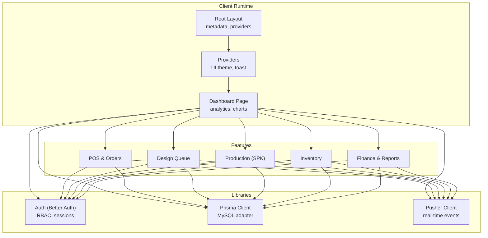
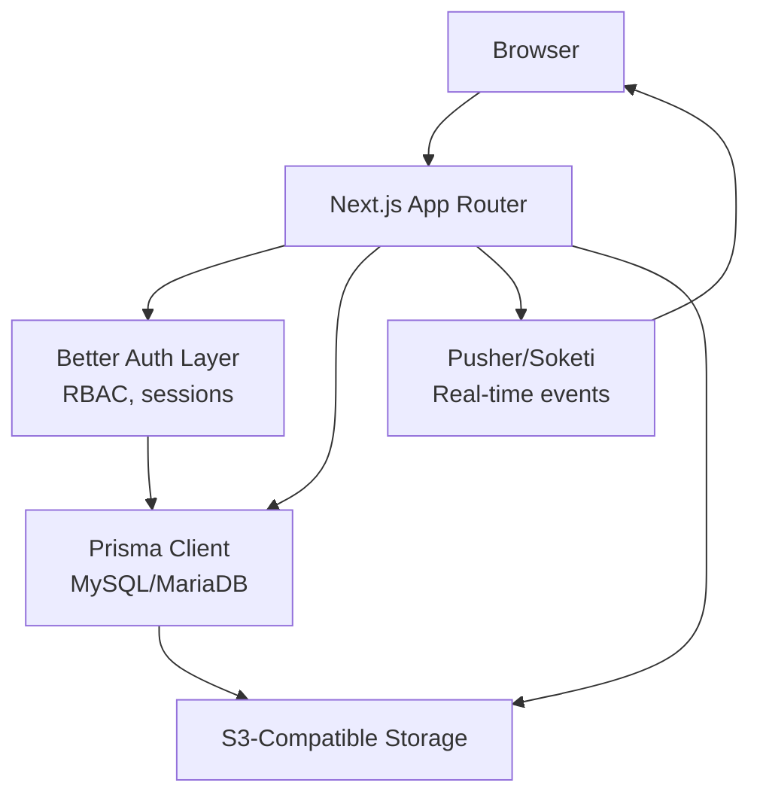
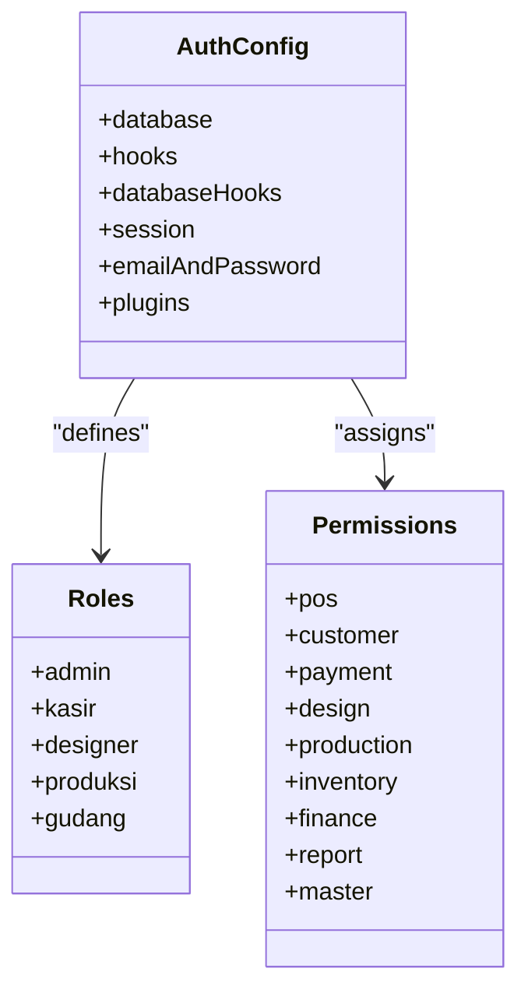
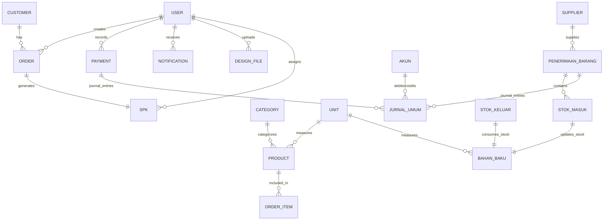
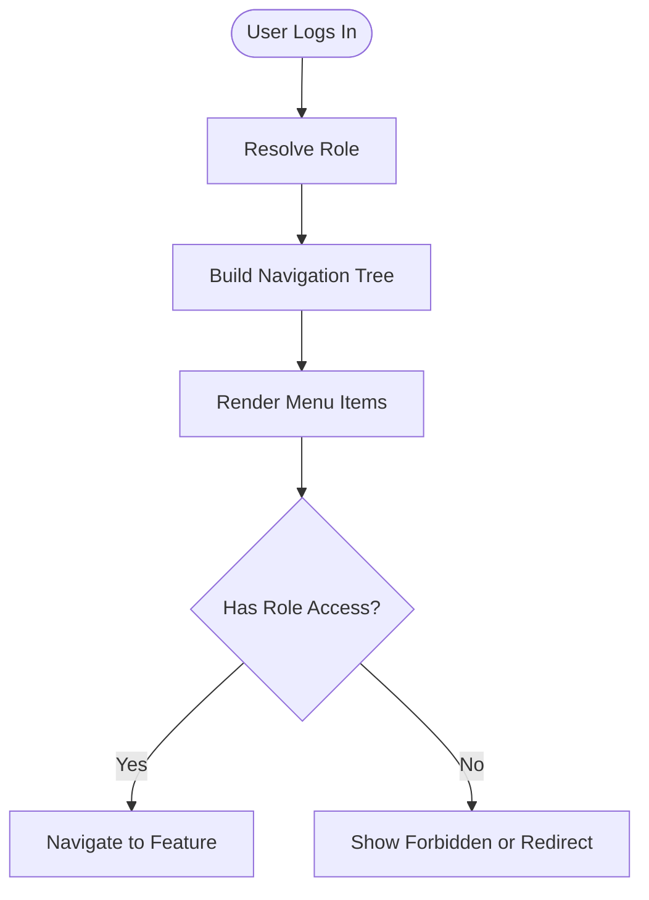
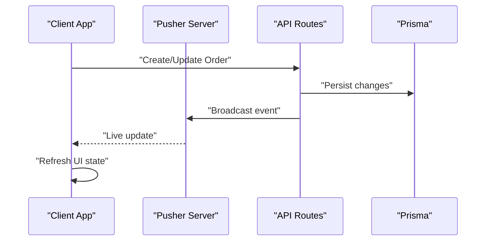
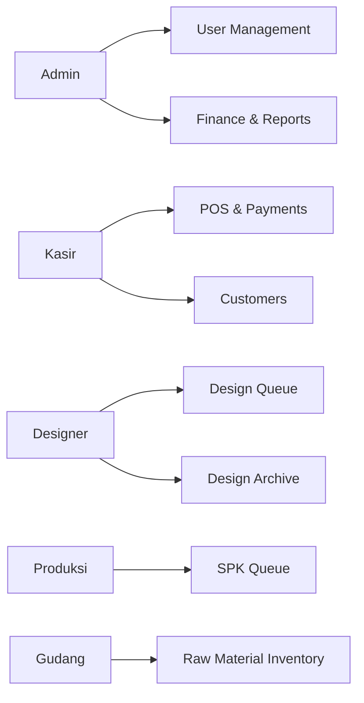
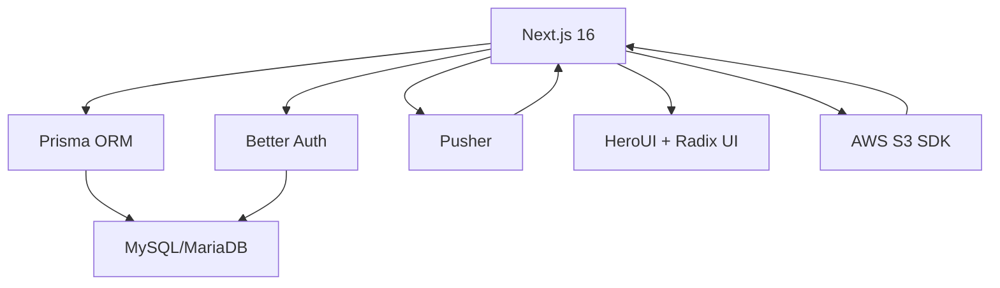

# Project Overview

<cite>
**Referenced Files in This Document**
- [README.md](file://README.md)
- [package.json](file://package.json)
- [next.config.ts](file://next.config.ts)
- [src/app/layout.tsx](file://src/app/layout.tsx)
- [src/app/providers.tsx](file://src/app/providers.tsx)
- [src/app/page.tsx](file://src/app/page.tsx)
- [src/lib/prisma.ts](file://src/lib/prisma.ts)
- [src/lib/auth.ts](file://src/lib/auth.ts)
- [src/lib/permissions.ts](file://src/lib/permissions.ts)
- [src/config/roles.ts](file://src/config/roles.ts)
- [src/config/navigation.ts](file://src/config/navigation.ts)
- [src/app/(LoggedIn)/dashboard/page.tsx](file://src/app/(LoggedIn)/dashboard/page.tsx)
- [src/lib/pusher.ts](file://src/lib/pusher.ts)
- [prisma/schema.prisma](file://prisma/schema.prisma)
</cite>

## Table of Contents
1. [Introduction](#introduction)
2. [Project Structure](#project-structure)
3. [Core Components](#core-components)
4. [Architecture Overview](#architecture-overview)
5. [Detailed Component Analysis](#detailed-component-analysis)
6. [Dependency Analysis](#dependency-analysis)
7. [Performance Considerations](#performance-considerations)
8. [Troubleshooting Guide](#troubleshooting-guide)
9. [Conclusion](#conclusion)

## Introduction
CV. Haqi Koleksi POS and Production Management System is an integrated web application designed specifically for garment manufacturing businesses. It unifies Point of Sale (POS), order lifecycle management, production workflow orchestration, inventory control, and financial accounting into a single platform. Built with modern technologies, it emphasizes operational efficiency, real-time collaboration, and standardized financial reporting.

Key business value propositions:
- End-to-end visibility across sales, design, production, warehouse, and finance
- Role-based access control ensuring department-specific workflows
- Real-time updates for collaborative operations
- Standardized financial reporting aligned with accounting practices
- Scalable architecture supporting multi-department operations

## Project Structure
The application follows Next.js 16 App Router conventions with a layered organization:
- Application shell and providers in the root app directory
- Feature-based routing under app segments (e.g., /order, /production, /finance)
- Shared libraries for database, authentication, permissions, and real-time integrations
- Centralized configuration for roles and navigation
- Prisma schema and migrations for robust data modeling

**Diagram sources**
- [src/app/layout.tsx:1-63](file://src/app/layout.tsx#L1-L63)
- [src/app/providers.tsx:1-14](file://src/app/providers.tsx#L1-L14)
- [src/app/(LoggedIn)/dashboard/page.tsx:1-475](file://src/app/(LoggedIn)/dashboard/page.tsx#L1-L475)
- [src/lib/auth.ts:1-95](file://src/lib/auth.ts#L1-L95)
- [src/lib/prisma.ts:1-25](file://src/lib/prisma.ts#L1-L25)
- [src/lib/pusher.ts:1-11](file://src/lib/pusher.ts#L1-L11)

**Section sources**
- [README.md:16-28](file://README.md#L16-L28)
- [src/app/layout.tsx:17-35](file://src/app/layout.tsx#L17-L35)
- [src/app/providers.tsx:6-13](file://src/app/providers.tsx#L6-L13)

## Core Components
- Next.js 16 App Router: Implements modern routing, layouts, and server-side rendering with dynamic metadata generation.
- Prisma ORM: Provides type-safe database access with a MariaDB/MySQL adapter and centralized schema definitions.
- Better Auth: Handles authentication, session management, and role-based access control with granular permissions.
- Real-time Features: Integrated Pusher/Soketi for live notifications and status updates across departments.
- UI Framework: HeroUI and Radix UI with Tailwind CSS for responsive, accessible interfaces.
- Cloud Storage: S3-compatible storage for product assets and payment proofs.

**Section sources**
- [README.md:3-14](file://README.md#L3-L14)
- [package.json:14-68](file://package.json#L14-L68)
- [src/lib/prisma.ts:10-22](file://src/lib/prisma.ts#L10-L22)
- [src/lib/auth.ts:20-92](file://src/lib/auth.ts#L20-L92)
- [src/lib/pusher.ts:3-10](file://src/lib/pusher.ts#L3-L10)

## Architecture Overview
The system architecture centers around a shared data layer (Prisma) and unified authentication (Better Auth), with feature modules communicating via API routes and real-time channels. The dashboard orchestrates analytics and cross-functional summaries, while each department interacts through dedicated UI segments.

**Diagram sources**
- [src/lib/auth.ts:20-92](file://src/lib/auth.ts#L20-L92)
- [src/lib/prisma.ts:10-22](file://src/lib/prisma.ts#L10-L22)
- [src/lib/pusher.ts:3-10](file://src/lib/pusher.ts#L3-L10)
- [src/app/layout.tsx:17-35](file://src/app/layout.tsx#L17-L35)

## Detailed Component Analysis

### Authentication and Authorization (Better Auth)
- Centralized auth configuration with MySQL adapter and custom hooks for domain validation and avatar assignment.
- Role-based access control (RBAC) with five roles: admin, kasir, designer, produksi, gudang.
- Granular resource permissions for POS, customers, payments, designs, production, inventory, finance, reports, and master data.

**Diagram sources**
- [src/lib/auth.ts:20-92](file://src/lib/auth.ts#L20-L92)
- [src/lib/permissions.ts:25-66](file://src/lib/permissions.ts#L25-L66)
- [src/config/roles.ts:5-11](file://src/config/roles.ts#L5-L11)

**Section sources**
- [src/lib/auth.ts:20-92](file://src/lib/auth.ts#L20-L92)
- [src/lib/permissions.ts:1-67](file://src/lib/permissions.ts#L1-L67)
- [src/config/roles.ts:1-18](file://src/config/roles.ts#L1-L18)

### Data Modeling (Prisma Schema)
- Comprehensive schema covering users, orders, products, inventory, production (SPK), finance (accounts, journals, cash/bank), and system settings.
- Enumerations for order channels, production statuses, payment methods, and notification types.
- Soft delete support and audit fields across entities.

**Diagram sources**
- [prisma/schema.prisma:15-480](file://prisma/schema.prisma#L15-L480)

**Section sources**
- [prisma/schema.prisma:15-480](file://prisma/schema.prisma#L15-L480)

### Navigation and Role-Based Routing
- Centralized navigation configuration defines menu groups, items, and subitems with role gating.
- Ensures each department accesses only permitted areas (e.g., kasir focuses on POS and payments; gudang manages inventory).

**Diagram sources**
- [src/config/navigation.ts:35-216](file://src/config/navigation.ts#L35-L216)
- [src/config/roles.ts:5-11](file://src/config/roles.ts#L5-L11)

**Section sources**
- [src/config/navigation.ts:35-216](file://src/config/navigation.ts#L35-L216)
- [src/config/roles.ts:1-18](file://src/config/roles.ts#L1-L18)

### Real-Time Notifications and Events
- Pusher integration enables live updates for order status, design reviews, low stock alerts, and system notifications.
- Channels and event broadcasting are configured via server-side SDK and client-side listeners.

**Diagram sources**
- [src/lib/pusher.ts:3-10](file://src/lib/pusher.ts#L3-L10)
- [src/app/(LoggedIn)/dashboard/page.tsx:156-160](file://src/app/(LoggedIn)/dashboard/page.tsx#L156-L160)

**Section sources**
- [src/lib/pusher.ts:1-11](file://src/lib/pusher.ts#L1-L11)
- [src/app/(LoggedIn)/dashboard/page.tsx:156-160](file://src/app/(LoggedIn)/dashboard/page.tsx#L156-L160)

### Multi-Department Operations
- Admin: Full control over users, settings, finance, and reports.
- Kasir: Handles POS transactions, payments, and customer management.
- Designer: Manages design queue, uploads design files, and review statuses.
- Produksi: Tracks SPK progress and production stages.
- Gudang: Controls raw material inventory and stock movements.

**Diagram sources**
- [README.md:63-72](file://README.md#L63-L72)
- [src/config/navigation.ts:35-216](file://src/config/navigation.ts#L35-L216)

**Section sources**
- [README.md:63-72](file://README.md#L63-L72)
- [src/config/navigation.ts:35-216](file://src/config/navigation.ts#L35-L216)

## Dependency Analysis
- Next.js 16: App Router, SSR, and static generation capabilities.
- Prisma: Type-safe queries, migrations, and client generation.
- Better Auth: Authentication, sessions, and RBAC plugins.
- Pusher: Real-time event broadcasting.
- UI Libraries: HeroUI, Radix UI, and Tailwind CSS for consistent design.
- AWS S3 SDK: Cloud storage integration for assets and receipts.

**Diagram sources**
- [package.json:14-68](file://package.json#L14-L68)
- [src/lib/prisma.ts:10-22](file://src/lib/prisma.ts#L10-L22)
- [src/lib/auth.ts:20-92](file://src/lib/auth.ts#L20-L92)
- [src/lib/pusher.ts:3-10](file://src/lib/pusher.ts#L3-L10)

**Section sources**
- [package.json:14-68](file://package.json#L14-L68)
- [next.config.ts:3-8](file://next.config.ts#L3-L8)

## Performance Considerations
- Database connection pooling via Prisma adapter to optimize throughput.
- SWR-based caching and periodic refresh for dashboard analytics to balance freshness and performance.
- Client-side hydration warnings suppressed in root layout to avoid unnecessary re-renders.
- React Compiler enabled for improved runtime performance.

[No sources needed since this section provides general guidance]

## Troubleshooting Guide
- Authentication failures: Verify BETTER_AUTH_SECRET and BETTER_AUTH_URL in environment variables; ensure domain validation rules and normalized names are applied during sign-up.
- Database connectivity: Confirm DATABASE_URL format and credentials; adjust connection limits in Prisma adapter as needed.
- Real-time events: Check PUSHER_APP_ID, NEXT_PUBLIC_PUSHER_KEY, PUSHER_SECRET, and host/port configuration; ensure TLS scheme matches environment.
- Environment setup: Generate auth secret using OpenSSL and populate .env with required keys for database, auth, S3, and Pusher.

**Section sources**
- [README.md:73-98](file://README.md#L73-L98)
- [src/lib/auth.ts:24-48](file://src/lib/auth.ts#L24-L48)
- [src/lib/prisma.ts:9-18](file://src/lib/prisma.ts#L9-L18)
- [src/lib/pusher.ts:3-10](file://src/lib/pusher.ts#L3-L10)

## Conclusion
CV. Haqi Koleksi POS and Production Management System delivers a cohesive, scalable solution for garment manufacturers. By combining Next.js 16’s modern framework, Prisma’s type safety, Better Auth’s RBAC, and real-time capabilities, it streamlines multi-department workflows from sales to production and finance. The centralized navigation and permission model ensure secure, role-appropriate access, while the dashboard provides actionable insights for informed decision-making.