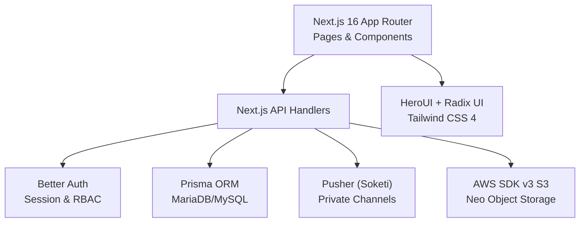
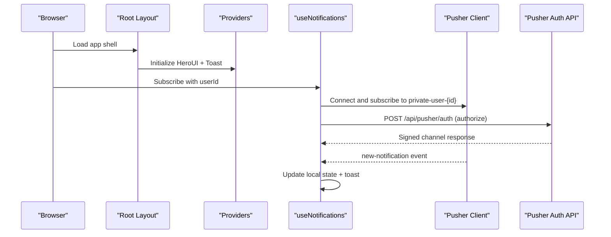
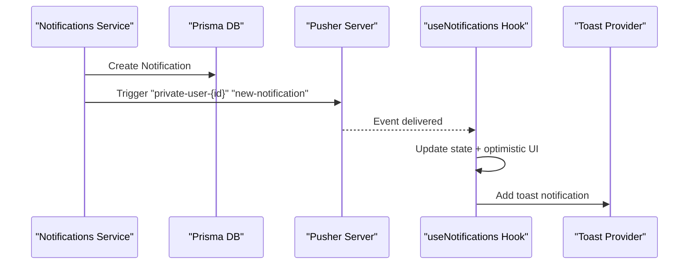
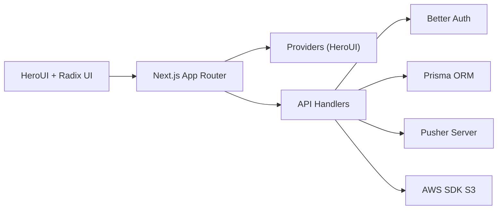

# Technology Stack

<cite>
**Referenced Files in This Document**
- [package.json](file://package.json)
- [next.config.ts](file://next.config.ts)
- [prisma/schema.prisma](file://prisma/schema.prisma)
- [tailwind.config.js](file://tailwind.config.js)
- [components.json](file://components.json)
- [src/lib/auth.ts](file://src/lib/auth.ts)
- [src/lib/prisma.ts](file://src/lib/prisma.ts)
- [src/lib/pusher.ts](file://src/lib/pusher.ts)
- [src/lib/storage.ts](file://src/lib/storage.ts)
- [src/app/api/pusher/auth/route.ts](file://src/app/api/pusher/auth/route.ts)
- [src/lib/notifications.ts](file://src/lib/notifications.ts)
- [src/app/providers.tsx](file://src/app/providers.tsx)
- [src/app/layout.tsx](file://src/app/layout.tsx)
- [src/components/ui/button.tsx](file://src/components/ui/button.tsx)
- [src/components/ui/dialog.tsx](file://src/components/ui/dialog.tsx)
- [src/hooks/use-notifications.ts](file://src/hooks/use-notifications.ts)
</cite>

## Table of Contents
1. [Introduction](#introduction)
2. [Project Structure](#project-structure)
3. [Core Components](#core-components)
4. [Architecture Overview](#architecture-overview)
5. [Detailed Component Analysis](#detailed-component-analysis)
6. [Dependency Analysis](#dependency-analysis)
7. [Performance Considerations](#performance-considerations)
8. [Troubleshooting Guide](#troubleshooting-guide)
9. [Conclusion](#conclusion)

## Introduction
This document presents the complete technology stack powering CV. Haqi Koleksi’s integrated Point of Sale (POS) and Production Management system. It covers frontend and backend frameworks, database and ORM, authentication, real-time communication, cloud storage, and UI component libraries. For each technology, we explain rationale, version requirements, configuration, and integration patterns that support efficient order processing, production tracking, inventory management, and financial reporting.

## Project Structure
The application follows Next.js App Router conventions with a monorepo-like separation of concerns:
- Frontend: Next.js 16 App Router pages and components
- Backend APIs: Next.js App Router API handlers
- Authentication: Better Auth with Prisma adapter
- Data access: Prisma ORM with MariaDB/MySQL provider
- Real-time: Pusher (Soketi-compatible) for private channels
- Cloud storage: AWS SDK v3 for S3-compatible Neo Object Storage
- UI framework: Tailwind CSS 4 with HeroUI and Radix UI primitives

**Diagram sources**
- [src/app/layout.tsx:37-62](file://src/app/layout.tsx#L37-L62)
- [src/app/api/pusher/auth/route.ts:9-40](file://src/app/api/pusher/auth/route.ts#L9-L40)
- [src/lib/prisma.ts:20-24](file://src/lib/prisma.ts#L20-L24)
- [src/lib/auth.ts:20-92](file://src/lib/auth.ts#L20-L92)
- [src/lib/storage.ts:32-40](file://src/lib/storage.ts#L32-L40)

**Section sources**
- [package.json:14-68](file://package.json#L14-L68)
- [next.config.ts:3-8](file://next.config.ts#L3-L8)
- [tailwind.config.js:1-12](file://tailwind.config.js#L1-L12)
- [components.json:6-22](file://components.json#L6-L22)

## Core Components
- Next.js 16 with App Router: Fullstack React framework with static generation, server-side rendering, and modern DX. Configured with React Compiler and standalone output for containerized deployments.
- Prisma ORM: Type-safe database client with MariaDB adapter and MySQL provider configured in schema.
- Better Auth: Pluggable authentication with email/password, admin plugin, and role-based access control (RBAC).
- MySQL/MariaDB: Persistent relational data store for users, orders, inventory, and financial records.
- Real-time communication: Pusher (Soketi-compatible) for secure private channels and live notifications.
- Cloud storage: AWS SDK v3 S3 client configured for Neo Object Storage (Biznet).
- Frontend libraries: HeroUI (UI components) and Radix UI (accessibility primitives) styled with Tailwind CSS 4.

**Section sources**
- [package.json:52-68](file://package.json#L52-L68)
- [prisma/schema.prisma:1-9](file://prisma/schema.prisma#L1-L9)
- [src/lib/auth.ts:20-92](file://src/lib/auth.ts#L20-L92)
- [src/lib/pusher.ts:3-10](file://src/lib/pusher.ts#L3-L10)
- [src/lib/storage.ts:32-40](file://src/lib/storage.ts#L32-L40)
- [tailwind.config.js:1-12](file://tailwind.config.js#L1-L12)

## Architecture Overview
The system integrates frontend, backend, and infrastructure through clear boundaries:
- Frontend renders pages and components, initializes providers, and subscribes to real-time updates.
- API handlers orchestrate business logic, interact with the database, trigger notifications, and manage uploads.
- Authentication enforces session checks and RBAC policies.
- Notifications combine database writes with real-time events to inform users instantly.
- Storage abstracts S3-compatible object operations for design files and receipts.

**Diagram sources**
- [src/app/layout.tsx:37-62](file://src/app/layout.tsx#L37-L62)
- [src/app/providers.tsx:6-13](file://src/app/providers.tsx#L6-L13)
- [src/hooks/use-notifications.ts:43-61](file://src/hooks/use-notifications.ts#L43-L61)
- [src/app/api/pusher/auth/route.ts:9-40](file://src/app/api/pusher/auth/route.ts#L9-L40)

## Detailed Component Analysis

### Next.js 16 with App Router
- Purpose: Fullstack React framework enabling server actions, middleware, and optimized rendering.
- Version: 16.0.5.
- Configuration highlights:
  - React Compiler enabled for performance improvements.
  - External native module handling for Argon2 hashing.
  - Standalone output for containerized deployments.
- Build pipeline:
  - Prisma client generation and migrations applied before building.
  - Seed script for initial data.
- Integration patterns:
  - Pages under src/app with layouts and providers.
  - API routes under src/app/api for server logic.

**Section sources**
- [package.json:7-12](file://package.json#L7-L12)
- [next.config.ts:3-8](file://next.config.ts#L3-L8)
- [src/app/layout.tsx:37-62](file://src/app/layout.tsx#L37-L62)
- [src/app/providers.tsx:6-13](file://src/app/providers.tsx#L6-L13)

### Prisma ORM and Database
- ORM: Prisma Client with MariaDB adapter.
- Provider: MySQL configured in schema.
- Adapter configuration:
  - Parses DATABASE_URL to extract host, port, user, password, and database.
  - Connection pool limit set to 5.
- Schema coverage:
  - Auth & user: User, Session, Account, Verification.
  - Products & categories: Category, Unit, Product.
  - Customers & suppliers: Customer, Supplier.
  - Raw materials & inventory: BahanBaku, PenerimaanBarang, StokMasuk, StokKeluar.
  - Orders & production: Order, OrderItem, DesignFile, SPK, PengeluaranBarang.
  - Finance: Payment, Akun, JurnalUmum, KasBank, AppSetting.
  - Notifications & comments: Notification, OrderComment, CommentRecipient.
- Benefits:
  - Strong typing reduces runtime errors.
  - Migrations track schema evolution.
  - Efficient queries and relations for POS and production workflows.

**Section sources**
- [prisma/schema.prisma:1-9](file://prisma/schema.prisma#L1-L9)
- [src/lib/prisma.ts:9-24](file://src/lib/prisma.ts#L9-L24)

### Better Auth (Authentication & RBAC)
- Provider: Better Auth with Prisma adapter for MySQL.
- Features:
  - Email/password with custom hashing/verification.
  - Admin plugin with role definitions (admin, kasir, designer, produksi, gudang).
  - Session expiry configured.
  - Pre-create hooks to assign random avatars and normalize names.
  - Domain validation for sign-ups.
- Integration:
  - API middleware validates sessions for protected routes.
  - Role-based access enforced across modules.

**Section sources**
- [src/lib/auth.ts:20-92](file://src/lib/auth.ts#L20-L92)
- [src/lib/prisma.ts:20-24](file://src/lib/prisma.ts#L20-L24)

### Real-time Communication (Pusher/Soketi)
- Server SDK: Pusher configured with appId, key, secret, host, port, TLS scheme.
- Authorization:
  - Private channel authorization via Next.js API route.
  - Enforces per-user channel naming (private-user-{userId}).
  - Uses Better Auth session to validate requests.
- Client integration:
  - useNotifications hook connects to Pusher, subscribes to user-specific channel.
  - On new-notification event, updates state and shows toast.
- Notifications service:
  - Persists notifications to DB and triggers real-time events.
  - Helpers for role-based and low-stock alerts.

**Diagram sources**
- [src/lib/notifications.ts:18-42](file://src/lib/notifications.ts#L18-L42)
- [src/lib/pusher.ts:3-10](file://src/lib/pusher.ts#L3-L10)
- [src/hooks/use-notifications.ts:43-61](file://src/hooks/use-notifications.ts#L43-L61)

**Section sources**
- [src/lib/pusher.ts:3-10](file://src/lib/pusher.ts#L3-L10)
- [src/app/api/pusher/auth/route.ts:9-40](file://src/app/api/pusher/auth/route.ts#L9-L40)
- [src/lib/notifications.ts:18-42](file://src/lib/notifications.ts#L18-L42)
- [src/hooks/use-notifications.ts:43-61](file://src/hooks/use-notifications.ts#L43-L61)

### Cloud Storage (Neo S3)
- SDK: AWS SDK v3 S3 client.
- Endpoint parsing:
  - Strips protocol prefixes from endpoint.
  - Infers region from endpoint subdomain.
- Credentials and bucket:
  - Access key, secret key, bucket, and public URL from environment.
- Operations:
  - Upload: put object with ACL (public-read/private).
  - Delete: supports key or public URL deletion.
- Integration:
  - Used for storing design files and receipts in S3-compatible Neo Object Storage.

**Section sources**
- [src/lib/storage.ts:19-40](file://src/lib/storage.ts#L19-L40)
- [src/lib/storage.ts:48-69](file://src/lib/storage.ts#L48-L69)
- [src/lib/storage.ts:76-90](file://src/lib/storage.ts#L76-L90)

### Frontend Libraries (Tailwind CSS 4, HeroUI, Radix UI)
- Tailwind CSS 4:
  - Heroui plugin configured with HeroUI theme components.
  - Content scanning scoped to specific HeroUI components.
- HeroUI:
  - Provides themed UI components (buttons, modals, tables, etc.).
  - Integrated via Providers wrapper in root layout.
- Radix UI:
  - Accessible primitives (dialogs, dropdowns, tooltips) used in components.
  - Complements HeroUI for consistent UX and accessibility.
- Shadcn/slots:
  - Components.json configured for RSC/TSX with aliases for components, utils, hooks.

**Section sources**
- [tailwind.config.js:1-12](file://tailwind.config.js#L1-L12)
- [src/app/providers.tsx:6-13](file://src/app/providers.tsx#L6-L13)
- [components.json:6-22](file://components.json#L6-L22)
- [src/components/ui/button.tsx:1-63](file://src/components/ui/button.tsx#L1-L63)
- [src/components/ui/dialog.tsx:1-159](file://src/components/ui/dialog.tsx#L1-L159)

## Dependency Analysis
High-level dependency relationships:
- Next.js App Router depends on providers and layout for initialization.
- API handlers depend on Better Auth for session validation and Prisma for data access.
- Real-time features depend on Pusher server and client, coordinated by API authorization.
- Storage depends on AWS SDK v3 and environment variables for Neo S3.
- UI components depend on HeroUI and Radix UI, styled with Tailwind CSS 4.

**Diagram sources**
- [src/app/layout.tsx:37-62](file://src/app/layout.tsx#L37-L62)
- [src/app/providers.tsx:6-13](file://src/app/providers.tsx#L6-L13)
- [src/lib/auth.ts:20-92](file://src/lib/auth.ts#L20-L92)
- [src/lib/prisma.ts:20-24](file://src/lib/prisma.ts#L20-L24)
- [src/lib/pusher.ts:3-10](file://src/lib/pusher.ts#L3-L10)
- [src/lib/storage.ts:32-40](file://src/lib/storage.ts#L32-L40)

**Section sources**
- [package.json:14-68](file://package.json#L14-L68)
- [prisma/schema.prisma:1-9](file://prisma/schema.prisma#L1-L9)

## Performance Considerations
- Next.js React Compiler: Improves render performance and bundle sizes.
- Standalone output: Reduces container image size and startup time.
- Prisma connection pooling: Controlled concurrency with a small pool size suitable for development and moderate load.
- Real-time subscriptions: Scoped to user-specific channels to minimize overhead.
- AWS SDK S3: Path-style endpoints and explicit region improve compatibility with Neo S3.
- Tailwind 4 + HeroUI: Component-scoped content scanning reduces CSS bloat.

[No sources needed since this section provides general guidance]

## Troubleshooting Guide
- Authentication failures:
  - Verify session headers and user ID in Pusher auth route.
  - Confirm domain validation and normalization in Better Auth hooks.
- Real-time events not received:
  - Ensure client subscribes to correct private channel (private-user-{userId}).
  - Check Pusher server configuration and API authorization response.
- Database connectivity:
  - Validate DATABASE_URL format and adapter extraction of host/port/user/password.
  - Confirm MariaDB adapter is used with MySQL provider in schema.
- Storage upload/delete:
  - Confirm environment variables for Neo S3 are present and endpoint parsing is correct.
  - Verify ACL and bucket permissions for uploads.

**Section sources**
- [src/app/api/pusher/auth/route.ts:9-40](file://src/app/api/pusher/auth/route.ts#L9-L40)
- [src/lib/auth.ts:24-48](file://src/lib/auth.ts#L24-L48)
- [src/lib/prisma.ts:9-18](file://src/lib/prisma.ts#L9-L18)
- [src/lib/storage.ts:19-40](file://src/lib/storage.ts#L19-L40)

## Conclusion
CV. Haqi Koleksi leverages a modern, cohesive stack tailored for POS and production management:
- Next.js 16 provides a robust foundation for fullstack React applications.
- Prisma ensures type-safe, maintainable data access aligned with business domains.
- Better Auth delivers secure, role-aware authentication with minimal friction.
- Pusher enables responsive, real-time user experiences for notifications and collaboration.
- Neo S3 offers scalable, S3-compatible object storage for media assets.
- HeroUI and Radix UI with Tailwind CSS 4 deliver accessible, consistent UI components.

Together, these technologies streamline order lifecycle management, production tracking, inventory control, and financial visibility while maintaining scalability and developer productivity.