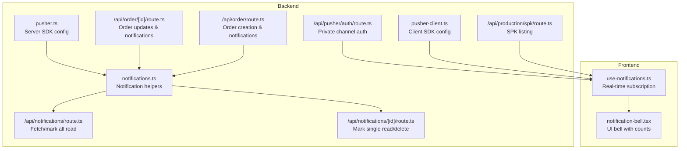
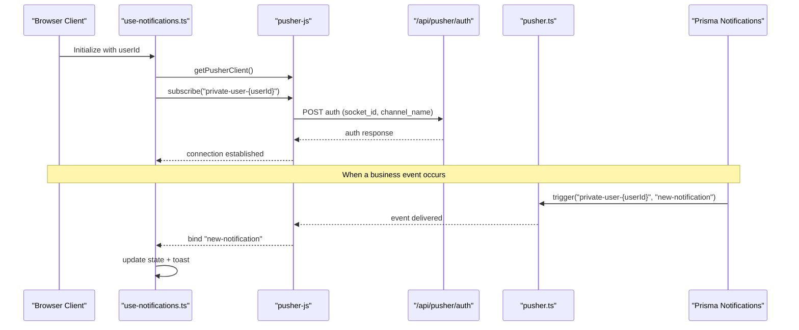
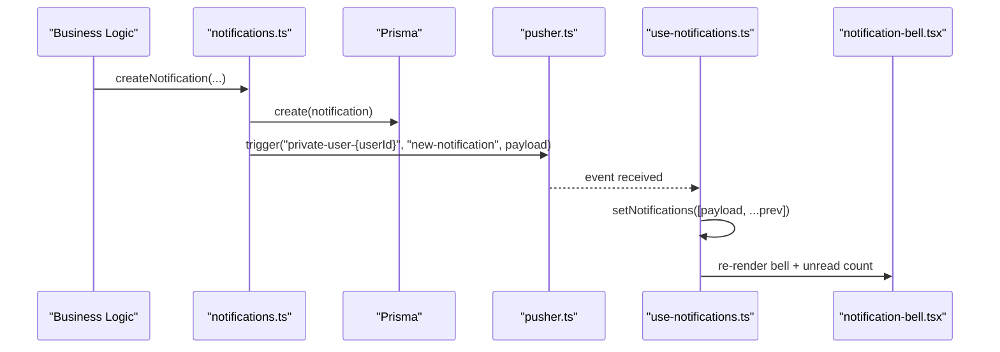
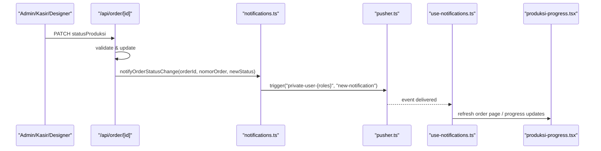
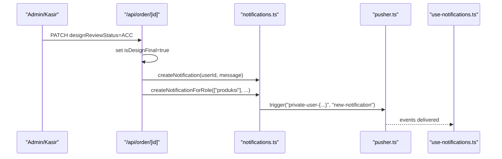
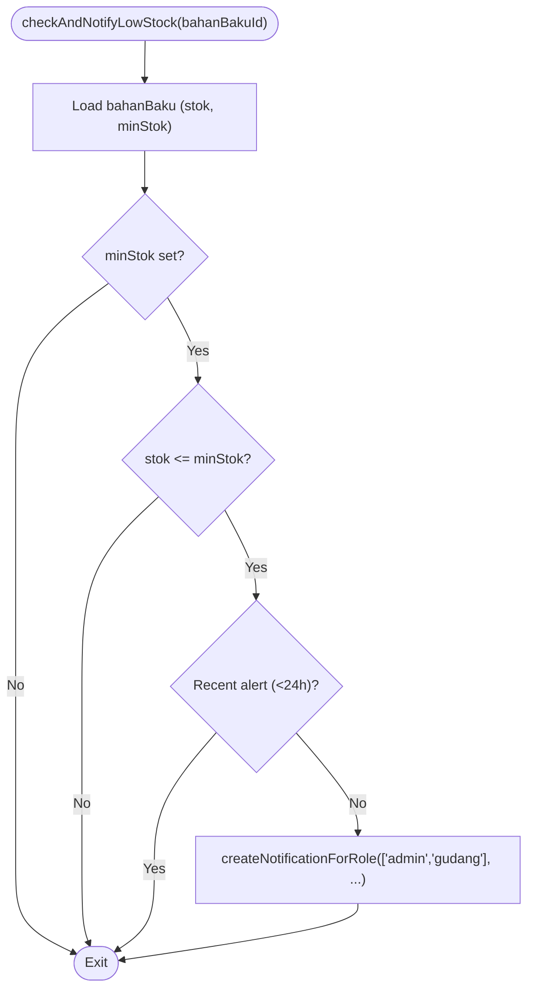
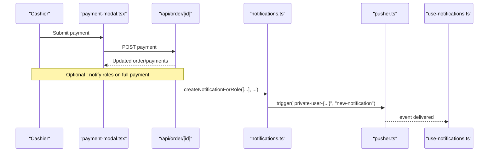
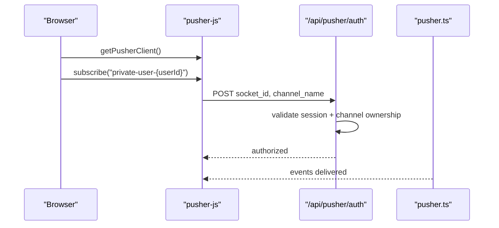
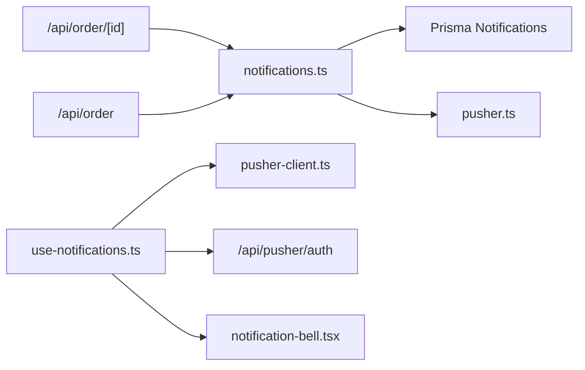

# Live Updates & Event Broadcasting

<cite>
**Referenced Files in This Document**
- [pusher.ts](file://src/lib/pusher.ts)
- [pusher-client.ts](file://src/lib/pusher-client.ts)
- [notifications.ts](file://src/lib/notifications.ts)
- [route.ts](file://src/app/api/pusher/auth/route.ts)
- [route.ts](file://src/app/api/notifications/route.ts)
- [route.ts](file://src/app/api/notifications/[id]/route.ts)
- [use-notifications.ts](file://src/hooks/use-notifications.ts)
- [notification-bell.tsx](file://src/components/notification-bell.tsx)
- [route.ts](file://src/app/api/order/[id]/route.ts)
- [route.ts](file://src/app/api/order/route.ts)
- [route.ts](file://src/app/api/production/spk/route.ts)
- [update-status-modal.tsx](file://src/app/(LoggedIn)/order/list/components/update-status-modal.tsx)
- [produksi-progress.tsx](file://src/app/(LoggedIn)/order/[id]/components/produksi-progress.tsx)
- [payment-modal.tsx](file://src/app/(LoggedIn)/order/[id]/components/payment-modal.tsx)
- [payment-summary.tsx](file://src/app/(LoggedIn)/order/[id]/components/payment-summary.tsx)
</cite>

## Table of Contents
1. [Introduction](#introduction)
2. [Project Structure](#project-structure)
3. [Core Components](#core-components)
4. [Architecture Overview](#architecture-overview)
5. [Detailed Component Analysis](#detailed-component-analysis)
6. [Dependency Analysis](#dependency-analysis)
7. [Performance Considerations](#performance-considerations)
8. [Troubleshooting Guide](#troubleshooting-guide)
9. [Conclusion](#conclusion)

## Introduction
This document explains how the system delivers live updates and broadcasts events across business modules. It covers real-time order status updates, production progress notifications, inventory low-stock alerts, and payment confirmations. The solution uses a publish-subscribe pattern with private channels, ensuring secure, targeted, and scalable real-time communication. The architecture integrates tightly with business logic to trigger notifications on meaningful state changes, while frontend hooks and UI components provide immediate user feedback.

## Project Structure
The real-time system spans backend libraries, API routes, and frontend hooks/components:
- Backend libraries manage Pusher server/client configuration and notification creation.
- API routes authorize subscriptions and expose CRUD endpoints for notifications.
- Frontend hooks subscribe to private channels and render real-time updates.
- Business logic triggers notifications during order creation, status changes, and payment events.

**Diagram sources**
- [pusher.ts:1-11](file://src/lib/pusher.ts#L1-L11)
- [pusher-client.ts:1-21](file://src/lib/pusher-client.ts#L1-L21)
- [notifications.ts:1-122](file://src/lib/notifications.ts#L1-L122)
- [route.ts:1-41](file://src/app/api/pusher/auth/route.ts#L1-L41)
- [route.ts:1-77](file://src/app/api/notifications/route.ts#L1-L77)
- [route.ts:1-68](file://src/app/api/notifications/[id]/route.ts#L1-L68)
- [route.ts:1-615](file://src/app/api/order/[id]/route.ts#L1-L615)
- [route.ts:1-443](file://src/app/api/order/route.ts#L1-L443)
- [route.ts:1-107](file://src/app/api/production/spk/route.ts#L1-L107)
- [use-notifications.ts:1-112](file://src/hooks/use-notifications.ts#L1-L112)
- [notification-bell.tsx:1-219](file://src/components/notification-bell.tsx#L1-L219)

**Section sources**
- [pusher.ts:1-11](file://src/lib/pusher.ts#L1-L11)
- [pusher-client.ts:1-21](file://src/lib/pusher-client.ts#L1-L21)
- [notifications.ts:1-122](file://src/lib/notifications.ts#L1-L122)
- [route.ts:1-41](file://src/app/api/pusher/auth/route.ts#L1-L41)
- [route.ts:1-77](file://src/app/api/notifications/route.ts#L1-L77)
- [route.ts:1-68](file://src/app/api/notifications/[id]/route.ts#L1-L68)
- [route.ts:1-615](file://src/app/api/order/[id]/route.ts#L1-L615)
- [route.ts:1-443](file://src/app/api/order/route.ts#L1-L443)
- [route.ts:1-107](file://src/app/api/production/spk/route.ts#L1-L107)
- [use-notifications.ts:1-112](file://src/hooks/use-notifications.ts#L1-L112)
- [notification-bell.tsx:1-219](file://src/components/notification-bell.tsx#L1-L219)

## Core Components
- Pusher server configuration initializes the backend SDK with environment variables for app ID, key, secret, host, port, and TLS scheme.
- Pusher client configuration sets up a singleton client with WebSocket host/port, cluster, transport options, and an auth endpoint for private channels.
- Notification library encapsulates:
  - Creating notifications in the database and emitting real-time events to private channels.
  - Role-based broadcasting to multiple users.
  - Duplicate suppression for low-stock alerts.
  - Order status change notifications.
- Private channel authorization enforces that clients can only subscribe to their own private channel.
- Notification API routes provide fetching, marking as read, and deleting notifications.
- Frontend hook subscribes to a user-specific private channel, binds to new-notification events, and optimistically updates the UI.

**Section sources**
- [pusher.ts:1-11](file://src/lib/pusher.ts#L1-L11)
- [pusher-client.ts:1-21](file://src/lib/pusher-client.ts#L1-L21)
- [notifications.ts:1-122](file://src/lib/notifications.ts#L1-L122)
- [route.ts:1-41](file://src/app/api/pusher/auth/route.ts#L1-L41)
- [route.ts:1-77](file://src/app/api/notifications/route.ts#L1-L77)
- [route.ts:1-68](file://src/app/api/notifications/[id]/route.ts#L1-L68)
- [use-notifications.ts:1-112](file://src/hooks/use-notifications.ts#L1-L112)

## Architecture Overview
The system follows a publish-subscribe model:
- Backend business logic creates notifications and triggers Pusher events.
- Frontend clients connect to private channels and receive real-time updates.
- Authorization ensures only the intended user receives notifications.

**Diagram sources**
- [use-notifications.ts:40-61](file://src/hooks/use-notifications.ts#L40-L61)
- [pusher-client.ts:6-20](file://src/lib/pusher-client.ts#L6-L20)
- [route.ts:9-40](file://src/app/api/pusher/auth/route.ts#L9-L40)
- [pusher.ts:3-10](file://src/lib/pusher.ts#L3-L10)
- [notifications.ts:18-42](file://src/lib/notifications.ts#L18-L42)

## Detailed Component Analysis

### Real-Time Notification Pipeline
- Backend creation:
  - Persist notification to database.
  - Emit event to the user’s private channel with a standardized event name.
- Frontend consumption:
  - Subscribe to the private channel on mount.
  - On receiving the event, prepend to the notification list and show a toast.
  - Provide optimistic UI updates for read/unread toggles.

**Diagram sources**
- [notifications.ts:18-42](file://src/lib/notifications.ts#L18-L42)
- [use-notifications.ts:48-55](file://src/hooks/use-notifications.ts#L48-L55)
- [notification-bell.tsx:34-41](file://src/components/notification-bell.tsx#L34-L41)

**Section sources**
- [notifications.ts:1-122](file://src/lib/notifications.ts#L1-L122)
- [use-notifications.ts:1-112](file://src/hooks/use-notifications.ts#L1-L112)
- [notification-bell.tsx:1-219](file://src/components/notification-bell.tsx#L1-L219)

### Order Status Updates
- When an order’s production status changes, the backend checks if the status actually changed and broadcasts a notification to relevant roles.
- The frontend displays a progress indicator and reacts to real-time updates.

**Diagram sources**
- [route.ts:464-474](file://src/app/api/order/[id]/route.ts#L464-L474)
- [notifications.ts:103-121](file://src/lib/notifications.ts#L103-L121)
- [use-notifications.ts:40-61](file://src/hooks/use-notifications.ts#L40-L61)
- [produksi-progress.tsx](file://src/app/(LoggedIn)/order/[id]/components/produksi-progress.tsx#L1-L46)

**Section sources**
- [route.ts:464-474](file://src/app/api/order/[id]/route.ts#L464-L474)
- [notifications.ts:103-121](file://src/lib/notifications.ts#L103-L121)
- [produksi-progress.tsx](file://src/app/(LoggedIn)/order/[id]/components/produksi-progress.tsx#L1-L46)

### Production Progress Notifications
- When a design is approved, the system notifies production staff and optionally notifies the designer.
- SPK creation and listing APIs support production workflows and can be surfaced in real-time via notifications.

**Diagram sources**
- [route.ts:322-421](file://src/app/api/order/[id]/route.ts#L322-L421)
- [notifications.ts:18-61](file://src/lib/notifications.ts#L18-L61)
- [use-notifications.ts:40-61](file://src/hooks/use-notifications.ts#L40-L61)

**Section sources**
- [route.ts:322-421](file://src/app/api/order/[id]/route.ts#L322-L421)
- [notifications.ts:18-61](file://src/lib/notifications.ts#L18-L61)

### Inventory Low-Stock Alerts
- The system checks current stock against minimum thresholds and sends low-stock notifications to admins and warehouse staff.
- Duplicate suppression prevents repeated alerts for the same material within a 24-hour window.

**Diagram sources**
- [notifications.ts:67-98](file://src/lib/notifications.ts#L67-L98)

**Section sources**
- [notifications.ts:67-98](file://src/lib/notifications.ts#L67-L98)

### Payment Confirmations
- Payments create payment records and journal entries. While the payment confirmation itself is primarily stored in the database, the UI reflects payment status and can be augmented with notifications for significant milestones (e.g., full payment).
- The payment summary component aggregates payments and exposes actions to add new payments.

**Diagram sources**
- [payment-modal.tsx](file://src/app/(LoggedIn)/order/[id]/components/payment-modal.tsx#L1-L49)
- [payment-summary.tsx](file://src/app/(LoggedIn)/order/[id]/components/payment-summary.tsx#L30-L160)
- [route.ts:360-408](file://src/app/api/order/[id]/route.ts#L360-L408)
- [notifications.ts:18-61](file://src/lib/notifications.ts#L18-L61)
- [use-notifications.ts:40-61](file://src/hooks/use-notifications.ts#L40-L61)

**Section sources**
- [payment-modal.tsx](file://src/app/(LoggedIn)/order/[id]/components/payment-modal.tsx#L1-L49)
- [payment-summary.tsx](file://src/app/(LoggedIn)/order/[id]/components/payment-summary.tsx#L30-L160)
- [route.ts:360-408](file://src/app/api/order/[id]/route.ts#L360-L408)
- [notifications.ts:18-61](file://src/lib/notifications.ts#L18-L61)

### Channel-Based Communication and Security
- Private channels:
  - Channels are named using the user ID: private-user-{userId}.
  - Authorization enforces that only the owning user can subscribe.
- Client-side:
  - Singleton client prevents multiple connections.
  - Auth endpoint configured for private channels.

**Diagram sources**
- [pusher-client.ts:6-20](file://src/lib/pusher-client.ts#L6-L20)
- [route.ts:9-40](file://src/app/api/pusher/auth/route.ts#L9-L40)
- [pusher.ts:3-10](file://src/lib/pusher.ts#L3-L10)

**Section sources**
- [pusher-client.ts:1-21](file://src/lib/pusher-client.ts#L1-L21)
- [route.ts:1-41](file://src/app/api/pusher/auth/route.ts#L1-L41)
- [pusher.ts:1-11](file://src/lib/pusher.ts#L1-L11)

## Dependency Analysis
- Business logic depends on notification helpers to emit real-time events.
- Notification helpers depend on Prisma for persistence and Pusher server for broadcasting.
- Frontend hooks depend on Pusher client and auth API for secure subscriptions.
- UI components depend on hooks for state and rendering.

**Diagram sources**
- [route.ts:464-474](file://src/app/api/order/[id]/route.ts#L464-L474)
- [route.ts:413-429](file://src/app/api/order/route.ts#L413-L429)
- [notifications.ts:1-122](file://src/lib/notifications.ts#L1-L122)
- [use-notifications.ts:1-112](file://src/hooks/use-notifications.ts#L1-L112)
- [pusher-client.ts:1-21](file://src/lib/pusher-client.ts#L1-L21)
- [route.ts:1-41](file://src/app/api/pusher/auth/route.ts#L1-L41)
- [notification-bell.tsx:1-219](file://src/components/notification-bell.tsx#L1-L219)

**Section sources**
- [route.ts:464-474](file://src/app/api/order/[id]/route.ts#L464-L474)
- [route.ts:413-429](file://src/app/api/order/route.ts#L413-L429)
- [notifications.ts:1-122](file://src/lib/notifications.ts#L1-L122)
- [use-notifications.ts:1-112](file://src/hooks/use-notifications.ts#L1-L112)
- [pusher-client.ts:1-21](file://src/lib/pusher-client.ts#L1-L21)
- [route.ts:1-41](file://src/app/api/pusher/auth/route.ts#L1-L41)
- [notification-bell.tsx:1-219](file://src/components/notification-bell.tsx#L1-L219)

## Performance Considerations
- Prefer private channels per user to minimize fanout.
- Use optimistic UI updates for immediate feedback; reconcile with server responses.
- Limit notification fetch sizes and implement pagination on the frontend.
- Batch notifications when appropriate and avoid redundant triggers.
- Monitor Pusher/TLS and transport settings for latency and reliability.

## Troubleshooting Guide
Common issues and resolutions:
- Unauthorized or missing parameters during channel auth:
  - Verify session presence and that the requested channel matches the user ID pattern.
- Events not received:
  - Ensure the client is subscribed to the correct private channel and the auth endpoint returns a valid response.
- Duplicate low-stock alerts:
  - Confirm the duplicate suppression logic checks recent notifications for the same material.
- Order status notifications not firing:
  - Verify the backend condition checks for an actual status change before notifying.

**Section sources**
- [route.ts:9-40](file://src/app/api/pusher/auth/route.ts#L9-L40)
- [notifications.ts:67-98](file://src/lib/notifications.ts#L67-L98)
- [route.ts:464-474](file://src/app/api/order/[id]/route.ts#L464-L474)

## Conclusion
The system implements a robust, secure, and scalable event broadcasting mechanism using private channels and a publish-subscribe pattern. Business logic triggers notifications on meaningful events, while frontend hooks and UI components deliver immediate, user-centric updates. With authorization, optimistic UI, and anti-duplication safeguards, the solution balances responsiveness, correctness, and maintainability across orders, production workflows, inventory, and financial transactions.