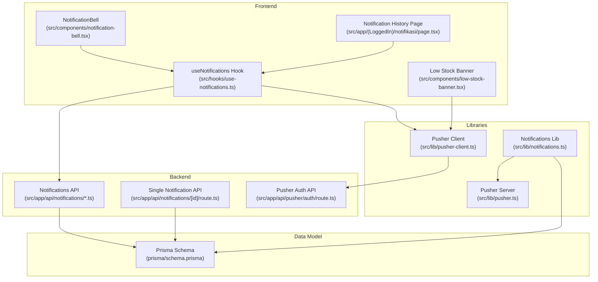
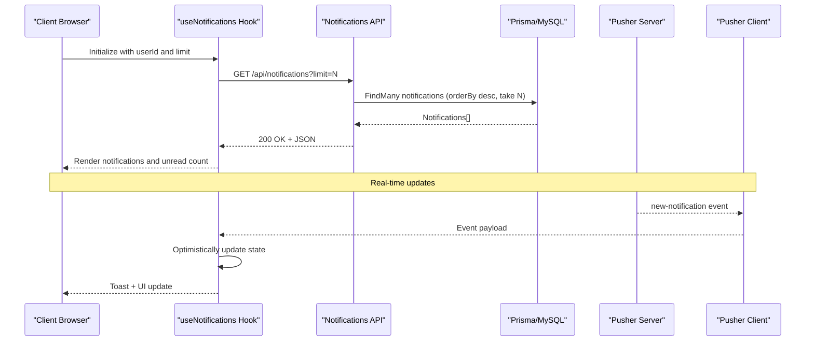
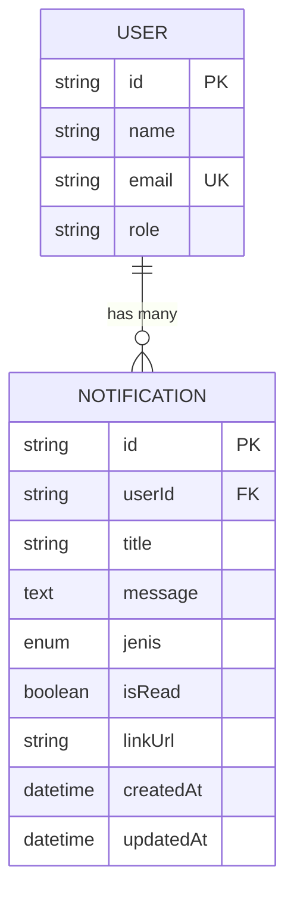
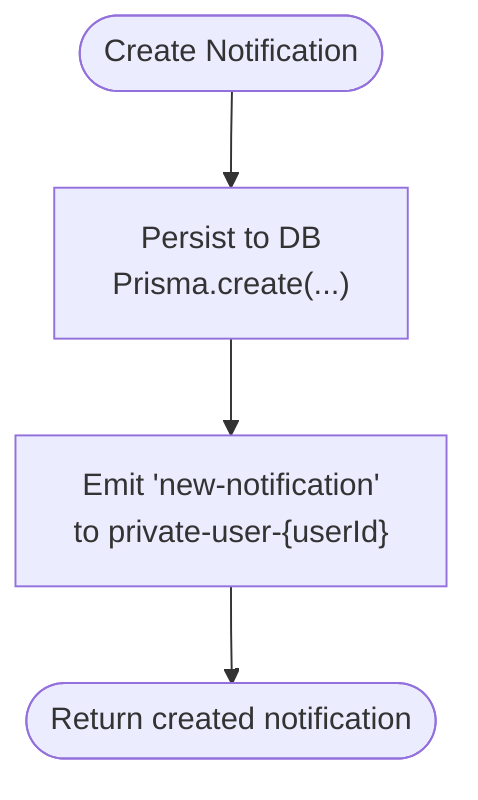
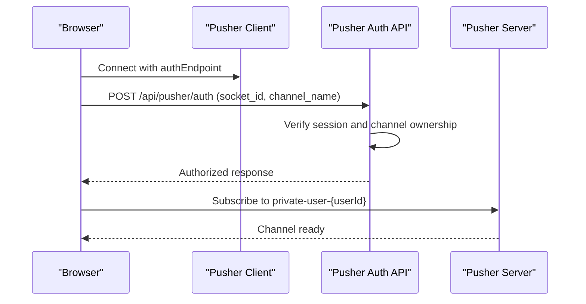
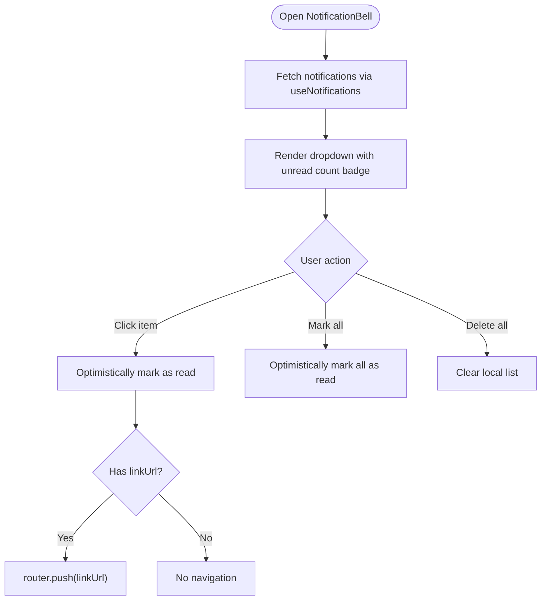
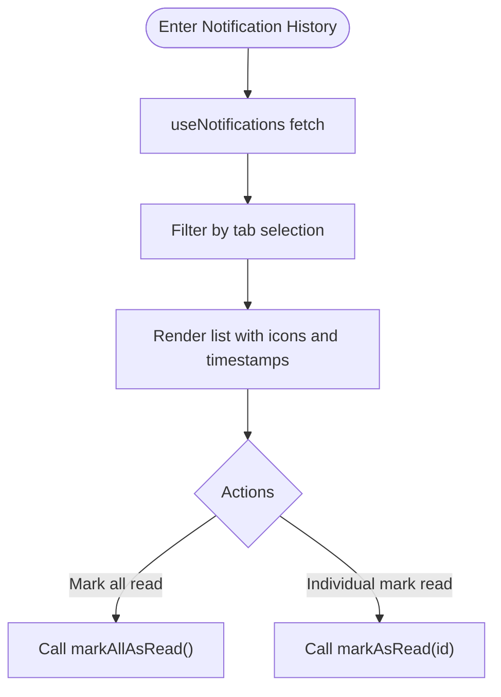
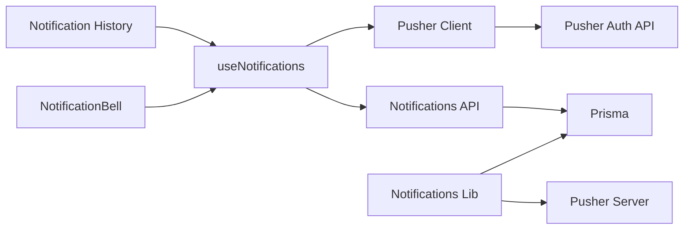

# Notification System Architecture

<cite>
**Referenced Files in This Document**
- [notification-bell.tsx](file://src/components/notification-bell.tsx)
- [use-notifications.ts](file://src/hooks/use-notifications.ts)
- [notifications.ts](file://src/lib/notifications.ts)
- [route.ts](file://src/app/api/notifications/route.ts)
- [route.ts](file://src/app/api/notifications/[id]/route.ts)
- [route.ts](file://src/app/api/pusher/auth/route.ts)
- [pusher-client.ts](file://src/lib/pusher-client.ts)
- [pusher.ts](file://src/lib/pusher.ts)
- [schema.prisma](file://prisma/schema.prisma)
- [page.tsx](file://src/app/(LoggedIn)/notifikasi/page.tsx)
- [low-stock-banner.tsx](file://src/components/low-stock-banner.tsx)
</cite>

## Table of Contents
1. [Introduction](#introduction)
2. [Project Structure](#project-structure)
3. [Core Components](#core-components)
4. [Architecture Overview](#architecture-overview)
5. [Detailed Component Analysis](#detailed-component-analysis)
6. [Dependency Analysis](#dependency-analysis)
7. [Performance Considerations](#performance-considerations)
8. [Troubleshooting Guide](#troubleshooting-guide)
9. [Conclusion](#conclusion)

## Introduction
This document describes the notification system architecture and implementation. It covers the notification data model, supported notification types, lifecycle management, creation and delivery mechanisms, user preference handling, the notification bell component, unread count tracking, and notification history display. It also documents the API endpoints for CRUD operations, bulk actions, and real-time delivery, along with practical examples and guidance for filtering, sorting, pagination, scheduling, batch processing, and performance optimization for large notification volumes.

## Project Structure
The notification system spans frontend React components, a reusable hook for state and real-time updates, backend API routes, and Prisma data modeling. Real-time delivery leverages Pusher/Soketi with private channels and server-side authorization.

**Diagram sources**
- [notification-bell.tsx:1-219](file://src/components/notification-bell.tsx#L1-219)
- [use-notifications.ts:1-112](file://src/hooks/use-notifications.ts#L1-112)
- [page.tsx](file://src/app/(LoggedIn)/notifikasi/page.tsx#L1-236)
- [low-stock-banner.tsx:1-73](file://src/components/low-stock-banner.tsx#L1-73)
- [route.ts:1-77](file://src/app/api/notifications/route.ts#L1-77)
- [route.ts:1-68](file://src/app/api/notifications/[id]/route.ts#L1-68)
- [route.ts:1-40](file://src/app/api/pusher/auth/route.ts#L1-40)
- [pusher-client.ts:1-21](file://src/lib/pusher-client.ts#L1-21)
- [pusher.ts:1-11](file://src/lib/pusher.ts#L1-11)
- [notifications.ts:1-122](file://src/lib/notifications.ts#L1-122)
- [schema.prisma:603-630](file://prisma/schema.prisma#L603-L630)

**Section sources**
- [notification-bell.tsx:1-219](file://src/components/notification-bell.tsx#L1-219)
- [use-notifications.ts:1-112](file://src/hooks/use-notifications.ts#L1-112)
- [page.tsx](file://src/app/(LoggedIn)/notifikasi/page.tsx#L1-236)
- [low-stock-banner.tsx:1-73](file://src/components/low-stock-banner.tsx#L1-73)
- [route.ts:1-77](file://src/app/api/notifications/route.ts#L1-77)
- [route.ts:1-68](file://src/app/api/notifications/[id]/route.ts#L1-68)
- [route.ts:1-40](file://src/app/api/pusher/auth/route.ts#L1-40)
- [pusher-client.ts:1-21](file://src/lib/pusher-client.ts#L1-21)
- [pusher.ts:1-11](file://src/lib/pusher.ts#L1-11)
- [notifications.ts:1-122](file://src/lib/notifications.ts#L1-122)
- [schema.prisma:603-630](file://prisma/schema.prisma#L603-L630)

## Core Components
- NotificationBell: Renders the notification dropdown with unread badge, action buttons, and preview list.
- useNotifications: Centralizes fetching, real-time updates, unread count calculation, and bulk actions.
- Notifications Library: Provides helpers to create notifications, broadcast via Pusher, and role-based distribution.
- API Routes: Expose endpoints for listing, marking as read, deleting, and single-item operations.
- Pusher Integration: Private channels with server-side authorization for secure real-time delivery.
- Data Model: Defines Notification entity and enumeration of notification types.

**Section sources**
- [notification-bell.tsx:34-218](file://src/components/notification-bell.tsx#L34-L218)
- [use-notifications.ts:17-111](file://src/hooks/use-notifications.ts#L17-L111)
- [notifications.ts:18-121](file://src/lib/notifications.ts#L18-L121)
- [route.ts:14-76](file://src/app/api/notifications/route.ts#L14-L76)
- [route.ts:18-67](file://src/app/api/notifications/[id]/route.ts#L18-L67)
- [route.ts:9-39](file://src/app/api/pusher/auth/route.ts#L9-L39)
- [schema.prisma:603-630](file://prisma/schema.prisma#L603-L630)

## Architecture Overview
The system combines persistent storage (Prisma/MySQL) with real-time delivery (Pusher/Soketi). Frontend components rely on a custom hook to fetch paginated notifications and subscribe to private channels. Backend APIs enforce authentication and authorization, while the notifications library encapsulates creation and broadcasting logic.

**Diagram sources**
- [use-notifications.ts:21-61](file://src/hooks/use-notifications.ts#L21-L61)
- [route.ts:14-38](file://src/app/api/notifications/route.ts#L14-L38)
- [schema.prisma:603-618](file://prisma/schema.prisma#L603-L618)
- [pusher-client.ts:6-19](file://src/lib/pusher-client.ts#L6-L19)
- [pusher.ts:3-10](file://src/lib/pusher.ts#L3-L10)

## Detailed Component Analysis

### Data Model and Types
The Notification entity stores metadata and state, with a foreign key to the User model. The notification types are defined as an enum.

**Diagram sources**
- [schema.prisma:15-42](file://prisma/schema.prisma#L15-L42)
- [schema.prisma:603-618](file://prisma/schema.prisma#L603-L618)

Supported notification types include order-related, stock alerts, financial events, and system messages.

**Section sources**
- [schema.prisma:620-630](file://prisma/schema.prisma#L620-L630)

### Notification Creation and Delivery
Notifications are created via a library function that persists to the database and emits a real-time event to the user’s private channel. Role-based helpers broadcast to multiple users.

**Diagram sources**
- [notifications.ts:18-42](file://src/lib/notifications.ts#L18-L42)

**Section sources**
- [notifications.ts:18-42](file://src/lib/notifications.ts#L18-L42)
- [notifications.ts:47-61](file://src/lib/notifications.ts#L47-L61)
- [notifications.ts:67-98](file://src/lib/notifications.ts#L67-L98)
- [notifications.ts:103-121](file://src/lib/notifications.ts#L103-L121)

### Real-Time Delivery and Authorization
Real-time delivery uses Pusher/Soketi with private channels. The client establishes a connection and subscribes to a channel derived from the authenticated user’s ID. Server-side authorization ensures clients can only subscribe to their own channel.

**Diagram sources**
- [pusher-client.ts:6-19](file://src/lib/pusher-client.ts#L6-L19)
- [route.ts:9-39](file://src/app/api/pusher/auth/route.ts#L9-L39)
- [pusher.ts:3-10](file://src/lib/pusher.ts#L3-L10)

**Section sources**
- [pusher-client.ts:1-21](file://src/lib/pusher-client.ts#L1-L21)
- [route.ts:1-40](file://src/app/api/pusher/auth/route.ts#L1-L40)
- [pusher.ts:1-11](file://src/lib/pusher.ts#L1-L11)

### NotificationBell Component
The bell component displays an unread badge, action buttons (mark all as read, delete all), and a scrollable preview list. Clicking an item marks it as read and navigates to a linked resource if present.

**Diagram sources**
- [notification-bell.tsx:34-218](file://src/components/notification-bell.tsx#L34-L218)
- [use-notifications.ts:67-100](file://src/hooks/use-notifications.ts#L67-L100)

**Section sources**
- [notification-bell.tsx:34-218](file://src/components/notification-bell.tsx#L34-L218)
- [use-notifications.ts:17-111](file://src/hooks/use-notifications.ts#L17-L111)

### Notification History Page
The history page provides filtering by read/unread and by notification type, with a tabbed interface and bulk mark-as-read capability.

**Diagram sources**
- [page.tsx](file://src/app/(LoggedIn)/notifikasi/page.tsx#L33-L236)
- [use-notifications.ts:67-100](file://src/hooks/use-notifications.ts#L67-L100)

**Section sources**
- [page.tsx](file://src/app/(LoggedIn)/notifikasi/page.tsx#L1-L236)
- [use-notifications.ts:17-111](file://src/hooks/use-notifications.ts#L17-L111)

### Low Stock Banner Integration
The low stock banner listens for relevant notifications and refreshes its data accordingly, keeping users informed of stock-related events.

**Section sources**
- [low-stock-banner.tsx:19-50](file://src/components/low-stock-banner.tsx#L19-L50)

## Dependency Analysis
The notification system exhibits clear separation of concerns:
- Frontend depends on the hook for state and real-time updates.
- The hook depends on API routes for persistence and Pusher client for real-time.
- The notifications library encapsulates domain logic and interacts with Prisma and Pusher server.
- API routes depend on Prisma for data access and authentication middleware for security.

**Diagram sources**
- [notification-bell.tsx:25-41](file://src/components/notification-bell.tsx#L25-L41)
- [use-notifications.ts:4-61](file://src/hooks/use-notifications.ts#L4-L61)
- [notifications.ts:1-11](file://src/lib/notifications.ts#L1-L11)
- [route.ts:1-4](file://src/app/api/notifications/route.ts#L1-L4)
- [route.ts:1-4](file://src/app/api/pusher/auth/route.ts#L1-L4)
- [pusher-client.ts:1-4](file://src/lib/pusher-client.ts#L1-L4)
- [pusher.ts:1-10](file://src/lib/pusher.ts#L1-L10)
- [schema.prisma:603-618](file://prisma/schema.prisma#L603-L618)

**Section sources**
- [notification-bell.tsx:1-219](file://src/components/notification-bell.tsx#L1-L219)
- [use-notifications.ts:1-112](file://src/hooks/use-notifications.ts#L1-L112)
- [notifications.ts:1-122](file://src/lib/notifications.ts#L1-L122)
- [route.ts:1-77](file://src/app/api/notifications/route.ts#L1-L77)
- [route.ts:1-68](file://src/app/api/notifications/[id]/route.ts#L1-L68)
- [route.ts:1-40](file://src/app/api/pusher/auth/route.ts#L1-L40)
- [pusher-client.ts:1-21](file://src/lib/pusher-client.ts#L1-L21)
- [pusher.ts:1-11](file://src/lib/pusher.ts#L1-L11)
- [schema.prisma:603-630](file://prisma/schema.prisma#L603-L630)

## API Endpoints and Operations

### Notifications Feed
- GET /api/notifications
  - Query parameters:
    - limit: integer (default 50)
    - unreadOnly: boolean (optional)
  - Returns: Array of notifications ordered by creation date descending
  - Pagination: controlled by limit; implement additional pagination by offset/after if needed

**Section sources**
- [route.ts:14-38](file://src/app/api/notifications/route.ts#L14-L38)

### Bulk Actions
- PATCH /api/notifications
  - Marks all unread notifications for the current user as read
  - Returns success indicator

**Section sources**
- [route.ts:40-59](file://src/app/api/notifications/route.ts#L40-L59)

- DELETE /api/notifications
  - Deletes all notifications for the current user
  - Returns success indicator

**Section sources**
- [route.ts:61-76](file://src/app/api/notifications/route.ts#L61-L76)

### Single Notification Operations
- PATCH /api/notifications/[id]
  - Marks a specific notification as read (only if owned by the current user)
  - Returns success indicator

**Section sources**
- [route.ts:18-42](file://src/app/api/notifications/[id]/route.ts#L18-L42)

- DELETE /api/notifications/[id]
  - Deletes a specific notification (only if owned by the current user)
  - Returns success indicator

**Section sources**
- [route.ts:44-67](file://src/app/api/notifications/[id]/route.ts#L44-L67)

### Real-Time Authorization
- POST /api/pusher/auth
  - Validates session and ensures channel ownership (private-user-{userId})
  - Returns Pusher authorization response

**Section sources**
- [route.ts:9-39](file://src/app/api/pusher/auth/route.ts#L9-L39)

## Practical Examples

### Creating Different Notification Types
- New order: use the notifications library to create a notification with the appropriate type and link URL.
- Order status change: use the helper that broadcasts to relevant roles.
- Low stock alert: use the helper that checks stock thresholds and prevents duplicate notifications within 24 hours.

**Section sources**
- [notifications.ts:18-42](file://src/lib/notifications.ts#L18-L42)
- [notifications.ts:103-121](file://src/lib/notifications.ts#L103-L121)
- [notifications.ts:67-98](file://src/lib/notifications.ts#L67-L98)

### Managing Notification Preferences
- Unread count is computed client-side from the loaded notifications.
- Users can:
  - Mark individual notifications as read (optimistically updated UI, then persisted).
  - Mark all as read (bulk operation).
  - Delete all notifications (bulk operation).

**Section sources**
- [use-notifications.ts:63-100](file://src/hooks/use-notifications.ts#L63-L100)
- [notification-bell.tsx:115-147](file://src/components/notification-bell.tsx#L115-L147)

### Implementing Notification Feeds
- Use the hook to fetch notifications with a configurable limit.
- Apply filters client-side (by read status or type) in the history page.
- Display previews in the bell dropdown with relative timestamps.

**Section sources**
- [use-notifications.ts:17-38](file://src/hooks/use-notifications.ts#L17-L38)
- [page.tsx](file://src/app/(LoggedIn)/notifikasi/page.tsx#L42-L46)
- [notification-bell.tsx:165-202](file://src/components/notification-bell.tsx#L165-L202)

### Filtering, Sorting, and Pagination
- Filtering: client-side filtering by read status and type in the history page.
- Sorting: server-side ordering by creation date descending.
- Pagination: limit parameter controls page size; extend with cursor-based pagination for large datasets.

**Section sources**
- [route.ts:18-31](file://src/app/api/notifications/route.ts#L18-L31)
- [page.tsx](file://src/app/(LoggedIn)/notifikasi/page.tsx#L42-L46)

## Performance Considerations
- Real-time updates: The hook optimistically updates the UI upon receiving events, reducing perceived latency.
- Client-side unread count: Computed from the loaded list avoids extra requests.
- Efficient polling: Use reasonable limits and avoid frequent refetches; leverage SWR/fetcher patterns where appropriate.
- Database indexing: The schema includes indexes on user ID and read status to optimize queries.
- Batch operations: Prefer bulk mark-as-read and delete endpoints to minimize round-trips.
- Rate limiting: Prevent duplicate notifications (e.g., low stock within 24 hours) to reduce load.

[No sources needed since this section provides general guidance]

## Troubleshooting Guide
- Unauthorized access to Pusher channels:
  - Ensure the client is authenticated and attempting to subscribe to the correct private channel.
  - Verify the server-side authorization endpoint returns authorized responses only for the current user.

**Section sources**
- [route.ts:9-39](file://src/app/api/pusher/auth/route.ts#L9-L39)

- Notifications not appearing:
  - Confirm the client connects to the correct Pusher app configuration and auth endpoint.
  - Verify the notifications library emits events to the correct channel.

**Section sources**
- [pusher-client.ts:6-19](file://src/lib/pusher-client.ts#L6-L19)
- [notifications.ts:30-41](file://src/lib/notifications.ts#L30-L41)

- Bulk actions failing:
  - Check API responses for errors and ensure the current user owns the targeted notifications.

**Section sources**
- [route.ts:40-59](file://src/app/api/notifications/route.ts#L40-L59)
- [route.ts:29-41](file://src/app/api/notifications/[id]/route.ts#L29-L41)

## Conclusion
The notification system integrates a clean data model, robust real-time delivery via Pusher/Soketi, and a cohesive frontend experience through a dedicated hook and UI components. It supports essential operations—creation, retrieval, filtering, sorting, bulk actions, and real-time updates—while providing extensibility for advanced features like pagination, scheduling, and batch processing.