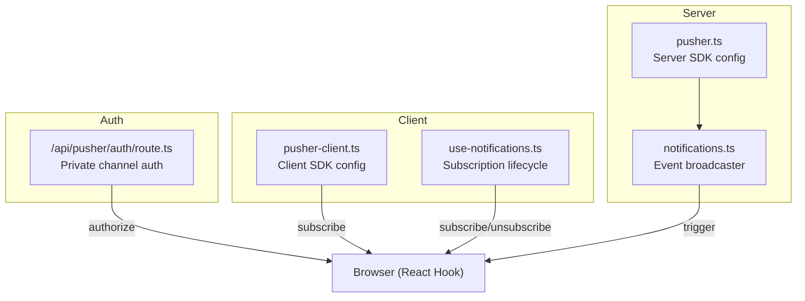
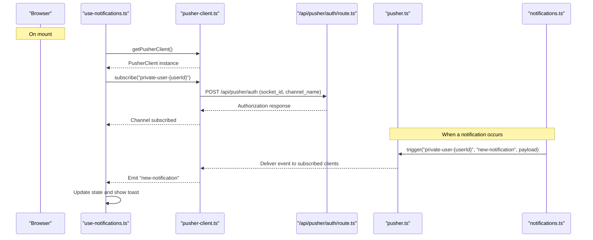
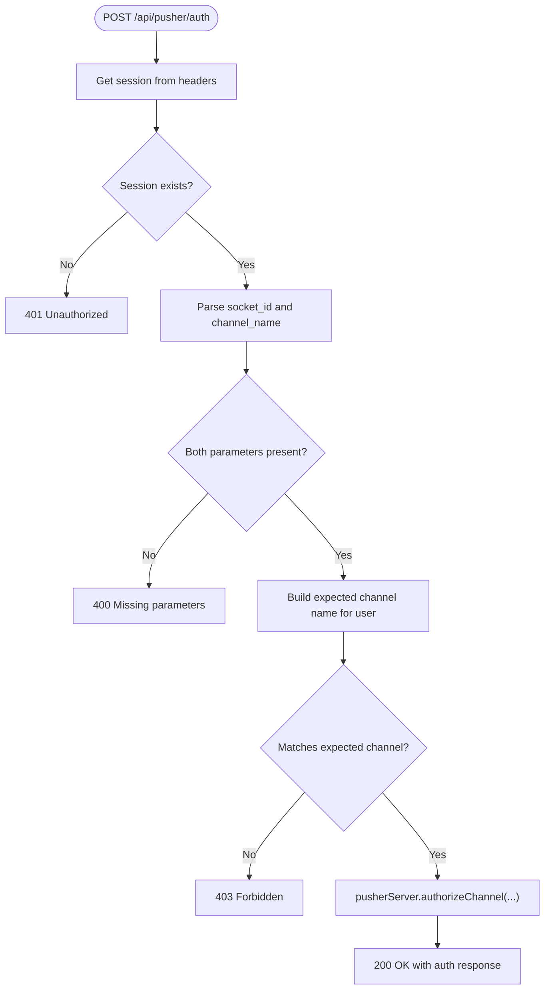
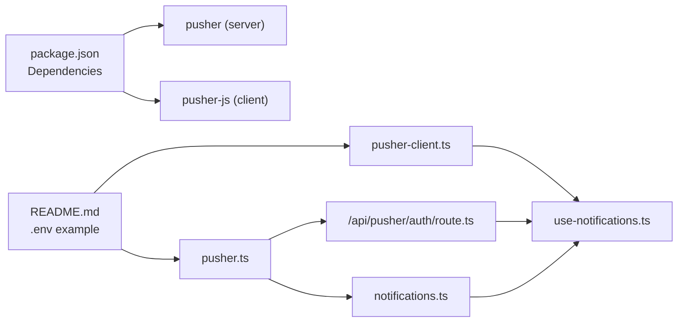

# Pusher WebSocket Integration

<cite>
**Referenced Files in This Document**
- [pusher.ts](file://src/lib/pusher.ts)
- [pusher-client.ts](file://src/lib/pusher-client.ts)
- [route.ts](file://src/app/api/pusher/auth/route.ts)
- [use-notifications.ts](file://src/hooks/use-notifications.ts)
- [notifications.ts](file://src/lib/notifications.ts)
- [README.md](file://README.md)
- [package.json](file://package.json)
</cite>

## Table of Contents
1. [Introduction](#introduction)
2. [Project Structure](#project-structure)
3. [Core Components](#core-components)
4. [Architecture Overview](#architecture-overview)
5. [Detailed Component Analysis](#detailed-component-analysis)
6. [Dependency Analysis](#dependency-analysis)
7. [Performance Considerations](#performance-considerations)
8. [Troubleshooting Guide](#troubleshooting-guide)
9. [Conclusion](#conclusion)

## Introduction
This document explains the Pusher WebSocket integration used for real-time notifications in the system. It covers server-side configuration, client-side integration, authentication for private channels, and operational patterns for broadcasting events. The implementation leverages a server SDK for triggering events and a browser SDK for subscribing to channels, with a dedicated Next.js API route handling authorization for private channels.

## Project Structure
The Pusher integration is organized around three primary areas:
- Server-side SDK initialization and event triggering
- Client-side SDK initialization and subscription lifecycle
- Authentication endpoint for private channel authorization

**Diagram sources**
- [pusher.ts:1-11](file://src/lib/pusher.ts#L1-L11)
- [notifications.ts:1-122](file://src/lib/notifications.ts#L1-L122)
- [pusher-client.ts:1-21](file://src/lib/pusher-client.ts#L1-L21)
- [use-notifications.ts:1-95](file://src/hooks/use-notifications.ts#L1-L95)
- [route.ts:1-41](file://src/app/api/pusher/auth/route.ts#L1-L41)

**Section sources**
- [pusher.ts:1-11](file://src/lib/pusher.ts#L1-L11)
- [pusher-client.ts:1-21](file://src/lib/pusher-client.ts#L1-L21)
- [route.ts:1-41](file://src/app/api/pusher/auth/route.ts#L1-L41)
- [use-notifications.ts:1-95](file://src/hooks/use-notifications.ts#L1-L95)
- [notifications.ts:1-122](file://src/lib/notifications.ts#L1-L122)

## Core Components
- Server SDK configuration: Centralized server-side Pusher client initialized with environment variables for app credentials, host, port, and TLS scheme.
- Client SDK configuration: Singleton client configured with host, ports, transports, and an auth endpoint for private channels.
- Private channel authorization: An API route that validates sessions, checks channel ownership, and authorizes subscriptions.
- Event broadcasting: A library function that persists notifications to the database and triggers real-time events to the user’s private channel.
- Client subscription hook: A React hook that subscribes to a user-specific private channel, binds to a named event, and manages lifecycle.

**Section sources**
- [pusher.ts:1-11](file://src/lib/pusher.ts#L1-L11)
- [pusher-client.ts:1-21](file://src/lib/pusher-client.ts#L1-L21)
- [route.ts:1-41](file://src/app/api/pusher/auth/route.ts#L1-L41)
- [notifications.ts:1-122](file://src/lib/notifications.ts#L1-L122)
- [use-notifications.ts:1-95](file://src/hooks/use-notifications.ts#L1-L95)

## Architecture Overview
The system uses a server-to-client real-time pattern:
- Server creates and persists notifications, then triggers a Pusher event on a user-scoped private channel.
- Client subscribes to the same private channel and listens for the event to update the UI.

**Diagram sources**
- [use-notifications.ts:40-61](file://src/hooks/use-notifications.ts#L40-L61)
- [pusher-client.ts:6-20](file://src/lib/pusher-client.ts#L6-L20)
- [route.ts:9-40](file://src/app/api/pusher/auth/route.ts#L9-L40)
- [pusher.ts:3-10](file://src/lib/pusher.ts#L3-L10)
- [notifications.ts:30-42](file://src/lib/notifications.ts#L30-L42)

## Detailed Component Analysis

### Server SDK Initialization
- Purpose: Provides a configured Pusher server client for triggering events.
- Key configuration:
  - App ID, key, secret, host, port, and TLS scheme derived from environment variables.
- Behavior: Used to authorize channels on the server and to trigger events to channels.

**Section sources**
- [pusher.ts:1-11](file://src/lib/pusher.ts#L1-L11)

### Client SDK Initialization and Singleton Pattern
- Purpose: Initializes the Pusher client in the browser with environment-driven settings.
- Key configuration:
  - Host, port, cluster, transport selection, and auth endpoint.
  - Singleton pattern prevents multiple connections during development and hot reload.
- Behavior: Exposes a factory to obtain a single client instance.

**Section sources**
- [pusher-client.ts:1-21](file://src/lib/pusher-client.ts#L1-L21)

### Private Channel Authorization Endpoint
- Purpose: Validates the incoming request, ensures the user is authenticated, checks that the requested channel belongs to the authenticated user, and authorizes the subscription.
- Request parameters:
  - socket_id: Provided by the client SDK.
  - channel_name: Must match the expected private channel format for the user.
- Security:
  - Enforces that channel names follow the pattern for the authenticated user.
  - Returns appropriate HTTP statuses for missing parameters, unauthorized access, or forbidden access.
- Response:
  - Returns the server authorization response for the client SDK to complete subscription.

**Diagram sources**
- [route.ts:9-40](file://src/app/api/pusher/auth/route.ts#L9-L40)

**Section sources**
- [route.ts:1-41](file://src/app/api/pusher/auth/route.ts#L1-L41)

### Real-Time Event Broadcasting
- Purpose: Persist a notification to the database and broadcast it to the user’s private channel.
- Steps:
  - Create notification record in the database.
  - Trigger a Pusher event on the user-scoped private channel with a specific event name.
  - Error handling logs failures to trigger events.
- Usage: Called from business logic to notify users in real time.

**Section sources**
- [notifications.ts:1-122](file://src/lib/notifications.ts#L1-L122)

### Client Subscription Lifecycle (React Hook)
- Purpose: Manage subscription to a user-specific private channel and handle real-time events.
- Steps:
  - Obtain the singleton client.
  - Subscribe to the user’s private channel.
  - Bind to a specific event name to update state and show notifications.
  - Cleanup: Unbind listeners and unsubscribe on unmount.
- Additional features:
  - Fetch initial notifications from the backend.
  - Compute unread counts and provide helpers to mark as read.

**Section sources**
- [use-notifications.ts:1-95](file://src/hooks/use-notifications.ts#L1-L95)

## Dependency Analysis
- Runtime dependencies:
  - pusher (server SDK)
  - pusher-js (client SDK)
- Environment-driven configuration:
  - Shared client and server configuration keys and host/port settings are documented in the project README.
- Inter-module dependencies:
  - The client hook depends on the client SDK factory.
  - The authorization route depends on the server SDK and the session manager.
  - The broadcaster depends on the server SDK and the database client.

**Diagram sources**
- [package.json:55-56](file://package.json#L55-L56)
- [README.md:91-98](file://README.md#L91-L98)
- [pusher.ts:1-11](file://src/lib/pusher.ts#L1-L11)
- [pusher-client.ts:1-21](file://src/lib/pusher-client.ts#L1-L21)
- [route.ts:1-41](file://src/app/api/pusher/auth/route.ts#L1-L41)
- [notifications.ts:1-122](file://src/lib/notifications.ts#L1-L122)
- [use-notifications.ts:1-95](file://src/hooks/use-notifications.ts#L1-L95)

**Section sources**
- [package.json:55-56](file://package.json#L55-L56)
- [README.md:91-98](file://README.md#L91-L98)

## Performance Considerations
- Connection pooling and reuse:
  - The client SDK is implemented as a singleton to avoid multiple connections during development and hot reload cycles.
- Transport selection:
  - Enabled transports include WebSocket and secure WebSocket, allowing efficient long-lived connections.
- Statistics:
  - Statistics are disabled in the client configuration to align with the server runtime capabilities.
- Event volume:
  - Broadcasting uses targeted private channels per user to minimize unnecessary fan-out.
- Backend load:
  - Authorization is delegated to the server SDK, ensuring cryptographic verification without heavy client-side work.

**Section sources**
- [pusher-client.ts:1-21](file://src/lib/pusher-client.ts#L1-L21)
- [route.ts:1-41](file://src/app/api/pusher/auth/route.ts#L1-L41)
- [notifications.ts:1-122](file://src/lib/notifications.ts#L1-L122)

## Troubleshooting Guide
- Authentication failures:
  - Missing or invalid session: Returns unauthorized status from the auth endpoint.
  - Missing parameters: Returns bad request status when socket_id or channel_name is absent.
  - Channel mismatch: Returns forbidden status if the requested channel does not belong to the authenticated user.
- Event delivery issues:
  - Errors during event triggering are logged; verify server credentials and channel names.
- Client subscription lifecycle:
  - Ensure the hook subscribes only when a user ID is available.
  - Verify that the event name used by the server matches the client binding.
- Environment configuration:
  - Confirm that the shared client and server environment variables are set consistently.

**Section sources**
- [route.ts:1-41](file://src/app/api/pusher/auth/route.ts#L1-L41)
- [use-notifications.ts:1-95](file://src/hooks/use-notifications.ts#L1-L95)
- [notifications.ts:1-122](file://src/lib/notifications.ts#L1-L122)
- [README.md:91-98](file://README.md#L91-L98)

## Conclusion
The Pusher integration in this project provides a clean separation between server-side event broadcasting and client-side subscription management. Private channels are secured through an explicit authorization endpoint, and the client uses a singleton SDK to maintain efficient connections. The architecture supports targeted, user-scoped notifications with straightforward subscription and lifecycle management in React.