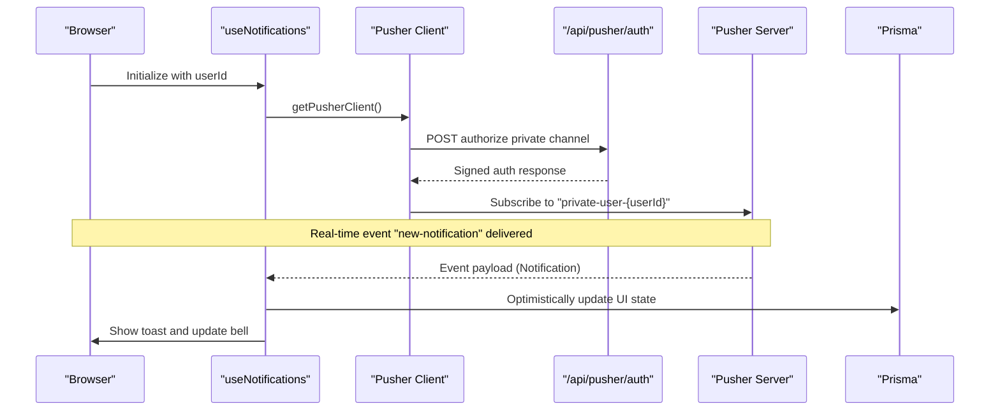
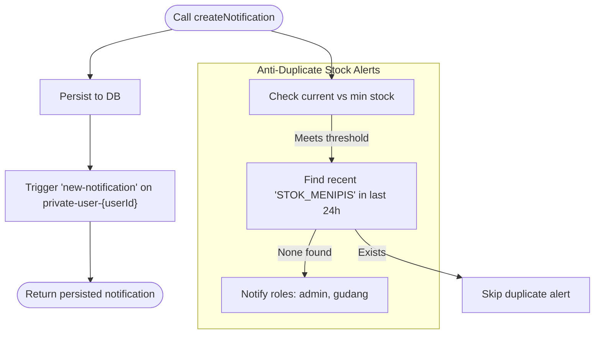
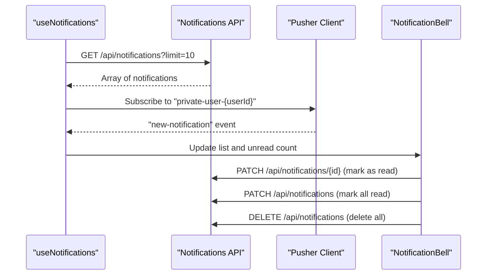
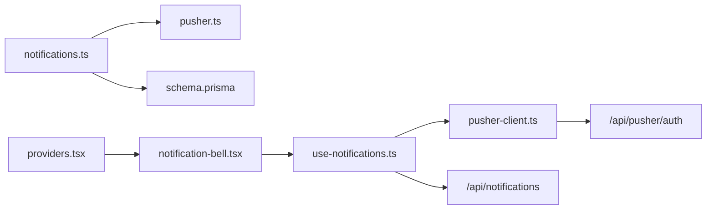
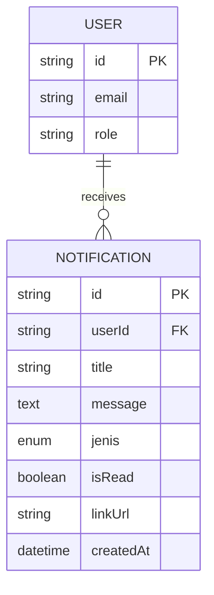

# Real-time Features & Notifications

<cite>
**Referenced Files in This Document**
- [pusher.ts](file://src/lib/pusher.ts)
- [pusher-client.ts](file://src/lib/pusher-client.ts)
- [route.ts](file://src/app/api/pusher/auth/route.ts)
- [notifications.ts](file://src/lib/notifications.ts)
- [notification-bell.tsx](file://src/components/notification-bell.tsx)
- [use-notifications.ts](file://src/hooks/use-notifications.ts)
- [route.ts](file://src/app/api/notifications/route.ts)
- [route.ts](file://src/app/api/order/[id]/comments/read/route.ts)
- [route.ts](file://src/app/api/comments/unread/route.ts)
- [schema.prisma](file://prisma/schema.prisma)
- [providers.tsx](file://src/app/providers.tsx)
- [layout.tsx](file://src/app/layout.tsx)
</cite>

## Table of Contents
1. [Introduction](#introduction)
2. [Project Structure](#project-structure)
3. [Core Components](#core-components)
4. [Architecture Overview](#architecture-overview)
5. [Detailed Component Analysis](#detailed-component-analysis)
6. [Dependency Analysis](#dependency-analysis)
7. [Performance Considerations](#performance-considerations)
8. [Troubleshooting Guide](#troubleshooting-guide)
9. [Conclusion](#conclusion)
10. [Appendices](#appendices)

## Introduction
This document explains the real-time features and notification system built on Pusher/Soketi. It covers WebSocket integration, real-time event broadcasting, and live updates across business modules such as order status, production workflow, inventory alerts, and financial transactions. It also documents the notification architecture, types, user preferences, delivery mechanisms, and client-side integration. Practical examples, configuration, authentication, channel management, scalability, and troubleshooting guidance are included.

## Project Structure
The real-time and notification system spans backend libraries, API routes, frontend hooks, and UI components:
- Backend libraries initialize Pusher/Soketi clients and expose helpers to create notifications and broadcast events.
- API routes handle user authentication, channel authorization, and notification CRUD operations.
- Frontend hooks and components manage subscription, rendering, and user interactions for notifications.

```mermaid
graph TB
subgraph "Frontend"
NB["NotificationBell<br/>(UI)"]
UN["useNotifications<br/>(Hook)"]
PC["getPusherClient()<br/>(Client)"]
end
subgraph "Backend"
NA["/api/pusher/auth<br/>(Private Channel Auth)"]
NN["/api/notifications<br/>(CRUD)"]
NC["Notifications Lib<br/>(Helpers)"]
PS["pusherServer<br/>(Server)"]
end
subgraph "Database"
PRISMA["Prisma Schema<br/>Notification Model"]
end
NB --> UN
UN --> PC
PC <- --> NA
UN --> NN
NC --> PS
NC --> PRISMA
PS --> PRISMA
```

**Diagram sources**
- [notification-bell.tsx:34-218](file://src/components/notification-bell.tsx#L34-L218)
- [use-notifications.ts:17-111](file://src/hooks/use-notifications.ts#L17-L111)
- [pusher-client.ts:6-20](file://src/lib/pusher-client.ts#L6-L20)
- [route.ts:9-40](file://src/app/api/pusher/auth/route.ts#L9-L40)
- [route.ts:14-76](file://src/app/api/notifications/route.ts#L14-L76)
- [notifications.ts:18-42](file://src/lib/notifications.ts#L18-L42)
- [pusher.ts:3-10](file://src/lib/pusher.ts#L3-L10)
- [schema.prisma:603-630](file://prisma/schema.prisma#L603-L630)

**Section sources**
- [pusher.ts:1-11](file://src/lib/pusher.ts#L1-L11)
- [pusher-client.ts:1-21](file://src/lib/pusher-client.ts#L1-L21)
- [route.ts:1-41](file://src/app/api/pusher/auth/route.ts#L1-L41)
- [notifications.ts:1-122](file://src/lib/notifications.ts#L1-L122)
- [notification-bell.tsx:1-219](file://src/components/notification-bell.tsx#L1-L219)
- [use-notifications.ts:1-112](file://src/hooks/use-notifications.ts#L1-L112)
- [route.ts:1-77](file://src/app/api/notifications/route.ts#L1-L77)
- [schema.prisma:603-630](file://prisma/schema.prisma#L603-L630)

## Core Components
- Pusher server initialization for event triggering.
- Pusher client singleton for WebSocket subscriptions.
- Private channel authorization endpoint.
- Notification creation helpers and anti-duplication logic.
- Frontend notification bell and hook for live updates.
- Notification API for fetching, marking read, and clearing notifications.
- Additional comment-related unread counters and batch-read endpoints.

Key responsibilities:
- Real-time event broadcasting via private channels.
- Secure channel subscription using signed auth.
- Persistent notification storage with unread tracking.
- Live UI updates with optimistic UI and toast feedback.

**Section sources**
- [pusher.ts:3-10](file://src/lib/pusher.ts#L3-L10)
- [pusher-client.ts:6-20](file://src/lib/pusher-client.ts#L6-L20)
- [route.ts:9-40](file://src/app/api/pusher/auth/route.ts#L9-L40)
- [notifications.ts:18-42](file://src/lib/notifications.ts#L18-L42)
- [notification-bell.tsx:34-218](file://src/components/notification-bell.tsx#L34-L218)
- [use-notifications.ts:17-111](file://src/hooks/use-notifications.ts#L17-L111)
- [route.ts:14-76](file://src/app/api/notifications/route.ts#L14-L76)

## Architecture Overview
The system uses a private-channel pattern to deliver targeted notifications to users. The backend stores notifications in the database and triggers Pusher events to subscribed clients. The frontend subscribes to the user’s private channel and renders live updates with a notification bell.



**Diagram sources**
- [use-notifications.ts:40-61](file://src/hooks/use-notifications.ts#L40-L61)
- [pusher-client.ts:6-20](file://src/lib/pusher-client.ts#L6-L20)
- [route.ts:9-40](file://src/app/api/pusher/auth/route.ts#L9-L40)
- [pusher.ts:3-10](file://src/lib/pusher.ts#L3-L10)
- [schema.prisma:603-618](file://prisma/schema.prisma#L603-L618)

## Detailed Component Analysis

### Pusher Server Initialization
- Initializes the Pusher server SDK with environment variables for app credentials, host, port, and TLS scheme.
- Used to trigger events on private channels after persisting notifications.

**Section sources**
- [pusher.ts:3-10](file://src/lib/pusher.ts#L3-L10)

### Pusher Client Singleton
- Ensures a single WebSocket connection instance to avoid duplication during development and hot reload.
- Configures transports, disables stats, and sets the private channel auth endpoint.

**Section sources**
- [pusher-client.ts:6-20](file://src/lib/pusher-client.ts#L6-L20)

### Private Channel Authorization
- Validates session, checks presence of required parameters, and enforces channel ownership (only the user’s private channel).
- Returns a signed authorization response for the client to subscribe securely.

**Section sources**
- [route.ts:9-40](file://src/app/api/pusher/auth/route.ts#L9-L40)

### Notification Creation Helpers
- Persists a notification to the database and triggers a real-time event on the user’s private channel.
- Provides helpers to notify users by role and to avoid duplicate low-stock alerts within a 24-hour window.
- Provides a helper to notify relevant roles about order status changes.



**Diagram sources**
- [notifications.ts:18-42](file://src/lib/notifications.ts#L18-L42)
- [notifications.ts:67-98](file://src/lib/notifications.ts#L67-L98)
- [notifications.ts:103-121](file://src/lib/notifications.ts#L103-L121)

**Section sources**
- [notifications.ts:18-42](file://src/lib/notifications.ts#L18-L42)
- [notifications.ts:67-98](file://src/lib/notifications.ts#L67-L98)
- [notifications.ts:103-121](file://src/lib/notifications.ts#L103-L121)

### Notification Bell Component
- Renders a dropdown bell with unread badge, actions to mark all as read and delete all, and a scrollable list of recent notifications.
- Uses icons mapped to notification types and navigates to linked URLs when items are clicked.
- Integrates with toast feedback for incoming notifications.

**Section sources**
- [notification-bell.tsx:34-218](file://src/components/notification-bell.tsx#L34-L218)

### Notifications Hook
- Subscribes to the user’s private channel and binds to the “new-notification” event.
- Fetches paginated notifications on mount and exposes methods to mark individual/all as read and to delete all.
- Maintains an optimistic UI state and syncs with the backend via PATCH/DELETE.



**Diagram sources**
- [use-notifications.ts:21-38](file://src/hooks/use-notifications.ts#L21-L38)
- [use-notifications.ts:40-61](file://src/hooks/use-notifications.ts#L40-L61)
- [route.ts:14-76](file://src/app/api/notifications/route.ts#L14-L76)

**Section sources**
- [use-notifications.ts:17-111](file://src/hooks/use-notifications.ts#L17-L111)
- [route.ts:14-76](file://src/app/api/notifications/route.ts#L14-L76)

### Notification Types and Delivery
- Notification types include order lifecycle, stock alerts, receipts, costs, and system messages.
- Delivery targets users individually or roles via helper functions.
- Optional links guide users to relevant pages.

**Section sources**
- [schema.prisma:620-630](file://prisma/schema.prisma#L620-L630)
- [notifications.ts:103-121](file://src/lib/notifications.ts#L103-L121)

### Comment Unread Tracking and Batch Read
- Unread comment count endpoint aggregates rows in the comment recipient table.
- Batch mark-as-read endpoint updates all unread comments for the current user.

**Section sources**
- [route.ts:6-25](file://src/app/api/comments/unread/route.ts#L6-L25)
- [route.ts:8-43](file://src/app/api/order/[id]/comments/read/route.ts#L8-L43)

## Dependency Analysis
- The frontend depends on the Pusher client library and the Next.js auth/session layer.
- The backend depends on Prisma for persistence, the Pusher server SDK for event triggering, and the auth module for session validation.
- The notification bell and hook depend on the providers setup for toast integration.



**Diagram sources**
- [pusher-client.ts:6-20](file://src/lib/pusher-client.ts#L6-L20)
- [route.ts:9-40](file://src/app/api/pusher/auth/route.ts#L9-L40)
- [notifications.ts:18-42](file://src/lib/notifications.ts#L18-L42)
- [pusher.ts:3-10](file://src/lib/pusher.ts#L3-L10)
- [schema.prisma:603-618](file://prisma/schema.prisma#L603-L618)
- [use-notifications.ts:17-111](file://src/hooks/use-notifications.ts#L17-L111)
- [route.ts:14-76](file://src/app/api/notifications/route.ts#L14-L76)
- [notification-bell.tsx:34-218](file://src/components/notification-bell.tsx#L34-L218)
- [providers.tsx:6-13](file://src/app/providers.tsx#L6-L13)

**Section sources**
- [pusher-client.ts:1-21](file://src/lib/pusher-client.ts#L1-L21)
- [route.ts:1-41](file://src/app/api/pusher/auth/route.ts#L1-L41)
- [notifications.ts:1-122](file://src/lib/notifications.ts#L1-L122)
- [pusher.ts:1-11](file://src/lib/pusher.ts#L1-L11)
- [schema.prisma:603-630](file://prisma/schema.prisma#L603-L630)
- [use-notifications.ts:1-112](file://src/hooks/use-notifications.ts#L1-L112)
- [route.ts:1-77](file://src/app/api/notifications/route.ts#L1-L77)
- [notification-bell.tsx:1-219](file://src/components/notification-bell.tsx#L1-L219)
- [providers.tsx:1-14](file://src/app/providers.tsx#L1-L14)

## Performance Considerations
- Use a singleton Pusher client to avoid redundant connections and reduce overhead.
- Limit notification fetch sizes and render only recent items in the bell to minimize DOM and network load.
- Debounce or batch UI updates when receiving bursts of events.
- Offload heavy computations to the backend (e.g., anti-duplication queries) and keep client-side logic minimal.
- Monitor transport selection and disable stats for environments that do not support them.
- Scale Pusher/Soketi horizontally and ensure sticky sessions if required by your deployment.

[No sources needed since this section provides general guidance]

## Troubleshooting Guide
Common issues and resolutions:
- Unauthorized or missing parameters in channel auth:
  - Verify session availability and presence of socket_id and channel_name.
  - Confirm channel name matches the expected private-user-{userId} pattern.
- TLS and host/port misconfiguration:
  - Ensure NEXT_PUBLIC_PUSHER_SCHEME aligns with TLS usage and ports match Soketi configuration.
- No real-time updates:
  - Confirm the client is subscribed to the correct private channel and the server triggers the event on that channel.
  - Check for errors in the Pusher auth endpoint and verify environment variables are loaded.
- Toasts not appearing:
  - Ensure the Providers wrapper is present in the app layout to enable toast integration.

**Section sources**
- [route.ts:9-40](file://src/app/api/pusher/auth/route.ts#L9-L40)
- [pusher-client.ts:6-20](file://src/lib/pusher-client.ts#L6-L20)
- [pusher.ts:3-10](file://src/lib/pusher.ts#L3-L10)
- [providers.tsx:6-13](file://src/app/providers.tsx#L6-L13)

## Conclusion
The system integrates Pusher/Soketi with a secure private-channel authorization model, robust notification helpers, and a responsive frontend bell. It supports real-time updates across orders, production, inventory, and finance while maintaining user privacy and performance. The modular design allows easy extension to new notification types and business modules.

[No sources needed since this section summarizes without analyzing specific files]

## Appendices

### Environment Variables
- NEXT_PUBLIC_PUSHER_KEY
- NEXT_PUBLIC_PUSHER_HOST
- NEXT_PUBLIC_PUSHER_PORT
- NEXT_PUBLIC_PUSHER_SCHEME
- PUSHER_APP_ID
- PUSHER_SECRET

**Section sources**
- [pusher.ts:4-10](file://src/lib/pusher.ts#L4-L10)
- [pusher-client.ts:8-16](file://src/lib/pusher-client.ts#L8-L16)

### Notification Types Reference
- ORDER_BARU
- STATUS_ORDER_UBAH
- DEADLINE_DEKAT
- STOK_MENIPIS
- PENERIMAAN_BARU
- PAYMENT_MASUK
- BIAYA_DICATAT
- BARANG_KELUAR
- SISTEM

**Section sources**
- [schema.prisma:620-630](file://prisma/schema.prisma#L620-L630)

### Data Model Overview


**Diagram sources**
- [schema.prisma:15-42](file://prisma/schema.prisma#L15-L42)
- [schema.prisma:603-618](file://prisma/schema.prisma#L603-L618)