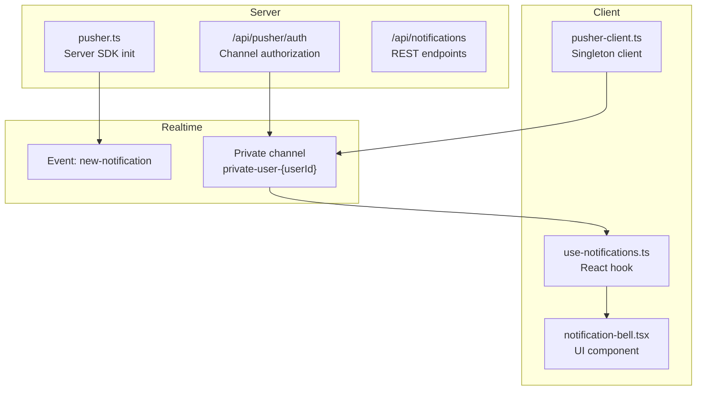
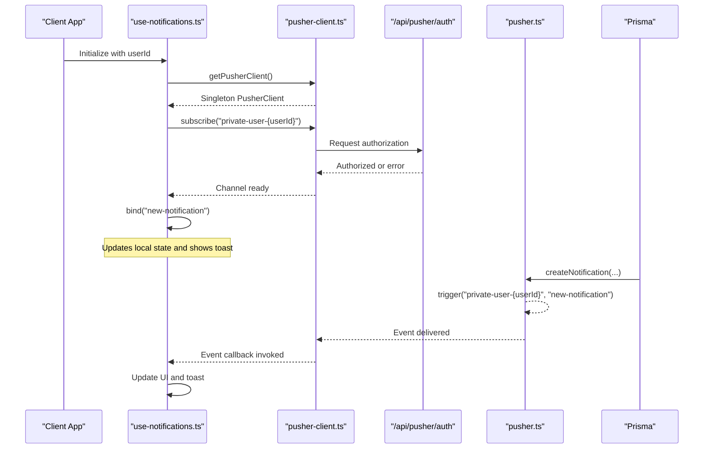
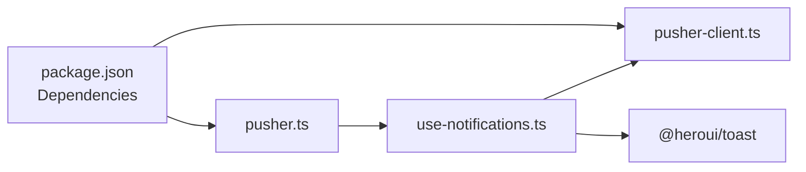

# WebSocket Connection Management

<cite>
**Referenced Files in This Document**
- [pusher.ts](file://src/lib/pusher.ts)
- [pusher-client.ts](file://src/lib/pusher-client.ts)
- [use-notifications.ts](file://src/hooks/use-notifications.ts)
- [notification-bell.tsx](file://src/components/notification-bell.tsx)
- [notifications.ts](file://src/lib/notifications.ts)
- [route.ts](file://src/app/api/pusher/auth/route.ts)
- [route.ts](file://src/app/api/notifications/route.ts)
- [package.json](file://package.json)
</cite>

## Table of Contents
1. [Introduction](#introduction)
2. [Project Structure](#project-structure)
3. [Core Components](#core-components)
4. [Architecture Overview](#architecture-overview)
5. [Detailed Component Analysis](#detailed-component-analysis)
6. [Dependency Analysis](#dependency-analysis)
7. [Performance Considerations](#performance-considerations)
8. [Troubleshooting Guide](#troubleshooting-guide)
9. [Conclusion](#conclusion)

## Introduction
This document explains WebSocket connection management and client-side integration for real-time notifications. It covers connection establishment, maintenance, and cleanup; client-side event handling and subscription management; connection state monitoring; notification hook implementation; automatic reconnection and error recovery strategies; practical examples for multiple channel subscriptions; bandwidth optimization; connection pooling and memory management; performance monitoring; React integration with useEffect patterns and cleanup; and troubleshooting for common WebSocket issues, timeouts, and browser compatibility.

## Project Structure
The WebSocket implementation spans three layers:
- Server-side SDK initialization for triggering events
- Client-side singleton Pusher client for subscriptions
- React hooks and components for real-time updates and UI integration

**Diagram sources**
- [pusher.ts:1-11](file://src/lib/pusher.ts#L1-L11)
- [route.ts:1-41](file://src/app/api/pusher/auth/route.ts#L1-L41)
- [route.ts:1-77](file://src/app/api/notifications/route.ts#L1-L77)
- [pusher-client.ts:1-21](file://src/lib/pusher-client.ts#L1-L21)
- [use-notifications.ts:1-112](file://src/hooks/use-notifications.ts#L1-L112)
- [notification-bell.tsx:1-219](file://src/components/notification-bell.tsx#L1-L219)

**Section sources**
- [pusher.ts:1-11](file://src/lib/pusher.ts#L1-L11)
- [pusher-client.ts:1-21](file://src/lib/pusher-client.ts#L1-L21)
- [use-notifications.ts:1-112](file://src/hooks/use-notifications.ts#L1-L112)
- [notification-bell.tsx:1-219](file://src/components/notification-bell.tsx#L1-L219)
- [route.ts:1-41](file://src/app/api/pusher/auth/route.ts#L1-L41)
- [route.ts:1-77](file://src/app/api/notifications/route.ts#L1-L77)

## Core Components
- Server-side Pusher SDK: Initializes the Pusher service with environment variables and triggers events to private channels.
- Client-side Pusher client: Singleton wrapper around pusher-js with transport and auth configuration.
- Real-time React hook: Subscribes to a user-specific private channel, binds to new events, manages local state, and exposes actions to mark notifications as read or delete them.
- Authorization endpoint: Validates sessions, checks channel ownership, and authorizes subscriptions.
- Notification helpers: Create notifications in the database and emit real-time events; include anti-duplication logic for low stock alerts.

Key implementation references:
- Server SDK initialization: [pusher.ts:3-10](file://src/lib/pusher.ts#L3-L10)
- Client singleton: [pusher-client.ts:6-20](file://src/lib/pusher-client.ts#L6-L20)
- Hook subscription and binding: [use-notifications.ts:40-61](file://src/hooks/use-notifications.ts#L40-L61)
- Authorization logic: [route.ts:9-40](file://src/app/api/pusher/auth/route.ts#L9-L40)
- Notification creation and event emission: [notifications.ts:18-42](file://src/lib/notifications.ts#L18-L42)

**Section sources**
- [pusher.ts:1-11](file://src/lib/pusher.ts#L1-L11)
- [pusher-client.ts:1-21](file://src/lib/pusher-client.ts#L1-L21)
- [use-notifications.ts:1-112](file://src/hooks/use-notifications.ts#L1-L112)
- [route.ts:1-41](file://src/app/api/pusher/auth/route.ts#L1-L41)
- [notifications.ts:1-122](file://src/lib/notifications.ts#L1-L122)

## Architecture Overview
The system uses a private channel per user. Server-side code creates notifications and emits a "new-notification" event to the user’s private channel. The client subscribes to the same channel and updates the UI reactively.

**Diagram sources**
- [use-notifications.ts:40-61](file://src/hooks/use-notifications.ts#L40-L61)
- [pusher-client.ts:6-20](file://src/lib/pusher-client.ts#L6-L20)
- [route.ts:9-40](file://src/app/api/pusher/auth/route.ts#L9-L40)
- [pusher.ts:3-10](file://src/lib/pusher.ts#L3-L10)
- [notifications.ts:18-42](file://src/lib/notifications.ts#L18-L42)

## Detailed Component Analysis

### Server-Side Pusher SDK Initialization
- Purpose: Configure the Pusher server SDK with environment variables for appId, key, secret, host, port, and TLS scheme.
- Transport: Uses configured host/port and TLS flag to connect to the Pusher-compatible backend.
- Usage: Used to trigger events to private channels after persisting notifications.

Implementation references:
- [pusher.ts:3-10](file://src/lib/pusher.ts#L3-L10)

**Section sources**
- [pusher.ts:1-11](file://src/lib/pusher.ts#L1-L11)

### Client-Side Pusher Client Singleton
- Purpose: Provide a single PusherClient instance to avoid multiple connections during development and hot reload.
- Configuration:
  - Host/port for ws/wss transports
  - Cluster setting
  - Enabled transports: ws and wss
  - Stats disabled (backend compatibility)
  - Auth endpoint for private channels
- Behavior: Lazily initializes on first call and caches the instance.

Implementation references:
- [pusher-client.ts:6-20](file://src/lib/pusher-client.ts#L6-L20)

**Section sources**
- [pusher-client.ts:1-21](file://src/lib/pusher-client.ts#L1-L21)

### Real-Time Notifications Hook
- Subscription:
  - Subscribes to a private channel named "private-user-{userId}".
  - Binds to "new-notification" event to prepend incoming notifications to the top of the list.
- Cleanup:
  - Unbinds all listeners and unsubscribes on component unmount.
- Local state and optimistic updates:
  - Supports marking individual notifications as read, marking all as read, and deleting all notifications with immediate UI updates.
- Network actions:
  - Calls REST endpoints to persist read state and deletions.

Implementation references:
- Subscription and binding: [use-notifications.ts:40-61](file://src/hooks/use-notifications.ts#L40-L61)
- Event handler: [use-notifications.ts:48-55](file://src/hooks/use-notifications.ts#L48-L55)
- Cleanup: [use-notifications.ts:57-61](file://src/hooks/use-notifications.ts#L57-L61)
- Actions: [use-notifications.ts:67-100](file://src/hooks/use-notifications.ts#L67-L100)

**Section sources**
- [use-notifications.ts:1-112](file://src/hooks/use-notifications.ts#L1-L112)

### Authorization Endpoint for Private Channels
- Session validation: Extracts session via server auth middleware.
- Parameter validation: Ensures socket_id and channel_name are present.
- Ownership check: Allows subscription only to the user's own private channel ("private-user-{userId}").
- Authorization: Delegates to Pusher server SDK to authorize the channel subscription.

Implementation references:
- [route.ts:9-40](file://src/app/api/pusher/auth/route.ts#L9-L40)

**Section sources**
- [route.ts:1-41](file://src/app/api/pusher/auth/route.ts#L1-L41)

### Notification Helpers and Event Emission
- Persistence and real-time:
  - Creates notification records in the database.
  - Emits "new-notification" to the user's private channel via the server SDK.
- Role-based notifications:
  - Helper to broadcast notifications to users with specific roles.
- Anti-duplication:
  - Low stock alerts are throttled to once per 24 hours per material.
- Order status notifications:
  - Helper to notify relevant roles about order status changes.

Implementation references:
- [notifications.ts:18-42](file://src/lib/notifications.ts#L18-L42)
- [notifications.ts:47-61](file://src/lib/notifications.ts#L47-L61)
- [notifications.ts:67-98](file://src/lib/notifications.ts#L67-L98)
- [notifications.ts:103-121](file://src/lib/notifications.ts#L103-L121)

**Section sources**
- [notifications.ts:1-122](file://src/lib/notifications.ts#L1-L122)

### Notification UI Component
- Props: Accepts userId to initialize the hook with the correct channel.
- Features:
  - Badge count for unread notifications.
  - Dropdown menu with list of recent notifications.
  - Actions to mark as read, mark all as read, and delete all.
  - Navigation to the dedicated notifications page.

Implementation references:
- [notification-bell.tsx:34-42](file://src/components/notification-bell.tsx#L34-L42)
- [notification-bell.tsx:103-215](file://src/components/notification-bell.tsx#L103-L215)

**Section sources**
- [notification-bell.tsx:1-219](file://src/components/notification-bell.tsx#L1-L219)

### REST API for Notifications
- GET /api/notifications: Fetches paginated notifications for the current user, optionally filtered to unread only.
- PATCH /api/notifications: Marks all unread notifications as read.
- DELETE /api/notifications: Deletes all notifications for the user.

Implementation references:
- [route.ts:14-38](file://src/app/api/notifications/route.ts#L14-L38)
- [route.ts:40-59](file://src/app/api/notifications/route.ts#L40-L59)
- [route.ts:61-76](file://src/app/api/notifications/route.ts#L61-L76)

**Section sources**
- [route.ts:1-77](file://src/app/api/notifications/route.ts#L1-L77)

## Dependency Analysis
External libraries and their roles:
- pusher: Server-side SDK for triggering events to channels.
- pusher-js: Client-side SDK for subscribing to channels and handling transports.
- @heroui/toast: Toast notifications for new real-time messages.

Implementation references:
- Dependencies: [package.json:55-56](file://package.json#L55-L56)
- Toast usage: [use-notifications.ts:50-54](file://src/hooks/use-notifications.ts#L50-L54)

**Diagram sources**
- [package.json:55-56](file://package.json#L55-L56)
- [pusher.ts:1-11](file://src/lib/pusher.ts#L1-L11)
- [pusher-client.ts:1-21](file://src/lib/pusher-client.ts#L1-L21)
- [use-notifications.ts:1-112](file://src/hooks/use-notifications.ts#L1-L112)

**Section sources**
- [package.json:1-95](file://package.json#L1-L95)
- [pusher.ts:1-11](file://src/lib/pusher.ts#L1-L11)
- [pusher-client.ts:1-21](file://src/lib/pusher-client.ts#L1-L21)
- [use-notifications.ts:1-112](file://src/hooks/use-notifications.ts#L1-L112)

## Performance Considerations
- Connection pooling and reuse:
  - The client uses a singleton to prevent multiple connections and reduce overhead.
  - Reference: [pusher-client.ts:6-20](file://src/lib/pusher-client.ts#L6-L20)
- Transport selection:
  - Enables ws and wss transports; choose appropriate ports and TLS based on deployment.
  - Reference: [pusher-client.ts:12-16](file://src/lib/pusher-client.ts#L12-L16)
- Bandwidth optimization:
  - Limit initial fetch size (e.g., last N notifications) and use pagination.
  - Keep event payloads minimal (only necessary fields).
  - Reference: [use-notifications.ts:17](file://src/hooks/use-notifications.ts#L17)
- Memory management:
  - Unsubscribe and unbind on component cleanup to prevent memory leaks.
  - Reference: [use-notifications.ts:57-61](file://src/hooks/use-notifications.ts#L57-L61)
- Backend compatibility:
  - Stats disabled to match backend capabilities.
  - Reference: [pusher-client.ts:15](file://src/lib/pusher-client.ts#L15)
- UI responsiveness:
  - Use optimistic updates for immediate feedback; reconcile with server later.
  - Reference: [use-notifications.ts:67-100](file://src/hooks/use-notifications.ts#L67-L100)

[No sources needed since this section provides general guidance]

## Troubleshooting Guide
Common issues and resolutions:
- Unauthorized or Forbidden channel subscription:
  - Ensure the client attempts to subscribe to "private-user-{userId}" where userId matches the session.
  - Verify the authorization endpoint receives socket_id and channel_name and enforces ownership.
  - References: [route.ts:25-32](file://src/app/api/pusher/auth/route.ts#L25-L32), [route.ts:15-23](file://src/app/api/pusher/auth/route.ts#L15-L23)
- Missing parameters in auth request:
  - Confirm the client sends socket_id and channel_name.
  - References: [route.ts:17-23](file://src/app/api/pusher/auth/route.ts#L17-L23)
- No real-time events received:
  - Check that the client is subscribed to the correct channel and bound to "new-notification".
  - Verify the server emits to the same channel.
  - References: [use-notifications.ts:44-55](file://src/hooks/use-notifications.ts#L44-L55), [notifications.ts:32-36](file://src/lib/notifications.ts#L32-L36)
- Connection timeouts or transport errors:
  - Validate wsHost/wsPort/wssPort and TLS configuration.
  - References: [pusher-client.ts:9-16](file://src/lib/pusher-client.ts#L9-L16)
- Browser compatibility:
  - Ensure WebSocket APIs are supported; fallback transports (ws/wss) are enabled.
  - References: [pusher-client.ts:14](file://src/lib/pusher-client.ts#L14)
- Duplicate or excessive notifications:
  - Use anti-duplication logic (e.g., throttle low stock alerts).
  - References: [notifications.ts:67-98](file://src/lib/notifications.ts#L67-L98)

**Section sources**
- [route.ts:1-41](file://src/app/api/pusher/auth/route.ts#L1-L41)
- [use-notifications.ts:1-112](file://src/hooks/use-notifications.ts#L1-L112)
- [notifications.ts:1-122](file://src/lib/notifications.ts#L1-L122)
- [pusher-client.ts:1-21](file://src/lib/pusher-client.ts#L1-L21)

## Conclusion
The WebSocket integration leverages a private channel per user, a secure authorization endpoint, and a React hook that manages subscriptions, event handling, and UI updates. The singleton client ensures efficient connection reuse, while optimistic UI updates and cleanup procedures maintain responsiveness and prevent memory leaks. The system includes anti-duplication logic and REST endpoints to manage notification state, enabling scalable real-time communication across roles and contexts.

[No sources needed since this section summarizes without analyzing specific files]