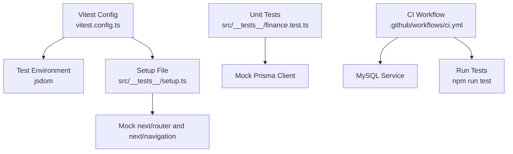
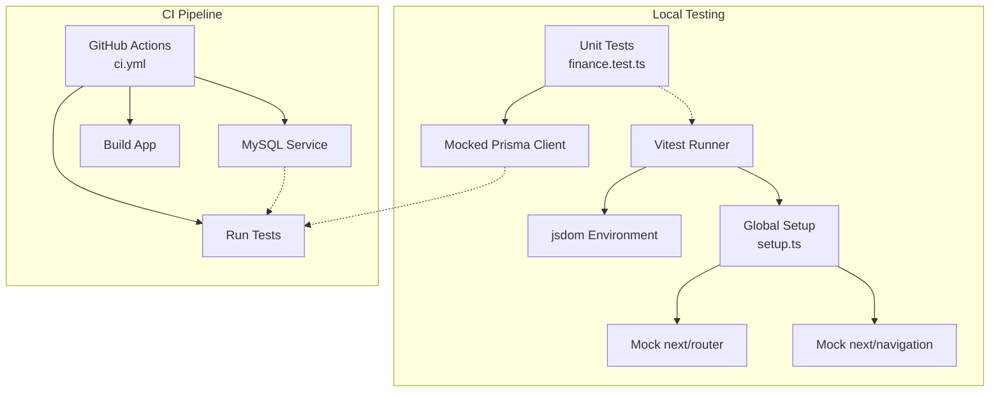
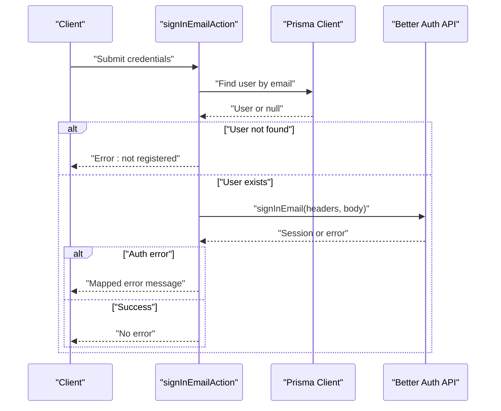
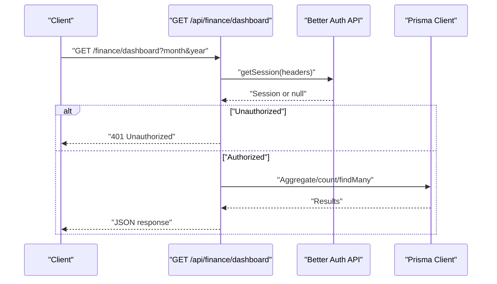
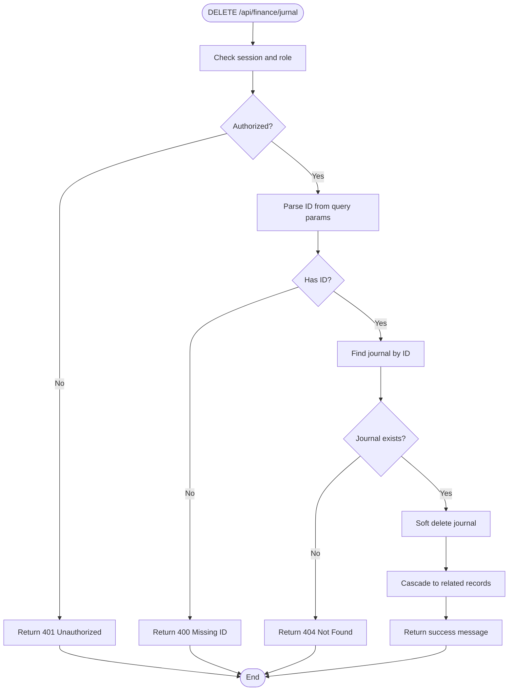
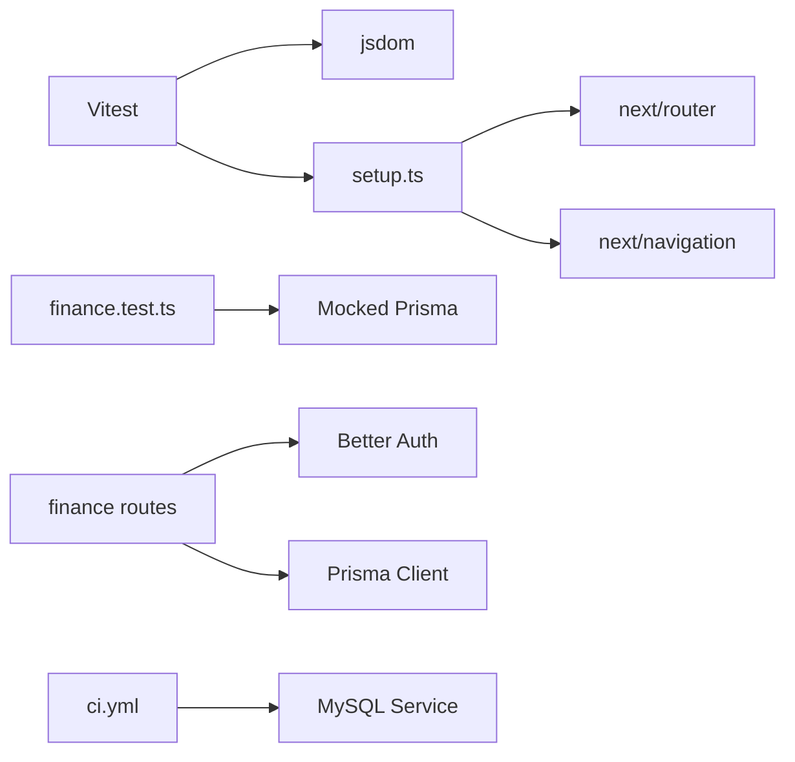

# Testing Strategy

<cite>
**Referenced Files in This Document**
- [vitest.config.ts](file://vitest.config.ts)
- [setup.ts](file://src/__tests__/setup.ts)
- [finance.test.ts](file://src/__tests__/finance.test.ts)
- [package.json](file://package.json)
- [ci.yml](file://.github/workflows/ci.yml)
- [auth.ts](file://src/lib/auth.ts)
- [route.ts](file://src/app/api/auth/[...all]/route.ts)
- [sign-in-email.action.ts](file://src/actions/sign-in-email.action.ts)
- [sign-up-email.action.ts](file://src/actions/sign-up-email.action.ts)
- [route.ts](file://src/app/api/finance/dashboard/route.ts)
- [route.ts](file://src/app/api/finance/jurnal/route.ts)
- [finance.ts](file://src/lib/finance.ts)
</cite>

## Table of Contents
1. [Introduction](#introduction)
2. [Project Structure](#project-structure)
3. [Core Components](#core-components)
4. [Architecture Overview](#architecture-overview)
5. [Detailed Component Analysis](#detailed-component-analysis)
6. [Dependency Analysis](#dependency-analysis)
7. [Performance Considerations](#performance-considerations)
8. [Troubleshooting Guide](#troubleshooting-guide)
9. [Conclusion](#conclusion)
10. [Appendices](#appendices)

## Introduction
This document defines the testing strategy and implementation approach for the Point of Sale (POS) system. It covers Vitest configuration, unit and integration testing patterns, test setup and mocking, financial calculation validations, API endpoint testing, authentication flow testing, database operation testing, and real-time features. It also includes guidance on test coverage, performance testing, debugging failures, and maintaining test quality across modules.

## Project Structure
The testing infrastructure is organized around Vitest with jsdom environment, a global setup file for mocks, and focused unit tests under a dedicated tests folder. Continuous integration is configured to run tests against a MySQL service container.

**Diagram sources**
- [vitest.config.ts:1-13](file://vitest.config.ts#L1-L13)
- [setup.ts:1-14](file://src/__tests__/setup.ts#L1-L14)
- [finance.test.ts:1-162](file://src/__tests__/finance.test.ts#L1-L162)
- [ci.yml:1-60](file://.github/workflows/ci.yml#L1-L60)

**Section sources**
- [vitest.config.ts:1-13](file://vitest.config.ts#L1-L13)
- [setup.ts:1-14](file://src/__tests__/setup.ts#L1-L14)
- [finance.test.ts:1-162](file://src/__tests__/finance.test.ts#L1-L162)
- [ci.yml:1-60](file://.github/workflows/ci.yml#L1-L60)

## Core Components
- Vitest configuration enables jsdom environment, global test APIs, and a setup file for mocks.
- Global setup mocks Next.js router and navigation hooks to avoid runtime errors during tests.
- Unit tests focus on financial calculations and logic extracted from API routes and shared utilities.
- CI workflow provisions a MySQL service, generates Prisma client, runs lint and tests, and builds the app.

Key capabilities:
- Test setup and mocking for Next.js routing and navigation.
- Financial computation validation (profit & loss, balance sheet, savings, receivables, cost grouping).
- API route testing patterns for authentication and finance endpoints.
- Database operation testing via mocked Prisma client.

**Section sources**
- [vitest.config.ts:1-13](file://vitest.config.ts#L1-L13)
- [setup.ts:1-14](file://src/__tests__/setup.ts#L1-L14)
- [finance.test.ts:1-162](file://src/__tests__/finance.test.ts#L1-L162)
- [ci.yml:1-60](file://.github/workflows/ci.yml#L1-L60)

## Architecture Overview
The testing architecture integrates Vitest with jsdom, a global setup for mocks, and targeted unit tests. CI orchestrates a MySQL service for database-dependent tests and validates code quality and build readiness.

**Diagram sources**
- [vitest.config.ts:1-13](file://vitest.config.ts#L1-L13)
- [setup.ts:1-14](file://src/__tests__/setup.ts#L1-L14)
- [finance.test.ts:1-162](file://src/__tests__/finance.test.ts#L1-L162)
- [ci.yml:1-60](file://.github/workflows/ci.yml#L1-L60)

## Detailed Component Analysis

### Vitest Configuration and Setup
- Environment: jsdom for DOM APIs and React testing.
- Globals: enables expect, describe, it, beforeEach, etc., without explicit imports.
- Setup file: registers jest-dom matchers and mocks Next.js router/navigation to prevent runtime errors.

Best practices:
- Keep setup minimal and centralized.
- Add additional mocks for modules used across tests to reduce boilerplate.

**Section sources**
- [vitest.config.ts:1-13](file://vitest.config.ts#L1-L13)
- [setup.ts:1-14](file://src/__tests__/setup.ts#L1-L14)

### Unit Testing Patterns and Mock Implementations
- Financial calculations are validated directly in unit tests, mirroring logic from API routes and shared utilities.
- Prisma client is mocked to isolate tests from database dependencies.
- Helpers and shared logic are tested independently to improve maintainability.

Recommended patterns:
- Group related calculations under descriptive test suites.
- Use deterministic inputs and clear assertions for edge cases (zero income, empty collections).
- Prefer pure functions for calculations to simplify testing.

**Section sources**
- [finance.test.ts:1-162](file://src/__tests__/finance.test.ts#L1-L162)

### Authentication Flow Testing
Authentication relies on Better Auth with Prisma adapter and Next.js integration. Two action functions encapsulate sign-in and sign-up flows with robust error handling.

**Diagram sources**
- [sign-in-email.action.ts:1-86](file://src/actions/sign-in-email.action.ts#L1-L86)
- [auth.ts:1-95](file://src/lib/auth.ts#L1-L95)

Additional considerations:
- Test invalid inputs (missing email/password), non-existent users, and various Better Auth error codes.
- Verify session creation and role-based access after successful login.
- Mock Better Auth API for isolated unit tests.

**Section sources**
- [sign-in-email.action.ts:1-86](file://src/actions/sign-in-email.action.ts#L1-L86)
- [auth.ts:1-95](file://src/lib/auth.ts#L1-L95)

### API Endpoint Testing Methodologies
Finance endpoints demonstrate typical patterns for GET, POST, and DELETE requests with session validation and Prisma queries.

**Diagram sources**
- [route.ts:12-259](file://src/app/api/finance/dashboard/route.ts#L12-L259)
- [auth.ts:1-95](file://src/lib/auth.ts#L1-L95)

Integration testing tips:
- Use a mock session to bypass real auth during tests.
- Stub Prisma client methods to simulate various scenarios (empty data, partial results, errors).
- Validate pagination, filtering, and aggregation logic by asserting computed fields.

**Section sources**
- [route.ts:12-259](file://src/app/api/finance/dashboard/route.ts#L12-L259)

### Database Operations Testing
The journal endpoint showcases transactional operations and cascading soft deletes. Tests should validate:
- Access control (roles allowed).
- Request validation (required fields, nominal checks).
- Transaction integrity (soft delete and cascade updates).
- Error handling paths (not found, bad request, internal server error).

**Diagram sources**
- [route.ts:127-169](file://src/app/api/finance/jurnal/route.ts#L127-L169)

**Section sources**
- [route.ts:127-169](file://src/app/api/finance/jurnal/route.ts#L127-L169)

### Real-Time Features Testing
Real-time features rely on Pusher. While the repository does not include dedicated WebSocket tests, CI sets environment variables for Pusher configuration. To test real-time behavior:
- Mock Pusher client initialization and event publishing.
- Simulate channel authentication and presence events.
- Verify UI updates triggered by emitted events in component tests.

Environment variables for CI:
- NEXT_PUBLIC_PUSHER_KEY
- NEXT_PUBLIC_PUSHER_HOST
- NEXT_PUBLIC_PUSHER_PORT
- NEXT_PUBLIC_PUSHER_SCHEME

**Section sources**
- [ci.yml:56-58](file://.github/workflows/ci.yml#L56-L58)

## Dependency Analysis
Testing depends on:
- Vitest and jsdom for runtime environment.
- Jest DOM matchers for DOM assertions.
- Mocked Prisma client for database isolation.
- Better Auth for authentication logic and session management.
- MySQL service in CI for database-dependent tests.

**Diagram sources**
- [vitest.config.ts:1-13](file://vitest.config.ts#L1-L13)
- [setup.ts:1-14](file://src/__tests__/setup.ts#L1-L14)
- [finance.test.ts:1-162](file://src/__tests__/finance.test.ts#L1-L162)
- [route.ts:12-259](file://src/app/api/finance/dashboard/route.ts#L12-L259)
- [auth.ts:1-95](file://src/lib/auth.ts#L1-L95)
- [ci.yml:1-60](file://.github/workflows/ci.yml#L1-L60)

**Section sources**
- [vitest.config.ts:1-13](file://vitest.config.ts#L1-L13)
- [setup.ts:1-14](file://src/__tests__/setup.ts#L1-L14)
- [finance.test.ts:1-162](file://src/__tests__/finance.test.ts#L1-L162)
- [route.ts:12-259](file://src/app/api/finance/dashboard/route.ts#L12-L259)
- [auth.ts:1-95](file://src/lib/auth.ts#L1-L95)
- [ci.yml:1-60](file://.github/workflows/ci.yml#L1-L60)

## Performance Considerations
- Prefer mocking heavy dependencies (Prisma, Better Auth) to keep tests fast.
- Use aggregated queries and batched operations in tests to simulate realistic loads.
- Avoid unnecessary network calls in unit tests; stub external services.
- Profile long-running tests and refactor slow suites into smaller, focused units.

## Troubleshooting Guide
Common issues and resolutions:
- Next.js router/navigation errors: resolved by global mocks in setup.
- Authentication failures: verify session middleware and role checks; mock auth API responses.
- Database errors: ensure Prisma client mocks return expected shapes; test both success and failure paths.
- CI flakiness: confirm MySQL service health and environment variable injection; validate Prisma client generation.

Debugging tips:
- Add console logs in setup and test files temporarily to inspect mock behavior.
- Use Vitest’s verbose mode to capture detailed stack traces.
- Isolate failing tests and reproduce locally with identical environment variables.

**Section sources**
- [setup.ts:1-14](file://src/__tests__/setup.ts#L1-L14)
- [finance.test.ts:1-162](file://src/__tests__/finance.test.ts#L1-L162)
- [ci.yml:1-60](file://.github/workflows/ci.yml#L1-L60)

## Conclusion
The testing strategy leverages Vitest with jsdom, centralized setup mocks, and focused unit tests for financial computations. Integration testing targets authentication and finance API endpoints, while CI ensures database compatibility and build correctness. By mocking external systems, validating edge cases, and maintaining clean separation of concerns, the suite delivers reliable feedback across modules.

## Appendices

### Practical Examples and Guidelines
- Writing effective tests:
  - Use descriptive test names and group related assertions.
  - Mock only what is necessary; avoid over-mocking.
  - Validate both positive and negative paths.
- Test organization:
  - Place unit tests alongside the code they test.
  - Separate integration tests for API endpoints and database operations.
- Continuous integration:
  - Keep CI jobs minimal and fast; run lint, tests, and build sequentially.
  - Provide clear environment variable defaults for local development and CI.

### Test Coverage and Quality
- Aim for high coverage in critical modules (authentication, finance calculations, API routes).
- Maintain a balance between unit and integration tests; prioritize correctness over coverage percentage.
- Regularly review and refactor tests to reflect evolving business logic.