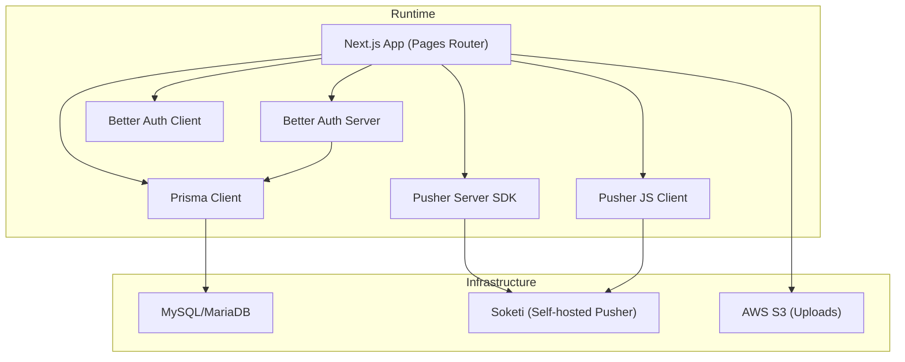
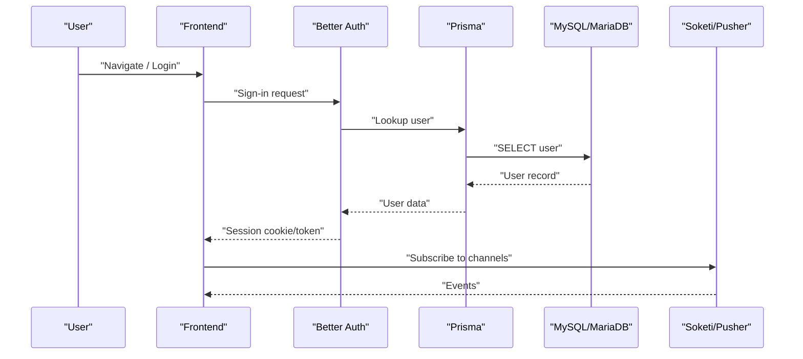
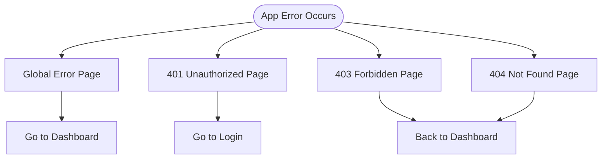
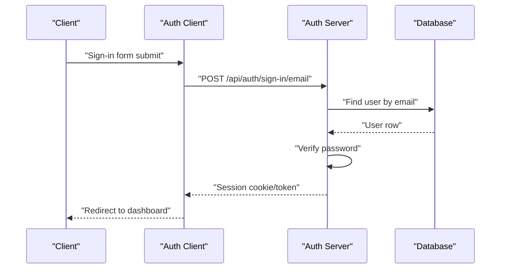
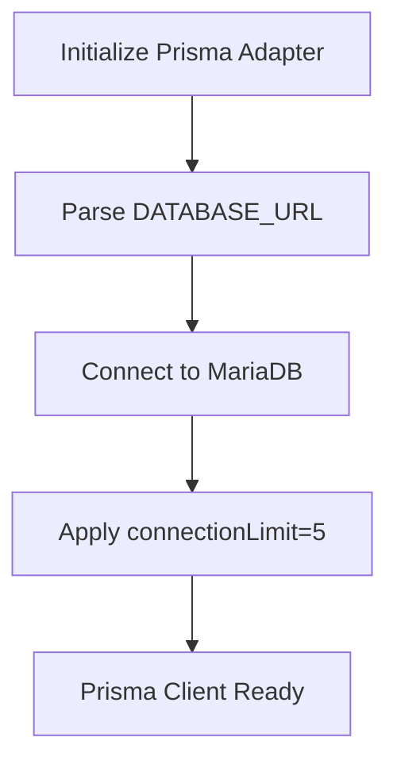
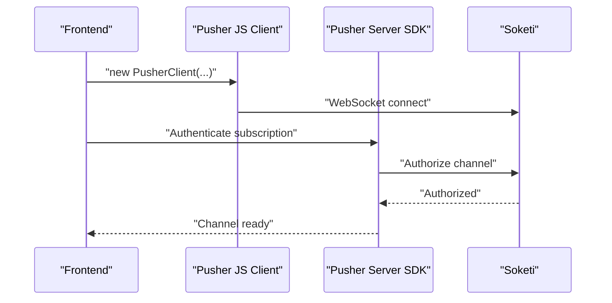
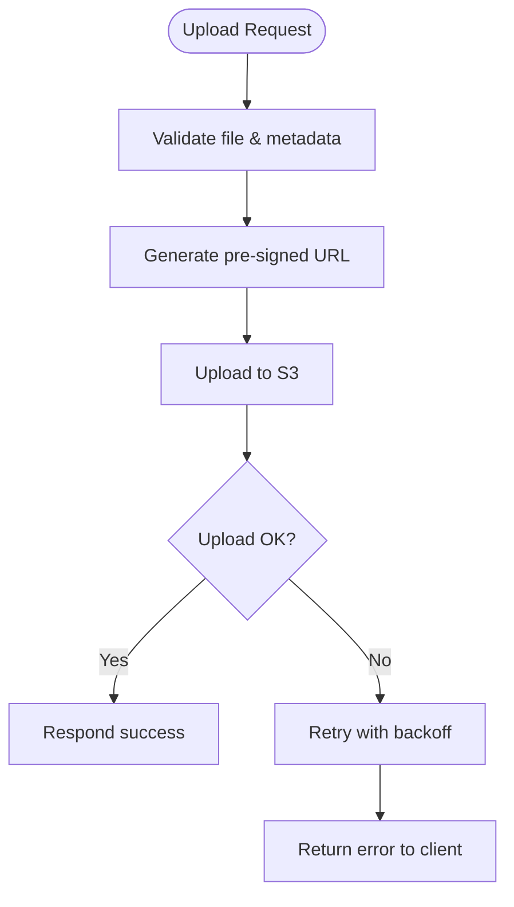
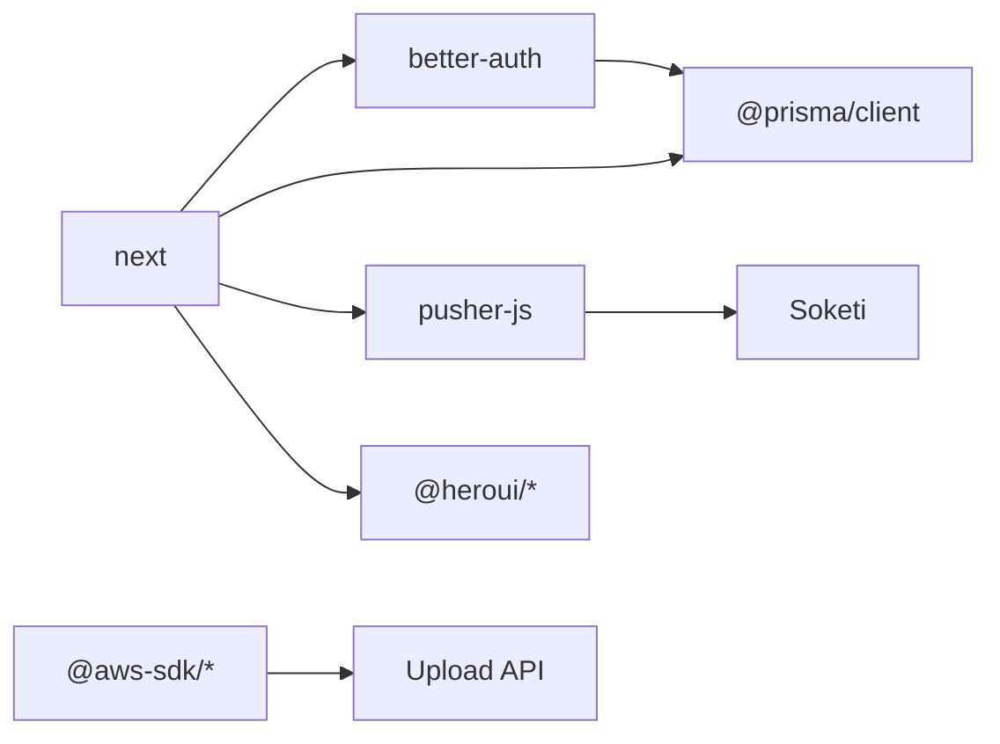

# Troubleshooting & FAQ

<cite>
**Referenced Files in This Document**
- [src/app/error.tsx](file://src/app/error.tsx)
- [src/app/unauthorized.tsx](file://src/app/unauthorized.tsx)
- [src/app/forbidden.tsx](file://src/app/forbidden.tsx)
- [src/app/not-found.tsx](file://src/app/not-found.tsx)
- [src/lib/prisma.ts](file://src/lib/prisma.ts)
- [src/lib/auth.ts](file://src/lib/auth.ts)
- [src/lib/auth-client.ts](file://src/lib/auth-client.ts)
- [src/lib/pusher.ts](file://src/lib/pusher.ts)
- [src/lib/pusher-client.ts](file://src/lib/pusher-client.ts)
- [src/app/api/pusher/auth/route.ts](file://src/app/api/pusher/auth/route.ts)
- [src/app/api/upload/route.ts](file://src/app/api/upload/route.ts)
- [src/app/api/notifications/route.ts](file://src/app/api/notifications/route.ts)
- [src/app/api/finance/jurnal/route.ts](file://src/app/api/finance/jurnal/route.ts)
- [src/app/api/order/[id]/route.ts](file://src/app/api/order/[id]/route.ts)
- [src/app/api/admin/user/route.ts](file://src/app/api/admin/user/route.ts)
- [src/app/api/check-account/route.ts](file://src/app/api/check-account/route.ts)
- [src/app/providers.tsx](file://src/app/providers.tsx)
- [src/lib/func.ts](file://src/lib/func.ts)
- [src/config/navigation.ts](file://src/config/navigation.ts)
- [src/config/roles.ts](file://src/config/roles.ts)
- [Dockerfile](file://Dockerfile)
- [docker-compose.yaml](file://docker-compose.yaml)
- [next.config.ts](file://next.config.ts)
- [package.json](file://package.json)
</cite>

## Table of Contents
1. [Introduction](#introduction)
2. [Project Structure](#project-structure)
3. [Core Components](#core-components)
4. [Architecture Overview](#architecture-overview)
5. [Detailed Component Analysis](#detailed-component-analysis)
6. [Dependency Analysis](#dependency-analysis)
7. [Performance Considerations](#performance-considerations)
8. [Troubleshooting Guide](#troubleshooting-guide)
9. [FAQ](#faq)
10. [Conclusion](#conclusion)

## Introduction
This document provides comprehensive troubleshooting guidance and FAQs for the Point of Sale web application. It covers error handling strategies, common setup issues, authentication and authorization problems, database connectivity, real-time features, file uploads, diagnostics, performance tuning, and security considerations. It also documents the error pages implementation, user-friendly messaging, and recommended maintenance practices.

## Project Structure
The application follows a Next.js Pages Router structure with a layered architecture:
- Frontend UI and pages under src/app
- Shared libraries under src/lib
- Configuration under src/config
- Database client and adapters under src/lib
- Real-time integration via Pusher/Soketi
- Containerization via Docker and docker-compose

**Diagram sources**
- [src/lib/prisma.ts:1-25](file://src/lib/prisma.ts#L1-L25)
- [src/lib/pusher.ts:1-11](file://src/lib/pusher.ts#L1-L11)
- [src/lib/pusher-client.ts:1-21](file://src/lib/pusher-client.ts#L1-L21)
- [src/lib/auth.ts:1-95](file://src/lib/auth.ts#L1-L95)
- [src/lib/auth-client.ts:1-27](file://src/lib/auth-client.ts#L1-L27)
- [docker-compose.yaml:1-47](file://docker-compose.yaml#L1-L47)

**Section sources**
- [src/lib/prisma.ts:1-25](file://src/lib/prisma.ts#L1-L25)
- [src/lib/pusher.ts:1-11](file://src/lib/pusher.ts#L1-L11)
- [src/lib/pusher-client.ts:1-21](file://src/lib/pusher-client.ts#L1-L21)
- [src/lib/auth.ts:1-95](file://src/lib/auth.ts#L1-L95)
- [src/lib/auth-client.ts:1-27](file://src/lib/auth-client.ts#L1-L27)
- [docker-compose.yaml:1-47](file://docker-compose.yaml#L1-L47)

## Core Components
- Authentication and Authorization: Better Auth server and client with role-based access control.
- Database Access: Prisma Client configured with MariaDB adapter and connection limits.
- Real-time Features: Pusher-compatible Soketi server with client-side JS library.
- Error Handling: Global error page and dedicated 401/403/404 pages.
- Uploads: AWS S3 integration via SDK and presigner.
- Navigation and Roles: Centralized navigation and role definitions.

**Section sources**
- [src/lib/auth.ts:1-95](file://src/lib/auth.ts#L1-L95)
- [src/lib/auth-client.ts:1-27](file://src/lib/auth-client.ts#L1-L27)
- [src/lib/prisma.ts:1-25](file://src/lib/prisma.ts#L1-L25)
- [src/lib/pusher.ts:1-11](file://src/lib/pusher.ts#L1-L11)
- [src/lib/pusher-client.ts:1-21](file://src/lib/pusher-client.ts#L1-L21)
- [src/app/error.tsx:1-54](file://src/app/error.tsx#L1-L54)
- [src/app/unauthorized.tsx:1-32](file://src/app/unauthorized.tsx#L1-L32)
- [src/app/forbidden.tsx:1-35](file://src/app/forbidden.tsx#L1-L35)
- [src/app/not-found.tsx:1-34](file://src/app/not-found.tsx#L1-L34)
- [src/config/navigation.ts:1-217](file://src/config/navigation.ts#L1-L217)
- [src/config/roles.ts:1-18](file://src/config/roles.ts#L1-L18)

## Architecture Overview
The system integrates several external services and internal modules. The frontend communicates with:
- Better Auth for session and RBAC
- Prisma for database queries
- Pusher-compatible Soketi for real-time events
- AWS S3 for file uploads

**Diagram sources**
- [src/lib/auth.ts:1-95](file://src/lib/auth.ts#L1-L95)
- [src/lib/prisma.ts:1-25](file://src/lib/prisma.ts#L1-L25)
- [src/lib/pusher.ts:1-11](file://src/lib/pusher.ts#L1-L11)
- [docker-compose.yaml:30-44](file://docker-compose.yaml#L30-L44)

## Detailed Component Analysis

### Error Pages Implementation
The application defines user-friendly error pages for global errors, unauthorized access, forbidden access, and not-found scenarios. These pages provide clear messaging and navigation back to safe locations.

**Diagram sources**
- [src/app/error.tsx:1-54](file://src/app/error.tsx#L1-L54)
- [src/app/unauthorized.tsx:1-32](file://src/app/unauthorized.tsx#L1-L32)
- [src/app/forbidden.tsx:1-35](file://src/app/forbidden.tsx#L1-L35)
- [src/app/not-found.tsx:1-34](file://src/app/not-found.tsx#L1-L34)

**Section sources**
- [src/app/error.tsx:1-54](file://src/app/error.tsx#L1-L54)
- [src/app/unauthorized.tsx:1-32](file://src/app/unauthorized.tsx#L1-L32)
- [src/app/forbidden.tsx:1-35](file://src/app/forbidden.tsx#L1-L35)
- [src/app/not-found.tsx:1-34](file://src/app/not-found.tsx#L1-L34)

### Authentication and Authorization
Better Auth handles email/password login, session lifecycle, and role-based permissions. It integrates with Prisma and exposes admin capabilities.

**Diagram sources**
- [src/lib/auth.ts:1-95](file://src/lib/auth.ts#L1-L95)
- [src/lib/auth-client.ts:1-27](file://src/lib/auth-client.ts#L1-L27)
- [src/app/api/check-account/route.ts](file://src/app/api/check-account/route.ts)

**Section sources**
- [src/lib/auth.ts:1-95](file://src/lib/auth.ts#L1-L95)
- [src/lib/auth-client.ts:1-27](file://src/lib/auth-client.ts#L1-L27)
- [src/config/roles.ts:1-18](file://src/config/roles.ts#L1-L18)
- [src/config/navigation.ts:1-217](file://src/config/navigation.ts#L1-L217)

### Database Connectivity
Prisma is configured with a MariaDB adapter and a fixed connection limit. Environment variables define the database URL.

**Diagram sources**
- [src/lib/prisma.ts:1-25](file://src/lib/prisma.ts#L1-L25)

**Section sources**
- [src/lib/prisma.ts:1-25](file://src/lib/prisma.ts#L1-L25)

### Real-time Feature Connectivity
Real-time updates rely on Pusher-compatible Soketi. The server SDK and client SDK are configured via environment variables.

**Diagram sources**
- [src/lib/pusher.ts:1-11](file://src/lib/pusher.ts#L1-L11)
- [src/lib/pusher-client.ts:1-21](file://src/lib/pusher-client.ts#L1-L21)
- [src/app/api/pusher/auth/route.ts](file://src/app/api/pusher/auth/route.ts)

**Section sources**
- [src/lib/pusher.ts:1-11](file://src/lib/pusher.ts#L1-L11)
- [src/lib/pusher-client.ts:1-21](file://src/lib/pusher-client.ts#L1-L21)
- [docker-compose.yaml:30-44](file://docker-compose.yaml#L30-L44)

### File Upload Failures
Uploads integrate with AWS S3. Typical failure modes include missing credentials, invalid bucket policies, or network timeouts.

**Diagram sources**
- [src/app/api/upload/route.ts](file://src/app/api/upload/route.ts)

**Section sources**
- [src/app/api/upload/route.ts](file://src/app/api/upload/route.ts)
- [package.json:14-68](file://package.json#L14-L68)

## Dependency Analysis
The application relies on several external dependencies for authentication, database, real-time, and UI.

**Diagram sources**
- [package.json:14-68](file://package.json#L14-L68)
- [src/lib/auth.ts:1-95](file://src/lib/auth.ts#L1-L95)
- [src/lib/pusher-client.ts:1-21](file://src/lib/pusher-client.ts#L1-L21)

**Section sources**
- [package.json:14-68](file://package.json#L14-L68)

## Performance Considerations
- Database connection limits: The Prisma adapter sets a conservative connection limit suitable for development. Adjust based on load testing.
- Real-time scaling: Soketi supports configurable max connections; tune for concurrent clients.
- Build output: Standalone output reduces deployment overhead.
- Telemetry: Disable Next.js telemetry if required for compliance.

**Section sources**
- [src/lib/prisma.ts:17-17](file://src/lib/prisma.ts#L17-L17)
- [docker-compose.yaml:42-42](file://docker-compose.yaml#L42-L42)
- [next.config.ts:1-11](file://next.config.ts#L1-L11)
- [Dockerfile:25-43](file://Dockerfile#L25-L43)

## Troubleshooting Guide

### General Diagnostic Workflow
- Reproduce the issue and capture the error page or console logs.
- Verify environment variables for database, Pusher, and S3.
- Check container health for MySQL, phpMyAdmin, and Soketi.
- Review recent migrations and seed scripts.

### Authentication Issues
Symptoms:
- Login fails immediately or redirects incorrectly.
- Users report “invalid domain” during sign-up.
- Session cookies not persisting.

Resolution steps:
- Confirm Better Auth configuration and database adapter.
- Validate email domain whitelist and normalization logic.
- Ensure secure cookie settings and SameSite attributes.
- Clear browser cookies and cache, then retry.

**Section sources**
- [src/lib/auth.ts:20-48](file://src/lib/auth.ts#L20-L48)
- [src/lib/func.ts:11-19](file://src/lib/func.ts#L11-L19)
- [src/lib/auth-client.ts:12-26](file://src/lib/auth-client.ts#L12-L26)

### Database Connection Problems
Symptoms:
- Application fails to start with Prisma errors.
- Queries timeout or fail intermittently.

Resolution steps:
- Verify DATABASE_URL format and credentials.
- Confirm MySQL/MariaDB is reachable on the expected host/port.
- Check connectionLimit and adjust if necessary.
- Run migrations and seed scripts after environment setup.

**Section sources**
- [src/lib/prisma.ts:9-18](file://src/lib/prisma.ts#L9-L18)

### Real-time Feature Connectivity
Symptoms:
- Channels do not receive events.
- Authentication endpoint returns errors.

Resolution steps:
- Confirm Pusher app credentials and scheme/host/port.
- Verify /api/pusher/auth endpoint responds with proper signatures.
- Ensure Soketi is running and max connections are sufficient.
- Test WebSocket connectivity via browser devtools Network tab.

**Section sources**
- [src/lib/pusher.ts:3-10](file://src/lib/pusher.ts#L3-L10)
- [src/lib/pusher-client.ts:6-20](file://src/lib/pusher-client.ts#L6-L20)
- [src/app/api/pusher/auth/route.ts](file://src/app/api/pusher/auth/route.ts)
- [docker-compose.yaml:30-44](file://docker-compose.yaml#L30-L44)

### File Upload Failures
Symptoms:
- Upload requests hang or return errors.
- Pre-signed URL generation fails.

Resolution steps:
- Validate AWS credentials and region.
- Confirm bucket policy allows uploads from the origin.
- Check CORS configuration for the bucket.
- Inspect upload API response and S3 event logs.

**Section sources**
- [src/app/api/upload/route.ts](file://src/app/api/upload/route.ts)
- [package.json:14-17](file://package.json#L14-L17)

### Error Pages and User Messaging
Symptoms:
- Generic “Internal Error” appears unexpectedly.
- 401/403/404 pages do not render properly.

Resolution steps:
- Ensure global error boundary is mounted in the app shell.
- Verify providers wrap the app for toast and theme.
- Confirm pages are placed under src/app and Next.js recognizes them.

**Section sources**
- [src/app/error.tsx:1-54](file://src/app/error.tsx#L1-L54)
- [src/app/unauthorized.tsx:1-32](file://src/app/unauthorized.tsx#L1-L32)
- [src/app/forbidden.tsx:1-35](file://src/app/forbidden.tsx#L1-L35)
- [src/app/not-found.tsx:1-34](file://src/app/not-found.tsx#L1-L34)
- [src/app/providers.tsx:1-14](file://src/app/providers.tsx#L1-L14)

### Notifications and Background Jobs
Symptoms:
- Notifications not appearing in real-time.
- Notification counts stale.

Resolution steps:
- Confirm notification API routes are reachable.
- Verify Pusher authentication endpoint is configured.
- Check Soketi metrics and logs for connection drops.

**Section sources**
- [src/app/api/notifications/route.ts](file://src/app/api/notifications/route.ts)
- [src/lib/pusher.ts:1-11](file://src/lib/pusher.ts#L1-L11)

### API-Specific Checks
- Finance journals: Validate request payload and permissions.
- Orders: Ensure ID routing and SPK/comment endpoints are accessible.
- Admin user management: Confirm admin role and RBAC.

**Section sources**
- [src/app/api/finance/jurnal/route.ts](file://src/app/api/finance/jurnal/route.ts)
- [src/app/api/order/[id]/route.ts](file://src/app/api/order/[id]/route.ts)
- [src/app/api/admin/user/route.ts](file://src/app/api/admin/user/route.ts)

### Container and Deployment
Symptoms:
- Containers fail to start or crashloop.
- Port conflicts or networking issues.

Resolution steps:
- Review Dockerfile build stages and environment variables.
- Check docker-compose service dependencies and exposed ports.
- Inspect logs for MySQL initialization and Soketi startup.

**Section sources**
- [Dockerfile:1-64](file://Dockerfile#L1-L64)
- [docker-compose.yaml:1-47](file://docker-compose.yaml#L1-L47)

### Logging and Log Analysis
Recommended techniques:
- Enable structured logging in production.
- Capture Prisma query logs and slow queries.
- Monitor Soketi metrics endpoint for connection stats.
- Aggregate frontend console errors via Sentry or similar.

[No sources needed since this section provides general guidance]

### Security Considerations and Vulnerability Management
- Keep dependencies updated regularly.
- Enforce HTTPS/TLS for Pusher and S3.
- Restrict database credentials and rotate secrets.
- Audit RBAC roles and permissions periodically.

**Section sources**
- [src/lib/pusher.ts:9-9](file://src/lib/pusher.ts#L9-L9)
- [package.json:14-68](file://package.json#L14-L68)

## FAQ

Q1: What are the system requirements?
- Node.js version aligned with the Dockerfile base image.
- Docker and docker-compose for local orchestration.
- MySQL/MariaDB for persistence; Soketi for real-time.

Q2: Which browsers are supported?
- Modern browsers with ES2020+ support.
- WebSocket and Fetch API required for real-time and API calls.

Q3: Is mobile support available?
- Responsive UI components are used; test on tablets and phones.

Q4: How do I configure authentication domains?
- Configure allowed domains in the validation logic and environment.

Q5: How do I scale real-time features?
- Increase Soketi max connections and monitor metrics.

Q6: How do I manage uploads securely?
- Use pre-signed URLs and enforce bucket policies.

Q7: How do I troubleshoot permission issues?
- Verify roles and navigation definitions match backend checks.

Q8: How do I handle database migrations?
- Apply migrations via the build script and seed data as needed.

Q9: How do I optimize performance?
- Tune Prisma connection limits, enable caching, and monitor slow queries.

Q10: How do I maintain the system?
- Regularly update dependencies, review logs, and audit security configurations.

**Section sources**
- [src/lib/func.ts:11-19](file://src/lib/func.ts#L11-L19)
- [src/config/navigation.ts:1-217](file://src/config/navigation.ts#L1-L217)
- [src/config/roles.ts:1-18](file://src/config/roles.ts#L1-L18)
- [Dockerfile:1-64](file://Dockerfile#L1-L64)
- [docker-compose.yaml:1-47](file://docker-compose.yaml#L1-L47)
- [package.json:14-68](file://package.json#L14-L68)

## Conclusion
This guide consolidates actionable troubleshooting steps, diagnostic workflows, and best practices for maintaining the application. By validating environment configuration, monitoring infrastructure, and following security and performance recommendations, most issues can be resolved quickly and efficiently.