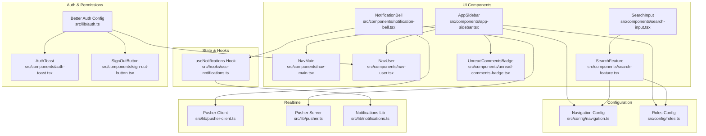
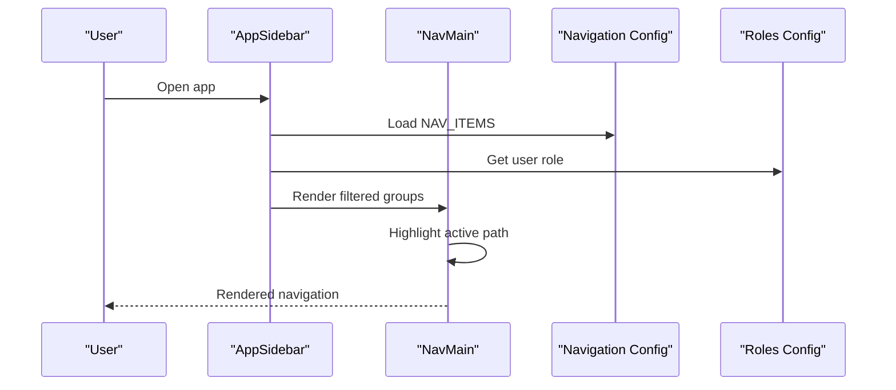
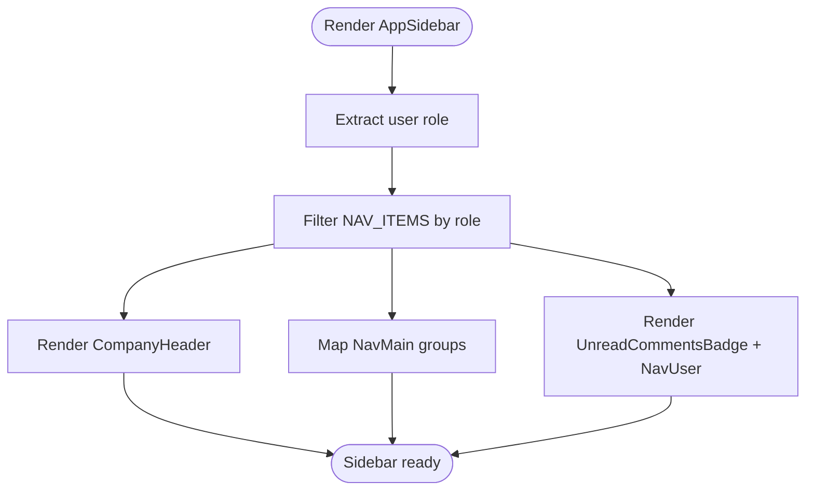
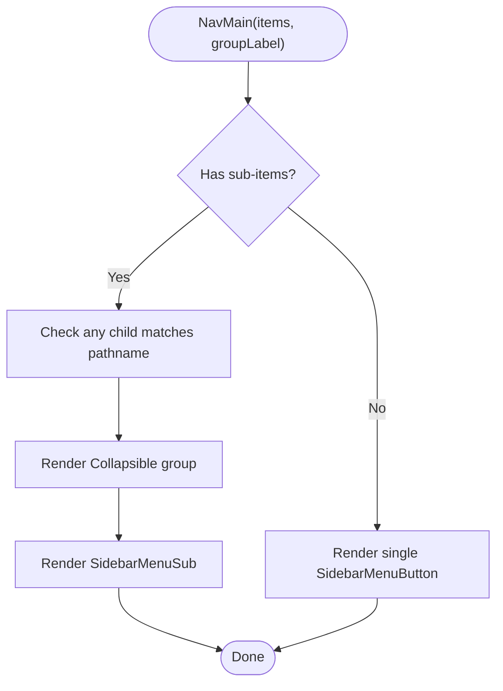
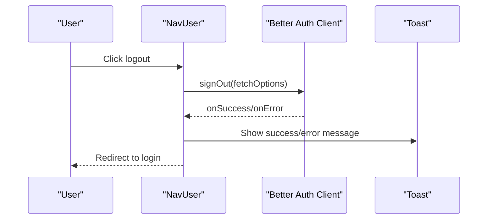
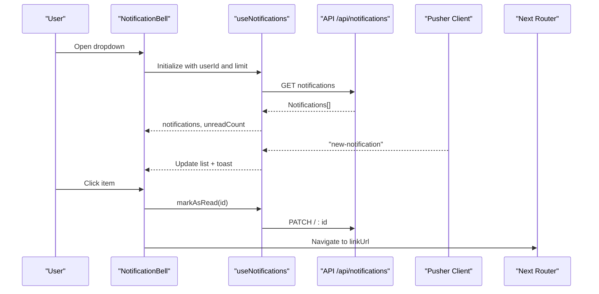
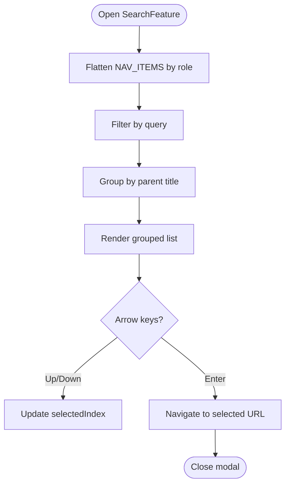
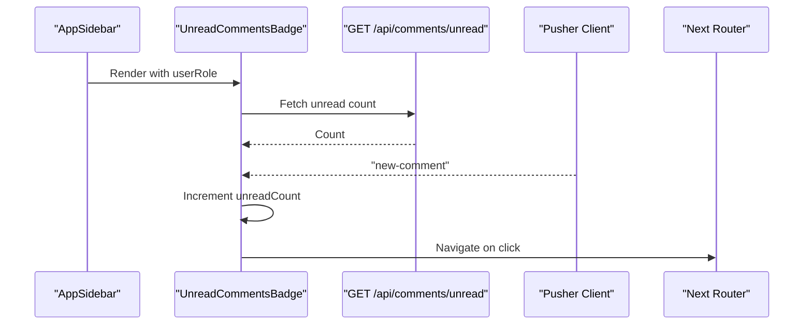
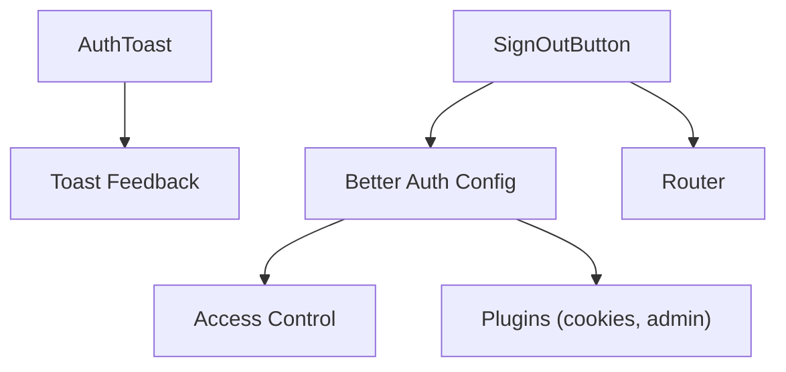
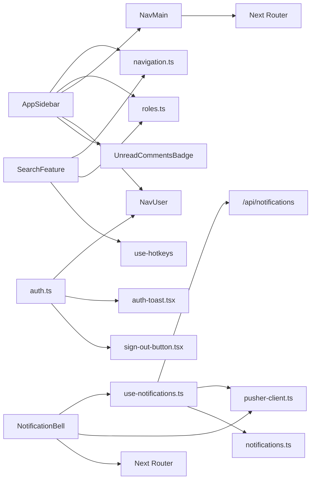

# Custom Business Components

<cite>
**Referenced Files in This Document**
- [app-sidebar.tsx](file://src/components/app-sidebar.tsx)
- [nav-main.tsx](file://src/components/nav-main.tsx)
- [nav-user.tsx](file://src/components/nav-user.tsx)
- [notification-bell.tsx](file://src/components/notification-bell.tsx)
- [search-feature.tsx](file://src/components/search-feature.tsx)
- [search-input.tsx](file://src/components/search-input.tsx)
- [unread-comments-badge.tsx](file://src/components/unread-comments-badge.tsx)
- [use-notifications.ts](file://src/hooks/use-notifications.ts)
- [navigation.ts](file://src/config/navigation.ts)
- [roles.ts](file://src/config/roles.ts)
- [auth.ts](file://src/lib/auth.ts)
- [auth-toast.tsx](file://src/components/auth-toast.tsx)
- [sign-out-button.tsx](file://src/components/sign-out-button.tsx)
- [pusher-client.ts](file://src/lib/pusher-client.ts)
- [pusher.ts](file://src/lib/pusher.ts)
- [notifications.ts](file://src/lib/notifications.ts)
- [layout.tsx](file://src/app/layout.tsx)
</cite>

## Table of Contents
1. [Introduction](#introduction)
2. [Project Structure](#project-structure)
3. [Core Components](#core-components)
4. [Architecture Overview](#architecture-overview)
5. [Detailed Component Analysis](#detailed-component-analysis)
6. [Dependency Analysis](#dependency-analysis)
7. [Performance Considerations](#performance-considerations)
8. [Troubleshooting Guide](#troubleshooting-guide)
9. [Conclusion](#conclusion)

## Introduction
This document explains the custom business-specific components that power navigation, search, notifications, and authentication in the application. It covers component architecture, integration with application state, role-based filtering, real-time updates, and responsive design patterns. It also highlights reusability, customization examples, and integration points with the broader application flow.

## Project Structure
The business components are organized under src/components and src/hooks, with configuration under src/config and business logic under src/lib. Navigation and role definitions centralize access control and UI visibility. Real-time capabilities leverage Pusher for live updates.

**Diagram sources**
- [app-sidebar.tsx:1-91](file://src/components/app-sidebar.tsx#L1-L91)
- [nav-main.tsx:1-116](file://src/components/nav-main.tsx#L1-L116)
- [nav-user.tsx:1-225](file://src/components/nav-user.tsx#L1-L225)
- [notification-bell.tsx:1-219](file://src/components/notification-bell.tsx#L1-L219)
- [search-feature.tsx:1-262](file://src/components/search-feature.tsx#L1-L262)
- [search-input.tsx:1-33](file://src/components/search-input.tsx#L1-L33)
- [unread-comments-badge.tsx:1-84](file://src/components/unread-comments-badge.tsx#L1-L84)
- [use-notifications.ts:1-112](file://src/hooks/use-notifications.ts#L1-L112)
- [navigation.ts:1-217](file://src/config/navigation.ts#L1-L217)
- [roles.ts:1-18](file://src/config/roles.ts#L1-L18)
- [auth.ts:1-95](file://src/lib/auth.ts#L1-L95)
- [auth-toast.tsx:1-48](file://src/components/auth-toast.tsx#L1-L48)
- [sign-out-button.tsx:1-47](file://src/components/sign-out-button.tsx#L1-L47)
- [pusher-client.ts:1-21](file://src/lib/pusher-client.ts#L1-L21)
- [pusher.ts:1-11](file://src/lib/pusher.ts#L1-L11)
- [notifications.ts:1-122](file://src/lib/notifications.ts#L1-L122)

**Section sources**
- [layout.tsx:1-63](file://src/app/layout.tsx#L1-L63)

## Core Components
- AppSidebar: Renders the main sidebar with role-filtered navigation, company branding, user menu, and unread comment badge.
- NavMain: Renders collapsible navigation groups and items, highlighting active paths.
- NavUser: Provides user menu with avatar, role label, and logout/profile actions.
- NotificationBell: Dropdown notification center with unread indicators, real-time updates, and actions to mark/read/delete.
- SearchFeature: Global keyboard-driven search overlay over navigation items with grouping and selection.
- SearchInput: Reusable bordered input with clear and search icon.
- UnreadCommentsBadge: Sidebar badge for design queue comments with real-time updates.
- useNotifications: Hook managing notifications lifecycle, real-time subscriptions, and optimistic updates.
- Real-time: Pusher client/server and notification helpers for broadcasting and subscribing to events.

**Section sources**
- [app-sidebar.tsx:53-91](file://src/components/app-sidebar.tsx#L53-L91)
- [nav-main.tsx:22-116](file://src/components/nav-main.tsx#L22-L116)
- [nav-user.tsx:36-225](file://src/components/nav-user.tsx#L36-L225)
- [notification-bell.tsx:34-219](file://src/components/notification-bell.tsx#L34-L219)
- [search-feature.tsx:31-262](file://src/components/search-feature.tsx#L31-L262)
- [search-input.tsx:12-33](file://src/components/search-input.tsx#L12-L33)
- [unread-comments-badge.tsx:18-84](file://src/components/unread-comments-badge.tsx#L18-L84)
- [use-notifications.ts:17-112](file://src/hooks/use-notifications.ts#L17-L112)

## Architecture Overview
The sidebar integrates navigation configuration and role filtering to present a tailored menu. The notification system combines server-side fetching with client-side Pusher subscriptions for real-time updates. Search leverages a flattened navigation dataset and hotkeys for quick access. Authentication integrates with Better Auth and exposes reusable UI elements for login prompts and logout actions.

**Diagram sources**
- [app-sidebar.tsx:24-51](file://src/components/app-sidebar.tsx#L24-L51)
- [nav-main.tsx:37-111](file://src/components/nav-main.tsx#L37-L111)
- [navigation.ts:35-217](file://src/config/navigation.ts#L35-L217)
- [roles.ts:5-11](file://src/config/roles.ts#L5-L11)

## Detailed Component Analysis

### AppSidebar
- Responsibilities:
  - Filters NAV_ITEMS by user role.
  - Renders CompanyHeader, NavMain groups, UnreadCommentsBadge, and NavUser.
  - Uses memoization to avoid recomputation on role changes.
- Integration:
  - Consumes settings for company branding.
  - Delegates active state highlighting to NavMain.
  - Exposes unread badge and user menu footer areas.

**Diagram sources**
- [app-sidebar.tsx:53-91](file://src/components/app-sidebar.tsx#L53-L91)
- [navigation.ts:35-217](file://src/config/navigation.ts#L35-L217)

**Section sources**
- [app-sidebar.tsx:19-91](file://src/components/app-sidebar.tsx#L19-L91)

### NavMain
- Responsibilities:
  - Renders top-level items with optional submenus.
  - Collapsible groups with ChevronRight rotation and active child detection.
  - Active state determined by pathname matching.
- UX:
  - Hover styles and tooltips for discoverability.
  - Keyboard-friendly navigation via hotkeys in parent components.

**Diagram sources**
- [nav-main.tsx:22-116](file://src/components/nav-main.tsx#L22-L116)

**Section sources**
- [nav-main.tsx:22-116](file://src/components/nav-main.tsx#L22-L116)

### NavUser
- Responsibilities:
  - Displays user avatar, initials, and role label.
  - Provides logout and profile actions.
  - Adapts dropdown position for mobile vs desktop.
- Integration:
  - Uses Better Auth client for sign-out.
  - Emits toast feedback on success/error.

**Diagram sources**
- [nav-user.tsx:41-67](file://src/components/nav-user.tsx#L41-L67)
- [auth.ts:20-95](file://src/lib/auth.ts#L20-L95)

**Section sources**
- [nav-user.tsx:36-225](file://src/components/nav-user.tsx#L36-L225)

### NotificationBell
- Responsibilities:
  - Fetches paginated notifications.
  - Subscribes to real-time events via Pusher.
  - Provides actions: mark as read, mark all as read, delete all.
  - Displays relative timestamps and categorized icons.
- UX:
  - Badge shows unread count.
  - Scrollable list with keyboard-friendly selection.
  - Opens detailed notifications page.

**Diagram sources**
- [notification-bell.tsx:34-219](file://src/components/notification-bell.tsx#L34-L219)
- [use-notifications.ts:17-112](file://src/hooks/use-notifications.ts#L17-L112)
- [pusher-client.ts:6-21](file://src/lib/pusher-client.ts#L6-L21)

**Section sources**
- [notification-bell.tsx:34-219](file://src/components/notification-bell.tsx#L34-L219)
- [use-notifications.ts:17-112](file://src/hooks/use-notifications.ts#L17-L112)

### SearchFeature
- Responsibilities:
  - Flattens NAV_ITEMS and filters by user role.
  - Groups results by parent group and supports keyboard navigation.
  - Integrates with hotkeys (Ctrl+K) to open the modal.
- UX:
  - Clear visual grouping with icons.
  - Selected item highlighted with Enter to navigate.

**Diagram sources**
- [search-feature.tsx:31-262](file://src/components/search-feature.tsx#L31-L262)
- [navigation.ts:35-217](file://src/config/navigation.ts#L35-L217)

**Section sources**
- [search-feature.tsx:31-262](file://src/components/search-feature.tsx#L31-L262)

### SearchInput
- Responsibilities:
  - Reusable bordered input with search icon and clear handler.
  - Controlled props for value, placeholder, onChange, onClear, and className.

**Section sources**
- [search-input.tsx:12-33](file://src/components/search-input.tsx#L12-L33)

### UnreadCommentsBadge
- Responsibilities:
  - Shows unread comment count in the sidebar for allowed roles.
  - Subscribes to global comments channel for real-time updates.
  - Navigates to design queue on click.

**Diagram sources**
- [unread-comments-badge.tsx:18-84](file://src/components/unread-comments-badge.tsx#L18-L84)
- [pusher-client.ts:6-21](file://src/lib/pusher-client.ts#L6-L21)

**Section sources**
- [unread-comments-badge.tsx:18-84](file://src/components/unread-comments-badge.tsx#L18-L84)

### Authentication Components
- Better Auth configuration defines roles, permissions, hashing, and session handling.
- AuthToast displays contextual toasts for unauthorized and auth errors.
- SignOutButton encapsulates logout flow with optimistic UI and navigation.

**Diagram sources**
- [auth.ts:20-95](file://src/lib/auth.ts#L20-L95)
- [auth-toast.tsx:7-48](file://src/components/auth-toast.tsx#L7-L48)
- [sign-out-button.tsx:9-47](file://src/components/sign-out-button.tsx#L9-L47)

**Section sources**
- [auth.ts:1-95](file://src/lib/auth.ts#L1-L95)
- [auth-toast.tsx:1-48](file://src/components/auth-toast.tsx#L1-L48)
- [sign-out-button.tsx:1-47](file://src/components/sign-out-button.tsx#L1-L47)

## Dependency Analysis
- AppSidebar depends on:
  - Navigation config for items.
  - Roles config for filtering.
  - Settings for branding.
  - NavMain for rendering.
  - NavUser and UnreadCommentsBadge for footer.
- NavMain depends on:
  - Next.js router for pathname.
  - UI sidebar components for structure.
- NotificationBell depends on:
  - useNotifications hook.
  - Pusher client for real-time.
  - Router for navigation.
- SearchFeature depends on:
  - Navigation config and roles.
  - Hotkeys and modal UI.
- useNotifications depends on:
  - API endpoints for CRUD.
  - Pusher client for subscriptions.
  - Notifications library for helpers.

**Diagram sources**
- [app-sidebar.tsx:13-17](file://src/components/app-sidebar.tsx#L13-L17)
- [nav-main.tsx:20](file://src/components/nav-main.tsx#L20)
- [notification-bell.tsx:25](file://src/components/notification-bell.tsx#L25)
- [use-notifications.ts:4-5](file://src/hooks/use-notifications.ts#L4-L5)
- [search-feature.tsx:8-10](file://src/components/search-feature.tsx#L8-L10)
- [auth.ts:1-11](file://src/lib/auth.ts#L1-L11)

**Section sources**
- [navigation.ts:1-217](file://src/config/navigation.ts#L1-L217)
- [roles.ts:1-18](file://src/config/roles.ts#L1-L18)
- [use-notifications.ts:17-112](file://src/hooks/use-notifications.ts#L17-L112)

## Performance Considerations
- Memoization:
  - AppSidebar uses useMemo to compute filtered navigation once per role change.
  - SearchFeature uses useMemo for flattened items, filtered items, and grouped items to avoid unnecessary renders.
- Lazy initialization:
  - Pusher client is initialized as a singleton to prevent multiple connections.
- Optimistic UI:
  - useNotifications optimistically updates state before confirming with API to reduce perceived latency.
- Responsive behavior:
  - NavUser adapts dropdown placement for mobile.
  - Search modal hides close button on small screens while keeping keyboard navigation.

[No sources needed since this section provides general guidance]

## Troubleshooting Guide
- Notifications not updating:
  - Verify Pusher credentials and auth endpoint configuration.
  - Ensure private channel subscription and event binding occur after mount.
- Auth errors or unauthorized redirects:
  - Check Better Auth plugin configuration and cookies handling.
  - Confirm AuthToast clears query params after displaying messages.
- Search yields no results:
  - Confirm NAV_ITEMS includes target URLs and roles allow current user.
  - Ensure Ctrl+K hotkey is registered and modal opens.

**Section sources**
- [pusher-client.ts:6-21](file://src/lib/pusher-client.ts#L6-L21)
- [auth.ts:78-92](file://src/lib/auth.ts#L78-L92)
- [auth-toast.tsx:12-44](file://src/components/auth-toast.tsx#L12-L44)
- [search-feature.tsx:154-156](file://src/components/search-feature.tsx#L154-L156)

## Conclusion
These custom components form a cohesive business layer integrating role-aware navigation, real-time notifications, global search, and robust authentication. They emphasize reusability, responsive design, and seamless state synchronization through hooks and Pusher. The modular structure allows easy customization and extension across departments such as sales, production, warehouse, and finance.