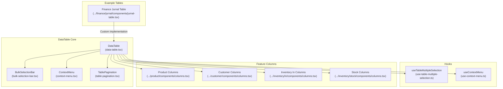
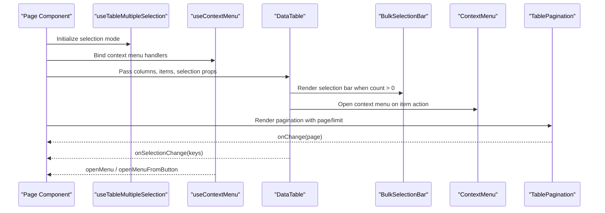
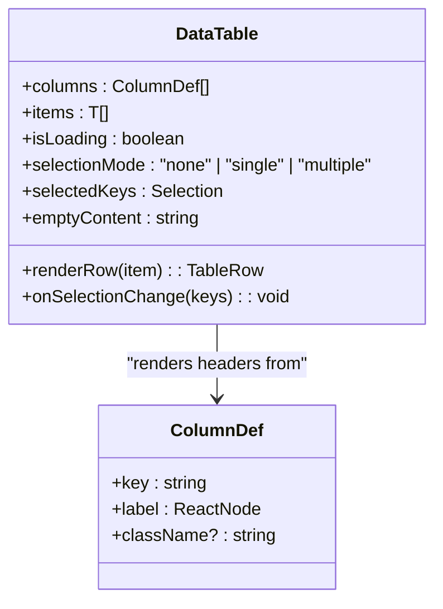
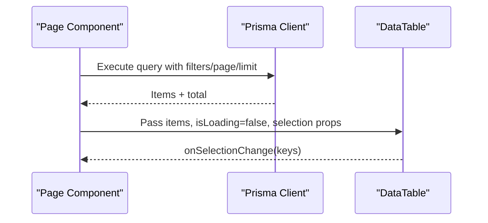
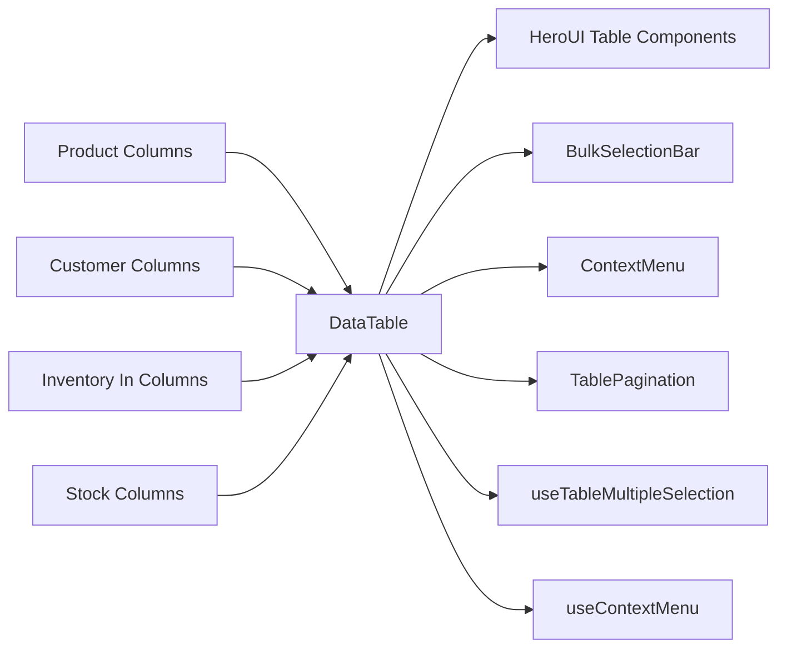

# Data Display & Table Components

<cite>
**Referenced Files in This Document**
- [data-table.tsx](file://src/components/data-table/data-table.tsx)
- [bulk-selection-bar.tsx](file://src/components/data-table/bulk-selection-bar.tsx)
- [context-menu.tsx](file://src/components/data-table/context-menu.tsx)
- [table-pagination.tsx](file://src/components/data-table/table-pagination.tsx)
- [use-table-multiple-selection.ts](file://src/hooks/use-table-multiple-selection.ts)
- [use-context-menu.ts](file://src/hooks/use-context-menu.ts)
- [prisma.ts](file://src/lib/prisma.ts)
- [columns.tsx (Product)](file://src/app/(LoggedIn)/master/product/components/columns.tsx)
- [columns.tsx (Customer)](file://src/app/(LoggedIn)/master/customer/components/columns.tsx)
- [columns.tsx (Inventory In)](file://src/app/(LoggedIn)/inventory/in/components/columns.tsx)
- [columns.tsx (Stock)](file://src/app/(LoggedIn)/inventory/stock/components/columns.tsx)
- [jurnal-table.tsx](file://src/app/(LoggedIn)/finance/jurnal/components/jurnal-table.tsx)
</cite>

## Table of Contents
1. [Introduction](#introduction)
2. [Project Structure](#project-structure)
3. [Core Components](#core-components)
4. [Architecture Overview](#architecture-overview)
5. [Detailed Component Analysis](#detailed-component-analysis)
6. [Dependency Analysis](#dependency-analysis)
7. [Performance Considerations](#performance-considerations)
8. [Troubleshooting Guide](#troubleshooting-guide)
9. [Conclusion](#conclusion)
10. [Appendices](#appendices)

## Introduction
This document explains the data display and table component system used across the application. It covers the generic DataTable component, column configuration patterns, selection and context menu integrations, pagination controls, and practical guidance for building responsive, accessible, and performant data tables. It also outlines how to integrate with Prisma-backed data sources, handle large datasets, and implement real-time updates.

## Project Structure
The table system is built around a small set of reusable components located under src/components/data-table, with supporting hooks and numerous column configuration files distributed across feature areas. Example implementations demonstrate both generic and specialized table patterns.

**Diagram sources**
- [data-table.tsx:1-83](file://src/components/data-table/data-table.tsx#L1-L83)
- [bulk-selection-bar.tsx:1-25](file://src/components/data-table/bulk-selection-bar.tsx#L1-L25)
- [context-menu.tsx:1-41](file://src/components/data-table/context-menu.tsx#L1-L41)
- [table-pagination.tsx:1-82](file://src/components/data-table/table-pagination.tsx#L1-L82)
- [use-table-multiple-selection.ts:1-14](file://src/hooks/use-table-multiple-selection.ts#L1-L14)
- [use-context-menu.ts:1-36](file://src/hooks/use-context-menu.ts#L1-L36)
- [columns.tsx (Product)](file://src/app/(LoggedIn)/master/product/components/columns.tsx#L1-L75)
- [columns.tsx (Customer)](file://src/app/(LoggedIn)/master/customer/components/columns.tsx#L1-L51)
- [columns.tsx (Inventory In)](file://src/app/(LoggedIn)/inventory/in/components/columns.tsx#L1-L61)
- [columns.tsx (Stock)](file://src/app/(LoggedIn)/inventory/stock/components/columns.tsx#L1-L61)
- [jurnal-table.tsx](file://src/app/(LoggedIn)/finance/jurnal/components/jurnal-table.tsx#L1-L225)

**Section sources**
- [data-table.tsx:1-83](file://src/components/data-table/data-table.tsx#L1-L83)
- [bulk-selection-bar.tsx:1-25](file://src/components/data-table/bulk-selection-bar.tsx#L1-L25)
- [context-menu.tsx:1-41](file://src/components/data-table/context-menu.tsx#L1-L41)
- [table-pagination.tsx:1-82](file://src/components/data-table/table-pagination.tsx#L1-L82)
- [use-table-multiple-selection.ts:1-14](file://src/hooks/use-table-multiple-selection.ts#L1-L14)
- [use-context-menu.ts:1-36](file://src/hooks/use-context-menu.ts#L1-L36)
- [columns.tsx (Product)](file://src/app/(LoggedIn)/master/product/components/columns.tsx#L1-L75)
- [columns.tsx (Customer)](file://src/app/(LoggedIn)/master/customer/components/columns.tsx#L1-L51)
- [columns.tsx (Inventory In)](file://src/app/(LoggedIn)/inventory/in/components/columns.tsx#L1-L61)
- [columns.tsx (Stock)](file://src/app/(LoggedIn)/inventory/stock/components/columns.tsx#L1-L61)
- [jurnal-table.tsx](file://src/app/(LoggedIn)/finance/jurnal/components/jurnal-table.tsx#L1-L225)

## Core Components
- DataTable: A generic, type-safe table container that renders headers, rows, and loading/empty states using HeroUI Table primitives. It supports selection modes, controlled selection keys, and a flexible row renderer that must return a full TableRow with direct TableCell children.
- BulkSelectionBar: A lightweight UI element that displays the number of selected items and optional action slots, commonly placed above a table toolbar.
- ContextMenu: A fixed-position menu overlay that renders a list of actions with icons and variants, suitable for right-click or button-triggered menus.
- TablePagination: A compact pagination control with optional per-page limit selection, supporting both “show all” and “per page” modes.

Key characteristics:
- Type safety: DataTable enforces item shape via a minimal WithId constraint, ensuring selection and row rendering rely on a stable identity field.
- Accessibility: Uses semantic aria-labels and HeroUI’s selection APIs to maintain keyboard and screen-reader compatibility.
- Responsiveness: Wraps the table in an overflow-x container and allows column-specific width classes (e.g., narrow action columns on small screens).

**Section sources**
- [data-table.tsx:12-35](file://src/components/data-table/data-table.tsx#L12-L35)
- [bulk-selection-bar.tsx:3-13](file://src/components/data-table/bulk-selection-bar.tsx#L3-L13)
- [context-menu.tsx:10-20](file://src/components/data-table/context-menu.tsx#L10-L20)
- [table-pagination.tsx:6-13](file://src/components/data-table/table-pagination.tsx#L6-L13)

## Architecture Overview
The table system follows a modular pattern:
- Generic DataTable composes column definitions and a renderRow function to produce rows.
- Hooks manage selection mode and context menu lifecycle.
- Pagination and selection state are coordinated at the page level and passed down to DataTable and BulkSelectionBar.
- Feature-specific column definitions encapsulate header labels and optional icons.

**Diagram sources**
- [data-table.tsx:39-57](file://src/components/data-table/data-table.tsx#L39-L57)
- [bulk-selection-bar.tsx:9-23](file://src/components/data-table/bulk-selection-bar.tsx#L9-L23)
- [context-menu.tsx:22-39](file://src/components/data-table/context-menu.tsx#L22-L39)
- [table-pagination.tsx:15-22](file://src/components/data-table/table-pagination.tsx#L15-L22)
- [use-table-multiple-selection.ts:5-12](file://src/hooks/use-table-multiple-selection.ts#L5-L12)
- [use-context-menu.ts:9-34](file://src/hooks/use-context-menu.ts#L9-L34)

## Detailed Component Analysis

### DataTable Component
DataTable wraps HeroUI Table components and exposes:
- columns: Array of ColumnDef entries for headers.
- items: Array of data items to render.
- isLoading: Controls loading state and spinner display.
- renderRow: Function returning a full TableRow with direct TableCell children.
- selectionMode, selectedKeys, onSelectionChange: Selection integration.
- emptyContent: Message shown when items are empty.

Implementation highlights:
- Ensures the row renderer returns a single TableRow with direct TableCell children so HeroUI can correctly count columns.
- Provides a wrapper div enabling horizontal scrolling for small screens.
- Uses a relaxed WithId constraint so any item with an optional id can be rendered.

**Diagram sources**
- [data-table.tsx:12-35](file://src/components/data-table/data-table.tsx#L12-L35)
- [data-table.tsx:21-35](file://src/components/data-table/data-table.tsx#L21-L35)

**Section sources**
- [data-table.tsx:39-82](file://src/components/data-table/data-table.tsx#L39-L82)

### Column Configuration Patterns
Columns are defined as arrays of ColumnDef objects. Each definition includes:
- key: Used for internal mapping and selection.
- label: Header content, often including icons and localized text.
- className: Optional Tailwind classes for responsive widths (e.g., narrow action columns on small screens).

Examples:
- Product table columns define keys for name, SKU, category, type, pricing metrics, and stock status.
- Customer table columns define personal and transactional attributes.
- Inventory In and Stock tables define operational and inventory attributes.

Best practices:
- Keep keys stable and unique.
- Use className to constrain action columns on smaller screens.
- Localize header labels and ensure readable column names.

**Section sources**
- [columns.tsx (Product)](file://src/app/(LoggedIn)/master/product/components/columns.tsx#L4-L75)
- [columns.tsx (Customer)](file://src/app/(LoggedIn)/master/customer/components/columns.tsx#L4-L51)
- [columns.tsx (Inventory In)](file://src/app/(LoggedIn)/inventory/in/components/columns.tsx#L4-L61)
- [columns.tsx (Stock)](file://src/app/(LoggedIn)/inventory/stock/components/columns.tsx#L4-L61)

### Sorting Mechanisms
Sorting is not implemented inside DataTable. Typical approaches:
- Client-side: Sort items in the parent component before passing to DataTable.
- Server-side: Integrate with API endpoints that accept sort parameters and return ordered results.
- UI affordances: Add clickable headers with icons indicating current sort direction; propagate sort params to data fetchers.

Note: The generic DataTable does not include built-in sorting; implement at the page level and pass sorted items to DataTable.

### Filtering Capabilities
Filtering is not implemented inside DataTable. Typical approaches:
- Client-side: Filter items in the parent component before passing to DataTable.
- Server-side: Accept filter parameters (e.g., text search, date range, status) and apply them in queries.
- UI affordances: Provide filter inputs and debounce changes to avoid excessive re-fetches.

### Bulk Selection Bar
BulkSelectionBar displays the number of selected items and optional actions. It is hidden when count equals zero and can be combined with selection controls above the table.

Integration tips:
- Track selection count from DataTable’s selection state.
- Place actions (e.g., delete, export) inside the children slot.

**Section sources**
- [bulk-selection-bar.tsx:9-23](file://src/components/data-table/bulk-selection-bar.tsx#L9-L23)

### Context Menu Integration
ContextMenu provides a fixed-position overlay with actions. The accompanying hook manages opening/closing and coordinates mouse positions.

Usage patterns:
- Right-click on a row to open a contextual menu.
- Trigger from a button within a row for quick actions.
- Close automatically when clicking elsewhere.

Accessibility:
- Ensure keyboard focus is managed when opening the menu.
- Provide visible focus indicators for menu items.

**Section sources**
- [context-menu.tsx:22-39](file://src/components/data-table/context-menu.tsx#L22-L39)
- [use-context-menu.ts:9-34](file://src/hooks/use-context-menu.ts#L9-L34)

### Pagination Controls
TablePagination offers:
- Per-page limit selection with predefined options.
- Page navigation with compact controls.
- Optional total record display.

Behavior:
- Changing the limit resets to the first page.
- When no limit change handler is provided, the component hides the selector and only shows pagination if total pages > 1.

**Section sources**
- [table-pagination.tsx:15-81](file://src/components/data-table/table-pagination.tsx#L15-L81)

### Selection Mode Management
useTableMultipleSelection toggles selection mode between single and multiple based on a boolean flag. This enables dynamic selection behavior depending on the feature’s needs.

**Section sources**
- [use-table-multiple-selection.ts:5-12](file://src/hooks/use-table-multiple-selection.ts#L5-L12)

### Cell Rendering Customization
Two complementary patterns exist:
- Generic DataTable with renderRow: Define a function that returns a full TableRow with direct TableCell children. This keeps rendering logic centralized while allowing rich cell content.
- Feature-specific tables: Implement full Table components with explicit columns and cell content. This pattern is useful when headers and cell layouts are highly customized (e.g., financial journals).

Example of a specialized table:
- Finance Jurnal Table demonstrates complex cell layouts, sticky headers, alignment, and embedded actions.

**Section sources**
- [data-table.tsx:25-30](file://src/components/data-table/data-table.tsx#L25-L30)
- [jurnal-table.tsx](file://src/app/(LoggedIn)/finance/jurnal/components/jurnal-table.tsx#L53-L224)

### Responsive Table Behavior
- DataTable wraps the table in an overflow-x container to support horizontal scrolling on small screens.
- Column definitions can include responsive width classes (e.g., narrow action columns on small screens) to improve readability.

**Section sources**
- [data-table.tsx:50-50](file://src/components/data-table/data-table.tsx#L50-L50)
- [columns.tsx (Product)](file://src/app/(LoggedIn)/master/product/components/columns.tsx#L74-L74)
- [columns.tsx (Customer)](file://src/app/(LoggedIn)/master/customer/components/columns.tsx#L50-L50)

### Data Binding Patterns and Prisma Integration
- Prisma client is configured with an adapter and connection limits for MariaDB.
- Typical data flow: Parent page fetches items (optionally with pagination and filters), passes items and loading state to DataTable, and handles selection/pagination callbacks.

**Diagram sources**
- [prisma.ts:1-25](file://src/lib/prisma.ts#L1-L25)
- [data-table.tsx:39-57](file://src/components/data-table/data-table.tsx#L39-L57)

**Section sources**
- [prisma.ts:1-25](file://src/lib/prisma.ts#L1-L25)
- [data-table.tsx:39-57](file://src/components/data-table/data-table.tsx#L39-L57)

### Real-Time Data Updates
- Real-time patterns can be layered on top of the existing data flow:
  - Polling: Periodically re-fetch data and update items.
  - WebSockets/Pusher: Subscribe to events and mutate local caches (e.g., optimistic updates).
  - Background sync: Use SWR or similar to keep data fresh.

Recommendations:
- Debounce frequent updates to avoid thrashing.
- Normalize updates to avoid unnecessary re-renders.
- Provide user feedback during refresh cycles.

### Accessibility Compliance
- Use semantic aria-labels on tables and interactive elements.
- Ensure keyboard navigation works for selection and pagination.
- Provide sufficient contrast and focus styles for interactive cells and menus.
- Announce loading and empty states to assistive technologies.

## Dependency Analysis
The table system exhibits low coupling and high cohesion:
- DataTable depends on HeroUI primitives and selection APIs.
- Hooks encapsulate cross-cutting concerns (selection mode, context menu).
- Column definitions are decoupled from rendering logic, promoting reuse.
- Pagination and selection state are coordinated at the page level.

**Diagram sources**
- [data-table.tsx:1-10](file://src/components/data-table/data-table.tsx#L1-L10)
- [bulk-selection-bar.tsx:1-25](file://src/components/data-table/bulk-selection-bar.tsx#L1-L25)
- [context-menu.tsx:1-41](file://src/components/data-table/context-menu.tsx#L1-L41)
- [table-pagination.tsx:1-82](file://src/components/data-table/table-pagination.tsx#L1-L82)
- [use-table-multiple-selection.ts:1-14](file://src/hooks/use-table-multiple-selection.ts#L1-L14)
- [use-context-menu.ts:1-36](file://src/hooks/use-context-menu.ts#L1-L36)
- [columns.tsx (Product)](file://src/app/(LoggedIn)/master/product/components/columns.tsx#L1-L75)
- [columns.tsx (Customer)](file://src/app/(LoggedIn)/master/customer/components/columns.tsx#L1-L51)
- [columns.tsx (Inventory In)](file://src/app/(LoggedIn)/inventory/in/components/columns.tsx#L1-L61)
- [columns.tsx (Stock)](file://src/app/(LoggedIn)/inventory/stock/components/columns.tsx#L1-L61)

**Section sources**
- [data-table.tsx:1-10](file://src/components/data-table/data-table.tsx#L1-L10)
- [bulk-selection-bar.tsx:1-25](file://src/components/data-table/bulk-selection-bar.tsx#L1-L25)
- [context-menu.tsx:1-41](file://src/components/data-table/context-menu.tsx#L1-L41)
- [table-pagination.tsx:1-82](file://src/components/data-table/table-pagination.tsx#L1-L82)
- [use-table-multiple-selection.ts:1-14](file://src/hooks/use-table-multiple-selection.ts#L1-L14)
- [use-context-menu.ts:1-36](file://src/hooks/use-context-menu.ts#L1-L36)
- [columns.tsx (Product)](file://src/app/(LoggedIn)/master/product/components/columns.tsx#L1-L75)
- [columns.tsx (Customer)](file://src/app/(LoggedIn)/master/customer/components/columns.tsx#L1-L51)
- [columns.tsx (Inventory In)](file://src/app/(LoggedIn)/inventory/in/components/columns.tsx#L1-L61)
- [columns.tsx (Stock)](file://src/app/(LoggedIn)/inventory/stock/components/columns.tsx#L1-L61)

## Performance Considerations
- Virtualization: For very large datasets, consider virtualized row rendering to limit DOM nodes.
- Pagination: Prefer server-side pagination and filtering to reduce payload sizes.
- Memoization: Memoize column definitions and row renderers to prevent unnecessary re-renders.
- Debouncing: Debounce filter inputs and search to avoid excessive re-fetches.
- Lazy loading: Load additional pages on demand rather than preloading all data.
- Minimize heavy computations in renderRow; compute derived values upstream.

## Troubleshooting Guide
Common issues and resolutions:
- Rows not rendering correctly: Ensure renderRow returns a full TableRow with direct TableCell children.
- Selection not updating: Verify selectionMode, selectedKeys, and onSelectionChange are properly wired.
- Context menu not closing: Confirm the click handler is attached and that openMenuFromButton stops propagation when appropriate.
- Pagination not resetting: When changing limit, ensure the page resets to 1.
- Empty/loading states: Provide emptyContent and toggle isLoading appropriately.

**Section sources**
- [data-table.tsx:25-30](file://src/components/data-table/data-table.tsx#L25-L30)
- [use-context-menu.ts:13-19](file://src/hooks/use-context-menu.ts#L13-L19)
- [table-pagination.tsx:36-42](file://src/components/data-table/table-pagination.tsx#L36-L42)

## Conclusion
The table system combines a generic, type-safe DataTable with reusable UI helpers for selection, context menus, and pagination. Feature-specific column configurations enable consistent yet flexible headers, while specialized tables accommodate complex cell layouts. By integrating with Prisma and adopting server-side pagination, debounced filtering, and responsive design, teams can build scalable, accessible, and performant data tables.

## Appendices

### Implementing Custom Columns
- Define ColumnDef entries with keys and localized labels.
- Optionally include icons and responsive className values.
- Reuse column sets across related pages to maintain consistency.

**Section sources**
- [columns.tsx (Product)](file://src/app/(LoggedIn)/master/product/components/columns.tsx#L4-L75)
- [columns.tsx (Customer)](file://src/app/(LoggedIn)/master/customer/components/columns.tsx#L4-L51)
- [columns.tsx (Inventory In)](file://src/app/(LoggedIn)/inventory/in/components/columns.tsx#L4-L61)
- [columns.tsx (Stock)](file://src/app/(LoggedIn)/inventory/stock/components/columns.tsx#L4-L61)

### Handling Large Datasets
- Use server-side pagination and filtering.
- Implement debounced search and batched updates.
- Consider virtualization for extremely large lists.

### Optimizing Performance
- Memoize column definitions and renderers.
- Avoid heavy computations inside renderRow.
- Use efficient data structures and minimize re-renders.

### Real-Time Data Integration
- Subscribe to events and update local caches.
- Provide user feedback during refresh cycles.
- Normalize updates to avoid redundant renders.

### Accessibility Checklist
- Ensure aria-labels and keyboard navigation.
- Provide focus styles and sufficient contrast.
- Announce loading and empty states.