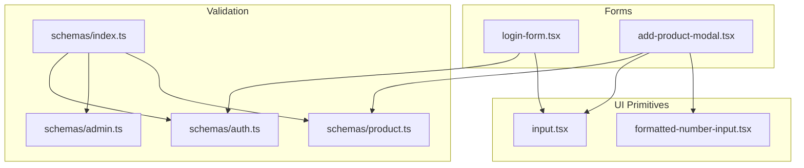
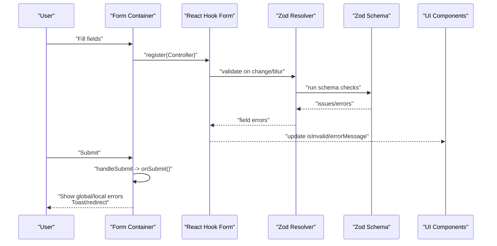
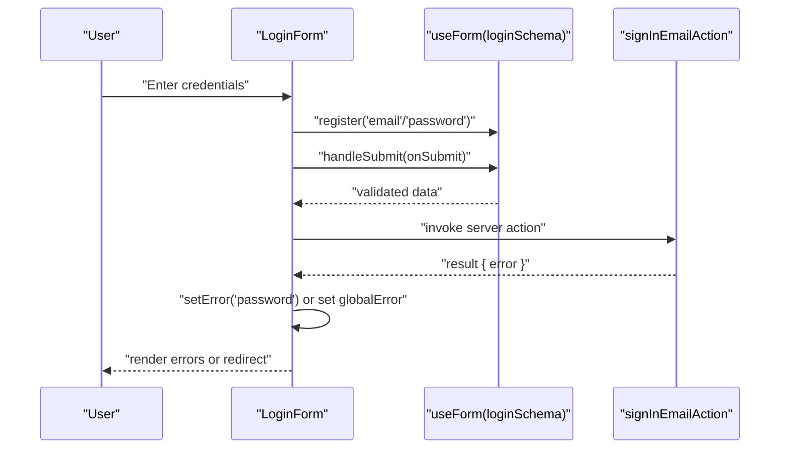
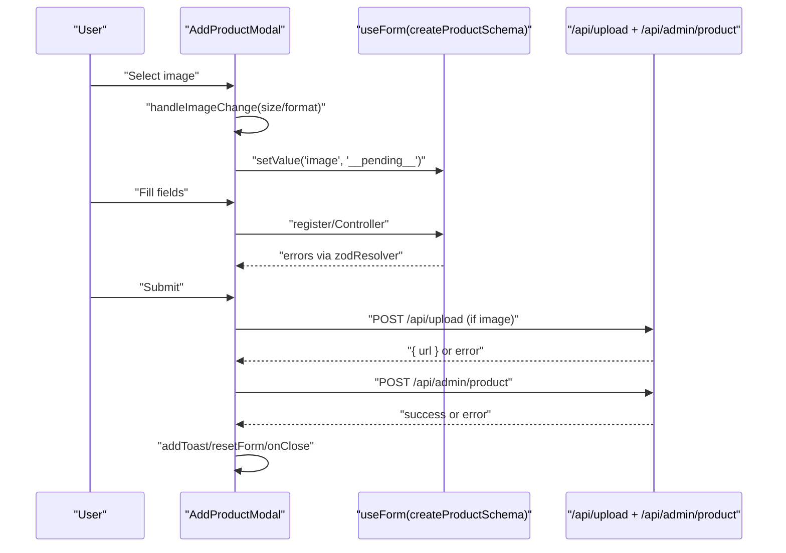
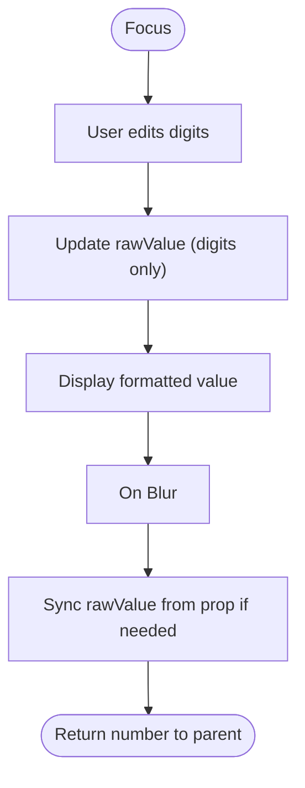
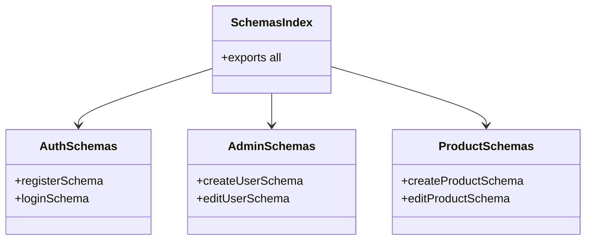
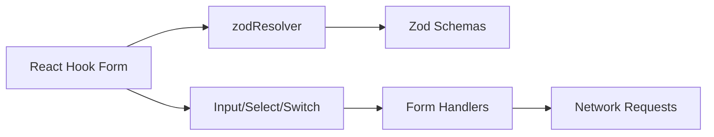

# Form Handling & Validation Components

<cite>
**Referenced Files in This Document**
- [login-form.tsx](file://src/components/login-form.tsx)
- [add-product-modal.tsx](file://src/app/(LoggedIn)/master/product/components/add-product-modal.tsx)
- [formatted-number-input.tsx](file://src/components/ui/formatted-number-input.tsx)
- [input.tsx](file://src/components/ui/input.tsx)
- [auth.ts](file://src/lib/schemas/auth.ts)
- [admin.ts](file://src/lib/schemas/admin.ts)
- [product.ts](file://src/lib/schemas/product.ts)
- [index.ts](file://src/lib/schemas/index.ts)
</cite>

## Table of Contents
1. [Introduction](#introduction)
2. [Project Structure](#project-structure)
3. [Core Components](#core-components)
4. [Architecture Overview](#architecture-overview)
5. [Detailed Component Analysis](#detailed-component-analysis)
6. [Dependency Analysis](#dependency-analysis)
7. [Performance Considerations](#performance-considerations)
8. [Troubleshooting Guide](#troubleshooting-guide)
9. [Conclusion](#conclusion)
10. [Appendices](#appendices)

## Introduction
This document explains the form handling and validation architecture used across the application. It focuses on:
- Form state management with React Hook Form
- Validation schemas powered by Zod
- Error handling and user feedback
- Submission workflows and persistence
- Composition patterns for Inputs, Select dropdowns, Switch controls, and numeric formatting
- Conditional field rendering and dynamic form generation
- Practical examples for complex layouts, multi-step workflows, and form data persistence

The implementation integrates React Hook Form with Zod resolvers to provide robust, declarative validation and seamless UI updates.

## Project Structure
Key areas involved in form handling and validation:
- UI primitives: generic Input and FormattedNumberInput
- Form containers: Login form and Product creation modal
- Validation schemas: centralized Zod schemas for auth, admin, and product domains
- Integration points: resolver binding, controlled/uncontrolled field patterns, and submission handlers

**Diagram sources**
- [login-form.tsx:1-118](file://src/components/login-form.tsx#L1-L118)
- [add-product-modal.tsx:1-425](file://src/app/(LoggedIn)/master/product/components/add-product-modal.tsx#L1-L425)
- [formatted-number-input.tsx:1-83](file://src/components/ui/formatted-number-input.tsx#L1-L83)
- [input.tsx:1-22](file://src/components/ui/input.tsx#L1-L22)
- [auth.ts:1-44](file://src/lib/schemas/auth.ts#L1-L44)
- [admin.ts:1-52](file://src/lib/schemas/admin.ts#L1-L52)
- [product.ts:1-74](file://src/lib/schemas/product.ts#L1-L74)
- [index.ts:1-9](file://src/lib/schemas/index.ts#L1-L9)

**Section sources**
- [login-form.tsx:1-118](file://src/components/login-form.tsx#L1-L118)
- [add-product-modal.tsx:1-425](file://src/app/(LoggedIn)/master/product/components/add-product-modal.tsx#L1-L425)
- [formatted-number-input.tsx:1-83](file://src/components/ui/formatted-number-input.tsx#L1-L83)
- [input.tsx:1-22](file://src/components/ui/input.tsx#L1-L22)
- [auth.ts:1-44](file://src/lib/schemas/auth.ts#L1-L44)
- [admin.ts:1-52](file://src/lib/schemas/admin.ts#L1-L52)
- [product.ts:1-74](file://src/lib/schemas/product.ts#L1-L74)
- [index.ts:1-9](file://src/lib/schemas/index.ts#L1-L9)

## Core Components
- React Hook Form + Zod Resolver: Forms bind Zod schemas to drive validation and state updates.
- Generic Inputs: Standardized Input and specialized FormattedNumberInput for currency-like numeric fields.
- Controlled/Uncontrolled Patterns: Selects and Switches use Controller for controlled behavior; Inputs use register for uncontrolled updates with validation feedback.
- Centralized Schemas: A single index aggregates domain-specific Zod schemas for clean imports.

Key responsibilities:
- FormProvider equivalent: Not explicitly defined; React Hook Form’s useForm acts as the provider for each form instance.
- Input components: Provide consistent styling and validation integration.
- Select dropdowns: Rendered via Heroui Select with Controller to manage selections.
- Checkbox/Radio equivalents: Implemented via Switch for boolean toggles.
- Validation utilities: Zod schemas define shape, refinements, and custom issues; resolvers translate them into React Hook Form signals.

**Section sources**
- [login-form.tsx:20-41](file://src/components/login-form.tsx#L20-L41)
- [add-product-modal.tsx:35-50](file://src/app/(LoggedIn)/master/product/components/add-product-modal.tsx#L35-L50)
- [formatted-number-input.tsx:30-82](file://src/components/ui/formatted-number-input.tsx#L30-L82)
- [input.tsx:5-19](file://src/components/ui/input.tsx#L5-L19)
- [index.ts:6-8](file://src/lib/schemas/index.ts#L6-L8)

## Architecture Overview
End-to-end flow for a typical form:
- User interacts with fields (register or Controller)
- React Hook Form triggers validation via zodResolver
- Zod schemas validate shape, types, and custom rules
- Errors propagate to formState.errors and UI feedback
- On submit, controlled handlers orchestrate persistence and resets

**Diagram sources**
- [login-form.tsx:20-41](file://src/components/login-form.tsx#L20-L41)
- [add-product-modal.tsx:96-140](file://src/app/(LoggedIn)/master/product/components/add-product-modal.tsx#L96-L140)
- [auth.ts:31-40](file://src/lib/schemas/auth.ts#L31-L40)
- [product.ts:6-22](file://src/lib/schemas/product.ts#L6-L22)

## Detailed Component Analysis

### Login Form
- Purpose: Authenticate users with email and password.
- Validation: Zod schema enforces presence and format for email/password.
- Error handling: Local/global errors surfaced via Alert; password mismatches mapped to form.setError.
- Submission: Calls server action and navigates on success.

**Diagram sources**
- [login-form.tsx:20-41](file://src/components/login-form.tsx#L20-L41)
- [auth.ts:31-40](file://src/lib/schemas/auth.ts#L31-L40)

**Section sources**
- [login-form.tsx:12-117](file://src/components/login-form.tsx#L12-L117)
- [auth.ts:31-40](file://src/lib/schemas/auth.ts#L31-L40)

### Add Product Modal (Complex Form)
- Purpose: Create products with rich inputs, image upload, and conditional fields.
- Validation: Zod schema validates shape and applies superRefine for conditional constraints (stock/minStock required for physical products).
- Field composition:
  - Input: Product name, SKU
  - Select: Category, Unit (via Controller)
  - FormattedNumberInput: HPP, selling price, initial stock, minimum stock
  - Switch: isService toggles physical vs service product
  - Image picker: local preview and upload flow
- Error handling: Global errors for network/image failures; per-field errors via formState.errors.
- Submission: Uploads image to storage endpoint, then posts product data to backend; resets and closes on success.

**Diagram sources**
- [add-product-modal.tsx:35-50](file://src/app/(LoggedIn)/master/product/components/add-product-modal.tsx#L35-L50)
- [add-product-modal.tsx:58-75](file://src/app/(LoggedIn)/master/product/components/add-product-modal.tsx#L58-L75)
- [add-product-modal.tsx:96-140](file://src/app/(LoggedIn)/master/product/components/add-product-modal.tsx#L96-L140)
- [product.ts:6-53](file://src/lib/schemas/product.ts#L6-L53)

**Section sources**
- [add-product-modal.tsx:24-424](file://src/app/(LoggedIn)/master/product/components/add-product-modal.tsx#L24-L424)
- [product.ts:6-74](file://src/lib/schemas/product.ts#L6-L74)

### Formatted Number Input
- Purpose: Provide localized thousands formatting while returning numeric values to parent handlers.
- Behavior:
  - Raw editing: digits-only string for easy typing
  - Display: formatted string using locale-aware separators
  - Leading zero removal and onBlur sync
- Integration: Used for currency/HPP/price/stock fields to improve UX and reduce input errors.

**Diagram sources**
- [formatted-number-input.tsx:30-82](file://src/components/ui/formatted-number-input.tsx#L30-L82)

**Section sources**
- [formatted-number-input.tsx:13-82](file://src/components/ui/formatted-number-input.tsx#L13-L82)

### Input Primitive
- Purpose: Consistent base input with validation styling and accessibility attributes.
- Features: Tailwind-based styling, focus-visible ring, invalid state via aria-invalid, and slot metadata for styling systems.

**Section sources**
- [input.tsx:5-19](file://src/components/ui/input.tsx#L5-L19)

### Validation Schemas
- Centralized exports: schemas/index.ts re-exports domain schemas for clean imports.
- Domain-specific schemas:
  - Authentication: register and login validations
  - Admin: create/edit user with role enums and password confirmation
  - Product: create/edit product with conditional refinement for stock fields

**Diagram sources**
- [index.ts:6-8](file://src/lib/schemas/index.ts#L6-L8)
- [auth.ts:6-44](file://src/lib/schemas/auth.ts#L6-L44)
- [admin.ts:7-52](file://src/lib/schemas/admin.ts#L7-L52)
- [product.ts:6-74](file://src/lib/schemas/product.ts#L6-L74)

**Section sources**
- [index.ts:1-9](file://src/lib/schemas/index.ts#L1-L9)
- [auth.ts:1-44](file://src/lib/schemas/auth.ts#L1-L44)
- [admin.ts:1-52](file://src/lib/schemas/admin.ts#L1-L52)
- [product.ts:1-74](file://src/lib/schemas/product.ts#L1-L74)

## Dependency Analysis
- React Hook Form drives form state and validation lifecycle.
- Zod schemas define validation contracts; zodResolver bridges Zod to React Hook Form.
- UI components integrate with form state via register and Controller.
- Network requests are orchestrated in form handlers; errors are normalized and surfaced to users.

**Diagram sources**
- [login-form.tsx:3-26](file://src/components/login-form.tsx#L3-L26)
- [add-product-modal.tsx:12-50](file://src/app/(LoggedIn)/master/product/components/add-product-modal.tsx#L12-L50)
- [auth.ts:1-44](file://src/lib/schemas/auth.ts#L1-L44)
- [product.ts:1-74](file://src/lib/schemas/product.ts#L1-L74)

**Section sources**
- [login-form.tsx:3-26](file://src/components/login-form.tsx#L3-L26)
- [add-product-modal.tsx:12-50](file://src/app/(LoggedIn)/master/product/components/add-product-modal.tsx#L12-L50)
- [auth.ts:1-44](file://src/lib/schemas/auth.ts#L1-L44)
- [product.ts:1-74](file://src/lib/schemas/product.ts#L1-L74)

## Performance Considerations
- Validation granularity: Using mode "onBlur" reduces unnecessary re-renders during typing.
- Controlled vs uncontrolled: Prefer register for simple inputs; use Controller for complex widgets (Select, Switch) to avoid extra renders.
- Numeric formatting: Keep formatted display lightweight; avoid heavy computations in onChange.
- Image uploads: Debounce or batch upload triggers; show previews immediately and replace with real URL after upload.
- Schema complexity: superRefine adds runtime checks; keep custom refinements focused and efficient.

[No sources needed since this section provides general guidance]

## Troubleshooting Guide
Common issues and resolutions:
- Field not updating or validation not triggering:
  - Ensure register is used for simple inputs and Controller for Select/Switch.
  - Verify resolver is bound to useForm and schema matches the form shape.
- Password mismatch not reflected:
  - Confirm refine on password confirmation is present in the schema.
  - Use setError in handler for server-side mismatches.
- Conditional fields missing:
  - For physical products, stock and minStock are required; ensure isService toggle is respected.
- Image upload errors:
  - Validate file size/type before upload; surface network errors globally.
- Global vs field-level errors:
  - Use formState.errors for field-level; set globalError for server/network issues.

**Section sources**
- [login-form.tsx:28-41](file://src/components/login-form.tsx#L28-L41)
- [add-product-modal.tsx:58-75](file://src/app/(LoggedIn)/master/product/components/add-product-modal.tsx#L58-L75)
- [add-product-modal.tsx:96-140](file://src/app/(LoggedIn)/master/product/components/add-product-modal.tsx#L96-L140)
- [product.ts:23-53](file://src/lib/schemas/product.ts#L23-L53)

## Conclusion
The form system combines React Hook Form and Zod to deliver predictable, maintainable validation and a responsive user experience. By centralizing schemas, composing controlled/uncontrolled inputs, and handling submission flows explicitly, the codebase supports complex forms like product creation and authentication while remaining extensible for future multi-step or dynamic forms.

[No sources needed since this section summarizes without analyzing specific files]

## Appendices

### Example Patterns
- Complex layout: Side-by-side image and name, grouped numeric fields, and a boolean toggle switch.
- Conditional rendering: Stock fields appear only for physical products; image preview updates reactively.
- Multi-step ideas: Split product creation into steps (basic info, pricing, inventory) while persisting draft state locally or in a temporary backend endpoint.
- Persistence: Store defaults in form.reset; persist images before submitting product data.

[No sources needed since this section provides general guidance]