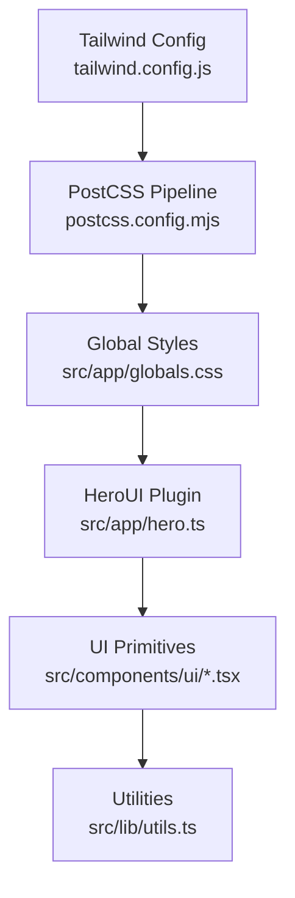
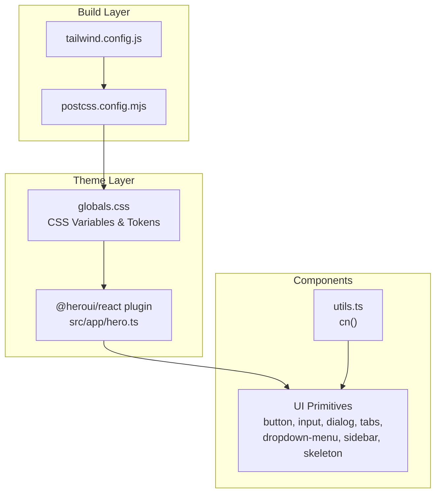
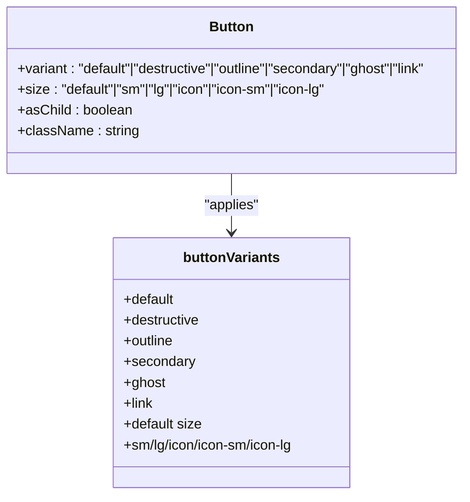
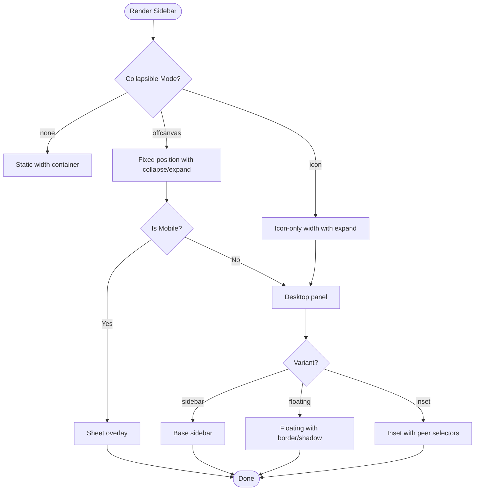
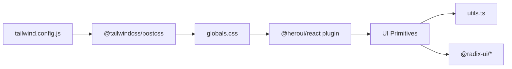

# Styling & Theming System

<cite>
**Referenced Files in This Document**
- [tailwind.config.js](file://tailwind.config.js)
- [globals.css](file://src/app/globals.css)
- [hero.ts](file://src/app/hero.ts)
- [components.json](file://components.json)
- [postcss.config.mjs](file://postcss.config.mjs)
- [next.config.ts](file://next.config.ts)
- [utils.ts](file://src/lib/utils.ts)
- [button.tsx](file://src/components/ui/button.tsx)
- [skeleton.tsx](file://src/components/ui/skeleton.tsx)
- [input.tsx](file://src/components/ui/input.tsx)
- [dialog.tsx](file://src/components/ui/dialog.tsx)
- [tabs.tsx](file://src/components/ui/tabs.tsx)
- [dropdown-menu.tsx](file://src/components/ui/dropdown-menu.tsx)
- [sidebar.tsx](file://src/components/ui/sidebar.tsx)
- [formatted-number-input.tsx](file://src/components/ui/formatted-number-input.tsx)
</cite>

## Table of Contents
1. [Introduction](#introduction)
2. [Project Structure](#project-structure)
3. [Core Components](#core-components)
4. [Architecture Overview](#architecture-overview)
5. [Detailed Component Analysis](#detailed-component-analysis)
6. [Dependency Analysis](#dependency-analysis)
7. [Performance Considerations](#performance-considerations)
8. [Troubleshooting Guide](#troubleshooting-guide)
9. [Conclusion](#conclusion)
10. [Appendices](#appendices)

## Introduction
This document explains the styling and theming system built with Tailwind CSS and HeroUI. It covers Tailwind configuration, custom design tokens, color palette, typography, spacing, dark mode, responsive design, and HeroUI component theming. It also documents reusable UI primitives, skeleton loading states, and progressive enhancement patterns to maintain consistency across the application.

## Project Structure
The styling system is organized around:
- Tailwind configuration and PostCSS pipeline
- Global CSS with CSS variables and design tokens
- HeroUI plugin integration
- Reusable UI primitives with consistent variants and tokens
- Responsive and mobile-first patterns

**Diagram sources**
- [tailwind.config.js:1-12](file://tailwind.config.js#L1-L12)
- [postcss.config.mjs:1-8](file://postcss.config.mjs#L1-L8)
- [globals.css:1-145](file://src/app/globals.css#L1-L145)
- [hero.ts:1-2](file://src/app/hero.ts#L1-L2)
- [utils.ts:1-6](file://src/lib/utils.ts#L1-L6)

**Section sources**
- [tailwind.config.js:1-12](file://tailwind.config.js#L1-L12)
- [postcss.config.mjs:1-8](file://postcss.config.mjs#L1-L8)
- [globals.css:1-145](file://src/app/globals.css#L1-L145)
- [hero.ts:1-2](file://src/app/hero.ts#L1-L2)
- [components.json:1-23](file://components.json#L1-L23)
- [next.config.ts:1-11](file://next.config.ts#L1-L11)

## Core Components
- Tailwind configuration enables dark mode via class strategy and loads HeroUI theme for supported components.
- Global CSS defines design tokens as CSS variables and establishes light/dark palettes.
- HeroUI plugin exposes design tokens and variants for components.
- Utilities consolidate Tailwind classes with clsx and twMerge for predictable composition.
- UI primitives define consistent variants (e.g., button, input, dialog) and leverage tokens for colors, radii, and spacing.

**Section sources**
- [tailwind.config.js:7-12](file://tailwind.config.js#L7-L12)
- [globals.css:8-47](file://src/app/globals.css#L8-L47)
- [globals.css:49-116](file://src/app/globals.css#L49-L116)
- [hero.ts:1-2](file://src/app/hero.ts#L1-L2)
- [utils.ts:1-6](file://src/lib/utils.ts#L1-L6)

## Architecture Overview
The styling pipeline integrates Tailwind, HeroUI, and global tokens to produce a cohesive design system.

**Diagram sources**
- [tailwind.config.js:1-12](file://tailwind.config.js#L1-L12)
- [postcss.config.mjs:1-8](file://postcss.config.mjs#L1-L8)
- [globals.css:1-145](file://src/app/globals.css#L1-L145)
- [hero.ts:1-2](file://src/app/hero.ts#L1-L2)
- [utils.ts:1-6](file://src/lib/utils.ts#L1-L6)

## Detailed Component Analysis

### Tailwind Configuration and Content Strategy
- Dark mode is controlled via class strategy.
- Content scanning targets HeroUI components to ensure proper tree-shaking and theme injection.
- Theme extension is empty; tokens and variants are supplied by HeroUI.

**Section sources**
- [tailwind.config.js:3-12](file://tailwind.config.js#L3-L12)

### Global Design Tokens and CSS Variables
- Tokens are defined as CSS variables scoped under :root and .dark.
- Tokens include background, foreground, primary/secondary palettes, borders, inputs, rings, and sidebar tokens.
- Radius tokens are derived from a base radius variable for consistent corner radii.
- Font family is applied globally with a fallback stack.

**Section sources**
- [globals.css:8-47](file://src/app/globals.css#L8-L47)
- [globals.css:49-116](file://src/app/globals.css#L49-L116)
- [globals.css:118-129](file://src/app/globals.css#L118-L129)

### HeroUI Plugin Integration
- The HeroUI plugin is registered in Tailwind and exposed via a small wrapper module.
- This enables HeroUI components to consume the design system tokens and variants.

**Section sources**
- [tailwind.config.js:10-12](file://tailwind.config.js#L10-L12)
- [hero.ts:1-2](file://src/app/hero.ts#L1-L2)

### Button Component Variants and Sizes
- Uses class-variance-authority to define variants (default, destructive, outline, secondary, ghost, link) and sizes (default, sm, lg, icon, icon-sm, icon-lg).
- Leverages tokens for colors, borders, shadows, and focus states.
- Supports asChild pattern via Radix Slot for semantic composition.

**Diagram sources**
- [button.tsx:7-37](file://src/components/ui/button.tsx#L7-L37)
- [button.tsx:39-62](file://src/components/ui/button.tsx#L39-L62)

**Section sources**
- [button.tsx:7-37](file://src/components/ui/button.tsx#L7-L37)
- [button.tsx:39-62](file://src/components/ui/button.tsx#L39-L62)

### Input Component Styling
- Inherits tokens for background, border, placeholder, and focus states.
- Focus-visible ring and transitions are applied consistently.
- Accessibility attributes (aria-invalid) integrate with token-driven feedback.

**Section sources**
- [input.tsx:5-21](file://src/components/ui/input.tsx#L5-L21)

### Dialog Component Composition
- Uses Radix UI primitives with HeroUI tokens for overlay, content, header, footer, and typography.
- Animations and positioning rely on data-* attributes and Tailwind utilities.
- Close button and focus-visible rings follow the design system.

**Section sources**
- [dialog.tsx:10-82](file://src/components/ui/dialog.tsx#L10-L82)
- [dialog.tsx:84-145](file://src/components/ui/dialog.tsx#L84-L145)

### Tabs Component Variants
- Provides default and line variants for tab lists.
- Uses tokens for backgrounds, borders, and active states.
- Orientation-aware layout with horizontal/vertical variants.

**Section sources**
- [tabs.tsx:28-41](file://src/components/ui/tabs.tsx#L28-L41)
- [tabs.tsx:59-76](file://src/components/ui/tabs.tsx#L59-L76)

### Dropdown Menu Variants and States
- Supports default and destructive item variants.
- Handles nested submenus, checkboxes, radios, separators, and shortcuts.
- Uses tokens for popovers, accents, and focus states.

**Section sources**
- [dropdown-menu.tsx:62-83](file://src/components/ui/dropdown-menu.tsx#L62-L83)
- [dropdown-menu.tsx:195-239](file://src/components/ui/dropdown-menu.tsx#L195-L239)

### Sidebar Component and Mobile-First Patterns
- Implements three collapsible modes (offcanvas, icon, none) and three variants (sidebar, floating, inset).
- Uses CSS custom properties for widths and responsive behavior.
- Integrates with Sheet for mobile off-canvas and Tooltip for collapsed icons.
- Includes skeleton placeholders for progressive loading.

**Diagram sources**
- [sidebar.tsx:155-255](file://src/components/ui/sidebar.tsx#L155-L255)
- [sidebar.tsx:184-207](file://src/components/ui/sidebar.tsx#L184-L207)

**Section sources**
- [sidebar.tsx:155-255](file://src/components/ui/sidebar.tsx#L155-L255)
- [sidebar.tsx:603-639](file://src/components/ui/sidebar.tsx#L603-L639)

### Skeleton Loading States
- Skeleton primitives use animated pulse with accent background.
- Sidebar composes skeletons for menu items to progressively render content.

**Section sources**
- [skeleton.tsx:1-14](file://src/components/ui/skeleton.tsx#L1-L14)
- [sidebar.tsx:603-639](file://src/components/ui/sidebar.tsx#L603-L639)

### Formatted Number Input (HeroUI Integration)
- Wraps HeroUI Input to provide Indonesian locale number formatting.
- Manages raw vs formatted values during focus/blur for usability.
- Returns numeric onChange callbacks while displaying formatted strings.

**Section sources**
- [formatted-number-input.tsx:30-82](file://src/components/ui/formatted-number-input.tsx#L30-L82)

## Dependency Analysis
The styling system depends on:
- Tailwind CSS for utility classes and dark mode.
- HeroUI for component themes and design tokens.
- PostCSS for build-time processing.
- Radix UI primitives for accessible component internals.
- clsx and twMerge for robust class merging.

**Diagram sources**
- [tailwind.config.js:1-12](file://tailwind.config.js#L1-L12)
- [postcss.config.mjs:1-8](file://postcss.config.mjs#L1-L8)
- [globals.css:1-145](file://src/app/globals.css#L1-L145)
- [hero.ts:1-2](file://src/app/hero.ts#L1-L2)
- [utils.ts:1-6](file://src/lib/utils.ts#L1-L6)

**Section sources**
- [tailwind.config.js:1-12](file://tailwind.config.js#L1-L12)
- [postcss.config.mjs:1-8](file://postcss.config.mjs#L1-L8)
- [components.json:1-23](file://components.json#L1-L23)

## Performance Considerations
- Tree-shaking: Tailwind content scanning limits generated CSS to used HeroUI components.
- CSS variables: Centralized tokens reduce duplication and enable efficient dark mode switching.
- Utility merging: Using cn() ensures minimal class churn and avoids conflicts.
- Skeletons: Provide perceived performance improvements during async rendering.

[No sources needed since this section provides general guidance]

## Troubleshooting Guide
- Dark mode not applying:
  - Ensure the dark mode class strategy is set and a .dark ancestor exists.
  - Verify CSS variables are present in :root and .dark.
- HeroUI component styles missing:
  - Confirm the HeroUI plugin is registered and content scanning includes the component files.
- Unexpected focus rings or invalid states:
  - Check aria-invalid and focus-visible utilities are applied consistently in inputs and buttons.
- Sidebar not collapsing on mobile:
  - Confirm useIsMobile hook and Sheet integration are functioning.

**Section sources**
- [tailwind.config.js:10-12](file://tailwind.config.js#L10-L12)
- [globals.css:49-116](file://src/app/globals.css#L49-L116)
- [input.tsx:5-21](file://src/components/ui/input.tsx#L5-L21)
- [button.tsx:7-37](file://src/components/ui/button.tsx#L7-L37)

## Conclusion
The styling and theming system combines Tailwind’s utility-first approach with HeroUI’s component-level design tokens. CSS variables centralize the color palette and radii, while class variance and tokens ensure consistent variants across primitives. Dark mode, responsive behavior, and skeleton states deliver a polished, accessible experience with predictable maintenance.

[No sources needed since this section summarizes without analyzing specific files]

## Appendices

### Color Palette and Tokens Reference
- Semantic tokens: background, foreground, card, popover, primary, secondary, muted, accent, destructive, border, input, ring, chart-1..5, sidebar and related tokens.
- Radius tokens: sm, md, lg, xl, 2xl, 3xl, 4xl derived from a base radius.
- Typography: global font stack with fallbacks.
- Spacing: CSS variables support consistent gaps and paddings across components.

**Section sources**
- [globals.css:8-47](file://src/app/globals.css#L8-L47)
- [globals.css:49-116](file://src/app/globals.css#L49-L116)
- [globals.css:118-129](file://src/app/globals.css#L118-L129)

### Responsive Breakpoints and Mobile-First Approach
- Desktop-first utilities (e.g., md:, lg:) are used alongside mobile conditions.
- Sidebar adapts via Sheet on mobile and CSS custom properties for widths.
- Focus-visible and hover states remain consistent across breakpoints.

**Section sources**
- [sidebar.tsx:184-207](file://src/components/ui/sidebar.tsx#L184-L207)
- [sidebar.tsx:211-254](file://src/components/ui/sidebar.tsx#L211-L254)

### Extending the Design System
- Add new tokens in globals.css and reference them via CSS variables.
- Define new component variants using class-variance-authority and apply tokens for colors and spacing.
- Keep dark mode variants aligned with .dark declarations.
- Prefer tokens over hardcoded values for consistency.

**Section sources**
- [globals.css:8-47](file://src/app/globals.css#L8-L47)
- [button.tsx:7-37](file://src/components/ui/button.tsx#L7-L37)
- [tabs.tsx:28-41](file://src/components/ui/tabs.tsx#L28-L41)