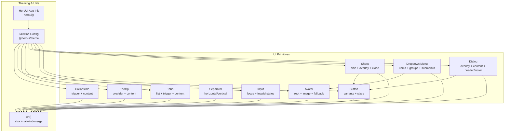
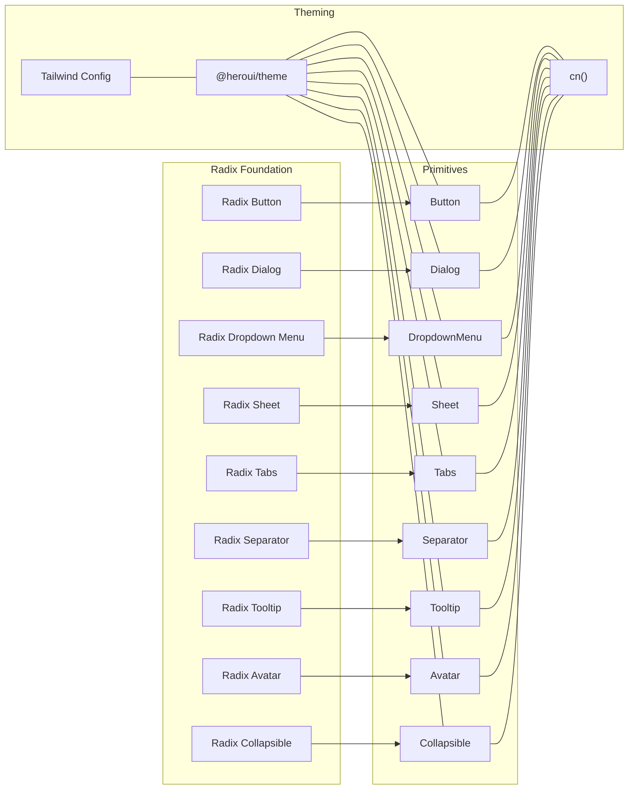
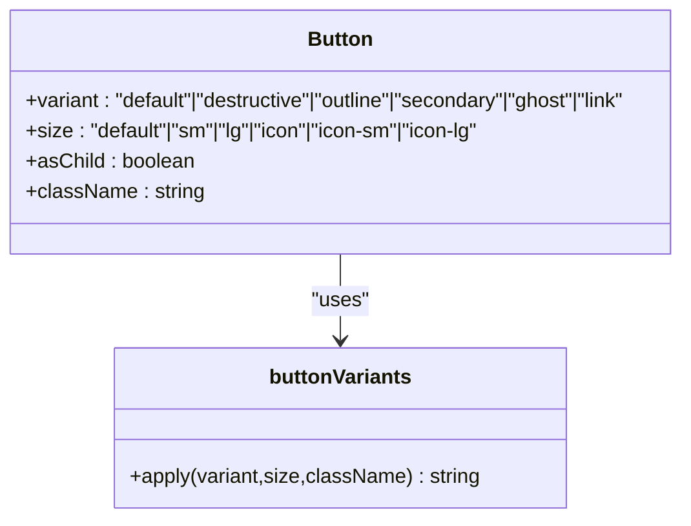
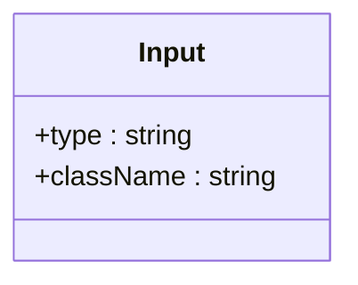
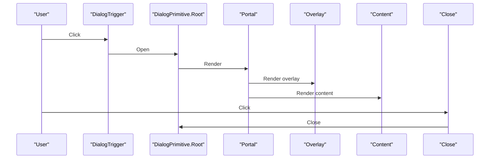
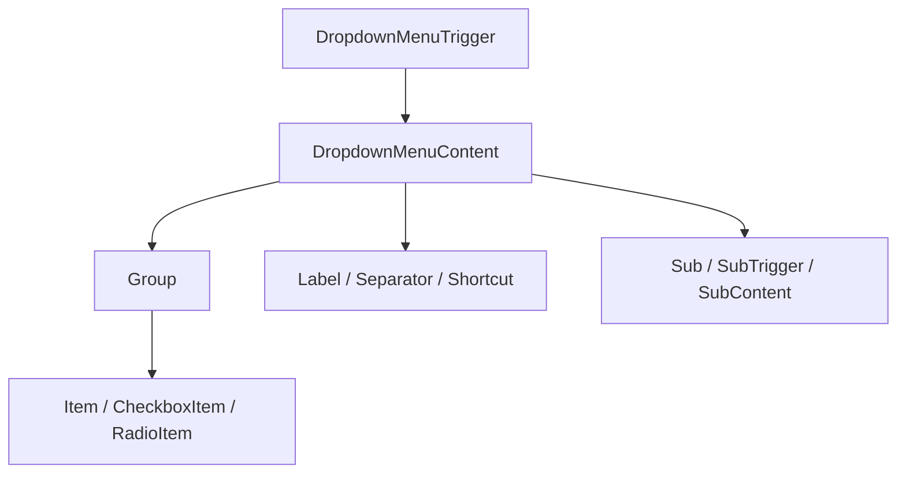
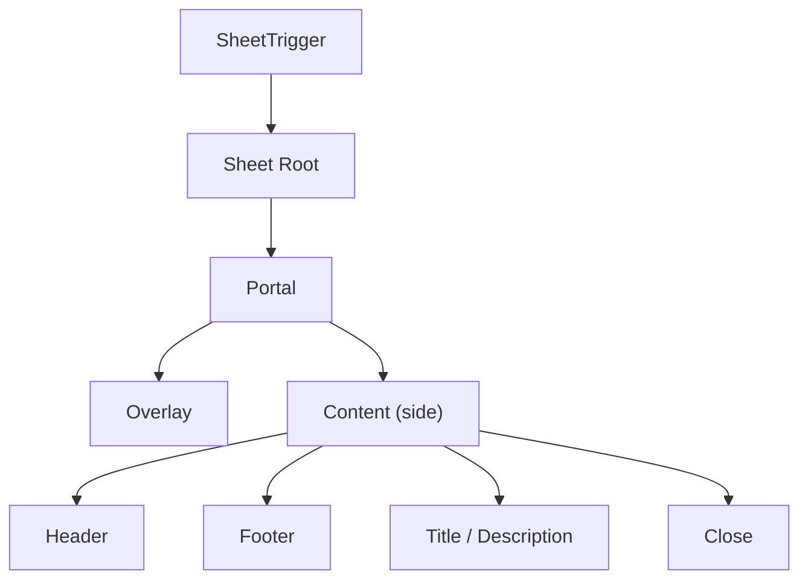
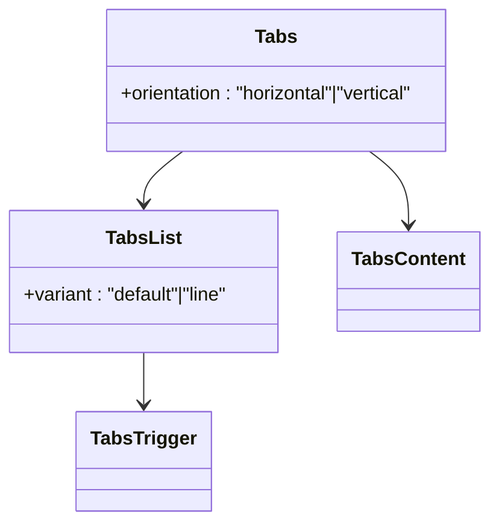
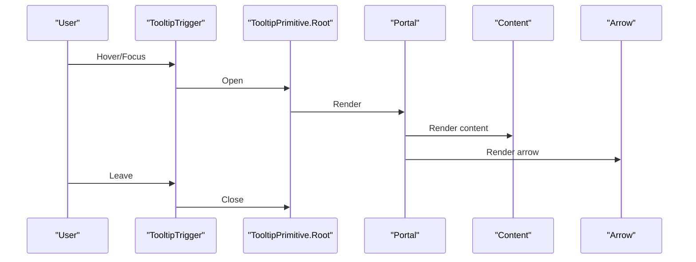
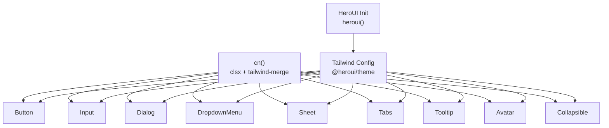

# UI Primitives & Base Components

<cite>
**Referenced Files in This Document**
- [button.tsx](file://src/components/ui/button.tsx)
- [input.tsx](file://src/components/ui/input.tsx)
- [dialog.tsx](file://src/components/ui/dialog.tsx)
- [dropdown-menu.tsx](file://src/components/ui/dropdown-menu.tsx)
- [sheet.tsx](file://src/components/ui/sheet.tsx)
- [tabs.tsx](file://src/components/ui/tabs.tsx)
- [separator.tsx](file://src/components/ui/separator.tsx)
- [tooltip.tsx](file://src/components/ui/tooltip.tsx)
- [avatar.tsx](file://src/components/ui/avatar.tsx)
- [collapsible.tsx](file://src/components/ui/collapsible.tsx)
- [formatted-number-input.tsx](file://src/components/ui/formatted-number-input.tsx)
- [confirm-modal.tsx](file://src/components/ui/confirm-modal.tsx)
- [hero.ts](file://src/app/hero.ts)
- [utils.ts](file://src/lib/utils.ts)
- [tailwind.config.js](file://tailwind.config.js)
- [components.json](file://components.json)
</cite>

## Table of Contents
1. [Introduction](#introduction)
2. [Project Structure](#project-structure)
3. [Core Components](#core-components)
4. [Architecture Overview](#architecture-overview)
5. [Detailed Component Analysis](#detailed-component-analysis)
6. [Dependency Analysis](#dependency-analysis)
7. [Performance Considerations](#performance-considerations)
8. [Troubleshooting Guide](#troubleshooting-guide)
9. [Conclusion](#conclusion)
10. [Appendices](#appendices)

## Introduction
This document describes the foundational UI primitive components used across the application: Button, Input, Dialog, Dropdown Menu, Sheet, Tabs, Separator, Tooltip, Avatar, and Collapsible. It explains component architecture, prop interfaces, styling patterns, accessibility features, and how they integrate with HeroUI and Radix UI foundations. It also covers variant options, size variations, state management, composition patterns, theming via Tailwind CSS, and guidance for extending base components while maintaining design consistency.

## Project Structure
The primitives live under src/components/ui and are built with:
- Radix UI primitives for accessible base behaviors
- HeroUI for theming and advanced components
- Tailwind CSS with class-variance-authority for variant styling
- A shared cn utility for merging Tailwind classes

**Diagram sources**
- [button.tsx:1-63](file://src/components/ui/button.tsx#L1-L63)
- [input.tsx:1-22](file://src/components/ui/input.tsx#L1-L22)
- [dialog.tsx:1-159](file://src/components/ui/dialog.tsx#L1-L159)
- [dropdown-menu.tsx:1-258](file://src/components/ui/dropdown-menu.tsx#L1-L258)
- [sheet.tsx:1-140](file://src/components/ui/sheet.tsx#L1-L140)
- [tabs.tsx:1-92](file://src/components/ui/tabs.tsx#L1-L92)
- [separator.tsx:1-29](file://src/components/ui/separator.tsx#L1-L29)
- [tooltip.tsx:1-62](file://src/components/ui/tooltip.tsx#L1-L62)
- [avatar.tsx:1-54](file://src/components/ui/avatar.tsx#L1-L54)
- [collapsible.tsx:1-34](file://src/components/ui/collapsible.tsx#L1-L34)
- [utils.ts:1-7](file://src/lib/utils.ts#L1-L7)
- [tailwind.config.js:1-12](file://tailwind.config.js#L1-L12)
- [hero.ts:1-2](file://src/app/hero.ts#L1-L2)

**Section sources**
- [button.tsx:1-63](file://src/components/ui/button.tsx#L1-L63)
- [input.tsx:1-22](file://src/components/ui/input.tsx#L1-L22)
- [dialog.tsx:1-159](file://src/components/ui/dialog.tsx#L1-L159)
- [dropdown-menu.tsx:1-258](file://src/components/ui/dropdown-menu.tsx#L1-L258)
- [sheet.tsx:1-140](file://src/components/ui/sheet.tsx#L1-L140)
- [tabs.tsx:1-92](file://src/components/ui/tabs.tsx#L1-L92)
- [separator.tsx:1-29](file://src/components/ui/separator.tsx#L1-L29)
- [tooltip.tsx:1-62](file://src/components/ui/tooltip.tsx#L1-L62)
- [avatar.tsx:1-54](file://src/components/ui/avatar.tsx#L1-L54)
- [collapsible.tsx:1-34](file://src/components/ui/collapsible.tsx#L1-L34)
- [utils.ts:1-7](file://src/lib/utils.ts#L1-L7)
- [tailwind.config.js:1-12](file://tailwind.config.js#L1-L12)
- [hero.ts:1-2](file://src/app/hero.ts#L1-L2)

## Core Components
This section summarizes the primary primitives and their capabilities.

- Button
  - Variants: default, destructive, outline, secondary, ghost, link
  - Sizes: default, sm, lg, icon, icon-sm, icon-lg
  - Accessibility: focus-visible ring, aria-invalid support, slot composition via asChild
  - Composition: wraps either a native button or a Slot for semantic flexibility

- Input
  - States: focus-visible ring, disabled, aria-invalid
  - Theming: integrates with dark mode and selection colors
  - Accessibility: proper focus styles and selection highlighting

- Dialog
  - Parts: Root, Trigger, Portal, Overlay, Content, Header/Footer, Title, Description, Close
  - Behavior: animated open/close, centered content, optional close button
  - Composition: composes Radix UI primitives with internal Button for close

- Dropdown Menu
  - Parts: Root, Trigger, Portal, Content, Group, Item, Checkbox/Radio Items, Label, Separator, Shortcut, Sub/SubTrigger/SubContent
  - Variants: item variant destructive
  - Behavior: animations, inset labels, keyboard navigation, submenus

- Sheet
  - Parts: Root, Trigger, Portal, Overlay, Content (with side positioning), Header/Footer, Title, Description, Close
  - Behavior: slide-in from side, overlay backdrop, close button

- Tabs
  - Variants: Tabs list variant default vs line
  - Orientation: horizontal/vertical
  - Behavior: active state indicators, focus-visible rings, grouped variants

- Separator
  - Orientation: horizontal/vertical
  - Decorative: respects Radix semantics

- Tooltip
  - Provider: delayDuration control
  - Parts: Root, Trigger, Portal, Content, Arrow
  - Behavior: directional animations and arrow alignment

- Avatar
  - Parts: Root, Image, Fallback
  - Behavior: fallback rendering, image loading

- Collapsible
  - Parts: Root, Trigger, Content
  - Behavior: open/close state management

**Section sources**
- [button.tsx:7-37](file://src/components/ui/button.tsx#L7-L37)
- [input.tsx:5-19](file://src/components/ui/input.tsx#L5-L19)
- [dialog.tsx:10-158](file://src/components/ui/dialog.tsx#L10-L158)
- [dropdown-menu.tsx:9-257](file://src/components/ui/dropdown-menu.tsx#L9-L257)
- [sheet.tsx:9-139](file://src/components/ui/sheet.tsx#L9-L139)
- [tabs.tsx:9-91](file://src/components/ui/tabs.tsx#L9-L91)
- [separator.tsx:8-26](file://src/components/ui/separator.tsx#L8-L26)
- [tooltip.tsx:8-61](file://src/components/ui/tooltip.tsx#L8-L61)
- [avatar.tsx:8-53](file://src/components/ui/avatar.tsx#L8-L53)
- [collapsible.tsx:5-33](file://src/components/ui/collapsible.tsx#L5-L33)

## Architecture Overview
The primitives are thin wrappers around Radix UI primitives, adding:
- Variant styling via class-variance-authority
- Consistent Tailwind classes via a shared cn utility
- Accessible markup attributes (e.g., data-slot, data-state, aria-*)
- Optional composition helpers (asChild, Slot)

HeroUI contributes theming and plugin registration, while Tailwind config extends design tokens and enables dark mode.

**Diagram sources**
- [button.tsx:39-60](file://src/components/ui/button.tsx#L39-L60)
- [dialog.tsx:10-158](file://src/components/ui/dialog.tsx#L10-L158)
- [dropdown-menu.tsx:9-257](file://src/components/ui/dropdown-menu.tsx#L9-L257)
- [sheet.tsx:9-139](file://src/components/ui/sheet.tsx#L9-L139)
- [tabs.tsx:9-91](file://src/components/ui/tabs.tsx#L9-L91)
- [separator.tsx:8-26](file://src/components/ui/separator.tsx#L8-L26)
- [tooltip.tsx:8-61](file://src/components/ui/tooltip.tsx#L8-L61)
- [avatar.tsx:8-53](file://src/components/ui/avatar.tsx#L8-L53)
- [collapsible.tsx:5-33](file://src/components/ui/collapsible.tsx#L5-L33)
- [utils.ts:4-6](file://src/lib/utils.ts#L4-L6)
- [tailwind.config.js:1-12](file://tailwind.config.js#L1-L12)
- [hero.ts:1-2](file://src/app/hero.ts#L1-L2)

## Detailed Component Analysis

### Button
- Purpose: Unified action primitive with variants and sizes.
- Props:
  - className: additional Tailwind classes
  - variant: default | destructive | outline | secondary | ghost | link
  - size: default | sm | lg | icon | icon-sm | icon-lg
  - asChild: render as a Slot to preserve semantics
- Styling:
  - Uses cva with variant and size scales
  - Focus-visible ring and destructive feedback for invalid states
  - SVG sizing normalization inside button
- Accessibility:
  - data-slot and data-variant attributes aid testing and styling
  - Focus-visible ring ensures keyboard operability

**Diagram sources**
- [button.tsx:7-37](file://src/components/ui/button.tsx#L7-L37)
- [button.tsx:39-60](file://src/components/ui/button.tsx#L39-L60)

**Section sources**
- [button.tsx:7-37](file://src/components/ui/button.tsx#L7-L37)
- [button.tsx:39-60](file://src/components/ui/button.tsx#L39-L60)

### Input
- Purpose: Text input with consistent focus and invalid states.
- Props:
  - className: additional Tailwind classes
  - type: input type
- Styling:
  - Focus-visible ring, selection highlight, disabled state
  - Dark mode background and border tokens
- Accessibility:
  - Proper focus-visible ring and aria-invalid integration

**Diagram sources**
- [input.tsx:5-19](file://src/components/ui/input.tsx#L5-L19)

**Section sources**
- [input.tsx:5-19](file://src/components/ui/input.tsx#L5-L19)

### Dialog
- Purpose: Modal overlay with header, footer, and optional close button.
- Props:
  - Root: passes through Radix props
  - Content: showCloseButton toggle
  - Footer: showCloseButton toggle plus children
- Behavior:
  - Animated overlay and content
  - Centered layout with max-width constraints
  - Composes Button for close action
- Accessibility:
  - data-slot attributes for selectors
  - Portal renders content outside DOM tree

**Diagram sources**
- [dialog.tsx:10-82](file://src/components/ui/dialog.tsx#L10-L82)

**Section sources**
- [dialog.tsx:10-158](file://src/components/ui/dialog.tsx#L10-L158)

### Dropdown Menu
- Purpose: Flexible menu with items, groups, checkboxes, radios, separators, and submenus.
- Props:
  - Content: sideOffset
  - Item: inset, variant
  - SubTrigger: inset
  - RadioGroup: binds radio items
- Styling:
  - Focus states, disabled states, destructive variant
  - Indicators for checked/radio states
- Accessibility:
  - Keyboard navigation, open/close states, portal rendering

**Diagram sources**
- [dropdown-menu.tsx:9-257](file://src/components/ui/dropdown-menu.tsx#L9-L257)

**Section sources**
- [dropdown-menu.tsx:9-257](file://src/components/ui/dropdown-menu.tsx#L9-L257)

### Sheet
- Purpose: Slide-out panel from a given side with header/footer/title/description.
- Props:
  - Content: side = "top" | "right" | "bottom" | "left"
- Behavior:
  - Side-specific slide animations
  - Overlay backdrop and close button
- Accessibility:
  - Portal rendering and focus management

**Diagram sources**
- [sheet.tsx:9-139](file://src/components/ui/sheet.tsx#L9-L139)

**Section sources**
- [sheet.tsx:9-139](file://src/components/ui/sheet.tsx#L9-L139)

### Tabs
- Purpose: Organized content sections with triggers and content panes.
- Props:
  - Tabs: orientation = "horizontal" | "vertical"
  - TabsList: variant = "default" | "line"
- Behavior:
  - Active state styling with optional line indicator
  - Responsive layout based on orientation

**Diagram sources**
- [tabs.tsx:9-91](file://src/components/ui/tabs.tsx#L9-L91)

**Section sources**
- [tabs.tsx:9-91](file://src/components/ui/tabs.tsx#L9-L91)

### Separator
- Purpose: Visual divider with orientation control.
- Props:
  - orientation: "horizontal" | "vertical"
  - decorative: boolean
- Accessibility:
  - Respects Radix semantics

**Section sources**
- [separator.tsx:8-26](file://src/components/ui/separator.tsx#L8-L26)

### Tooltip
- Purpose: Contextual help with directional arrow.
- Props:
  - Provider: delayDuration
  - Content: sideOffset
- Behavior:
  - Animations and arrow alignment
  - Portal rendering

**Diagram sources**
- [tooltip.tsx:8-61](file://src/components/ui/tooltip.tsx#L8-L61)

**Section sources**
- [tooltip.tsx:8-61](file://src/components/ui/tooltip.tsx#L8-L61)

### Avatar
- Purpose: User identity with image and fallback.
- Props:
  - Root, Image, Fallback accept standard element props
- Behavior:
  - Fallback renders when image fails or is pending

**Section sources**
- [avatar.tsx:8-53](file://src/components/ui/avatar.tsx#L8-L53)

### Collapsible
- Purpose: Expandable/collapsible content area.
- Props:
  - Root, Trigger, Content accept Radix props
- Behavior:
  - Manages open/close state

**Section sources**
- [collapsible.tsx:5-33](file://src/components/ui/collapsible.tsx#L5-L33)

### Additional Utilities and Examples
- FormattedNumberInput
  - Integrates HeroUI Input with custom formatting for thousands and numeric input modes
  - Maintains controlled value synchronization between raw and formatted states
- ConfirmModal
  - Demonstrates HeroUI Modal stack with Button and contextual messaging (soft delete, hard delete relations, deactivation suggestion)

**Section sources**
- [formatted-number-input.tsx:30-82](file://src/components/ui/formatted-number-input.tsx#L30-L82)
- [confirm-modal.tsx:36-141](file://src/components/ui/confirm-modal.tsx#L36-L141)

## Dependency Analysis
- Styling and Theming
  - cn utility merges clsx and tailwind-merge for deterministic class ordering
  - Tailwind config registers @heroui/theme and sets dark mode to class-based
  - HeroUI app initializer wires theme globally
- Component Dependencies
  - Dialog composes Button for close actions
  - DropdownMenu composes Avatar for menu items (via icons/fallbacks)
  - All primitives rely on Radix UI primitives for behavior and accessibility
- Configuration
  - components.json aligns aliases for consistent imports across the project

**Diagram sources**
- [utils.ts:4-6](file://src/lib/utils.ts#L4-L6)
- [tailwind.config.js:1-12](file://tailwind.config.js#L1-L12)
- [hero.ts:1-2](file://src/app/hero.ts#L1-L2)
- [button.tsx:5](file://src/components/ui/button.tsx#L5)
- [dialog.tsx:8](file://src/components/ui/dialog.tsx#L8)

**Section sources**
- [utils.ts:4-6](file://src/lib/utils.ts#L4-L6)
- [tailwind.config.js:1-12](file://tailwind.config.js#L1-L12)
- [hero.ts:1-2](file://src/app/hero.ts#L1-L2)
- [components.json:1-23](file://components.json#L1-L23)

## Performance Considerations
- Prefer variant props over ad-hoc classes to leverage class-variance-authority caching and reduce runtime class computation.
- Use asChild and Slot sparingly; they add a small indirection but improve semantic correctness.
- Keep portal-rendered overlays minimal; avoid heavy computations during open transitions.
- Defer expensive operations in Tooltip provider delayDuration to balance UX and responsiveness.
- Consolidate repeated cn calls into single className compositions to minimize reflows.

## Troubleshooting Guide
- Button focus-visible ring not visible
  - Ensure focus-visible ring utilities are included in Tailwind and dark mode is toggled appropriately.
- Dialog content not centered or close button missing
  - Verify showCloseButton flag and that Portal renders overlay and content.
- DropdownMenu items not styled or keyboard navigation broken
  - Confirm Provider is present and items use data-attributes for variant/inset.
- Sheet not sliding from the intended side
  - Check side prop and ensure portal rendering occurs.
- Tabs active state not highlighted
  - Verify variant and orientation data attributes match the active state selector.
- Tooltip not appearing
  - Ensure TooltipProvider wraps the trigger and delayDuration is appropriate.
- Avatar fallback not shown
  - Confirm image load failure or empty src and fallback rendering conditions.

**Section sources**
- [button.tsx:7-37](file://src/components/ui/button.tsx#L7-L37)
- [dialog.tsx:50-82](file://src/components/ui/dialog.tsx#L50-L82)
- [dropdown-menu.tsx:34-52](file://src/components/ui/dropdown-menu.tsx#L34-L52)
- [sheet.tsx:47-82](file://src/components/ui/sheet.tsx#L47-L82)
- [tabs.tsx:28-76](file://src/components/ui/tabs.tsx#L28-L76)
- [tooltip.tsx:8-61](file://src/components/ui/tooltip.tsx#L8-L61)
- [avatar.tsx:24-51](file://src/components/ui/avatar.tsx#L24-L51)

## Conclusion
These primitives establish a consistent, accessible, and themeable foundation for the application. By composing Radix UI behaviors with HeroUI theming and Tailwind utilities, the system balances flexibility and design coherence. Extending components should honor the existing variant and size patterns, maintain accessibility attributes, and reuse the shared cn utility for predictable styling.

## Appendices

### Prop Reference Quick Guide
- Button
  - variant: default | destructive | outline | secondary | ghost | link
  - size: default | sm | lg | icon | icon-sm | icon-lg
  - asChild: boolean
- Input
  - type: string
- Dialog
  - Content.showCloseButton: boolean
  - Footer.showCloseButton: boolean
- DropdownMenu
  - Item.variant: default | destructive
  - SubTrigger.inset: boolean
  - RadioGroup: binds items
- Sheet
  - Content.side: "top" | "right" | "bottom" | "left"
- Tabs
  - Tabs.orientation: "horizontal" | "vertical"
  - TabsList.variant: "default" | "line"
- Tooltip
  - Provider.delayDuration: number
  - Content.sideOffset: number
- Avatar
  - Root, Image, Fallback: standard props
- Collapsible
  - Root, Trigger, Content: Radix props

**Section sources**
- [button.tsx:39-60](file://src/components/ui/button.tsx#L39-L60)
- [input.tsx:5-19](file://src/components/ui/input.tsx#L5-L19)
- [dialog.tsx:50-119](file://src/components/ui/dialog.tsx#L50-L119)
- [dropdown-menu.tsx:62-144](file://src/components/ui/dropdown-menu.tsx#L62-L144)
- [sheet.tsx:47-102](file://src/components/ui/sheet.tsx#L47-L102)
- [tabs.tsx:9-76](file://src/components/ui/tabs.tsx#L9-L76)
- [tooltip.tsx:8-61](file://src/components/ui/tooltip.tsx#L8-L61)
- [avatar.tsx:8-53](file://src/components/ui/avatar.tsx#L8-L53)
- [collapsible.tsx:5-33](file://src/components/ui/collapsible.tsx#L5-L33)