# User Interface Components

<cite>
**Referenced Files in This Document**
- [button.tsx](file://src/components/ui/button.tsx)
- [input.tsx](file://src/components/ui/input.tsx)
- [dialog.tsx](file://src/components/ui/dialog.tsx)
- [dropdown-menu.tsx](file://src/components/ui/dropdown-menu.tsx)
- [sheet.tsx](file://src/components/ui/sheet.tsx)
- [tabs.tsx](file://src/components/ui/tabs.tsx)
- [collapsible.tsx](file://src/components/ui/collapsible.tsx)
- [skeleton.tsx](file://src/components/ui/skeleton.tsx)
- [sidebar.tsx](file://src/components/ui/sidebar.tsx)
- [avatar.tsx](file://src/components/ui/avatar.tsx)
- [formatted-number-input.tsx](file://src/components/ui/formatted-number-input.tsx)
- [confirm-modal.tsx](file://src/components/ui/confirm-modal.tsx)
- [data-table.tsx](file://src/components/data-table/data-table.tsx)
- [bulk-selection-bar.tsx](file://src/components/data-table/bulk-selection-bar.tsx)
- [context-menu.tsx](file://src/components/data-table/context-menu.tsx)
- [table-pagination.tsx](file://src/components/data-table/table-pagination.tsx)
</cite>

## Table of Contents
1. [Introduction](#introduction)
2. [Project Structure](#project-structure)
3. [Core Components](#core-components)
4. [Architecture Overview](#architecture-overview)
5. [Detailed Component Analysis](#detailed-component-analysis)
6. [Dependency Analysis](#dependency-analysis)
7. [Performance Considerations](#performance-considerations)
8. [Troubleshooting Guide](#troubleshooting-guide)
9. [Conclusion](#conclusion)
10. [Appendices](#appendices)

## Introduction
This document describes the user interface component system built with HeroUI, Radix UI, and custom components. It explains the component architecture, design system implementation, reusable patterns, and how components integrate across the application. It covers forms and validation, data display, modals and sheets, interactive elements, responsive design, accessibility, cross-browser compatibility, styling with Tailwind CSS, theme customization, composition patterns, and guidelines for extending the component library while maintaining design consistency.

## Project Structure
The UI system is organized into two primary areas:
- Shared UI primitives under src/components/ui: foundational components such as Button, Input, Dialog, Dropdown Menu, Sheet, Tabs, Collapsible, Skeleton, Sidebar, Avatar, and Formatted Number Input.
- Data table toolkit under src/components/data-table: reusable building blocks for tables, bulk selection, context menus, and pagination.

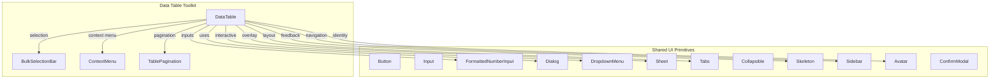

**Diagram sources**
- [button.tsx:1-63](file://src/components/ui/button.tsx#L1-L63)
- [input.tsx:1-22](file://src/components/ui/input.tsx#L1-L22)
- [formatted-number-input.tsx:1-83](file://src/components/ui/formatted-number-input.tsx#L1-L83)
- [dialog.tsx:1-159](file://src/components/ui/dialog.tsx#L1-L159)
- [dropdown-menu.tsx:1-258](file://src/components/ui/dropdown-menu.tsx#L1-L258)
- [sheet.tsx:1-140](file://src/components/ui/sheet.tsx#L1-L140)
- [tabs.tsx:1-92](file://src/components/ui/tabs.tsx#L1-L92)
- [collapsible.tsx:1-34](file://src/components/ui/collapsible.tsx#L1-L34)
- [skeleton.tsx:1-14](file://src/components/ui/skeleton.tsx#L1-L14)
- [sidebar.tsx:1-728](file://src/components/ui/sidebar.tsx#L1-L728)
- [avatar.tsx:1-54](file://src/components/ui/avatar.tsx#L1-L54)
- [confirm-modal.tsx:1-142](file://src/components/ui/confirm-modal.tsx#L1-L142)
- [data-table.tsx:1-83](file://src/components/data-table/data-table.tsx#L1-L83)
- [bulk-selection-bar.tsx:1-25](file://src/components/data-table/bulk-selection-bar.tsx#L1-L25)
- [context-menu.tsx:1-41](file://src/components/data-table/context-menu.tsx#L1-L41)
- [table-pagination.tsx:1-82](file://src/components/data-table/table-pagination.tsx#L1-L82)

**Section sources**
- [button.tsx:1-63](file://src/components/ui/button.tsx#L1-L63)
- [input.tsx:1-22](file://src/components/ui/input.tsx#L1-L22)
- [formatted-number-input.tsx:1-83](file://src/components/ui/formatted-number-input.tsx#L1-L83)
- [dialog.tsx:1-159](file://src/components/ui/dialog.tsx#L1-L159)
- [dropdown-menu.tsx:1-258](file://src/components/ui/dropdown-menu.tsx#L1-L258)
- [sheet.tsx:1-140](file://src/components/ui/sheet.tsx#L1-L140)
- [tabs.tsx:1-92](file://src/components/ui/tabs.tsx#L1-L92)
- [collapsible.tsx:1-34](file://src/components/ui/collapsible.tsx#L1-L34)
- [skeleton.tsx:1-14](file://src/components/ui/skeleton.tsx#L1-L14)
- [sidebar.tsx:1-728](file://src/components/ui/sidebar.tsx#L1-L728)
- [avatar.tsx:1-54](file://src/components/ui/avatar.tsx#L1-L54)
- [confirm-modal.tsx:1-142](file://src/components/ui/confirm-modal.tsx#L1-L142)
- [data-table.tsx:1-83](file://src/components/data-table/data-table.tsx#L1-L83)
- [bulk-selection-bar.tsx:1-25](file://src/components/data-table/bulk-selection-bar.tsx#L1-L25)
- [context-menu.tsx:1-41](file://src/components/data-table/context-menu.tsx#L1-L41)
- [table-pagination.tsx:1-82](file://src/components/data-table/table-pagination.tsx#L1-L82)

## Core Components
This section introduces the foundational UI primitives and their design system characteristics.

- Button
  - Variants: default, destructive, outline, secondary, ghost, link.
  - Sizes: default, sm, lg, icon, icon-sm, icon-lg.
  - Accessibility: focus-visible ring, aria-invalid integration, slot-based composition via asChild.
  - Composition: wraps either a native button or a Slot for flexible rendering.

- Input
  - Focus states: ring and border transitions on focus-visible.
  - Validation: aria-invalid integrates with destructive styling.
  - File inputs: consistent styling for file-like controls.

- FormattedNumberInput
  - Behavior: displays formatted thousands (ID locale), strips non-digits during input, removes leading zeros, returns numeric onChange.
  - UX: toggles between raw and formatted values based on focus state.

- Dialog
  - Composed parts: Root, Trigger, Portal, Overlay, Content, Header/Footer, Title, Description.
  - Animations: fade and zoom transitions driven by open state.
  - Close behavior: optional close button with accessible label.

- DropdownMenu
  - Composed parts: Root, Portal, Trigger, Content, Group, Item, Checkbox/Radio items, Label, Separator, Submenus.
  - Variants: item variants support destructive styling.
  - Accessibility: keyboard navigation, proper ARIA attributes, focus management.

- Sheet
  - Composed parts: Root, Trigger, Portal, Overlay, Content (supports sides: top/right/bottom/left), Header/Footer, Title, Description.
  - Animations: slide-in/out transitions per side.
  - Close behavior: overlay click and close button.

- Tabs
  - Variants: default and line styles for TabList.
  - Orientation: horizontal or vertical layout.
  - Active states: visual indicators and focus rings.

- Collapsible
  - Primitive wrapper for Radix Collapsible with composed Trigger and Content.

- Skeleton
  - Pulse animation for loading placeholders.

- Sidebar
  - Provider pattern manages expanded/collapsed state, cookies, and keyboard shortcuts.
  - Mobile vs desktop: Sheet-based off-canvas on mobile; fixed sidebar on desktop.
  - Extensive sub-components: Provider, Sidebar, Trigger, Rail, Header/Footer, Content, Group/Button/Action/Badge/Sub, Menu/Button/Action/Badge/Sub, and Inset/main container.

- Avatar
  - Root, Image, and Fallback wrappers with consistent sizing and overflow handling.

- ConfirmModal
  - Specialized confirmation dialog with optional soft-delete notice, hard-delete relation warnings, deactivation suggestion, and extra content area.

**Section sources**
- [button.tsx:1-63](file://src/components/ui/button.tsx#L1-L63)
- [input.tsx:1-22](file://src/components/ui/input.tsx#L1-L22)
- [formatted-number-input.tsx:1-83](file://src/components/ui/formatted-number-input.tsx#L1-L83)
- [dialog.tsx:1-159](file://src/components/ui/dialog.tsx#L1-L159)
- [dropdown-menu.tsx:1-258](file://src/components/ui/dropdown-menu.tsx#L1-L258)
- [sheet.tsx:1-140](file://src/components/ui/sheet.tsx#L1-L140)
- [tabs.tsx:1-92](file://src/components/ui/tabs.tsx#L1-L92)
- [collapsible.tsx:1-34](file://src/components/ui/collapsible.tsx#L1-L34)
- [skeleton.tsx:1-14](file://src/components/ui/skeleton.tsx#L1-L14)
- [sidebar.tsx:1-728](file://src/components/ui/sidebar.tsx#L1-L728)
- [avatar.tsx:1-54](file://src/components/ui/avatar.tsx#L1-L54)
- [confirm-modal.tsx:1-142](file://src/components/ui/confirm-modal.tsx#L1-L142)

## Architecture Overview
The UI architecture blends:
- HeroUI components for structured layouts, tables, modals, and inputs.
- Radix UI primitives for accessible, unstyled foundations (Dialog, DropdownMenu, Sheet, Tabs, Collapsible, Avatar).
- Custom components that standardize variants, sizes, and Tailwind-driven styling.

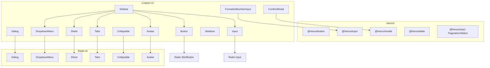

**Diagram sources**
- [button.tsx:1-63](file://src/components/ui/button.tsx#L1-L63)
- [input.tsx:1-22](file://src/components/ui/input.tsx#L1-L22)
- [formatted-number-input.tsx:1-83](file://src/components/ui/formatted-number-input.tsx#L1-L83)
- [dialog.tsx:1-159](file://src/components/ui/dialog.tsx#L1-L159)
- [dropdown-menu.tsx:1-258](file://src/components/ui/dropdown-menu.tsx#L1-L258)
- [sheet.tsx:1-140](file://src/components/ui/sheet.tsx#L1-L140)
- [tabs.tsx:1-92](file://src/components/ui/tabs.tsx#L1-L92)
- [collapsible.tsx:1-34](file://src/components/ui/collapsible.tsx#L1-L34)
- [sidebar.tsx:1-728](file://src/components/ui/sidebar.tsx#L1-L728)
- [avatar.tsx:1-54](file://src/components/ui/avatar.tsx#L1-L54)
- [confirm-modal.tsx:1-142](file://src/components/ui/confirm-modal.tsx#L1-L142)

## Detailed Component Analysis

### Button Component
- Purpose: Unified button primitive with variants and sizes.
- Design system: Uses class-variance-authority for variant/sizing tokens; integrates focus-visible and validation states.
- Composition: Supports asChild to render any element as a button.

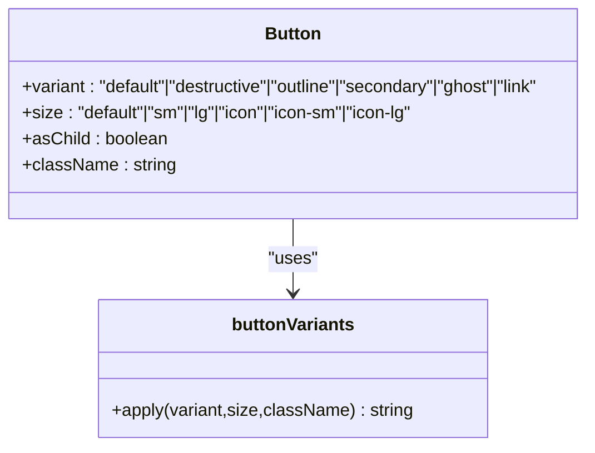

**Diagram sources**
- [button.tsx:7-37](file://src/components/ui/button.tsx#L7-L37)

**Section sources**
- [button.tsx:1-63](file://src/components/ui/button.tsx#L1-L63)

### Input and FormattedNumberInput
- Input: Standardized focus and validation styling with aria-invalid integration.
- FormattedNumberInput: Numeric formatting with ID locale, raw vs formatted display, onChange returning number.

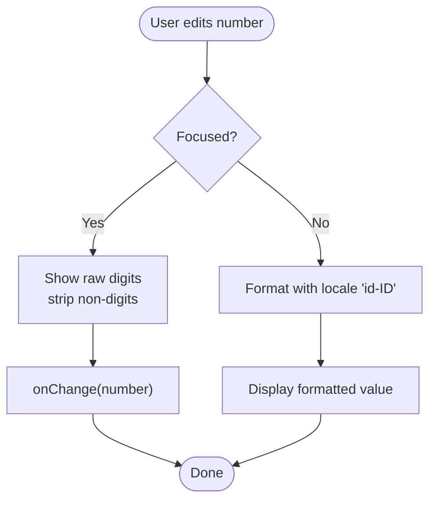

**Diagram sources**
- [formatted-number-input.tsx:30-82](file://src/components/ui/formatted-number-input.tsx#L30-L82)

**Section sources**
- [input.tsx:1-22](file://src/components/ui/input.tsx#L1-L22)
- [formatted-number-input.tsx:1-83](file://src/components/ui/formatted-number-input.tsx#L1-L83)

### Dialog and ConfirmModal
- Dialog: Composed primitives for overlays, content, and headers/footers with animations and optional close button.
- ConfirmModal: Specialized modal with contextual messaging, soft-delete notice, hard-delete relation list, deactivation suggestion, and extra content.

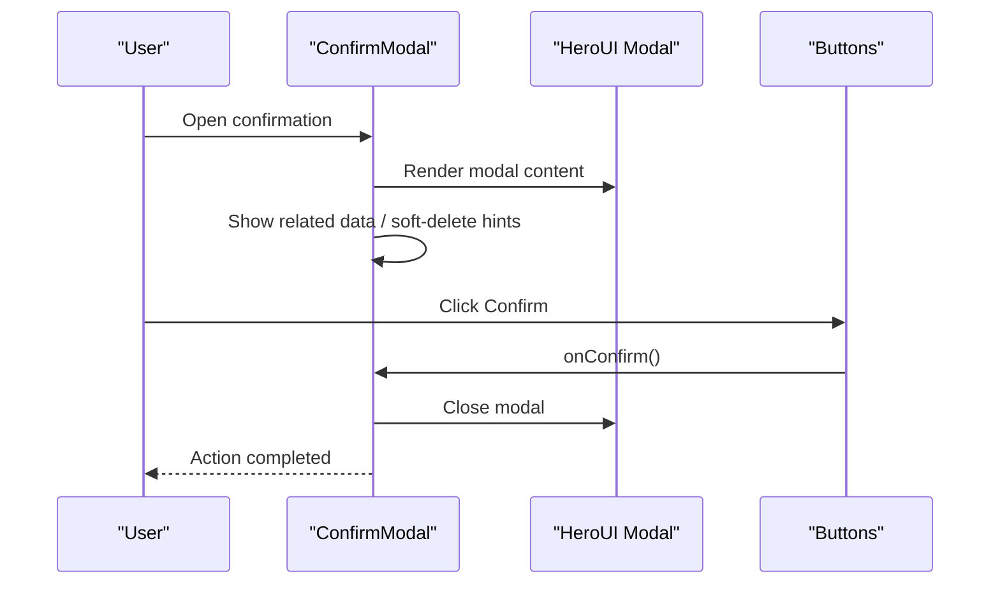

**Diagram sources**
- [confirm-modal.tsx:36-141](file://src/components/ui/confirm-modal.tsx#L36-L141)
- [dialog.tsx:50-82](file://src/components/ui/dialog.tsx#L50-L82)

**Section sources**
- [dialog.tsx:1-159](file://src/components/ui/dialog.tsx#L1-L159)
- [confirm-modal.tsx:1-142](file://src/components/ui/confirm-modal.tsx#L1-L142)

### DropdownMenu
- Features: Groups, items, checkboxes, radios, labels, separators, submenus, and keyboard navigation.
- Styling: Variant-aware destructive styling and inset spacing.

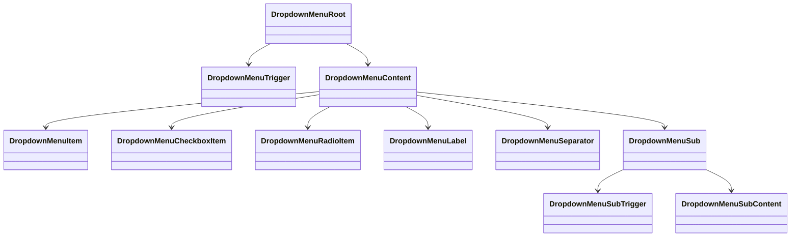

**Diagram sources**
- [dropdown-menu.tsx:9-257](file://src/components/ui/dropdown-menu.tsx#L9-L257)

**Section sources**
- [dropdown-menu.tsx:1-258](file://src/components/ui/dropdown-menu.tsx#L1-L258)

### Sheet
- Features: Side-specific sliding content, overlay, header/footer, and close button.
- Responsive: Intended for drawers and off-canvas panels.

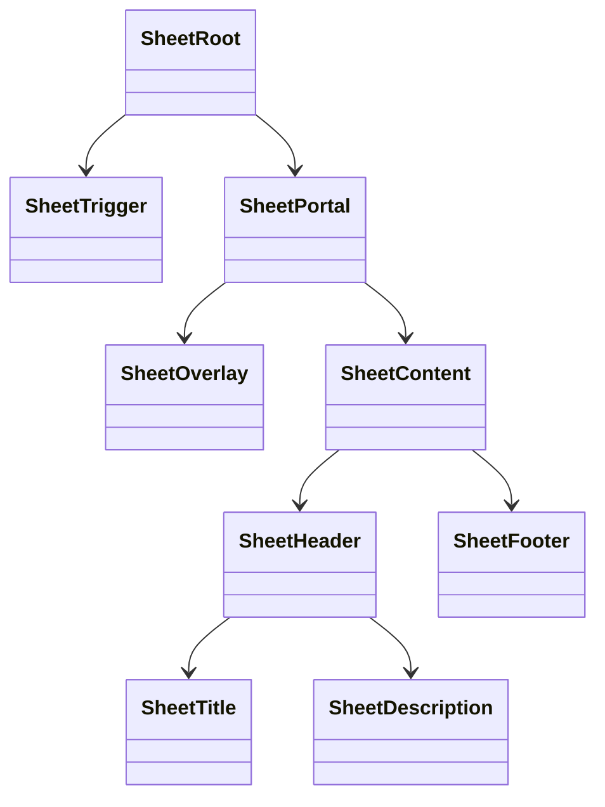

**Diagram sources**
- [sheet.tsx:9-139](file://src/components/ui/sheet.tsx#L9-L139)

**Section sources**
- [sheet.tsx:1-140](file://src/components/ui/sheet.tsx#L1-L140)

### Tabs
- Features: Horizontal/vertical orientation, default and line list variants, triggers with active state indicators.

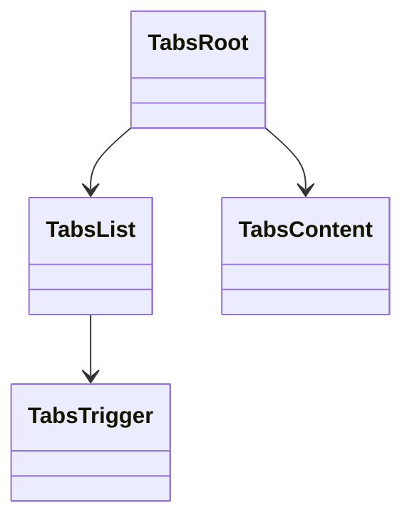

**Diagram sources**
- [tabs.tsx:9-91](file://src/components/ui/tabs.tsx#L9-L91)

**Section sources**
- [tabs.tsx:1-92](file://src/components/ui/tabs.tsx#L1-L92)

### Collapsible and Skeleton
- Collapsible: Primitive wrapper for expandable content.
- Skeleton: Animated pulse loader for async content.

**Section sources**
- [collapsible.tsx:1-34](file://src/components/ui/collapsible.tsx#L1-L34)
- [skeleton.tsx:1-14](file://src/components/ui/skeleton.tsx#L1-L14)

### Sidebar
- Features: Provider manages state, cookie persistence, keyboard shortcut, mobile Sheet, desktop fixed sidebar, extensive sub-components for groups, menus, actions, badges, and skeletons.
- Responsive: Adapts to mobile/off-canvas and desktop/fixed modes.

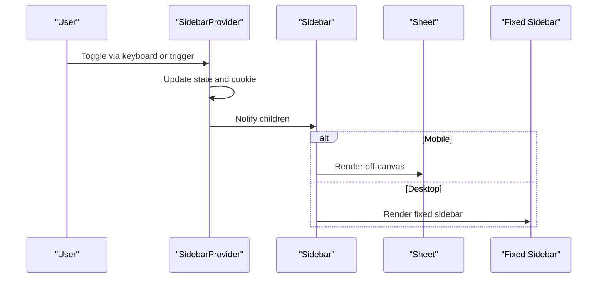

**Diagram sources**
- [sidebar.tsx:57-153](file://src/components/ui/sidebar.tsx#L57-L153)
- [sidebar.tsx:184-254](file://src/components/ui/sidebar.tsx#L184-L254)

**Section sources**
- [sidebar.tsx:1-728](file://src/components/ui/sidebar.tsx#L1-L728)

### Avatar
- Features: Root, Image, and Fallback with consistent sizing and overflow handling.

**Section sources**
- [avatar.tsx:1-54](file://src/components/ui/avatar.tsx#L1-L54)

### Data Table Toolkit
- DataTable: HeroUI Table with TableHeader/TableBody, selection support, loading state, and empty content.
- BulkSelectionBar: Bar indicating selected items with customizable label and actions.
- ContextMenu: Fixed-position menu with action variants and icons.
- TablePagination: Pagination with compact controls and optional row limit selector.

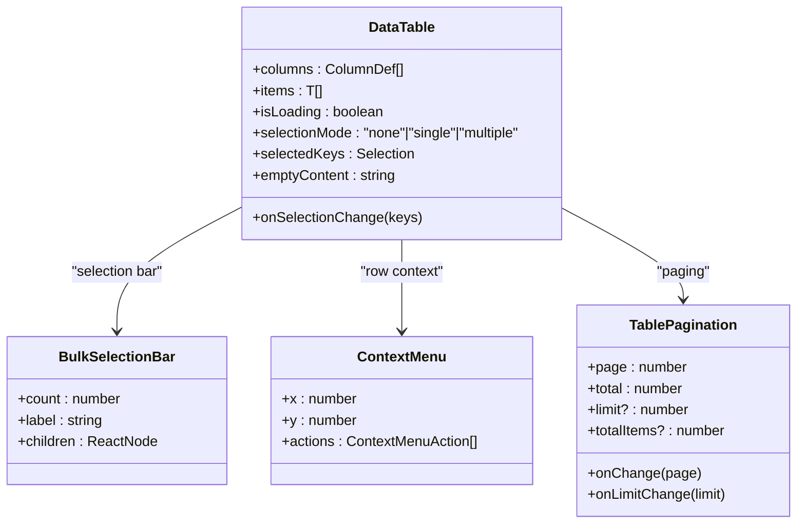

**Diagram sources**
- [data-table.tsx:21-35](file://src/components/data-table/data-table.tsx#L21-L35)
- [bulk-selection-bar.tsx:3-7](file://src/components/data-table/bulk-selection-bar.tsx#L3-L7)
- [context-menu.tsx:3-8](file://src/components/data-table/context-menu.tsx#L3-L8)
- [table-pagination.tsx:6-13](file://src/components/data-table/table-pagination.tsx#L6-L13)

**Section sources**
- [data-table.tsx:1-83](file://src/components/data-table/data-table.tsx#L1-L83)
- [bulk-selection-bar.tsx:1-25](file://src/components/data-table/bulk-selection-bar.tsx#L1-L25)
- [context-menu.tsx:1-41](file://src/components/data-table/context-menu.tsx#L1-L41)
- [table-pagination.tsx:1-82](file://src/components/data-table/table-pagination.tsx#L1-L82)

## Dependency Analysis
- HeroUI dependencies:
  - @heroui/table for tabular data.
  - @heroui/react for Pagination and Select used in TablePagination.
  - @heroui/input for FormattedNumberInput.
  - @heroui/modal for ConfirmModal.
  - @heroui/button for ConfirmModal actions.
- Radix UI dependencies:
  - @radix-ui/react-dialog for Sheet.
  - @radix-ui/react-dropdown-menu for DropdownMenu.
  - @radix-ui/react-tabs for Tabs.
  - @radix-ui/react-collapsible for Collapsible.
  - @radix-ui/react-avatar for Avatar.
  - @radix-ui/react-slot for Button’s asChild pattern.
- Utilities:
  - class-variance-authority for Button and Tabs variants.
  - lucide-react for icons.
  - Tailwind utility classes for styling.

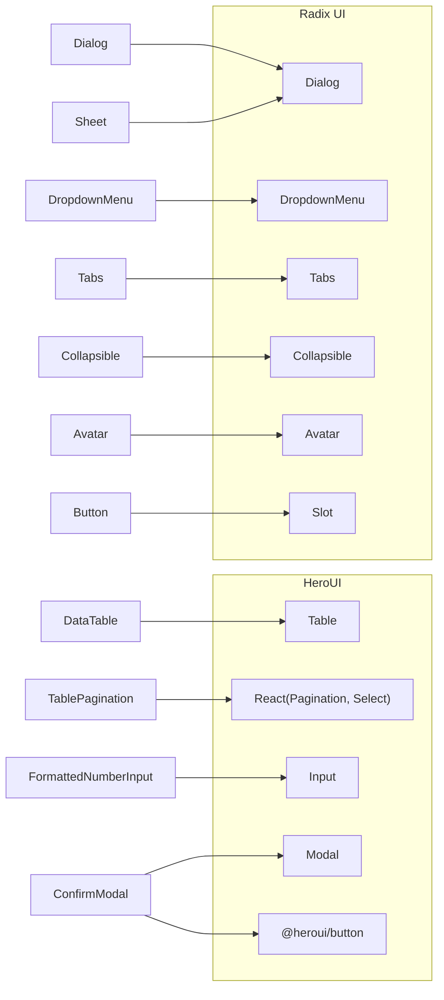

**Diagram sources**
- [button.tsx:1-63](file://src/components/ui/button.tsx#L1-L63)
- [dialog.tsx:1-159](file://src/components/ui/dialog.tsx#L1-L159)
- [sheet.tsx:1-140](file://src/components/ui/sheet.tsx#L1-L140)
- [dropdown-menu.tsx:1-258](file://src/components/ui/dropdown-menu.tsx#L1-L258)
- [tabs.tsx:1-92](file://src/components/ui/tabs.tsx#L1-L92)
- [collapsible.tsx:1-34](file://src/components/ui/collapsible.tsx#L1-L34)
- [avatar.tsx:1-54](file://src/components/ui/avatar.tsx#L1-L54)
- [formatted-number-input.tsx:1-83](file://src/components/ui/formatted-number-input.tsx#L1-L83)
- [confirm-modal.tsx:1-142](file://src/components/ui/confirm-modal.tsx#L1-L142)
- [table-pagination.tsx:1-82](file://src/components/data-table/table-pagination.tsx#L1-L82)
- [data-table.tsx:1-83](file://src/components/data-table/data-table.tsx#L1-L83)

**Section sources**
- [button.tsx:1-63](file://src/components/ui/button.tsx#L1-L63)
- [dialog.tsx:1-159](file://src/components/ui/dialog.tsx#L1-L159)
- [sheet.tsx:1-140](file://src/components/ui/sheet.tsx#L1-L140)
- [dropdown-menu.tsx:1-258](file://src/components/ui/dropdown-menu.tsx#L1-L258)
- [tabs.tsx:1-92](file://src/components/ui/tabs.tsx#L1-L92)
- [collapsible.tsx:1-34](file://src/components/ui/collapsible.tsx#L1-L34)
- [avatar.tsx:1-54](file://src/components/ui/avatar.tsx#L1-L54)
- [formatted-number-input.tsx:1-83](file://src/components/ui/formatted-number-input.tsx#L1-L83)
- [confirm-modal.tsx:1-142](file://src/components/ui/confirm-modal.tsx#L1-L142)
- [table-pagination.tsx:1-82](file://src/components/data-table/table-pagination.tsx#L1-L82)
- [data-table.tsx:1-83](file://src/components/data-table/data-table.tsx#L1-L83)

## Performance Considerations
- Prefer lightweight primitives (Radix UI) for accessibility and minimal overhead.
- Use Skeleton for perceived performance during async loads.
- Memoize widths and random values in skeletons to reduce reflows.
- Avoid unnecessary re-renders by passing stable callbacks and keys in DataTable.
- Keep Dialog/Sidebar content lazy-loaded when possible to minimize initial bundle size.

## Troubleshooting Guide
- Focus rings and validation:
  - Buttons and Inputs apply focus-visible rings and aria-invalid borders; ensure form libraries propagate validation state correctly.
- Dialog and Sheet overlays:
  - Verify Portal mounting and z-index stacking; ensure close handlers are attached to both overlay and close button.
- DropdownMenu keyboard navigation:
  - Confirm items are focusable and submenus open/close with arrow keys and Enter/Space.
- FormattedNumberInput:
  - onChange returns number; onBlur syncs display value; test edge cases like leading zeros and empty values.
- DataTable selection and pagination:
  - Ensure selectionMode and selectedKeys are controlled; verify onSelectionChange updates parent state; confirm pagination resets page on limit change.

**Section sources**
- [button.tsx:7-37](file://src/components/ui/button.tsx#L7-L37)
- [input.tsx:5-19](file://src/components/ui/input.tsx#L5-L19)
- [dialog.tsx:50-82](file://src/components/ui/dialog.tsx#L50-L82)
- [sheet.tsx:56-81](file://src/components/ui/sheet.tsx#L56-L81)
- [dropdown-menu.tsx:70-83](file://src/components/ui/dropdown-menu.tsx#L70-L83)
- [formatted-number-input.tsx:30-82](file://src/components/ui/formatted-number-input.tsx#L30-L82)
- [data-table.tsx:39-82](file://src/components/data-table/data-table.tsx#L39-L82)
- [table-pagination.tsx:15-81](file://src/components/data-table/table-pagination.tsx#L15-L81)

## Conclusion
The UI component system combines HeroUI for structured, accessible layouts with Radix UI primitives for robust, unstyled foundations. Custom components standardize variants, sizes, and Tailwind-based styling, enabling consistent design and rapid development. The data table toolkit provides selection, context menus, and pagination tailored for business data. Following the patterns documented here ensures maintainable, accessible, and performant UI across the application.

## Appendices

### Practical Usage Examples
- Button
  - Use variant="outline" for secondary actions; size="icon" for toolbar icons; asChild to render Link inside Button.
- Input
  - Apply aria-invalid on controlled inputs; combine with FormattedNumberInput for currency/quantity fields.
- Dialog
  - Wrap actions in DialogFooter; use DialogHeader/Title/Description for structured modals.
- DropdownMenu
  - Use variant="destructive" for dangerous actions; nest Sub menus for grouped options.
- Sheet
  - Place filters in Sheet content; use SheetHeader for titles and SheetFooter for actions.
- Tabs
  - Use line variant for dense contexts; manage active tab via state.
- Collapsible
  - Pair with Icons to indicate expand/collapse state.
- Sidebar
  - Use SidebarProvider with defaultOpen; place navigation in SidebarContent; actions in SidebarFooter.
- Avatar
  - Combine Avatar with Tooltip for user profiles.
- DataTable
  - Provide renderRow returning a single TableRow with direct TableCell children; wire selectionMode and onSelectionChange; pass isLoading and emptyContent.

### Customization and Theme Guidelines
- Variants and sizes:
  - Extend Button and Tabs variants via class-variance-authority tokens; keep naming consistent.
- Tailwind utilities:
  - Centralize spacing and colors in Tailwind config; avoid ad-hoc color classes.
- Dark mode:
  - Use dark:* variants for contrast adjustments; test focus-visible rings and validation borders.
- Accessibility:
  - Ensure all interactive elements have focus-visible rings; provide sr-only labels for close buttons; use aria-* attributes where primitives require them.
- Cross-browser:
  - Test focus-visible polyfills if needed; verify animations and transforms across browsers.

### Extending the Component Library
- New primitives:
  - Base on Radix UI for accessibility; wrap with Tailwind classes; export composed parts.
- Data components:
  - Follow DataTable’s renderRow contract; provide selection and pagination props; reuse BulkSelectionBar and ContextMenu.
- Theming:
  - Define semantic tokens in Tailwind; map tokens to component variants; keep overrides minimal.